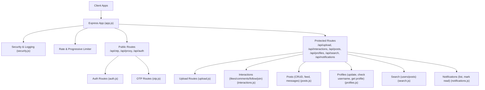
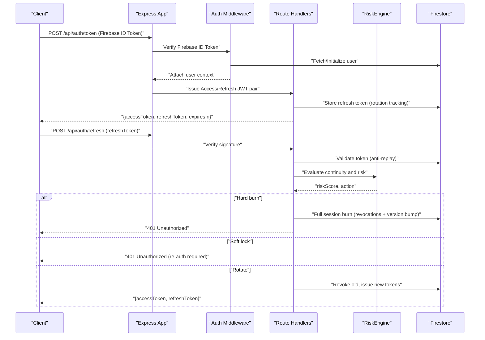
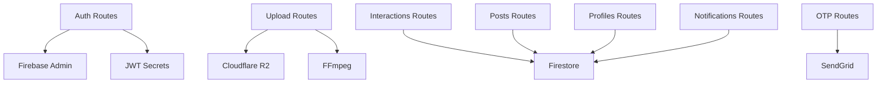

# API Documentation

<cite>
**Referenced Files in This Document**
- [auth.js](file://backend/src/routes/auth.js)
- [posts.js](file://backend/src/routes/posts.js)
- [interactions.js](file://backend/src/routes/interactions.js)
- [profiles.js](file://backend/src/routes/profiles.js)
- [notifications.js](file://backend/src/routes/notifications.js)
- [search.js](file://backend/src/routes/search.js)
- [upload.js](file://backend/src/routes/upload.js)
- [otp.js](file://backend/src/routes/otp.js)
- [auth.js](file://backend/src/middleware/auth.js)
- [rateLimiter.js](file://backend/src/middleware/rateLimiter.js)
- [security.js](file://backend/src/middleware/security.js)
- [RiskEngine.js](file://backend/src/services/RiskEngine.js)
- [app.js](file://backend/src/app.js)
- [.env.example](file://backend/.env.example)
- [package.json](file://backend/package.json)
</cite>

## Table of Contents
1. [Introduction](#introduction)
2. [Project Structure](#project-structure)
3. [Core Components](#core-components)
4. [Architecture Overview](#architecture-overview)
5. [Detailed Component Analysis](#detailed-component-analysis)
6. [Dependency Analysis](#dependency-analysis)
7. [Performance Considerations](#performance-considerations)
8. [Troubleshooting Guide](#troubleshooting-guide)
9. [Conclusion](#conclusion)
10. [Appendices](#appendices)

## Introduction
This document provides comprehensive API documentation for the LocalMe backend REST endpoints. It covers authentication and security flows, post management (CRUD, media upload, comments, likes), user management (profile, follow, search), notifications (retrieve and mark read), and OTP endpoints. For each endpoint, you will find HTTP method, URL pattern, request/response considerations, authentication requirements, error handling, rate limiting behavior, and versioning details. Guidance for common use cases, client implementation, and integration examples is also included.

## Project Structure
The backend is an Express.js application with modular route handlers and middleware for security, rate limiting, and authentication. Routes are grouped by domain: auth, posts, interactions, profiles, notifications, search, upload, and OTP. Authentication is enforced via a custom JWT short-lived access token backed by Firebase ID tokens, with refresh token rotation and risk-aware validation.

**Diagram sources**
- [app.js](file://backend/src/app.js#L31-L61)
- [auth.js](file://backend/src/routes/auth.js#L15-L301)
- [otp.js](file://backend/src/routes/otp.js#L15-L133)
- [upload.js](file://backend/src/routes/upload.js#L80-L225)
- [interactions.js](file://backend/src/routes/interactions.js#L24-L522)
- [posts.js](file://backend/src/routes/posts.js#L58-L728)
- [profiles.js](file://backend/src/routes/profiles.js#L25-L258)
- [search.js](file://backend/src/routes/search.js#L7-L52)
- [notifications.js](file://backend/src/routes/notifications.js#L7-L51)

**Section sources**
- [app.js](file://backend/src/app.js#L1-L78)

## Core Components
- Authentication and Token Management
  - Exchange Firebase ID token for custom access/refresh token pair with versioning and rotation.
  - Refresh token rotation with anti-replay, device continuity, and risk scoring.
  - Custom JWT access tokens with version checks and caching.
- Post Management
  - Create posts with safety checks, event governance, and geohash indexing.
  - Feed with multi-ring locality expansion, caching, and anti-scraping jitter.
  - Retrieve, delete, and privacy-aware single post view.
  - Comments and messaging for posts.
- Interactions
  - Like/unlike with transactional counters and notifications.
  - Comment creation with transactional counters and notifications.
  - Follow/unfollow with transactional counters and notifications.
  - Event join/leave with dual membership tracking.
  - Batch-like checks optimized for feed rendering.
- User Management
  - Profile updates with normalization, username availability checks, and role restrictions.
  - Username availability check endpoint.
  - Profile retrieval with self-healing for authenticated owners.
- Notifications
  - List notifications for the current user.
  - Mark a notification as read with ownership validation.
- Search
  - Prefix-based search for users or posts.
- Media Upload
  - Profile image upload.
  - Post media upload with format validation, magic-byte checks, optional video processing, and R2 storage.
- OTP
  - Send and verify 6-digit OTPs with expiration and email delivery via SendGrid.

**Section sources**
- [auth.js](file://backend/src/routes/auth.js#L15-L301)
- [auth.js](file://backend/src/middleware/auth.js#L14-L164)
- [RiskEngine.js](file://backend/src/services/RiskEngine.js#L4-L170)
- [posts.js](file://backend/src/routes/posts.js#L58-L728)
- [interactions.js](file://backend/src/routes/interactions.js#L24-L522)
- [profiles.js](file://backend/src/routes/profiles.js#L25-L258)
- [notifications.js](file://backend/src/routes/notifications.js#L7-L51)
- [search.js](file://backend/src/routes/search.js#L7-L52)
- [upload.js](file://backend/src/routes/upload.js#L80-L225)
- [otp.js](file://backend/src/routes/otp.js#L15-L133)

## Architecture Overview
The backend enforces layered security:
- Transport and request hardening via Helmet and CORS.
- Authentication via custom JWT (short-lived) with fallback to Firebase ID tokens.
- Refresh token rotation with device/IP continuity and risk evaluation.
- Rate limiting and progressive throttling keyed by IP or user ID.
- Firestore transactions for atomic counters and cascading deletes.
- Optional real-time notifications written to Firestore.

**Diagram sources**
- [auth.js](file://backend/src/routes/auth.js#L15-L301)
- [auth.js](file://backend/src/middleware/auth.js#L14-L164)
- [RiskEngine.js](file://backend/src/services/RiskEngine.js#L71-L130)

**Section sources**
- [auth.js](file://backend/src/routes/auth.js#L15-L301)
- [auth.js](file://backend/src/middleware/auth.js#L14-L164)
- [RiskEngine.js](file://backend/src/services/RiskEngine.js#L4-L170)

## Detailed Component Analysis

### Authentication Endpoints
- Base Path: /api/auth
- Authentication: Not required for token exchange; requires Firebase ID token.
- Security: Custom JWT access token with 15-minute TTL; refresh token with 30-day TTL and rotation; device/IP continuity; risk scoring; global kill switch via token version.

Endpoints
- POST /api/auth/token
  - Description: Exchanges a Firebase ID token for a custom access/refresh token pair.
  - Auth: Public (requires Firebase ID token).
  - Request: { idToken: string }.
  - Response: { success: boolean, data: { accessToken: string, refreshToken: string, expiresIn: number } }.
  - Errors: 400 (missing token), 401 (invalid/expired token), 500 (configuration or internal error).
  - Notes: Initializes user profile if missing; stores refresh token for rotation tracking.

- POST /api/auth/refresh
  - Description: Issues a new access/refresh pair using a valid refresh token.
  - Auth: Public.
  - Request: { refreshToken: string }.
  - Response: { success: boolean, data: { accessToken: string, refreshToken: string, expiresIn: number } }.
  - Errors: 400 (missing token), 401 (invalid/expired/compromised), 500 (internal).
  - Security: Anti-replay, device continuity, session continuity engine, risk decay and thresholds, optional full session burn.

- GET /api/auth/debug
  - Description: Debug endpoint to verify Firebase project configuration.
  - Auth: Public.
  - Response: { success: boolean, data: { projectId: string, nodeEnv: string, hasPrivateKey: boolean, clientEmail: string, timestamp: string } }.

Common Use Cases
- Initial sign-in: Client obtains Firebase ID token from Firebase, then calls /api/auth/token to receive custom tokens.
- Token refresh: Client calls /api/auth/refresh with stored refresh token; on success, updates stored tokens.
- Compromise handling: If refresh fails with 401, client should prompt re-authentication; full session burn may occur.

**Section sources**
- [auth.js](file://backend/src/routes/auth.js#L15-L301)
- [auth.js](file://backend/src/middleware/auth.js#L14-L164)
- [RiskEngine.js](file://backend/src/services/RiskEngine.js#L71-L130)

### Post Management Endpoints
- Base Path: /api/posts
- Authentication: Required for all except feed retrieval.

Endpoints
- POST /api/posts
  - Description: Create a new post with safety checks and optional event governance.
  - Auth: Required.
  - Request: Post payload with allowed fields (title, body/text, category, city, country, mediaUrl, mediaType, thumbnailUrl, location, tags, isEvent, event dates, eventLocation, isFree, eventType, subtitle, plus id/authorId).
  - Response: { success: boolean, data: Post document with computed fields }.
  - Errors: 400 (validation), 403 (account too new), 500 (internal).
  - Notes: Transactionally creates post; optionally creates event group/member; invalidates feed cache; logs audit.

- GET /api/posts
  - Description: Paginated feed with cursor validation; supports authorId, category, city, country, and geo proximity via lat/lng.
  - Auth: Required.
  - Query: { authorId?, category?, city?, lat?, lng?, country?, limit: 1-50, afterId? }.
  - Response: { success: boolean, data: Post[], pagination: { cursor: string|null, hasMore: boolean } }.
  - Behavior: Multi-ring locality expansion around lat/lng; in-memory feed cache with TTL; promise locks to prevent dog-piling; anti-scraping jitter.

- GET /api/posts/:id
  - Description: Retrieve a single post by ID with privacy checks.
  - Auth: Required.
  - Response: Post object with computed event dates/status and isLiked flag.

- DELETE /api/posts/:id
  - Description: Delete a post (author or admin); cascade deletes for events.
  - Auth: Required.
  - Response: { success: boolean, data: { message: string } }.
  - Errors: 403 (unauthorized), 404 (not found).

- POST /api/posts/:id/messages
  - Description: Send a chat message for an event/post.
  - Auth: Required.
  - Request: { text: string }.
  - Response: Message object.

- GET /api/posts/:id/messages
  - Description: Retrieve chat messages for an event/post.
  - Auth: Required.
  - Response: Array of messages ordered by timestamp desc.

Common Use Cases
- Feed browsing: Call GET /api/posts with optional filters; use afterId for pagination.
- Posting content: Validate content, optionally set isEvent with dates; POST /api/posts; on success, invalidate feed cache.
- Messaging: Use POST/GET /api/posts/:id/messages for event discussions.

**Section sources**
- [posts.js](file://backend/src/routes/posts.js#L58-L728)

### Interactions Endpoints
- Base Path: /api/interactions
- Authentication: Required for all.

Endpoints
- POST /api/interactions/like
  - Description: Like or unlike a post atomically; increments/decrements counter; sends notification to author.
  - Auth: Required.
  - Request: { postId: string }.
  - Response: { success: boolean, data: { status: "active" } }.
  - Errors: 400 (validation), 500 (internal).

- POST /api/interactions/comment
  - Description: Add a top-level comment; increments post commentCount; sends notification to author.
  - Auth: Required.
  - Request: { postId: string, text: string }.
  - Response: { success: boolean, data: { commentId: string } }.
  - Errors: 500 (internal).

- POST /api/interactions/follow
  - Description: Follow or unfollow a user; increments/decrements counters; sends notification to target.
  - Auth: Required.
  - Request: { targetUserId: string }.
  - Response: { success: boolean, data: { status: "active" } }.
  - Errors: 500 (internal).

- POST /api/interactions/event/join
  - Description: Join or leave an event; maintains attendance and group membership; increments/decrements attendeeCount.
  - Auth: Required.
  - Request: { eventId: string }.
  - Response: { success: boolean, data: { status: "active" } }.
  - Errors: 500 (internal).

- GET /api/interactions/comments/:postId
  - Description: Retrieve comments for a post.
  - Auth: Required.
  - Response: Array of comments ordered by timestamp desc.

- POST /api/interactions/likes/batch
  - Description: Check likes for multiple post IDs in chunks (<=30 per chunk).
  - Auth: Required.
  - Request: { postIds: string[] }.
  - Response: { success: boolean, data: Record<string, boolean> }.

- GET /api/interactions/likes/check
  - Description: Check if current user liked a post and get canonical likeCount.
  - Auth: Required.
  - Query: { postId: string }.
  - Response: { success: boolean, data: { liked: boolean, likeCount: number } }.

- GET /api/interactions/follows/check
  - Description: Check if current user follows a target user.
  - Auth: Required.
  - Query: { targetUserId: string }.
  - Response: { success: boolean, data: { followed: boolean } }.

- GET /api/interactions/events/check
  - Description: Check if current user is attending an event.
  - Auth: Required.
  - Query: { eventId: string }.
  - Response: { success: boolean, data: { attending: boolean } }.

- GET /api/interactions/events/my-events
  - Description: Return event IDs the current user has joined.
  - Auth: Required.
  - Response: { success: boolean, data: { eventIds: string[] } }.

Common Use Cases
- Feed interactions: Use batch likes to pre-check liked state; like/unlike toggles; follow/unfollow; join/leave events.
- Author notifications: Likes and comments trigger notifications automatically.

**Section sources**
- [interactions.js](file://backend/src/routes/interactions.js#L24-L522)

### User Management Endpoints
- Base Path: /api/profiles
- Authentication: Required for profile updates and retrieval; username check is public.

Endpoints
- PATCH /api/profiles/me
  - Description: Update current user profile with normalization and validation.
  - Auth: Required.
  - Request: Partial profile fields (displayName, username, firstName, lastName, about, profileImageUrl, location, fcmToken, role).
  - Response: { success: boolean, data: { message: string } }.
  - Errors: 400 (validation), 403 (role change unauthorized), 409 (username taken).
  - Notes: Role changes require admin; username uniqueness enforced; display name auto-computed.

- GET /api/profiles/check-username
  - Description: Check if a username is available.
  - Auth: Public.
  - Query: { username: string }.
  - Response: { success: boolean, data: { available: boolean } }.

- GET /api/profiles/:uid
  - Description: Get user profile by UID; self-heals for authenticated owner.
  - Auth: Required.
  - Response: Public profile data; owner/admin can see email/role.

Common Use Cases
- Profile onboarding: On first read by owner, minimal profile is bootstrapped.
- Username management: Use check-username before patch; enforce uniqueness.

**Section sources**
- [profiles.js](file://backend/src/routes/profiles.js#L25-L258)

### Notification Endpoints
- Base Path: /api/notifications
- Authentication: Required.

Endpoints
- GET /api/notifications
  - Description: Get current user notifications.
  - Auth: Required.
  - Response: Array of notifications ordered by timestamp desc.

- PATCH /api/notifications/:id/read
  - Description: Mark a notification as read; validates ownership.
  - Auth: Required.
  - Response: { success: boolean }.
  - Errors: 403 (unauthorized), 404 (not found).

Common Use Cases
- Polling: Periodically fetch notifications; mark as read after viewing.
- Real-time: Notifications are persisted to Firestore; clients can subscribe to Firestore or implement polling.

**Section sources**
- [notifications.js](file://backend/src/routes/notifications.js#L7-L51)

### Search Endpoints
- Base Path: /api/search
- Authentication: Required.

Endpoints
- GET /api/search
  - Description: Search for users or posts by prefix.
  - Auth: Required.
  - Query: { q: string, type: "users"|"posts", limit: number (max 50) }.
  - Response: { success: boolean, data: array of results }.
  - Notes: Users use username prefix; posts use text prefix; composite indexes recommended for optimal performance.

Common Use Cases
- Autocomplete: Use type=users for user suggestions; type=posts for content search.

**Section sources**
- [search.js](file://backend/src/routes/search.js#L7-L52)

### Media Upload Endpoints
- Base Path: /api/upload
- Authentication: Required.
- Limits: Memory-only multer upload with 200 MB file size limit; daily upload limits enforced; progressive rate limiter applies.

Endpoints
- POST /api/upload/profile
  - Description: Upload a profile image.
  - Auth: Required.
  - Form: file (single).
  - Response: { key: string, url: string }.
  - Errors: 400 (unsupported format), 500 (upload failed).

- POST /api/upload/post
  - Description: Upload post media (image/video).
  - Auth: Required.
  - Form: file (single), body: { mediaType: "image"|"video", postId?: string }.
  - Response: { key: string, url: string }.
  - Errors: 400 (unsupported format), 500 (upload failed).
  - Notes: Video processing trims/compresses to consistent MP4; R2 storage with public caching headers.

Common Use Cases
- Image posting: Set mediaType=image; upload to R2; use returned URL in post creation.
- Video posting: Set mediaType=video; upload processed MP4; use returned URL in post creation.

**Section sources**
- [upload.js](file://backend/src/routes/upload.js#L80-L225)

### OTP Endpoints
- Base Path: /api/otp
- Authentication: Not required.

Endpoints
- POST /api/otp/send
  - Description: Generate and send a 6-digit OTP to the given email.
  - Auth: Not required.
  - Request: { email: string }.
  - Response: { message: string }.
  - Errors: 400 (validation), 500 (email service not configured or send failure).

- POST /api/otp/verify
  - Description: Verify OTP for the given email.
  - Auth: Not required.
  - Request: { email: string, otp: string (6 digits) }.
  - Response: { message: string }.
  - Errors: 400 (expired or invalid OTP), 404 (no OTP found), 500 (verification failed).

Common Use Cases
- Email verification: Send OTP, then verify; integrate with auth flows.

**Section sources**
- [otp.js](file://backend/src/routes/otp.js#L15-L133)

## Dependency Analysis
- Route Dependencies
  - All protected routes depend on authentication middleware and progressive rate limiter.
  - Auth routes depend on Firebase Admin SDK and JWT secrets.
  - Upload routes depend on Cloudflare R2 client and video processing utilities.
  - Interactions and posts depend on Firestore transactions and audit service.
- Security Dependencies
  - Helmet and CORS for transport security.
  - RiskEngine for refresh token risk evaluation and session continuity.
- External Integrations
  - Firebase Admin for ID token verification and user data.
  - SendGrid for OTP emails.
  - Cloudflare R2 for media storage.

**Diagram sources**
- [auth.js](file://backend/src/routes/auth.js#L15-L301)
- [upload.js](file://backend/src/routes/upload.js#L80-L225)
- [interactions.js](file://backend/src/routes/interactions.js#L24-L522)
- [posts.js](file://backend/src/routes/posts.js#L58-L728)
- [profiles.js](file://backend/src/routes/profiles.js#L25-L258)
- [notifications.js](file://backend/src/routes/notifications.js#L7-L51)
- [otp.js](file://backend/src/routes/otp.js#L15-L133)

**Section sources**
- [auth.js](file://backend/src/routes/auth.js#L15-L301)
- [upload.js](file://backend/src/routes/upload.js#L80-L225)
- [interactions.js](file://backend/src/routes/interactions.js#L24-L522)
- [posts.js](file://backend/src/routes/posts.js#L58-L728)
- [profiles.js](file://backend/src/routes/profiles.js#L25-L258)
- [notifications.js](file://backend/src/routes/notifications.js#L7-L51)
- [otp.js](file://backend/src/routes/otp.js#L15-L133)

## Performance Considerations
- Feed Retrieval
  - Multi-ring locality expansion with caching and promise locks prevents hot-spotting.
  - Anti-scraping jitter adds randomized delays for initial page loads.
  - Composite indexes recommended for filtered queries to avoid 500 errors.
- Uploads
  - Memory-only uploads with 200 MB limit; video processing trims/compresses to reduce size.
  - Daily upload limits enforced to prevent abuse.
- Rate Limiting
  - General and auth-specific limits apply; progressive limiter adapts to user/device behavior.
- Transactions
  - Atomic counters and cascading deletes ensure consistency under concurrent load.

[No sources needed since this section provides general guidance]

## Troubleshooting Guide
- Authentication Failures
  - 401 Token expired or invalid: Use /api/auth/refresh if available; otherwise re-authenticate with Firebase ID token.
  - 401 Session compromised: Full session burn occurred; client must re-authenticate.
  - 403 Account suspended: Contact support or re-onboard.
- Rate Limiting
  - 429 Too many requests: Back off and retry; consider reducing request frequency or batching.
- Feed Issues
  - Missing composite index error: Add required Firestore composite index for filtered queries.
- Upload Issues
  - Unsupported format: Ensure image/video MIME type is supported; verify magic bytes pass validation.
  - Video processing failures: Check FFmpeg availability and disk space.
- Notifications
  - Read status not updating: Ensure ownership validation passes; verify notification ID exists.

**Section sources**
- [auth.js](file://backend/src/routes/auth.js#L166-L280)
- [auth.js](file://backend/src/middleware/auth.js#L14-L164)
- [RiskEngine.js](file://backend/src/services/RiskEngine.js#L136-L168)
- [rateLimiter.js](file://backend/src/middleware/rateLimiter.js#L5-L76)
- [posts.js](file://backend/src/routes/posts.js#L469-L477)
- [upload.js](file://backend/src/routes/upload.js#L140-L225)
- [notifications.js](file://backend/src/routes/notifications.js#L35-L48)

## Conclusion
The LocalMe backend provides a secure, scalable REST API with robust authentication, refresh token rotation, and risk-aware validation. Its modular design separates concerns across posts, interactions, profiles, notifications, search, and uploads, while applying consistent rate limiting and security headers. Clients should implement token refresh flows, handle session burns gracefully, and leverage batch endpoints for efficient feed rendering.

[No sources needed since this section summarizes without analyzing specific files]

## Appendices

### Endpoint Reference Summary
- Authentication
  - POST /api/auth/token
  - POST /api/auth/refresh
  - GET /api/auth/debug
- Posts
  - POST /api/posts
  - GET /api/posts
  - GET /api/posts/:id
  - DELETE /api/posts/:id
  - POST /api/posts/:id/messages
  - GET /api/posts/:id/messages
- Interactions
  - POST /api/interactions/like
  - POST /api/interactions/comment
  - POST /api/interactions/follow
  - POST /api/interactions/event/join
  - GET /api/interactions/comments/:postId
  - POST /api/interactions/likes/batch
  - GET /api/interactions/likes/check
  - GET /api/interactions/follows/check
  - GET /api/interactions/events/check
  - GET /api/interactions/events/my-events
- Profiles
  - PATCH /api/profiles/me
  - GET /api/profiles/check-username
  - GET /api/profiles/:uid
- Notifications
  - GET /api/notifications
  - PATCH /api/notifications/:id/read
- Search
  - GET /api/search
- Upload
  - POST /api/upload/profile
  - POST /api/upload/post
- OTP
  - POST /api/otp/send
  - POST /api/otp/verify

**Section sources**
- [auth.js](file://backend/src/routes/auth.js#L15-L301)
- [posts.js](file://backend/src/routes/posts.js#L58-L728)
- [interactions.js](file://backend/src/routes/interactions.js#L24-L522)
- [profiles.js](file://backend/src/routes/profiles.js#L25-L258)
- [notifications.js](file://backend/src/routes/notifications.js#L7-L51)
- [search.js](file://backend/src/routes/search.js#L7-L52)
- [upload.js](file://backend/src/routes/upload.js#L80-L225)
- [otp.js](file://backend/src/routes/otp.js#L15-L133)

### Authentication Requirements
- All protected endpoints require a Bearer token.
- Preferred: Custom JWT access token (short-lived).
- Fallback: Firebase ID token with revocation check enabled.

**Section sources**
- [auth.js](file://backend/src/middleware/auth.js#L14-L164)
- [auth.js](file://backend/src/routes/auth.js#L15-L301)

### Rate Limiting Details
- General API limiter: 1000 requests per 15 minutes per IP.
- Auth limiter: 5 requests per 15 minutes per IP.
- Upload limiter: 20 requests per 15 minutes per IP.
- Progressive limiter: Adapts to user/device behavior; applies per route group.
- Health check: More permissive limiter.

**Section sources**
- [rateLimiter.js](file://backend/src/middleware/rateLimiter.js#L5-L76)
- [app.js](file://backend/src/app.js#L37-L60)

### Versioning Details
- Custom JWT includes a version field; refresh token carries version and JTI.
- Global kill switch: Incrementing user tokenVersion invalidates all access tokens.
- Refresh token rotation maintains chain via parentJti.

**Section sources**
- [auth.js](file://backend/src/routes/auth.js#L114-L124)
- [auth.js](file://backend/src/routes/auth.js#L194-L200)
- [RiskEngine.js](file://backend/src/services/RiskEngine.js#L136-L168)

### Environment Variables
- Required for deployment:
  - FIREBASE_PROJECT_ID, FIREBASE_PRIVATE_KEY, FIREBASE_CLIENT_EMAIL
  - R2_ACCOUNT_ID, R2_ACCESS_KEY_ID, R2_SECRET_ACCESS_KEY, R2_BUCKET_NAME, R2_PUBLIC_BASE_URL
  - SENDGRID_API_KEY, SENDGRID_FROM_EMAIL
  - CORS_ALLOWED_ORIGINS (comma-separated)
- Example values are provided in .env.example.

**Section sources**
- [.env.example](file://backend/.env.example#L1-L25)
- [package.json](file://backend/package.json#L24-L55)

### Client Implementation Guidelines
- Token lifecycle
  - Obtain Firebase ID token from Firebase; call /api/auth/token to receive custom tokens.
  - Store refresh token securely; rotate periodically via /api/auth/refresh.
  - On 401 token-expired or session-expired, refresh or re-authenticate.
- Feed rendering
  - Use GET /api/posts with limit and afterId; embed like state via batch likes endpoint.
  - Respect anti-scraping jitter and cache TTL.
- Uploads
  - Use POST /api/upload/profile or POST /api/upload/post; handle 400/500 errors gracefully.
  - For videos, expect MP4 output and updated key extension.
- Notifications
  - Poll GET /api/notifications; mark read via PATCH /api/notifications/:id/read.
- Search
  - Use GET /api/search with type=users or type=posts; enforce limit ≤ 50.

**Section sources**
- [auth.js](file://backend/src/routes/auth.js#L15-L301)
- [posts.js](file://backend/src/routes/posts.js#L333-L527)
- [upload.js](file://backend/src/routes/upload.js#L124-L225)
- [notifications.js](file://backend/src/routes/notifications.js#L7-L51)
- [search.js](file://backend/src/routes/search.js#L7-L52)