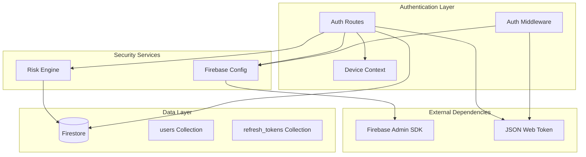
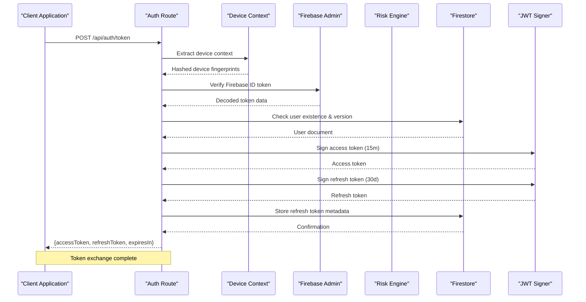
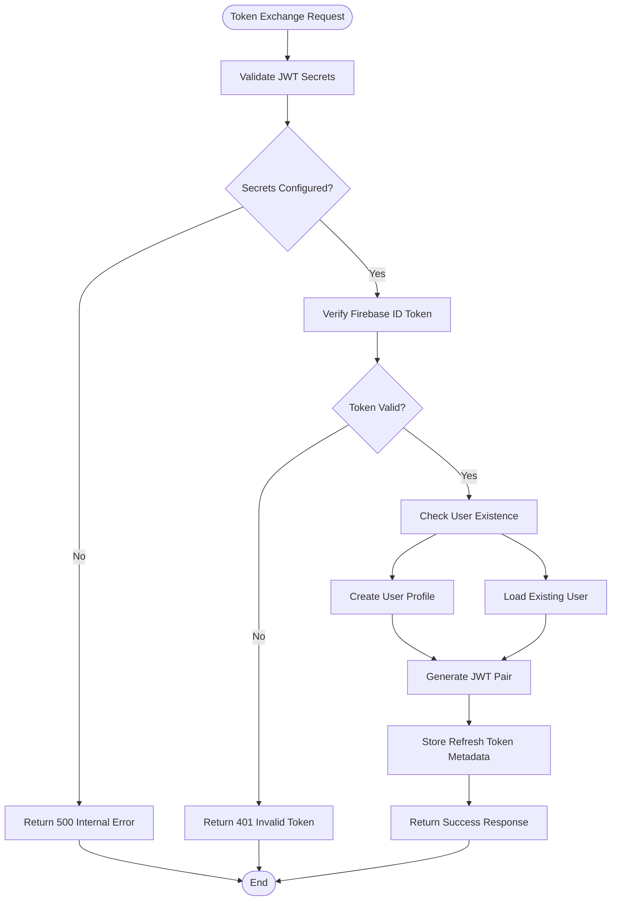
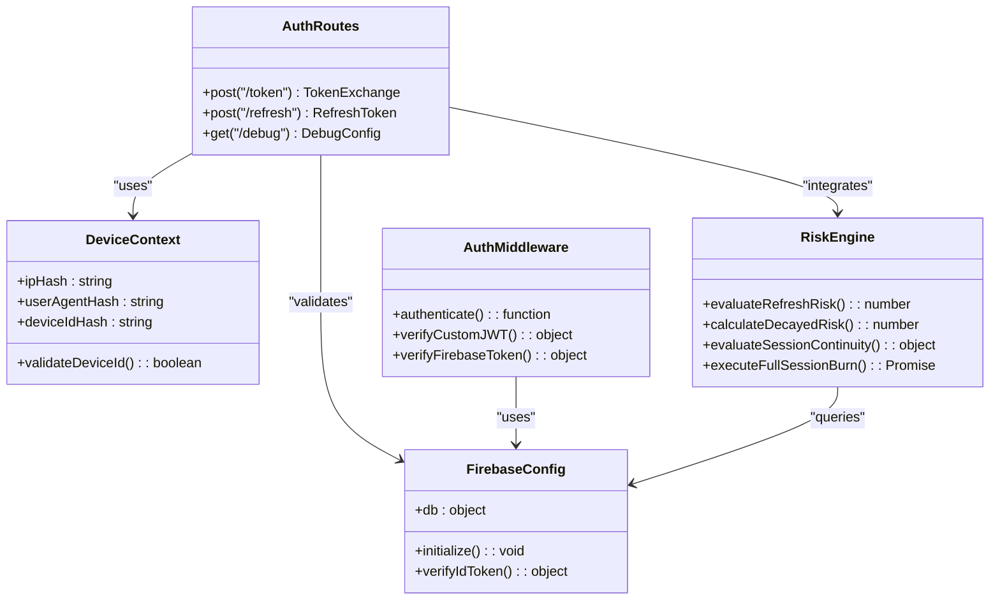

# Authentication API

<cite>
**Referenced Files in This Document**
- [auth.js](file://backend/src/routes/auth.js)
- [deviceContext.js](file://backend/src/middleware/deviceContext.js)
- [authMiddleware.js](file://backend/src/middleware/auth.js)
- [RiskEngine.js](file://backend/src/services/RiskEngine.js)
- [firebase.js](file://backend/src/config/firebase.js)
- [app.js](file://backend/src/app.js)
- [errorHandler.js](file://backend/src/middleware/errorHandler.js)
- [.env.example](file://backend/.env.example)
</cite>

## Table of Contents
1. [Introduction](#introduction)
2. [Project Structure](#project-structure)
3. [Core Components](#core-components)
4. [Architecture Overview](#architecture-overview)
5. [Detailed Component Analysis](#detailed-component-analysis)
6. [Dependency Analysis](#dependency-analysis)
7. [Performance Considerations](#performance-considerations)
8. [Troubleshooting Guide](#troubleshooting-guide)
9. [Conclusion](#conclusion)

## Introduction
This document provides comprehensive API documentation for the authentication endpoints, focusing on secure token exchange and refresh mechanisms. The system implements a hybrid authentication model that validates Firebase ID tokens while issuing custom JWT access/refresh token pairs with advanced security features including device fingerprinting, session continuity checks, and risk-based refresh controls.

## Project Structure
The authentication system is organized around several key components within the backend service:



**Diagram sources**
- [auth.js](file://backend/src/routes/auth.js#L1-L301)
- [authMiddleware.js](file://backend/src/middleware/auth.js#L1-L164)
- [deviceContext.js](file://backend/src/middleware/deviceContext.js#L1-L24)
- [RiskEngine.js](file://backend/src/services/RiskEngine.js#L1-L170)
- [firebase.js](file://backend/src/config/firebase.js#L1-L46)

**Section sources**
- [auth.js](file://backend/src/routes/auth.js#L1-L301)
- [app.js](file://backend/src/app.js#L1-L78)

## Core Components
The authentication system consists of three primary endpoints that handle different aspects of the authentication lifecycle:

### Token Exchange Endpoint
The `/api/auth/token` endpoint serves as the primary authentication entry point, exchanging Firebase ID tokens for custom JWT access/refresh token pairs with comprehensive security validation.

### Refresh Token Endpoint  
The `/api/auth/refresh` endpoint handles token rotation with advanced anti-replay protection, device context validation, and risk assessment integration.

### Debug Endpoint
The `/api/auth/debug` endpoint provides Firebase configuration verification for development and troubleshooting purposes.

**Section sources**
- [auth.js](file://backend/src/routes/auth.js#L15-L298)

## Architecture Overview
The authentication architecture implements a multi-layered security approach combining Firebase authentication with custom JWT token management:



**Diagram sources**
- [auth.js](file://backend/src/routes/auth.js#L20-L159)
- [deviceContext.js](file://backend/src/middleware/deviceContext.js#L7-L23)
- [firebase.js](file://backend/src/config/firebase.js#L28-L44)

## Detailed Component Analysis

### Token Exchange Endpoint (/api/auth/token)
The token exchange endpoint performs a comprehensive authentication flow with multiple security validations:

#### Request Schema
- **Method**: POST
- **Endpoint**: `/api/auth/token`
- **Required Headers**: None (uses device context middleware)
- **Body Parameters**:
  - `idToken` (string, required): Firebase ID token to validate

#### Response Schema
- **Success Response**:
  - `success` (boolean): True for successful authentication
  - `data.accessToken` (string): Short-lived access token (15 minutes)
  - `data.refreshToken` (string): Long-lived refresh token (30 days)
  - `data.expiresIn` (number): Token expiration in seconds (900)

#### Security Validation Flow
The endpoint implements a multi-stage validation process:



**Diagram sources**
- [auth.js](file://backend/src/routes/auth.js#L20-L159)

#### Token Versioning and Rotation
The system implements a sophisticated token versioning mechanism:
- **Token Version**: Tracks security updates and forced logout scenarios
- **Rotation Support**: Enables secure token rotation without compromising security
- **Global Kill Switch**: Immediate version mismatch triggers forced logout

**Section sources**
- [auth.js](file://backend/src/routes/auth.js#L15-L159)

### Refresh Token Endpoint (/api/auth/refresh)
The refresh endpoint implements comprehensive security measures to prevent token replay attacks and maintain session integrity:

#### Request Schema
- **Method**: POST
- **Endpoint**: `/api/auth/refresh`
- **Required Headers**: `x-device-id` (required for refresh operations)
- **Body Parameters**:
  - `refreshToken` (string, required): Refresh token to validate and rotate

#### Response Schema
- **Success Response**:
  - `success` (boolean): True for successful refresh
  - `data.accessToken` (string): New access token (15 minutes)
  - `data.refreshToken` (string): New refresh token (30 days)
  - `data.expiresIn` (number): Token expiration in seconds (900)

#### Anti-Replay Protection
The refresh endpoint implements multiple layers of anti-replay protection:

```mermaid
flowchart TD
Start([Refresh Request]) --> ValidateSignature["Validate Refresh Token Signature"]
ValidateSignature --> SignatureOK{"Valid Signature?"}
SignatureOK --> |No| Return401["Return 401 Invalid Token"]
SignatureOK --> |Yes| CheckJTI["Check JTI Presence"]
CheckJTI --> HasJTI{"Has JTI?"}
HasJTI --> |No| LegacyAuth["Legacy Token: Force Re-login"]
HasJTI --> |Yes| LoadToken["Load Token from DB"]
LoadToken --> TokenExists{"Token Exists & Not Revoked?"}
TokenExists --> |No| HardBurn["Execute Full Session Burn"]
TokenExists --> |Yes| CheckVersion["Check Token Version"]
CheckVersion --> VersionMatch{"Version Matches?"}
VersionMatch --> |No| Return401
VersionMatch --> |Yes| DeviceCheck["Strict Device ID Check"]
DeviceCheck --> DeviceOK{"Device ID Matches?"}
DeviceOK --> |No| HardBurn
DeviceOK --> |Yes| RiskAssessment["Risk Assessment"]
RiskAssessment --> RiskEval{"Risk Level"}
RiskEval --> |High (≥50)| HardBurn
RiskEval --> |Medium (≥25)| SoftLock["Soft Lock: Require Re-authentication"]
RiskEval --> |Low (<25)| RotateTokens["Rotate Tokens"]
HardBurn --> Return401
SoftLock --> Return401
RotateTokens --> Return200["Return New Token Pair"]
LegacyAuth --> Return401
```

**Diagram sources**
- [auth.js](file://backend/src/routes/auth.js#L166-L280)
- [RiskEngine.js](file://backend/src/services/RiskEngine.js#L11-L130)

#### Risk Assessment Integration
The refresh endpoint integrates with the Risk Engine for comprehensive security evaluation:

**Risk Factors Evaluated**:
- Device fingerprint changes (high risk)
- User agent changes (medium risk)  
- IP address changes (low risk)
- Session continuity violations
- Refresh frequency analysis
- Concurrent session limits

**Risk Thresholds**:
- **Hard Burn**: Risk score ≥ 50 (immediate session termination)
- **Soft Lock**: Risk score ≥ 25 (require re-authentication)
- **Allow**: Risk score < 25 (approve refresh)

**Section sources**
- [auth.js](file://backend/src/routes/auth.js#L161-L280)
- [RiskEngine.js](file://backend/src/services/RiskEngine.js#L11-L130)

### Debug Endpoint (/api/auth/debug)
The debug endpoint provides essential Firebase configuration verification for development and troubleshooting:

#### Request Schema
- **Method**: GET
- **Endpoint**: `/api/auth/debug`
- **Headers**: None required

#### Response Schema
- **Success Response**:
  - `success` (boolean): Always true for debug endpoint
  - `data.projectId` (string): Firebase project identifier
  - `data.nodeEnv` (string): Current Node.js environment
  - `data.hasPrivateKey` (boolean): Indicates private key presence
  - `data.clientEmail` (string): Firebase service account email
  - `data.timestamp` (string): ISO timestamp of request

**Section sources**
- [auth.js](file://backend/src/routes/auth.js#L282-L298)

## Dependency Analysis

### Component Relationships
The authentication system exhibits well-defined dependencies between components:



**Diagram sources**
- [auth.js](file://backend/src/routes/auth.js#L1-L301)
- [deviceContext.js](file://backend/src/middleware/deviceContext.js#L1-L24)
- [RiskEngine.js](file://backend/src/services/RiskEngine.js#L1-L170)
- [authMiddleware.js](file://backend/src/middleware/auth.js#L1-L164)
- [firebase.js](file://backend/src/config/firebase.js#L1-L46)

### External Dependencies
The authentication system relies on several external libraries and services:

**Core Dependencies**:
- **jsonwebtoken**: JWT token creation and validation
- **firebase-admin**: Firebase authentication and database operations
- **crypto**: SHA-256 hashing for device fingerprinting

**Environment Dependencies**:
- **JWT_ACCESS_SECRET**: Access token signing key
- **JWT_REFRESH_SECRET**: Refresh token signing key
- **FIREBASE_PROJECT_ID**: Firebase project identifier
- **FIREBASE_PRIVATE_KEY**: Firebase service account private key
- **FIREBASE_CLIENT_EMAIL**: Firebase service account email

**Section sources**
- [auth.js](file://backend/src/routes/auth.js#L1-L15)
- [package.json](file://backend/package.json#L24-L55)
- [.env.example](file://backend/.env.example#L9-L24)

## Performance Considerations
The authentication system implements several performance optimizations:

### Caching Strategy
- **User Profile Cache**: 30-second TTL for user profile data to reduce Firestore queries
- **In-memory Cache**: Prevents redundant database calls for frequently accessed user data

### Request Processing
- **Early Validation**: Device context validation occurs before expensive operations
- **Minimal Database Writes**: Refresh token storage uses efficient write operations
- **Batch Operations**: Session burning uses Firestore batch writes for atomic operations

### Scalability Features
- **Rate Limiting**: Progressive rate limiting for authentication endpoints
- **Timeout Management**: 15-second timeout for JSON requests to prevent resource exhaustion
- **Connection Pooling**: Efficient database connection management

## Troubleshooting Guide

### Common Authentication Issues

#### Firebase Configuration Errors
**Symptoms**: 500 Internal Server Error during token exchange
**Causes**: Missing or invalid Firebase environment variables
**Resolution**: 
1. Verify all required Firebase environment variables are set
2. Check private key formatting (newline characters preserved)
3. Confirm service account has proper IAM permissions

#### JWT Secret Configuration
**Symptoms**: 500 Internal Server Error with secret configuration message
**Causes**: Missing JWT_ACCESS_SECRET or JWT_REFRESH_SECRET
**Resolution**:
1. Generate secure random secrets for both access and refresh tokens
2. Set environment variables in deployment configuration
3. Restart application after secret changes

#### Token Validation Failures
**Symptoms**: 401 Unauthorized responses for valid tokens
**Causes**: Token signature verification failures or expiration
**Resolution**:
1. Verify token was signed with correct secret
2. Check token expiration timestamps
3. Ensure clock synchronization between client and server

#### Session Compromise Detection
**Symptoms**: 401 Unauthorized with "Session compromised" message
**Causes**: Risk engine threshold exceeded or device fingerprint mismatch
**Resolution**:
1. User must re-authenticate with fresh credentials
2. Check for suspicious network activity or device changes
3. Review risk assessment logs for specific violation details

### Debug Information
The debug endpoint provides valuable information for troubleshooting:
- Firebase project configuration verification
- Environment variable status
- Timestamp for request correlation

**Section sources**
- [auth.js](file://backend/src/routes/auth.js#L287-L298)
- [errorHandler.js](file://backend/src/middleware/errorHandler.js#L1-L35)

## Conclusion
The authentication API implements a robust, security-focused token management system that combines Firebase authentication with custom JWT tokens. The system provides comprehensive security features including device fingerprinting, session continuity checks, risk-based refresh controls, and anti-replay protection. The modular architecture ensures maintainability while providing the flexibility needed for enterprise-scale authentication requirements.

Key security features include:
- Multi-layered validation with device context hashing
- Risk-based refresh approval with configurable thresholds
- Global session burn capability for compromised accounts
- Token versioning for immediate security policy enforcement
- Comprehensive logging and monitoring capabilities

The system is designed for production deployment with performance optimizations, scalability features, and comprehensive error handling strategies.