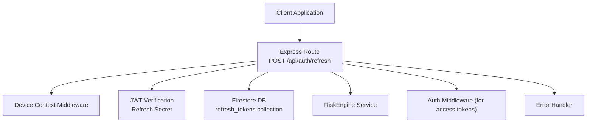
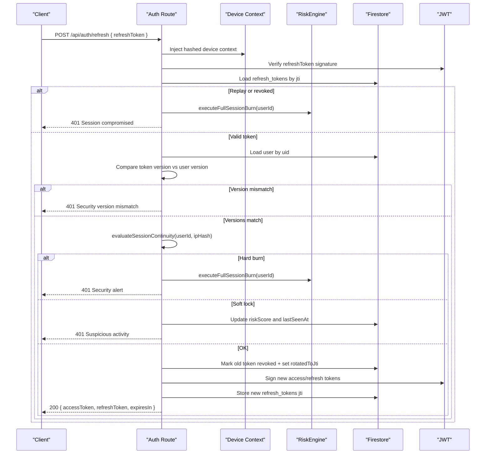
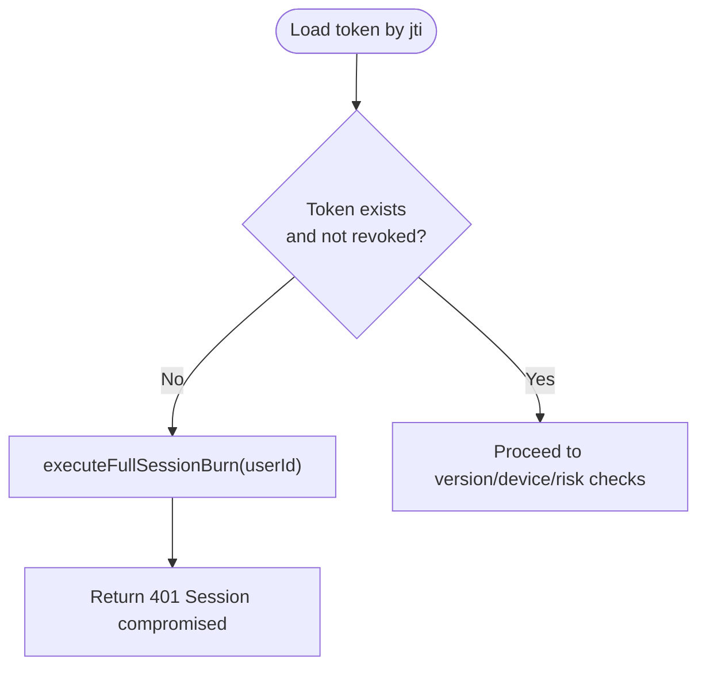
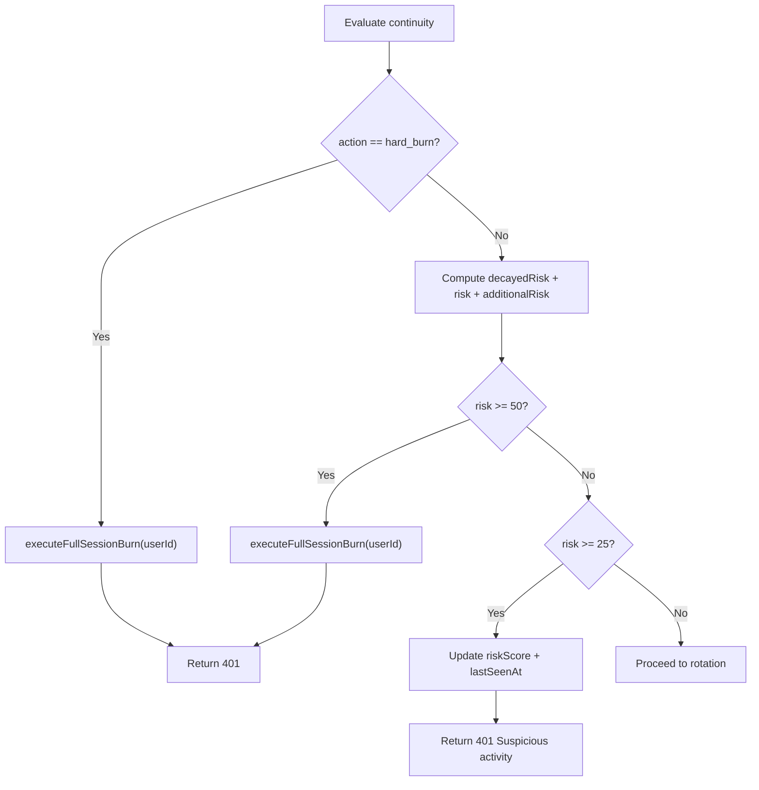
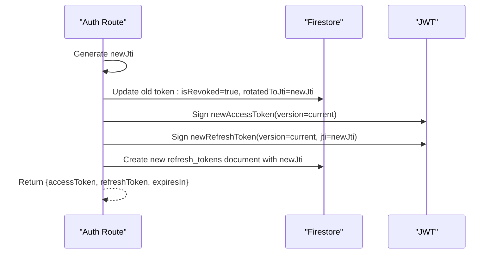
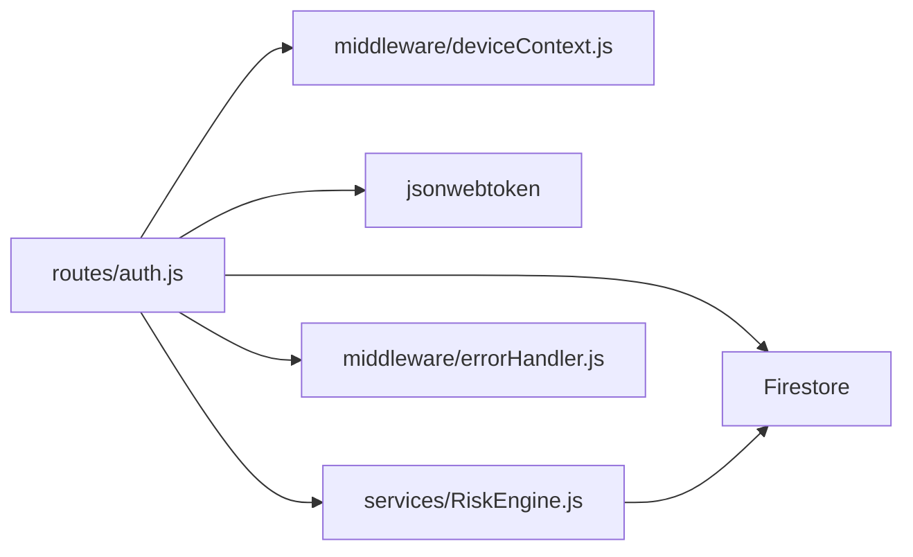

# Refresh Token Endpoint

<cite>
**Referenced Files in This Document**
- [auth.js](file://backend/src/routes/auth.js)
- [deviceContext.js](file://backend/src/middleware/deviceContext.js)
- [RiskEngine.js](file://backend/src/services/RiskEngine.js)
- [auth.js](file://backend/src/middleware/auth.js)
- [errorHandler.js](file://backend/src/middleware/errorHandler.js)
- [security.js](file://backend/src/middleware/security.js)
- [env.js](file://backend/src/config/env.js)
- [.env.example](file://backend/.env.example)
- [package.json](file://backend/package.json)
</cite>

## Table of Contents
1. [Introduction](#introduction)
2. [Project Structure](#project-structure)
3. [Core Components](#core-components)
4. [Architecture Overview](#architecture-overview)
5. [Detailed Component Analysis](#detailed-component-analysis)
6. [Dependency Analysis](#dependency-analysis)
7. [Performance Considerations](#performance-considerations)
8. [Troubleshooting Guide](#troubleshooting-guide)
9. [Conclusion](#conclusion)

## Introduction
This document provides comprehensive API documentation for the refresh token endpoint (/api/auth/refresh). It covers the POST request contract, request body schema, response format, and the full security validation pipeline. The endpoint performs signature verification, database anti-replay checks, token version synchronization, device context validation, and integrates risk assessment to evaluate session continuity and enforce automatic session containment measures. It also documents the token rotation mechanism that invalidates old tokens and creates new JTI-based chains, along with detailed error handling scenarios.

## Project Structure
The refresh token endpoint is implemented within the Express routes module and leverages middleware and services for device fingerprinting, risk evaluation, and error handling.

**Diagram sources**
- [auth.js](file://backend/src/routes/auth.js#L166-L280)
- [deviceContext.js](file://backend/src/middleware/deviceContext.js#L7-L23)
- [RiskEngine.js](file://backend/src/services/RiskEngine.js#L1-L170)
- [auth.js](file://backend/src/middleware/auth.js#L20-L161)
- [errorHandler.js](file://backend/src/middleware/errorHandler.js#L3-L32)

**Section sources**
- [auth.js](file://backend/src/routes/auth.js#L166-L280)
- [deviceContext.js](file://backend/src/middleware/deviceContext.js#L7-L23)
- [RiskEngine.js](file://backend/src/services/RiskEngine.js#L1-L170)
- [auth.js](file://backend/src/middleware/auth.js#L20-L161)
- [errorHandler.js](file://backend/src/middleware/errorHandler.js#L3-L32)

## Core Components
- Route handler for POST /api/auth/refresh
- Device context middleware for hashing identifiers
- RiskEngine service for risk scoring and session continuity
- Authentication middleware for access token validation
- Error handling middleware for consistent responses

**Section sources**
- [auth.js](file://backend/src/routes/auth.js#L166-L280)
- [deviceContext.js](file://backend/src/middleware/deviceContext.js#L7-L23)
- [RiskEngine.js](file://backend/src/services/RiskEngine.js#L1-L170)
- [auth.js](file://backend/src/middleware/auth.js#L20-L161)
- [errorHandler.js](file://backend/src/middleware/errorHandler.js#L3-L32)

## Architecture Overview
The refresh flow validates the refresh token, enforces replay protection, synchronizes token versions, validates device context, evaluates session continuity and risk, rotates tokens, and issues a new access/refresh pair.

**Diagram sources**
- [auth.js](file://backend/src/routes/auth.js#L166-L280)
- [RiskEngine.js](file://backend/src/services/RiskEngine.js#L71-L130)
- [RiskEngine.js](file://backend/src/services/RiskEngine.js#L136-L168)

## Detailed Component Analysis

### Endpoint Definition
- Method: POST
- Path: /api/auth/refresh
- Purpose: Validate refresh token and issue a new access token and refresh token pair

Request Body Schema
- refreshToken: string (required)
  - A signed JWT refresh token containing claims: uid, version, jti

Response Format
- success: boolean
- data: object
  - accessToken: string (new short-lived access token)
  - refreshToken: string (new refresh token)
  - expiresIn: number (seconds until access token expiry)
- error: string|null (present on failure)

Security Notes
- Device ID is required for refresh requests; otherwise a 400 error is returned.
- All responses follow a consistent envelope with success/data/error fields.

**Section sources**
- [auth.js](file://backend/src/routes/auth.js#L161-L165)
- [auth.js](file://backend/src/routes/auth.js#L166-L171)
- [auth.js](file://backend/src/routes/auth.js#L268-L275)
- [deviceContext.js](file://backend/src/middleware/deviceContext.js#L12-L14)

### Sophisticated Security Validation Process

#### 1) Signature Verification
- Validates the refresh token signature using the refresh secret.
- Rejects tokens without a JTI claim (legacy tokens) with a 401 response.

**Section sources**
- [auth.js](file://backend/src/routes/auth.js#L173-L179)

#### 2) Database Anti-Replay Checks
- Loads the refresh token document by JTI.
- Rejects if the token does not exist or is marked revoked.
- On replay detection, executes a full session burn to revoke all sessions and increment the user’s token version.

**Diagram sources**
- [auth.js](file://backend/src/routes/auth.js#L181-L190)
- [RiskEngine.js](file://backend/src/services/RiskEngine.js#L136-L168)

**Section sources**
- [auth.js](file://backend/src/routes/auth.js#L181-L190)
- [RiskEngine.js](file://backend/src/services/RiskEngine.js#L136-L168)

#### 3) Token Version Synchronization
- Compares the token’s version with the user’s current tokenVersion.
- A mismatch triggers a 401 with “Security version mismatch”.

**Section sources**
- [auth.js](file://backend/src/routes/auth.js#L194-L200)

#### 4) Device Context Validation
- Enforces strict device ID hash matching between stored token and current request.
- On mismatch, executes a full session burn and returns a 401 with “Security alert”.

**Section sources**
- [auth.js](file://backend/src/routes/auth.js#L202-L207)

#### 5) Risk Assessment Integration
- Evaluates session continuity: concurrent refresh attempts, refresh storm, and active session cap.
- Calculates risk from device/user agent/IP drift and decays risk over time.
- Applies thresholds to decide hard burn (full containment) or soft lock (require re-auth).

**Diagram sources**
- [RiskEngine.js](file://backend/src/services/RiskEngine.js#L71-L130)
- [RiskEngine.js](file://backend/src/services/RiskEngine.js#L36-L49)
- [auth.js](file://backend/src/routes/auth.js#L210-L230)

**Section sources**
- [RiskEngine.js](file://backend/src/services/RiskEngine.js#L11-L30)
- [RiskEngine.js](file://backend/src/services/RiskEngine.js#L36-L49)
- [RiskEngine.js](file://backend/src/services/RiskEngine.js#L71-L130)
- [auth.js](file://backend/src/routes/auth.js#L216-L230)

#### 6) Session Continuity Evaluation
- Scans recent refresh tokens for the user to detect:
  - Concurrent refresh from different IPs within a short timeframe
  - High-frequency refresh storms
  - Excessive active sessions
- Returns either ok with additional risk or hard_burn with a reason.

**Section sources**
- [RiskEngine.js](file://backend/src/services/RiskEngine.js#L71-L130)

#### 7) Automatic Session Containment Measures
- Full session burn invalidates all active refresh tokens for the user and increments tokenVersion to force logout of all access tokens.
- Implemented via a Firestore transaction batch.

**Section sources**
- [RiskEngine.js](file://backend/src/services/RiskEngine.js#L136-L168)

#### 8) Token Rotation Mechanism
- Generates a new JTI and marks the old token as revoked with rotatedToJti.
- Issues a new access token and a new refresh token with the current version.
- Stores the new refresh token with device context and risk metadata.

**Diagram sources**
- [auth.js](file://backend/src/routes/auth.js#L232-L266)

**Section sources**
- [auth.js](file://backend/src/routes/auth.js#L232-L266)

### Detailed Error Handling
Common failure modes and responses:
- Missing refresh token: 400 with “Refresh token is required”
- Invalid/expired refresh token: 401 with “Invalid or expired refresh token”
- Replay or revoked token: 401 with “Session compromised. Please log in again.” and full session burn
- Security version mismatch: 401 with “Security version mismatch”
- Strict device ID mismatch: 401 with “Security alert: Session compromised.” and full session burn
- Suspicious activity requiring re-auth: 401 with “Suspicious activity detected. Please re-authenticate.” and risk score persisted
- General internal error: 401 with “Invalid or expired refresh token” (fallback)

Consistent error envelope:
- success: false
- data: null
- error: { message, code, stack (non-production) }

**Section sources**
- [auth.js](file://backend/src/routes/auth.js#L168-L171)
- [auth.js](file://backend/src/routes/auth.js#L173-L179)
- [auth.js](file://backend/src/routes/auth.js#L183-L190)
- [auth.js](file://backend/src/routes/auth.js#L198-L200)
- [auth.js](file://backend/src/routes/auth.js#L202-L207)
- [auth.js](file://backend/src/routes/auth.js#L226-L230)
- [auth.js](file://backend/src/routes/auth.js#L276-L279)
- [errorHandler.js](file://backend/src/middleware/errorHandler.js#L23-L31)

### Client-Side Implementation Guidance
Recommended workflows for handling refresh outcomes:
- Soft Lock (401 with suspicious activity):
  - Prompt the user to re-authenticate with the sign-in flow.
  - Persist the current risk state to avoid repeated soft locks until re-login.
- Hard Burn (401 with session compromised):
  - Force the user to re-authenticate.
  - Clear all local tokens and session state.
- Seamless Renewal:
  - On successful refresh, replace stored tokens with the new pair.
  - Ensure the access token is used for protected requests; the refresh token is stored securely for future renewals.
- Device ID Requirement:
  - Ensure the client sends a device identifier header on refresh requests; otherwise, expect a 400 error.

[No sources needed since this section provides general guidance]

## Dependency Analysis
- Route depends on:
  - deviceContext middleware for hashed identifiers
  - JWT library for signature verification and signing
  - Firestore for token and user persistence
  - RiskEngine service for risk scoring and session containment
- RiskEngine depends on Firestore for token and user queries and batches
- Error handling middleware ensures consistent error envelopes

**Diagram sources**
- [auth.js](file://backend/src/routes/auth.js#L1-L15)
- [deviceContext.js](file://backend/src/middleware/deviceContext.js#L1-L24)
- [RiskEngine.js](file://backend/src/services/RiskEngine.js#L1-L10)
- [errorHandler.js](file://backend/src/middleware/errorHandler.js#L1-L35)

**Section sources**
- [auth.js](file://backend/src/routes/auth.js#L1-L15)
- [deviceContext.js](file://backend/src/middleware/deviceContext.js#L1-L24)
- [RiskEngine.js](file://backend/src/services/RiskEngine.js#L1-L10)
- [errorHandler.js](file://backend/src/middleware/errorHandler.js#L1-L35)

## Performance Considerations
- RiskEngine queries up to a small limit of recent tokens per user for continuity checks; keep the limit reasonable to avoid heavy Firestore scans.
- Device context hashing avoids storing sensitive raw identifiers, reducing storage and privacy risks.
- Access tokens are short-lived to minimize exposure windows.
- Consider caching user profiles and token metadata to reduce Firestore reads during high-throughput scenarios.

[No sources needed since this section provides general guidance]

## Troubleshooting Guide
- Environment Variables
  - Ensure refresh and access JWT secrets are configured; otherwise, token exchange endpoints will fail.
  - Confirm CORS and security headers are properly configured for your deployment environment.
- Device ID Missing
  - The refresh endpoint requires a device identifier header; failing to provide it results in a 400 error.
- Frequent Soft Locks
  - Investigate device/user agent/IP drift or high refresh frequency; adjust client behavior or thresholds if appropriate.
- Full Session Burns
  - Indicates strong evidence of compromise; confirm with logs and consider account suspension policies.
- Consistent Internal Errors
  - Review error handler logs for stack traces and ensure proper error propagation.

**Section sources**
- [auth.js](file://backend/src/routes/auth.js#L27-L31)
- [deviceContext.js](file://backend/src/middleware/deviceContext.js#L12-L14)
- [errorHandler.js](file://backend/src/middleware/errorHandler.js#L3-L32)
- [security.js](file://backend/src/middleware/security.js#L16-L46)
- [.env.example](file://backend/.env.example#L1-L25)
- [env.js](file://backend/src/config/env.js#L6-L22)

## Conclusion
The /api/auth/refresh endpoint implements a robust, layered security model centered on cryptographic validation, database anti-replay, token versioning, device context enforcement, and dynamic risk assessment. It supports automatic session containment, precise risk scoring, and secure token rotation with JTI chaining. Clients should handle soft locks by prompting re-authentication and treat hard burns as mandatory re-auth events while ensuring device identifiers are consistently provided for refresh requests.