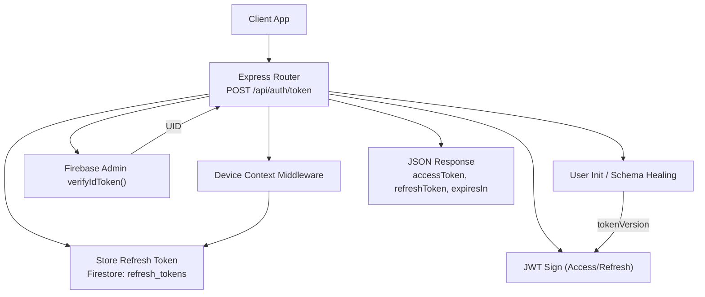
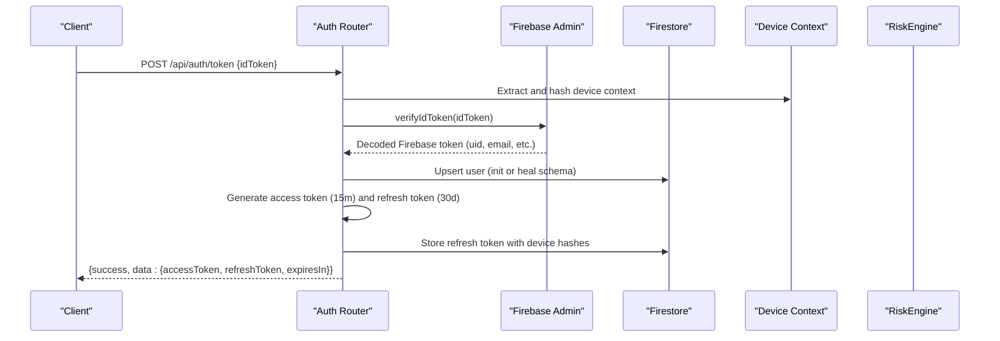
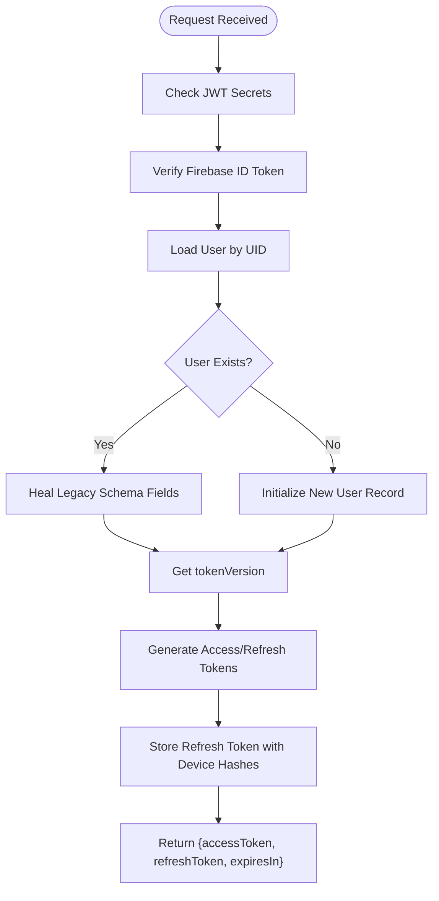
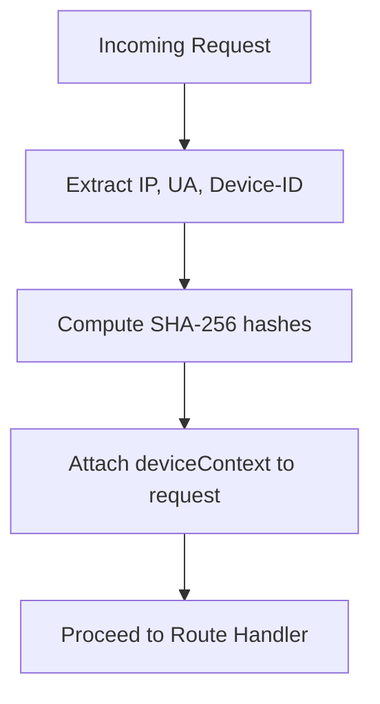
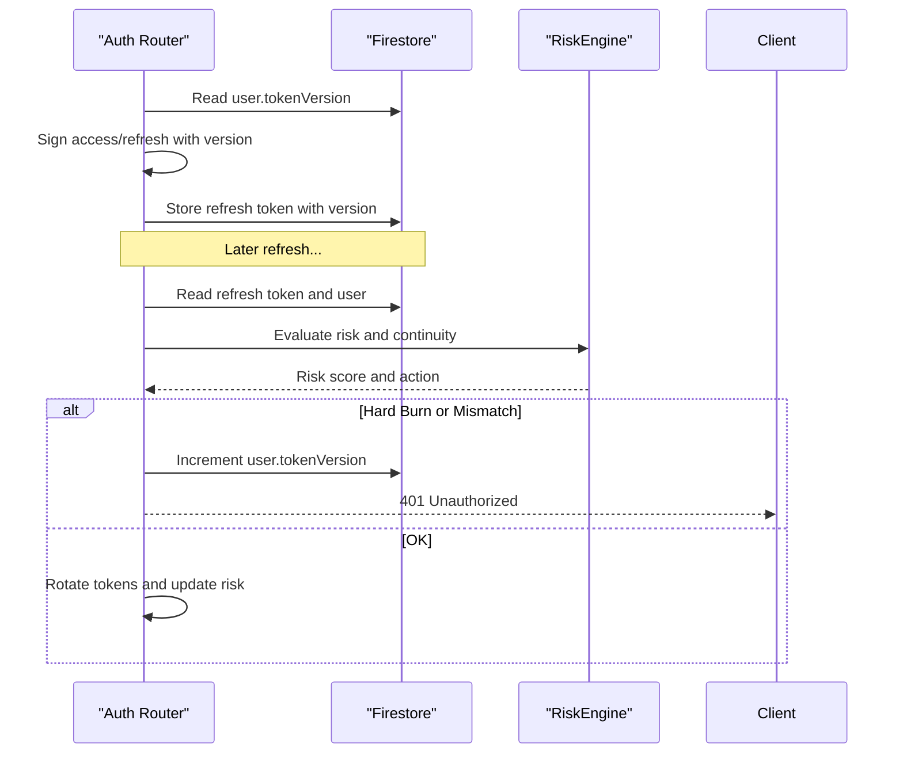
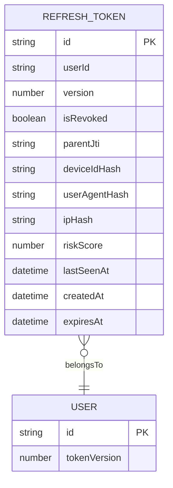
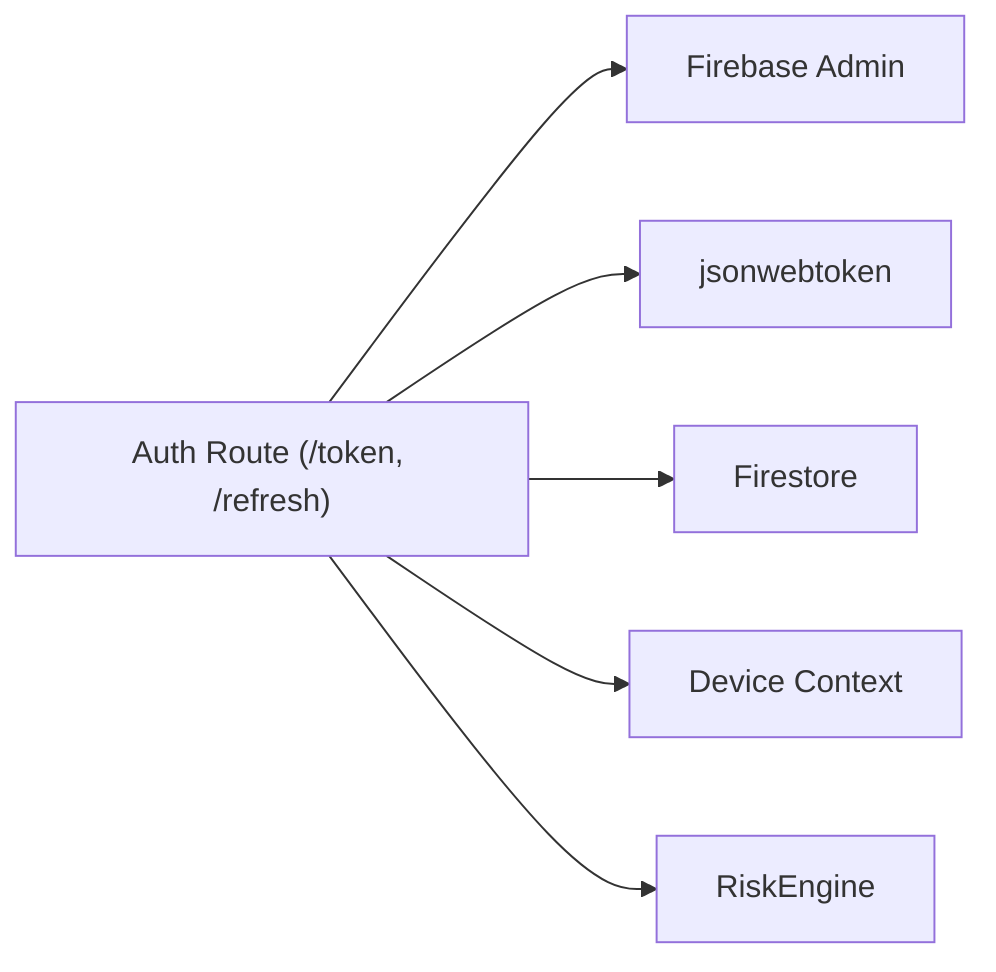

# Token Exchange Endpoint

<cite>
**Referenced Files in This Document**
- [auth.js](file://backend/src/routes/auth.js)
- [deviceContext.js](file://backend/src/middleware/deviceContext.js)
- [auth.js](file://backend/src/middleware/auth.js)
- [firebase.js](file://backend/src/config/firebase.js)
- [RiskEngine.js](file://backend/src/services/RiskEngine.js)
- [userDisplayName.js](file://backend/src/utils/userDisplayName.js)
- [app.js](file://backend/src/app.js)
- [.env.example](file://backend/.env.example)
</cite>

## Table of Contents
1. [Introduction](#introduction)
2. [Project Structure](#project-structure)
3. [Core Components](#core-components)
4. [Architecture Overview](#architecture-overview)
5. [Detailed Component Analysis](#detailed-component-analysis)
6. [Dependency Analysis](#dependency-analysis)
7. [Performance Considerations](#performance-considerations)
8. [Troubleshooting Guide](#troubleshooting-guide)
9. [Conclusion](#conclusion)

## Introduction
This document provides comprehensive API documentation for the token exchange endpoint that converts Firebase ID tokens into a custom JWT access/refresh token pair. It covers the POST request schema, response format, the multi-step verification and initialization pipeline, token versioning, device context integration, legacy account schema healing, refresh token storage, and security controls including token versioning, device fingerprinting, and automatic user profile creation. It concludes with client integration guidance and error handling scenarios.

## Project Structure
The token exchange endpoint resides in the backend Express application under the authentication routes module. It integrates with Firebase Admin for token verification, a device context middleware for privacy-preserving device fingerprinting, and a risk engine for session continuity and anomaly detection. The endpoint is mounted under the public authentication routes and protected by rate limiting.

**Diagram sources**
- [auth.js](file://backend/src/routes/auth.js#L20-L159)
- [deviceContext.js](file://backend/src/middleware/deviceContext.js#L7-L23)
- [firebase.js](file://backend/src/config/firebase.js#L41-L45)
- [RiskEngine.js](file://backend/src/services/RiskEngine.js#L136-L168)

**Section sources**
- [auth.js](file://backend/src/routes/auth.js#L1-L301)
- [app.js](file://backend/src/app.js#L35-L42)

## Core Components
- Route handler for POST /api/auth/token
- Firebase ID token verification
- User initialization and schema healing
- Token version management
- Custom JWT generation (15-minute access tokens, 30-day refresh tokens)
- Device context hashing and refresh token storage
- Risk-aware refresh flow (anti-replay, device checks, session continuity)

**Section sources**
- [auth.js](file://backend/src/routes/auth.js#L15-L159)
- [deviceContext.js](file://backend/src/middleware/deviceContext.js#L1-L24)
- [firebase.js](file://backend/src/config/firebase.js#L1-L46)
- [RiskEngine.js](file://backend/src/services/RiskEngine.js#L1-L170)

## Architecture Overview
The token exchange endpoint orchestrates a secure, versioned token issuance pipeline. It validates the Firebase ID token, ensures environment secrets are present, initializes or heals user records, generates a signed access token and a refresh token, stores the refresh token with device fingerprints, and returns a structured response.

**Diagram sources**
- [auth.js](file://backend/src/routes/auth.js#L20-L159)
- [deviceContext.js](file://backend/src/middleware/deviceContext.js#L7-L23)
- [firebase.js](file://backend/src/config/firebase.js#L41-L45)
- [RiskEngine.js](file://backend/src/services/RiskEngine.js#L136-L168)

## Detailed Component Analysis

### Endpoint Definition: POST /api/auth/token
- Method: POST
- Path: /api/auth/token
- Purpose: Exchange a Firebase ID token for a custom JWT access/refresh token pair
- Authentication: Not required at route level; Firebase ID token is validated inside the handler
- Rate Limiting: Mounted under progressiveLimiter('auth')

Request Body
- idToken: string (required)
  - A valid Firebase ID token obtained from the client-side Firebase SDK

Response
- success: boolean
- data:
  - accessToken: string (JWT, 15-minute expiry)
  - refreshToken: string (JWT, 30-day expiry)
  - expiresIn: number (seconds, fixed 900)

Errors
- 400 Bad Request: Missing idToken or device context issues
- 401 Unauthorized: Firebase token invalid/expired, or internal verification failure
- 500 Internal Server Error: Missing JWT secrets or unexpected server error

Security Notes
- Access token is short-lived (15 minutes) to minimize exposure
- Refresh token is long-lived (30 days) but tracked and revocable
- Device context is hashed and stored with refresh tokens for anti-replay and device binding
- Token versioning enables global kill switches and seamless upgrades

**Section sources**
- [auth.js](file://backend/src/routes/auth.js#L15-L159)
- [app.js](file://backend/src/app.js#L35-L42)

### Multi-Step Verification and Initialization Pipeline
1. Environment Secrets Check
   - Validates presence of JWT access and refresh secrets before proceeding
2. Firebase Token Verification
   - Uses Firebase Admin to verify and decode the ID token
3. User Initialization and Schema Healing
   - Creates or updates the user record with display name, username, profile image, and roles
   - Heals legacy accounts missing essential fields by generating display names and usernames
4. Token Version Management
   - Reads or sets tokenVersion on the user document
5. Custom JWT Generation
   - Issues access token (15 minutes) and refresh token (30 days) with version metadata
6. Refresh Token Storage
   - Stores refresh token metadata with device hashes and timestamps

**Diagram sources**
- [auth.js](file://backend/src/routes/auth.js#L20-L159)
- [userDisplayName.js](file://backend/src/utils/userDisplayName.js#L1-L38)

**Section sources**
- [auth.js](file://backend/src/routes/auth.js#L20-L159)
- [userDisplayName.js](file://backend/src/utils/userDisplayName.js#L1-L38)

### Device Context Integration and Privacy
- Device context middleware computes SHA-256 hashes for:
  - IP address (from trusted proxy headers)
  - User-Agent
  - Optional device identifier header
- These hashes are stored with refresh tokens to enable:
  - Anti-replay protection
  - Strict device binding on refresh
  - Behavioral risk scoring

**Diagram sources**
- [deviceContext.js](file://backend/src/middleware/deviceContext.js#L7-L23)

**Section sources**
- [deviceContext.js](file://backend/src/middleware/deviceContext.js#L1-L24)

### Token Version Management and Global Kill Switch
- Each user maintains a tokenVersion field
- Access tokens carry the version; middleware enforces version alignment
- On severe risk events, the system can increment the tokenVersion to force logout across clients
- Refresh flow validates version parity and device binding

**Diagram sources**
- [auth.js](file://backend/src/routes/auth.js#L166-L280)
- [RiskEngine.js](file://backend/src/services/RiskEngine.js#L136-L168)

**Section sources**
- [auth.js](file://backend/src/routes/auth.js#L166-L280)
- [RiskEngine.js](file://backend/src/services/RiskEngine.js#L1-L170)

### Refresh Token Storage Mechanism
- A refresh token JTI (unique ID) is generated per issuance
- The refresh token document includes:
  - userId, version, isRevoked, parentJti
  - deviceIdHash, userAgentHash, ipHash
  - riskScore, lastSeenAt, createdAt, expiresAt
- On refresh, the old token is revoked and a new token is issued with a new JTI and parentJti linkage

**Diagram sources**
- [auth.js](file://backend/src/routes/auth.js#L127-L143)
- [auth.js](file://backend/src/routes/auth.js#L254-L266)

**Section sources**
- [auth.js](file://backend/src/routes/auth.js#L127-L143)
- [auth.js](file://backend/src/routes/auth.js#L254-L266)

### Security Considerations
- Token Versioning: Enables instant global logout by incrementing user.tokenVersion
- Device Fingerprinting: Hashed identifiers bound to refresh tokens prevent cross-device reuse
- Anti-Replay: Refresh token documents are checked for revocation and device mismatches
- Session Continuity: RiskEngine evaluates concurrent refresh attempts, rotation frequency, and active session caps
- Automatic Profile Creation: New users are provisioned with safe defaults and display names
- Legacy Schema Healing: Existing users without required fields are upgraded automatically

**Section sources**
- [auth.js](file://backend/src/routes/auth.js#L166-L280)
- [RiskEngine.js](file://backend/src/services/RiskEngine.js#L71-L130)
- [auth.js](file://backend/src/routes/auth.js#L66-L109)

### Client Implementation Examples
Note: The following examples describe the intended flow and error handling. They are conceptual and not derived from specific code snippets.

- Obtain Firebase ID Token from client Firebase SDK
- Send POST /api/auth/token with body { idToken }
- On success:
  - Store accessToken securely (in-memory or secure storage)
  - Store refreshToken persistently
  - Use accessToken for subsequent protected requests
- On 401 Unauthorized:
  - Prompt user to re-authenticate with Firebase
- On 400 Bad Request:
  - Validate that idToken was provided and device headers are set (for refresh)
- On 500 Internal Server Error:
  - Retry after backoff; check server health endpoint

- Refresh Flow:
  - On access token expiration, send POST /api/auth/refresh with { refreshToken }
  - On success, replace stored tokens and continue
  - On 401 Unauthorized:
    - Treat as session compromised; require full re-authentication

- Error Scenarios:
  - Invalid/expired Firebase token: 401 with debug info
  - Missing JWT secrets: 500 during token exchange
  - Device mismatch on refresh: 401 with security alert
  - High-risk rotation: Soft lock or hard burn depending on thresholds

**Section sources**
- [auth.js](file://backend/src/routes/auth.js#L15-L159)
- [auth.js](file://backend/src/routes/auth.js#L166-L280)

## Dependency Analysis
The token exchange endpoint depends on:
- Firebase Admin for ID token verification
- JWT library for signing access and refresh tokens
- Firestore for user and refresh token persistence
- Device context middleware for privacy-preserving device hashing
- RiskEngine for behavioral and temporal anomaly detection

**Diagram sources**
- [auth.js](file://backend/src/routes/auth.js#L1-L301)
- [firebase.js](file://backend/src/config/firebase.js#L1-L46)
- [deviceContext.js](file://backend/src/middleware/deviceContext.js#L1-L24)
- [RiskEngine.js](file://backend/src/services/RiskEngine.js#L1-L170)

**Section sources**
- [auth.js](file://backend/src/routes/auth.js#L1-L301)
- [firebase.js](file://backend/src/config/firebase.js#L1-L46)
- [deviceContext.js](file://backend/src/middleware/deviceContext.js#L1-L24)
- [RiskEngine.js](file://backend/src/services/RiskEngine.js#L1-L170)

## Performance Considerations
- Access tokens are short-lived (15 minutes) to reduce long-term risk and minimize repeated validation overhead
- Refresh tokens are long-lived (30 days) but stored with hashes and risk metrics for efficient lookups
- Device hashing avoids storing sensitive raw identifiers, reducing index size and privacy risks
- RiskEngine calculations are bounded by recent token snapshots to keep evaluation fast
- Firestore batch operations are used for bulk revocation and version increments during containment actions

[No sources needed since this section provides general guidance]

## Troubleshooting Guide
Common Issues and Resolutions
- Missing JWT Secrets:
  - Symptom: 500 Internal Server Error during token exchange
  - Resolution: Set JWT_ACCESS_SECRET and JWT_REFRESH_SECRET in environment
- Invalid or Expired Firebase Token:
  - Symptom: 401 Unauthorized with token verification error
  - Resolution: Re-authenticate the user and obtain a fresh Firebase ID token
- Device Context Required:
  - Symptom: 400 Bad Request on refresh when device_id is missing
  - Resolution: Ensure client sends x-device-id header on refresh requests
- Session Compromised:
  - Symptom: 401 Unauthorized with security alert
  - Resolution: Require user re-authentication; investigate device/IP changes
- High-Risk Rotation:
  - Symptom: Soft lock or hard burn based on risk thresholds
  - Resolution: Wait for soft lock window or re-authenticate; avoid excessive refresh attempts

Environment Variables to Verify
- FIREBASE_PROJECT_ID, FIREBASE_PRIVATE_KEY, FIREBASE_CLIENT_EMAIL
- JWT_ACCESS_SECRET, JWT_REFRESH_SECRET
- CORS_ALLOWED_ORIGINS (for production)

**Section sources**
- [auth.js](file://backend/src/routes/auth.js#L28-L31)
- [auth.js](file://backend/src/routes/auth.js#L42-L55)
- [deviceContext.js](file://backend/src/middleware/deviceContext.js#L12-L14)
- [RiskEngine.js](file://backend/src/services/RiskEngine.js#L55-L65)
- [.env.example](file://backend/.env.example#L9-L25)

## Conclusion
The token exchange endpoint provides a robust, privacy-preserving, and security-mature solution for issuing custom JWT access/refresh token pairs from Firebase ID tokens. It incorporates token versioning, device fingerprinting, schema healing, and risk-aware refresh logic to protect user sessions while enabling smooth client experiences. Clients should handle token lifecycles carefully, respect refresh errors, and integrate device context consistently for optimal security and reliability.