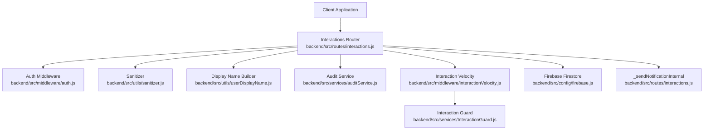
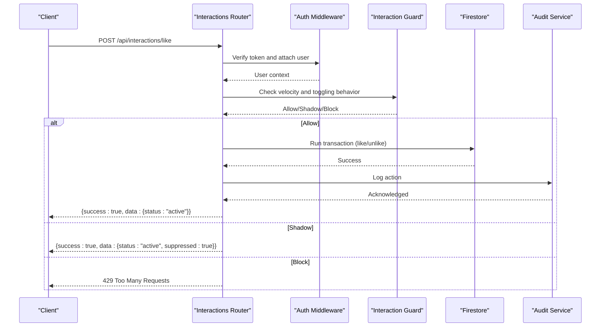
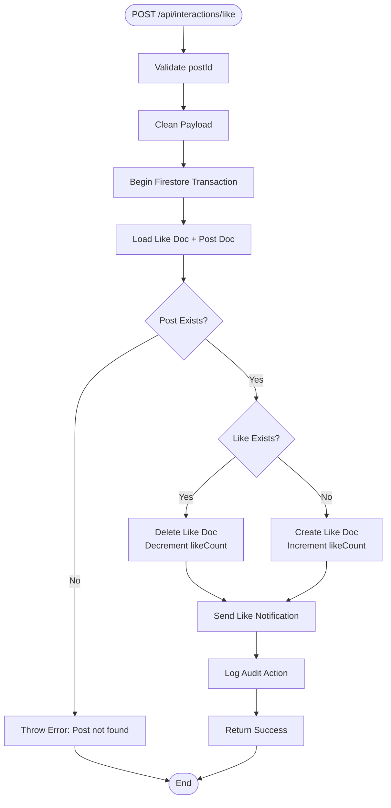
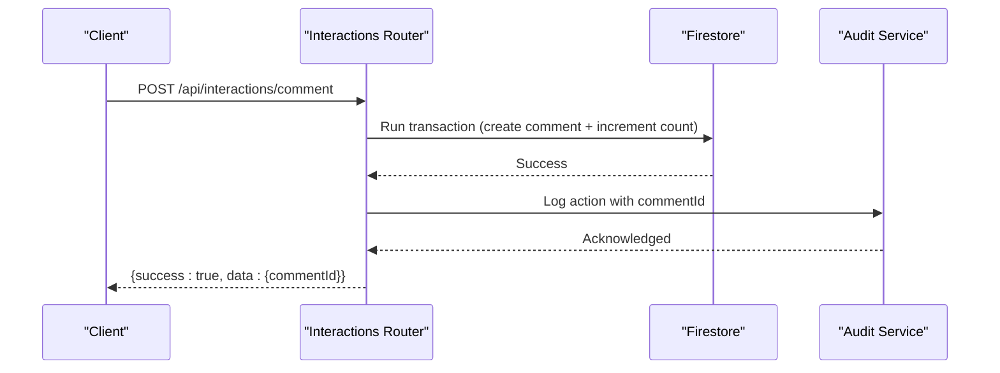
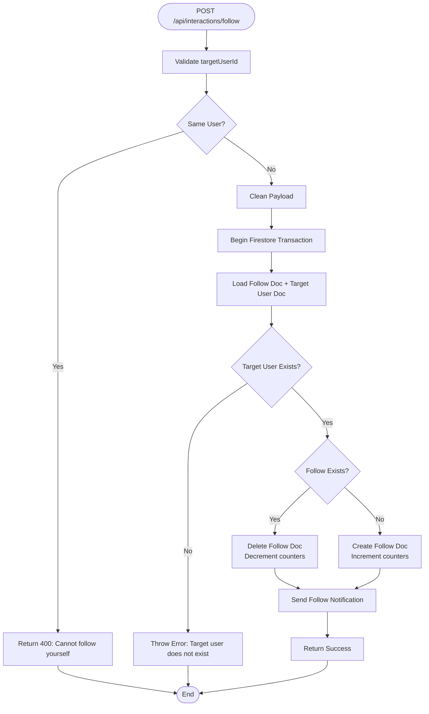
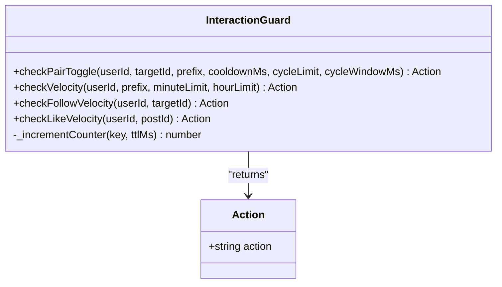
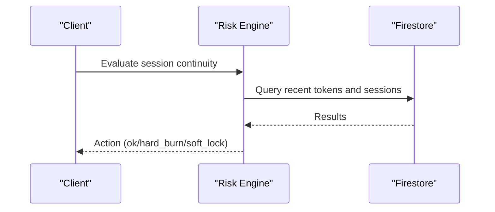
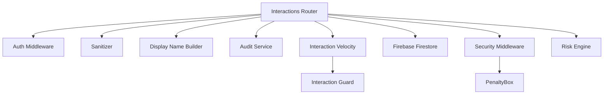

# Interactions API

<cite>
**Referenced Files in This Document**
- [interactions.js](file://backend/src/routes/interactions.js)
- [InteractionGuard.js](file://backend/src/services/InteractionGuard.js)
- [interactionVelocity.js](file://backend/src/middleware/interactionVelocity.js)
- [auth.js](file://backend/src/middleware/auth.js)
- [sanitizer.js](file://backend/src/utils/sanitizer.js)
- [userDisplayName.js](file://backend/src/utils/userDisplayName.js)
- [auditService.js](file://backend/src/services/auditService.js)
- [RiskEngine.js](file://backend/src/services/RiskEngine.js)
- [PenaltyBox.js](file://backend/src/services/PenaltyBox.js)
- [security.js](file://backend/src/middleware/security.js)
- [deviceContext.js](file://backend/src/middleware/deviceContext.js)
- [firebase.js](file://backend/src/config/firebase.js)
</cite>

## Table of Contents
1. [Introduction](#introduction)
2. [Project Structure](#project-structure)
3. [Core Components](#core-components)
4. [Architecture Overview](#architecture-overview)
5. [Detailed Component Analysis](#detailed-component-analysis)
6. [Dependency Analysis](#dependency-analysis)
7. [Performance Considerations](#performance-considerations)
8. [Troubleshooting Guide](#troubleshooting-guide)
9. [Conclusion](#conclusion)

## Introduction
This document provides comprehensive API documentation for user interaction endpoints, focusing on like/favorite functionality, comment posting and management, user following/unfollowing operations, and the shadow banning system integration. It details interaction validation rules, rate limiting mechanisms, and abuse prevention measures. The documentation includes request/response schemas for interaction objects, engagement tracking, privacy controls, and the interaction guard service that prevents spam and automated abuse. It also provides examples of interaction workflows, conflict resolution for concurrent operations, and integration patterns with the risk engine for suspicious activity detection.

## Project Structure
The interactions API is implemented as an Express router module that integrates with Firebase Firestore for persistence and authentication. The system enforces security through middleware layers, including authentication, input sanitization, rate limiting, and behavioral monitoring.

**Diagram sources**
- [interactions.js](file://backend/src/routes/interactions.js#L1-L522)
- [auth.js](file://backend/src/middleware/auth.js#L1-L164)
- [sanitizer.js](file://backend/src/utils/sanitizer.js#L1-L64)
- [userDisplayName.js](file://backend/src/utils/userDisplayName.js#L1-L38)
- [auditService.js](file://backend/src/services/auditService.js#L1-L33)
- [interactionVelocity.js](file://backend/src/middleware/interactionVelocity.js#L1-L62)
- [InteractionGuard.js](file://backend/src/services/InteractionGuard.js#L1-L124)
- [firebase.js](file://backend/src/config/firebase.js#L1-L46)

**Section sources**
- [interactions.js](file://backend/src/routes/interactions.js#L1-L522)
- [auth.js](file://backend/src/middleware/auth.js#L1-L164)
- [sanitizer.js](file://backend/src/utils/sanitizer.js#L1-L64)
- [userDisplayName.js](file://backend/src/utils/userDisplayName.js#L1-L38)
- [auditService.js](file://backend/src/services/auditService.js#L1-L33)
- [interactionVelocity.js](file://backend/src/middleware/interactionVelocity.js#L1-L62)
- [InteractionGuard.js](file://backend/src/services/InteractionGuard.js#L1-L124)
- [firebase.js](file://backend/src/config/firebase.js#L1-L46)

## Core Components
- Interactions Router: Defines endpoints for likes, comments, follows, and event attendance with transactional updates and audit logging.
- Authentication Middleware: Validates Firebase ID tokens and custom JWTs, attaches user context, and enforces account status checks.
- Interaction Guard: Implements hybrid behavioral model to detect and mitigate graph abuse via shadow suppression and strict blocking.
- Sanitization Utilities: Provides XSS protection and mass assignment defense for incoming payloads.
- Audit Service: Logs sensitive actions to a dedicated collection for compliance and forensic analysis.
- Risk Engine: Evaluates session continuity and risk scores for suspicious activity detection.
- Security Middleware: Applies secure headers, CORS policies, and request timeouts tailored to interaction-heavy routes.

**Section sources**
- [interactions.js](file://backend/src/routes/interactions.js#L1-L522)
- [auth.js](file://backend/src/middleware/auth.js#L1-L164)
- [InteractionGuard.js](file://backend/src/services/InteractionGuard.js#L1-L124)
- [sanitizer.js](file://backend/src/utils/sanitizer.js#L1-L64)
- [auditService.js](file://backend/src/services/auditService.js#L1-L33)
- [RiskEngine.js](file://backend/src/services/RiskEngine.js#L1-L170)
- [security.js](file://backend/src/middleware/security.js#L1-L75)

## Architecture Overview
The interactions API follows a layered architecture:
- Presentation Layer: Express routes define the API surface.
- Validation Layer: Express validators and sanitizers ensure data integrity.
- Business Logic Layer: Transactional Firestore operations maintain consistency.
- Security Layer: Authentication, rate limiting, and behavioral monitoring protect the system.
- Persistence Layer: Firebase Firestore stores interactions, metadata, and audit trails.

**Diagram sources**
- [interactions.js](file://backend/src/routes/interactions.js#L24-L103)
- [auth.js](file://backend/src/middleware/auth.js#L20-L161)
- [interactionVelocity.js](file://backend/src/middleware/interactionVelocity.js#L8-L61)
- [InteractionGuard.js](file://backend/src/services/InteractionGuard.js#L47-L80)
- [auditService.js](file://backend/src/services/auditService.js#L9-L29)

## Detailed Component Analysis

### Like/Favorite Endpoints
- Endpoint: POST /api/interactions/like
- Purpose: Toggle like/unlike for a post with transactional consistency.
- Validation: Requires postId; enforced via express-validator.
- Sanitization: Payload cleaned using allowed fields and XSS sanitization.
- Behavior:
  - Like: Creates a like document and increments post likeCount.
  - Unlike: Deletes like document and decrements post likeCount.
  - Notification: Asynchronously sends a like notification to the post author.
  - Audit: Logs POST_LIKE_TOGGLE action with metadata.
- Velocity Control: Uses enforceLikeVelocity middleware backed by InteractionGuard.
- Shadow Banning: Returns suppressed response for rapid toggles without DB writes.

**Diagram sources**
- [interactions.js](file://backend/src/routes/interactions.js#L28-L103)
- [InteractionGuard.js](file://backend/src/services/InteractionGuard.js#L115-L122)

**Section sources**
- [interactions.js](file://backend/src/routes/interactions.js#L24-L103)
- [interactionVelocity.js](file://backend/src/middleware/interactionVelocity.js#L36-L61)
- [InteractionGuard.js](file://backend/src/services/InteractionGuard.js#L47-L80)
- [sanitizer.js](file://backend/src/utils/sanitizer.js#L60-L63)
- [auditService.js](file://backend/src/services/auditService.js#L9-L29)

### Comment Posting and Management
- Endpoint: POST /api/interactions/comment
- Purpose: Add a top-level comment to a post with transactional consistency.
- Validation: Requires postId and text; enforced via express-validator.
- Sanitization: Payload cleaned using allowed fields and XSS sanitization.
- Behavior:
  - Creates a comment document with author metadata and timestamps.
  - Increments post commentCount.
  - Notification: Asynchronously sends a comment notification to the post author.
  - Audit: Logs POST_COMMENT_CREATED action with commentId metadata.
- Retrieval: GET /api/interactions/comments/:postId returns comments ordered by creation time.

**Diagram sources**
- [interactions.js](file://backend/src/routes/interactions.js#L105-L171)
- [auditService.js](file://backend/src/services/auditService.js#L9-L29)

**Section sources**
- [interactions.js](file://backend/src/routes/interactions.js#L105-L171)
- [sanitizer.js](file://backend/src/utils/sanitizer.js#L60-L63)
- [auditService.js](file://backend/src/services/auditService.js#L9-L29)

### Follow/Unfollow Operations
- Endpoint: POST /api/interactions/follow
- Purpose: Follow or unfollow another user with transactional consistency.
- Validation: Requires targetUserId; enforced via express-validator.
- Constraints: Self-following is disallowed.
- Behavior:
  - Follow: Creates a follow document and increments both user counters.
  - Unfollow: Deletes follow document and decrements both user counters.
  - Notification: Asynchronously sends a follow notification to the target user.
- Velocity Control: Uses enforceFollowVelocity middleware backed by InteractionGuard.

**Diagram sources**
- [interactions.js](file://backend/src/routes/interactions.js#L173-L246)
- [InteractionGuard.js](file://backend/src/services/InteractionGuard.js#L103-L110)

**Section sources**
- [interactions.js](file://backend/src/routes/interactions.js#L173-L246)
- [interactionVelocity.js](file://backend/src/middleware/interactionVelocity.js#L8-L34)
- [InteractionGuard.js](file://backend/src/services/InteractionGuard.js#L103-L110)

### Event Attendance (Join/Leave)
- Endpoint: POST /api/interactions/event/join
- Purpose: Join or leave an event with synchronized attendance and group membership.
- Validation: Requires eventId; enforced via express-validator.
- Constraints: Cannot join archived or expired events.
- Behavior:
  - Join: Creates attendance and group membership documents; increments attendeeCount.
  - Leave: Deletes both documents; decrements attendeeCount.
- Deterministic IDs: Uses composite keys to prevent duplicates across systems.

**Section sources**
- [interactions.js](file://backend/src/routes/interactions.js#L248-L322)

### Batch Like Checking
- Endpoint: POST /api/interactions/likes/batch
- Purpose: Efficiently check likes for multiple post IDs in a single call.
- Constraints: Firestore 'in' queries limited to 30 items; automatically chunks larger lists.
- Output: Returns a map of postIds to boolean liked status.

**Section sources**
- [interactions.js](file://backend/src/routes/interactions.js#L372-L419)

### Individual Interaction Status Checks
- GET /api/interactions/likes/check: Check if current user liked a post and retrieve canonical likeCount.
- GET /api/interactions/follows/check: Check if current user follows a target user.
- GET /api/interactions/events/check: Check if current user is attending an event.
- GET /api/interactions/events/my-events: Retrieve list of event IDs the current user has joined.

**Section sources**
- [interactions.js](file://backend/src/routes/interactions.js#L421-L518)

### Interaction Guard Service
The Interaction Guard enforces a hybrid behavioral model to prevent graph abuse:
- Shadow Suppression: Rapid toggles (under 3 seconds) are silently dropped while returning a success response to confuse bots.
- Strict Blocking: Excessive cycling (e.g., rapid like/unlike cycles) triggers a 429 response for 5 minutes.
- Global Velocity Limits: Enforces per-minute and per-hour caps for likes and follows.

**Diagram sources**
- [InteractionGuard.js](file://backend/src/services/InteractionGuard.js#L22-L123)

**Section sources**
- [InteractionGuard.js](file://backend/src/services/InteractionGuard.js#L16-L123)
- [interactionVelocity.js](file://backend/src/middleware/interactionVelocity.js#L8-L61)

### Privacy Controls and Data Handling
- Input Sanitization: XSS protection and mass assignment defense applied to all interaction endpoints.
- Display Name Resolution: Builds human-readable names from user profile data with fallbacks.
- Device Fingerprinting: Hashes IP, User-Agent, and Device-ID for session continuity checks without storing raw identifiers.
- Audit Logging: Captures action metadata, IP, and User-Agent for compliance and forensic analysis.

**Section sources**
- [sanitizer.js](file://backend/src/utils/sanitizer.js#L1-L64)
- [userDisplayName.js](file://backend/src/utils/userDisplayName.js#L1-L38)
- [deviceContext.js](file://backend/src/middleware/deviceContext.js#L1-L24)
- [auditService.js](file://backend/src/services/auditService.js#L1-L33)

### Integration Patterns with Risk Engine
The risk engine evaluates session continuity and risk scores to detect suspicious activity:
- Session Continuity: Monitors concurrent refresh races, velocity, and active session limits.
- Risk Scoring: Calculates risk scores based on device, user agent, and IP changes with temporal decay.
- Containment Actions: Supports full session burns and token version bumps for compromised accounts.

**Diagram sources**
- [RiskEngine.js](file://backend/src/services/RiskEngine.js#L71-L130)

**Section sources**
- [RiskEngine.js](file://backend/src/services/RiskEngine.js#L1-L170)

## Dependency Analysis
The interactions API integrates multiple services and middleware layers to ensure robustness and security.

**Diagram sources**
- [interactions.js](file://backend/src/routes/interactions.js#L1-L522)
- [auth.js](file://backend/src/middleware/auth.js#L1-L164)
- [sanitizer.js](file://backend/src/utils/sanitizer.js#L1-L64)
- [userDisplayName.js](file://backend/src/utils/userDisplayName.js#L1-L38)
- [auditService.js](file://backend/src/services/auditService.js#L1-L33)
- [interactionVelocity.js](file://backend/src/middleware/interactionVelocity.js#L1-L62)
- [InteractionGuard.js](file://backend/src/services/InteractionGuard.js#L1-L124)
- [security.js](file://backend/src/middleware/security.js#L1-L75)
- [PenaltyBox.js](file://backend/src/services/PenaltyBox.js#L1-L108)
- [RiskEngine.js](file://backend/src/services/RiskEngine.js#L1-L170)

**Section sources**
- [interactions.js](file://backend/src/routes/interactions.js#L1-L522)
- [auth.js](file://backend/src/middleware/auth.js#L1-L164)
- [sanitizer.js](file://backend/src/utils/sanitizer.js#L1-L64)
- [userDisplayName.js](file://backend/src/utils/userDisplayName.js#L1-L38)
- [auditService.js](file://backend/src/services/auditService.js#L1-L33)
- [interactionVelocity.js](file://backend/src/middleware/interactionVelocity.js#L1-L62)
- [InteractionGuard.js](file://backend/src/services/InteractionGuard.js#L1-L124)
- [security.js](file://backend/src/middleware/security.js#L1-L75)
- [PenaltyBox.js](file://backend/src/services/PenaltyBox.js#L1-L108)
- [RiskEngine.js](file://backend/src/services/RiskEngine.js#L1-L170)

## Performance Considerations
- Transactional Updates: All write operations use Firestore transactions to ensure consistency and atomicity.
- Batch Queries: Likes batch endpoint chunks requests to respect Firestore query limits.
- Caching: Authentication middleware caches user profiles to reduce Firestore overhead.
- Timeouts: Request timeout middleware adjusts timeouts for slow routes (posts, interactions, proxy) to accommodate Firestore latency.
- Rate Limiting: Progressive rate limiting and speed limiter mitigate abuse while maintaining responsiveness.

[No sources needed since this section provides general guidance]

## Troubleshooting Guide
Common issues and resolutions:
- Authentication Failures: Ensure valid Firebase ID token or custom JWT with proper headers and scopes.
- Rate Limiting: If receiving 429 responses, slow down requests or wait for the rate limiter to reset.
- Shadow Suppression: Rapid toggles may appear successful but are silently ignored to prevent abuse.
- Session Continuity: High-risk sessions may trigger soft locks or hard burns; verify device and IP consistency.
- Audit Logging: Failures in audit logging do not impact primary operations but are logged for observability.

**Section sources**
- [auth.js](file://backend/src/middleware/auth.js#L20-L161)
- [interactionVelocity.js](file://backend/src/middleware/interactionVelocity.js#L8-L61)
- [RiskEngine.js](file://backend/src/services/RiskEngine.js#L71-L130)
- [auditService.js](file://backend/src/services/auditService.js#L24-L28)

## Conclusion
The Interactions API provides a robust, secure, and scalable foundation for user engagement features. Through transactional updates, behavioral monitoring, and comprehensive security layers, it mitigates abuse while maintaining a smooth user experience. The integration with the risk engine and audit service ensures continuous monitoring and compliance for suspicious activities.