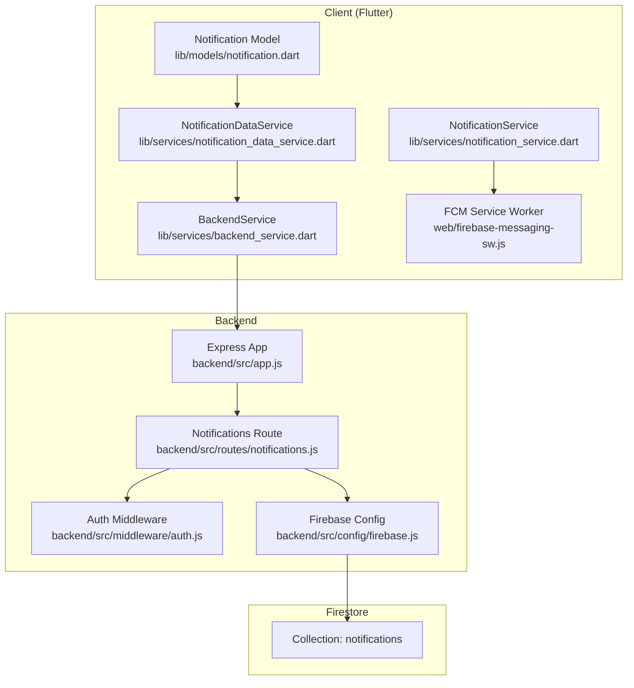
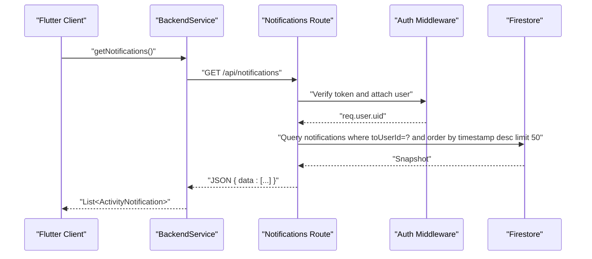
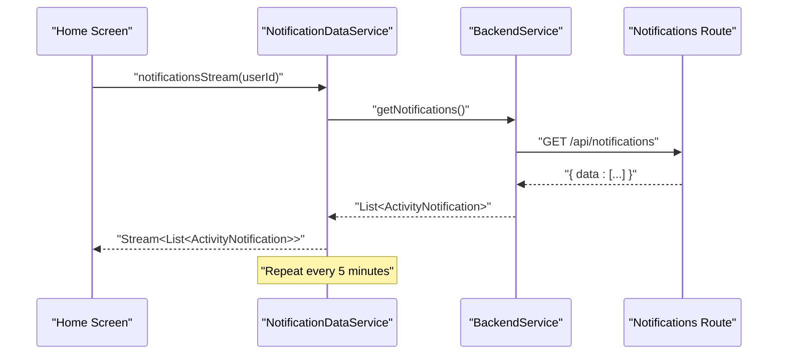
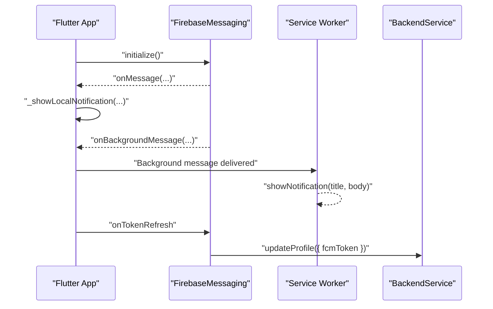
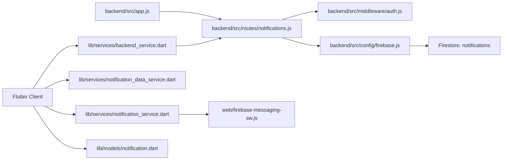

# Notifications API

<cite>
**Referenced Files in This Document**
- [backend/src/routes/notifications.js](file://backend/src/routes/notifications.js)
- [backend/src/middleware/auth.js](file://backend/src/middleware/auth.js)
- [backend/src/app.js](file://backend/src/app.js)
- [backend/src/config/firebase.js](file://backend/src/config/firebase.js)
- [testpro-main/lib/services/backend_service.dart](file://testpro-main/lib/services/backend_service.dart)
- [testpro-main/lib/models/notification.dart](file://testpro-main/lib/models/notification.dart)
- [testpro-main/lib/services/notification_data_service.dart](file://testpro-main/lib/services/notification_data_service.dart)
- [testpro-main/lib/services/notification_service.dart](file://testpro-main/lib/services/notification_service.dart)
- [testpro-main/web/firebase-messaging-sw.js](file://testpro-main/web/firebase-messaging-sw.js)
- [testpro-main/firestore.indexes.json](file://testpro-main/firestore.indexes.json)
- [testpro-main/pubspec.yaml](file://testpro-main/pubspec.yaml)
</cite>

## Table of Contents
1. [Introduction](#introduction)
2. [Project Structure](#project-structure)
3. [Core Components](#core-components)
4. [Architecture Overview](#architecture-overview)
5. [Detailed Component Analysis](#detailed-component-analysis)
6. [Dependency Analysis](#dependency-analysis)
7. [Performance Considerations](#performance-considerations)
8. [Troubleshooting Guide](#troubleshooting-guide)
9. [Conclusion](#conclusion)
10. [Appendices](#appendices)

## Introduction
This document provides comprehensive API documentation for the notification management endpoints, covering retrieval, read status marking, and integration with Firebase Cloud Messaging for push notifications. It also documents the client-side Flutter integration, real-time update mechanisms via periodic polling, and operational guidance for delivery and troubleshooting.

## Project Structure
The notification system spans:
- Backend Express routes for retrieving and marking notifications
- Authentication middleware enforcing per-user access
- Firestore-backed storage with appropriate indexes
- Flutter client services for fetching, displaying, and handling push notifications

**Diagram sources**
- [backend/src/app.js](file://backend/src/app.js#L51-L60)
- [backend/src/routes/notifications.js](file://backend/src/routes/notifications.js#L1-L50)
- [backend/src/middleware/auth.js](file://backend/src/middleware/auth.js#L20-L161)
- [backend/src/config/firebase.js](file://backend/src/config/firebase.js#L27-L45)
- [testpro-main/lib/services/backend_service.dart](file://testpro-main/lib/services/backend_service.dart#L430-L448)
- [testpro-main/lib/services/notification_data_service.dart](file://testpro-main/lib/services/notification_data_service.dart#L7-L12)
- [testpro-main/lib/services/notification_service.dart](file://testpro-main/lib/services/notification_service.dart#L36-L93)
- [testpro-main/web/firebase-messaging-sw.js](file://testpro-main/web/firebase-messaging-sw.js#L1-L25)

**Section sources**
- [backend/src/app.js](file://backend/src/app.js#L51-L60)
- [backend/src/routes/notifications.js](file://backend/src/routes/notifications.js#L1-L50)
- [backend/src/middleware/auth.js](file://backend/src/middleware/auth.js#L20-L161)
- [backend/src/config/firebase.js](file://backend/src/config/firebase.js#L27-L45)
- [testpro-main/lib/services/backend_service.dart](file://testpro-main/lib/services/backend_service.dart#L430-L448)
- [testpro-main/lib/services/notification_data_service.dart](file://testpro-main/lib/services/notification_data_service.dart#L7-L12)
- [testpro-main/lib/services/notification_service.dart](file://testpro-main/lib/services/notification_service.dart#L36-L93)
- [testpro-main/web/firebase-messaging-sw.js](file://testpro-main/web/firebase-messaging-sw.js#L1-L25)

## Core Components
- Notifications endpoint: GET /api/notifications retrieves paginated notifications for the authenticated user.
- Read status endpoint: PATCH /api/notifications/:id/read marks a single notification as read.
- Client-side retrieval: BackendService.getNotifications fetches notifications and maps to ActivityNotification model.
- Real-time update mechanism: Periodic polling via NotificationDataService to refresh the notification list.
- Push notifications: Flutter FCM integration with foreground/background handlers and a service worker for background notifications.

**Section sources**
- [backend/src/routes/notifications.js](file://backend/src/routes/notifications.js#L11-L29)
- [backend/src/routes/notifications.js](file://backend/src/routes/notifications.js#L35-L48)
- [testpro-main/lib/services/backend_service.dart](file://testpro-main/lib/services/backend_service.dart#L430-L448)
- [testpro-main/lib/models/notification.dart](file://testpro-main/lib/models/notification.dart#L35-L87)
- [testpro-main/lib/services/notification_data_service.dart](file://testpro-main/lib/services/notification_data_service.dart#L7-L12)
- [testpro-main/lib/services/notification_service.dart](file://testpro-main/lib/services/notification_service.dart#L36-L93)
- [testpro-main/web/firebase-messaging-sw.js](file://testpro-main/web/firebase-messaging-sw.js#L15-L24)

## Architecture Overview
The notification architecture integrates backend endpoints, Firestore persistence, and Flutter client capabilities.

**Diagram sources**
- [backend/src/routes/notifications.js](file://backend/src/routes/notifications.js#L11-L29)
- [backend/src/middleware/auth.js](file://backend/src/middleware/auth.js#L20-L161)
- [backend/src/config/firebase.js](file://backend/src/config/firebase.js#L41-L45)
- [testpro-main/lib/services/backend_service.dart](file://testpro-main/lib/services/backend_service.dart#L430-L438)

## Detailed Component Analysis

### Backend Notifications Endpoint
- Route: GET /api/notifications
- Behavior:
  - Authenticates the request using the auth middleware.
  - Queries the Firestore collection "notifications" filtered by toUserId equal to the authenticated user’s uid.
  - Orders by timestamp descending and limits to 50 results.
  - Returns an array of notification objects with timestamp normalized to ISO string.
- Response envelope: { data: [...notifications] }

- Route: PATCH /api/notifications/:id/read
- Behavior:
  - Retrieves the notification document by ID.
  - Validates existence and ownership (toUserId matches req.user.uid).
  - Updates the document to set isRead to true.
  - Returns { success: true } on completion.

**Section sources**
- [backend/src/routes/notifications.js](file://backend/src/routes/notifications.js#L11-L29)
- [backend/src/routes/notifications.js](file://backend/src/routes/notifications.js#L35-L48)

### Authentication and Authorization
- The auth middleware verifies either:
  - A custom short-lived JWT (when JWT_ACCESS_SECRET is present), or
  - A Firebase ID token (fallback).
- Enforces account status checks and attaches a sanitized user object to req.user.
- The notifications endpoints are mounted under protected middleware, ensuring per-user isolation.

**Section sources**
- [backend/src/middleware/auth.js](file://backend/src/middleware/auth.js#L20-L161)
- [backend/src/app.js](file://backend/src/app.js#L53-L60)

### Firestore Storage and Indexing
- Collection: notifications
- Indexed fields:
  - toUserId (ASCENDING)
  - timestamp (DESCENDING)
- This composite index supports efficient retrieval of a user’s notifications ordered by recency.

**Section sources**
- [testpro-main/firestore.indexes.json](file://testpro-main/firestore.indexes.json#L46-L58)

### Client-Side Retrieval and Mapping
- BackendService.getNotifications performs an authenticated GET to /api/notifications and maps the response to a list of ActivityNotification objects.
- ActivityNotification includes fields: id, fromUserId, fromUserName, fromUserProfileImage, toUserId, type, postId, postThumbnail, commentText, timestamp, isRead.
- Type parsing supports like, comment, follow, mention.

**Section sources**
- [testpro-main/lib/services/backend_service.dart](file://testpro-main/lib/services/backend_service.dart#L430-L438)
- [testpro-main/lib/models/notification.dart](file://testpro-main/lib/models/notification.dart#L35-L87)

### Real-Time Update Mechanism
- NotificationDataService periodically polls the backend every 5 minutes to refresh the notification list.
- The UI displays a red badge indicating unread counts derived from the fetched list.

**Diagram sources**
- [testpro-main/lib/services/notification_data_service.dart](file://testpro-main/lib/services/notification_data_service.dart#L7-L12)
- [testpro-main/lib/services/backend_service.dart](file://testpro-main/lib/services/backend_service.dart#L430-L438)
- [backend/src/routes/notifications.js](file://backend/src/routes/notifications.js#L11-L29)

**Section sources**
- [testpro-main/lib/services/notification_data_service.dart](file://testpro-main/lib/services/notification_data_service.dart#L7-L12)
- [testpro-main/lib/screeshots/home_screen.dart](file://testpro-main/lib/screens/home_screen.dart#L291-L316)

### Push Notification Delivery and Background Processing
- Flutter FCM integration:
  - Foreground handler: onMessage listens for incoming messages and shows a local notification.
  - Background handler: onBackgroundMessage registered for background processing.
  - Token refresh: onTokenRefresh triggers a sync of the FCM token to the backend.
- Web service worker:
  - firebase-messaging-sw.js handles background messages and displays notifications in the browser.

**Diagram sources**
- [testpro-main/lib/services/notification_service.dart](file://testpro-main/lib/services/notification_service.dart#L36-L93)
- [testpro-main/web/firebase-messaging-sw.js](file://testpro-main/web/firebase-messaging-sw.js#L15-L24)
- [testpro-main/lib/services/backend_service.dart](file://testpro-main/lib/services/backend_service.dart#L76-L84)

**Section sources**
- [testpro-main/lib/services/notification_service.dart](file://testpro-main/lib/services/notification_service.dart#L36-L93)
- [testpro-main/web/firebase-messaging-sw.js](file://testpro-main/web/firebase-messaging-sw.js#L1-L25)
- [testpro-main/lib/services/backend_service.dart](file://testpro-main/lib/services/backend_service.dart#L76-L84)

### Notification Preferences Management
- The current backend does not expose explicit endpoints for managing notification preferences (e.g., opt-in/out, channels).
- The Flutter client stores and synchronizes an FCM token with the backend profile update endpoint, enabling targeted push delivery.

**Section sources**
- [testpro-main/lib/services/backend_service.dart](file://testpro-main/lib/services/backend_service.dart#L296-L305)
- [testpro-main/lib/services/notification_service.dart](file://testpro-main/lib/services/notification_service.dart#L76-L84)

### Request/Response Schemas

- GET /api/notifications
  - Request: Authorization Bearer token (Firebase or custom JWT)
  - Response: { data: [ { id, fromUserId, fromUserName, fromUserProfileImage?, toUserId, type, postId?, postThumbnail?, commentText?, timestamp, isRead } ] }
  - Notes:
    - type is one of: like, comment, follow, mention
    - timestamp is returned as ISO string
    - Pagination: limit 50, sorted by timestamp desc

- PATCH /api/notifications/:id/read
  - Request: Authorization Bearer token
  - Path params: id (notification document ID)
  - Response: { success: true } on success

- ActivityNotification (Flutter model)
  - Fields: id, fromUserId, fromUserName, fromUserProfileImage, toUserId, type, postId, postThumbnail, commentText, timestamp (DateTime), isRead (bool)

**Section sources**
- [backend/src/routes/notifications.js](file://backend/src/routes/notifications.js#L11-L29)
- [backend/src/routes/notifications.js](file://backend/src/routes/notifications.js#L35-L48)
- [testpro-main/lib/models/notification.dart](file://testpro-main/lib/models/notification.dart#L35-L87)

### Firebase Cloud Functions Integration
- The repository includes a functions/index.js that initializes Firebase Admin and defines Firestore-triggered functions for counters (likes, comments, followers, posts).
- These functions demonstrate the pattern for serverless background processing and are compatible with Firestore triggers.

**Section sources**
- [testpro-main/functions/index.js](file://testpro-main/functions/index.js#L1-L112)

### Batching and Deduplication Strategies
- Backend retrieval:
  - Limit: 50 notifications per request.
  - Sorting: timestamp DESC ensures most recent appear first.
- Client polling:
  - Periodic polling every 5 minutes to avoid request storms while keeping UX responsive.
- Deduplication:
  - No explicit deduplication logic is implemented in the backend route or client services. If multiple identical events occur, they will appear as separate notifications unless handled server-side.

**Section sources**
- [backend/src/routes/notifications.js](file://backend/src/routes/notifications.js#L13-L16)
- [testpro-main/lib/services/notification_data_service.dart](file://testpro-main/lib/services/notification_data_service.dart#L5-L12)

### Real-Time Update Mechanisms
- Current state:
  - Periodic polling every 5 minutes for notification lists.
  - Foreground and background FCM handling for push notifications.
- Recommendations:
  - Consider WebSocket or Firestore listeners for near-real-time updates if latency is critical.
  - Ensure client-side caching and optimistic updates for PATCH /api/notifications/:id/read.

**Section sources**
- [testpro-main/lib/services/notification_data_service.dart](file://testpro-main/lib/services/notification_data_service.dart#L7-L12)
- [testpro-main/lib/services/notification_service.dart](file://testpro-main/lib/services/notification_service.dart#L36-L93)

## Dependency Analysis
- Backend depends on:
  - Express app mounting protected routes
  - Auth middleware for user verification
  - Firebase Admin SDK for Firestore access
- Client depends on:
  - BackendService for HTTP calls
  - NotificationDataService for periodic updates
  - NotificationService for FCM integration
  - Notification model for serialization/deserialization

**Diagram sources**
- [backend/src/app.js](file://backend/src/app.js#L51-L60)
- [backend/src/routes/notifications.js](file://backend/src/routes/notifications.js#L1-L50)
- [backend/src/middleware/auth.js](file://backend/src/middleware/auth.js#L20-L161)
- [backend/src/config/firebase.js](file://backend/src/config/firebase.js#L27-L45)
- [testpro-main/lib/services/backend_service.dart](file://testpro-main/lib/services/backend_service.dart#L430-L448)
- [testpro-main/lib/services/notification_data_service.dart](file://testpro-main/lib/services/notification_data_service.dart#L7-L12)
- [testpro-main/lib/services/notification_service.dart](file://testpro-main/lib/services/notification_service.dart#L36-L93)
- [testpro-main/web/firebase-messaging-sw.js](file://testpro-main/web/firebase-messaging-sw.js#L1-L25)

**Section sources**
- [backend/src/app.js](file://backend/src/app.js#L51-L60)
- [backend/src/routes/notifications.js](file://backend/src/routes/notifications.js#L1-L50)
- [backend/src/middleware/auth.js](file://backend/src/middleware/auth.js#L20-L161)
- [backend/src/config/firebase.js](file://backend/src/config/firebase.js#L27-L45)
- [testpro-main/lib/services/backend_service.dart](file://testpro-main/lib/services/backend_service.dart#L430-L448)
- [testpro-main/lib/services/notification_data_service.dart](file://testpro-main/lib/services/notification_data_service.dart#L7-L12)
- [testpro-main/lib/services/notification_service.dart](file://testpro-main/lib/services/notification_service.dart#L36-L93)
- [testpro-main/web/firebase-messaging-sw.js](file://testpro-main/web/firebase-messaging-sw.js#L1-L25)

## Performance Considerations
- Backend:
  - Composite index on notifications: toUserId ASC, timestamp DESC enables fast per-user queries.
  - Limit 50 per page reduces payload size and query cost.
- Client:
  - Polling interval of 5 minutes balances freshness and cost.
  - Consider caching and optimistic UI updates for PATCH /api/notifications/:id/read.
- FCM:
  - Ensure token refresh handling avoids stale subscriptions.
  - Use background handlers judiciously to minimize battery impact.

[No sources needed since this section provides general guidance]

## Troubleshooting Guide
- 401 Unauthorized on GET /api/notifications
  - Cause: Missing or invalid Authorization header.
  - Resolution: Ensure a valid Bearer token is included; verify token type (custom JWT vs Firebase ID token).

- 403 Forbidden on PATCH /api/notifications/:id/read
  - Cause: Notification belongs to another user.
  - Resolution: Verify ownership before attempting to mark as read.

- 404 Not Found on PATCH /api/notifications/:id/read
  - Cause: Notification ID does not exist.
  - Resolution: Confirm the notification exists and the client is using the correct ID.

- FCM token not syncing
  - Symptoms: Push notifications not received.
  - Resolution: Check onTokenRefresh handler and BackendService.updateProfile call; ensure network connectivity and backend availability.

- Background notifications not showing in browser
  - Symptoms: Foreground notifications work; background does not.
  - Resolution: Verify firebase-messaging-sw.js initialization and background handler registration.

**Section sources**
- [backend/src/routes/notifications.js](file://backend/src/routes/notifications.js#L35-L48)
- [testpro-main/lib/services/notification_service.dart](file://testpro-main/lib/services/notification_service.dart#L76-L93)
- [testpro-main/web/firebase-messaging-sw.js](file://testpro-main/web/firebase-messaging-sw.js#L15-L24)

## Conclusion
The notification system provides reliable retrieval and read status management backed by Firestore and secured by robust authentication. Client-side integration covers periodic polling for activity lists and comprehensive FCM handling for push notifications. While batching and deduplication are not implemented at this time, the system’s indexing and polling strategy offer a solid foundation for scaling and enhancement.

[No sources needed since this section summarizes without analyzing specific files]

## Appendices

### API Reference Summary
- GET /api/notifications
  - Description: Retrieve paginated notifications for the authenticated user.
  - Query: None
  - Headers: Authorization: Bearer <token>
  - Response: { data: [ { id, fromUserId, fromUserName, fromUserProfileImage?, toUserId, type, postId?, postThumbnail?, commentText?, timestamp, isRead } ] }

- PATCH /api/notifications/:id/read
  - Description: Mark a notification as read.
  - Path params: id
  - Headers: Authorization: Bearer <token>
  - Response: { success: true }

**Section sources**
- [backend/src/routes/notifications.js](file://backend/src/routes/notifications.js#L11-L29)
- [backend/src/routes/notifications.js](file://backend/src/routes/notifications.js#L35-L48)