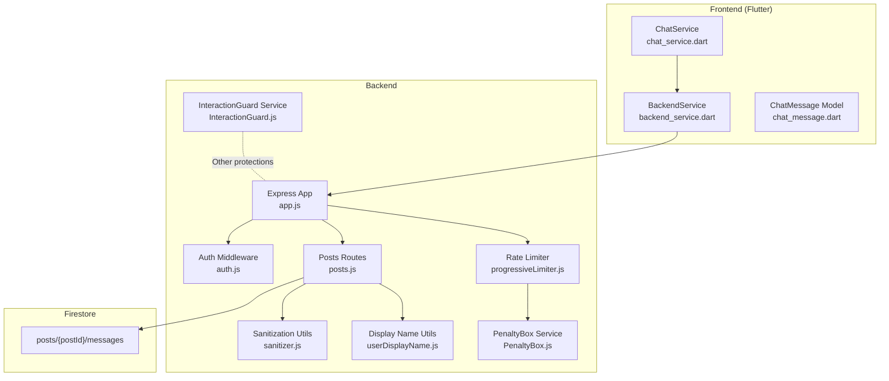
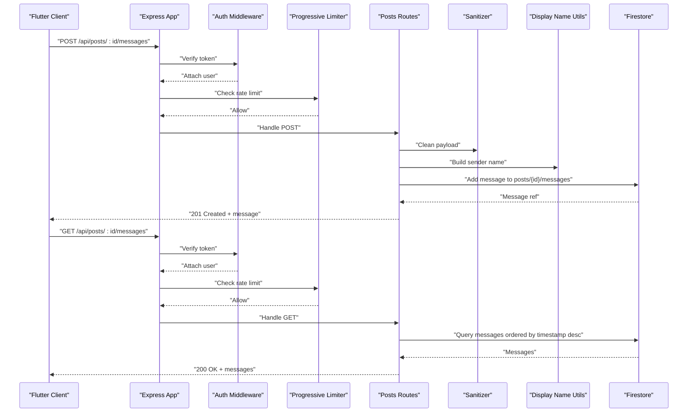
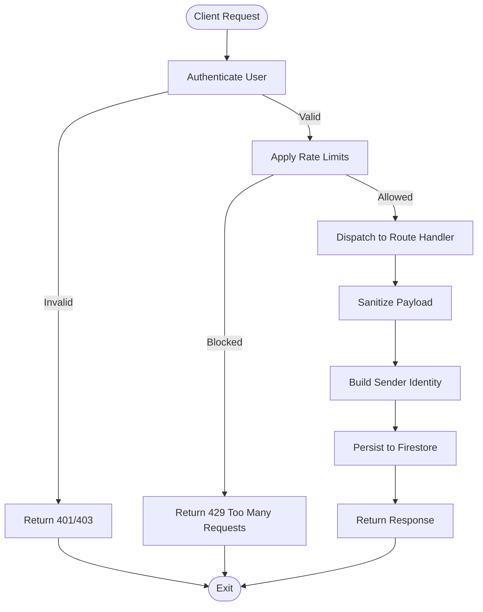
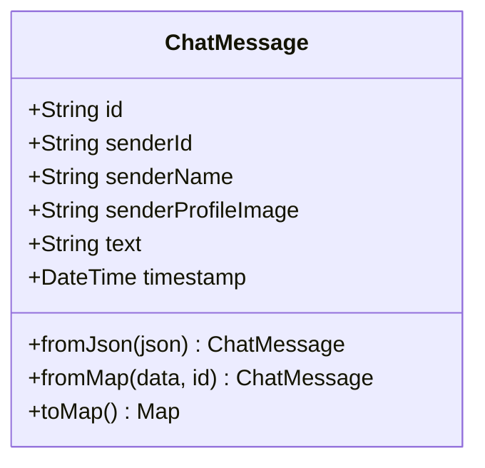
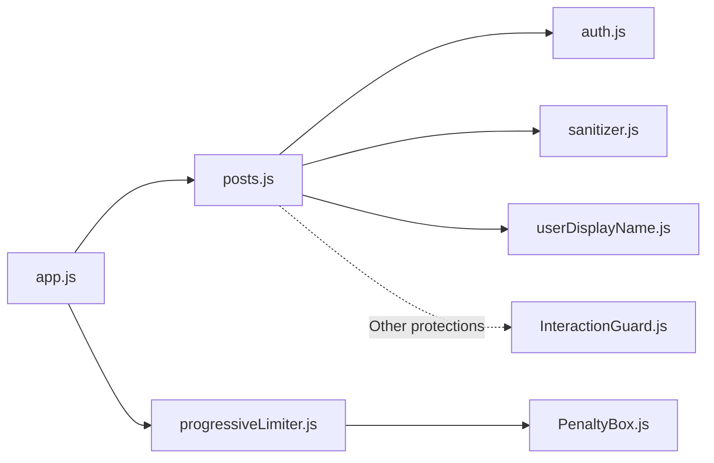

# Chat Messages for Events

<cite>
**Referenced Files in This Document**
- [posts.js](file://backend/src/routes/posts.js)
- [auth.js](file://backend/src/middleware/auth.js)
- [sanitizer.js](file://backend/src/utils/sanitizer.js)
- [userDisplayName.js](file://backend/src/utils/userDisplayName.js)
- [app.js](file://backend/src/app.js)
- [progressiveLimiter.js](file://backend/src/middleware/progressiveLimiter.js)
- [PenaltyBox.js](file://backend/src/services/PenaltyBox.js)
- [InteractionGuard.js](file://backend/src/services/InteractionGuard.js)
- [chat_service.dart](file://testpro-main/lib/services/chat_service.dart)
- [backend_service.dart](file://testpro-main/lib/services/backend_service.dart)
- [chat_message.dart](file://testpro-main/lib/models/chat_message.dart)
- [firestore.indexes.json](file://testpro-main/firestore.indexes.json)
</cite>

## Table of Contents
1. [Introduction](#introduction)
2. [Project Structure](#project-structure)
3. [Core Components](#core-components)
4. [Architecture Overview](#architecture-overview)
5. [Detailed Component Analysis](#detailed-component-analysis)
6. [Dependency Analysis](#dependency-analysis)
7. [Performance Considerations](#performance-considerations)
8. [Troubleshooting Guide](#troubleshooting-guide)
9. [Conclusion](#conclusion)

## Introduction
This document provides comprehensive API documentation for the chat messaging system integrated with posts and events. It focuses on:
- Sending chat messages to event or post threads via POST /api/posts/:id/messages
- Retrieving recent chat history via GET /api/posts/:id/messages
- Message data structure, validation, sender identification, and timestamp management
- Security considerations, access control, and privacy protections
- Real-time delivery patterns and integration with the broader event management system
- Moderation capabilities and spam prevention measures

## Project Structure
The chat messaging endpoints are implemented in the backend Express routes and integrated with middleware and services for authentication, rate limiting, sanitization, and display name resolution. The frontend Flutter client consumes these endpoints to provide near-real-time chat experiences.

**Diagram sources**
- [app.js](file://backend/src/app.js#L44-L60)
- [auth.js](file://backend/src/middleware/auth.js#L20-L161)
- [progressiveLimiter.js](file://backend/src/middleware/progressiveLimiter.js#L22-L34)
- [posts.js](file://backend/src/routes/posts.js#L664-L725)
- [sanitizer.js](file://backend/src/utils/sanitizer.js#L60-L63)
- [userDisplayName.js](file://backend/src/utils/userDisplayName.js#L1-L38)
- [PenaltyBox.js](file://backend/src/services/PenaltyBox.js#L22-L68)
- [InteractionGuard.js](file://backend/src/services/InteractionGuard.js#L22-L98)
- [chat_service.dart](file://testpro-main/lib/services/chat_service.dart#L1-L35)
- [backend_service.dart](file://testpro-main/lib/services/backend_service.dart#L361-L380)
- [chat_message.dart](file://testpro-main/lib/models/chat_message.dart#L1-L52)

**Section sources**
- [posts.js](file://backend/src/routes/posts.js#L664-L725)
- [app.js](file://backend/src/app.js#L44-L60)

## Core Components
- Authentication and Authorization: Ensures only authenticated users can send/retrieve messages.
- Rate Limiting: Progressive rate limiter and global penalty box to prevent abuse.
- Sanitization: Strict allow-list and XSS filtering for incoming payloads.
- Display Name Resolution: Builds a safe display name for the sender.
- Firestore Collections: Messages stored under posts/{postId}/messages with server timestamps.

**Section sources**
- [auth.js](file://backend/src/middleware/auth.js#L20-L161)
- [progressiveLimiter.js](file://backend/src/middleware/progressiveLimiter.js#L22-L34)
- [PenaltyBox.js](file://backend/src/services/PenaltyBox.js#L22-L68)
- [sanitizer.js](file://backend/src/utils/sanitizer.js#L60-L63)
- [userDisplayName.js](file://backend/src/utils/userDisplayName.js#L1-L38)
- [posts.js](file://backend/src/routes/posts.js#L664-L725)

## Architecture Overview
The chat messaging endpoints are protected routes mounted under /api/posts with authentication and progressive rate limiting. Messages are persisted in nested collections under each post and retrieved with server-side timestamps.

**Diagram sources**
- [app.js](file://backend/src/app.js#L44-L60)
- [auth.js](file://backend/src/middleware/auth.js#L20-L161)
- [progressiveLimiter.js](file://backend/src/middleware/progressiveLimiter.js#L22-L34)
- [posts.js](file://backend/src/routes/posts.js#L664-L725)
- [sanitizer.js](file://backend/src/utils/sanitizer.js#L60-L63)
- [userDisplayName.js](file://backend/src/utils/userDisplayName.js#L1-L38)

## Detailed Component Analysis

### POST /api/posts/:id/messages
Purpose: Send a chat message to an event or post thread.

Behavior
- Authentication: Requires a valid bearer token.
- Payload Validation:
  - Only the field text is accepted (strict allow-list).
  - Text is sanitized to remove XSS risks.
- Sender Identification:
  - senderId: authenticated user’s uid
  - senderName: resolved via display name utility
  - senderProfileImage: user’s profile URL
- Timestamp Management:
  - Uses server timestamp for consistency across instances.
- Persistence:
  - Writes to posts/{id}/messages collection.

Response
- On success: 201 Created with the created message object including id and server timestamp.
- On validation failure: 400 Bad Request with error message.
- On authentication/authorization failures: 401/403 as enforced by middleware.

Security and Moderation
- Sanitization prevents malicious payloads.
- Rate limiting protects the endpoint from abuse.
- Access control is implicit via authentication middleware.

Real-time Delivery Pattern
- Frontend polls the GET endpoint periodically to refresh messages.
- The Flutter service streams updates every 2 seconds.

Integration with Event Management
- Events are posts with special flags; messages work identically for both posts and events.

**Section sources**
- [posts.js](file://backend/src/routes/posts.js#L664-L696)
- [sanitizer.js](file://backend/src/utils/sanitizer.js#L60-L63)
- [userDisplayName.js](file://backend/src/utils/userDisplayName.js#L1-L38)
- [auth.js](file://backend/src/middleware/auth.js#L20-L161)
- [progressiveLimiter.js](file://backend/src/middleware/progressiveLimiter.js#L22-L34)
- [PenaltyBox.js](file://backend/src/services/PenaltyBox.js#L22-L68)
- [chat_service.dart](file://testpro-main/lib/services/chat_service.dart#L1-L35)
- [backend_service.dart](file://testpro-main/lib/services/backend_service.dart#L371-L380)

### GET /api/posts/:id/messages
Purpose: Retrieve recent chat history for an event or post thread.

Behavior
- Authentication: Requires a valid bearer token.
- Pagination:
  - Returns up to 100 most recent messages.
  - Results ordered by timestamp descending.
- Data Transformation:
  - Converts Firestore FieldValue server timestamp to ISO string for JSON serialization.

Response
- On success: 200 OK with an array of message objects.
- On error: Propagated error from route handler.

Security and Privacy
- Access control is enforced by authentication middleware; unauthorized users cannot reach the route.
- No explicit per-message ACL is implemented; messages inherit the post’s visibility and access semantics.

**Section sources**
- [posts.js](file://backend/src/routes/posts.js#L702-L725)
- [auth.js](file://backend/src/middleware/auth.js#L20-L161)

### Message Data Structure
Fields
- id: Unique message identifier (Firestore document id)
- senderId: String
- senderName: String
- senderProfileImage: String | null
- text: String
- timestamp: String (ISO 8601)

Temporal Ordering
- Messages are stored with server timestamps and returned ordered by timestamp descending.

Validation and Sanitization
- Incoming text is sanitized to remove XSS risks.
- Only the allowed field text is accepted.

Sender Identification
- senderId comes from the authenticated user.
- senderName is derived from display name utilities.
- senderProfileImage is taken from user profile data.

**Section sources**
- [posts.js](file://backend/src/routes/posts.js#L675-L681)
- [posts.js](file://backend/src/routes/posts.js#L711-L715)
- [sanitizer.js](file://backend/src/utils/sanitizer.js#L35-L51)
- [userDisplayName.js](file://backend/src/utils/userDisplayName.js#L1-L38)
- [chat_message.dart](file://testpro-main/lib/models/chat_message.dart#L18-L36)

### Real-time Message Delivery Patterns
Frontend Behavior
- Immediately fetches current messages upon opening the chat.
- Polls the backend every 2 seconds to keep the UI updated.
- Converts backend JSON to ChatMessage model with robust timestamp parsing.

Integration Notes
- The polling interval balances near-real-time UX with backend load.
- The backend enforces rate limits to protect the polling pattern.

**Section sources**
- [chat_service.dart](file://testpro-main/lib/services/chat_service.dart#L8-L29)
- [backend_service.dart](file://testpro-main/lib/services/backend_service.dart#L361-L380)
- [chat_message.dart](file://testpro-main/lib/models/chat_message.dart#L18-L36)

### Security Considerations and Access Control
Authentication
- All routes require a valid bearer token.
- Supports both custom short-lived tokens and Firebase ID tokens with revocation checks.

Access Control
- Route-level protection ensures only authenticated users can access messages.
- No per-message ACL is implemented; access is tied to the post’s visibility and user identity.

Rate Limiting and Abuse Prevention
- Progressive rate limiter applies per-user/IP with configurable policies.
- Global penalty box escalates penalties for sustained violations.
- InteractionGuard mitigates graph manipulation patterns (e.g., rapid toggles).

Privacy Protection
- Sanitization strips potentially malicious content from messages.
- Display names are normalized to avoid leaking PII unnecessarily.

Moderation and Spam Prevention
- Current implementation relies on sanitization, rate limiting, and user reputation/status checks.
- No automated spam detection or keyword filtering is present in the referenced code.

**Section sources**
- [auth.js](file://backend/src/middleware/auth.js#L20-L161)
- [progressiveLimiter.js](file://backend/src/middleware/progressiveLimiter.js#L22-L34)
- [PenaltyBox.js](file://backend/src/services/PenaltyBox.js#L22-L68)
- [InteractionGuard.js](file://backend/src/services/InteractionGuard.js#L22-L98)
- [sanitizer.js](file://backend/src/utils/sanitizer.js#L35-L51)

## Architecture Overview

**Diagram sources**
- [auth.js](file://backend/src/middleware/auth.js#L20-L161)
- [progressiveLimiter.js](file://backend/src/middleware/progressiveLimiter.js#L22-L34)
- [posts.js](file://backend/src/routes/posts.js#L664-L725)
- [sanitizer.js](file://backend/src/utils/sanitizer.js#L60-L63)
- [userDisplayName.js](file://backend/src/utils/userDisplayName.js#L1-L38)

## Detailed Component Analysis

### API Endpoints

#### POST /api/posts/:id/messages
- Purpose: Send a chat message to a post or event.
- Authentication: Required.
- Rate Limiting: Enforced by progressive limiter.
- Validation: Only text is accepted; sanitized.
- Response: 201 with created message object.

#### GET /api/posts/:id/messages
- Purpose: Retrieve recent chat history.
- Authentication: Required.
- Rate Limiting: Enforced by progressive limiter.
- Response: 200 with array of messages ordered by timestamp desc.

**Section sources**
- [posts.js](file://backend/src/routes/posts.js#L664-L725)
- [app.js](file://backend/src/app.js#L44-L60)

### Data Models

**Diagram sources**
- [chat_message.dart](file://testpro-main/lib/models/chat_message.dart#L1-L52)

### Message Storage and Indexing
- Storage: posts/{postId}/messages nested collection.
- Ordering: timestamp desc with limit 100 for retrieval.
- Indexing: Firestore indexes are defined for optimal queries.

**Section sources**
- [posts.js](file://backend/src/routes/posts.js#L704-L709)
- [firestore.indexes.json](file://testpro-main/firestore.indexes.json#L1-L181)

## Dependency Analysis

**Diagram sources**
- [posts.js](file://backend/src/routes/posts.js#L664-L725)
- [auth.js](file://backend/src/middleware/auth.js#L20-L161)
- [sanitizer.js](file://backend/src/utils/sanitizer.js#L60-L63)
- [userDisplayName.js](file://backend/src/utils/userDisplayName.js#L1-L38)
- [app.js](file://backend/src/app.js#L44-L60)
- [progressiveLimiter.js](file://backend/src/middleware/progressiveLimiter.js#L22-L34)
- [PenaltyBox.js](file://backend/src/services/PenaltyBox.js#L22-L68)
- [InteractionGuard.js](file://backend/src/services/InteractionGuard.js#L22-L98)

**Section sources**
- [posts.js](file://backend/src/routes/posts.js#L664-L725)
- [app.js](file://backend/src/app.js#L44-L60)

## Performance Considerations
- Rate Limiting: Progressive limiter and global penalty box prevent abuse and protect throughput.
- Polling Interval: Frontend polls every 2 seconds; adjust based on traffic and latency requirements.
- Firestore Queries: Retrieval limits to 100 messages ordered by timestamp desc; ensure appropriate indexes exist.
- Caching: Not applicable for messages; rely on rate limiting and efficient queries.

[No sources needed since this section provides general guidance]

## Troubleshooting Guide
Common Issues and Resolutions
- 400 Bad Request on send:
  - Ensure the request body contains a text field.
  - Verify the text is properly formatted and not empty.
- 401/403 Unauthorized:
  - Confirm a valid bearer token is included in the Authorization header.
  - Check that the token is not expired and the user is not suspended.
- 429 Too Many Requests:
  - Reduce client-side polling frequency or implement backoff.
  - Review progressive limiter configuration.
- Missing Composite Index (unrelated to messages):
  - If other queries fail with index-related errors, add the required composite indexes as defined in the Firestore indexes file.

**Section sources**
- [posts.js](file://backend/src/routes/posts.js#L664-L725)
- [auth.js](file://backend/src/middleware/auth.js#L20-L161)
- [progressiveLimiter.js](file://backend/src/middleware/progressiveLimiter.js#L22-L34)
- [PenaltyBox.js](file://backend/src/services/PenaltyBox.js#L22-L68)
- [firestore.indexes.json](file://testpro-main/firestore.indexes.json#L1-L181)

## Conclusion
The chat messaging system integrates seamlessly with posts and events, providing authenticated users with a secure and performant way to exchange messages. The implementation emphasizes:
- Strong authentication and rate limiting
- Strict input sanitization
- Server-managed timestamps
- Simple, scalable storage in nested collections
- Near-real-time delivery via periodic polling

Future enhancements could include automated spam detection, keyword filtering, and optional per-message ACLs to further strengthen moderation and privacy controls.