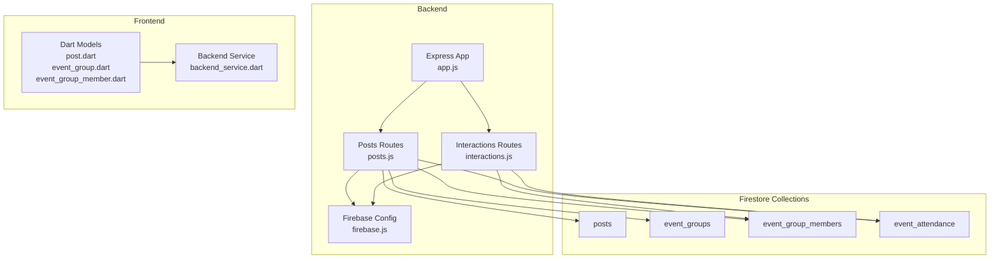
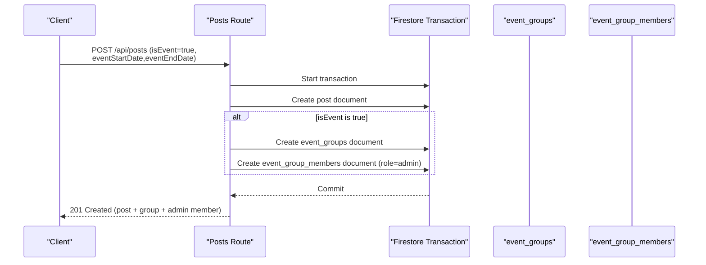
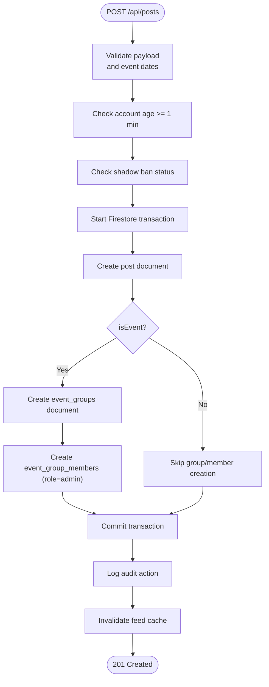
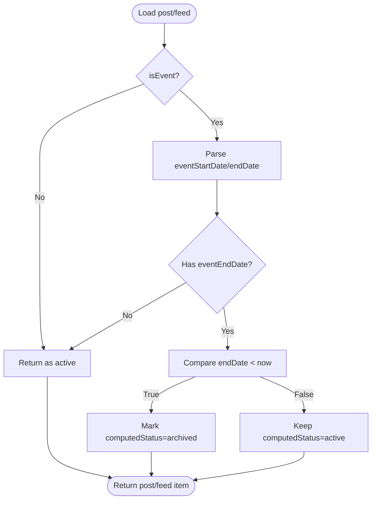
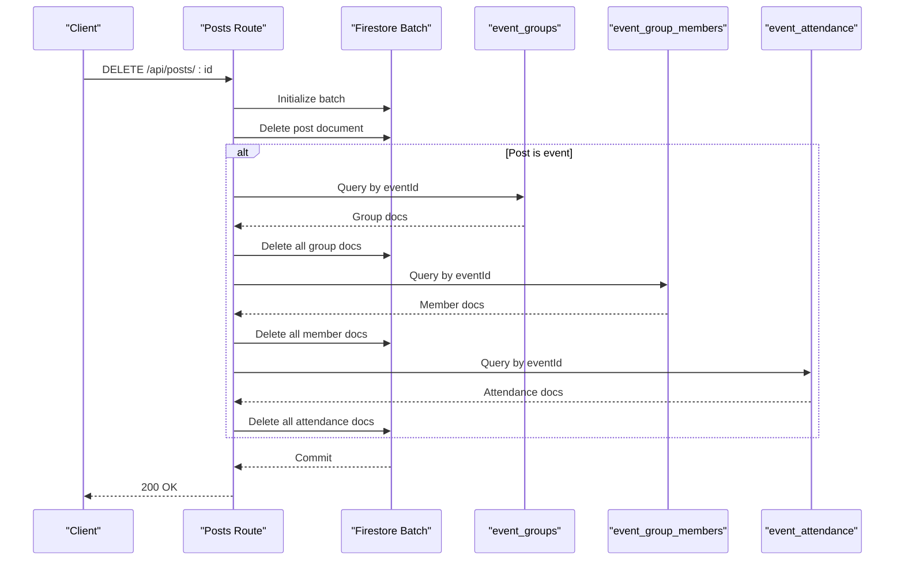
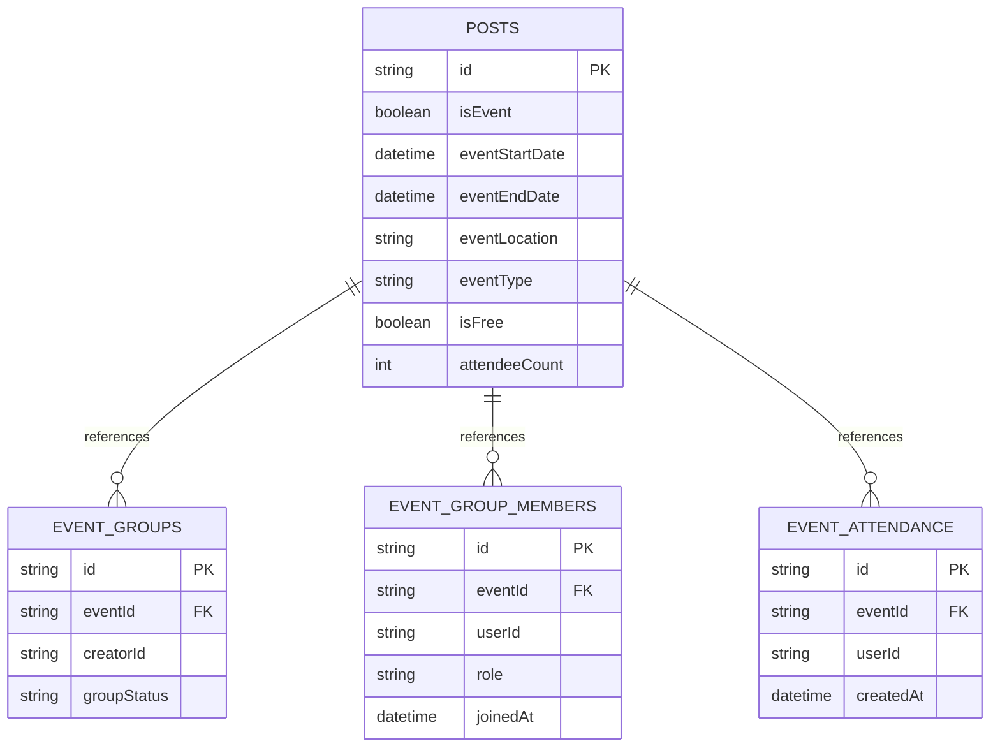
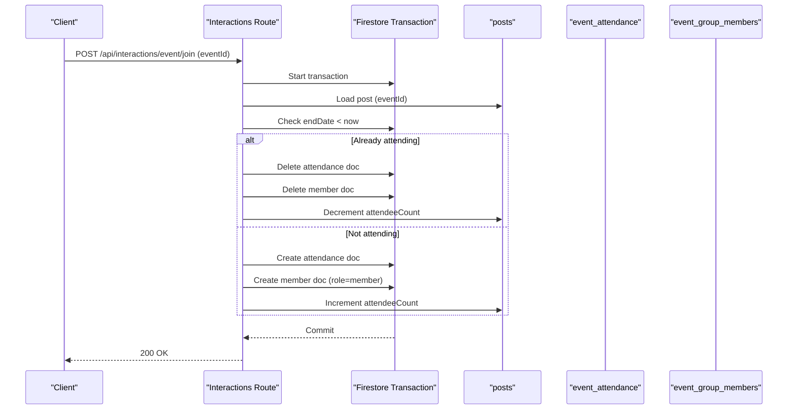
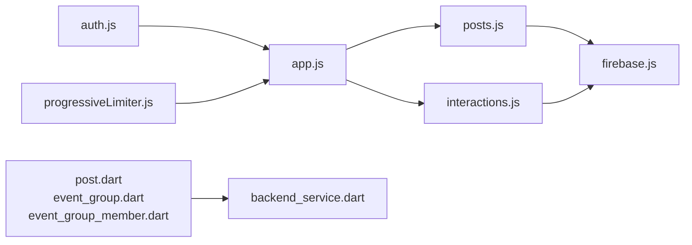

# Event Management System

<cite>
**Referenced Files in This Document**
- [posts.js](file://backend/src/routes/posts.js)
- [interactions.js](file://backend/src/routes/interactions.js)
- [app.js](file://backend/src/app.js)
- [firebase.js](file://backend/src/config/firebase.js)
- [post.dart](file://testpro-main/lib/models/post.dart)
- [event_group.dart](file://testpro-main/lib/models/event_group.dart)
- [event_group_member.dart](file://testpro-main/lib/models/event_group_member.dart)
- [backend_service.dart](file://testpro-main/lib/services/backend_service.dart)
</cite>

## Table of Contents
1. [Introduction](#introduction)
2. [Project Structure](#project-structure)
3. [Core Components](#core-components)
4. [Architecture Overview](#architecture-overview)
5. [Detailed Component Analysis](#detailed-component-analysis)
6. [Dependency Analysis](#dependency-analysis)
7. [Performance Considerations](#performance-considerations)
8. [Troubleshooting Guide](#troubleshooting-guide)
9. [Conclusion](#conclusion)

## Introduction
This document describes the event management system integrated with posts. It covers the event creation workflow, automatic group and membership creation, event lifecycle management (status computation, archival), cascade deletion, and the relationships between posts, event groups, members, and attendance tracking. It also documents privacy and visibility controls, and provides practical examples for creating events, managing member roles, and monitoring event status.

## Project Structure
The event management system spans backend API routes and frontend models/services:
- Backend routes define event creation, retrieval, deletion, and attendance/member management.
- Frontend Dart models represent event-related data structures.
- Firebase Admin SDK connects to Firestore for persistence and transactions.

**Diagram sources**
- [app.js](file://backend/src/app.js#L44-L60)
- [posts.js](file://backend/src/routes/posts.js#L62-L207)
- [interactions.js](file://backend/src/routes/interactions.js#L248-L322)
- [firebase.js](file://backend/src/config/firebase.js#L27-L44)
- [post.dart](file://testpro-main/lib/models/post.dart#L1-L143)
- [event_group.dart](file://testpro-main/lib/models/event_group.dart#L1-L35)
- [event_group_member.dart](file://testpro-main/lib/models/event_group_member.dart#L1-L35)
- [backend_service.dart](file://testpro-main/lib/services/backend_service.dart#L473-L496)

**Section sources**
- [app.js](file://backend/src/app.js#L44-L60)
- [posts.js](file://backend/src/routes/posts.js#L62-L207)
- [interactions.js](file://backend/src/routes/interactions.js#L248-L322)
- [firebase.js](file://backend/src/config/firebase.js#L27-L44)

## Core Components
- Event creation endpoint validates inputs, enforces account age, and creates posts with event-specific fields.
- On event creation, backend creates an event group and assigns the creator as admin.
- Event lifecycle: status computed lazily from dates; expired events are treated as archived for display.
- Cascade deletion removes event posts along with associated event groups, members, and attendance records.
- Attendance and membership: joining an event creates entries in both event_attendance and event_group_members collections.
- Visibility: posts can be public or shadow-banned; shadow-banned posts are invisible to non-authors.

**Section sources**
- [posts.js](file://backend/src/routes/posts.js#L62-L207)
- [posts.js](file://backend/src/routes/posts.js#L230-L293)
- [interactions.js](file://backend/src/routes/interactions.js#L248-L322)
- [posts.js](file://backend/src/routes/posts.js#L607-L656)

## Architecture Overview
The system uses Firestore collections to model events and related entities. The backend ensures atomicity with transactions and maintains referential integrity across posts, event groups, members, and attendance.

**Diagram sources**
- [posts.js](file://backend/src/routes/posts.js#L62-L207)

## Detailed Component Analysis

### Event Creation Workflow
- Validation: Requires eventStartDate and eventEndDate when isEvent is true; endDate must be after startDate.
- Account age: Minimum 1 minute required since registration.
- Shadow ban: If user is shadow_banned, post visibility is set to shadow.
- Transaction: Creates post, and if event, creates event_groups and event_group_members with admin role.
- Audit logging and feed cache invalidation occur after successful creation.

**Diagram sources**
- [posts.js](file://backend/src/routes/posts.js#L62-L207)

**Section sources**
- [posts.js](file://backend/src/routes/posts.js#L62-L207)

### Event Lifecycle Management
- Computation: For feed and single-post retrieval, event status is computed lazily based on eventEndDate compared to current time.
- Archival: Expired events are marked as archived for display purposes; this is computed and not written to the database.
- Visibility: Shadow-banned posts are invisible to non-authors.

**Diagram sources**
- [posts.js](file://backend/src/routes/posts.js#L230-L293)
- [posts.js](file://backend/src/routes/posts.js#L533-L601)

**Section sources**
- [posts.js](file://backend/src/routes/posts.js#L230-L293)
- [posts.js](file://backend/src/routes/posts.js#L533-L601)

### Cascade Deletion Handling
- Deletion requires author ownership or admin role.
- Deletes the post and, if event, cascades to event_groups, event_group_members, and event_attendance.

**Diagram sources**
- [posts.js](file://backend/src/routes/posts.js#L607-L656)

**Section sources**
- [posts.js](file://backend/src/routes/posts.js#L607-L656)

### Relationship Between Posts and Event Groups
- Each event post references an event group via eventId.
- The event group stores creatorId and groupStatus.
- Member management mirrors attendance: both use deterministic IDs combining eventId and userId.

**Diagram sources**
- [posts.js](file://backend/src/routes/posts.js#L158-L177)
- [interactions.js](file://backend/src/routes/interactions.js#L248-L322)
- [event_group.dart](file://testpro-main/lib/models/event_group.dart#L1-L35)
- [event_group_member.dart](file://testpro-main/lib/models/event_group_member.dart#L1-L35)

**Section sources**
- [posts.js](file://backend/src/routes/posts.js#L158-L177)
- [interactions.js](file://backend/src/routes/interactions.js#L248-L322)
- [event_group.dart](file://testpro-main/lib/models/event_group.dart#L1-L35)
- [event_group_member.dart](file://testpro-main/lib/models/event_group_member.dart#L1-L35)

### Attendance Tracking and Member Management
- Join/Leave: Uses deterministic IDs combining eventId and userId for both event_attendance and event_group_members.
- Safety: Prevents joining expired events; decrements attendeeCount on leave.
- Queries: Dedicated endpoints to check attendance and retrieve joined event IDs.

**Diagram sources**
- [interactions.js](file://backend/src/routes/interactions.js#L248-L322)

**Section sources**
- [interactions.js](file://backend/src/routes/interactions.js#L248-L322)
- [interactions.js](file://backend/src/routes/interactions.js#L477-L494)
- [interactions.js](file://backend/src/routes/interactions.js#L497-L518)
- [backend_service.dart](file://testpro-main/lib/services/backend_service.dart#L473-L496)

### Privacy and Visibility Controls
- Shadow ban: Posts by shadow_banned users are marked shadow and invisible to non-authors.
- Single post retrieval enforces a stealth 404 for shadow posts when accessed by non-authors.
- Feed filtering: Only public, active posts are returned by default.

**Section sources**
- [posts.js](file://backend/src/routes/posts.js#L123-L147)
- [posts.js](file://backend/src/routes/posts.js#L544-L549)
- [posts.js](file://backend/src/routes/posts.js#L392-L446)

## Dependency Analysis
- Routing: Protected routes are mounted under /api with authentication and rate limiting.
- Authentication: Middleware injects req.user with uid and role.
- Firestore: Transactions and batch writes ensure consistency across posts and event collections.
- Frontend models: Dart models mirror backend event fields and statuses for UI consumption.

**Diagram sources**
- [app.js](file://backend/src/app.js#L44-L60)
- [posts.js](file://backend/src/routes/posts.js#L62-L207)
- [interactions.js](file://backend/src/routes/interactions.js#L248-L322)
- [firebase.js](file://backend/src/config/firebase.js#L27-L44)
- [post.dart](file://testpro-main/lib/models/post.dart#L1-L143)
- [event_group.dart](file://testpro-main/lib/models/event_group.dart#L1-L35)
- [event_group_member.dart](file://testpro-main/lib/models/event_group_member.dart#L1-L35)
- [backend_service.dart](file://testpro-main/lib/services/backend_service.dart#L473-L496)

**Section sources**
- [app.js](file://backend/src/app.js#L44-L60)
- [firebase.js](file://backend/src/config/firebase.js#L27-L44)

## Performance Considerations
- Feed caching: In-memory cache with TTL reduces repeated queries for regional feeds.
- Fetch locks: Prevent dog-piling during concurrent regional feed requests.
- Index-aware queries: Missing composite indexes produce explicit errors to guide index creation.
- Anti-scraping jitter: Random delay on initial feed loads to deter scraping.

**Section sources**
- [posts.js](file://backend/src/routes/posts.js#L209-L212)
- [posts.js](file://backend/src/routes/posts.js#L353-L359)
- [posts.js](file://backend/src/routes/posts.js#L466-L477)
- [posts.js](file://backend/src/routes/posts.js#L515-L521)

## Troubleshooting Guide
- Event creation errors:
  - Missing event dates when isEvent is true.
  - Invalid date range (endDate must be after startDate).
  - Account too new (< 1 minute).
- Deletion errors:
  - Unauthorized if not author or admin.
  - Cascading deletes require proper indexing for event collections.
- Attendance errors:
  - Cannot join expired events.
  - Deterministic ID collisions avoided by using eventId_userid pattern.
- Visibility:
  - Shadow-banned posts appear as not found to non-authors.

**Section sources**
- [posts.js](file://backend/src/routes/posts.js#L82-L95)
- [posts.js](file://backend/src/routes/posts.js#L114-L119)
- [posts.js](file://backend/src/routes/posts.js#L615-L617)
- [interactions.js](file://backend/src/routes/interactions.js#L279-L283)
- [posts.js](file://backend/src/routes/posts.js#L544-L549)

## Conclusion
The event management system integrates tightly with posts, ensuring atomic creation of event groups and admin assignments. Lifecycle management is computed lazily for performance, while cascade deletion maintains referential integrity. Privacy controls respect shadow bans, and the frontend models align with backend structures for consistent UI behavior. The documented APIs and flows provide a clear blueprint for extending or integrating event features.