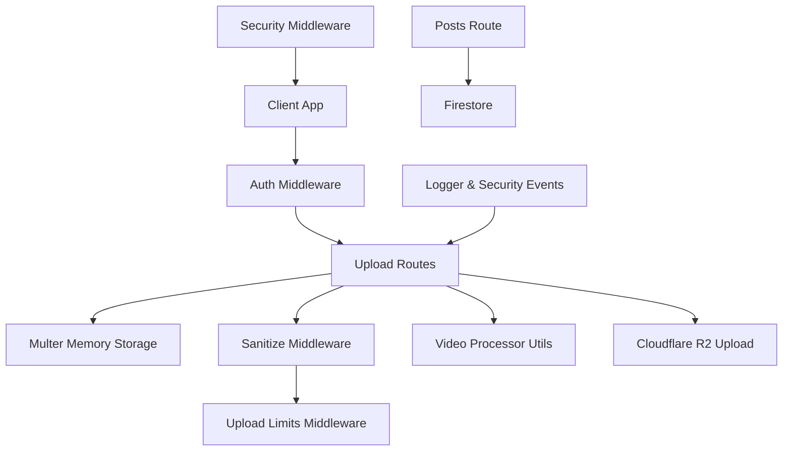
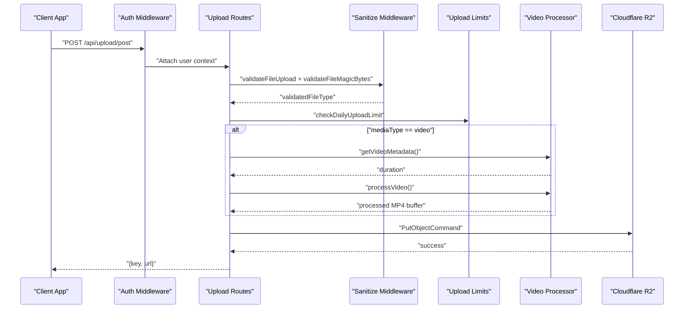
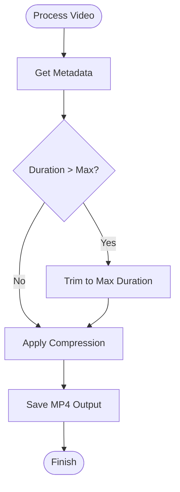
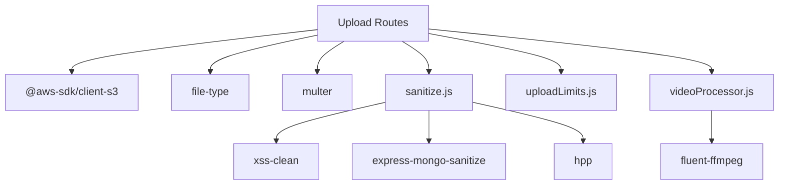

# Media Processing and Upload

<cite>
**Referenced Files in This Document**
- [upload.js](file://backend/src/routes/upload.js)
- [sanitize.js](file://backend/src/middleware/sanitize.js)
- [sanitizer.js](file://backend/src/utils/sanitizer.js)
- [videoProcessor.js](file://backend/src/utils/videoProcessor.js)
- [uploadLimits.js](file://backend/src/middleware/uploadLimits.js)
- [auth.js](file://backend/src/middleware/auth.js)
- [posts.js](file://backend/src/routes/posts.js)
- [.env.example](file://backend/.env.example)
- [package.json](file://backend/package.json)
- [errorHandler.js](file://backend/src/middleware/errorHandler.js)
- [logger.js](file://backend/src/utils/logger.js)
- [security.js](file://backend/src/middleware/security.js)
- [deviceContext.js](file://backend/src/middleware/deviceContext.js)
</cite>

## Table of Contents
1. [Introduction](#introduction)
2. [Project Structure](#project-structure)
3. [Core Components](#core-components)
4. [Architecture Overview](#architecture-overview)
5. [Detailed Component Analysis](#detailed-component-analysis)
6. [Dependency Analysis](#dependency-analysis)
7. [Performance Considerations](#performance-considerations)
8. [Troubleshooting Guide](#troubleshooting-guide)
9. [Conclusion](#conclusion)
10. [Appendices](#appendices)

## Introduction
This document provides comprehensive API documentation for media processing and upload handling in posts. It covers the media validation workflow (including sanitization, file type restrictions, size limits, and security scanning), the video processing pipeline (transcoding, thumbnail generation, format conversion, and quality optimization), the image processing workflow (compression, resizing, and format standardization), and the sanitization utilities designed to prevent malicious content injection and XSS attacks. It also documents error handling for upload failures, media corruption, and processing timeouts, along with examples of supported media formats, recommended file sizes, and best practices for optimal user experience.

## Project Structure
The media upload and processing system is implemented in the backend service under the Express server. Key components include:
- Routes for media uploads (profile images and post media)
- Middleware for authentication, validation, magic-byte file type verification, and upload limits
- Utility modules for video metadata extraction and processing via FFmpeg
- Sanitization utilities for XSS protection and mass assignment defense
- Security middleware for headers, CORS, and request timeouts
- Error handling and logging utilities

**Diagram sources**
- [upload.js](file://backend/src/routes/upload.js#L25-L31)
- [sanitize.js](file://backend/src/middleware/sanitize.js#L42-L99)
- [uploadLimits.js](file://backend/src/middleware/uploadLimits.js#L10-L36)
- [videoProcessor.js](file://backend/src/utils/videoProcessor.js#L12-L60)
- [posts.js](file://backend/src/routes/posts.js#L62-L207)
- [security.js](file://backend/src/middleware/security.js#L9-L74)
- [logger.js](file://backend/src/utils/logger.js#L15-L26)

**Section sources**
- [upload.js](file://backend/src/routes/upload.js#L1-L225)
- [sanitize.js](file://backend/src/middleware/sanitize.js#L1-L154)
- [uploadLimits.js](file://backend/src/middleware/uploadLimits.js#L1-L55)
- [videoProcessor.js](file://backend/src/utils/videoProcessor.js#L1-L61)
- [posts.js](file://backend/src/routes/posts.js#L1-L728)
- [security.js](file://backend/src/middleware/security.js#L1-L75)
- [logger.js](file://backend/src/utils/logger.js#L1-L29)

## Core Components
- Upload Routes: Handles profile image and post media uploads with validation and processing.
- Sanitization Middleware: Validates request bodies, enforces allow-lists, and verifies file types using magic bytes.
- Video Processing Utils: Extracts metadata and processes videos using FFmpeg for format conversion and compression.
- Upload Limits Middleware: Enforces daily upload quotas per user.
- Authentication Middleware: Verifies tokens and attaches user context.
- Security Middleware: Applies secure headers, CORS policies, and request timeouts.
- Error Handling and Logging: Centralized error handling and security event logging.

**Section sources**
- [upload.js](file://backend/src/routes/upload.js#L80-L222)
- [sanitize.js](file://backend/src/middleware/sanitize.js#L31-L99)
- [videoProcessor.js](file://backend/src/utils/videoProcessor.js#L12-L60)
- [uploadLimits.js](file://backend/src/middleware/uploadLimits.js#L10-L54)
- [auth.js](file://backend/src/middleware/auth.js#L20-L161)
- [security.js](file://backend/src/middleware/security.js#L9-L74)
- [errorHandler.js](file://backend/src/middleware/errorHandler.js#L3-L32)

## Architecture Overview
The upload flow begins with authentication and optional device fingerprinting. Files are validated for type and size, optionally processed (for videos), and then uploaded to Cloudflare R2. For posts, the system ensures consistent MP4 output and increments daily upload counts upon success.

**Diagram sources**
- [upload.js](file://backend/src/routes/upload.js#L124-L222)
- [sanitize.js](file://backend/src/middleware/sanitize.js#L31-L99)
- [uploadLimits.js](file://backend/src/middleware/uploadLimits.js#L10-L36)
- [videoProcessor.js](file://backend/src/utils/videoProcessor.js#L12-L60)

## Detailed Component Analysis

### Upload Routes
- Profile Image Upload: Accepts a single file, validates type, and uploads to R2 with a randomized key.
- Post Media Upload: Accepts mediaType and postId, validates inputs, processes videos (MP4 conversion and compression), and uploads to R2. Increments daily upload count on success.

Key behaviors:
- Memory-only uploads via Multer for small-to-medium files.
- File type verification using magic bytes and MIME matching.
- Daily upload limit enforcement with Firestore counter.
- Temporary file handling for video processing with cleanup.

**Section sources**
- [upload.js](file://backend/src/routes/upload.js#L81-L122)
- [upload.js](file://backend/src/routes/upload.js#L124-L222)

### Sanitization Workflow
- Request sanitization: Mass assignment defense and XSS protection via allow-lists and strict XSS filtering.
- File upload validation: Ensures mediaType is image or video and fileExtension matches allowed values.
- Magic-byte validation: Determines actual MIME type and compares with declared mediaType.
- Token expiration validation: Enforces relaxed token age for better UX while logging security events.

Security utilities:
- Strict XSS whitelist and recursive sanitization for nested structures.
- Pick-and-clean payload to enforce allowed fields.

**Section sources**
- [sanitize.js](file://backend/src/middleware/sanitize.js#L8-L29)
- [sanitize.js](file://backend/src/middleware/sanitize.js#L31-L40)
- [sanitize.js](file://backend/src/middleware/sanitize.js#L42-L99)
- [sanitize.js](file://backend/src/middleware/sanitize.js#L101-L132)
- [sanitizer.js](file://backend/src/utils/sanitizer.js#L20-L63)

### Video Processing Pipeline
- Metadata extraction: Uses FFprobe to retrieve duration and other metadata.
- Transcoding and compression: Converts to MP4 with H.264 video codec, AAC audio codec, and CRF-based compression.
- Quality optimization: Progressive download flag and preset tuning for faster start.
- Duration trimming: Caps video length to a configurable maximum.

**Diagram sources**
- [videoProcessor.js](file://backend/src/utils/videoProcessor.js#L12-L60)

**Section sources**
- [videoProcessor.js](file://backend/src/utils/videoProcessor.js#L12-L60)

### Image Processing Workflow
- Supported image formats: JPEG, PNG, WebP, GIF.
- Standardization: Uploaded images are stored with standardized extensions derived from detected MIME types.
- Compression and resizing: Not implemented in the current code; images are uploaded as-is after validation.

Recommendations:
- For WebP/GIF, consider adding compression and resizing steps to optimize bandwidth and storage.
- Implement format conversion to a canonical format (e.g., JPEG/WebP) for consistency.

**Section sources**
- [upload.js](file://backend/src/routes/upload.js#L48-L59)
- [sanitize.js](file://backend/src/middleware/sanitize.js#L64-L67)

### Upload Limits and Quotas
- Daily upload cap: 20 uploads per user per day tracked in Firestore.
- Increment logic: Updates counter and last upload timestamp after successful R2 upload.
- Fail-safe behavior: On limit check failure, the system currently allows the request to proceed to avoid blocking legitimate users.

**Section sources**
- [uploadLimits.js](file://backend/src/middleware/uploadLimits.js#L10-L36)
- [uploadLimits.js](file://backend/src/middleware/uploadLimits.js#L42-L54)

### Authentication and Device Context
- Authentication: Supports custom JWT and Firebase ID tokens with revocation checks and role/status validation.
- Device context: Hashes IP, User-Agent, and device ID to anonymize identifiers for privacy and security.

**Section sources**
- [auth.js](file://backend/src/middleware/auth.js#L20-L161)
- [deviceContext.js](file://backend/src/middleware/deviceContext.js#L7-L23)

### Security Middleware
- Security headers: Helmet configuration optimized for API-only usage.
- CORS: Strict origin whitelisting with development allowances.
- Request timeouts: Exempts multipart and slow routes; applies 15-second timeout otherwise.

**Section sources**
- [security.js](file://backend/src/middleware/security.js#L9-L74)

### Error Handling and Logging
- Centralized error handler: Logs structured errors and returns user-friendly messages in production.
- Security event logging: Dedicated logger for security events with metadata and timestamps.

**Section sources**
- [errorHandler.js](file://backend/src/middleware/errorHandler.js#L3-L32)
- [logger.js](file://backend/src/utils/logger.js#L15-L26)

## Dependency Analysis
External dependencies relevant to media processing and upload:
- @aws-sdk/client-s3: R2 client for object uploads.
- fluent-ffmpeg + ffmpeg-static: Video processing and metadata extraction.
- file-type: Magic-byte file type detection.
- express-validator: Input validation for uploads and requests.
- xss/xss-clean: XSS sanitization.
- express-mongo-sanitize, hpp: Additional request sanitization.

**Diagram sources**
- [upload.js](file://backend/src/routes/upload.js#L1-L225)
- [package.json](file://backend/package.json#L24-L55)

**Section sources**
- [package.json](file://backend/package.json#L24-L55)

## Performance Considerations
- Memory usage: Multer memory storage is suitable for moderate file sizes; large files may cause memory pressure.
- Video processing: FFmpeg operations are CPU-intensive; consider offloading to dedicated workers or containers.
- CDN delivery: R2 public URLs enable efficient global distribution.
- Caching: Authentication and user profile caching reduces Firestore overhead.

[No sources needed since this section provides general guidance]

## Troubleshooting Guide
Common issues and resolutions:
- Unsupported media format: Ensure mediaType and fileExtension match allowed values and MIME type.
- File type mismatch: Declared mediaType must match detected MIME type.
- Upload limit exceeded: Users receive a 429 response after 20 uploads per day.
- Processing failures: Video processing errors are logged; verify FFmpeg availability and disk space.
- R2 upload failures: Confirm credentials, bucket name, and public base URL.
- Authentication errors: Verify token validity and user status.

**Section sources**
- [sanitize.js](file://backend/src/middleware/sanitize.js#L52-L99)
- [uploadLimits.js](file://backend/src/middleware/uploadLimits.js#L19-L25)
- [videoProcessor.js](file://backend/src/utils/videoProcessor.js#L47-L58)
- [.env.example](file://backend/.env.example#L15-L21)
- [auth.js](file://backend/src/middleware/auth.js#L133-L139)

## Conclusion
The media upload and processing system integrates robust validation, security, and processing capabilities. It supports both images and videos, enforces strict type and size checks, and standardizes video output to MP4. While image processing remains minimal, the architecture is ready for enhancements such as compression and resizing. The system’s logging and error handling provide strong observability and resilience.

[No sources needed since this section summarizes without analyzing specific files]

## Appendices

### API Endpoints

- POST /api/upload/profile
  - Description: Upload a profile image.
  - Authentication: Required.
  - Validation: mediaType must be image; fileExtension must be in {jpg,jpeg,png,webp,gif}.
  - Response: { key, url }.

- POST /api/upload/post
  - Description: Upload post media (image or video).
  - Authentication: Required.
  - Body:
    - mediaType: image | video
    - fileExtension: jpg | jpeg | png | webp | gif | mp4 | webm | mov
    - file: multipart file
  - Processing:
    - Images: Stored with standardized extension.
    - Videos: Converted to MP4, compressed, and trimmed if needed.
  - Response: { key, url }.

**Section sources**
- [upload.js](file://backend/src/routes/upload.js#L81-L122)
- [upload.js](file://backend/src/routes/upload.js#L124-L222)

### Supported Media Formats and Recommendations
- Images: JPEG, PNG, WebP, GIF.
- Videos: MP4, WebM, MOV.
- Recommended sizes:
  - Images: Under 5–10 MB for fast loading.
  - Videos: Under 200 MB; longer videos automatically trimmed and compressed.

**Section sources**
- [upload.js](file://backend/src/routes/upload.js#L27-L31)
- [upload.js](file://backend/src/routes/upload.js#L168-L176)
- [sanitize.js](file://backend/src/middleware/sanitize.js#L64-L67)

### Best Practices
- Always validate mediaType and fileExtension on the client before upload.
- Prefer WebP for static images and MP4 for videos.
- Implement client-side previews and compression to reduce upload sizes.
- Monitor security events and logs for suspicious activity.
- Use CDN-backed URLs for global performance.

[No sources needed since this section provides general guidance]