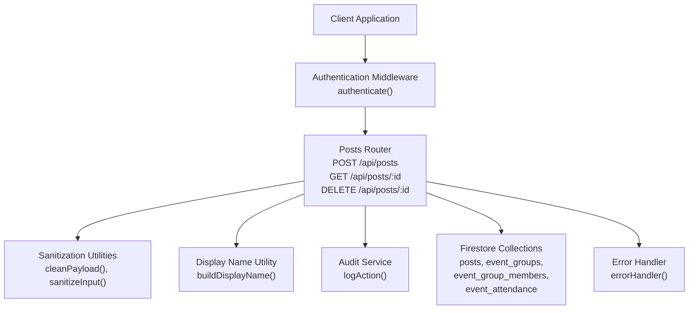
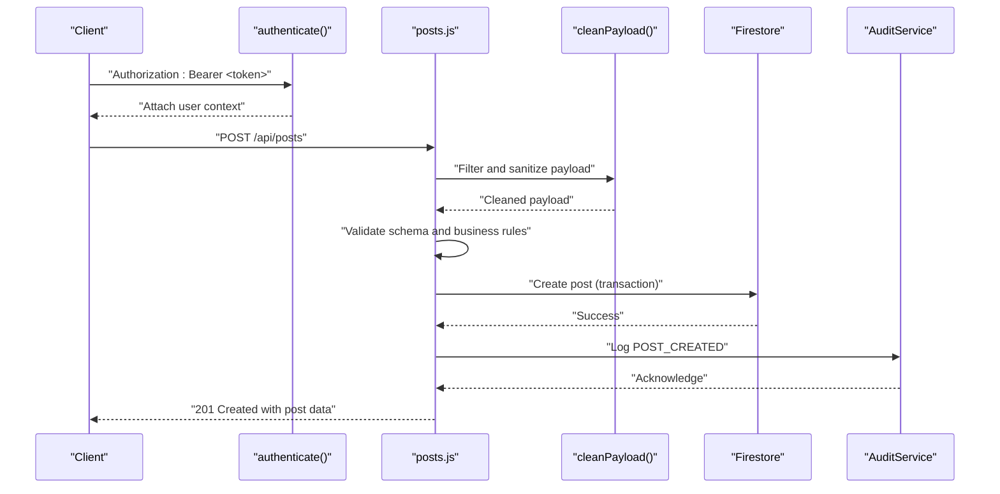
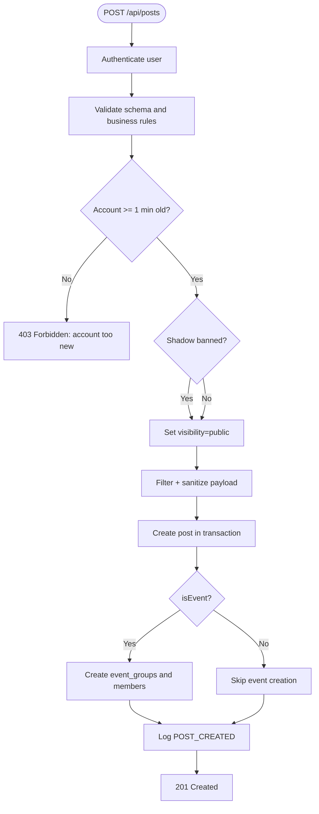
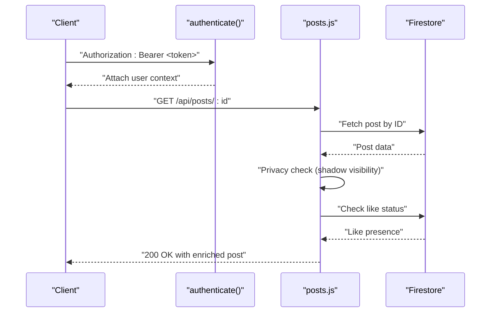
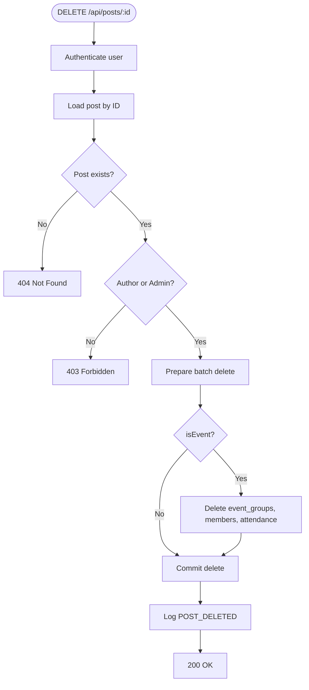
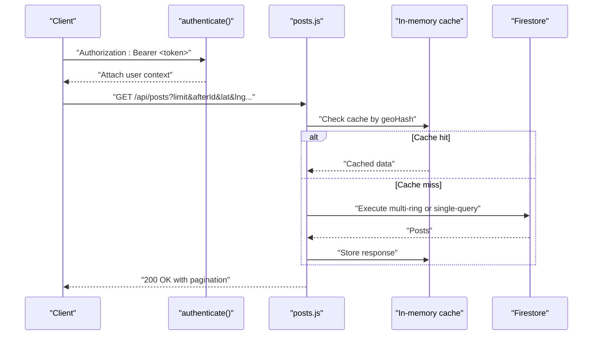
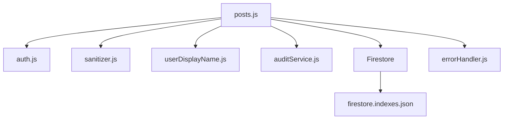

# Post CRUD Operations

<cite>
**Referenced Files in This Document**
- [posts.js](file://backend/src/routes/posts.js)
- [auth.js](file://backend/src/middleware/auth.js)
- [errorHandler.js](file://backend/src/middleware/errorHandler.js)
- [sanitizer.js](file://backend/src/utils/sanitizer.js)
- [userDisplayName.js](file://backend/src/utils/userDisplayName.js)
- [auditService.js](file://backend/src/services/auditService.js)
- [app.js](file://backend/src/app.js)
- [firestore.indexes.json](file://testpro-main/firestore.indexes.json)
- [test_index.js](file://backend/scripts/test_index.js)
</cite>

## Table of Contents
1. [Introduction](#introduction)
2. [Project Structure](#project-structure)
3. [Core Components](#core-components)
4. [Architecture Overview](#architecture-overview)
5. [Detailed Component Analysis](#detailed-component-analysis)
6. [Dependency Analysis](#dependency-analysis)
7. [Performance Considerations](#performance-considerations)
8. [Troubleshooting Guide](#troubleshooting-guide)
9. [Conclusion](#conclusion)

## Introduction
This document provides comprehensive API documentation for post CRUD operations, focusing on:
- POST /api/posts for creation
- GET /api/posts/:id for retrieval
- DELETE /api/posts/:id for deletion

It covers validation schemas, privacy controls, cascade deletion for events, authentication requirements, error handling, and security considerations.

## Project Structure
The post CRUD endpoints are implemented within the Express application and organized under the `/api/posts` route. Authentication middleware enforces user verification and role checks, while sanitization utilities protect against malicious input. Firestore indexes support efficient querying and caching mechanisms optimize feed retrieval.

**Diagram sources**
- [posts.js](file://backend/src/routes/posts.js#L62-L207)
- [auth.js](file://backend/src/middleware/auth.js#L20-L161)
- [sanitizer.js](file://backend/src/utils/sanitizer.js#L60-L63)
- [userDisplayName.js](file://backend/src/utils/userDisplayName.js#L1-L38)
- [auditService.js](file://backend/src/services/auditService.js#L8-L30)
- [errorHandler.js](file://backend/src/middleware/errorHandler.js#L3-L32)

**Section sources**
- [app.js](file://backend/src/app.js#L44-L60)
- [posts.js](file://backend/src/routes/posts.js#L12-L207)

## Core Components
- Authentication middleware validates tokens, attaches user context, and enforces account status.
- Sanitization utilities enforce a strict allow-list and strip XSS tags to prevent injection.
- Display name utility constructs human-readable author names from available user attributes.
- Audit service records sensitive actions for compliance and monitoring.
- Firestore indexes enable efficient filtering and sorting for feed queries.

**Section sources**
- [auth.js](file://backend/src/middleware/auth.js#L20-L161)
- [sanitizer.js](file://backend/src/utils/sanitizer.js#L20-L63)
- [userDisplayName.js](file://backend/src/utils/userDisplayName.js#L1-L38)
- [auditService.js](file://backend/src/services/auditService.js#L8-L30)
- [firestore.indexes.json](file://testpro-main/firestore.indexes.json#L18-L178)

## Architecture Overview
The post CRUD flow integrates authentication, validation, sanitization, database transactions, and auditing. The feed retrieval employs geohash-based locality, caching, and anti-scraping delays to balance performance and fairness.

**Diagram sources**
- [posts.js](file://backend/src/routes/posts.js#L62-L207)
- [auth.js](file://backend/src/middleware/auth.js#L20-L161)
- [sanitizer.js](file://backend/src/utils/sanitizer.js#L60-L63)
- [auditService.js](file://backend/src/services/auditService.js#L8-L30)

## Detailed Component Analysis

### POST /api/posts (Create Post)
- Authentication: Required. Validates Firebase ID token or custom JWT and attaches user context.
- Validation Schema:
  - title: String up to 200 chars, nullable
  - body: String up to 2000 chars, nullable
  - text: String up to 2000 chars, nullable
  - category: String up to 50 chars, nullable
  - city: String up to 100 chars, nullable
  - country: String up to 100 chars, nullable
  - mediaUrl: URI, nullable
  - mediaType: Enum 'image' | 'video' | 'none', defaults to 'none'
  - thumbnailUrl: URI, nullable
  - location: Object with lat, lng, name; nullable
  - tags: Array of strings up to 30 chars, max 10 items, nullable
  - isEvent: Boolean, defaults to false
  - eventStartDate: ISO date, required when isEvent is true
  - eventEndDate: ISO date, required when isEvent is true
  - eventDate: Legacy fallback ISO date
  - eventLocation: String up to 200 chars, nullable
  - isFree: Boolean, defaults to true
  - eventType: String up to 50 chars, nullable
  - subtitle: String up to 500 chars, nullable
  - At least one of text, mediaUrl, or title must be present
- Business Rules:
  - Account age check: Minimum 1 minute old
  - Shadow ban visibility: Posts by shadow-banned users are private to others
  - Event creation: Creates event_groups and event_group_members with admin role for the author
- Sanitization: Strict allow-list and XSS stripping
- Response: 201 Created with post data and audit trail

**Diagram sources**
- [posts.js](file://backend/src/routes/posts.js#L62-L207)
- [auth.js](file://backend/src/middleware/auth.js#L20-L161)
- [sanitizer.js](file://backend/src/utils/sanitizer.js#L60-L63)
- [auditService.js](file://backend/src/services/auditService.js#L8-L30)

**Section sources**
- [posts.js](file://backend/src/routes/posts.js#L30-L56)
- [posts.js](file://backend/src/routes/posts.js#L62-L207)
- [auth.js](file://backend/src/middleware/auth.js#L20-L161)
- [sanitizer.js](file://backend/src/utils/sanitizer.js#L20-L63)

### GET /api/posts/:id (Retrieve Post)
- Authentication: Required.
- Privacy Controls:
  - Shadow banned posts are invisible to non-authors (stealth 404)
- Response Enrichment:
  - Lazy mapping of event dates and computed group status
  - Determines if the current user has liked the post
- Response: 200 OK with post data

**Diagram sources**
- [posts.js](file://backend/src/routes/posts.js#L533-L601)
- [auth.js](file://backend/src/middleware/auth.js#L20-L161)

**Section sources**
- [posts.js](file://backend/src/routes/posts.js#L533-L601)

### DELETE /api/posts/:id (Delete Post)
- Authentication: Required.
- Authorization:
  - Authors can delete their own posts
  - Admins can delete any post
- Cascade Deletion (for events):
  - Deletes associated event_groups documents
  - Deletes event_group_members documents
  - Deletes event_attendance documents
- Response: 200 OK with success message and audit trail

**Diagram sources**
- [posts.js](file://backend/src/routes/posts.js#L607-L656)
- [auth.js](file://backend/src/middleware/auth.js#L20-L161)
- [auditService.js](file://backend/src/services/auditService.js#L8-L30)

**Section sources**
- [posts.js](file://backend/src/routes/posts.js#L607-L656)

### Feed Retrieval (GET /api/posts)
- Authentication: Required.
- Features:
  - Pagination with cursor support
  - Geohash-based locality with multi-ring expansion
  - Regional caching and fetch locks to prevent dog-piling
  - Anti-scraping jitter for initial page loads
  - Composite indexes for filtered queries
- Response: 200 OK with paginated posts and like state enrichment

**Diagram sources**
- [posts.js](file://backend/src/routes/posts.js#L333-L527)
- [firestore.indexes.json](file://testpro-main/firestore.indexes.json#L18-L178)

**Section sources**
- [posts.js](file://backend/src/routes/posts.js#L333-L527)
- [firestore.indexes.json](file://testpro-main/firestore.indexes.json#L18-L178)

## Dependency Analysis
- Route dependencies:
  - posts.js depends on auth.js for user context, sanitizer.js for input hardening, userDisplayName.js for author display, auditService.js for logging, and Firestore for persistence.
- Index dependencies:
  - Composite indexes in firestore.indexes.json support filtered queries for visibility, status, category, city, country, and geoHash.
- Security dependencies:
  - errorHandler.js centralizes error responses and logging.

**Diagram sources**
- [posts.js](file://backend/src/routes/posts.js#L1-L207)
- [auth.js](file://backend/src/middleware/auth.js#L1-L164)
- [sanitizer.js](file://backend/src/utils/sanitizer.js#L1-L64)
- [userDisplayName.js](file://backend/src/utils/userDisplayName.js#L1-L38)
- [auditService.js](file://backend/src/services/auditService.js#L1-L33)
- [errorHandler.js](file://backend/src/middleware/errorHandler.js#L1-L35)
- [firestore.indexes.json](file://testpro-main/firestore.indexes.json#L1-L181)

**Section sources**
- [posts.js](file://backend/src/routes/posts.js#L1-L207)
- [firestore.indexes.json](file://testpro-main/firestore.indexes.json#L1-L181)

## Performance Considerations
- Feed caching: In-memory cache with TTL reduces repeated queries for regional feeds.
- Fetch locks: Prevent concurrent expensive queries for the same region.
- Anti-scraping jitter: Random delay on initial page loads to deter automated scraping.
- Composite indexes: Properly configured indexes minimize query latency and cost.
- Transaction batching: Event creation and deletion use atomic operations to maintain consistency.

[No sources needed since this section provides general guidance]

## Troubleshooting Guide
- Authentication failures:
  - Missing or invalid token: 401 Unauthorized with specific error codes.
  - Expired or revoked token: 401 Unauthorized with token-related codes.
  - Suspended accounts: 403 Forbidden.
- Validation errors:
  - Invalid input fields: 400 Bad Request with structured error code.
  - Missing event dates when isEvent is true: 400 Bad Request.
- Privacy issues:
  - Shadow banned posts appear as not found to non-authors.
- Cascade deletion:
  - Ensure event-related collections exist; otherwise, deletions target only the post.
- Query configuration:
  - Missing composite index: 500 Internal Server Error indicating index requirement.

**Section sources**
- [auth.js](file://backend/src/middleware/auth.js#L20-L161)
- [errorHandler.js](file://backend/src/middleware/errorHandler.js#L3-L32)
- [posts.js](file://backend/src/routes/posts.js#L74-L95)
- [posts.js](file://backend/src/routes/posts.js#L544-L549)
- [posts.js](file://backend/src/routes/posts.js#L615-L617)
- [firestore.indexes.json](file://testpro-main/firestore.indexes.json#L18-L178)

## Conclusion
The post CRUD implementation enforces strong authentication, robust validation, and comprehensive privacy controls. It leverages sanitization, caching, and indexing to deliver a secure and performant experience. Cascade deletion ensures event-related data remains consistent, while audit logging provides operational visibility.

[No sources needed since this section summarizes without analyzing specific files]