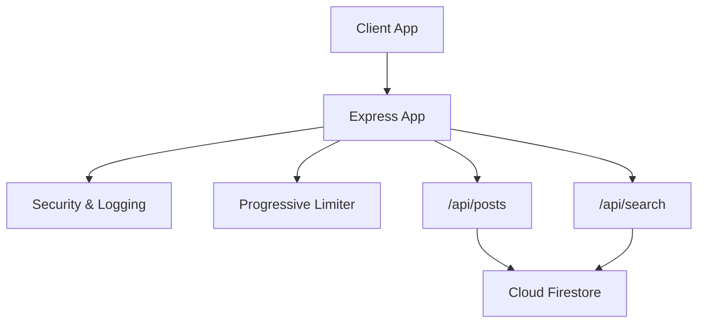
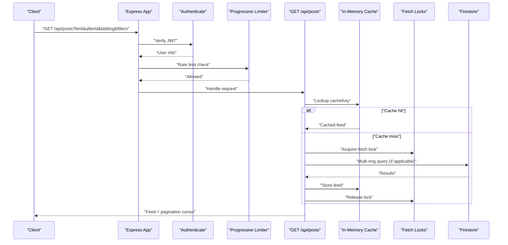
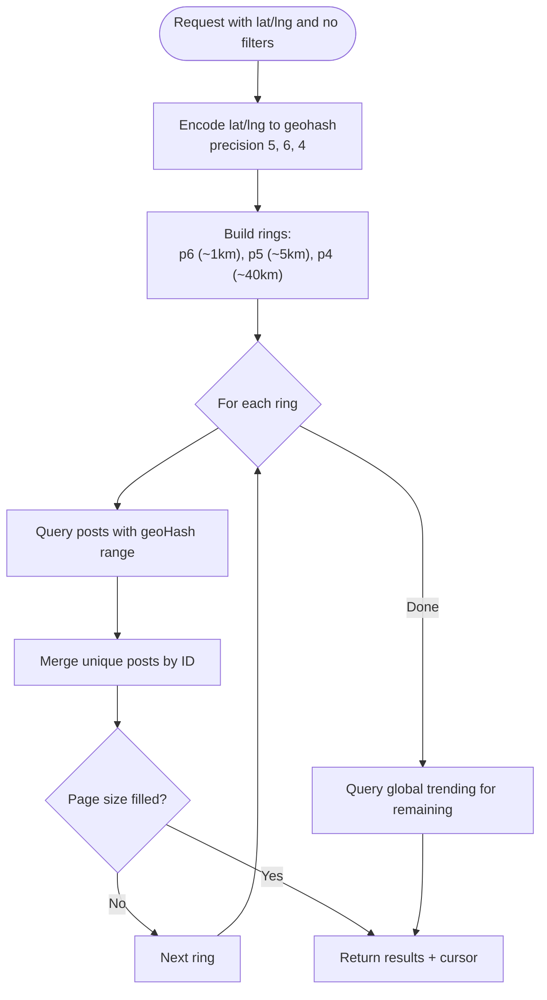
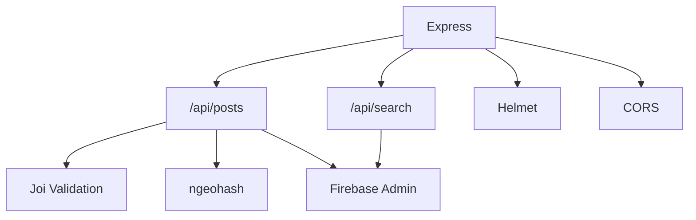

# Post Feed and Search

<cite>
**Referenced Files in This Document**
- [posts.js](file://backend/src/routes/posts.js)
- [search.js](file://backend/src/routes/search.js)
- [app.js](file://backend/src/app.js)
- [index.js](file://backend/src/index.js)
- [progressiveLimiter.js](file://backend/src/middleware/progressiveLimiter.js)
- [PenaltyBox.js](file://backend/src/services/PenaltyBox.js)
- [security.js](file://backend/src/middleware/security.js)
- [InteractionGuard.js](file://backend/src/services/InteractionGuard.js)
- [package.json](file://backend/package.json)
</cite>

## Table of Contents
1. [Introduction](#introduction)
2. [Project Structure](#project-structure)
3. [Core Components](#core-components)
4. [Architecture Overview](#architecture-overview)
5. [Detailed Component Analysis](#detailed-component-analysis)
6. [Dependency Analysis](#dependency-analysis)
7. [Performance Considerations](#performance-considerations)
8. [Troubleshooting Guide](#troubleshooting-guide)
9. [Conclusion](#conclusion)

## Introduction
This document provides comprehensive API documentation for the post feed and search functionality. It covers:
- GET /api/posts: feed retrieval with pagination, filtering, and geolocation-based discovery
- Advanced feed algorithm: geohash-based regional filtering, multi-ring expansion, and anti-scraping jitter
- Caching and concurrency controls: in-memory cache and fetch locks to prevent dog-piling
- Search API: user and post search with prefix matching
- Performance optimization techniques for large-scale content distribution

## Project Structure
The backend exposes REST endpoints via Express and mounts protected routes under /api. Authentication and progressive rate limiting are enforced before route handlers.

**Diagram sources**
- [app.js](file://backend/src/app.js#L44-L60)
- [posts.js](file://backend/src/routes/posts.js#L333-L527)
- [search.js](file://backend/src/routes/search.js#L11-L49)

**Section sources**
- [app.js](file://backend/src/app.js#L44-L60)
- [index.js](file://backend/src/index.js#L1-L37)

## Core Components
- GET /api/posts: Returns paginated feed with cursor-based pagination, optional filters, and geolocation-based discovery
- GET /api/search: Returns users or posts by prefix match with a configurable limit
- In-memory feed cache and fetch locks to reduce load and prevent dog-piling
- Anti-scraping jitter delay for feed requests
- Progressive rate limiting and security middleware

**Section sources**
- [posts.js](file://backend/src/routes/posts.js#L333-L527)
- [search.js](file://backend/src/routes/search.js#L11-L49)
- [progressiveLimiter.js](file://backend/src/middleware/progressiveLimiter.js#L1-L61)
- [PenaltyBox.js](file://backend/src/services/PenaltyBox.js#L1-L107)
- [security.js](file://backend/src/middleware/security.js#L1-L75)

## Architecture Overview
The feed pipeline integrates geolocation encoding, cache/fetch lock coordination, multi-ring expansion, and anti-scraping jitter. Search leverages Firestore prefix matching for users and posts.

**Diagram sources**
- [posts.js](file://backend/src/routes/posts.js#L333-L527)
- [progressiveLimiter.js](file://backend/src/middleware/progressiveLimiter.js#L22-L60)
- [PenaltyBox.js](file://backend/src/services/PenaltyBox.js#L22-L68)

## Detailed Component Analysis

### GET /api/posts
- Purpose: Retrieve paginated feed with optional filters and geolocation-based discovery
- Authentication: Required
- Rate limiting: Enforced via progressive limiter
- Query parameters:
  - limit: integer, default 20, capped at 50
  - afterId: string, cursor for next page
  - Filters: authorId, category, city, country
  - Geolocation: lat, lng (decimal degrees)
- Behavior:
  - If lat/lng provided without filters, executes multi-ring expansion using geohash prefixes
  - Otherwise, applies filters and cursor-based pagination
  - Anti-scraping jitter delay is applied for initial feed requests
  - Embeds like state per post for the requesting user

Pagination and cursor mechanics:
- Cursor is the last post ID returned
- hasMore indicates whether another page is available
- afterId uses Firestore’s startAfter semantics

Anti-scraping jitter:
- Adds 50–200 ms random delay for initial feed requests (no afterId)

Geolocation-based discovery:
- Encodes lat/lng to geohash at precision 5 (~5 km)
- Uses cache key including geoHash and page size
- Multi-ring expansion:
  - Precision 6: hyper-local (~1 km)
  - Precision 5: local (~5 km)
  - Precision 4: regional (~40 km)
- Rings are queried in order until page size is filled; global trending is used as a fallback

Caching and concurrency:
- In-memory cache stores feed responses keyed by cacheKey
- TTL: 30 seconds
- Fetch locks coordinate concurrent requests for the same regional feed to prevent dog-piling

Filtering and sorting:
- Visibility: public
- Status: active
- Sorting: createdAt desc
- Optional filters: authorId, category, city, geoHash (when lat/lng provided)

Error handling:
- Composite index missing triggers a 500 with a descriptive message
- Shadow-banned posts are hidden from other users

Response shape:
- success: boolean
- data: array of posts
- pagination: { cursor, hasMore }

Post model mapping:
- Normalizes event fields, computes group status, and enriches with like state

**Section sources**
- [posts.js](file://backend/src/routes/posts.js#L333-L527)
- [posts.js](file://backend/src/routes/posts.js#L209-L213)
- [posts.js](file://backend/src/routes/posts.js#L344-L351)
- [posts.js](file://backend/src/routes/posts.js#L368-L441)
- [posts.js](file://backend/src/routes/posts.js#L444-L489)
- [posts.js](file://backend/src/routes/posts.js#L515-L521)
- [posts.js](file://backend/src/routes/posts.js#L227-L327)

#### Multi-Ring Expansion Flow

**Diagram sources**
- [posts.js](file://backend/src/routes/posts.js#L368-L441)

### GET /api/search
- Purpose: Search users or posts by prefix match
- Authentication: Required
- Query parameters:
  - q: search term (required for results)
  - type: "users" or "posts", defaults to "posts"
  - limit: integer, default 20, capped at 50
- Behavior:
  - Users: prefix match on username
  - Posts: prefix match on text (note: Firestore prefix search limitations apply)
- Response shape:
  - success: boolean
  - data: array of matches
  - error: null

Notes:
- Full-text search is recommended to be offloaded to a dedicated search engine (e.g., Algolia/Typesense) for production-grade performance.

**Section sources**
- [search.js](file://backend/src/routes/search.js#L11-L49)

### Anti-Scraping Measures and Rate Limiting
- Progressive rate limiter:
  - Per-route policies define max requests per window
  - Supports user-based or IP-based limiting
  - Applies escalating penalties (temporary cooldowns)
- Global pressure detection:
  - Tracks volumetric traffic spikes and may return 503
- Security middleware:
  - Helmet headers, strict CORS, and request timeouts tailored for slow routes
- Jitter delay:
  - Random 50–200 ms delay for initial feed requests to deter scraping bots

**Section sources**
- [progressiveLimiter.js](file://backend/src/middleware/progressiveLimiter.js#L1-L61)
- [PenaltyBox.js](file://backend/src/services/PenaltyBox.js#L1-L107)
- [security.js](file://backend/src/middleware/security.js#L1-L75)
- [posts.js](file://backend/src/routes/posts.js#L515-L521)

## Dependency Analysis
External libraries and integrations:
- Express: web framework
- Firebase Admin: Firestore client
- ngeohash: geohash encoding for location-aware queries
- Joi: input validation
- Helmet/CORS: security headers and CORS policy
- Sentry/pino: logging and monitoring (referenced in dependencies)

**Diagram sources**
- [package.json](file://backend/package.json#L24-L55)
- [posts.js](file://backend/src/routes/posts.js#L1-L12)
- [search.js](file://backend/src/routes/search.js#L1-L5)

**Section sources**
- [package.json](file://backend/package.json#L24-L55)

## Performance Considerations
- Indexing:
  - Filtered queries require composite indexes; missing indexes cause 500 errors
  - Recommended: composite index on (visibility, status, [geoHash|filters], createdAt)
- Pagination:
  - Use cursor-based pagination (afterId) for efficient continuation
  - Limit page size to minimize payload and query cost
- Caching:
  - Regional feeds are cached with TTL; avoid frequent small page sizes for cache effectiveness
  - Fetch locks prevent redundant work during cache misses
- Multi-ring expansion:
  - Reduces cold-start latency by combining hyper-local, local, and regional content
- Anti-scraping jitter:
  - Minimal impact on UX while deterring automated scrapers
- Slow route timeouts:
  - Feed and related routes bypass strict timeouts to accommodate Firestore latency

[No sources needed since this section provides general guidance]

## Troubleshooting Guide
Common issues and resolutions:
- 400 Bad Request:
  - Invalid input validation; review allowed fields and constraints
- 403 Forbidden:
  - Account too new to post; wait minimum age requirement
  - Unauthorized deletion; verify authorship or admin role
- 404 Not Found:
  - Post not found or shadow-banned (stealth 404)
- 429 Too Many Requests:
  - Progressive rate limiter triggered; cooldown applies
  - Consider reducing request frequency or batching
- 500 Internal Server Error:
  - Missing composite index for filtered queries; create required index
- 503 Service Unavailable:
  - Global pressure detected; retry later

Operational checks:
- Verify CORS allowed origins and credentials
- Confirm trust proxy setting for accurate client IPs
- Monitor logs for security events and timeouts

**Section sources**
- [posts.js](file://backend/src/routes/posts.js#L74-L95)
- [posts.js](file://backend/src/routes/posts.js#L607-L656)
- [posts.js](file://backend/src/routes/posts.js#L469-L477)
- [progressiveLimiter.js](file://backend/src/middleware/progressiveLimiter.js#L32-L56)
- [PenaltyBox.js](file://backend/src/services/PenaltyBox.js#L31-L34)
- [security.js](file://backend/src/middleware/security.js#L25-L46)

## Conclusion
The post feed and search APIs provide a robust, scalable foundation for content discovery and search:
- Geohash-based multi-ring expansion delivers hyper-local to regional content
- In-memory caching and fetch locks mitigate hot-path load
- Progressive rate limiting and jitter delay protect against abuse
- Cursor-based pagination ensures efficient consumption at scale
- Recommendations for production include dedicated full-text search infrastructure and careful index management to support filtered queries.