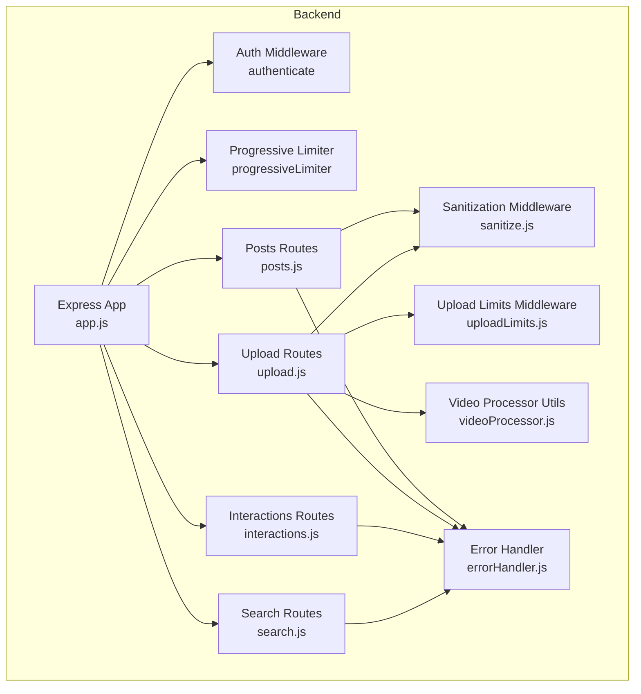
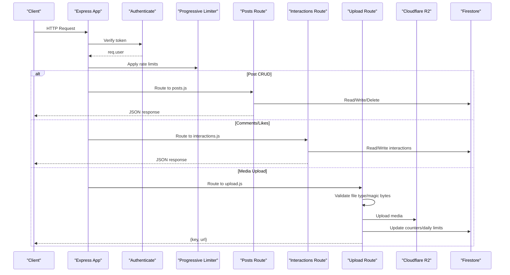
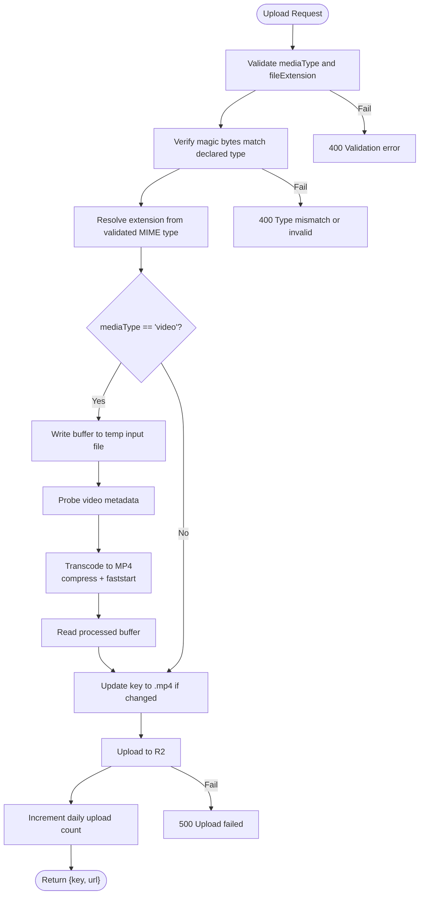
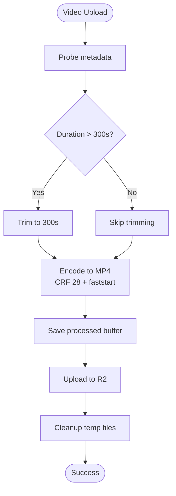
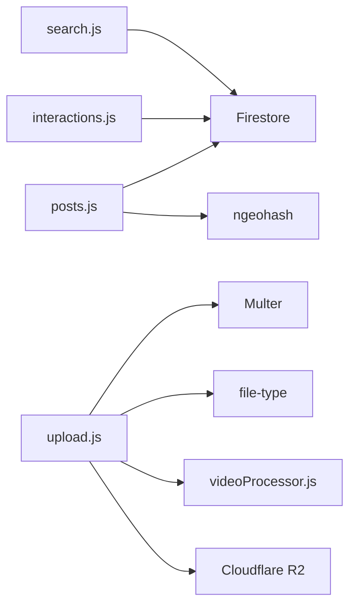

# Posts API

<cite>
**Referenced Files in This Document**
- [posts.js](file://backend/src/routes/posts.js)
- [upload.js](file://backend/src/routes/upload.js)
- [sanitize.js](file://backend/src/middleware/sanitize.js)
- [uploadLimits.js](file://backend/src/middleware/uploadLimits.js)
- [videoProcessor.js](file://backend/src/utils/videoProcessor.js)
- [interactions.js](file://backend/src/routes/interactions.js)
- [search.js](file://backend/src/routes/search.js)
- [app.js](file://backend/src/app.js)
- [errorHandler.js](file://backend/src/middleware/errorHandler.js)
- [sanitizer.js](file://backend/src/utils/sanitizer.js)
</cite>

## Table of Contents
1. [Introduction](#introduction)
2. [Project Structure](#project-structure)
3. [Core Components](#core-components)
4. [Architecture Overview](#architecture-overview)
5. [Detailed Component Analysis](#detailed-component-analysis)
6. [Dependency Analysis](#dependency-analysis)
7. [Performance Considerations](#performance-considerations)
8. [Troubleshooting Guide](#troubleshooting-guide)
9. [Conclusion](#conclusion)
10. [Appendices](#appendices)

## Introduction
This document provides comprehensive API documentation for post management endpoints. It covers post creation, retrieval, updates, deletion, media upload handling for images and videos, the post feed endpoint, search functionality, and comment system integration. It also documents request/response schemas, media processing workflows, pagination and filtering parameters, and error handling for upload failures and content validation errors.

## Project Structure
The Posts API is implemented as Express routes with middleware for authentication, sanitization, and rate limiting. Media uploads integrate with Cloudflare R2 via an upload route, while posts are stored in Firestore. Comments and likes are integrated via the interactions route.

**Diagram sources**
- [app.js](file://backend/src/app.js#L44-L60)
- [posts.js](file://backend/src/routes/posts.js#L1-L20)
- [upload.js](file://backend/src/routes/upload.js#L1-L25)
- [interactions.js](file://backend/src/routes/interactions.js#L1-L15)
- [search.js](file://backend/src/routes/search.js#L1-L10)
- [sanitize.js](file://backend/src/middleware/sanitize.js#L1-L15)
- [uploadLimits.js](file://backend/src/middleware/uploadLimits.js#L1-L10)
- [videoProcessor.js](file://backend/src/utils/videoProcessor.js#L1-L10)
- [errorHandler.js](file://backend/src/middleware/errorHandler.js#L1-L10)

**Section sources**
- [app.js](file://backend/src/app.js#L44-L60)

## Core Components
- Posts Routes: Handles post creation, retrieval, deletion, and embedded event messaging.
- Upload Routes: Handles media uploads to Cloudflare R2 with sanitization, type validation, and optional video processing.
- Interactions Routes: Provides comment and like endpoints, plus batch-like embedding of like state in feeds.
- Search Routes: Provides post and user search endpoints.
- Sanitization and Limits: Enforces file type validation, token expiration, and daily upload caps.
- Video Processing: Uses ffmpeg to probe metadata and transcode videos to MP4 with compression.

**Section sources**
- [posts.js](file://backend/src/routes/posts.js#L58-L207)
- [upload.js](file://backend/src/routes/upload.js#L124-L222)
- [interactions.js](file://backend/src/routes/interactions.js#L105-L171)
- [search.js](file://backend/src/routes/search.js#L7-L49)
- [sanitize.js](file://backend/src/middleware/sanitize.js#L31-L99)
- [uploadLimits.js](file://backend/src/middleware/uploadLimits.js#L6-L36)
- [videoProcessor.js](file://backend/src/utils/videoProcessor.js#L7-L60)

## Architecture Overview
The Posts API integrates with Firestore for persistence and Cloudflare R2 for media storage. Authentication is enforced via a dedicated middleware, and rate limiting is applied per user. Media uploads are validated and optionally processed before being persisted.

**Diagram sources**
- [app.js](file://backend/src/app.js#L44-L60)
- [posts.js](file://backend/src/routes/posts.js#L58-L207)
- [interactions.js](file://backend/src/routes/interactions.js#L105-L171)
- [upload.js](file://backend/src/routes/upload.js#L124-L222)

## Detailed Component Analysis

### Post Endpoints

#### Create Post
- Method: POST
- Path: /api/posts
- Authentication: Required
- Description: Creates a new post with validation, shadow ban handling, geohash encoding, and optional event group creation. Returns the created post with engagement counts initialized.

Request schema (subset):
- title: string (max length 200)
- body/text: string (max length 2000)
- category: string (max length 50)
- city/country: strings (max length 100)
- mediaUrl: string (URI)
- mediaType: enum "image"|"video"|"none" (default "none")
- thumbnailUrl: string (URI)
- location: object { lat, lng, name }
- tags: array of strings (max 10, each max 30)
- isEvent: boolean (default false)
- eventStartDate/eventEndDate: ISO date-time
- eventLocation: string (max length 200)
- isFree: boolean (default true)
- eventType: string (max length 50)
- subtitle: string (max length 500)

Validation rules:
- At least one of text/mediaUrl/title must be present.
- When isEvent is true, both eventStartDate and eventEndDate are required and must satisfy startDate < endDate.
- Additional fields allowed for Flutter compatibility.

Response schema:
- success: boolean
- data: post object with createdAt, likeCount, commentCount, visibility, status, geoHash
- error: null

Example request (paths only):
- [Create Post](file://backend/src/routes/posts.js#L62-L207)

**Section sources**
- [posts.js](file://backend/src/routes/posts.js#L30-L56)
- [posts.js](file://backend/src/routes/posts.js#L62-L207)

#### Get Post Feed
- Method: GET
- Path: /api/posts
- Authentication: Required
- Pagination: limit (default 20, max 50), afterId (cursor)
- Filtering: authorId, category, city, country
- Geo-aware: lat/lng (encodes to geohash precision 5) for multi-ring expansion
- Response includes pagination cursor and hasMore flag.

Behavior:
- Multi-ring fetch around lat/lng for hyper-local, local, and regional rings.
- Falls back to global trending if gaps remain.
- Caches regional feed in memory with TTL and fetch locks to prevent dog-piling.
- Embeds like state per post for the requesting user.

Response schema:
- success: boolean
- data: array of posts with computed fields (isEvent, computedStatus, attendeeCount, geoHash)
- pagination: { cursor, hasMore }

Example request (paths only):
- [Get Feed](file://backend/src/routes/posts.js#L333-L527)

**Section sources**
- [posts.js](file://backend/src/routes/posts.js#L209-L226)
- [posts.js](file://backend/src/routes/posts.js#L227-L293)
- [posts.js](file://backend/src/routes/posts.js#L295-L327)
- [posts.js](file://backend/src/routes/posts.js#L333-L527)

#### Get Single Post
- Method: GET
- Path: /api/posts/:id
- Authentication: Required
- Privacy: Shadow-banned posts are treated as not found for non-authors.
- Response includes computed event dates and like status for the current user.

Response schema:
- success: boolean
- data: post object with eventStartDate/eventEndDate/computedStatus/isLiked/createdAt
- error: null

Example request (paths only):
- [Get Post](file://backend/src/routes/posts.js#L533-L601)

**Section sources**
- [posts.js](file://backend/src/routes/posts.js#L533-L601)

#### Delete Post
- Method: DELETE
- Path: /api/posts/:id
- Authentication: Required
- Authorization: Author or Admin
- Cascades: Deletes associated event groups, members, and attendance records if the post is an event.

Response schema:
- success: boolean
- data: { message: "Post deleted" }
- error: null

Example request (paths only):
- [Delete Post](file://backend/src/routes/posts.js#L607-L656)

**Section sources**
- [posts.js](file://backend/src/routes/posts.js#L607-L656)

#### Event Chat Messages (Embedded under posts)
- Create message:
  - Method: POST
  - Path: /api/posts/:id/messages
  - Authentication: Required
  - Request: { text }
  - Response: { id, senderId, senderName, senderProfileImage, text, timestamp }

- Get messages:
  - Method: GET
  - Path: /api/posts/:id/messages
  - Authentication: Required
  - Response: Array of messages ordered by timestamp desc (limit 100)

Example request (paths only):
- [Create Message](file://backend/src/routes/posts.js#L664-L696)
- [Get Messages](file://backend/src/routes/posts.js#L697-L725)

**Section sources**
- [posts.js](file://backend/src/routes/posts.js#L664-L696)
- [posts.js](file://backend/src/routes/posts.js#L697-L725)

### Media Upload Endpoints

#### Upload Post Media
- Method: POST
- Path: /api/upload/post
- Authentication: Required
- Rate limiting: User-based progressive limiter
- Token validation: Enforces token expiration window
- Daily upload cap: Enforced via daily_uploads collection
- Request form fields:
  - mediaType: "image"|"video"
  - fileExtension: allowed extensions per type
  - file: binary buffer (Multer memory storage)
  - postId: optional identifier for organizing media
- Response: { key, url }

Workflow:
- Validates media type and file extension.
- Determines file extension from validated MIME type.
- For videos:
  - Writes buffer to temporary file.
  - Probes metadata to determine duration.
  - Transcodes to MP4 with compression and faststart.
  - Updates key to .mp4 if transcoded.
- Uploads to Cloudflare R2 with public caching headers.
- Increments daily upload count on success.
- Cleans up temporary files.

**Diagram sources**
- [upload.js](file://backend/src/routes/upload.js#L124-L222)
- [sanitize.js](file://backend/src/middleware/sanitize.js#L31-L99)
- [uploadLimits.js](file://backend/src/middleware/uploadLimits.js#L6-L36)
- [videoProcessor.js](file://backend/src/utils/videoProcessor.js#L7-L60)

**Section sources**
- [upload.js](file://backend/src/routes/upload.js#L124-L222)
- [sanitize.js](file://backend/src/middleware/sanitize.js#L31-L99)
- [uploadLimits.js](file://backend/src/middleware/uploadLimits.js#L6-L36)
- [videoProcessor.js](file://backend/src/utils/videoProcessor.js#L7-L60)

### Search Endpoints

#### Search Posts/Users
- Method: GET
- Path: /api/search
- Authentication: Required
- Query params:
  - q: search term
  - type: "posts"|"users" (default "posts")
  - limit: number (default 20, capped at 50)
- Response: { success, data: array of results, error: null }

Notes:
- Users search uses prefix matching on usernames.
- Posts search uses lexicographic range on text field; full-text search is recommended via external service.

Example request (paths only):
- [Search](file://backend/src/routes/search.js#L11-L49)

**Section sources**
- [search.js](file://backend/src/routes/search.js#L11-L49)

### Comment System Integration

#### Add Comment
- Method: POST
- Path: /api/interactions/comment
- Authentication: Required
- Request: { postId, text }
- Response: { success, data: { commentId }, error: null }
- Side effects:
  - Increments post commentCount.
  - Triggers notification to post author.

Example request (paths only):
- [Add Comment](file://backend/src/routes/interactions.js#L109-L171)

**Section sources**
- [interactions.js](file://backend/src/routes/interactions.js#L109-L171)

#### Get Comments for a Post
- Method: GET
- Path: /api/interactions/comments/:postId
- Authentication: Required
- Response: { success, data: array of comments sorted by createdAt desc, error: null }

Example request (paths only):
- [Get Comments](file://backend/src/routes/interactions.js#L349-L370)

**Section sources**
- [interactions.js](file://backend/src/routes/interactions.js#L349-L370)

### Request/Response Schemas

#### Post Object Schema
- Fields:
  - id: string
  - title/body/text: string
  - mediaUrl: string|null
  - mediaType: "image"|"video"|"none"
  - thumbnailUrl: string|null
  - authorId: string
  - authorName: string
  - authorProfileImage: string|null
  - likeCount: number
  - commentCount: number
  - isEvent: boolean
  - eventStartDate/eventEndDate: ISO date-time|null
  - computedStatus: "active"|"archived"
  - createdAt: ISO date-time
  - city/country: string|null
  - category: string
  - latitude/longitude: number|null
  - attendeeCount: number
  - geoHash: string|null
  - tags: string[]|null

Embedding:
- Feed response includes isLiked for each post.
- Single post response includes computed event dates and like status.

**Section sources**
- [posts.js](file://backend/src/routes/posts.js#L227-L293)
- [posts.js](file://backend/src/routes/posts.js#L295-L327)
- [posts.js](file://backend/src/routes/posts.js#L533-L601)

#### Media Upload Response Schema
- Fields:
  - key: string (R2 object key)
  - url: string (public URL)

**Section sources**
- [upload.js](file://backend/src/routes/upload.js#L197-L200)

#### Search Response Schema
- Fields:
  - success: boolean
  - data: array of matched posts/users
  - error: null

**Section sources**
- [search.js](file://backend/src/routes/search.js#L41-L45)

### Media Processing Workflows

#### Image Handling
- Supported formats: jpeg, png, webp, gif.
- Uploaded directly to R2 with appropriate Content-Type and caching headers.

#### Video Handling
- Supported input formats: mp4, webm, mov.
- Always transcoded to MP4 with:
  - libx264 video codec
  - aac audio codec
  - CRF 28 compression
  - preset faster
  - faststart for progressive download
- Duration trimmed to 300 seconds (5 minutes) if longer.
- Temporary files are written and cleaned up after processing.

**Diagram sources**
- [upload.js](file://backend/src/routes/upload.js#L159-L182)
- [videoProcessor.js](file://backend/src/utils/videoProcessor.js#L31-L60)

**Section sources**
- [upload.js](file://backend/src/routes/upload.js#L159-L182)
- [videoProcessor.js](file://backend/src/utils/videoProcessor.js#L31-L60)

### Pagination and Filtering
- Feed pagination:
  - limit: integer (min 1, max 50)
  - afterId: cursor string for continuation
- Feed filters:
  - authorId: string
  - category: string
  - city: string
  - country: string
- Geo-aware feed:
  - lat/lng: numeric coordinates used to encode geohash precision 5
  - Multi-ring fetch across precision 6, 5, and 4 for hyper-local, local, and regional coverage

**Section sources**
- [posts.js](file://backend/src/routes/posts.js#L335-L340)
- [posts.js](file://backend/src/routes/posts.js#L367-L441)

### Error Handling
- Centralized error handler logs full error context and responds with structured error object.
- Typical error codes:
  - 400: Validation errors (e.g., invalid input, file type mismatch)
  - 401: Unauthorized or expired token
  - 403: Insufficient permissions (delete unauthorized)
  - 404: Not found (post not found, stealth for shadow-banned)
  - 413: Request entity too large
  - 429: Daily upload limit exceeded
  - 500: Internal server errors during processing

**Section sources**
- [errorHandler.js](file://backend/src/middleware/errorHandler.js#L3-L31)
- [sanitize.js](file://backend/src/middleware/sanitize.js#L101-L132)
- [uploadLimits.js](file://backend/src/middleware/uploadLimits.js#L19-L25)
- [posts.js](file://backend/src/routes/posts.js#L74-L80)

## Dependency Analysis
- Authentication and rate limiting are applied at the application layer and per-route.
- Posts route depends on Firestore for reads/writes and on ngeohash for geohash encoding.
- Upload route depends on Multer for in-memory buffering, file-type detection, ffmpeg-probed metadata, and Cloudflare R2 SDK.
- Interactions route manages comments and likes with Firestore transactions and notifications.

**Diagram sources**
- [posts.js](file://backend/src/routes/posts.js#L1-L12)
- [upload.js](file://backend/src/routes/upload.js#L25-L43)
- [videoProcessor.js](file://backend/src/utils/videoProcessor.js#L1-L5)
- [interactions.js](file://backend/src/routes/interactions.js#L1-L11)
- [search.js](file://backend/src/routes/search.js#L1-L5)

**Section sources**
- [posts.js](file://backend/src/routes/posts.js#L1-L12)
- [upload.js](file://backend/src/routes/upload.js#L25-L43)
- [interactions.js](file://backend/src/routes/interactions.js#L1-L11)
- [search.js](file://backend/src/routes/search.js#L1-L5)

## Performance Considerations
- Feed caching: In-memory cache with TTL and fetch locks prevents dog-piling for regional feeds.
- Batch-like like checks: Uses Firestore "in" queries with chunking to minimize round-trips.
- Anti-scraping jitter: Random delay on initial feed loads to deter scraping bots.
- Video processing: Transcoding and compression reduce storage and bandwidth costs.
- Indexing: Composite indexes may be required for filtered feed queries; errors are surfaced with guidance.

[No sources needed since this section provides general guidance]

## Troubleshooting Guide
Common issues and resolutions:
- Validation errors on post creation:
  - Ensure at least one of text, mediaUrl, or title is provided.
  - When isEvent is true, provide valid eventStartDate and eventEndDate with startDate < endDate.
- File upload failures:
  - Verify mediaType matches actual file MIME type.
  - Confirm file extension is allowed.
  - Check daily upload limit (default 20/day) and retry tomorrow.
- Token expiration:
  - Re-authenticate if token exceeds allowed age window.
- Feed query errors:
  - Missing composite index for filtered queries; create the suggested index in Firestore.
- Shadow-banned posts:
  - Posts authored by shadow-banned users are invisible to non-authors.

**Section sources**
- [posts.js](file://backend/src/routes/posts.js#L74-L95)
- [sanitize.js](file://backend/src/middleware/sanitize.js#L64-L84)
- [uploadLimits.js](file://backend/src/middleware/uploadLimits.js#L19-L25)
- [sanitize.js](file://backend/src/middleware/sanitize.js#L101-L132)
- [posts.js](file://backend/src/routes/posts.js#L469-L477)
- [posts.js](file://backend/src/routes/posts.js#L544-L549)

## Conclusion
The Posts API provides robust post lifecycle management with strong validation, sanitization, and security measures. Media uploads are handled securely with type verification and optional video processing. The feed endpoint offers scalable pagination and geo-awareness, while the comment and like integrations enable rich social interactions. Proper indexing and rate limiting ensure reliability and performance.

[No sources needed since this section summarizes without analyzing specific files]

## Appendices

### Example Workflows

#### Create Post with Media
- Steps:
  - Upload media via /api/upload/post (image or video).
  - Receive { key, url }.
  - Create post via /api/posts with mediaUrl pointing to returned URL and mediaType set accordingly.
- Expected outcome:
  - Post created with media metadata and engagement counters initialized.

**Section sources**
- [upload.js](file://backend/src/routes/upload.js#L124-L222)
- [posts.js](file://backend/src/routes/posts.js#L62-L207)

#### Retrieve Feed with Pagination
- Steps:
  - Call /api/posts with limit and optional afterId.
  - Use returned cursor to fetch next page.
- Expected outcome:
  - Ordered posts with like state embedded.

**Section sources**
- [posts.js](file://backend/src/routes/posts.js#L333-L527)

#### Search Posts
- Steps:
  - Call /api/search?q=query&type=posts&limit=20.
- Expected outcome:
  - Array of posts matching the query.

**Section sources**
- [search.js](file://backend/src/routes/search.js#L11-L49)

### Security Notes
- Mass assignment defense: Strict allow-list and deep XSS sanitization for incoming post payloads.
- File validation: Expressions-based validation and magic-byte verification.
- Token expiration: Enforced with relaxed window for better UX.
- Shadow bans: Posts by shadow-banned users are hidden from other users.

**Section sources**
- [sanitizer.js](file://backend/src/utils/sanitizer.js#L14-L63)
- [sanitize.js](file://backend/src/middleware/sanitize.js#L31-L99)
- [sanitize.js](file://backend/src/middleware/sanitize.js#L101-L132)
- [posts.js](file://backend/src/routes/posts.js#L123-L123)