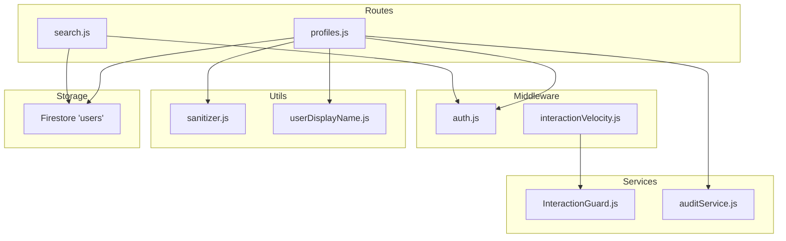
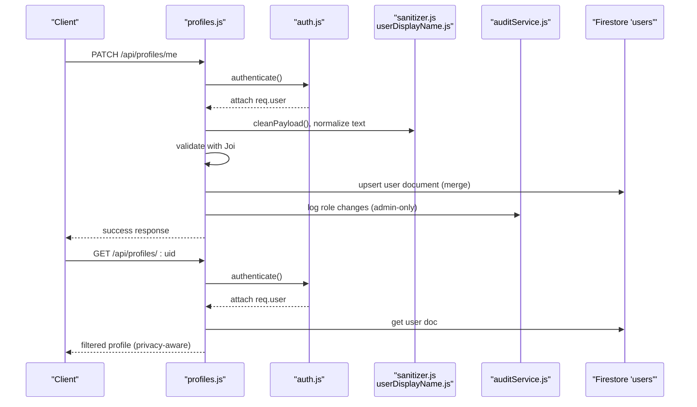
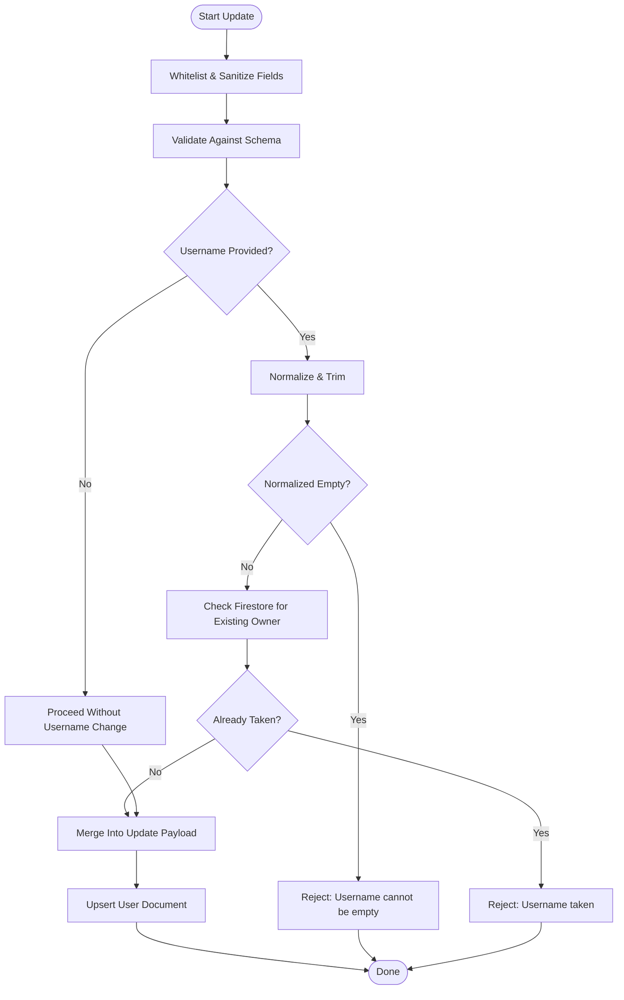
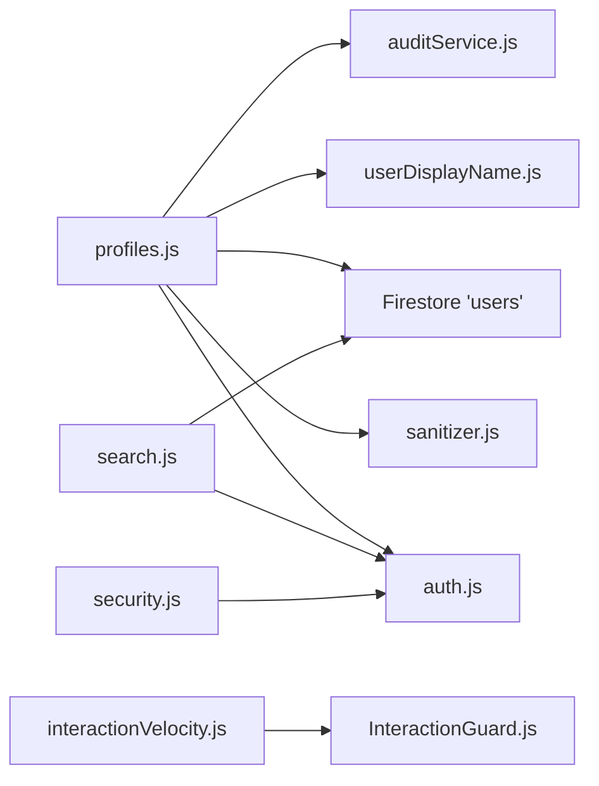

# Profiles API

<cite>
**Referenced Files in This Document**
- [profiles.js](file://backend/src/routes/profiles.js)
- [auth.js](file://backend/src/middleware/auth.js)
- [sanitizer.js](file://backend/src/utils/sanitizer.js)
- [userDisplayName.js](file://backend/src/utils/userDisplayName.js)
- [auditService.js](file://backend/src/services/auditService.js)
- [uploadLimits.js](file://backend/src/middleware/uploadLimits.js)
- [search.js](file://backend/src/routes/search.js)
- [InteractionGuard.js](file://backend/src/services/InteractionGuard.js)
- [interactionVelocity.js](file://backend/src/middleware/interactionVelocity.js)
- [security.js](file://backend/src/middleware/security.js)
</cite>

## Table of Contents
1. [Introduction](#introduction)
2. [Project Structure](#project-structure)
3. [Core Components](#core-components)
4. [Architecture Overview](#architecture-overview)
5. [Detailed Component Analysis](#detailed-component-analysis)
6. [Dependency Analysis](#dependency-analysis)
7. [Performance Considerations](#performance-considerations)
8. [Troubleshooting Guide](#troubleshooting-guide)
9. [Conclusion](#conclusion)
10. [Appendices](#appendices)

## Introduction
This document provides comprehensive API documentation for user profile management endpoints. It covers profile retrieval by user identifier, profile updates including avatar and bio, username availability checks, and the display name generation logic. It also outlines privacy-aware responses, validation rules, and operational safeguards such as audit logging and moderation-related protections. Where applicable, integration points with search and interaction guards are described to support discovery and abuse prevention.

## Project Structure
The Profiles API is implemented as an Express router module with supporting utilities and middleware:
- Route: profiles endpoint handlers
- Middleware: authentication and rate-limiting for interactions
- Utilities: input sanitization, display name normalization
- Services: audit logging for sensitive actions
- Search: user discovery endpoint (used alongside profiles)

**Diagram sources**
- [profiles.js](file://backend/src/routes/profiles.js#L1-L258)
- [auth.js](file://backend/src/middleware/auth.js#L1-L164)
- [sanitizer.js](file://backend/src/utils/sanitizer.js#L1-L64)
- [userDisplayName.js](file://backend/src/utils/userDisplayName.js#L1-L38)
- [auditService.js](file://backend/src/services/auditService.js#L1-L33)
- [search.js](file://backend/src/routes/search.js#L1-L52)
- [InteractionGuard.js](file://backend/src/services/InteractionGuard.js#L1-L170)
- [interactionVelocity.js](file://backend/src/middleware/interactionVelocity.js#L1-L44)

**Section sources**
- [profiles.js](file://backend/src/routes/profiles.js#L1-L258)
- [auth.js](file://backend/src/middleware/auth.js#L1-L164)
- [sanitizer.js](file://backend/src/utils/sanitizer.js#L1-L64)
- [userDisplayName.js](file://backend/src/utils/userDisplayName.js#L1-L38)
- [auditService.js](file://backend/src/services/auditService.js#L1-L33)
- [search.js](file://backend/src/routes/search.js#L1-L52)
- [InteractionGuard.js](file://backend/src/services/InteractionGuard.js#L1-L170)
- [interactionVelocity.js](file://backend/src/middleware/interactionVelocity.js#L1-L44)

## Core Components
- Profiles route: exposes endpoints to update the authenticated user’s profile, check username availability, and retrieve a user profile by identifier.
- Authentication middleware: verifies tokens, attaches user context, enforces account status, and caches profile data.
- Sanitization utilities: strict field whitelisting and XSS sanitization for incoming payloads.
- Display name generator: resolves a human-friendly display name from available fields.
- Audit service: records sensitive administrative actions for compliance.
- Upload limits middleware: enforces daily upload quotas for media operations.
- Search route: supports user discovery by username prefix.
- Interaction guard and velocity middleware: protect the platform from abusive interaction patterns.

**Section sources**
- [profiles.js](file://backend/src/routes/profiles.js#L1-L258)
- [auth.js](file://backend/src/middleware/auth.js#L1-L164)
- [sanitizer.js](file://backend/src/utils/sanitizer.js#L1-L64)
- [userDisplayName.js](file://backend/src/utils/userDisplayName.js#L1-L38)
- [auditService.js](file://backend/src/services/auditService.js#L1-L33)
- [uploadLimits.js](file://backend/src/middleware/uploadLimits.js#L1-L55)
- [search.js](file://backend/src/routes/search.js#L1-L52)
- [InteractionGuard.js](file://backend/src/services/InteractionGuard.js#L1-L170)
- [interactionVelocity.js](file://backend/src/middleware/interactionVelocity.js#L1-L44)

## Architecture Overview
The Profiles API integrates with authentication, sanitization, and audit services. It writes to Firestore and leverages caching to optimize repeated reads. Privacy controls ensure sensitive fields are only returned to owners or administrators.

**Diagram sources**
- [profiles.js](file://backend/src/routes/profiles.js#L29-L255)
- [auth.js](file://backend/src/middleware/auth.js#L20-L161)
- [sanitizer.js](file://backend/src/utils/sanitizer.js#L60-L63)
- [userDisplayName.js](file://backend/src/utils/userDisplayName.js#L1-L25)
- [auditService.js](file://backend/src/services/auditService.js#L9-L29)

## Detailed Component Analysis

### Endpoint: Update Current Profile
- Method: PATCH
- Path: /api/profiles/me
- Authentication: Required
- Purpose: Update profile fields for the authenticated user, including display name, username, first/last name, about/bio, profile image URL, location, and optional push token. Role updates are restricted to administrators and are audited.

Validation and sanitization:
- Allowed fields are whitelisted and sanitized to remove potentially malicious content.
- Username uniqueness is enforced; empty usernames are rejected.
- Role changes require admin privileges and are logged.

Display name resolution:
- If a display name is not provided, the system generates one from username, first/last name, or email fallback.

Caching:
- On successful update, the user profile cache is invalidated to ensure subsequent reads reflect the latest data.

Response:
- Returns a success message indicating whether the profile was created or updated.

**Section sources**
- [profiles.js](file://backend/src/routes/profiles.js#L29-L154)
- [sanitizer.js](file://backend/src/utils/sanitizer.js#L60-L63)
- [userDisplayName.js](file://backend/src/utils/userDisplayName.js#L1-L25)
- [auditService.js](file://backend/src/services/auditService.js#L9-L29)
- [auth.js](file://backend/src/middleware/auth.js#L10-L12)

### Endpoint: Check Username Availability
- Method: GET
- Path: /api/profiles/check-username
- Authentication: Not required
- Purpose: Public endpoint to check if a given username is available for signup.

Behavior:
- Performs a case-insensitive lookup in Firestore.
- Returns a boolean indicating availability.

**Section sources**
- [profiles.js](file://backend/src/routes/profiles.js#L160-L178)

### Endpoint: Retrieve Profile by User Identifier
- Method: GET
- Path: /api/profiles/:uid
- Authentication: Required
- Purpose: Fetch a user’s profile by UID.

Self-healing:
- If the requested user is the authenticated owner and the profile does not exist, the system bootstraps a minimal profile with derived display name and username, then serves it.

Privacy-aware response:
- Removes sensitive fields (e.g., email, role) from public views.
- Returns email and role to the profile owner or administrators.

Display name and avatar resolution:
- Resolves a display name from available fields.
- Chooses profile image URL with fallback logic, including owner’s current avatar when appropriate.

**Section sources**
- [profiles.js](file://backend/src/routes/profiles.js#L184-L255)
- [userDisplayName.js](file://backend/src/utils/userDisplayName.js#L1-L25)
- [auth.js](file://backend/src/middleware/auth.js#L20-L161)

### Username Uniqueness and Normalization Flow

**Diagram sources**
- [profiles.js](file://backend/src/routes/profiles.js#L30-L97)
- [sanitizer.js](file://backend/src/utils/sanitizer.js#L60-L63)

**Section sources**
- [profiles.js](file://backend/src/routes/profiles.js#L30-L97)
- [sanitizer.js](file://backend/src/utils/sanitizer.js#L60-L63)

### Display Name Generation Logic
- Priority order: explicit display name, then username, then full name (first + last), then email prefix, finally a default fallback.
- Normalization trims whitespace and ignores empty values.

**Section sources**
- [userDisplayName.js](file://backend/src/utils/userDisplayName.js#L1-L25)

### Privacy Controls and Sensitive Field Handling
- Retrieval: sensitive fields are excluded from public responses; included only for the profile owner or administrators.
- Role changes: restricted to administrators; any change is recorded in audit logs.

**Section sources**
- [profiles.js](file://backend/src/routes/profiles.js#L226-L249)
- [profiles.js](file://backend/src/routes/profiles.js#L99-L113)
- [auditService.js](file://backend/src/services/auditService.js#L9-L29)

### Upload Limits for Media Operations
- Daily upload limit enforcement: 20 uploads per user per day.
- Middleware increments counters after successful uploads.

Note: While this middleware is primarily for uploads, it demonstrates the platform’s quota enforcement model that can be applied consistently across media-related profile updates.

**Section sources**
- [uploadLimits.js](file://backend/src/middleware/uploadLimits.js#L10-L54)

### User Discovery and Filtering
- Search endpoint supports user discovery by username prefix.
- Results are limited and paginated.

Filtering capabilities:
- Username prefix match is supported.
- Additional filters (e.g., location, interests) are not present in the current search implementation.

**Section sources**
- [search.js](file://backend/src/routes/search.js#L11-L49)

### Interaction Velocity and Abuse Prevention
- Follow velocity middleware enforces rate limits to prevent spam and graph manipulation.
- Underlying guard evaluates pair toggles and global velocity thresholds.

These protections complement profile management by ensuring healthy platform dynamics.

**Section sources**
- [interactionVelocity.js](file://backend/src/middleware/interactionVelocity.js#L8-L34)
- [InteractionGuard.js](file://backend/src/services/InteractionGuard.js#L103-L122)

## Dependency Analysis

**Diagram sources**
- [profiles.js](file://backend/src/routes/profiles.js#L1-L258)
- [auth.js](file://backend/src/middleware/auth.js#L1-L164)
- [sanitizer.js](file://backend/src/utils/sanitizer.js#L1-L64)
- [userDisplayName.js](file://backend/src/utils/userDisplayName.js#L1-L38)
- [auditService.js](file://backend/src/services/auditService.js#L1-L33)
- [search.js](file://backend/src/routes/search.js#L1-L52)
- [interactionVelocity.js](file://backend/src/middleware/interactionVelocity.js#L1-L44)
- [InteractionGuard.js](file://backend/src/services/InteractionGuard.js#L1-L170)
- [security.js](file://backend/src/middleware/security.js#L1-L75)

**Section sources**
- [profiles.js](file://backend/src/routes/profiles.js#L1-L258)
- [auth.js](file://backend/src/middleware/auth.js#L1-L164)
- [sanitizer.js](file://backend/src/utils/sanitizer.js#L1-L64)
- [userDisplayName.js](file://backend/src/utils/userDisplayName.js#L1-L38)
- [auditService.js](file://backend/src/services/auditService.js#L1-L33)
- [search.js](file://backend/src/routes/search.js#L1-L52)
- [interactionVelocity.js](file://backend/src/middleware/interactionVelocity.js#L1-L44)
- [InteractionGuard.js](file://backend/src/services/InteractionGuard.js#L1-L170)
- [security.js](file://backend/src/middleware/security.js#L1-L75)

## Performance Considerations
- Authentication caching: In-memory cache reduces Firestore reads for user profiles during the configured TTL.
- Minimal writes: Upserts use merge semantics to avoid full replacements.
- Strict input sanitization: Reduces downstream processing overhead by preventing XSS and mass assignment.
- Rate limiting: Interaction velocity middleware prevents abuse and maintains responsiveness.

[No sources needed since this section provides general guidance]

## Troubleshooting Guide
Common issues and resolutions:
- Authentication failures: Verify bearer token presence and validity; check for token expiration or revocation.
- Profile not found: For self-requests, the system bootstraps a minimal profile on first read; otherwise ensure the UID is correct.
- Username conflicts: Choose a unique username; the system enforces uniqueness.
- Role change denied: Only administrators can modify roles; verify requester’s role.
- Upload limit reached: Respect the daily upload cap; wait until the next day to continue.

Operational logging:
- Audit logs capture sensitive administrative actions for traceability.
- Request lifecycle logs assist in diagnosing validation and sanitization outcomes.

**Section sources**
- [auth.js](file://backend/src/middleware/auth.js#L20-L161)
- [profiles.js](file://backend/src/routes/profiles.js#L184-L255)
- [profiles.js](file://backend/src/routes/profiles.js#L84-L97)
- [profiles.js](file://backend/src/routes/profiles.js#L100-L113)
- [uploadLimits.js](file://backend/src/middleware/uploadLimits.js#L10-L36)
- [auditService.js](file://backend/src/services/auditService.js#L9-L29)

## Conclusion
The Profiles API provides robust, privacy-aware profile management with strong validation, sanitization, and auditability. It integrates seamlessly with authentication, caching, and moderation safeguards to ensure secure and reliable user experiences. Discovery and interaction protections further strengthen platform health.

[No sources needed since this section summarizes without analyzing specific files]

## Appendices

### API Reference Summary

- PATCH /api/profiles/me
  - Description: Update current user profile
  - Auth: Required
  - Body fields: displayName, username, firstName, lastName, about, profileImageUrl, location, fcmToken, role (admin-only)
  - Responses: 200 success, 400 invalid input, 403 unauthorized role change, 404 not found, 409 username taken

- GET /api/profiles/check-username
  - Description: Check username availability
  - Auth: Not required
  - Query: username
  - Responses: 200 with availability flag

- GET /api/profiles/:uid
  - Description: Get user profile by UID
  - Auth: Required
  - Path: uid
  - Responses: 200 with filtered profile, 404 not found

- GET /api/search?q&type=users&limit
  - Description: Discover users by username prefix
  - Auth: Required
  - Query: q (required), type (default users), limit (max 50)
  - Responses: 200 with results array

**Section sources**
- [profiles.js](file://backend/src/routes/profiles.js#L29-L255)
- [search.js](file://backend/src/routes/search.js#L11-L49)

### Validation Rules and Behavior
- Username: minimum length, maximum length, uniqueness enforced, normalization applied
- Display name: generated from provided values or fallbacks
- About/bio: maximum length enforced
- Profile image URL: URI validation
- Role: restricted to administrators for changes; logged when modified

**Section sources**
- [profiles.js](file://backend/src/routes/profiles.js#L12-L23)
- [profiles.js](file://backend/src/routes/profiles.js#L116-L123)
- [profiles.js](file://backend/src/routes/profiles.js#L99-L113)
- [auditService.js](file://backend/src/services/auditService.js#L9-L29)

### Privacy Compliance Features
- Sensitive fields excluded from public responses
- Owner/admin visibility extended to email and role
- Audit logging for role changes to support compliance

**Section sources**
- [profiles.js](file://backend/src/routes/profiles.js#L226-L249)
- [profiles.js](file://backend/src/routes/profiles.js#L107-L112)
- [auditService.js](file://backend/src/services/auditService.js#L9-L29)

### Moderation and Abuse Prevention Integration
- Interaction velocity middleware protects platform from spam and graph manipulation
- Guard enforces pair toggles and global velocity thresholds for follows and likes

**Section sources**
- [interactionVelocity.js](file://backend/src/middleware/interactionVelocity.js#L8-L34)
- [InteractionGuard.js](file://backend/src/services/InteractionGuard.js#L103-L122)