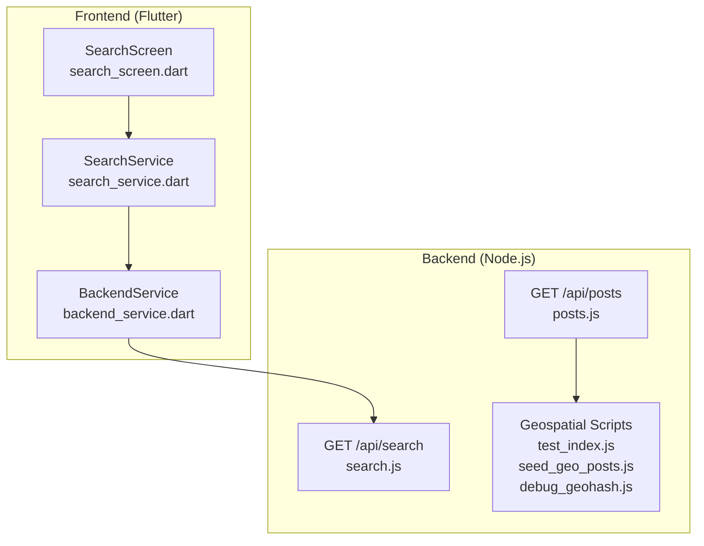
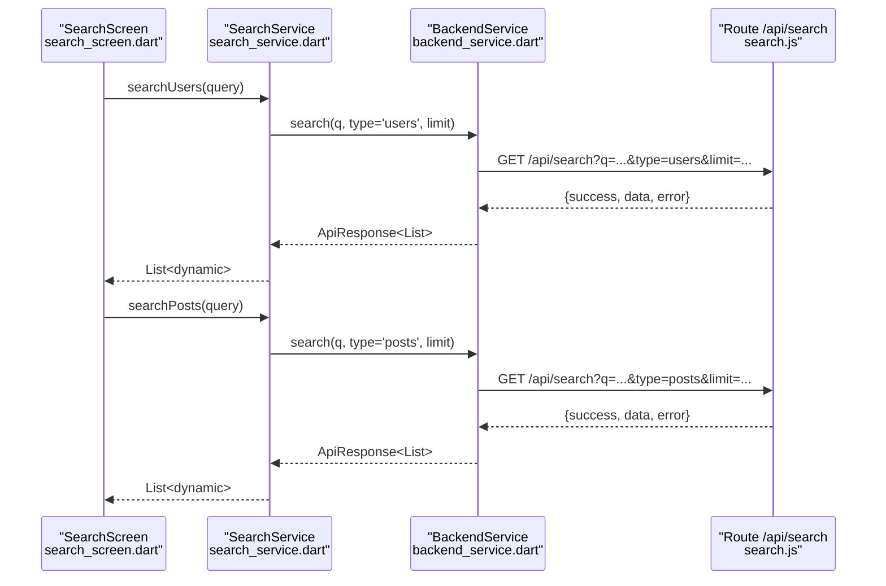
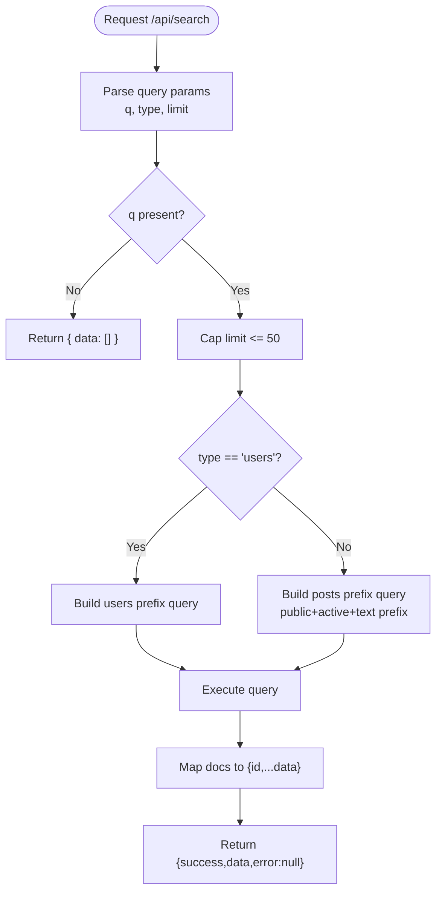
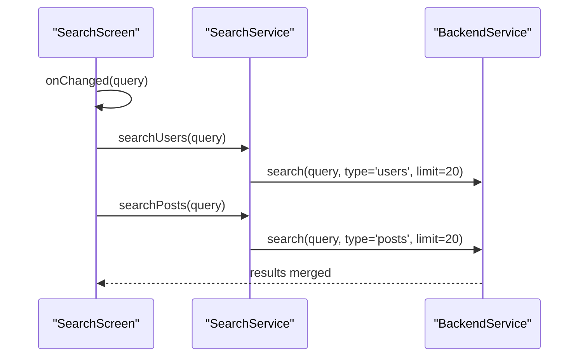
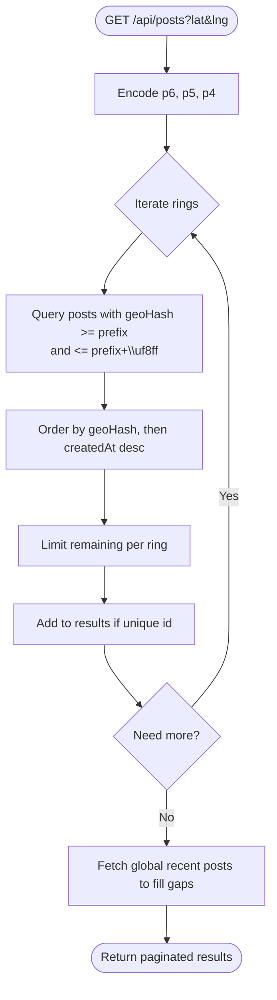
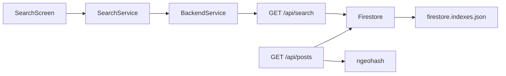

# Search API

<cite>
**Referenced Files in This Document**
- [search.js](file://backend/src/routes/search.js)
- [posts.js](file://backend/src/routes/posts.js)
- [search_service.dart](file://testpro-main/lib/services/search_service.dart)
- [backend_service.dart](file://testpro-main/lib/services/backend_service.dart)
- [search_screen.dart](file://testpro-main/lib/screens/search_screen.dart)
- [test_index.js](file://backend/scripts/test_index.js)
- [seed_geo_posts.js](file://backend/scripts/seed_geo_posts.js)
- [debug_geohash.js](file://backend/scripts/debug_geohash.js)
- [firestore.indexes.json](file://testpro-main/firestore.indexes.json)
</cite>

## Table of Contents
1. [Introduction](#introduction)
2. [Project Structure](#project-structure)
3. [Core Components](#core-components)
4. [Architecture Overview](#architecture-overview)
5. [Detailed Component Analysis](#detailed-component-analysis)
6. [Dependency Analysis](#dependency-analysis)
7. [Performance Considerations](#performance-considerations)
8. [Troubleshooting Guide](#troubleshooting-guide)
9. [Conclusion](#conclusion)
10. [Appendices](#appendices)

## Introduction
This document provides comprehensive API documentation for the platform’s search functionality. It covers:
- Text-based search for posts and users with prefix matching and limits
- Geolocation-based search using geohashes for proximity and hierarchical ring fetching
- Autocomplete and trending discovery patterns
- Saved search management
- Pagination and result formatting
- Performance optimization techniques and integration with the geohashing system

The search API is primarily exposed via a single endpoint that supports switching between user and post search modes, with additional geolocation features implemented in the feed endpoint for proximity ranking.

## Project Structure
The search functionality spans backend routes, frontend services, and supporting scripts for geospatial seeding and index validation.

**Diagram sources**
- [search_screen.dart](file://testpro-main/lib/screens/search_screen.dart#L1-L200)
- [search_service.dart](file://testpro-main/lib/services/search_service.dart#L1-L27)
- [backend_service.dart](file://testpro-main/lib/services/backend_service.dart#L418-L424)
- [search.js](file://backend/src/routes/search.js#L1-L52)
- [posts.js](file://backend/src/routes/posts.js#L333-L527)
- [test_index.js](file://backend/scripts/test_index.js#L1-L28)
- [seed_geo_posts.js](file://backend/scripts/seed_geo_posts.js#L1-L110)
- [debug_geohash.js](file://backend/scripts/debug_geohash.js#L1-L17)

**Section sources**
- [search.js](file://backend/src/routes/search.js#L1-L52)
- [posts.js](file://backend/src/routes/posts.js#L333-L527)
- [search_service.dart](file://testpro-main/lib/services/search_service.dart#L1-L27)
- [backend_service.dart](file://testpro-main/lib/services/backend_service.dart#L418-L424)
- [search_screen.dart](file://testpro-main/lib/screens/search_screen.dart#L1-L200)
- [test_index.js](file://backend/scripts/test_index.js#L1-L28)
- [seed_geo_posts.js](file://backend/scripts/seed_geo_posts.js#L1-L110)
- [debug_geohash.js](file://backend/scripts/debug_geohash.js#L1-L17)

## Core Components
- Search endpoint: GET /api/search
  - Accepts query string q, type (users or posts), and limit
  - Returns JSON with success flag, data array, and null error
- Frontend search service: SearchService
  - Wraps BackendService.search to fetch user and post results
- Geolocation feed: GET /api/posts
  - Supports lat/lng for progressive multi-ring proximity fetching
  - Uses geohash prefixes to efficiently target nearby posts
- Supporting scripts
  - test_index.js validates composite index usage for geo queries
  - seed_geo_posts.js generates synthetic geotagged posts
  - debug_geohash.js demonstrates encoding precision levels

**Section sources**
- [search.js](file://backend/src/routes/search.js#L7-L49)
- [search_service.dart](file://testpro-main/lib/services/search_service.dart#L1-L27)
- [backend_service.dart](file://testpro-main/lib/services/backend_service.dart#L418-L424)
- [posts.js](file://backend/src/routes/posts.js#L368-L441)
- [test_index.js](file://backend/scripts/test_index.js#L1-L28)
- [seed_geo_posts.js](file://backend/scripts/seed_geo_posts.js#L1-L110)
- [debug_geohash.js](file://backend/scripts/debug_geohash.js#L1-L17)

## Architecture Overview
The search architecture integrates client-side debounced input with server-side prefix matching and geospatial ring fetching.

**Diagram sources**
- [search_screen.dart](file://testpro-main/lib/screens/search_screen.dart#L45-L83)
- [search_service.dart](file://testpro-main/lib/services/search_service.dart#L1-L27)
- [backend_service.dart](file://testpro-main/lib/services/backend_service.dart#L418-L424)
- [search.js](file://backend/src/routes/search.js#L11-L49)

## Detailed Component Analysis

### Text-Based Search Endpoint
- Endpoint: GET /api/search
- Query parameters:
  - q: Required for results; empty query returns empty array
  - type: posts (default) or users
  - limit: page size capped at 50
- Behavior:
  - Users: prefix match on username using range filters
  - Posts: prefix match on text with public and active filters
- Response:
  - JSON object with success, data array, and error

**Diagram sources**
- [search.js](file://backend/src/routes/search.js#L11-L49)

**Section sources**
- [search.js](file://backend/src/routes/search.js#L7-L49)

### Frontend Integration and Debouncing
- SearchScreen debounces input by 500 ms and triggers concurrent user and post searches
- SearchService wraps BackendService.search with defaults for type and limit
- BackendService.search constructs the URL with query parameters and returns ApiResponse

**Diagram sources**
- [search_screen.dart](file://testpro-main/lib/screens/search_screen.dart#L45-L83)
- [search_service.dart](file://testpro-main/lib/services/search_service.dart#L1-L27)
- [backend_service.dart](file://testpro-main/lib/services/backend_service.dart#L418-L424)

**Section sources**
- [search_screen.dart](file://testpro-main/lib/screens/search_screen.dart#L45-L83)
- [search_service.dart](file://testpro-main/lib/services/search_service.dart#L1-L27)
- [backend_service.dart](file://testpro-main/lib/services/backend_service.dart#L418-L424)

### Geolocation-Based Search and Proximity Ranking
- The feed endpoint supports lat/lng to enable progressive multi-ring fetching:
  - Encodes three geohash precisions (p6, p5, p4) around the user’s location
  - Iteratively fetches posts within each ring prefix, deduplicating by post ID
  - Falls back to global recent posts to fill gaps
- The script test_index.js validates composite index usage for geoHash ordering and filtering
- The script seed_geo_posts.js generates synthetic posts across cities and rural areas to validate ring behavior
- The script debug_geohash.js prints geohash encodings for selected cities at different precisions

**Diagram sources**
- [posts.js](file://backend/src/routes/posts.js#L368-L441)
- [test_index.js](file://backend/scripts/test_index.js#L1-L28)
- [seed_geo_posts.js](file://backend/scripts/seed_geo_posts.js#L1-L110)
- [debug_geohash.js](file://backend/scripts/debug_geohash.js#L1-L17)

**Section sources**
- [posts.js](file://backend/src/routes/posts.js#L368-L441)
- [test_index.js](file://backend/scripts/test_index.js#L1-L28)
- [seed_geo_posts.js](file://backend/scripts/seed_geo_posts.js#L1-L110)
- [debug_geohash.js](file://backend/scripts/debug_geohash.js#L1-L17)

### Autocomplete and Trending Discovery
- Autocomplete: Debounced input in SearchScreen triggers concurrent user and post search calls; the backend performs prefix matches suitable for autocomplete-like behavior.
- Trending discovery: The feed falls back to global recent posts when local rings are insufficient, surfacing trending content.

**Section sources**
- [search_screen.dart](file://testpro-main/lib/screens/search_screen.dart#L45-L83)
- [posts.js](file://backend/src/routes/posts.js#L411-L431)

### Saved Search Management
- No explicit saved search endpoint is present in the backend routes examined.
- Recommendation: Add a new route to persist and retrieve user-specific search queries, optionally with metadata like timestamps and frequency.

[No sources needed since this section proposes future enhancement]

### Pagination and Result Formatting
- Text search: Returns a flat array of documents with id and data fields.
- Feed pagination: Uses cursor-based pagination with afterId and returns pagination metadata (cursor, hasMore).
- Frontend pagination model: PaginatedResponse<T> includes data, nextCursor, hasMore, and optional total.

**Section sources**
- [search.js](file://backend/src/routes/search.js#L35-L45)
- [posts.js](file://backend/src/routes/posts.js#L481-L488)
- [paginated_response.dart](file://testpro-main/lib/models/paginated_response.dart#L1-L15)

## Dependency Analysis
- Frontend depends on SearchService and BackendService to call /api/search
- Backend route /api/search depends on Firebase Firestore for prefix queries
- Feed endpoint /api/posts depends on geohash indexing and ngeohash encoding
- Indexes are defined in Firestore configuration to support composite queries

**Diagram sources**
- [search_screen.dart](file://testpro-main/lib/screens/search_screen.dart#L1-L200)
- [search_service.dart](file://testpro-main/lib/services/search_service.dart#L1-L27)
- [backend_service.dart](file://testpro-main/lib/services/backend_service.dart#L418-L424)
- [search.js](file://backend/src/routes/search.js#L1-L52)
- [posts.js](file://backend/src/routes/posts.js#L333-L527)
- [firestore.indexes.json](file://testpro-main/firestore.indexes.json#L1-L93)

**Section sources**
- [search.js](file://backend/src/routes/search.js#L1-L52)
- [posts.js](file://backend/src/routes/posts.js#L333-L527)
- [firestore.indexes.json](file://testpro-main/firestore.indexes.json#L1-L93)

## Performance Considerations
- Prefix search limitations: The current text search relies on Firestore prefix matching which is limited; consider integrating a dedicated search engine (e.g., Algolia or Typesense) for advanced full-text search, relevance scoring, and faceting.
- Indexing: Composite indexes are required for filtered queries; ensure indexes exist for combinations like visibility/status/text and geoHash ordering.
- Geospatial efficiency: Using geohash prefixes enables efficient bounding ring queries; maintain appropriate precision levels to balance accuracy and query cost.
- Rate limiting and caching: The feed endpoint includes anti-scraping jitter and caching mechanisms; similar protections can be considered for the search endpoint.
- Pagination: Prefer cursor-based pagination for large datasets; avoid offset-based pagination.

[No sources needed since this section provides general guidance]

## Troubleshooting Guide
- Missing composite index errors: When filtered queries fail with index-related errors, create the required composite indexes as indicated by the error messages.
- Query validation: Use test_index.js to validate that geoHash queries execute successfully with proper ordering and limits.
- Geohash precision: Verify geohash encodings at different precisions using debug_geohash.js to ensure expected coverage and granularity.
- Seed data: Use seed_geo_posts.js to generate realistic geotagged posts for testing proximity and ring behavior.

**Section sources**
- [posts.js](file://backend/src/routes/posts.js#L467-L477)
- [test_index.js](file://backend/scripts/test_index.js#L1-L28)
- [debug_geohash.js](file://backend/scripts/debug_geohash.js#L1-L17)
- [seed_geo_posts.js](file://backend/scripts/seed_geo_posts.js#L1-L110)

## Conclusion
The current search API provides practical text-based prefix matching for users and posts, complemented by robust geolocation-based proximity ranking in the feed endpoint. To meet advanced requirements—such as full-text relevance scoring, faceted search, and trending discovery—integrate a specialized search engine and enhance the search endpoint with richer filtering and ranking capabilities. Maintain strong indexing practices and leverage geohash-based ring queries for efficient spatial retrieval.

[No sources needed since this section summarizes without analyzing specific files]

## Appendices

### API Reference: GET /api/search
- Authentication: Required
- Query parameters:
  - q (string): Search query; required for results
  - type (string): posts or users; default posts
  - limit (number): Page size; capped at 50
- Response:
  - success (boolean)
  - data (array): Array of documents with id and fields
  - error (null|string)

**Section sources**
- [search.js](file://backend/src/routes/search.js#L7-L49)

### API Reference: GET /api/posts (Geolocation)
- Authentication: Required
- Query parameters:
  - lat (number): Latitude
  - lng (number): Longitude
  - authorId (string): Filter by author
  - category (string): Filter by category
  - city (string): Filter by city
  - country (string): Filter by country
  - limit (number): Page size; capped at 50
  - afterId (string): Cursor for pagination
- Response:
  - success (boolean)
  - data (array): Posts with enrichment
  - pagination (object): cursor, hasMore

**Section sources**
- [posts.js](file://backend/src/routes/posts.js#L333-L527)

### Example Queries
- Text search for posts: GET /api/search?q=hello&type=posts&limit=20
- Text search for users: GET /api/search?q=john&type=users&limit=20
- Local feed near coordinates: GET /api/posts?lat=13.0827&lng=80.2707&limit=20

**Section sources**
- [search.js](file://backend/src/routes/search.js#L11-L49)
- [posts.js](file://backend/src/routes/posts.js#L333-L527)