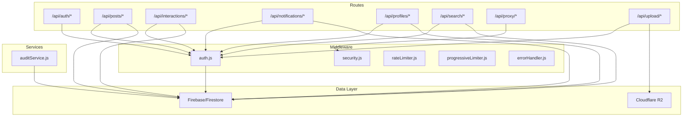
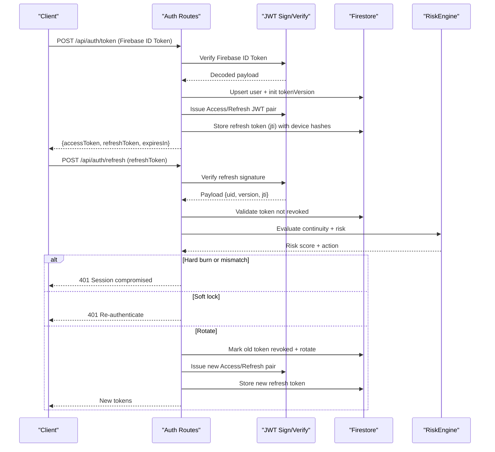
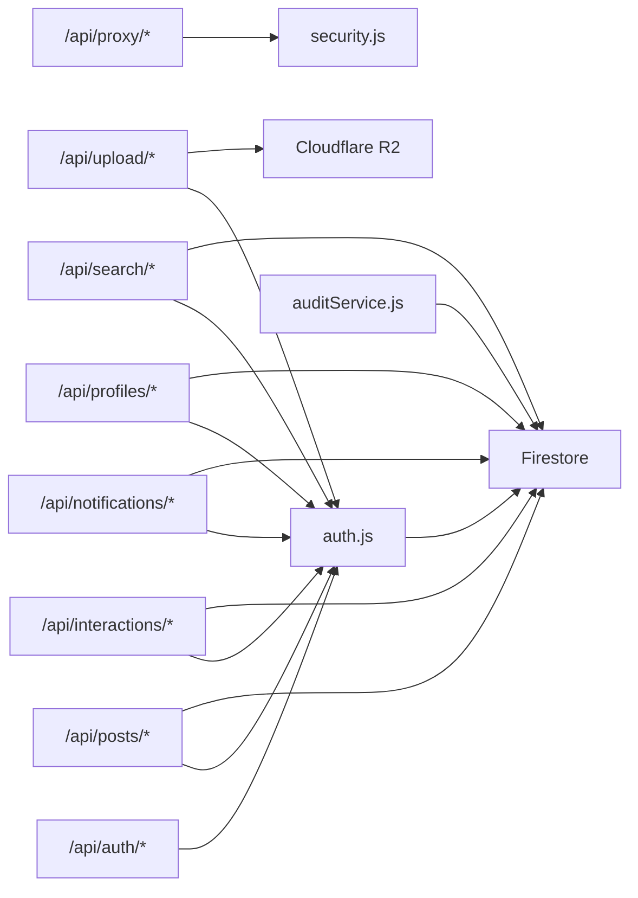

# API Endpoints

<cite>
**Referenced Files in This Document**
- [auth.js](file://backend/src/routes/auth.js)
- [posts.js](file://backend/src/routes/posts.js)
- [interactions.js](file://backend/src/routes/interactions.js)
- [notifications.js](file://backend/src/routes/notifications.js)
- [profiles.js](file://backend/src/routes/profiles.js)
- [search.js](file://backend/src/routes/search.js)
- [proxy.js](file://backend/src/routes/proxy.js)
- [upload.js](file://backend/src/routes/upload.js)
- [auth.js](file://backend/src/middleware/auth.js)
- [rateLimiter.js](file://backend/src/middleware/rateLimiter.js)
- [progressiveLimiter.js](file://backend/src/middleware/progressiveLimiter.js)
- [security.js](file://backend/src/middleware/security.js)
- [errorHandler.js](file://backend/src/middleware/errorHandler.js)
- [auditService.js](file://backend/src/services/auditService.js)
- [logger.js](file://backend/src/utils/logger.js)
</cite>

## Table of Contents
1. [Introduction](#introduction)
2. [Project Structure](#project-structure)
3. [Core Components](#core-components)
4. [Architecture Overview](#architecture-overview)
5. [Detailed Component Analysis](#detailed-component-analysis)
6. [Dependency Analysis](#dependency-analysis)
7. [Performance Considerations](#performance-considerations)
8. [Troubleshooting Guide](#troubleshooting-guide)
9. [Conclusion](#conclusion)
10. [Appendices](#appendices)

## Introduction
This document provides comprehensive API documentation for the backend REST endpoints. It covers authentication, post management, interactions, notifications, profiles, search, and media proxy endpoints. For each endpoint group, you will find:
- Endpoint definitions and HTTP methods
- Authentication requirements
- Request/response schemas
- Error codes and status mappings
- Rate limiting policies
- Example curl commands and integration guidelines
- Supporting diagrams for flows and architecture

## Project Structure
The backend exposes REST endpoints grouped under routes, secured and rate-limited by middleware, and backed by Firebase/Firestore and Cloudflare R2.

**Diagram sources**
- [auth.js](file://backend/src/routes/auth.js#L1-L301)
- [posts.js](file://backend/src/routes/posts.js#L1-L728)
- [interactions.js](file://backend/src/routes/interactions.js#L1-L522)
- [notifications.js](file://backend/src/routes/notifications.js#L1-L51)
- [profiles.js](file://backend/src/routes/profiles.js#L1-L258)
- [search.js](file://backend/src/routes/search.js#L1-L52)
- [proxy.js](file://backend/src/routes/proxy.js#L1-L70)
- [upload.js](file://backend/src/routes/upload.js#L1-L225)
- [auth.js](file://backend/src/middleware/auth.js#L1-L164)
- [security.js](file://backend/src/middleware/security.js#L1-L75)
- [rateLimiter.js](file://backend/src/middleware/rateLimiter.js#L1-L76)
- [progressiveLimiter.js](file://backend/src/middleware/progressiveLimiter.js#L1-L61)
- [errorHandler.js](file://backend/src/middleware/errorHandler.js#L1-L35)
- [auditService.js](file://backend/src/services/auditService.js#L1-L33)

**Section sources**
- [auth.js](file://backend/src/routes/auth.js#L1-L301)
- [posts.js](file://backend/src/routes/posts.js#L1-L728)
- [interactions.js](file://backend/src/routes/interactions.js#L1-L522)
- [notifications.js](file://backend/src/routes/notifications.js#L1-L51)
- [profiles.js](file://backend/src/routes/profiles.js#L1-L258)
- [search.js](file://backend/src/routes/search.js#L1-L52)
- [proxy.js](file://backend/src/routes/proxy.js#L1-L70)
- [upload.js](file://backend/src/routes/upload.js#L1-L225)
- [auth.js](file://backend/src/middleware/auth.js#L1-L164)
- [security.js](file://backend/src/middleware/security.js#L1-L75)
- [rateLimiter.js](file://backend/src/middleware/rateLimiter.js#L1-L76)
- [progressiveLimiter.js](file://backend/src/middleware/progressiveLimiter.js#L1-L61)
- [errorHandler.js](file://backend/src/middleware/errorHandler.js#L1-L35)
- [auditService.js](file://backend/src/services/auditService.js#L1-L33)

## Core Components
- Authentication and session management with custom JWT and refresh token rotation, plus Firebase ID token verification.
- Post lifecycle with validation, geohash indexing, event groups, and feed caching.
- Interaction engine for likes, comments, follows, and event attendance with transactional consistency.
- Notifications with retrieval and read status management.
- Profile management with normalization, uniqueness checks, and role restrictions.
- Search across users and posts with prefix matching.
- Media upload pipeline to Cloudflare R2 with video processing and daily limits.
- Proxy endpoint for CORS-bypassing media images.
- Robust security middleware including CORS, helmet, timeouts, and progressive rate limiting.

**Section sources**
- [auth.js](file://backend/src/routes/auth.js#L1-L301)
- [posts.js](file://backend/src/routes/posts.js#L1-L728)
- [interactions.js](file://backend/src/routes/interactions.js#L1-L522)
- [notifications.js](file://backend/src/routes/notifications.js#L1-L51)
- [profiles.js](file://backend/src/routes/profiles.js#L1-L258)
- [search.js](file://backend/src/routes/search.js#L1-L52)
- [upload.js](file://backend/src/routes/upload.js#L1-L225)
- [proxy.js](file://backend/src/routes/proxy.js#L1-L70)
- [auth.js](file://backend/src/middleware/auth.js#L1-L164)
- [rateLimiter.js](file://backend/src/middleware/rateLimiter.js#L1-L76)
- [progressiveLimiter.js](file://backend/src/middleware/progressiveLimiter.js#L1-L61)
- [security.js](file://backend/src/middleware/security.js#L1-L75)
- [errorHandler.js](file://backend/src/middleware/errorHandler.js#L1-L35)
- [auditService.js](file://backend/src/services/auditService.js#L1-L33)

## Architecture Overview
High-level flow for authentication and refresh token rotation, including risk evaluation and session continuity checks.

**Diagram sources**
- [auth.js](file://backend/src/routes/auth.js#L15-L301)
- [auth.js](file://backend/src/middleware/auth.js#L1-L164)

## Detailed Component Analysis

### Authentication Endpoints
- Purpose: Token exchange, refresh, and debug.
- Authentication: Public endpoints; token exchange requires a Firebase ID token; refresh validates refresh token and device continuity.
- Security: Custom JWT with versioning, refresh token persistence with revocation tracking, risk evaluation, and device/IP continuity checks.

Endpoints:
- POST /api/auth/token
  - Description: Exchanges Firebase ID token for custom Access/Refresh token pair.
  - Auth: Public (requires Firebase ID token).
  - Request: { idToken: string }.
  - Response: { success: boolean, data: { accessToken: string, refreshToken: string, expiresIn: number } }.
  - Errors: 400 invalid input, 401 invalid/expired token, 500 internal configuration.
  - Curl example:
    - curl -X POST https://yourdomain/api/auth/token -H "Content-Type: application/json" -d '{"idToken":"<FIREBASE_ID_TOKEN>"}'

- POST /api/auth/refresh
  - Description: Issues a new Access/Refresh pair using a valid refresh token.
  - Auth: Public.
  - Request: { refreshToken: string }.
  - Response: { success: boolean, data: { accessToken: string, refreshToken: string, expiresIn: number } }.
  - Errors: 400 missing token, 401 invalid/expired/replayed/compromised, 500 unexpected.
  - Curl example:
    - curl -X POST https://yourdomain/api/auth/refresh -H "Content-Type: application/json" -d '{"refreshToken":"<REFRESH_TOKEN>"}'

- GET /api/auth/debug
  - Description: Debug endpoint to verify Firebase project configuration.
  - Auth: Public.
  - Response: { success: boolean, data: { projectId: string, nodeEnv: string, hasPrivateKey: boolean, clientEmail: string, timestamp: string } }.

Rate limiting:
- Strict auth limiter applies to authentication endpoints.

Security notes:
- Refresh uses device hash and IP hash checks, risk scoring, and optional full session burn.
- Access token versioning enforces instant kill switch on version mismatches.

**Section sources**
- [auth.js](file://backend/src/routes/auth.js#L15-L301)
- [auth.js](file://backend/src/middleware/auth.js#L1-L164)
- [rateLimiter.js](file://backend/src/middleware/rateLimiter.js#L24-L41)
- [progressiveLimiter.js](file://backend/src/middleware/progressiveLimiter.js#L1-L61)

### Post Management Endpoints
- Purpose: Create, read, delete posts; manage media URLs; event-specific messaging; feed retrieval with geohash and caching.

Endpoints:
- POST /api/posts
  - Description: Create a new post with validation and safety checks.
  - Auth: Required (Bearer).
  - Request: Allowed fields include title, body/text, category, city, country, mediaUrl, mediaType, thumbnailUrl, location {lat, lng, name}, tags[], isEvent, eventStartDate, eventEndDate, eventDate, eventLocation, isFree, eventType, subtitle, plus id and authorId.
  - Response: { success: boolean, data: Post object with computed fields }.
  - Errors: 400 invalid input, 403 account too new, 500 internal.
  - Curl example:
    - curl -X POST https://yourdomain/api/posts -H "Authorization: Bearer <ACCESS_TOKEN>" -H "Content-Type: application/json" -d '{...}'

- GET /api/posts
  - Description: Paginated feed with optional filters and geohash-based multi-ring expansion.
  - Auth: Required.
  - Query: authorId, category, city, country, lat, lng, limit (max 50), afterId.
  - Response: { success: boolean, data: Post[], pagination: { cursor: string|null, hasMore: boolean } }.
  - Notes: In-memory feed cache with TTL; dog-piling locks; anti-scraping jitter.

- GET /api/posts/:id
  - Description: Retrieve a single post by ID with privacy checks and like state.
  - Auth: Required.
  - Response: { success: boolean, data: Post with isLiked, computedStatus }.

- DELETE /api/posts/:id
  - Description: Delete a post (author or admin). Cascades deletes for events.
  - Auth: Required.
  - Response: { success: boolean, data: { message: string } }.

- POST /api/posts/:id/messages
  - Description: Send a chat message for an event/post.
  - Auth: Required.
  - Request: { text: string }.
  - Response: { success: boolean, data: Message object }.

- GET /api/posts/:id/messages
  - Description: Get recent chat messages for an event/post.
  - Auth: Required.
  - Response: { success: boolean, data: Message[] }.

Validation and safety:
- Joi schema enforces allowed fields and constraints.
- Shadow ban: posts remain invisible to others when authored by shadow-banned users.
- Geohash indexing for proximity feed; multi-ring expansion fallback.
- Transactional writes for post creation and event group membership.
- Audit trail logging for post creation/deletion.

**Section sources**
- [posts.js](file://backend/src/routes/posts.js#L58-L207)
- [posts.js](file://backend/src/routes/posts.js#L330-L527)
- [posts.js](file://backend/src/routes/posts.js#L529-L601)
- [posts.js](file://backend/src/routes/posts.js#L603-L656)
- [posts.js](file://backend/src/routes/posts.js#L660-L725)
- [auditService.js](file://backend/src/services/auditService.js#L1-L33)

### Interaction Endpoints (Likes, Comments, Follows, Events)
- Purpose: Manage user interactions with posts and users, including event attendance.

Endpoints:
- POST /api/interactions/like
  - Description: Toggle like/unlike for a post.
  - Auth: Required.
  - Request: { postId: string }.
  - Response: { success: boolean, data: { status: "active" } }.
  - Notes: Transactional; updates like counts; triggers notifications.

- POST /api/interactions/comment
  - Description: Add a top-level comment to a post.
  - Auth: Required.
  - Request: { postId: string, text: string }.
  - Response: { success: boolean, data: { commentId: string } }.

- POST /api/interactions/follow
  - Description: Follow/unfollow a user.
  - Auth: Required.
  - Request: { targetUserId: string }.
  - Response: { success: boolean, data: { status: "active" } }.
  - Notes: Prevents self-follow; updates counters.

- POST /api/interactions/event/join
  - Description: Join or leave an event; mirrors attendance and group membership.
  - Auth: Required.
  - Request: { eventId: string }.
  - Response: { success: boolean, data: { status: "active" } }.

- GET /api/interactions/comments/:postId
  - Description: List comments for a post.
  - Auth: Required.
  - Response: { success: boolean, data: Comment[] }.

- POST /api/interactions/likes/batch
  - Description: Check likes for multiple post IDs (chunks of 30).
  - Auth: Required.
  - Request: { postIds: string[] }.
  - Response: { success: boolean, data: { [postId]: boolean } }.

- GET /api/interactions/likes/check
  - Description: Check if current user liked a post and get likeCount.
  - Auth: Required.
  - Query: { postId: string }.
  - Response: { success: boolean, data: { liked: boolean, likeCount: number } }.

- GET /api/interactions/follows/check
  - Description: Check if current user follows a target user.
  - Auth: Required.
  - Query: { targetUserId: string }.
  - Response: { success: boolean, data: { followed: boolean } }.

- GET /api/interactions/events/check
  - Description: Check if current user is attending an event.
  - Auth: Required.
  - Query: { eventId: string }.
  - Response: { success: boolean, data: { attending: boolean } }.

- GET /api/interactions/events/my-events
  - Description: Return event IDs the current user has joined.
  - Auth: Required.
  - Response: { success: boolean, data: { eventIds: string[] } }.

Velocity controls:
- Dedicated velocity middleware enforces limits on likes and follows.

Notifications:
- Internal helper creates notifications for likes, comments, and follows.

**Section sources**
- [interactions.js](file://backend/src/routes/interactions.js#L24-L103)
- [interactions.js](file://backend/src/routes/interactions.js#L108-L171)
- [interactions.js](file://backend/src/routes/interactions.js#L176-L246)
- [interactions.js](file://backend/src/routes/interactions.js#L248-L322)
- [interactions.js](file://backend/src/routes/interactions.js#L346-L370)
- [interactions.js](file://backend/src/routes/interactions.js#L372-L419)
- [interactions.js](file://backend/src/routes/interactions.js#L421-L448)
- [interactions.js](file://backend/src/routes/interactions.js#L450-L471)
- [interactions.js](file://backend/src/routes/interactions.js#L473-L494)
- [interactions.js](file://backend/src/routes/interactions.js#L496-L518)

### Notification Endpoints
- Purpose: Retrieve notifications and mark them as read.

Endpoints:
- GET /api/notifications
  - Description: Get current user’s notifications (most recent 50).
  - Auth: Required.
  - Response: { data: Notification[] }.

- PATCH /api/notifications/:id/read
  - Description: Mark a notification as read.
  - Auth: Required.
  - Response: { success: boolean }.
  - Errors: 404 not found, 403 unauthorized.

**Section sources**
- [notifications.js](file://backend/src/routes/notifications.js#L7-L29)
- [notifications.js](file://backend/src/routes/notifications.js#L31-L48)

### Profile Management Endpoints
- Purpose: Update own profile, check username availability, and fetch user profiles.

Endpoints:
- PATCH /api/profiles/me
  - Description: Update current user profile with validation and normalization.
  - Auth: Required.
  - Request: Partial profile fields (displayName, username, firstName, lastName, about, profileImageUrl, location, fcmToken, role).
  - Response: { success: boolean, data: { message: string } }.
  - Errors: 400 invalid input, 409 username taken, 403 unauthorized role change.
  - Notes: Username uniqueness enforced; role changes restricted to admins; display name auto-generated if needed; cache cleared on update.

- GET /api/profiles/check-username
  - Description: Check if a username is available (public).
  - Auth: Not required.
  - Query: { username: string }.
  - Response: { success: boolean, data: { available: boolean } }.

- GET /api/profiles/:uid
  - Description: Get user profile by UID; self-heals incomplete profiles for authenticated owners.
  - Auth: Required.
  - Response: { success: boolean, data: Public profile (sensitive fields hidden except to owner/admin) }.
  - Errors: 404 not found.

**Section sources**
- [profiles.js](file://backend/src/routes/profiles.js#L25-L154)
- [profiles.js](file://backend/src/routes/profiles.js#L156-L178)
- [profiles.js](file://backend/src/routes/profiles.js#L180-L255)

### Search Endpoints
- Purpose: Search for users or posts.

Endpoints:
- GET /api/search
  - Description: Prefix-based search for usernames or post text.
  - Auth: Required.
  - Query: { q: string, type: "users"|"posts", limit: number (max 50) }.
  - Response: { success: boolean, data: SearchResult[] }.
  - Notes: Firestore prefix match; recommended to integrate full-text search (e.g., Algolia/Typesense) for production.

**Section sources**
- [search.js](file://backend/src/routes/search.js#L7-L49)

### Media Upload Endpoints
- Purpose: Upload profile images and post media to Cloudflare R2 with optional video processing.

Endpoints:
- POST /api/upload/profile
  - Description: Upload a profile image.
  - Auth: Required.
  - Form: file (single image).
  - Response: { key: string, url: string }.
  - Limits: Progressive upload limiter; token expiration validation; magic bytes validation.

- POST /api/upload/post
  - Description: Upload post media (image/video).
  - Auth: Required.
  - Form: file (single media), body: { mediaType: "image"|"video", postId?: string }.
  - Response: { key: string, url: string }.
  - Limits: Progressive upload limiter; daily upload limit; token expiration; magic bytes; video metadata and processing.

Video processing:
- Videos are transcoded to MP4, trimmed/compressed if needed, and stored with immutable cache headers.

**Section sources**
- [upload.js](file://backend/src/routes/upload.js#L80-L122)
- [upload.js](file://backend/src/routes/upload.js#L124-L222)

### Proxy Endpoints
- Purpose: Proxy media from allowed origins to bypass CORS for Flutter Web.

Endpoints:
- GET /api/proxy
  - Description: Proxy media from allowed hosts (e.g., Cloudflare R2, Google, Unsplash).
  - Auth: Not required.
  - Query: { url: string (encoded) }.
  - Response: Streams media directly with appropriate headers.
  - Errors: 400 missing/invalid url, 403 origin not allowed, 502 upstream failure.

Allowed origins:
- Environment-driven whitelist including Cloudflare R2 public base URL and common domains.

**Section sources**
- [proxy.js](file://backend/src/routes/proxy.js#L6-L67)

## Dependency Analysis
- Route dependencies:
  - All authenticated routes depend on the auth middleware for token verification and user attachment.
  - Upload routes depend on progressive limiter, token expiration validator, and file validators.
  - Security middleware applies helmet, CORS, and request timeouts.
- Data dependencies:
  - Firestore collections: users, posts, comments, likes, follows, event_groups, event_group_members, event_attendance, notifications, audit_logs, otps, refresh_tokens.
  - Cloudflare R2 for media storage.
- Audit:
  - AuditService logs sensitive actions with metadata and IP/user agent.

**Diagram sources**
- [auth.js](file://backend/src/middleware/auth.js#L1-L164)
- [security.js](file://backend/src/middleware/security.js#L1-L75)
- [auditService.js](file://backend/src/services/auditService.js#L1-L33)
- [upload.js](file://backend/src/routes/upload.js#L1-L225)
- [posts.js](file://backend/src/routes/posts.js#L1-L728)
- [interactions.js](file://backend/src/routes/interactions.js#L1-L522)
- [notifications.js](file://backend/src/routes/notifications.js#L1-L51)
- [profiles.js](file://backend/src/routes/profiles.js#L1-L258)
- [search.js](file://backend/src/routes/search.js#L1-L52)

**Section sources**
- [auth.js](file://backend/src/middleware/auth.js#L1-L164)
- [security.js](file://backend/src/middleware/security.js#L1-L75)
- [auditService.js](file://backend/src/services/auditService.js#L1-L33)
- [upload.js](file://backend/src/routes/upload.js#L1-L225)
- [posts.js](file://backend/src/routes/posts.js#L1-L728)
- [interactions.js](file://backend/src/routes/interactions.js#L1-L522)
- [notifications.js](file://backend/src/routes/notifications.js#L1-L51)
- [profiles.js](file://backend/src/routes/profiles.js#L1-L258)
- [search.js](file://backend/src/routes/search.js#L1-L52)

## Performance Considerations
- Feed caching and dog-piling prevention: In-memory cache with TTL and promise locks for regional feeds.
- Anti-scraping jitter: Random delay on initial feed pages to deter bots.
- Index-aware queries: Composite index requirement for filtered queries; errors guide adding indexes.
- Video processing: Temp files written and cleaned up; always outputs MP4 for consistency.
- Upload throughput: Progressive limiter with penalties under global pressure; configurable policies.

[No sources needed since this section provides general guidance]

## Troubleshooting Guide
Common errors and resolutions:
- Authentication failures:
  - 401 No token or invalid/expired token: Ensure Authorization header with Bearer token and that tokens are fresh.
  - 403 Account suspended: Contact support; user status must be active.
- Rate limiting:
  - 429 Too many requests: Observe cooldown periods; review progressive limiter policies.
  - 503 Service overloaded: Retry after cooldown; system under pressure.
- Post creation:
  - 400 Invalid input: Validate against allowed fields and constraints.
  - 403 Account too new: Wait minimum account age before posting.
- Upload:
  - 400 Unsupported format: Only supported MIME types are accepted.
  - 500 Upload failed: Check environment variables and R2 credentials.
- Notifications:
  - 404 Notification not found or 403 Unauthorized: Verify ownership and existence.

Logging and observability:
- Security events are logged with structured context for rate limits and risky behavior.
- Error handler standardizes responses and logs full context in non-production.

**Section sources**
- [errorHandler.js](file://backend/src/middleware/errorHandler.js#L1-L35)
- [logger.js](file://backend/src/utils/logger.js#L15-L26)
- [rateLimiter.js](file://backend/src/middleware/rateLimiter.js#L1-L76)
- [progressiveLimiter.js](file://backend/src/middleware/progressiveLimiter.js#L1-L61)
- [posts.js](file://backend/src/routes/posts.js#L96-L119)
- [upload.js](file://backend/src/routes/upload.js#L148-L150)

## Conclusion
This API suite provides a secure, scalable foundation for social content, interactions, and media. Authentication uses layered JWT and Firebase verification with refresh token rotation and risk controls. Posts and interactions are built with transactional consistency and performance optimizations. Uploads leverage Cloudflare R2 with robust validation and video processing. The proxy endpoint enables seamless media delivery across origins. Adhering to the documented schemas, authentication requirements, and rate limits ensures reliable integrations.

[No sources needed since this section summarizes without analyzing specific files]

## Appendices

### Authentication Requirements
- All authenticated endpoints require a Bearer token in the Authorization header.
- Access tokens are short-lived; use refresh endpoints to obtain new pairs.
- Token versioning supports instant kill switches.

**Section sources**
- [auth.js](file://backend/src/middleware/auth.js#L20-L161)
- [auth.js](file://backend/src/routes/auth.js#L15-L301)

### Rate Limiting Policies
- General API: 300 per 15 minutes (window-based).
- Auth: 5 per 15 minutes (strict).
- Upload: 20 per 15 minutes.
- Feed: 120 per 1 minute.
- Create post: 5 per 1 minute.
- Like: 40 per 1 minute.
- Follow: 20 per 1 minute.
- Health: 60 per 1 minute.

Progressive limiter applies penalties and temporary cooldowns under sustained load.

**Section sources**
- [rateLimiter.js](file://backend/src/middleware/rateLimiter.js#L5-L76)
- [progressiveLimiter.js](file://backend/src/middleware/progressiveLimiter.js#L4-L15)

### Example curl Commands
- Exchange token:
  - curl -X POST https://yourdomain/api/auth/token -H "Content-Type: application/json" -d '{"idToken":"<FIREBASE_ID_TOKEN>"}'
- Refresh token:
  - curl -X POST https://yourdomain/api/auth/refresh -H "Content-Type: application/json" -d '{"refreshToken":"<REFRESH_TOKEN>"}'
- Create post:
  - curl -X POST https://yourdomain/api/posts -H "Authorization: Bearer <ACCESS_TOKEN>" -H "Content-Type: application/json" -d '{...}'
- Like a post:
  - curl -X POST https://yourdomain/api/interactions/like -H "Authorization: Bearer <ACCESS_TOKEN>" -H "Content-Type: application/json" -d '{"postId":"<POST_ID>"}'
- Upload profile image:
  - curl -X POST https://yourdomain/api/upload/profile -H "Authorization: Bearer <ACCESS_TOKEN>" -F "file=@/path/to/image.jpg"
- Proxy media:
  - curl "https://yourdomain/api/proxy?url=https%3A%2F%2Flh3.googleusercontent.com%2F..."

[No sources needed since this section aggregates examples without quoting specific files]