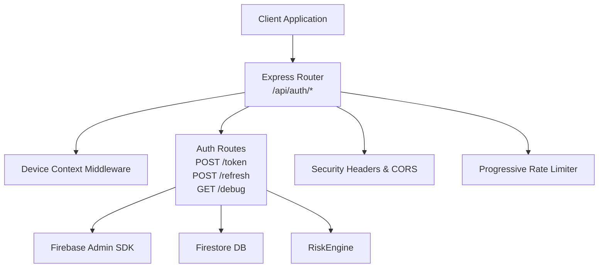
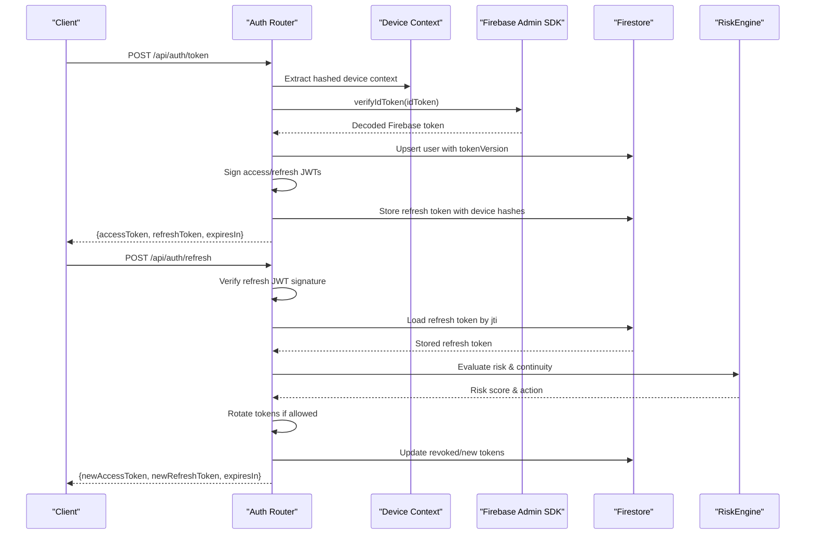
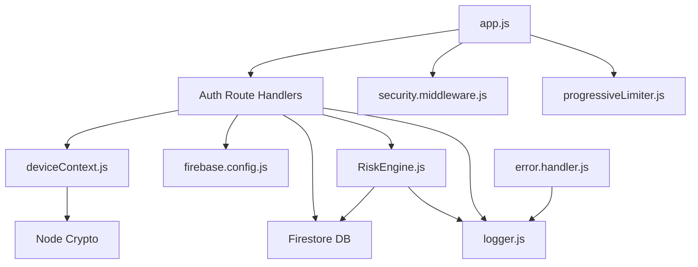

# Authentication Endpoints

<cite>
**Referenced Files in This Document**
- [auth.js](file://backend/src/routes/auth.js)
- [deviceContext.js](file://backend/src/middleware/deviceContext.js)
- [auth.middleware.js](file://backend/src/middleware/auth.js)
- [firebase.config.js](file://backend/src/config/firebase.js)
- [risk.engine.js](file://backend/src/services/RiskEngine.js)
- [app.js](file://backend/src/app.js)
- [security.middleware.js](file://backend/src/middleware/security.js)
- [progressive.limiter.js](file://backend/src/middleware/progressiveLimiter.js)
- [error.handler.js](file://backend/src/middleware/errorHandler.js)
- [logger.js](file://backend/src/utils/logger.js)
- [.env.example](file://backend/.env.example)
</cite>

## Table of Contents
1. [Introduction](#introduction)
2. [Project Structure](#project-structure)
3. [Core Components](#core-components)
4. [Architecture Overview](#architecture-overview)
5. [Detailed Component Analysis](#detailed-component-analysis)
6. [Dependency Analysis](#dependency-analysis)
7. [Performance Considerations](#performance-considerations)
8. [Troubleshooting Guide](#troubleshooting-guide)
9. [Conclusion](#conclusion)
10. [Appendices](#appendices)

## Introduction
This document provides comprehensive API documentation for the authentication endpoints exposed by the backend. It covers:
- Token exchange endpoint for converting Firebase ID tokens into custom access/refresh token pairs
- Refresh token endpoint for obtaining new access tokens with robust security validations
- Debug endpoint for verifying Firebase configuration
It includes request/response schemas, device context requirements, security validations, error codes, authentication requirements, and integration guidelines with curl examples.

## Project Structure
The authentication endpoints are implemented under the Express routes module and integrated with middleware for device context, security, and rate limiting. The Firebase Admin SDK is used for token verification and Firestore for persistence.

**Diagram sources**
- [auth.js](file://backend/src/routes/auth.js#L1-L301)
- [deviceContext.js](file://backend/src/middleware/deviceContext.js#L1-L24)
- [firebase.config.js](file://backend/src/config/firebase.js#L1-L46)
- [risk.engine.js](file://backend/src/services/RiskEngine.js#L1-L170)
- [security.middleware.js](file://backend/src/middleware/security.js#L1-L75)
- [progressive.limiter.js](file://backend/src/middleware/progressiveLimiter.js#L1-L61)

**Section sources**
- [auth.js](file://backend/src/routes/auth.js#L1-L301)
- [app.js](file://backend/src/app.js#L1-L78)

## Core Components
- Token Exchange Endpoint: Exchanges a Firebase ID token for a short-lived access token and a long-lived refresh token with versioning support.
- Refresh Token Endpoint: Rotates tokens while enforcing replay attack prevention, device continuity, and session risk evaluation.
- Debug Endpoint: Returns Firebase configuration metadata for verification.
- Device Context Middleware: Hashes sensitive identifiers to enforce privacy and security.
- RiskEngine: Evaluates risk scores and enforces hard burns and soft locks based on behavioral signals.
- Firebase Admin SDK: Verifies Firebase ID tokens and manages Firestore collections.

**Section sources**
- [auth.js](file://backend/src/routes/auth.js#L15-L298)
- [deviceContext.js](file://backend/src/middleware/deviceContext.js#L1-L24)
- [risk.engine.js](file://backend/src/services/RiskEngine.js#L1-L170)
- [firebase.config.js](file://backend/src/config/firebase.js#L1-L46)

## Architecture Overview
The authentication flow integrates Firebase verification, custom JWT issuance, and Firestore-backed refresh token storage with risk-aware rotation.

**Diagram sources**
- [auth.js](file://backend/src/routes/auth.js#L20-L280)
- [deviceContext.js](file://backend/src/middleware/deviceContext.js#L7-L23)
- [risk.engine.js](file://backend/src/services/RiskEngine.js#L11-L130)
- [firebase.config.js](file://backend/src/config/firebase.js#L28-L44)

## Detailed Component Analysis

### Token Exchange Endpoint: POST /api/auth/token
- Purpose: Convert a Firebase ID token into a custom access/refresh token pair with versioning.
- Authentication requirement: Public endpoint; requires a valid Firebase ID token in the request body.
- Device context: Enforced via device context middleware; stores hashed device identifiers with the refresh token.
- Security validations:
  - Verifies JWT secrets are configured.
  - Verifies the Firebase ID token and decodes the user identity.
  - Initializes or heals user document with display name and username.
  - Issues access token (15 minutes) and refresh token (30 days) with a unique jti.
  - Stores refresh token metadata (device hashes, risk score, expiry) in Firestore.
- Response schema:
  - success: Boolean indicating success.
  - data.accessToken: Short-lived JWT access token.
  - data.refreshToken: Long-lived JWT refresh token.
  - data.expiresIn: Access token lifetime in seconds.
- Error codes:
  - 400: Missing Firebase ID token or device context.
  - 401: Invalid/expired Firebase token; includes debug details.
  - 500: Internal server configuration error if secrets are missing.
- Integration guidelines:
  - Send the Firebase ID token in the request body.
  - Store the refresh token securely (e.g., secure HTTP-only cookie).
  - Use the access token for protected API calls; refresh when expired.
- curl example:
  - curl -X POST https://your-api.com/api/auth/token \
    -H "Content-Type: application/json" \
    -d '{"idToken":"<FIREBASE_ID_TOKEN>"}'

**Section sources**
- [auth.js](file://backend/src/routes/auth.js#L15-L159)
- [deviceContext.js](file://backend/src/middleware/deviceContext.js#L7-L23)
- [firebase.config.js](file://backend/src/config/firebase.js#L28-L44)

### Refresh Token Endpoint: POST /api/auth/refresh
- Purpose: Obtain a new access/refresh token pair using a valid refresh token.
- Authentication requirement: Public endpoint; requires a refresh token in the request body.
- Device context: Required; the refresh route mandates a device ID header to compute device hashes.
- Security validations:
  - Verifies refresh token signature and payload.
  - Anti-replay: Ensures the jti exists and is not revoked.
  - Global kill switch: Compares token version with the user’s current tokenVersion.
  - Strict device continuity: Enforces device ID hash consistency.
  - Session continuity checks: Detects concurrent refresh attempts and excessive rotation.
  - Risk scoring: Accumulates risk from device/user agent/IP changes and evaluates thresholds.
  - Token rotation: Revokes the old refresh token and issues a new pair with a new jti.
- Response schema:
  - success: Boolean indicating success.
  - data.accessToken: New short-lived JWT access token.
  - data.refreshToken: New long-lived JWT refresh token.
  - data.expiresIn: Access token lifetime in seconds.
- Error codes:
  - 400: Missing refresh token or device ID.
  - 401: Invalid/expired refresh token, replay attack, device mismatch, or security version mismatch.
  - 429/503: Rate-limited due to excessive requests or global pressure.
- Integration guidelines:
  - Always store the refresh token securely and rotate it on successful refresh.
  - On encountering a 401 with “session compromised,” prompt the user to re-authenticate.
  - Respect the expiresIn field to schedule automatic refresh.
- curl example:
  - curl -X POST https://your-api.com/api/auth/refresh \
    -H "Content-Type: application/json" \
    -H "x-device-id: <DEVICE_ID>" \
    -d '{"refreshToken":"<REFRESH_TOKEN>"}'

**Section sources**
- [auth.js](file://backend/src/routes/auth.js#L161-L280)
- [deviceContext.js](file://backend/src/middleware/deviceContext.js#L12-L14)
- [risk.engine.js](file://backend/src/services/RiskEngine.js#L11-L130)

### Debug Endpoint: GET /api/auth/debug
- Purpose: Verify Firebase configuration and environment variables.
- Authentication requirement: Public endpoint.
- Response schema:
  - success: Boolean indicating success.
  - data.projectId: Firebase project ID from environment.
  - data.nodeEnv: Current Node environment.
  - data.hasPrivateKey: Boolean indicating presence of private key.
  - data.clientEmail: Firebase client email from environment.
  - data.timestamp: Server timestamp.
- curl example:
  - curl https://your-api.com/api/auth/debug

**Section sources**
- [auth.js](file://backend/src/routes/auth.js#L282-L298)
- [firebase.config.js](file://backend/src/config/firebase.js#L7-L17)

## Dependency Analysis
The authentication endpoints depend on middleware and services for device hashing, risk evaluation, and Firebase integration.

**Diagram sources**
- [auth.js](file://backend/src/routes/auth.js#L1-L301)
- [deviceContext.js](file://backend/src/middleware/deviceContext.js#L1-L24)
- [firebase.config.js](file://backend/src/config/firebase.js#L1-L46)
- [risk.engine.js](file://backend/src/services/RiskEngine.js#L1-L170)
- [app.js](file://backend/src/app.js#L1-L78)
- [security.middleware.js](file://backend/src/middleware/security.js#L1-L75)
- [progressive.limiter.js](file://backend/src/middleware/progressiveLimiter.js#L1-L61)
- [error.handler.js](file://backend/src/middleware/errorHandler.js#L1-L35)
- [logger.js](file://backend/src/utils/logger.js#L1-L29)

**Section sources**
- [auth.js](file://backend/src/routes/auth.js#L1-L301)
- [app.js](file://backend/src/app.js#L35-L39)

## Performance Considerations
- Access tokens are short-lived (15 minutes) to minimize exposure.
- Refresh tokens are long-lived (30 days) with rotation to reduce replay window.
- RiskEngine applies decay to risk scores over time to prevent permanent penalties.
- Progressive rate limiter protects endpoints from abuse while allowing legitimate usage.
- Device context hashing avoids storing raw identifiers, reducing storage and privacy risks.

[No sources needed since this section provides general guidance]

## Troubleshooting Guide
Common issues and resolutions:
- Missing JWT secrets:
  - Symptom: 500 error during token exchange.
  - Resolution: Ensure JWT_ACCESS_SECRET and JWT_REFRESH_SECRET are set in environment.
- Invalid or expired Firebase token:
  - Symptom: 401 error with debug details.
  - Resolution: Re-authenticate the user to obtain a fresh Firebase ID token.
- Replay attack or revoked refresh token:
  - Symptom: 401 with “session compromised.”
  - Resolution: Force user re-login; RiskEngine may increment tokenVersion to invalidate sessions.
- Device mismatch on refresh:
  - Symptom: 401 with “security alert.”
  - Resolution: Ensure the x-device-id header matches the original device context.
- Rate limiting:
  - Symptom: 429 or 503 responses.
  - Resolution: Back off and retry; reduce request frequency.

**Section sources**
- [auth.js](file://backend/src/routes/auth.js#L28-L31)
- [auth.js](file://backend/src/routes/auth.js#L47-L54)
- [auth.js](file://backend/src/routes/auth.js#L183-L190)
- [auth.js](file://backend/src/routes/auth.js#L203-L207)
- [progressive.limiter.js](file://backend/src/middleware/progressiveLimiter.js#L32-L56)
- [risk.engine.js](file://backend/src/services/RiskEngine.js#L136-L168)

## Conclusion
The authentication endpoints implement a robust, risk-aware token lifecycle with strong replay protection, device continuity enforcement, and session-wide security controls. Integrators should follow the provided schemas, headers, and error handling guidance to ensure secure and reliable authentication.

[No sources needed since this section summarizes without analyzing specific files]

## Appendices

### Environment Variables
Required for Firebase Admin initialization and JWT secrets:
- FIREBASE_PROJECT_ID
- FIREBASE_PRIVATE_KEY
- FIREBASE_CLIENT_EMAIL
- JWT_ACCESS_SECRET
- JWT_REFRESH_SECRET

**Section sources**
- [.env.example](file://backend/.env.example#L9-L13)
- [firebase.config.js](file://backend/src/config/firebase.js#L7-L17)
- [auth.js](file://backend/src/routes/auth.js#L12-L13)

### Request/Response Schemas

- POST /api/auth/token
  - Request body:
    - idToken: string (required)
  - Response body:
    - success: boolean
    - data.accessToken: string
    - data.refreshToken: string
    - data.expiresIn: integer

- POST /api/auth/refresh
  - Request headers:
    - x-device-id: string (required)
  - Request body:
    - refreshToken: string (required)
  - Response body:
    - success: boolean
    - data.accessToken: string
    - data.refreshToken: string
    - data.expiresIn: integer

- GET /api/auth/debug
  - Response body:
    - success: boolean
    - data.projectId: string
    - data.nodeEnv: string
    - data.hasPrivateKey: boolean
    - data.clientEmail: string
    - data.timestamp: string

**Section sources**
- [auth.js](file://backend/src/routes/auth.js#L20-L154)
- [auth.js](file://backend/src/routes/auth.js#L166-L275)
- [auth.js](file://backend/src/routes/auth.js#L287-L297)

### Security Validation Summary
- Firebase token verification with revocation check.
- Access token version synchronization with user document.
- Strict device ID hash enforcement on refresh.
- Session continuity checks for concurrent refresh and rotation storms.
- Risk scoring with hard burn and soft lock thresholds.
- Full session burn capability to revoke all tokens and increment tokenVersion.

**Section sources**
- [auth.js](file://backend/src/routes/auth.js#L39-L55)
- [auth.js](file://backend/src/routes/auth.js#L194-L207)
- [risk.engine.js](file://backend/src/services/RiskEngine.js#L11-L130)
- [risk.engine.js](file://backend/src/services/RiskEngine.js#L136-L168)