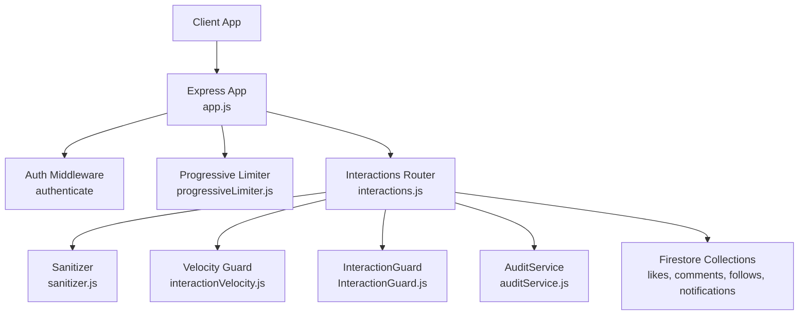
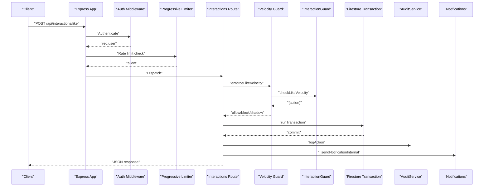
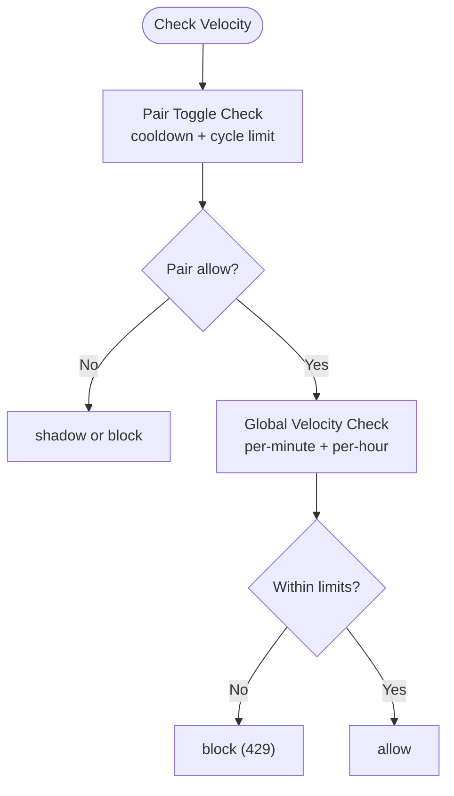
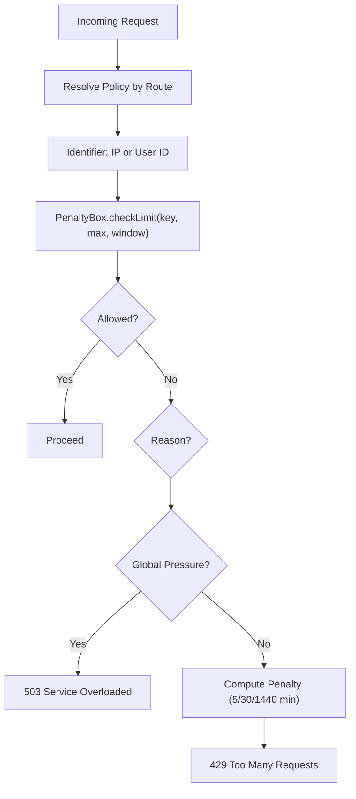
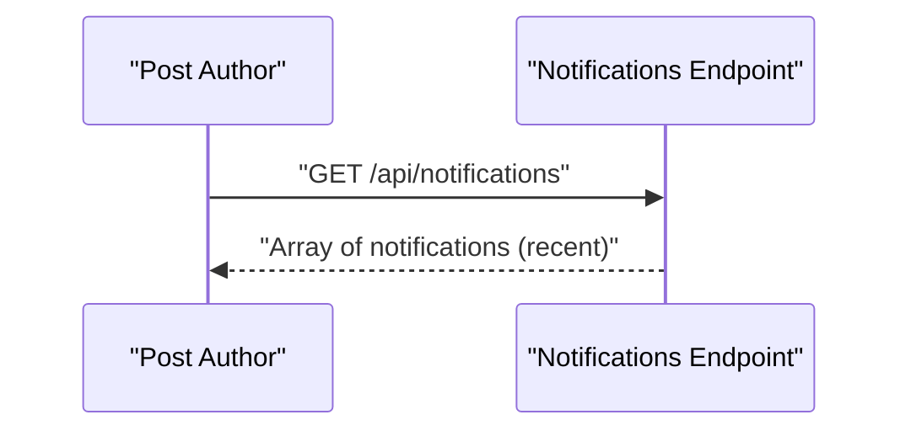
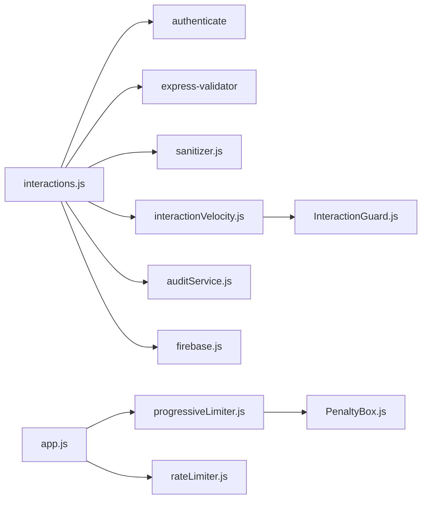

# Interaction Endpoints

<cite>
**Referenced Files in This Document**
- [interactions.js](file://backend/src/routes/interactions.js)
- [interactionVelocity.js](file://backend/src/middleware/interactionVelocity.js)
- [InteractionGuard.js](file://backend/src/services/InteractionGuard.js)
- [progressiveLimiter.js](file://backend/src/middleware/progressiveLimiter.js)
- [PenaltyBox.js](file://backend/src/services/PenaltyBox.js)
- [rateLimiter.js](file://backend/src/middleware/rateLimiter.js)
- [app.js](file://backend/src/app.js)
- [sanitizer.js](file://backend/src/utils/sanitizer.js)
- [userDisplayName.js](file://backend/src/utils/userDisplayName.js)
- [auditService.js](file://backend/src/services/auditService.js)
- [notifications.js](file://backend/src/routes/notifications.js)
- [firebase.js](file://backend/src/config/firebase.js)
- [backend_service.dart](file://testpro-main/lib/services/backend_service.dart)
</cite>

## Table of Contents
1. [Introduction](#introduction)
2. [Project Structure](#project-structure)
3. [Core Components](#core-components)
4. [Architecture Overview](#architecture-overview)
5. [Detailed Component Analysis](#detailed-component-analysis)
6. [Dependency Analysis](#dependency-analysis)
7. [Performance Considerations](#performance-considerations)
8. [Troubleshooting Guide](#troubleshooting-guide)
9. [Conclusion](#conclusion)
10. [Appendices](#appendices)

## Introduction
This document describes the interaction endpoints that power user actions such as liking posts, commenting, following users, and joining events. It covers:
- Endpoints for user relationship management and social interactions
- Interaction velocity monitoring and abuse prevention
- Real-time interaction updates via notifications
- Request/response schemas, validation rules, and rate limiting policies
- Curl examples, integration patterns, and moderation guidelines

## Project Structure
The interaction endpoints are implemented under the Express router module and integrated with middleware for authentication, rate limiting, sanitization, and velocity checks. They write to Firestore collections for likes, comments, follows, and notifications.

**Diagram sources**
- [app.js](file://backend/src/app.js#L44-L60)
- [interactions.js](file://backend/src/routes/interactions.js#L1-L522)
- [interactionVelocity.js](file://backend/src/middleware/interactionVelocity.js#L1-L62)
- [InteractionGuard.js](file://backend/src/services/InteractionGuard.js#L1-L124)
- [progressiveLimiter.js](file://backend/src/middleware/progressiveLimiter.js#L1-L61)
- [sanitizer.js](file://backend/src/utils/sanitizer.js#L1-L63)
- [auditService.js](file://backend/src/services/auditService.js#L1-L33)

**Section sources**
- [app.js](file://backend/src/app.js#L44-L60)
- [interactions.js](file://backend/src/routes/interactions.js#L1-L522)

## Core Components
- Interactions Router: Implements endpoints for likes, comments, follows, event join/leave, and batch-like checks.
- Interaction Velocity Middleware: Enforces per-action cooldowns and burst caps to prevent graph abuse.
- InteractionGuard: In-memory guard for pair toggles and global velocity thresholds.
- Progressive Limiter: Per-route, per-user/IP rate limiting with progressive penalties.
- Sanitization: Strict field picking and XSS sanitization for request bodies.
- AuditService: Logs sensitive actions for compliance and forensics.
- Notifications: Real-time activity notifications delivered via Firestore.

**Section sources**
- [interactions.js](file://backend/src/routes/interactions.js#L24-L522)
- [interactionVelocity.js](file://backend/src/middleware/interactionVelocity.js#L1-L62)
- [InteractionGuard.js](file://backend/src/services/InteractionGuard.js#L1-L124)
- [progressiveLimiter.js](file://backend/src/middleware/progressiveLimiter.js#L1-L61)
- [sanitizer.js](file://backend/src/utils/sanitizer.js#L1-L63)
- [auditService.js](file://backend/src/services/auditService.js#L1-L33)

## Architecture Overview
The interaction flow integrates authentication, sanitization, rate limiting, velocity checks, and Firestore transactions. On successful actions, audit logs are written asynchronously and notifications are emitted.

**Diagram sources**
- [interactions.js](file://backend/src/routes/interactions.js#L28-L103)
- [interactionVelocity.js](file://backend/src/middleware/interactionVelocity.js#L36-L61)
- [InteractionGuard.js](file://backend/src/services/InteractionGuard.js#L115-L122)
- [auditService.js](file://backend/src/services/auditService.js#L9-L29)
- [notifications.js](file://backend/src/routes/notifications.js#L11-L29)

## Detailed Component Analysis

### Endpoints Reference

- POST /api/interactions/like
  - Purpose: Like or unlike a post atomically.
  - Validation: postId required.
  - Rate control: enforceLikeVelocity.
  - Body: { postId: string }.
  - Responses:
    - 200: { success: true, data: { status: "active" }, error: null }
    - 400: Validation errors.
    - 429: Shadow suppression or block with message.
    - 500: Error.
  - Notes: Uses Firestore transaction to set/unset like and increment/decrement likeCount. Emits a notification to the post author.

- POST /api/interactions/comment
  - Purpose: Add a top-level comment to a post.
  - Validation: postId, text required.
  - Body: { postId: string, text: string }.
  - Responses: 200 with { success: true, data: { commentId: string } }, 500 on error.
  - Notes: Transactionally creates comment and increments commentCount; notifies post author.

- POST /api/interactions/follow
  - Purpose: Follow or unfollow a user.
  - Validation: targetUserId required; self-follow blocked.
  - Rate control: enforceFollowVelocity.
  - Body: { targetUserId: string }.
  - Responses: 200 with { success: true, data: { status: "active" }, error: null }, 400/429/500.
  - Notes: Transactionally toggles follow document and updates counters; notifies target user.

- POST /api/interactions/event/join
  - Purpose: Join or leave an event (mirrors attendance and group membership).
  - Validation: eventId required.
  - Body: { eventId: string }.
  - Responses: 200 with { success: true, data: { status: "active" }, error: null }, 500.
  - Notes: Enforces event active/expiry; mirrors attendance and group membership docs.

- GET /api/interactions/comments/:postId
  - Purpose: Fetch comments for a post ordered by recency.
  - Responses: 200 with array of comments; 500 on error.

- POST /api/interactions/likes/batch
  - Purpose: Check which posts among a list the current user liked (optimized for feeds).
  - Body: { postIds: string[] }.
  - Responses: 200 with object mapping postIds to booleans; handles empty arrays gracefully.

- GET /api/interactions/likes/check
  - Purpose: Check if current user liked a post and get canonical likeCount.
  - Query: { postId: string }.
  - Responses: 200 with { liked: boolean, likeCount: number }.

- GET /api/interactions/follows/check
  - Purpose: Check if current user follows a target user.
  - Query: { targetUserId: string }.
  - Responses: 200 with { followed: boolean }.

- GET /api/interactions/events/check
  - Purpose: Check if current user is attending an event.
  - Query: { eventId: string }.
  - Responses: 200 with { attending: boolean }.

- GET /api/interactions/events/my-events
  - Purpose: Return event IDs the current user has joined.
  - Responses: 200 with { eventIds: string[] }.

**Section sources**
- [interactions.js](file://backend/src/routes/interactions.js#L24-L522)

### Interaction Velocity Monitoring and Abuse Prevention
- Pair Toggle Controls:
  - Follow: 1 toggle per 3 seconds; max 3 cycles per 60 seconds.
  - Like: 1 toggle per 3 seconds; max 3 cycles per 60 seconds.
- Global Velocity Caps:
  - Follow: 5 per minute, 30 per hour.
  - Like: 20 per minute, 60 per hour.
- Actions:
  - allow: Proceed.
  - shadow: Silently suppress (pretend success) to confuse bots.
  - block: Return 429 Too Many Requests.

**Diagram sources**
- [InteractionGuard.js](file://backend/src/services/InteractionGuard.js#L47-L80)
- [InteractionGuard.js](file://backend/src/services/InteractionGuard.js#L85-L98)
- [InteractionGuard.js](file://backend/src/services/InteractionGuard.js#L103-L110)
- [InteractionGuard.js](file://backend/src/services/InteractionGuard.js#L115-L122)

**Section sources**
- [interactionVelocity.js](file://backend/src/middleware/interactionVelocity.js#L1-L62)
- [InteractionGuard.js](file://backend/src/services/InteractionGuard.js#L1-L124)

### Rate Limiting Policies
- Progressive Limiter (per-route, per-IP or per-user):
  - Policies include auth, otp, feed, create_post, like, follow, upload, api, health.
  - Behavior: in-memory counters with progressive penalties (5 min, 30 min, 24 h) and global pressure guard.
- General API Limiter: 1000 per 15 minutes per IP.
- Auth Limiter: 5 per 15 minutes per IP (skips successful).
- Upload Limiter: 20 per 15 minutes per IP.
- Speed Limiter: gradually slow repeated requests after a baseline.

**Diagram sources**
- [progressiveLimiter.js](file://backend/src/middleware/progressiveLimiter.js#L1-L61)
- [PenaltyBox.js](file://backend/src/services/PenaltyBox.js#L1-L108)
- [rateLimiter.js](file://backend/src/middleware/rateLimiter.js#L1-L76)

**Section sources**
- [progressiveLimiter.js](file://backend/src/middleware/progressiveLimiter.js#L1-L61)
- [PenaltyBox.js](file://backend/src/services/PenaltyBox.js#L1-L108)
- [rateLimiter.js](file://backend/src/middleware/rateLimiter.js#L1-L76)

### Request/Response Schemas and Validation Rules
- POST /api/interactions/like
  - Required: postId (string).
  - Optional: none.
  - Validation: express-validator; sanitizer applied.
- POST /api/interactions/comment
  - Required: postId (string), text (string).
  - Validation: express-validator; sanitizer applied.
- POST /api/interactions/follow
  - Required: targetUserId (string).
  - Validation: express-validator; self-follow blocked; sanitizer applied.
- POST /api/interactions/event/join
  - Required: eventId (string).
  - Validation: express-validator; sanitizer applied.
- GET /api/interactions/comments/:postId
  - Path param: postId (string).
- POST /api/interactions/likes/batch
  - Required: postIds (array of strings).
  - Behavior: returns mapping for all requested IDs; defaults missing to false.
- GET /api/interactions/likes/check
  - Query: postId (string).
- GET /api/interactions/follows/check
  - Query: targetUserId (string).
- GET /api/interactions/events/check
  - Query: eventId (string).
- GET /api/interactions/events/my-events
  - No query/body.

**Section sources**
- [interactions.js](file://backend/src/routes/interactions.js#L28-L522)
- [sanitizer.js](file://backend/src/utils/sanitizer.js#L60-L63)

### Real-Time Interaction Updates
- Notifications:
  - On like/comment/follow, a notification document is written to Firestore with fields such as toUserId, fromUserId, type, timestamp, and optional postId/postThumbnail/commentText.
  - Client polls notifications endpoint periodically for updates.
- Polling cadence:
  - Flutter client polls every 5 minutes for notifications.

**Diagram sources**
- [interactions.js](file://backend/src/routes/interactions.js#L325-L343)
- [notifications.js](file://backend/src/routes/notifications.js#L11-L29)

**Section sources**
- [interactions.js](file://backend/src/routes/interactions.js#L325-L343)
- [notifications.js](file://backend/src/routes/notifications.js#L1-L50)

### Audit Logging
- Logs sensitive actions (e.g., POST_LIKE_TOGGLE, POST_COMMENT_CREATED) with userId, action, metadata, IP, and User-Agent.
- Asynchronous write to avoid blocking the request path.

**Section sources**
- [auditService.js](file://backend/src/services/auditService.js#L1-L33)
- [interactions.js](file://backend/src/routes/interactions.js#L86-L91)
- [interactions.js](file://backend/src/routes/interactions.js#L155-L160)

## Dependency Analysis

**Diagram sources**
- [interactions.js](file://backend/src/routes/interactions.js#L1-L10)
- [interactionVelocity.js](file://backend/src/middleware/interactionVelocity.js#L1-L2)
- [InteractionGuard.js](file://backend/src/services/InteractionGuard.js#L1-L2)
- [progressiveLimiter.js](file://backend/src/middleware/progressiveLimiter.js#L1-L2)
- [PenaltyBox.js](file://backend/src/services/PenaltyBox.js#L1-L2)
- [rateLimiter.js](file://backend/src/middleware/rateLimiter.js#L1-L3)
- [firebase.js](file://backend/src/config/firebase.js#L1-L46)
- [app.js](file://backend/src/app.js#L44-L60)

**Section sources**
- [interactions.js](file://backend/src/routes/interactions.js#L1-L10)
- [app.js](file://backend/src/app.js#L44-L60)

## Performance Considerations
- Firestore Transactions: Ensures atomicity for like/comment/follow toggles and counters.
- Batch Likes: likes/batch splits postIds into chunks of 30 to satisfy Firestore in-query limits.
- Sanitization: Minimal overhead with strict XSS stripping and field picking.
- Rate Limiting: Progressive penalties reduce load spikes; global pressure guard protects during overload.
- Notifications: Non-blocking writes via asynchronous emission.

[No sources needed since this section provides general guidance]

## Troubleshooting Guide
- 429 Too Many Requests:
  - Cause: Velocity guard or progressive limiter exceeded.
  - Resolution: Back off; wait for cooldown; reduce request frequency.
- Shadow Suppression:
  - Cause: Rapid toggling within cooldown window.
  - Resolution: Space out actions; do not rapidly like/unlike or follow/unfollow.
- 400 Bad Request:
  - Cause: Missing or invalid fields (e.g., missing postId/targetUserId).
  - Resolution: Validate payload before sending.
- 500 Internal Server Error:
  - Cause: Firestore errors (e.g., post not found, transaction failures).
  - Resolution: Retry with exponential backoff; inspect logs.

**Section sources**
- [interactionVelocity.js](file://backend/src/middleware/interactionVelocity.js#L16-L31)
- [progressiveLimiter.js](file://backend/src/middleware/progressiveLimiter.js#L32-L56)
- [InteractionGuard.js](file://backend/src/services/InteractionGuard.js#L58-L76)

## Conclusion
The interaction endpoints provide robust, secure, and scalable social features with built-in abuse prevention and auditability. Integrators should adhere to validation rules, respect rate limits, and implement resilient retry logic to handle transient errors.

[No sources needed since this section summarizes without analyzing specific files]

## Appendices

### Curl Examples
- Like/Unlike a post:
  - curl -X POST "$BASE_URL/api/interactions/like" -H "Authorization: Bearer $TOKEN" -H "Content-Type: application/json" -d '{"postId":"<post-id>"}'
- Add a comment:
  - curl -X POST "$BASE_URL/api/interactions/comment" -H "Authorization: Bearer $TOKEN" -H "Content-Type: application/json" -d '{"postId":"<post-id>","text":"<comment>"}'
- Follow/Unfollow a user:
  - curl -X POST "$BASE_URL/api/interactions/follow" -H "Authorization: Bearer $TOKEN" -H "Content-Type: application/json" -d '{"targetUserId":"<user-id>"}'
- Join/Leave an event:
  - curl -X POST "$BASE_URL/api/interactions/event/join" -H "Authorization: Bearer $TOKEN" -H "Content-Type: application/json" -d '{"eventId":"<event-id>"}'
- Check like status and likeCount:
  - curl "$BASE_URL/api/interactions/likes/check?postId=<post-id>" -H "Authorization: Bearer $TOKEN"
- Check follow status:
  - curl "$BASE_URL/api/interactions/follows/check?targetUserId=<user-id>" -H "Authorization: Bearer $TOKEN"
- Check event attendance:
  - curl "$BASE_URL/api/interactions/events/check?eventId=<event-id>" -H "Authorization: Bearer $TOKEN"
- Get user’s joined events:
  - curl "$BASE_URL/api/interactions/events/my-events" -H "Authorization: Bearer $TOKEN"
- Get comments for a post:
  - curl "$BASE_URL/api/interactions/comments/<post-id>" -H "Authorization: Bearer $TOKEN"
- Batch likes check:
  - curl -X POST "$BASE_URL/api/interactions/likes/batch" -H "Authorization: Bearer $TOKEN" -H "Content-Type: application/json" -d '{"postIds":["<id1>","<id2>"]}'

### Integration Patterns
- Client libraries:
  - Flutter backend service demonstrates posting to follow and checking event attendance.
- Recommendations:
  - Use batch endpoints for feed rendering.
  - Poll notifications endpoint at intervals suitable for your UX (e.g., every 5 minutes).
  - Implement jitter/backoff for retries on 429/5xx.

**Section sources**
- [backend_service.dart](file://testpro-main/lib/services/backend_service.dart#L329-L349)
- [backend_service.dart](file://testpro-main/lib/services/backend_service.dart#L475-L494)

### Community Moderation Guidelines
- Abuse indicators:
  - Rapid toggling (shadow suppression) and global velocity breaches trigger protective actions.
- Mitigations:
  - Progressive penalties escalate to extended cooldowns.
  - Consider augmenting with device/user context hashing and behavioral session continuity checks (see RiskEngine for session continuity evaluation).
- Audit trail:
  - Use AuditService logs for incident investigation and compliance reporting.

**Section sources**
- [InteractionGuard.js](file://backend/src/services/InteractionGuard.js#L16-L21)
- [PenaltyBox.js](file://backend/src/services/PenaltyBox.js#L70-L87)
- [auditService.js](file://backend/src/services/auditService.js#L9-L29)