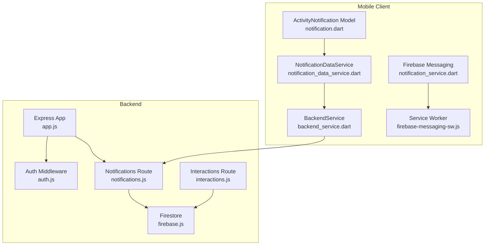
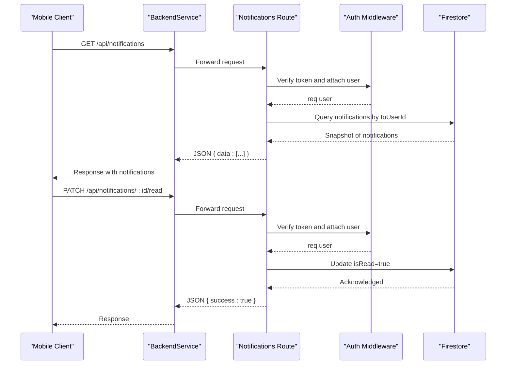
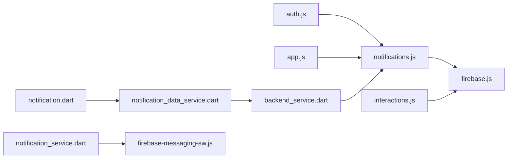

# Notification Endpoints

<cite>
**Referenced Files in This Document**
- [notifications.js](file://backend/src/routes/notifications.js)
- [app.js](file://backend/src/app.js)
- [auth.js](file://backend/src/middleware/auth.js)
- [firebase.js](file://backend/src/config/firebase.js)
- [interactions.js](file://backend/src/routes/interactions.js)
- [backend_service.dart](file://testpro-main/lib/services/backend_service.dart)
- [notification_data_service.dart](file://testpro-main/lib/services/notification_data_service.dart)
- [notification.dart](file://testpro-main/lib/models/notification.dart)
- [notification_service.dart](file://testpro-main/lib/services/notification_service.dart)
- [firebase-messaging-sw.js](file://testpro-main/web/firebase-messaging-sw.js)
- [index.js](file://testpro-main/functions/index.js)
</cite>

## Table of Contents
1. [Introduction](#introduction)
2. [Project Structure](#project-structure)
3. [Core Components](#core-components)
4. [Architecture Overview](#architecture-overview)
5. [Detailed Component Analysis](#detailed-component-analysis)
6. [Dependency Analysis](#dependency-analysis)
7. [Performance Considerations](#performance-considerations)
8. [Troubleshooting Guide](#troubleshooting-guide)
9. [Conclusion](#conclusion)
10. [Appendices](#appendices)

## Introduction
This document provides comprehensive API documentation for notification endpoints, covering retrieval, read status management, and notification history. It also details real-time notification delivery via Firebase Cloud Messaging (FCM), push notification integration for mobile clients, and background notification processing. The documentation includes request/response schemas, pagination support, filtering options, curl examples, integration guidelines, and best practices for notification delivery and user experience.

## Project Structure
The notification system spans backend Express routes, Firebase Firestore, and Flutter mobile clients:
- Backend routes expose GET and PATCH endpoints for notifications under /api/notifications.
- Authentication middleware ensures secure access using Firebase ID tokens or custom JWTs.
- Firestore stores notifications with fields such as toUserId, type, timestamps, and read status.
- Mobile clients poll for notifications and receive push notifications via FCM.

**Diagram sources**
- [app.js](file://backend/src/app.js#L44-L60)
- [auth.js](file://backend/src/middleware/auth.js#L20-L161)
- [notifications.js](file://backend/src/routes/notifications.js#L1-L50)
- [firebase.js](file://backend/src/config/firebase.js#L27-L44)
- [interactions.js](file://backend/src/routes/interactions.js#L72-L81)
- [backend_service.dart](file://testpro-main/lib/services/backend_service.dart#L430-L448)
- [notification_data_service.dart](file://testpro-main/lib/services/notification_data_service.dart#L7-L25)
- [notification.dart](file://testpro-main/lib/models/notification.dart#L35-L86)
- [notification_service.dart](file://testpro-main/lib/services/notification_service.dart#L17-L92)
- [firebase-messaging-sw.js](file://testpro-main/web/firebase-messaging-sw.js#L1-L24)

**Section sources**
- [app.js](file://backend/src/app.js#L44-L60)
- [notifications.js](file://backend/src/routes/notifications.js#L1-L50)
- [auth.js](file://backend/src/middleware/auth.js#L20-L161)
- [firebase.js](file://backend/src/config/firebase.js#L27-L44)
- [interactions.js](file://backend/src/routes/interactions.js#L72-L81)
- [backend_service.dart](file://testpro-main/lib/services/backend_service.dart#L430-L448)
- [notification_data_service.dart](file://testpro-main/lib/services/notification_data_service.dart#L7-L25)
- [notification.dart](file://testpro-main/lib/models/notification.dart#L35-L86)
- [notification_service.dart](file://testpro-main/lib/services/notification_service.dart#L17-L92)
- [firebase-messaging-sw.js](file://testpro-main/web/firebase-messaging-sw.js#L1-L24)

## Core Components
- Notifications route: Provides GET /api/notifications for retrieving a user's notifications and PATCH /api/notifications/:id/read for marking a notification as read.
- Authentication middleware: Validates Firebase ID tokens or custom JWTs and attaches user context to requests.
- Firestore configuration: Initializes Firebase Admin and Firestore client used by routes.
- Interaction triggers: Emits notifications when likes and comments occur, storing them in Firestore.
- Mobile client services: Polls notifications and displays push notifications via FCM.

**Section sources**
- [notifications.js](file://backend/src/routes/notifications.js#L11-L29)
- [notifications.js](file://backend/src/routes/notifications.js#L35-L48)
- [auth.js](file://backend/src/middleware/auth.js#L20-L161)
- [firebase.js](file://backend/src/config/firebase.js#L27-L44)
- [interactions.js](file://backend/src/routes/interactions.js#L72-L81)
- [backend_service.dart](file://testpro-main/lib/services/backend_service.dart#L430-L448)
- [notification_data_service.dart](file://testpro-main/lib/services/notification_data_service.dart#L7-L25)
- [notification_service.dart](file://testpro-main/lib/services/notification_service.dart#L17-L92)

## Architecture Overview
The notification architecture integrates:
- Backend routes secured by authentication middleware.
- Firestore collections for notifications and interactions.
- Mobile client polling and push notification handling via FCM.

**Diagram sources**
- [backend_service.dart](file://testpro-main/lib/services/backend_service.dart#L430-L448)
- [notifications.js](file://backend/src/routes/notifications.js#L11-L29)
- [notifications.js](file://backend/src/routes/notifications.js#L35-L48)
- [auth.js](file://backend/src/middleware/auth.js#L20-L161)
- [firebase.js](file://backend/src/config/firebase.js#L27-L44)

## Detailed Component Analysis

### Notification Retrieval Endpoint
- Endpoint: GET /api/notifications
- Authentication: Required (Bearer token)
- Behavior:
  - Queries Firestore collection "notifications".
  - Filters by toUserId equal to the authenticated user ID.
  - Orders by timestamp descending.
  - Limits results to 50 items.
  - Converts Firestore timestamps to ISO strings.
- Response schema:
  - data: array of notification objects
    - id: string
    - fromUserId: string
    - fromUserName: string
    - fromUserProfileImage: string | null
    - toUserId: string
    - type: enum string ("like", "comment", "follow", "mention")
    - postId: string | null
    - postThumbnail: string | null
    - commentText: string | null
    - timestamp: ISO datetime string
    - isRead: boolean

Pagination and Filtering:
- Pagination: Implemented via limit(50).
- Filtering: Filter by toUserId supported; additional filters can be added by extending the route.

curl example:
- curl -X GET https://your-domain/api/notifications -H "Authorization: Bearer YOUR_TOKEN"

**Section sources**
- [notifications.js](file://backend/src/routes/notifications.js#L11-L29)
- [notification.dart](file://testpro-main/lib/models/notification.dart#L35-L86)
- [backend_service.dart](file://testpro-main/lib/services/backend_service.dart#L430-L438)

### Mark Notification as Read
- Endpoint: PATCH /api/notifications/:id/read
- Authentication: Required (Bearer token)
- Behavior:
  - Retrieves the notification document by ID.
  - Validates document existence.
  - Validates ownership (toUserId equals req.user.uid).
  - Updates isRead to true.
- Response:
  - On success: JSON { success: true }
  - On failure: JSON { error: "..." } with appropriate status (404 or 403)

curl example:
- curl -X PATCH https://your-domain/api/notifications/NODE_ID/read -H "Authorization: Bearer YOUR_TOKEN"

**Section sources**
- [notifications.js](file://backend/src/routes/notifications.js#L35-L48)
- [backend_service.dart](file://testpro-main/lib/services/backend_service.dart#L440-L448)

### Real-Time Delivery and Push Notifications
- Mobile polling: The Flutter client polls notifications every 5 minutes and converts JSON to ActivityNotification objects.
- Push notifications:
  - FCM initialization requests permission and retrieves the FCM token.
  - The token is saved to the backend profile endpoint.
  - Foreground messages trigger local notifications.
  - Background message handler is registered for processing messages when the app is not in the foreground.
  - Web service worker handles background FCM messages and shows browser notifications.

Integration guidelines:
- Initialize FCM and request permissions on app startup.
- Save the FCM token to the backend profile endpoint.
- Register background message handlers for both mobile and web.
- Display local notifications for foreground messages.

**Section sources**
- [notification_data_service.dart](file://testpro-main/lib/services/notification_data_service.dart#L7-L25)
- [notification_service.dart](file://testpro-main/lib/services/notification_service.dart#L17-L92)
- [firebase-messaging-sw.js](file://testpro-main/web/firebase-messaging-sw.js#L1-L24)
- [backend_service.dart](file://testpro-main/lib/services/backend_service.dart#L296-L305)

### Background Notification Processing
- Firestore triggers in Cloud Functions handle counters and other derived data; while not directly emitting notifications, they demonstrate the pattern for server-side processing.
- Notifications are created server-side in interaction routes and stored in Firestore for retrieval by clients.

**Section sources**
- [index.js](file://testpro-main/functions/index.js#L1-L112)
- [interactions.js](file://backend/src/routes/interactions.js#L72-L81)

### Notification History
- The retrieval endpoint returns up to 50 most recent notifications ordered by timestamp descending, effectively serving as a notification history view.
- Clients can poll periodically to keep the history updated.

**Section sources**
- [notifications.js](file://backend/src/routes/notifications.js#L11-L29)
- [notification_data_service.dart](file://testpro-main/lib/services/notification_data_service.dart#L7-L25)

### Notification Types and Fields
- NotificationType enum: like, comment, follow, mention
- Fields per notification object:
  - id, fromUserId, fromUserName, fromUserProfileImage, toUserId, type, postId, postThumbnail, commentText, timestamp, isRead

**Section sources**
- [notification.dart](file://testpro-main/lib/models/notification.dart#L1-L88)

## Dependency Analysis

**Diagram sources**
- [app.js](file://backend/src/app.js#L44-L60)
- [auth.js](file://backend/src/middleware/auth.js#L20-L161)
- [notifications.js](file://backend/src/routes/notifications.js#L1-L50)
- [firebase.js](file://backend/src/config/firebase.js#L27-L44)
- [interactions.js](file://backend/src/routes/interactions.js#L72-L81)
- [backend_service.dart](file://testpro-main/lib/services/backend_service.dart#L430-L448)
- [notification_data_service.dart](file://testpro-main/lib/services/notification_data_service.dart#L7-L25)
- [notification.dart](file://testpro-main/lib/models/notification.dart#L35-L86)
- [notification_service.dart](file://testpro-main/lib/services/notification_service.dart#L17-L92)
- [firebase-messaging-sw.js](file://testpro-main/web/firebase-messaging-sw.js#L1-L24)

**Section sources**
- [app.js](file://backend/src/app.js#L44-L60)
- [auth.js](file://backend/src/middleware/auth.js#L20-L161)
- [notifications.js](file://backend/src/routes/notifications.js#L1-L50)
- [firebase.js](file://backend/src/config/firebase.js#L27-L44)
- [interactions.js](file://backend/src/routes/interactions.js#L72-L81)
- [backend_service.dart](file://testpro-main/lib/services/backend_service.dart#L430-L448)
- [notification_data_service.dart](file://testpro-main/lib/services/notification_data_service.dart#L7-L25)
- [notification.dart](file://testpro-main/lib/models/notification.dart#L35-L86)
- [notification_service.dart](file://testpro-main/lib/services/notification_service.dart#L17-L92)
- [firebase-messaging-sw.js](file://testpro-main/web/firebase-messaging-sw.js#L1-L24)

## Performance Considerations
- Polling cadence: The mobile client polls every 5 minutes to avoid request storms while keeping notifications reasonably fresh.
- Firestore queries: The retrieval endpoint limits results to 50 and orders by timestamp, minimizing load.
- Timestamp handling: Converting Firestore timestamps to ISO strings ensures consistent serialization.
- Token lifecycle: FCM tokens are refreshed and saved to the backend to maintain reliable delivery.

Best practices:
- Keep polling intervals balanced between freshness and performance.
- Use Firestore indexes on toUserId and timestamp for optimal query performance.
- Implement efficient local caching of notifications in the client.

**Section sources**
- [notification_data_service.dart](file://testpro-main/lib/services/notification_data_service.dart#L7-L12)
- [notifications.js](file://backend/src/routes/notifications.js#L11-L29)
- [notification_service.dart](file://testpro-main/lib/services/notification_service.dart#L50-L56)

## Troubleshooting Guide
Common issues and resolutions:
- Unauthorized access: Ensure Authorization header contains a valid Bearer token. The auth middleware validates tokens and checks account status.
- Notification not found: The read endpoint returns 404 if the notification ID does not exist.
- Wrong owner: The read endpoint returns 403 if the notification belongs to another user.
- FCM token sync failures: The service attempts to save the token on initialization and on refresh; failures are logged and retried.

**Section sources**
- [auth.js](file://backend/src/middleware/auth.js#L133-L139)
- [notifications.js](file://backend/src/routes/notifications.js#L40-L41)
- [notification_service.dart](file://testpro-main/lib/services/notification_service.dart#L76-L84)

## Conclusion
The notification system provides a straightforward API for retrieving and managing notifications, with robust authentication and Firestore-backed persistence. Mobile clients benefit from both polling and push notifications via FCM, ensuring timely delivery while maintaining performance. Extending filtering and pagination capabilities is straightforward, and integrating additional notification types follows the established patterns.

## Appendices

### API Reference Summary
- GET /api/notifications
  - Query parameters: None (returns up to 50 items)
  - Response: { data: [ { id, fromUserId, fromUserName, fromUserProfileImage, toUserId, type, postId, postThumbnail, commentText, timestamp, isRead } ] }
- PATCH /api/notifications/:id/read
  - Path parameter: id
  - Response: { success: true } on success

### Request/Response Schemas
- Notification object fields:
  - id: string
  - fromUserId: string
  - fromUserName: string
  - fromUserProfileImage: string | null
  - toUserId: string
  - type: enum string ("like", "comment", "follow", "mention")
  - postId: string | null
  - postThumbnail: string | null
  - commentText: string | null
  - timestamp: ISO datetime string
  - isRead: boolean

**Section sources**
- [notification.dart](file://testpro-main/lib/models/notification.dart#L35-L86)
- [notifications.js](file://backend/src/routes/notifications.js#L11-L29)
- [notifications.js](file://backend/src/routes/notifications.js#L35-L48)