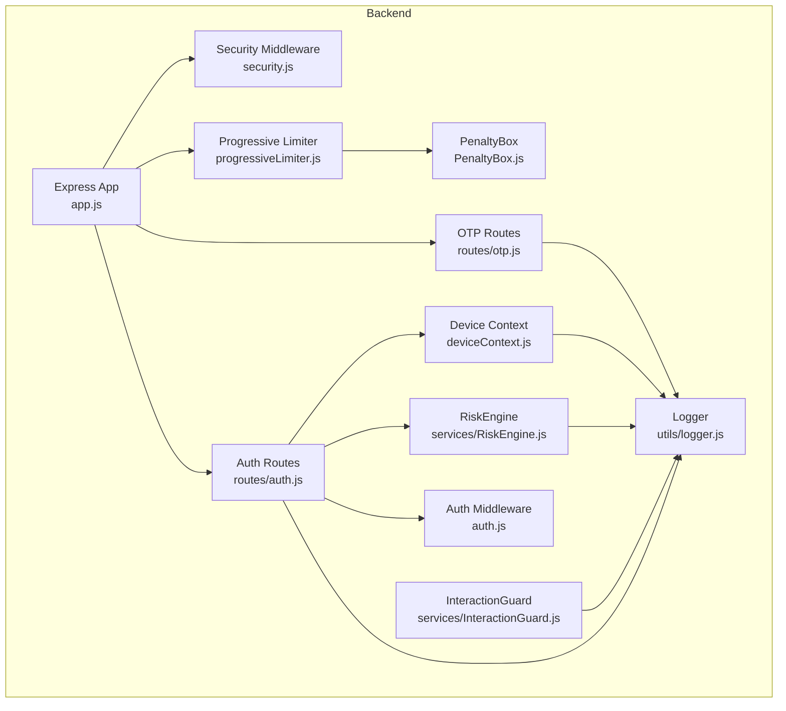
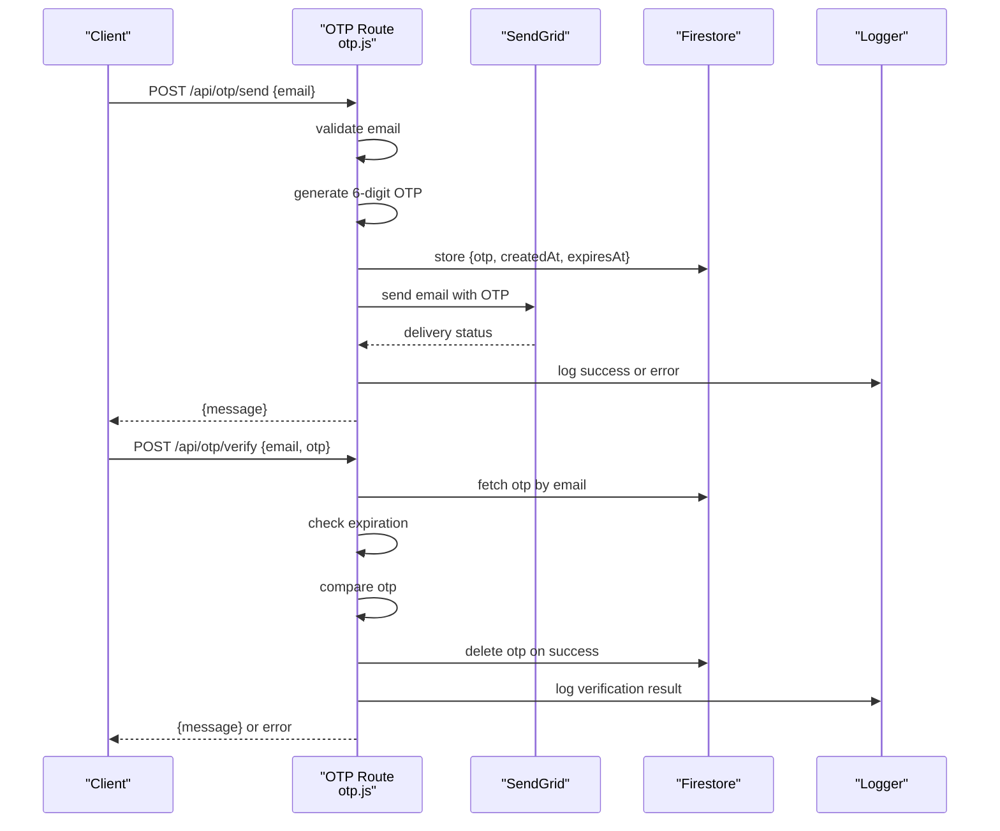
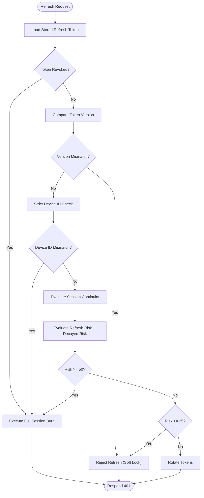
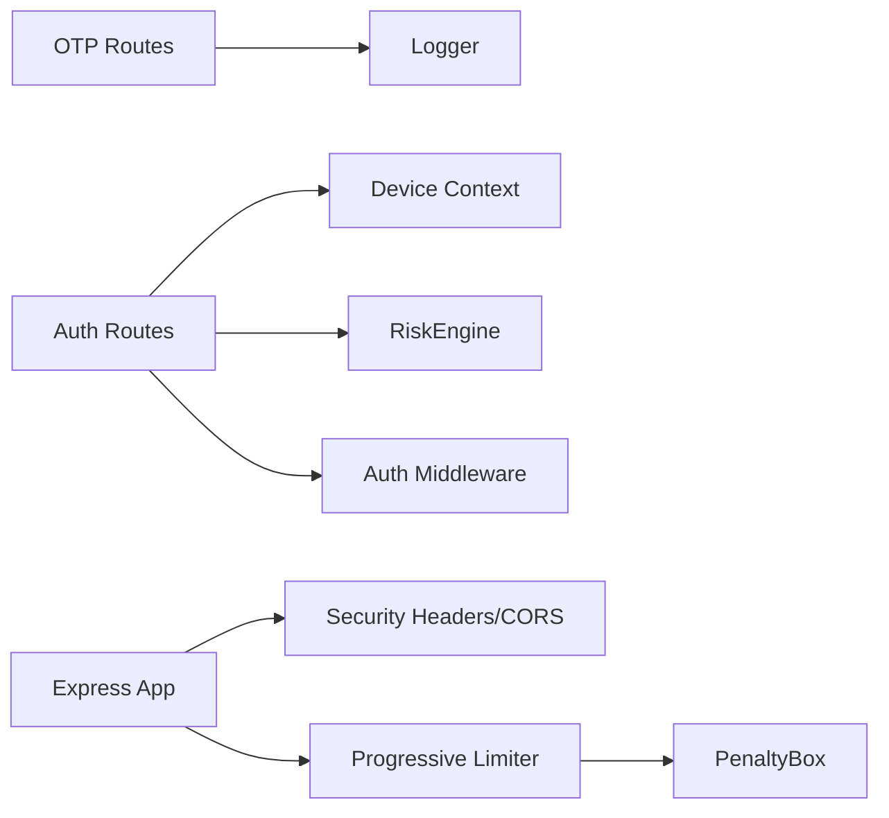

# OTP & Security Endpoints

<cite>
**Referenced Files in This Document**
- [otp.js](file://backend/src/routes/otp.js)
- [auth.js](file://backend/src/routes/auth.js)
- [deviceContext.js](file://backend/src/middleware/deviceContext.js)
- [RiskEngine.js](file://backend/src/services/RiskEngine.js)
- [InteractionGuard.js](file://backend/src/services/InteractionGuard.js)
- [progressiveLimiter.js](file://backend/src/middleware/progressiveLimiter.js)
- [PenaltyBox.js](file://backend/src/services/PenaltyBox.js)
- [security.js](file://backend/src/middleware/security.js)
- [auth.js](file://backend/src/middleware/auth.js)
- [errorHandler.js](file://backend/src/middleware/errorHandler.js)
- [app.js](file://backend/src/app.js)
- [logger.js](file://backend/src/utils/logger.js)
</cite>

## Table of Contents
1. [Introduction](#introduction)
2. [Project Structure](#project-structure)
3. [Core Components](#core-components)
4. [Architecture Overview](#architecture-overview)
5. [Detailed Component Analysis](#detailed-component-analysis)
6. [Dependency Analysis](#dependency-analysis)
7. [Performance Considerations](#performance-considerations)
8. [Troubleshooting Guide](#troubleshooting-guide)
9. [Conclusion](#conclusion)
10. [Appendices](#appendices)

## Introduction
This document provides API documentation for OTP and security endpoints, focusing on one-time password generation, verification, and validation. It also details security validation endpoints, device context verification, and risk assessment integration with the RiskEngine. The guide includes request/response schemas, curl examples, security guidelines, error handling patterns, and best practices for implementing secure authentication flows and fraud prevention measures.

## Project Structure
The OTP and security-related functionality resides in the backend/src directory:
- Routes: OTP and authentication endpoints
- Middleware: device context extraction, security headers, CORS, rate limiting, and authentication
- Services: risk engine, interaction guard, and penalty box
- Utilities: logging

**Diagram sources**
- [app.js](file://backend/src/app.js#L1-L78)
- [security.js](file://backend/src/middleware/security.js#L1-L75)
- [progressiveLimiter.js](file://backend/src/middleware/progressiveLimiter.js#L1-L61)
- [PenaltyBox.js](file://backend/src/services/PenaltyBox.js#L1-L108)
- [otp.js](file://backend/src/routes/otp.js#L1-L133)
- [auth.js](file://backend/src/routes/auth.js#L1-L301)
- [deviceContext.js](file://backend/src/middleware/deviceContext.js#L1-L24)
- [RiskEngine.js](file://backend/src/services/RiskEngine.js#L1-L170)
- [InteractionGuard.js](file://backend/src/services/InteractionGuard.js#L1-L124)
- [logger.js](file://backend/src/utils/logger.js)

**Section sources**
- [app.js](file://backend/src/app.js#L1-L78)

## Core Components
- OTP endpoints: generate and send OTP to email, verify OTP
- Authentication endpoints: token exchange and refresh with device context and risk evaluation
- Device context middleware: extracts and hashes IP, user agent, and device ID
- RiskEngine: evaluates refresh risk, session continuity, and executes full session burn
- Progressive rate limiter and PenaltyBox: enforce endpoint-specific limits and escalate penalties
- Security middleware: applies security headers, CORS, and request timeouts
- Auth middleware: verifies tokens and attaches user context

**Section sources**
- [otp.js](file://backend/src/routes/otp.js#L1-L133)
- [auth.js](file://backend/src/routes/auth.js#L1-L301)
- [deviceContext.js](file://backend/src/middleware/deviceContext.js#L1-L24)
- [RiskEngine.js](file://backend/src/services/RiskEngine.js#L1-L170)
- [progressiveLimiter.js](file://backend/src/middleware/progressiveLimiter.js#L1-L61)
- [PenaltyBox.js](file://backend/src/services/PenaltyBox.js#L1-L108)
- [security.js](file://backend/src/middleware/security.js#L1-L75)
- [auth.js](file://backend/src/middleware/auth.js#L1-L164)

## Architecture Overview
The OTP and security flows integrate with device context hashing, risk scoring, and progressive rate limiting. The authentication flow uses custom JWTs with versioning and refresh token rotation, enforced by the RiskEngine.

**Diagram sources**
- [otp.js](file://backend/src/routes/otp.js#L15-L79)
- [otp.js](file://backend/src/routes/otp.js#L81-L130)
- [logger.js](file://backend/src/utils/logger.js)

**Section sources**
- [otp.js](file://backend/src/routes/otp.js#L1-L133)

## Detailed Component Analysis

### OTP Endpoints

#### POST /api/otp/send
- Purpose: Generate a 6-digit OTP and send it via email
- Validation: Email must be valid and normalized
- Storage: OTP stored in Firestore with a 10-minute TTL
- Delivery: Sends HTML and plain text emails via SendGrid
- Rate limiting: Mounted under progressiveLimiter('otp')

Request
- Content-Type: application/json
- Body
  - email: string, required, valid email

Response
- Success: 200 OK
  - message: string
- Validation error: 400 Bad Request
  - errors: array of validation errors
- Configuration error: 500 Internal Server Error
  - error: string
- Other errors: 500 Internal Server Error
  - error: string

curl example
- curl -X POST https://yourdomain.com/api/otp/send -H "Content-Type: application/json" -d '{"email":"user@example.com"}'

Security notes
- OTP is stored with expiration; expired OTPs are deleted automatically upon verification failure
- SendGrid API key and sender email are required; missing configuration returns a 500 error

**Section sources**
- [otp.js](file://backend/src/routes/otp.js#L15-L79)

#### POST /api/otp/verify
- Purpose: Verify OTP for a given email
- Validation: Email must be valid; OTP must be 6 digits
- Logic: Fetch OTP from Firestore, check expiration, compare OTP, delete on success
- Rate limiting: Mounted under progressiveLimiter('otp')

Request
- Content-Type: application/json
- Body
  - email: string, required, valid email
  - otp: string, required, exactly 6 digits

Response
- Success: 200 OK
  - message: string
- Not found: 404 Not Found
  - error: string
- Expired: 400 Bad Request
  - error: string
- Invalid: 400 Bad Request
  - error: string
- Other errors: 500 Internal Server Error
  - error: string

curl example
- curl -X POST https://yourdomain.com/api/otp/verify -H "Content-Type: application/json" -d '{"email":"user@example.com","otp":"123456"}'

Security notes
- OTP is deleted upon successful verification to prevent reuse
- Expiration is checked using Firestore timestamps

**Section sources**
- [otp.js](file://backend/src/routes/otp.js#L81-L130)

### Authentication Endpoints with Security Validation

#### POST /api/auth/token
- Purpose: Exchange Firebase ID token for custom access/refresh token pair
- Device context: Required; device ID header enforced
- Security: Validates JWT secrets, verifies Firebase token, initializes user schema, stores refresh token with hashed device context
- Rate limiting: Mounted under progressiveLimiter('auth')

Request
- Content-Type: application/json
- Body
  - idToken: string, required

Response
- Success: 200 OK
  - success: boolean
  - data.accessToken: string
  - data.refreshToken: string
  - data.expiresIn: number (seconds)
- Errors: 400/401/500 depending on validation and configuration

curl example
- curl -X POST https://yourdomain.com/api/auth/token -H "Content-Type: application/json" -d '{"idToken":"<firebase-id-token>"}'

Security notes
- Access token expires in 15 minutes; refresh token expires in 30 days
- User schema is auto-healed if missing essential fields
- Device context is hashed and stored for risk evaluation

**Section sources**
- [auth.js](file://backend/src/routes/auth.js#L15-L159)

#### POST /api/auth/refresh
- Purpose: Issue new access/refresh token pair using refresh token
- Device context: Required; strict device ID hash comparison
- Risk evaluation: Uses RiskEngine for refresh risk, session continuity, and decaying risk
- Actions: Hard burn (full session burn) or soft lock (reject refresh with risk message)

Request
- Content-Type: application/json
- Body
  - refreshToken: string, required

Response
- Success: 200 OK
  - success: boolean
  - data.accessToken: string
  - data.refreshToken: string
  - data.expiresIn: number (seconds)
- Suspicious activity: 401 Unauthorized
  - error: string (soft lock)
- Compromised session: 401 Unauthorized
  - error: string (hard burn)
- Other errors: 401/500 depending on validation

curl example
- curl -X POST https://yourdomain.com/api/auth/refresh -H "Content-Type: application/json" -d '{"refreshToken":"<refresh-token>"}'

Security notes
- Anti-replay protection checks revoked tokens
- Device ID mismatch triggers full session burn
- Session continuity checks detect concurrent refresh races and abuse patterns

**Section sources**
- [auth.js](file://backend/src/routes/auth.js#L161-L280)

### Device Context Verification
- Extracts IP, user agent, and device ID from headers
- Hashes sensitive identifiers using SHA-256
- Enforces device_id requirement for refresh endpoint
- Stores hashed context in req.deviceContext for downstream use

curl example
- Include device ID header when refreshing tokens:
  - curl -H "x-device-id: <device-id>" https://yourdomain.com/api/auth/refresh

**Section sources**
- [deviceContext.js](file://backend/src/middleware/deviceContext.js#L1-L24)

### Risk Assessment Integration (RiskEngine)
- evaluateRefreshRisk: Computes risk score based on device ID, user agent, and IP hash mismatches
- calculateDecayedRisk: Reduces risk score over time based on last seen
- evaluateSessionContinuity: Detects concurrent refresh races, high-frequency refresh storms, and excessive active sessions
- executeFullSessionBurn: Revokes all refresh tokens and increments token version globally

**Diagram sources**
- [auth.js](file://backend/src/routes/auth.js#L166-L280)
- [RiskEngine.js](file://backend/src/services/RiskEngine.js#L11-L130)

**Section sources**
- [RiskEngine.js](file://backend/src/services/RiskEngine.js#L1-L170)

### Security Validation Rules
- Security headers: Helmet configuration for API-only mode
- CORS: Strict origin whitelisting with development bypass
- Request timeout: 15-second hard timeout for JSON/REST except specific slow routes
- Auth middleware: Verifies custom JWTs first, falls back to Firebase ID tokens, enforces token version checks, and attaches user context

**Section sources**
- [security.js](file://backend/src/middleware/security.js#L1-L75)
- [auth.js](file://backend/src/middleware/auth.js#L1-L164)

### Rate Limiting and Penalties
- Policies: Endpoint-specific limits (e.g., auth: 5/15min, otp: 5/15min, api: 300/15min)
- Progressive escalation: 5 min, 30 min, 24 h blocks based on strike count
- Global pressure detection: Blocks when request volume exceeds thresholds
- PenaltyBox: In-memory tracking with periodic cleanup

**Section sources**
- [progressiveLimiter.js](file://backend/src/middleware/progressiveLimiter.js#L1-L61)
- [PenaltyBox.js](file://backend/src/services/PenaltyBox.js#L1-L108)

### Error Handling Patterns
- Centralized error handler logs full error details and responds with structured JSON
- Production-safe error responses omit stack traces
- Specific error codes for auth and infrastructure issues

**Section sources**
- [errorHandler.js](file://backend/src/middleware/errorHandler.js#L1-L35)

## Dependency Analysis
The OTP and auth endpoints depend on middleware and services for security, rate limiting, and risk evaluation.

**Diagram sources**
- [otp.js](file://backend/src/routes/otp.js#L1-L133)
- [auth.js](file://backend/src/routes/auth.js#L1-L301)
- [deviceContext.js](file://backend/src/middleware/deviceContext.js#L1-L24)
- [RiskEngine.js](file://backend/src/services/RiskEngine.js#L1-L170)
- [auth.js](file://backend/src/middleware/auth.js#L1-L164)
- [security.js](file://backend/src/middleware/security.js#L1-L75)
- [progressiveLimiter.js](file://backend/src/middleware/progressiveLimiter.js#L1-L61)
- [PenaltyBox.js](file://backend/src/services/PenaltyBox.js#L1-L108)
- [app.js](file://backend/src/app.js#L1-L78)

**Section sources**
- [app.js](file://backend/src/app.js#L1-L78)

## Performance Considerations
- OTP storage TTL prevents long-term persistence of sensitive data
- Device context hashing avoids storing raw identifiers in the database
- RiskEngine calculations are lightweight and rely on in-memory counters and Firestore queries
- Progressive rate limiter uses in-memory maps with periodic cleanup to prevent memory leaks
- Request timeouts prevent slowloris-style attacks and long-running operations

## Troubleshooting Guide
Common issues and resolutions:
- OTP send fails due to missing SendGrid configuration
  - Ensure SENDGRID_API_KEY and SENDGRID_FROM_EMAIL are set
- OTP verify returns expired or invalid
  - Confirm OTP was generated within the last 10 minutes
  - Verify the OTP matches exactly (case-sensitive, no spaces)
- Auth token exchange returns 500 due to missing JWT secrets
  - Set JWT_ACCESS_SECRET and JWT_REFRESH_SECRET
- Refresh returns 401 due to device mismatch
  - Ensure the same device ID is used consistently
- Rate limit exceeded
  - Wait for cooldown period or adjust policies in progressiveLimiter
- CORS blocked
  - Configure CORS_ALLOWED_ORIGINS appropriately

**Section sources**
- [otp.js](file://backend/src/routes/otp.js#L44-L48)
- [otp.js](file://backend/src/routes/otp.js#L110-L117)
- [auth.js](file://backend/src/routes/auth.js#L27-L31)
- [auth.js](file://backend/src/routes/auth.js#L202-L207)
- [progressiveLimiter.js](file://backend/src/middleware/progressiveLimiter.js#L32-L56)
- [security.js](file://backend/src/middleware/security.js#L17-L46)

## Conclusion
The OTP and security endpoints provide robust mechanisms for secure authentication and fraud prevention. OTP generation and verification are straightforward with built-in validation and rate limiting. The authentication flow integrates device context hashing, risk scoring, and refresh token rotation to mitigate replay and session hijacking attacks. Progressive rate limiting and centralized error handling ensure resilience and observability.

## Appendices

### API Definitions

#### OTP Endpoints
- POST /api/otp/send
  - Request: { email }
  - Response: { message } or error
- POST /api/otp/verify
  - Request: { email, otp }
  - Response: { message } or error

#### Authentication Endpoints
- POST /api/auth/token
  - Request: { idToken }
  - Response: { success, data: { accessToken, refreshToken, expiresIn } } or error
- POST /api/auth/refresh
  - Request: { refreshToken }
  - Response: { success, data: { accessToken, refreshToken, expiresIn } } or error

### Security Guidelines
- Always use HTTPS in production
- Restrict CORS origins to trusted domains
- Rotate JWT secrets periodically
- Monitor logs for security events (RATE_LIMIT_EXCEEDED, AUTH_VERIFICATION_FAILED)
- Enforce device ID usage for refresh operations
- Apply rate limits to public endpoints

### Best Practices for Secure Authentication Flows
- Use short-lived access tokens and long-lived refresh tokens
- Implement device-bound refresh tokens with strict device ID checks
- Employ risk scoring and session continuity checks
- Enforce progressive rate limiting with escalating penalties
- Log and alert on suspicious activities without exposing sensitive details to clients