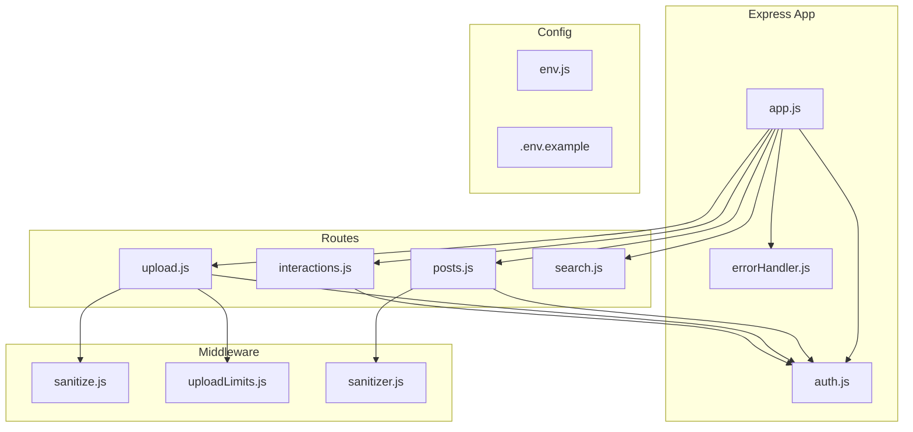
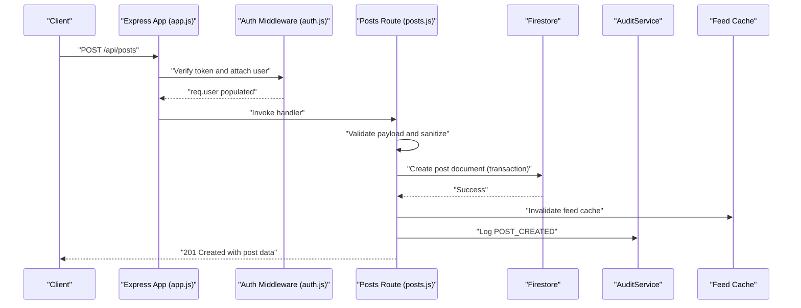
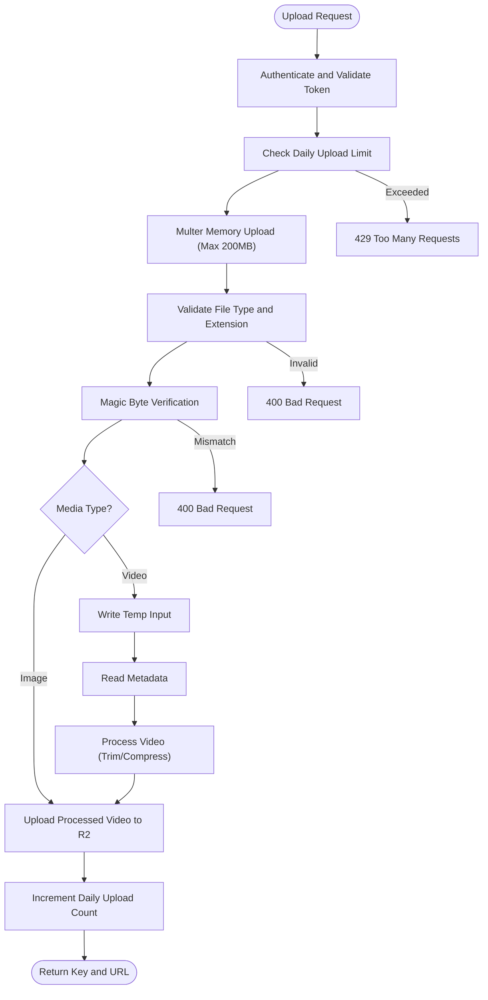
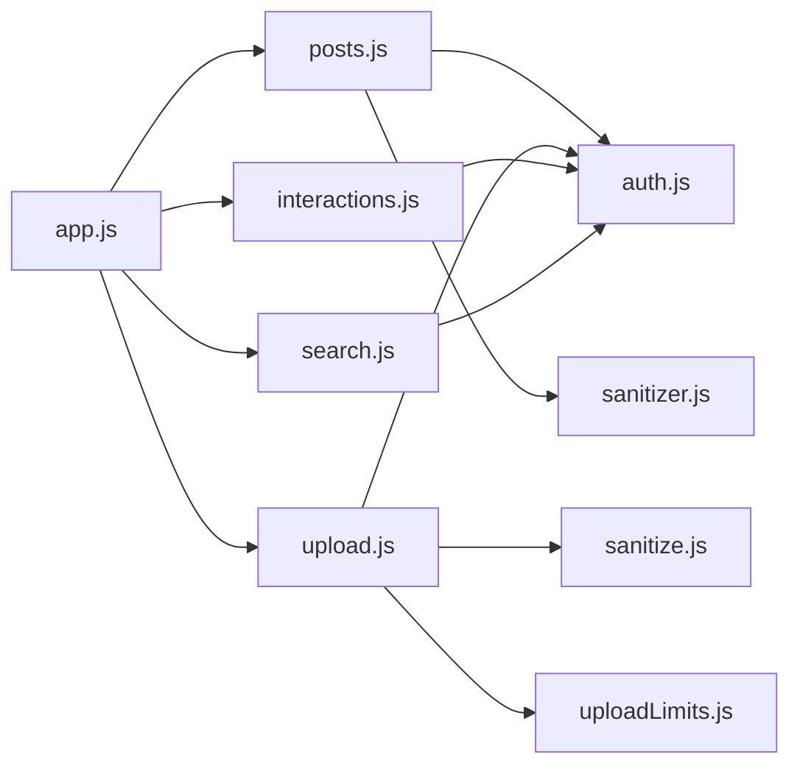

# Post Management Endpoints

<cite>
**Referenced Files in This Document**
- [posts.js](file://backend/src/routes/posts.js)
- [upload.js](file://backend/src/routes/upload.js)
- [auth.js](file://backend/src/middleware/auth.js)
- [sanitize.js](file://backend/src/middleware/sanitize.js)
- [uploadLimits.js](file://backend/src/middleware/uploadLimits.js)
- [sanitizer.js](file://backend/src/utils/sanitizer.js)
- [interactions.js](file://backend/src/routes/interactions.js)
- [search.js](file://backend/src/routes/search.js)
- [app.js](file://backend/src/app.js)
- [env.js](file://backend/src/config/env.js)
- [.env.example](file://backend/.env.example)
- [errorHandler.js](file://backend/src/middleware/errorHandler.js)
</cite>

## Table of Contents
1. [Introduction](#introduction)
2. [Project Structure](#project-structure)
3. [Core Components](#core-components)
4. [Architecture Overview](#architecture-overview)
5. [Detailed Component Analysis](#detailed-component-analysis)
6. [Dependency Analysis](#dependency-analysis)
7. [Performance Considerations](#performance-considerations)
8. [Troubleshooting Guide](#troubleshooting-guide)
9. [Conclusion](#conclusion)
10. [Appendices](#appendices)

## Introduction
This document provides comprehensive API documentation for post management endpoints. It covers CRUD operations for posts, media upload handling for images and videos, comment system endpoints, like/favorite functionality, and post search capabilities. It also details authentication requirements, file validation and sanitization, Cloudflare R2 integration, request/response schemas, upload limits, error handling patterns, curl examples, response samples, and integration guidelines for content management operations.

## Project Structure
The backend is organized around Express routes and middleware. Authentication is handled centrally, and protected routes mount under `/api/*`. Media uploads integrate with Cloudflare R2 via AWS S3-compatible client.

**Diagram sources**
- [app.js](file://backend/src/app.js#L44-L60)
- [posts.js](file://backend/src/routes/posts.js#L1-L20)
- [upload.js](file://backend/src/routes/upload.js#L1-L25)
- [interactions.js](file://backend/src/routes/interactions.js#L1-L15)
- [search.js](file://backend/src/routes/search.js#L1-L10)
- [auth.js](file://backend/src/middleware/auth.js#L20-L161)
- [sanitize.js](file://backend/src/middleware/sanitize.js#L32-L99)
- [uploadLimits.js](file://backend/src/middleware/uploadLimits.js#L10-L36)
- [sanitizer.js](file://backend/src/utils/sanitizer.js#L60-L64)
- [env.js](file://backend/src/config/env.js#L6-L22)
- [.env.example](file://backend/.env.example#L15-L21)

**Section sources**
- [app.js](file://backend/src/app.js#L44-L60)

## Core Components
- Authentication middleware validates tokens and attaches user context.
- Post routes implement creation, retrieval, and deletion with privacy and shadow-ban controls.
- Media upload routes validate file types and sizes, process videos, and upload to Cloudflare R2.
- Interaction routes provide like, comment, follow, and event join/unjoin.
- Search route supports user and post search with prefix matching.
- Centralized error handler standardizes error responses.

**Section sources**
- [auth.js](file://backend/src/middleware/auth.js#L20-L161)
- [posts.js](file://backend/src/routes/posts.js#L62-L207)
- [upload.js](file://backend/src/routes/upload.js#L124-L222)
- [interactions.js](file://backend/src/routes/interactions.js#L28-L171)
- [search.js](file://backend/src/routes/search.js#L11-L49)
- [errorHandler.js](file://backend/src/middleware/errorHandler.js#L3-L32)

## Architecture Overview
The system enforces authentication for protected routes, applies rate limiting, validates and sanitizes inputs, and integrates with Firestore for persistence and Cloudflare R2 for media storage.

**Diagram sources**
- [app.js](file://backend/src/app.js#L55-L57)
- [auth.js](file://backend/src/middleware/auth.js#L20-L161)
- [posts.js](file://backend/src/routes/posts.js#L62-L207)

## Detailed Component Analysis

### Authentication and Authorization
- Authentication supports both custom JWT and Firebase ID tokens with revocation checks.
- User roles and status are attached to the request object.
- Token expiration is validated for non-custom tokens.

**Section sources**
- [auth.js](file://backend/src/middleware/auth.js#L20-L161)

### Post CRUD Endpoints

#### Create Post
- Endpoint: POST /api/posts
- Authentication: Required
- Payload fields (selected):
  - title, body, text, category, city, country
  - mediaUrl, mediaType, thumbnailUrl
  - location: { lat, lng, name }
  - tags: array of strings
  - isEvent, eventStartDate, eventEndDate, eventDate, eventLocation, isFree, eventType, subtitle
  - id, authorId (allowed for stability)
- Validation:
  - Joi schema enforces field lengths and types.
  - Event-specific validation ensures required dates and chronological order.
  - Account age check prevents new accounts from posting.
  - Shadow ban visibility control.
- Response:
  - 201 Created with post data including server timestamps and counts.
- Audit:
  - Logs POST_CREATED action.

**Section sources**
- [posts.js](file://backend/src/routes/posts.js#L31-L56)
- [posts.js](file://backend/src/routes/posts.js#L62-L207)

#### Retrieve Posts (Feed)
- Endpoint: GET /api/posts
- Authentication: Required
- Query parameters:
  - authorId, category, city, country
  - lat, lng (for geographically-aware feed)
  - limit (max 50), afterId (cursor)
- Behavior:
  - GeoHash-based caching and promise locks for regional feeds.
  - Multi-ring expansion for hyper-local, local, and regional areas.
  - Fallback to global trending posts.
  - Embeds like state per post for the requesting user.
  - Anti-scraping jitter delay on initial fetch.
- Response:
  - Pagination cursor and hasMore flag.
  - Per-post isLiked indicator.

**Section sources**
- [posts.js](file://backend/src/routes/posts.js#L333-L527)

#### Retrieve Single Post
- Endpoint: GET /api/posts/:id
- Authentication: Required
- Privacy:
  - Shadow-banned posts return 404 to non-authors.
- Response:
  - Includes computed event status and like state.

**Section sources**
- [posts.js](file://backend/src/routes/posts.js#L533-L601)

#### Delete Post
- Endpoint: DELETE /api/posts/:id
- Authentication: Required
- Authorization:
  - Author or admin can delete.
- Cascade deletion:
  - Removes associated event groups, members, and attendance records if post is an event.
- Audit:
  - Logs POST_DELETED action.

**Section sources**
- [posts.js](file://backend/src/routes/posts.js#L607-L656)

### Media Upload Handling (Images and Videos)
- Endpoint: POST /api/upload/post
- Authentication: Required
- Token validation:
  - Validates token freshness for non-custom tokens.
- Daily upload limit:
  - Enforces 20 uploads per user per day.
- File validation:
  - Declared mediaType must be image or video.
  - Allowed extensions: jpg, jpeg, png, webp, gif, mp4, webm, mov.
  - Magic-byte verification ensures MIME type matches declaration.
- Video processing:
  - Writes temporary files, reads metadata, trims/compresses if duration > 300s.
  - Outputs consistent MP4 format.
- Storage:
  - Uploads to Cloudflare R2 bucket with public cache-control.
  - Increments daily upload count on success.
- Response:
  - Returns key and public URL.

**Diagram sources**
- [upload.js](file://backend/src/routes/upload.js#L124-L222)
- [uploadLimits.js](file://backend/src/middleware/uploadLimits.js#L10-L36)
- [sanitize.js](file://backend/src/middleware/sanitize.js#L32-L99)

**Section sources**
- [upload.js](file://backend/src/routes/upload.js#L124-L222)
- [uploadLimits.js](file://backend/src/middleware/uploadLimits.js#L10-L36)
- [sanitize.js](file://backend/src/middleware/sanitize.js#L32-L99)

### Comment System Endpoints
- Add Comment
  - Endpoint: POST /api/interactions/comment
  - Fields: postId, text
  - Transaction updates post commentCount and creates comment.
  - Notification triggered asynchronously.
- Get Comments for a Post
  - Endpoint: GET /api/interactions/comments/:postId
  - Returns comments ordered by creation time.

**Section sources**
- [interactions.js](file://backend/src/routes/interactions.js#L109-L171)
- [interactions.js](file://backend/src/routes/interactions.js#L349-L370)

### Like/Favorite Functionality
- Toggle Like
  - Endpoint: POST /api/interactions/like
  - Field: postId
  - Transaction toggles like document and updates post likeCount.
  - Sends notification to post author.
- Batch Check Likes
  - Endpoint: POST /api/interactions/likes/batch
  - Field: postIds (array up to 30 per chunk)
  - Returns mapping of post IDs to liked status.
- Single Check
  - Endpoint: GET /api/interactions/likes/check
  - Query: postId
  - Returns liked status and likeCount.

**Section sources**
- [interactions.js](file://backend/src/routes/interactions.js#L28-L103)
- [interactions.js](file://backend/src/routes/interactions.js#L375-L419)
- [interactions.js](file://backend/src/routes/interactions.js#L425-L448)

### Post Search Capabilities
- Endpoint: GET /api/search
- Fields: q (query), type (posts|users), limit (max 50)
- Behavior:
  - Users: prefix match on username.
  - Posts: prefix match on text (note: Firestore prefix search limitations apply).
- Response:
  - Array of results with ids and data.

**Section sources**
- [search.js](file://backend/src/routes/search.js#L11-L49)

### Event Messaging (Chat)
- Send Message
  - Endpoint: POST /api/posts/:id/messages
  - Field: text
  - Stores message in post’s messages subcollection.
- Get Messages
  - Endpoint: GET /api/posts/:id/messages
  - Returns latest 100 messages ordered by timestamp.

**Section sources**
- [posts.js](file://backend/src/routes/posts.js#L664-L696)
- [posts.js](file://backend/src/routes/posts.js#L702-L725)

## Dependency Analysis
- Route protection:
  - All post-related routes are mounted under protected middleware that applies authentication and progressive rate limiting.
- Data validation:
  - Joi schema for post creation, express-validator for interactions, and custom sanitization utilities.
- External integrations:
  - Cloudflare R2 via AWS S3 client.
  - Firebase Admin for user and post persistence.
- Caching and concurrency:
  - In-memory feed cache with TTL and promise locks to prevent dog-piling.

**Diagram sources**
- [app.js](file://backend/src/app.js#L55-L59)
- [posts.js](file://backend/src/routes/posts.js#L1-L20)
- [upload.js](file://backend/src/routes/upload.js#L1-L20)
- [interactions.js](file://backend/src/routes/interactions.js#L1-L15)
- [search.js](file://backend/src/routes/search.js#L1-L10)
- [auth.js](file://backend/src/middleware/auth.js#L20-L161)
- [sanitize.js](file://backend/src/middleware/sanitize.js#L32-L99)
- [uploadLimits.js](file://backend/src/middleware/uploadLimits.js#L10-L36)
- [sanitizer.js](file://backend/src/utils/sanitizer.js#L60-L64)

**Section sources**
- [app.js](file://backend/src/app.js#L55-L59)

## Performance Considerations
- Feed caching:
  - In-memory cache with TTL and promise locks for regional feeds to reduce database load.
- Anti-scraping:
  - Random jitter delay on initial feed fetch.
- Batch operations:
  - Batch-like likes check uses Firestore “in” queries with chunking to optimize performance.
- Video processing:
  - Temporary file I/O and compression reduce storage size and ensure consistent format.

[No sources needed since this section provides general guidance]

## Troubleshooting Guide
- Authentication failures:
  - Missing or invalid bearer token, expired token, or revoked token.
- Validation errors:
  - Joi schema violations, missing event dates, or invalid file types/extensions.
- Upload limits:
  - Exceeded daily upload cap returns 429 with retry guidance.
- Rate limiting:
  - Progressive limiter triggers based on user or IP depending on route.
- Error responses:
  - Centralized error handler returns structured error objects with message and code.

**Section sources**
- [auth.js](file://backend/src/middleware/auth.js#L23-L28)
- [auth.js](file://backend/src/middleware/auth.js#L142-L157)
- [posts.js](file://backend/src/routes/posts.js#L74-L95)
- [sanitize.js](file://backend/src/middleware/sanitize.js#L32-L40)
- [uploadLimits.js](file://backend/src/middleware/uploadLimits.js#L19-L25)
- [errorHandler.js](file://backend/src/middleware/errorHandler.js#L3-L32)

## Conclusion
The post management API provides robust CRUD operations, secure media uploads with Cloudflare R2, comprehensive interaction features, and efficient search. Authentication, validation, and sanitization are enforced at multiple layers, while caching and anti-scraping measures improve performance and resilience. Production readiness requires credential rotation and environment hardening.

[No sources needed since this section summarizes without analyzing specific files]

## Appendices

### Authentication Requirements
- Header: Authorization: Bearer <token>
- Supported tokens:
  - Custom JWT (short-lived access token)
  - Firebase ID token (with revocation checks)

**Section sources**
- [auth.js](file://backend/src/middleware/auth.js#L20-L161)

### File Upload Limits and Validation
- Max file size: 200 MB
- Allowed media types: image, video
- Allowed extensions: jpg, jpeg, png, webp, gif, mp4, webm, mov
- Daily upload limit: 20 uploads per user per day

**Section sources**
- [upload.js](file://backend/src/routes/upload.js#L27-L31)
- [upload.js](file://backend/src/routes/upload.js#L145-L150)
- [uploadLimits.js](file://backend/src/middleware/uploadLimits.js#L10-L36)
- [sanitize.js](file://backend/src/middleware/sanitize.js#L32-L40)

### Cloudflare R2 Integration
- Endpoint: https://{R2_ACCOUNT_ID}.r2.cloudflarestorage.com
- Bucket: R2_BUCKET_NAME
- Public base URL: R2_PUBLIC_BASE_URL
- Cache-Control: public, max-age=31536000, immutable

**Section sources**
- [upload.js](file://backend/src/routes/upload.js#L36-L43)
- [env.js](file://backend/src/config/env.js#L15-L21)
- [.env.example](file://backend/.env.example#L15-L21)

### Request/Response Schemas

#### Create Post (POST /api/posts)
- Request body fields (selected):
  - title, body, text, category, city, country
  - mediaUrl, mediaType, thumbnailUrl
  - location: { lat, lng, name }
  - tags: array of strings
  - isEvent, eventStartDate, eventEndDate, eventDate, eventLocation, isFree, eventType, subtitle
  - id, authorId (allowed)
- Response:
  - success: boolean
  - data: post object with server timestamps and counts
  - error: null

**Section sources**
- [posts.js](file://backend/src/routes/posts.js#L31-L56)
- [posts.js](file://backend/src/routes/posts.js#L194-L202)

#### Retrieve Posts (GET /api/posts)
- Query parameters:
  - authorId, category, city, country
  - lat, lng, limit (≤50), afterId
- Response:
  - success: boolean
  - data: array of posts with isLiked
  - pagination: { cursor, hasMore }

**Section sources**
- [posts.js](file://backend/src/routes/posts.js#L335-L340)
- [posts.js](file://backend/src/routes/posts.js#L481-L488)

#### Retrieve Single Post (GET /api/posts/:id)
- Response:
  - success: boolean
  - data: post object with computed event status and isLiked
  - error: null

**Section sources**
- [posts.js](file://backend/src/routes/posts.js#L585-L597)

#### Delete Post (DELETE /api/posts/:id)
- Response:
  - success: boolean
  - data: { message: "Post deleted" }
  - error: null

**Section sources**
- [posts.js](file://backend/src/routes/posts.js#L648-L652)

#### Upload Media (POST /api/upload/post)
- Form fields:
  - file: binary
  - mediaType: image | video
  - postId: optional identifier
- Response:
  - key: stored object key
  - url: public URL

**Section sources**
- [upload.js](file://backend/src/routes/upload.js#L145-L150)
- [upload.js](file://backend/src/routes/upload.js#L197-L200)

#### Add Comment (POST /api/interactions/comment)
- Request body:
  - postId: string
  - text: string
- Response:
  - success: boolean
  - data: { commentId: string }
  - error: null

**Section sources**
- [interactions.js](file://backend/src/routes/interactions.js#L116-L117)
- [interactions.js](file://backend/src/routes/interactions.js#L162-L166)

#### Get Comments (GET /api/interactions/comments/:postId)
- Response:
  - success: boolean
  - data: array of comments with ISO timestamps
  - error: null

**Section sources**
- [interactions.js](file://backend/src/routes/interactions.js#L362-L366)

#### Like Toggle (POST /api/interactions/like)
- Request body:
  - postId: string
- Response:
  - success: boolean
  - data: { status: "active" }
  - error: null

**Section sources**
- [interactions.js](file://backend/src/routes/interactions.js#L38-L39)
- [interactions.js](file://backend/src/routes/interactions.js#L93-L97)

#### Batch Like Check (POST /api/interactions/likes/batch)
- Request body:
  - postIds: string[]
- Response:
  - success: boolean
  - data: object mapping postIds to boolean liked
  - error: null

**Section sources**
- [interactions.js](file://backend/src/routes/interactions.js#L377-L382)
- [interactions.js](file://backend/src/routes/interactions.js#L411-L415)

#### Single Like Check (GET /api/interactions/likes/check)
- Query:
  - postId: string
- Response:
  - success: boolean
  - data: { liked: boolean, likeCount: number }
  - error: null

**Section sources**
- [interactions.js](file://backend/src/routes/interactions.js#L427-L428)
- [interactions.js](file://backend/src/routes/interactions.js#L437-L444)

#### Search (GET /api/search)
- Query:
  - q: string
  - type: posts | users
  - limit: ≤50
- Response:
  - success: boolean
  - data: array of results
  - error: null

**Section sources**
- [search.js](file://backend/src/routes/search.js#L13-L14)
- [search.js](file://backend/src/routes/search.js#L41-L45)

### Curl Examples

- Create Post
  - curl -X POST https://your-api.com/api/posts \
    -H "Authorization: Bearer YOUR_JWT" \
    -H "Content-Type: application/json" \
    -d '{"title":"Sample","text":"Content","mediaType":"none"}'

- Retrieve Feed
  - curl "https://your-api.com/api/posts?limit=20&lat=37.7749&lng=-122.4194"

- Retrieve Single Post
  - curl -H "Authorization: Bearer YOUR_JWT" https://your-api.com/api/posts/POST_ID

- Delete Post
  - curl -X DELETE https://your-api.com/api/posts/POST_ID -H "Authorization: Bearer YOUR_JWT"

- Upload Media
  - curl -X POST https://your-api.com/api/upload/post \
    -H "Authorization: Bearer YOUR_JWT" \
    -F "file=@/path/to/media" \
    -F "mediaType=image" \
    -F "postId=post123"

- Add Comment
  - curl -X POST https://your-api.com/api/interactions/comment \
    -H "Authorization: Bearer YOUR_JWT" \
    -H "Content-Type: application/json" \
    -d '{"postId":"POST_ID","text":"Great post!"}'

- Get Comments
  - curl "https://your-api.com/api/interactions/comments/POST_ID"

- Like Toggle
  - curl -X POST https://your-api.com/api/interactions/like \
    -H "Authorization: Bearer YOUR_JWT" \
    -H "Content-Type: application/json" \
    -d '{"postId":"POST_ID"}'

- Batch Like Check
  - curl -X POST https://your-api.com/api/interactions/likes/batch \
    -H "Authorization: Bearer YOUR_JWT" \
    -H "Content-Type: application/json" \
    -d '{"postIds":["POST1","POST2"]}'

- Single Like Check
  - curl "https://your-api.com/api/interactions/likes/check?postId=POST_ID"

- Search
  - curl "https://your-api.com/api/search?q=hello&type=posts&limit=20"

[No sources needed since this section provides general guidance]

### Integration Guidelines
- Environment Setup:
  - Configure Cloudflare R2 credentials and bucket name in environment variables.
  - Ensure CORS origin is set appropriately for production.
- Security:
  - Rotate Firebase service account and R2 credentials regularly.
  - Use HTTPS and enforce strict CORS policies.
- Monitoring:
  - Observe centralized error logging and audit trails for actions like POST_CREATED and POST_DELETED.
- Scalability:
  - Leverage feed caching and anti-scraping jitter for improved performance.
  - Use batch-like operations for likes to minimize round trips.

**Section sources**
- [.env.example](file://backend/.env.example#L15-L21)
- [env.js](file://backend/src/config/env.js#L15-L21)
- [errorHandler.js](file://backend/src/middleware/errorHandler.js#L3-L32)
- [posts.js](file://backend/src/routes/posts.js#L185-L190)
- [posts.js](file://backend/src/routes/posts.js#L641-L646)