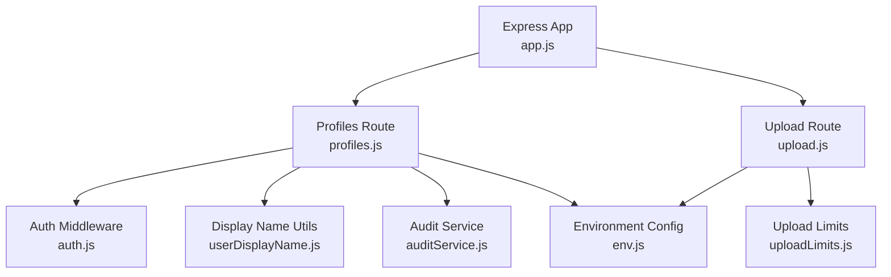
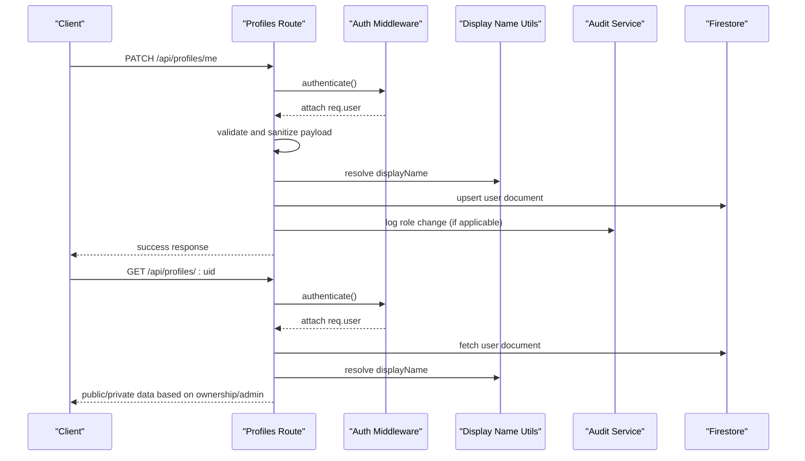
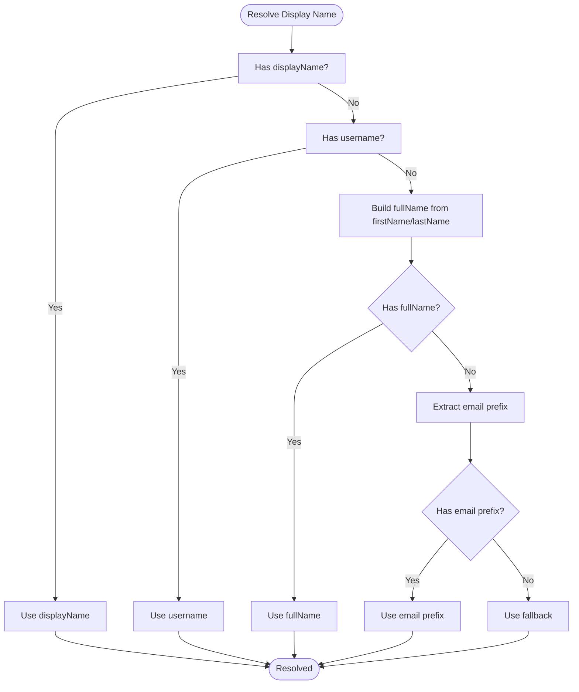
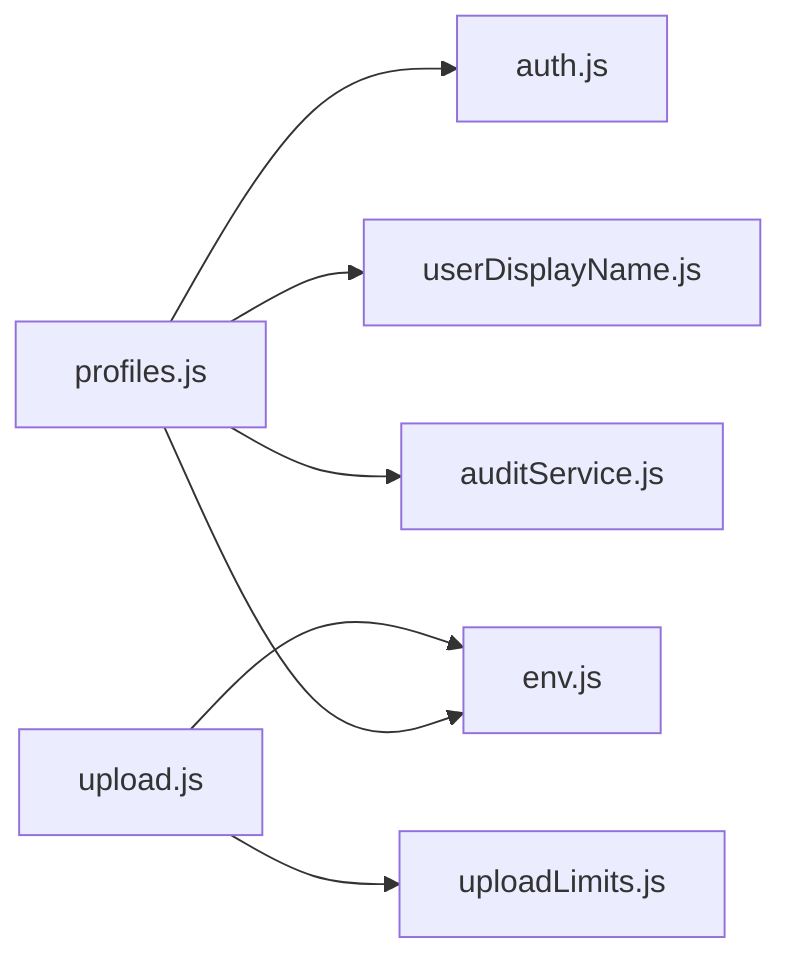

# Profile Management Endpoints

<cite>
**Referenced Files in This Document**
- [profiles.js](file://backend/src/routes/profiles.js)
- [auth.js](file://backend/src/middleware/auth.js)
- [userDisplayName.js](file://backend/src/utils/userDisplayName.js)
- [auditService.js](file://backend/src/services/auditService.js)
- [upload.js](file://backend/src/routes/upload.js)
- [uploadLimits.js](file://backend/src/middleware/uploadLimits.js)
- [app.js](file://backend/src/app.js)
- [security.js](file://backend/src/middleware/security.js)
- [env.js](file://backend/src/config/env.js)
</cite>

## Table of Contents
1. [Introduction](#introduction)
2. [Project Structure](#project-structure)
3. [Core Components](#core-components)
4. [Architecture Overview](#architecture-overview)
5. [Detailed Component Analysis](#detailed-component-analysis)
6. [Dependency Analysis](#dependency-analysis)
7. [Performance Considerations](#performance-considerations)
8. [Troubleshooting Guide](#troubleshooting-guide)
9. [Conclusion](#conclusion)
10. [Appendices](#appendices)

## Introduction
This document provides comprehensive API documentation for profile management endpoints. It covers user profile CRUD operations, profile update endpoints, visibility controls, profile image upload handling, display name management, and user preference settings. It includes request/response schemas, validation rules, privacy controls, curl examples, integration guidelines, and best practices for user data handling and privacy protection.

## Project Structure
The profile management functionality is implemented in the backend under the Express application. Key components include:
- Route handlers for profile operations
- Authentication middleware for secure access
- Utility functions for display name resolution
- Audit logging service for sensitive actions
- Upload route for profile images via Cloudflare R2

**Diagram sources**
- [app.js](file://backend/src/app.js#L34-L60)
- [profiles.js](file://backend/src/routes/profiles.js#L1-L258)
- [upload.js](file://backend/src/routes/upload.js#L1-L225)
- [auth.js](file://backend/src/middleware/auth.js#L1-L164)
- [userDisplayName.js](file://backend/src/utils/userDisplayName.js#L1-L38)
- [auditService.js](file://backend/src/services/auditService.js#L1-L33)
- [uploadLimits.js](file://backend/src/middleware/uploadLimits.js#L1-L55)
- [env.js](file://backend/src/config/env.js#L1-L31)

**Section sources**
- [app.js](file://backend/src/app.js#L34-L60)
- [profiles.js](file://backend/src/routes/profiles.js#L1-L258)
- [upload.js](file://backend/src/routes/upload.js#L1-L225)

## Core Components
- Profiles route module exposes endpoints for updating the authenticated user's profile, retrieving a user's profile by UID, and checking username availability.
- Authentication middleware verifies tokens, attaches user context, enforces session policies, and manages a lightweight in-memory cache for profile data.
- Display name utility resolves a human-friendly display name from available fields.
- Audit service records sensitive administrative actions for compliance and monitoring.
- Upload route handles profile image uploads to Cloudflare R2 with validation and limits.

**Section sources**
- [profiles.js](file://backend/src/routes/profiles.js#L12-L154)
- [auth.js](file://backend/src/middleware/auth.js#L20-L161)
- [userDisplayName.js](file://backend/src/utils/userDisplayName.js#L1-L38)
- [auditService.js](file://backend/src/services/auditService.js#L8-L29)
- [upload.js](file://backend/src/routes/upload.js#L81-L122)

## Architecture Overview
The profile management flow integrates authentication, validation, data normalization, and persistence while enforcing privacy and auditability.

**Diagram sources**
- [profiles.js](file://backend/src/routes/profiles.js#L29-L154)
- [auth.js](file://backend/src/middleware/auth.js#L20-L161)
- [userDisplayName.js](file://backend/src/utils/userDisplayName.js#L1-L38)
- [auditService.js](file://backend/src/services/auditService.js#L9-L23)

## Detailed Component Analysis

### Endpoint: Update Current User Profile (PATCH /api/profiles/me)
Purpose: Allows the authenticated user to update profile fields. Creates a profile on first write if missing.

Key behaviors:
- Authentication required via Bearer token (supports custom JWT or Firebase ID Token).
- Validates and sanitizes input against a strict schema.
- Normalizes string fields and enforces username uniqueness.
- Resolves effective display name from available fields.
- Prevents unauthorized role changes; logs role changes for admins.
- Upserts user document with timestamps and normalizes casing for usernames.

Request
- Method: PATCH
- Path: /api/profiles/me
- Authentication: Required (Bearer)
- Content-Type: application/json
- Body fields (selected):
  - displayName: string, max 100, optional
  - username: string, min 3, max 30, optional
  - firstName: string, max 50, optional
  - lastName: string, max 50, optional
  - about: string, max 500, optional
  - profileImageUrl: URI string, optional
  - location: string, max 100, optional
  - fcmToken: string, optional
  - role: restricted to predefined values (admin/moderator/creator/user), optional

Response
- Success: 200 OK with success flag and message indicating update or creation.
- Validation error: 400 Bad Request with error code and message.
- Username conflict: 409 Conflict when username is taken.
- Unauthorized role change: 403 Forbidden when attempting to modify role without admin privileges.
- Not found during self-healing read: 404 with error code when user document is missing and not the owner.

Privacy and visibility
- Role and email are excluded from public responses; exposed only to the owner or admins.

curl example
- curl -X PATCH https://your-api.com/api/profiles/me -H "Authorization: Bearer YOUR_TOKEN" -H "Content-Type: application/json" -d '{"displayName":"Jane","about":"Hello"}'

Integration guidelines
- Always send the latest valid Bearer token.
- Use only allowed fields; unsupported fields are ignored.
- For username updates, ensure uniqueness; handle 409 responses gracefully.
- Respect role change restrictions; only admins can modify roles.

**Section sources**
- [profiles.js](file://backend/src/routes/profiles.js#L29-L154)
- [auth.js](file://backend/src/middleware/auth.js#L20-L161)
- [userDisplayName.js](file://backend/src/utils/userDisplayName.js#L1-L38)
- [auditService.js](file://backend/src/services/auditService.js#L9-L23)

### Endpoint: Check Username Availability (GET /api/profiles/check-username)
Purpose: Public endpoint to check if a username is available for sign-up.

Request
- Method: GET
- Path: /api/profiles/check-username
- Query parameters:
  - username: required string
- Authentication: Not required

Response
- Success: 200 OK with availability boolean.
- Missing parameter: 400 Bad Request.

curl example
- curl "https://your-api.com/api/profiles/check-username?username=janedoe"

**Section sources**
- [profiles.js](file://backend/src/routes/profiles.js#L160-L178)

### Endpoint: Get User Profile by UID (GET /api/profiles/:uid)
Purpose: Retrieve a user's profile by UID with privacy-aware visibility.

Key behaviors:
- Authentication required.
- Self-healing: creates a minimal profile for the authenticated owner on first read if missing.
- Removes sensitive fields for public view; includes email and role for owners/admins.
- Resolves display name and profile image URL with owner/admin visibility.

Request
- Method: GET
- Path: /api/profiles/:uid
- Path parameters:
  - uid: user identifier
- Authentication: Required

Response
- Success: 200 OK with profile data; sensitive fields included only for owner/admin.
- Not found: 404 Not Found when user document is missing and not the owner.

curl example
- curl -H "Authorization: Bearer YOUR_TOKEN" https://your-api.com/api/profiles/USER_UID

**Section sources**
- [profiles.js](file://backend/src/routes/profiles.js#L184-L255)
- [auth.js](file://backend/src/middleware/auth.js#L20-L161)
- [userDisplayName.js](file://backend/src/utils/userDisplayName.js#L1-L38)

### Profile Image Upload (POST /api/upload/profile)
Purpose: Upload a profile image to Cloudflare R2 and receive a public URL.

Key behaviors:
- Authentication required.
- Validates file type and magic bytes.
- Generates a unique key under profile-images/<uid>/.
- Returns the stored key and public URL.
- Enforces per-user daily upload limits via middleware.

Request
- Method: POST
- Path: /api/upload/profile
- Authentication: Required
- Content-Type: multipart/form-data
- Form fields:
  - file: required image file (JPEG, PNG, WEBP, GIF)

Response
- Success: 200 OK with key and url.
- Unsupported format: 400 Bad Request.
- Upload failure: 500 Internal Server Error.

curl example
- curl -X POST https://your-api.com/api/upload/profile -H "Authorization: Bearer YOUR_TOKEN" -F "file=@/path/to/image.jpg"

**Section sources**
- [upload.js](file://backend/src/routes/upload.js#L81-L122)
- [uploadLimits.js](file://backend/src/middleware/uploadLimits.js#L10-L36)
- [env.js](file://backend/src/config/env.js#L15-L21)

### Display Name Resolution
The system resolves a display name using a deterministic precedence:
1. Provided displayName (trimmed and normalized)
2. Provided username (trimmed and normalized)
3. Concatenation of firstName and lastName (trimmed and normalized)
4. Email prefix (trimmed and normalized)
5. Fallback value

**Diagram sources**
- [userDisplayName.js](file://backend/src/utils/userDisplayName.js#L1-L38)

**Section sources**
- [userDisplayName.js](file://backend/src/utils/userDisplayName.js#L1-L38)

### Privacy Controls and Visibility
- Public view excludes email and role.
- Owners and admins see additional fields (email, role).
- Self-healing ensures owner profiles exist immediately after login.

**Section sources**
- [profiles.js](file://backend/src/routes/profiles.js#L226-L248)

### Validation Rules and Sanitization
- Input schema enforces field sizes and optionality.
- Allowed fields are whitelisted; unknown fields are dropped.
- String fields are normalized (trimmed, empty becomes undefined).
- Username uniqueness enforced with case-insensitive comparison.
- Role changes require admin privileges.

**Section sources**
- [profiles.js](file://backend/src/routes/profiles.js#L12-L23)
- [profiles.js](file://backend/src/routes/profiles.js#L31-L34)
- [profiles.js](file://backend/src/routes/profiles.js#L59-L71)
- [profiles.js](file://backend/src/routes/profiles.js#L84-L97)
- [profiles.js](file://backend/src/routes/profiles.js#L99-L113)

### Audit Logging for Sensitive Actions
Role changes are audited with metadata, IP, and user agent.

**Section sources**
- [auditService.js](file://backend/src/services/auditService.js#L9-L23)
- [profiles.js](file://backend/src/routes/profiles.js#L107-L112)

## Dependency Analysis
The profiles route depends on authentication, display name utilities, and audit logging. Uploads depend on environment configuration and R2 client settings.

**Diagram sources**
- [profiles.js](file://backend/src/routes/profiles.js#L1-L258)
- [auth.js](file://backend/src/middleware/auth.js#L1-L164)
- [userDisplayName.js](file://backend/src/utils/userDisplayName.js#L1-L38)
- [auditService.js](file://backend/src/services/auditService.js#L1-L33)
- [upload.js](file://backend/src/routes/upload.js#L1-L225)
- [uploadLimits.js](file://backend/src/middleware/uploadLimits.js#L1-L55)
- [env.js](file://backend/src/config/env.js#L1-L31)

**Section sources**
- [profiles.js](file://backend/src/routes/profiles.js#L1-L258)
- [upload.js](file://backend/src/routes/upload.js#L1-L225)

## Performance Considerations
- Authentication middleware caches user profiles in memory with TTL to reduce Firestore reads.
- Self-healing on profile retrieval prevents "not found" errors for newly created accounts.
- Request timeout middleware skips timeouts for multipart and slow routes to accommodate file uploads and Firestore cold reads.

**Section sources**
- [auth.js](file://backend/src/middleware/auth.js#L6-L8)
- [auth.js](file://backend/src/middleware/auth.js#L42-L48)
- [profiles.js](file://backend/src/routes/profiles.js#L189-L216)
- [security.js](file://backend/src/middleware/security.js#L49-L74)

## Troubleshooting Guide
Common issues and resolutions:
- Authentication failures: Ensure a valid Bearer token is present and not expired; verify token version matches user's tokenVersion.
- Validation errors: Confirm payload matches allowed fields and constraints; check for proper JSON formatting.
- Username conflicts: Handle 409 responses by prompting the user to choose another username.
- Role change denied: Only admins can modify roles; verify requester's role.
- Upload failures: Verify supported image formats and file size limits; check R2 configuration and public base URL.

**Section sources**
- [auth.js](file://backend/src/middleware/auth.js#L23-L28)
- [auth.js](file://backend/src/middleware/auth.js#L74-L76)
- [profiles.js](file://backend/src/routes/profiles.js#L45-L51)
- [profiles.js](file://backend/src/routes/profiles.js#L92-L96)
- [profiles.js](file://backend/src/routes/profiles.js#L102-L106)
- [upload.js](file://backend/src/routes/upload.js#L93-L95)
- [upload.js](file://backend/src/routes/upload.js#L110-L119)

## Conclusion
The profile management endpoints provide a secure, privacy-aware, and extensible foundation for user profile operations. They enforce strong validation, handle display name resolution, manage profile images via R2, and maintain audit trails for sensitive actions. Integrators should follow the documented schemas, handle error responses appropriately, and adhere to privacy controls.

## Appendices

### API Reference Summary
- PATCH /api/profiles/me
  - Authentication: Required
  - Body fields: displayName, username, firstName, lastName, about, profileImageUrl, location, fcmToken, role
  - Responses: 200 (success), 400 (validation), 403 (role change), 409 (username taken), 404 (not found)
- GET /api/profiles/check-username
  - Authentication: Not required
  - Query: username
  - Responses: 200 (availability), 400 (missing parameter)
- GET /api/profiles/:uid
  - Authentication: Required
  - Path: uid
  - Responses: 200 (profile), 404 (not found)
- POST /api/upload/profile
  - Authentication: Required
  - Form: file (image/*)
  - Responses: 200 (key, url), 400 (unsupported format), 500 (upload failed)

### Best Practices for User Data Handling and Privacy Protection
- Always validate and sanitize inputs server-side; rely on the provided schema.
- Never expose email or role to unauthenticated users; only show to owners/admins.
- Enforce unique usernames with case-insensitive checks.
- Log role changes and other sensitive actions for auditability.
- Use HTTPS and secure headers; configure CORS origins appropriately.
- Implement client-side validation and graceful error handling for network failures.