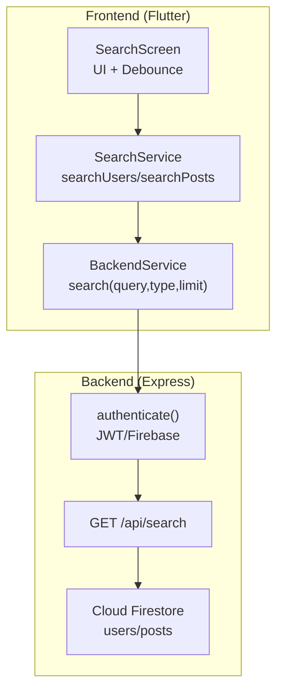
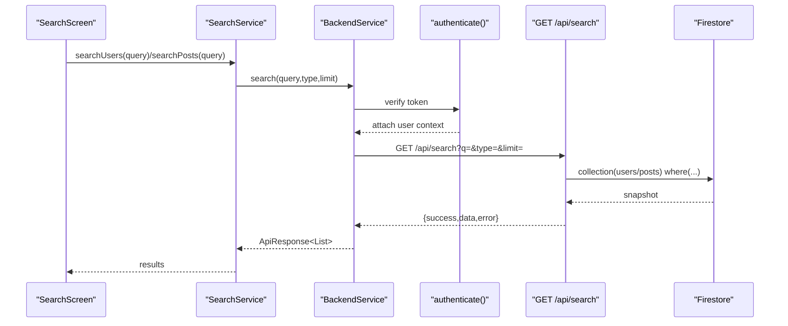
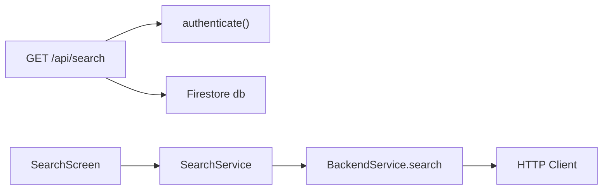

# Search Endpoints

<cite>
**Referenced Files in This Document**
- [search.js](file://backend/src/routes/search.js)
- [auth.js](file://backend/src/middleware/auth.js)
- [app.js](file://backend/src/app.js)
- [errorHandler.js](file://backend/src/middleware/errorHandler.js)
- [backend_service.dart](file://testpro-main/lib/services/backend_service.dart)
- [search_service.dart](file://testpro-main/lib/services/search_service.dart)
- [search_screen.dart](file://testpro-main/lib/screens/search_screen.dart)
- [firebase.js](file://backend/src/config/firebase.js)
- [firestore.indexes.json](file://testpro-main/firestore.indexes.json)
</cite>

## Table of Contents
1. [Introduction](#introduction)
2. [Project Structure](#project-structure)
3. [Core Components](#core-components)
4. [Architecture Overview](#architecture-overview)
5. [Detailed Component Analysis](#detailed-component-analysis)
6. [Dependency Analysis](#dependency-analysis)
7. [Performance Considerations](#performance-considerations)
8. [Troubleshooting Guide](#troubleshooting-guide)
9. [Conclusion](#conclusion)
10. [Appendices](#appendices)

## Introduction
This document provides comprehensive API documentation for the search endpoints that enable content discovery across users and posts. It covers endpoint behavior, request/response schemas, query handling, filtering, pagination, and optimization techniques. It also includes practical curl examples, parameter guidelines, and best practices for building efficient search experiences.

## Project Structure
The search functionality spans both the backend Express route and the Flutter frontend service layer:
- Backend route: GET /api/search with authentication middleware
- Frontend services: BackendService.search and SearchService.searchUsers/searchPosts
- Authentication: Firebase/JWT-based middleware
- Data storage: Cloud Firestore collections for users and posts



**Diagram sources**
- [search_screen.dart](file://testpro-main/lib/screens/search_screen.dart#L45-L83)
- [search_service.dart](file://testpro-main/lib/services/search_service.dart#L1-L27)
- [backend_service.dart](file://testpro-main/lib/services/backend_service.dart#L418-L428)
- [auth.js](file://backend/src/middleware/auth.js#L20-L161)
- [search.js](file://backend/src/routes/search.js#L11-L49)
- [firebase.js](file://backend/src/config/firebase.js#L27-L44)

**Section sources**
- [search.js](file://backend/src/routes/search.js#L1-L52)
- [auth.js](file://backend/src/middleware/auth.js#L1-L164)
- [app.js](file://backend/src/app.js#L44-L60)
- [backend_service.dart](file://testpro-main/lib/services/backend_service.dart#L418-L428)
- [search_service.dart](file://testpro-main/lib/services/search_service.dart#L1-L27)
- [search_screen.dart](file://testpro-main/lib/screens/search_screen.dart#L45-L83)

## Core Components
- Search route: GET /api/search with query parameters q, type, limit
- Authentication middleware: validates JWT or Firebase ID token and attaches user context
- Firestore queries: prefix-range scan for usernames and text fields
- Response envelope: standardized success/data/error structure
- Frontend service: BackendService.search and SearchService wrappers

Key behaviors:
- Query parameter q is required; empty query returns empty results
- type defaults to posts; supported values: posts, users
- limit defaults to 20; capped at 50
- Users search uses username prefix-range scan
- Posts search filters by visibility and status, then text prefix-range scan

**Section sources**
- [search.js](file://backend/src/routes/search.js#L11-L49)
- [auth.js](file://backend/src/middleware/auth.js#L20-L161)
- [backend_service.dart](file://testpro-main/lib/services/backend_service.dart#L418-L428)

## Architecture Overview
The search flow connects the Flutter UI to the backend and Firestore:



**Diagram sources**
- [search_screen.dart](file://testpro-main/lib/screens/search_screen.dart#L67-L68)
- [search_service.dart](file://testpro-main/lib/services/search_service.dart#L5-L26)
- [backend_service.dart](file://testpro-main/lib/services/backend_service.dart#L418-L428)
- [auth.js](file://backend/src/middleware/auth.js#L20-L161)
- [search.js](file://backend/src/routes/search.js#L11-L49)

## Detailed Component Analysis

### Endpoint Definition
- Method: GET
- Path: /api/search
- Authentication: Required (Bearer token)
- Rate limiting: User-based progressive limiter

Query parameters:
- q (required): search term
- type (optional): posts | users (default: posts)
- limit (optional): integer (default: 20, max: 50)

Response envelope:
- success: boolean
- data: array of results (objects)
- error: null or error object

Notes:
- Empty q returns empty data array
- Pagination is not implemented; limit controls page size

**Section sources**
- [search.js](file://backend/src/routes/search.js#L7-L16)
- [app.js](file://backend/src/app.js#L59-L59)
- [auth.js](file://backend/src/middleware/auth.js#L20-L161)

### Request Handling and Filtering
- Users search:
  - Collection: users
  - Filters: username >= q AND username <= q + "\uf8ff"
  - Limit: min(limit, 50)
- Posts search:
  - Collection: posts
  - Filters: visibility == "public" AND status == "active" AND text >= q AND text <= q + "\uf8ff"
  - Limit: min(limit, 50)
- Result shape: includes id and document data

Important limitation:
- Firestore prefix-range scan is used; full-text search capabilities are limited compared to dedicated search engines.

**Section sources**
- [search.js](file://backend/src/routes/search.js#L19-L33)

### Response Schema
Success response:
- success: true
- data: array of items
  - For users: fields include id and user profile fields (e.g., username, displayName)
  - For posts: fields include id and post fields (e.g., text, title, mediaType)
- error: null

Error response:
- success: false
- data: null
- error: { message, code, stack (non-production) }

**Section sources**
- [search.js](file://backend/src/routes/search.js#L41-L45)
- [errorHandler.js](file://backend/src/middleware/errorHandler.js#L23-L31)

### Frontend Integration
- SearchService wraps BackendService.search for users and posts
- SearchScreen debounces input and triggers both user and post searches
- Results are rendered in tabs for users and posts

Debounce behavior:
- 500ms debounce on user input
- Concurrent requests for users and posts
- Empty query clears results

**Section sources**
- [search_service.dart](file://testpro-main/lib/services/search_service.dart#L1-L27)
- [search_screen.dart](file://testpro-main/lib/screens/search_screen.dart#L45-L83)

### Example Requests and Responses

curl (users):
```bash
curl -X GET "$BASE_URL/api/search?q=john&type=users&limit=20" \
  -H "Authorization: Bearer YOUR_TOKEN" \
  -H "Content-Type: application/json"
```

curl (posts):
```bash
curl -X GET "$BASE_URL/api/search?q=hello&type=posts&limit=20" \
  -H "Authorization: Bearer YOUR_TOKEN" \
  -H "Content-Type: application/json"
```

Example success response (users):
```json
{
  "success": true,
  "data": [
    {
      "id": "uid123",
      "username": "john_doe",
      "displayName": "John Doe"
    }
  ],
  "error": null
}
```

Example success response (posts):
```json
{
  "success": true,
  "data": [
    {
      "id": "post456",
      "text": "Hello world",
      "title": "Welcome",
      "mediaType": "image"
    }
  ],
  "error": null
}
```

Example error response:
```json
{
  "success": false,
  "data": null,
  "error": {
    "message": "Authentication token has expired",
    "code": "auth/token-expired"
  }
}
```

**Section sources**
- [search.js](file://backend/src/routes/search.js#L11-L49)
- [auth.js](file://backend/src/middleware/auth.js#L146-L157)
- [errorHandler.js](file://backend/src/middleware/errorHandler.js#L23-L31)

## Dependency Analysis
- Route depends on:
  - authenticate middleware for user context
  - Firestore db instance
- Frontend depends on:
  - BackendService.search for HTTP calls
  - SearchService for typed search helpers
  - SearchScreen for UI orchestration



**Diagram sources**
- [search.js](file://backend/src/routes/search.js#L11-L49)
- [auth.js](file://backend/src/middleware/auth.js#L20-L161)
- [backend_service.dart](file://testpro-main/lib/services/backend_service.dart#L418-L428)
- [search_service.dart](file://testpro-main/lib/services/search_service.dart#L1-L27)
- [search_screen.dart](file://testpro-main/lib/screens/search_screen.dart#L45-L83)

**Section sources**
- [app.js](file://backend/src/app.js#L44-L60)
- [firebase.js](file://backend/src/config/firebase.js#L27-L44)

## Performance Considerations
Current implementation characteristics:
- Prefix-range scans on username/text fields
- No composite indexes for search queries
- No pagination; limit caps results
- In-memory user cache in auth middleware reduces DB reads

Recommendations:
- Add Firestore composite indexes for users(username) and posts(status, visibility, text) to improve query performance
- Implement cursor-based pagination for scalable results
- Consider external search engines (e.g., Algolia/Typesense) for advanced full-text search and ranking
- Apply result caching for frequent queries
- Use debounced input (already implemented in UI) to reduce backend load

**Section sources**
- [firestore.indexes.json](file://testpro-main/firestore.indexes.json#L1-L93)
- [search.js](file://backend/src/routes/search.js#L19-L33)
- [auth.js](file://backend/src/middleware/auth.js#L6-L12)

## Troubleshooting Guide
Common issues and resolutions:
- Missing Authorization header:
  - Symptom: 401 No authentication token provided
  - Resolution: Include Bearer token in Authorization header
- Expired or invalid token:
  - Symptom: 401 Authentication token has expired or invalid token
  - Resolution: Refresh token or re-authenticate
- Suspended account:
  - Symptom: 403 Account suspended
  - Resolution: Contact support or resolve suspension
- Empty query:
  - Behavior: Returns empty data array
  - Resolution: Provide a non-empty q parameter
- Query too broad:
  - Symptom: Large result sets or slow responses
  - Resolution: Narrow q, increase limit cautiously, or implement pagination/indexes

**Section sources**
- [auth.js](file://backend/src/middleware/auth.js#L134-L157)
- [search.js](file://backend/src/routes/search.js#L13-L14)
- [errorHandler.js](file://backend/src/middleware/errorHandler.js#L21-L31)

## Conclusion
The current search implementation provides a lightweight, authenticated search across users and posts using Firestore prefix-range scans. While functional, it lacks advanced full-text search and pagination. For production-scale content discovery, consider adding composite indexes, pagination, and integrating a dedicated search engine. The frontend already implements intelligent debouncing and dual-tab results, which helps reduce unnecessary backend calls.

## Appendices

### API Reference Summary
- Endpoint: GET /api/search
- Auth: Required
- Query params:
  - q (required): search term
  - type (optional): posts | users (default: posts)
  - limit (optional): integer (default: 20, max: 50)
- Response:
  - success: boolean
  - data: array of results
  - error: null or error object

### Search Parameter Guidelines
- Use concise, meaningful terms for q
- Prefer exact usernames for user search; partial prefixes for posts
- Adjust limit based on UI needs; keep below 50
- Combine with other filters (e.g., posts visibility/status) when applicable

### Best Practices for Efficient Search
- Add Firestore composite indexes for users(username) and posts(status, visibility, text)
- Implement cursor-based pagination for large result sets
- Integrate external search engines for advanced ranking and full-text features
- Cache frequent queries and leverage in-memory user cache
- Monitor query performance and adjust indexing strategy