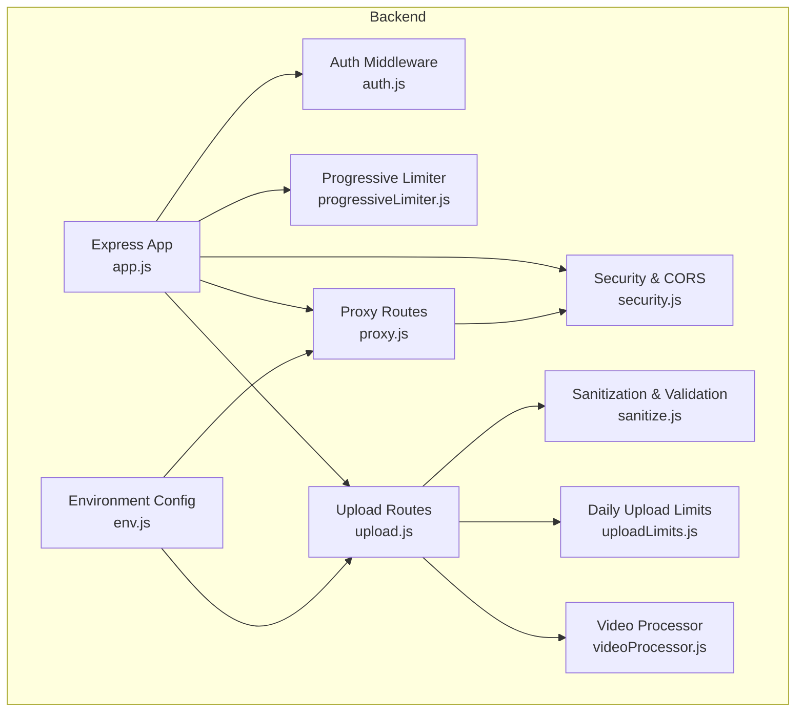
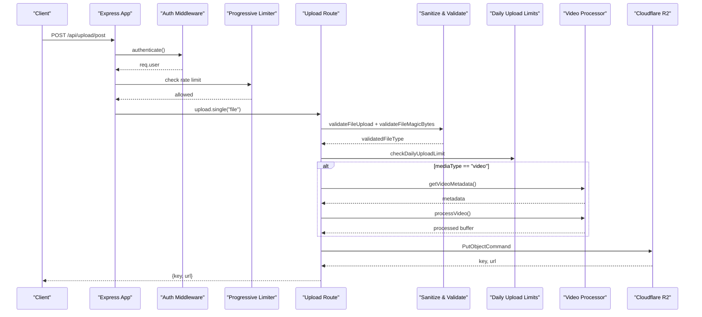
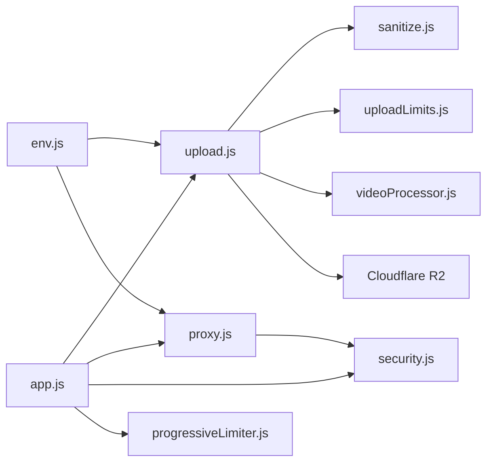

# Upload & Proxy Endpoints

<cite>
**Referenced Files in This Document**
- [upload.js](file://backend/src/routes/upload.js)
- [proxy.js](file://backend/src/routes/proxy.js)
- [sanitize.js](file://backend/src/middleware/sanitize.js)
- [uploadLimits.js](file://backend/src/middleware/uploadLimits.js)
- [videoProcessor.js](file://backend/src/utils/videoProcessor.js)
- [env.js](file://backend/src/config/env.js)
- [.env.example](file://backend/.env.example)
- [app.js](file://backend/src/app.js)
- [security.js](file://backend/src/middleware/security.js)
- [progressiveLimiter.js](file://backend/src/middleware/progressiveLimiter.js)
- [logger.js](file://backend/src/utils/logger.js)
</cite>

## Table of Contents
1. [Introduction](#introduction)
2. [Project Structure](#project-structure)
3. [Core Components](#core-components)
4. [Architecture Overview](#architecture-overview)
5. [Detailed Component Analysis](#detailed-component-analysis)
6. [Dependency Analysis](#dependency-analysis)
7. [Performance Considerations](#performance-considerations)
8. [Troubleshooting Guide](#troubleshooting-guide)
9. [Conclusion](#conclusion)
10. [Appendices](#appendices)

## Introduction
This document provides API documentation for media upload and proxy endpoints. It covers:
- Media upload endpoints for images and videos, including file validation, sanitization, compression, and Cloudflare R2 storage integration.
- Proxy endpoints for external API access, request forwarding, and security considerations.
- Request/response schemas, file size limits, supported formats, and proxy configuration.
- curl examples, upload guidelines, error handling patterns, and security best practices for media processing and external service integration.

## Project Structure
The upload and proxy endpoints are implemented in the backend service under Express.js. Key components:
- Routes: upload and proxy endpoints
- Middleware: authentication, token expiration validation, file validation, request size limits, and rate limiting
- Utilities: video metadata extraction and compression using FFmpeg
- Configuration: environment variables for Cloudflare R2 and CORS



**Diagram sources**
- [app.js](file://backend/src/app.js#L1-L78)
- [upload.js](file://backend/src/routes/upload.js#L1-L225)
- [proxy.js](file://backend/src/routes/proxy.js#L1-L70)
- [sanitize.js](file://backend/src/middleware/sanitize.js#L1-L154)
- [uploadLimits.js](file://backend/src/middleware/uploadLimits.js#L1-L55)
- [videoProcessor.js](file://backend/src/utils/videoProcessor.js#L1-L61)
- [env.js](file://backend/src/config/env.js#L1-L31)

**Section sources**
- [app.js](file://backend/src/app.js#L1-L78)
- [env.js](file://backend/src/config/env.js#L1-L31)

## Core Components
- Upload routes:
  - POST /api/upload/profile: Upload a profile image for an authenticated user
  - POST /api/upload/post: Upload post media (image or video) with compression and R2 storage
- Proxy route:
  - GET /api/proxy?url=<encoded_url>: Proxy media from allowed origins to bypass CORS on Flutter Web

Key validations and protections:
- Authentication and token expiration checks
- File type validation using magic bytes
- Daily upload limit enforcement
- Rate limiting per user/IP
- Video metadata inspection and compression to MP4 with trimming and compression
- Cloudflare R2 storage with cache-control headers

**Section sources**
- [upload.js](file://backend/src/routes/upload.js#L80-L222)
- [proxy.js](file://backend/src/routes/proxy.js#L14-L67)
- [sanitize.js](file://backend/src/middleware/sanitize.js#L31-L99)
- [uploadLimits.js](file://backend/src/middleware/uploadLimits.js#L10-L36)
- [progressiveLimiter.js](file://backend/src/middleware/progressiveLimiter.js#L5-L15)

## Architecture Overview
The upload pipeline integrates Express routes, middleware, and utilities to validate, process, and store media securely.



**Diagram sources**
- [upload.js](file://backend/src/routes/upload.js#L124-L222)
- [sanitize.js](file://backend/src/middleware/sanitize.js#L31-L99)
- [uploadLimits.js](file://backend/src/middleware/uploadLimits.js#L10-L36)
- [videoProcessor.js](file://backend/src/utils/videoProcessor.js#L12-L60)

## Detailed Component Analysis

### Upload Endpoints

#### POST /api/upload/profile
Purpose: Upload a profile image for an authenticated user.

- Authentication: Requires a valid user session
- Validation:
  - Token expiration check
  - File type validation (images only)
- Processing:
  - Generates a unique key under profile-images/{uid}/{uuid}.{ext}
  - Stores to Cloudflare R2 with cache-control headers
- Response:
  - key: Stored object key
  - url: Public URL constructed from R2_PUBLIC_BASE_URL

Security and limits:
- Rate-limited per user/IP
- File size limited by Multer memory storage
- Supported image formats validated via magic bytes

curl example:
- Replace placeholders with your values
- Use multipart form-data with field name file

```bash
curl -X POST https://your-api-base-url/api/upload/profile \
  -H "Authorization: Bearer YOUR_JWT" \
  -F "file=@/path/to/image.jpg"
```

Response schema:
- key: string
- url: string

Error handling:
- 400: Unsupported image format, validation failures
- 401: Unauthorized or expired token
- 429: Rate limit exceeded
- 500: Upload failure

**Section sources**
- [upload.js](file://backend/src/routes/upload.js#L81-L122)
- [sanitize.js](file://backend/src/middleware/sanitize.js#L42-L99)
- [uploadLimits.js](file://backend/src/middleware/uploadLimits.js#L10-L36)
- [progressiveLimiter.js](file://backend/src/middleware/progressiveLimiter.js#L22-L60)

#### POST /api/upload/post
Purpose: Upload post media (image or video) with compression and storage to Cloudflare R2.

- Authentication: Requires a valid user session
- Validation:
  - Token expiration check
  - File type validation (images or videos)
  - mediaType and fileExtension fields validated
- Processing:
  - For images: stored as-is with extension mapping
  - For videos:
    - Writes buffer to temporary file
    - Reads metadata (duration)
    - Processes to MP4 with compression and optional trimming
    - Updates key extension to .mp4
  - Increments daily upload count in Firestore
- Storage:
  - Uses Cloudflare R2 with cache-control headers
- Response:
  - key: Stored object key
  - url: Public URL constructed from R2_PUBLIC_BASE_URL

curl example:
- Replace placeholders with your values
- Use multipart form-data with fields:
  - file: media file
  - mediaType: image or video
  - fileExtension: jpg|jpeg|png|webp|gif|mp4|webm|mov
  - postId: optional, sanitized to alphanumeric, hyphen, underscore, max 100 chars

```bash
curl -X POST https://your-api-base-url/api/upload/post \
  -H "Authorization: Bearer YOUR_JWT" \
  -F "file=@/path/to/media.mp4" \
  -F "mediaType=video" \
  -F "fileExtension=mp4" \
  -F "postId=abc-def-123"
```

Response schema:
- key: string
- url: string

Error handling:
- 400: Missing/invalid parameters, unsupported media type/format, file type mismatch
- 401: Unauthorized or expired token
- 429: Daily upload limit reached (20 uploads/day)
- 500: Processing or storage failure

**Section sources**
- [upload.js](file://backend/src/routes/upload.js#L124-L222)
- [sanitize.js](file://backend/src/middleware/sanitize.js#L31-L99)
- [uploadLimits.js](file://backend/src/middleware/uploadLimits.js#L10-L36)
- [videoProcessor.js](file://backend/src/utils/videoProcessor.js#L12-L60)

### Proxy Endpoint

#### GET /api/proxy?url=<encoded_url>
Purpose: Proxy media from allowed origins to bypass CORS on Flutter Web.

- Allowed origins:
  - media-proxy.beskijosphjr.workers.dev
  - lh3.googleusercontent.com
  - images.unsplash.com
  - R2_PUBLIC_BASE_URL host (from environment)
- Request handling:
  - Validates presence and validity of url query parameter
  - Checks origin against whitelist
  - Fetches upstream with a 15s timeout and a custom User-Agent header
  - Streams response body directly to client
  - Sets Content-Type and optional Content-Length
  - Adds Cache-Control: public, max-age=86400

curl example:
- URL must be percent-encoded

```bash
curl "https://your-api-base-url/api/proxy?url=https%3A%2F%2Flh3.googleusercontent.com%2Fexample.jpg"
```

Response:
- Proxied media stream with appropriate headers

Error handling:
- 400: Missing or invalid url parameter
- 403: Origin not allowed
- 404: Upstream returned non-OK status
- 502: Failed to fetch upstream

Security considerations:
- Origin whitelist prevents abuse
- Timeout prevents hanging requests
- Streaming avoids buffering large payloads

**Section sources**
- [proxy.js](file://backend/src/routes/proxy.js#L14-L67)
- [security.js](file://backend/src/middleware/security.js#L16-L46)

### Supporting Components

#### File Validation and Sanitization
- validateFileUpload:
  - mediaType must be image or video
  - fileExtension must be one of jpg|jpeg|png|webp|gif|mp4|webm|mov
- validateFileMagicBytes:
  - Determines MIME type from buffer
  - Ensures declared mediaType matches detected MIME type
- validateTokenExpiration:
  - Enforces token age limits (relaxed for better UX)
- sanitizeRequest:
  - Applies mongoSanitize, XSS, and HPP cleaning

**Section sources**
- [sanitize.js](file://backend/src/middleware/sanitize.js#L31-L132)

#### Daily Upload Limits
- Enforced via Firestore document per user per day
- Limit: 20 uploads per day
- On success, increments counter with server timestamp

**Section sources**
- [uploadLimits.js](file://backend/src/middleware/uploadLimits.js#L10-L54)

#### Video Processing
- Metadata extraction using ffprobe
- Compression to MP4 with:
  - libx264 video codec
  - aac audio codec
  - CRF 28, preset faster, faststart
- Trimming to maximum duration (default 300s)

**Section sources**
- [videoProcessor.js](file://backend/src/utils/videoProcessor.js#L12-L60)

#### Environment Configuration
- Cloudflare R2:
  - R2_ACCOUNT_ID, R2_ACCESS_KEY_ID, R2_SECRET_ACCESS_KEY, R2_BUCKET_NAME, R2_PUBLIC_BASE_URL
- CORS:
  - CORS_ALLOWED_ORIGINS (comma-separated)
- Other:
  - PORT, NODE_ENV

**Section sources**
- [env.js](file://backend/src/config/env.js#L6-L22)
- [.env.example](file://backend/.env.example#L15-L24)

## Dependency Analysis


**Diagram sources**
- [upload.js](file://backend/src/routes/upload.js#L1-L225)
- [proxy.js](file://backend/src/routes/proxy.js#L1-L70)
- [sanitize.js](file://backend/src/middleware/sanitize.js#L1-L154)
- [uploadLimits.js](file://backend/src/middleware/uploadLimits.js#L1-L55)
- [videoProcessor.js](file://backend/src/utils/videoProcessor.js#L1-L61)
- [env.js](file://backend/src/config/env.js#L1-L31)
- [app.js](file://backend/src/app.js#L1-L78)
- [security.js](file://backend/src/middleware/security.js#L1-L75)
- [progressiveLimiter.js](file://backend/src/middleware/progressiveLimiter.js#L1-L61)

**Section sources**
- [app.js](file://backend/src/app.js#L44-L60)
- [progressiveLimiter.js](file://backend/src/middleware/progressiveLimiter.js#L5-L15)

## Performance Considerations
- Multer memory storage:
  - fileSize limit set to 200 MB for videos
  - files limit set to 1 per request
- Video processing:
  - Compression reduces payload size and improves progressive download
  - Trimming to 300s ensures consistent maximum length
- Rate limiting:
  - Upload policy: 20 requests per 15 minutes per user/IP
  - General API policy: 300 requests per 15 minutes per user/IP
- CORS and timeouts:
  - Strict origin whitelisting for CORS
  - Special handling for multipart and slow routes to avoid premature timeouts

[No sources needed since this section provides general guidance]

## Troubleshooting Guide
Common issues and resolutions:
- File type mismatch:
  - Ensure mediaType matches detected MIME type
  - Supported formats:
    - Images: jpg, jpeg, png, webp, gif
    - Videos: mp4, webm, mov
- Daily upload limit reached:
  - Wait until midnight UTC or contact support
- Proxy origin not allowed:
  - Use allowed origins only (listed in proxy route)
- CORS errors on Flutter Web:
  - Use the proxy endpoint with encoded URL
- Upload failures:
  - Check Cloudflare R2 credentials and bucket permissions
  - Verify R2_PUBLIC_BASE_URL is configured correctly

Logging and monitoring:
- Security events are logged with severity warnings
- Upload and proxy operations are logged with request IDs and metadata

**Section sources**
- [sanitize.js](file://backend/src/middleware/sanitize.js#L42-L99)
- [uploadLimits.js](file://backend/src/middleware/uploadLimits.js#L10-L36)
- [proxy.js](file://backend/src/routes/proxy.js#L32-L37)
- [logger.js](file://backend/src/utils/logger.js#L15-L26)

## Conclusion
The upload and proxy endpoints provide a secure, scalable solution for media handling:
- Robust validation and sanitization prevent malicious uploads
- Daily limits and rate limiting protect system resources
- Video processing ensures consistent, compressed media delivery
- Cloudflare R2 integration offers reliable storage and CDN-like caching
- Proxy endpoint enables seamless media access across origins while maintaining security

[No sources needed since this section summarizes without analyzing specific files]

## Appendices

### API Definitions

#### POST /api/upload/profile
- Headers: Authorization: Bearer <JWT>
- Form Fields:
  - file: binary (image)
- Response:
  - key: string
  - url: string

#### POST /api/upload/post
- Headers: Authorization: Bearer <JWT>
- Form Fields:
  - file: binary (image or video)
  - mediaType: image | video
  - fileExtension: jpg | jpeg | png | webp | gif | mp4 | webm | mov
  - postId: string (optional, sanitized)
- Response:
  - key: string
  - url: string

#### GET /api/proxy
- Query Parameters:
  - url: encoded URL of media
- Response:
  - Media stream with appropriate headers

### Configuration Reference
- R2_ACCOUNT_ID
- R2_ACCESS_KEY_ID
- R2_SECRET_ACCESS_KEY
- R2_BUCKET_NAME
- R2_PUBLIC_BASE_URL
- CORS_ALLOWED_ORIGINS

**Section sources**
- [.env.example](file://backend/.env.example#L15-L24)
- [env.js](file://backend/src/config/env.js#L15-L21)