# Backend Architecture (Node.js)

<cite>
**Referenced Files in This Document**
- [index.js](file://backend/src/index.js)
- [app.js](file://backend/src/app.js)
- [package.json](file://backend/package.json)
- [README.md](file://backend/README.md)
- [env.js](file://backend/src/config/env.js)
- [firebase.js](file://backend/src/config/firebase.js)
- [security.js](file://backend/src/middleware/security.js)
- [auth.js](file://backend/src/middleware/auth.js)
- [deviceContext.js](file://backend/src/middleware/deviceContext.js)
- [progressiveLimiter.js](file://backend/src/middleware/progressiveLimiter.js)
- [rateLimiter.js](file://backend/src/middleware/rateLimiter.js)
- [logger.js](file://backend/src/utils/logger.js)
- [userDisplayName.js](file://backend/src/utils/userDisplayName.js)
- [InteractionGuard.js](file://backend/src/services/InteractionGuard.js)
- [PenaltyBox.js](file://backend/src/services/PenaltyBox.js)
- [RiskEngine.js](file://backend/src/services/RiskEngine.js)
- [auditService.js](file://backend/src/services/auditService.js)
- [auth.js](file://backend/src/routes/auth.js)
- [posts.js](file://backend/src/routes/posts.js)
- [interactions.js](file://backend/src/routes/interactions.js)
- [upload.js](file://backend/src/routes/upload.js)
- [profiles.js](file://backend/src/routes/profiles.js)
- [search.js](file://backend/src/routes/search.js)
- [notifications.js](file://backend/src/routes/notifications.js)
- [proxy.js](file://backend/src/routes/proxy.js)
- [otp.js](file://backend/src/routes/otp.js)
</cite>

## Table of Contents
1. [Introduction](#introduction)
2. [Project Structure](#project-structure)
3. [Core Components](#core-components)
4. [Architecture Overview](#architecture-overview)
5. [Detailed Component Analysis](#detailed-component-analysis)
6. [Dependency Analysis](#dependency-analysis)
7. [Performance Considerations](#performance-considerations)
8. [Troubleshooting Guide](#troubleshooting-guide)
9. [Conclusion](#conclusion)
10. [Appendices](#appendices)

## Introduction
This document describes the backend architecture for the Node.js API server. It covers Express.js server configuration, middleware architecture, routing structure, security layer (JWT, device context, risk assessment), service layer (interaction guard, penalty box, audit logging), CORS and error handling, logging, Firebase Admin SDK integration, and operational concerns such as scalability, performance, and deployment.

## Project Structure
The backend is organized around a modular Express application with clear separation of concerns:
- Entry point initializes the server and sets up graceful shutdown and global error handlers.
- Application bootstrap configures middleware, routes, and centralized error handling.
- Configuration loads environment variables and initializes Firebase Admin SDK.
- Middleware enforces security, CORS, request shaping, timeouts, and rate limiting.
- Routes define public and protected endpoints grouped by domain.
- Services encapsulate business logic for risk, penalties, interaction guards, and audit logging.
- Utilities provide logging and shared helpers.

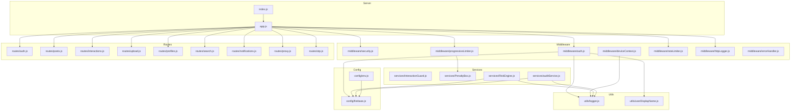

**Diagram sources**
- [index.js](file://backend/src/index.js#L1-L37)
- [app.js](file://backend/src/app.js#L1-L78)
- [env.js](file://backend/src/config/env.js#L1-L31)
- [firebase.js](file://backend/src/config/firebase.js)
- [security.js](file://backend/src/middleware/security.js#L1-L75)
- [auth.js](file://backend/src/middleware/auth.js#L1-L164)
- [deviceContext.js](file://backend/src/middleware/deviceContext.js#L1-L24)
- [progressiveLimiter.js](file://backend/src/middleware/progressiveLimiter.js#L1-L61)
- [rateLimiter.js](file://backend/src/middleware/rateLimiter.js#L1-L76)
- [logger.js](file://backend/src/utils/logger.js)
- [userDisplayName.js](file://backend/src/utils/userDisplayName.js)
- [InteractionGuard.js](file://backend/src/services/InteractionGuard.js#L1-L124)
- [PenaltyBox.js](file://backend/src/services/PenaltyBox.js#L1-L108)
- [RiskEngine.js](file://backend/src/services/RiskEngine.js#L1-L170)
- [auditService.js](file://backend/src/services/auditService.js#L1-L33)
- [auth.js](file://backend/src/routes/auth.js#L1-L301)
- [posts.js](file://backend/src/routes/posts.js)
- [interactions.js](file://backend/src/routes/interactions.js)
- [upload.js](file://backend/src/routes/upload.js)
- [profiles.js](file://backend/src/routes/profiles.js)
- [search.js](file://backend/src/routes/search.js)
- [notifications.js](file://backend/src/routes/notifications.js)
- [proxy.js](file://backend/src/routes/proxy.js)
- [otp.js](file://backend/src/routes/otp.js)

**Section sources**
- [index.js](file://backend/src/index.js#L1-L37)
- [app.js](file://backend/src/app.js#L1-L78)
- [README.md](file://backend/README.md#L1-L338)

## Core Components
- Express server bootstrap and graceful shutdown.
- Centralized middleware pipeline: security headers, CORS, request logging, request shaping, timeouts.
- Progressive rate limiting with in-memory penalty tracking and global pressure awareness.
- Authentication middleware supporting both custom short-lived JWT and Firebase ID tokens with revocation checks and user caching.
- Device context hashing for privacy-preserving fingerprinting.
- Risk engine evaluating refresh token continuity and session anomalies.
- Interaction guard preventing abusive toggling and enforcing velocity caps.
- Audit logging service for immutable security events.
- Firebase Admin SDK integration for authentication verification and Firestore operations.

**Section sources**
- [index.js](file://backend/src/index.js#L1-L37)
- [app.js](file://backend/src/app.js#L1-L78)
- [security.js](file://backend/src/middleware/security.js#L1-L75)
- [progressiveLimiter.js](file://backend/src/middleware/progressiveLimiter.js#L1-L61)
- [rateLimiter.js](file://backend/src/middleware/rateLimiter.js#L1-L76)
- [auth.js](file://backend/src/middleware/auth.js#L1-L164)
- [deviceContext.js](file://backend/src/middleware/deviceContext.js#L1-L24)
- [RiskEngine.js](file://backend/src/services/RiskEngine.js#L1-L170)
- [InteractionGuard.js](file://backend/src/services/InteractionGuard.js#L1-L124)
- [auditService.js](file://backend/src/services/auditService.js#L1-L33)
- [env.js](file://backend/src/config/env.js#L1-L31)
- [firebase.js](file://backend/src/config/firebase.js)

## Architecture Overview
The server follows a layered architecture:
- Transport and HTTP layer: Express app with trust-proxy enabled for accurate client IP detection.
- Security and logging layer: Helmet headers, CORS, request timeout, and structured HTTP logging.
- Request shaping: JSON/URL-encoded bodies with size limits and request timeout enforcement.
- Routing layer: Public routes (OTP, proxy, auth) and protected routes (uploads, interactions, posts, profiles, search, notifications) with progressive rate limiting.
- Service layer: Risk engine, penalty box, interaction guard, and audit logging.
- Persistence and identity: Firebase Admin SDK for authentication and Firestore.

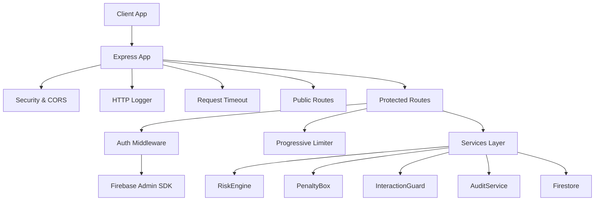

**Diagram sources**
- [app.js](file://backend/src/app.js#L1-L78)
- [security.js](file://backend/src/middleware/security.js#L1-L75)
- [auth.js](file://backend/src/middleware/auth.js#L1-L164)
- [progressiveLimiter.js](file://backend/src/middleware/progressiveLimiter.js#L1-L61)
- [RiskEngine.js](file://backend/src/services/RiskEngine.js#L1-L170)
- [PenaltyBox.js](file://backend/src/services/PenaltyBox.js#L1-L108)
- [InteractionGuard.js](file://backend/src/services/InteractionGuard.js#L1-L124)
- [auditService.js](file://backend/src/services/auditService.js#L1-L33)
- [firebase.js](file://backend/src/config/firebase.js)

## Detailed Component Analysis

### Express Server Bootstrap and Graceful Shutdown
- Initializes the Express app and binds to the configured port with host binding for containerized environments.
- Sets up SIGTERM/SIGINT handlers for graceful shutdown with a timeout.
- Catches unhandled rejections and uncaught exceptions and logs them.

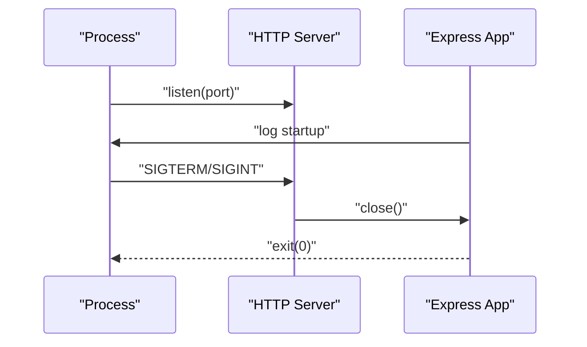

**Diagram sources**
- [index.js](file://backend/src/index.js#L1-L37)

**Section sources**
- [index.js](file://backend/src/index.js#L1-L37)

### Middleware Pipeline
- Security headers: Helmet configured for API-only mode with relaxed cross-origin policies to support Flutter Web image loading.
- CORS: Origin whitelisting controlled by environment variables; allows all in non-production for development.
- Request timeout: Skips hard timeout for multipart uploads, slow routes (posts, proxy, interactions), and applies a 15-second timeout otherwise.
- Request shaping: JSON and URL-encoded bodies with 1 MB limits; request timeout middleware attached after parsers.

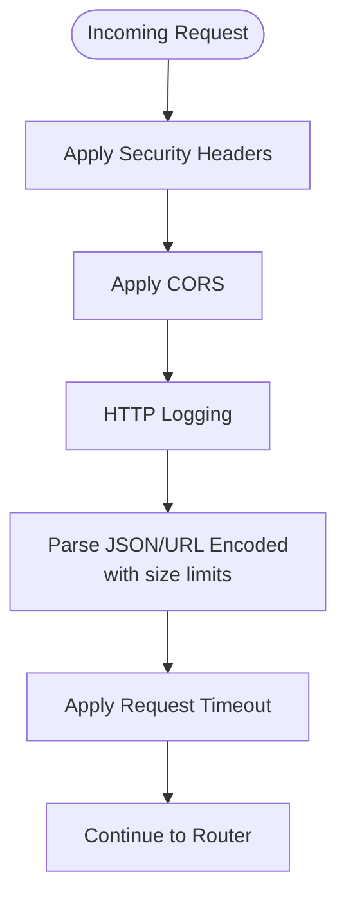

**Diagram sources**
- [app.js](file://backend/src/app.js#L1-L78)
- [security.js](file://backend/src/middleware/security.js#L1-L75)

**Section sources**
- [app.js](file://backend/src/app.js#L1-L78)
- [security.js](file://backend/src/middleware/security.js#L1-L75)

### Authentication Middleware
- Supports two token types:
  - Custom short-lived JWT (when configured) verified with a dedicated secret; attaches user profile with display name resolution and role/status.
  - Firebase ID token with revocation check enabled; fetches user profile from Firestore and attaches sanitized user info.
- Implements token version checks for instant kill switch and account suspension checks.
- Uses an in-memory cache for user profiles with TTL to reduce Firestore calls.

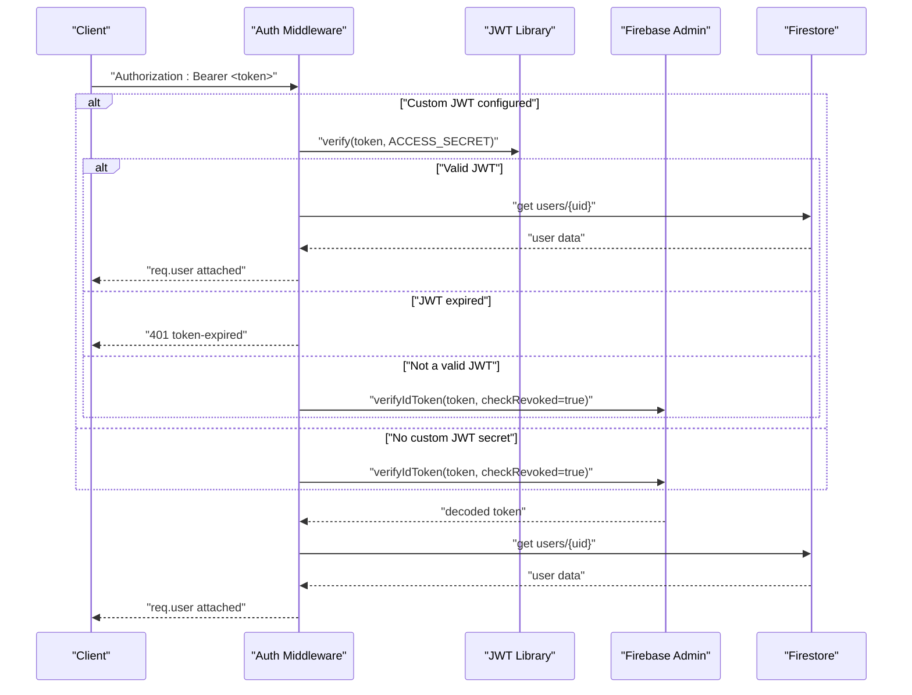

**Diagram sources**
- [auth.js](file://backend/src/middleware/auth.js#L1-L164)
- [firebase.js](file://backend/src/config/firebase.js)
- [userDisplayName.js](file://backend/src/utils/userDisplayName.js)

**Section sources**
- [auth.js](file://backend/src/middleware/auth.js#L1-L164)
- [userDisplayName.js](file://backend/src/utils/userDisplayName.js)

### Device Context and Privacy-Focused Fingerprinting
- Extracts client IP, User-Agent, and optional device ID from headers.
- Hashes each component using SHA-256 to avoid storing raw PII.
- Enforces device ID requirement for refresh endpoint.

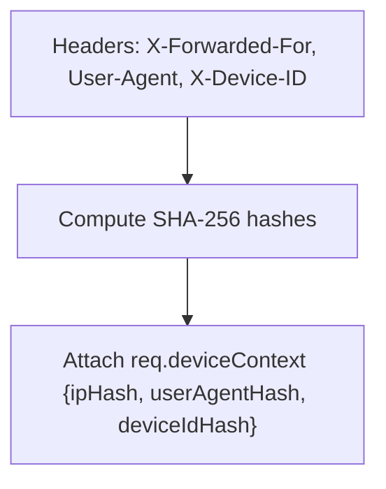

**Diagram sources**
- [deviceContext.js](file://backend/src/middleware/deviceContext.js#L1-L24)

**Section sources**
- [deviceContext.js](file://backend/src/middleware/deviceContext.js#L1-L24)

### Progressive Rate Limiting and Penalty Box
- Centralized policy map defines per-action limits and windows.
- Uses an in-memory PenaltyBox to track:
  - Per-key counters within a sliding window.
  - Global pressure threshold to mitigate volumetric attacks.
  - Progressive blocking with escalating penalties (5 min, 30 min, 24 h).
- Returns tailored responses for rate limit violations and global pressure conditions.

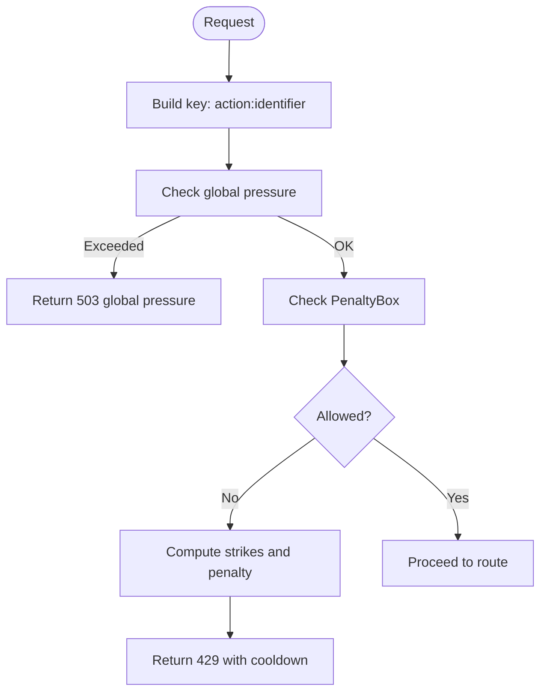

**Diagram sources**
- [progressiveLimiter.js](file://backend/src/middleware/progressiveLimiter.js#L1-L61)
- [PenaltyBox.js](file://backend/src/services/PenaltyBox.js#L1-L108)

**Section sources**
- [progressiveLimiter.js](file://backend/src/middleware/progressiveLimiter.js#L1-L61)
- [PenaltyBox.js](file://backend/src/services/PenaltyBox.js#L1-L108)

### Risk Assessment Engine
- Evaluates refresh risk by comparing device/user-agent/IP hashes against stored session fingerprints.
- Applies temporal decay to risk scores based on last seen time.
- Determines thresholds for soft lock (require re-login) and hard burn (full session burn).
- Validates session continuity (concurrent refresh races, frequency abuse, active session caps).
- Executes full session burn by revoking refresh tokens and incrementing user token version.

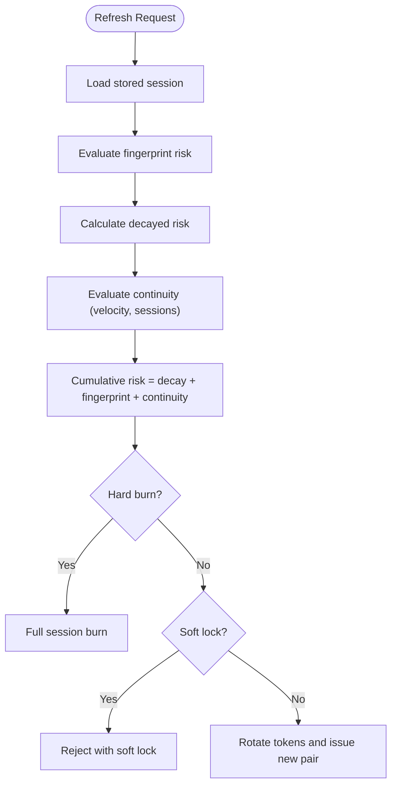

**Diagram sources**
- [RiskEngine.js](file://backend/src/services/RiskEngine.js#L1-L170)

**Section sources**
- [RiskEngine.js](file://backend/src/services/RiskEngine.js#L1-L170)

### Interaction Guard
- Prevents abusive toggling (e.g., like/unlike, follow/unfollow) with:
  - Pair toggle cooldown (e.g., 3 seconds).
  - Cycle detection (e.g., 3 cycles within 60 seconds) resulting in shadow suppression or block.
- Enforces global velocity caps per user (e.g., likes: 20/min, 60/hour; follows: 5/min, 30/hour).
- Uses an in-memory store with periodic cleanup to avoid memory leaks.

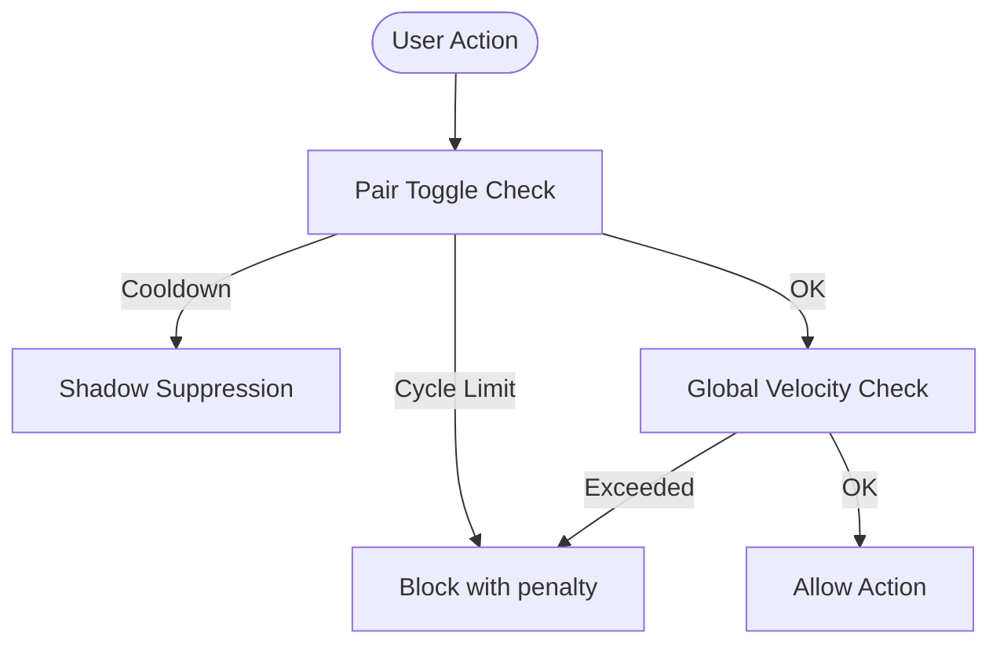

**Diagram sources**
- [InteractionGuard.js](file://backend/src/services/InteractionGuard.js#L1-L124)

**Section sources**
- [InteractionGuard.js](file://backend/src/services/InteractionGuard.js#L1-L124)

### Audit Logging Service
- Writes immutable audit logs to Firestore with request metadata and device context.
- Emits structured logs for real-time observability.
- Handles failures gracefully without impacting request flow.

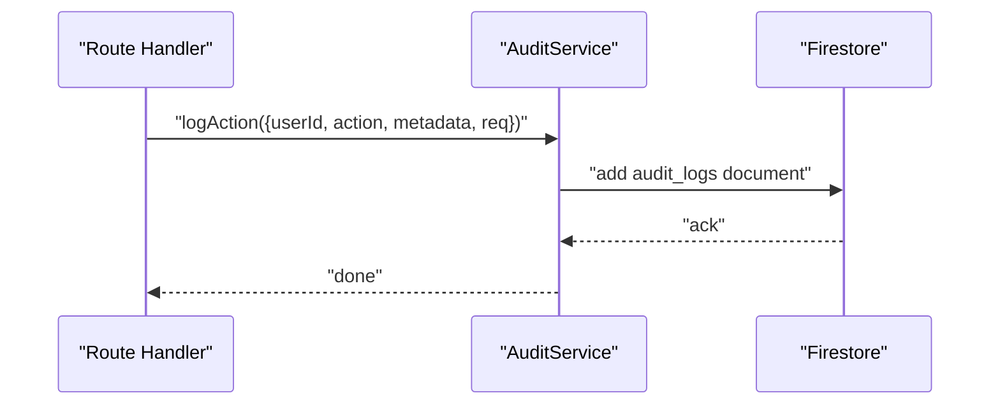

**Diagram sources**
- [auditService.js](file://backend/src/services/auditService.js#L1-L33)

**Section sources**
- [auditService.js](file://backend/src/services/auditService.js#L1-L33)

### Routing Structure
- Public routes:
  - OTP, proxy, auth (mounted under /api/otp, /api/proxy, /api/auth).
  - Health check endpoint with a dedicated limiter.
- Protected routes:
  - Upload, interactions, posts, profiles, search, notifications.
  - Mounted with authentication and progressive rate limiting middleware.
- 404 handler and centralized error handler are registered last.

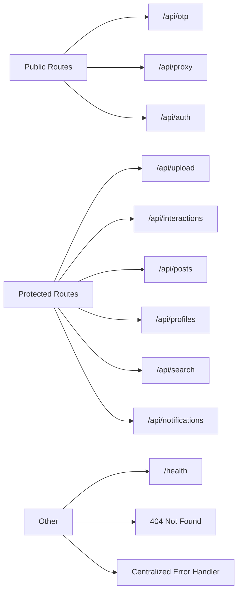

**Diagram sources**
- [app.js](file://backend/src/app.js#L1-L78)

**Section sources**
- [app.js](file://backend/src/app.js#L1-L78)

### JWT Token System
- Token exchange:
  - Verifies Firebase ID token.
  - Initializes or heals user document with display name and username.
  - Issues custom access/refresh token pair with versioning and rotation support.
  - Stores refresh token with device/user-agent/IP hashes and risk tracking.
- Refresh flow:
  - Validates signature and anti-replay using Firestore.
  - Enforces strict device ID match and evaluates session continuity and risk.
  - Applies soft lock or hard burn based on risk thresholds.
  - Rotates tokens and updates refresh token chain.

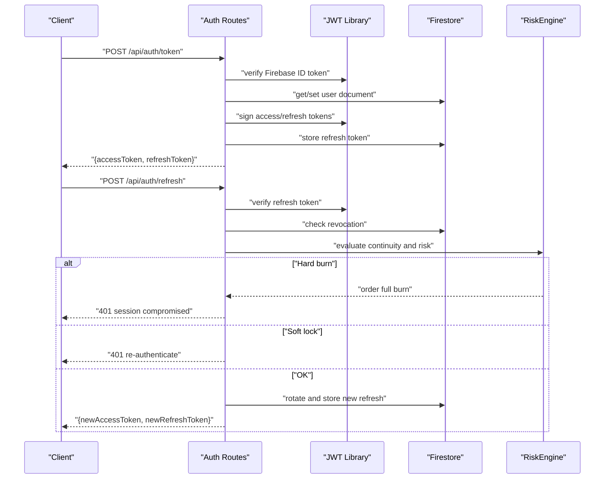

**Diagram sources**
- [auth.js](file://backend/src/routes/auth.js#L1-L301)
- [RiskEngine.js](file://backend/src/services/RiskEngine.js#L1-L170)

**Section sources**
- [auth.js](file://backend/src/routes/auth.js#L1-L301)

### Firebase Admin SDK Integration
- Environment configuration loads Firebase project credentials and R2 settings.
- Authentication middleware verifies Firebase ID tokens with revocation checks.
- Routes and services use Firestore for user profiles, refresh tokens, and audit logs.

**Section sources**
- [env.js](file://backend/src/config/env.js#L1-L31)
- [auth.js](file://backend/src/middleware/auth.js#L1-L164)
- [auth.js](file://backend/src/routes/auth.js#L1-L301)
- [RiskEngine.js](file://backend/src/services/RiskEngine.js#L1-L170)
- [auditService.js](file://backend/src/services/auditService.js#L1-L33)

### CORS Configuration
- Origins are controlled by environment variables; defaults vary by environment.
- Methods, allowed headers, and credentials are explicitly configured.
- Preflight requests are handled without throwing to avoid blocking legitimate requests.

**Section sources**
- [security.js](file://backend/src/middleware/security.js#L16-L46)

### Error Handling Patterns
- Centralized error handler registered last to catch unhandled errors.
- Route handlers return structured error responses with codes and messages.
- Global uncaught exception and unhandled rejection handlers log and exit safely.

**Section sources**
- [app.js](file://backend/src/app.js#L62-L75)
- [index.js](file://backend/src/index.js#L29-L36)

### Logging Mechanisms
- Structured logging via a logger utility integrated with HTTP logging middleware.
- Log levels and sensitive data filtering are documented.
- Audit logs are written to Firestore and mirrored to console for observability.

**Section sources**
- [logger.js](file://backend/src/utils/logger.js)
- [README.md](file://backend/README.md#L164-L182)
- [auditService.js](file://backend/src/services/auditService.js#L1-L33)

## Dependency Analysis
- Core runtime: Express, Firebase Admin SDK, Pino for logging.
- Security: Helmet, CORS, rate limiting, slow-down, input validators, sanitizers.
- File handling: Multer, file-type for magic-byte validation.
- Observability: Sentry (optional), Winston (alternative), Pino-http.

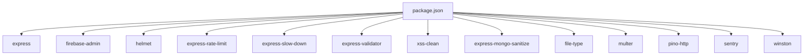

**Diagram sources**
- [package.json](file://backend/package.json#L1-L56)

**Section sources**
- [package.json](file://backend/package.json#L1-L56)

## Performance Considerations
- Startup and request overhead are optimized with early middleware and minimal parsing.
- In-memory caches (user profiles, penalty box, interaction guard) reduce database and computation costs.
- Progressive rate limiting prevents overload and mitigates abuse with gradual penalties.
- Request timeouts are tuned to avoid blocking long-running operations while protecting the server.

[No sources needed since this section provides general guidance]

## Troubleshooting Guide
- Environment variables: Ensure all required variables are present and correctly formatted.
- Firebase initialization: Verify private key formatting and credentials validity.
- CORS issues: Confirm allowed origins and environment mode.
- Rate limit errors: Review policy windows and identifiers; adjust limits if needed.
- Logs: Check combined and error logs for security events and request tracing.

**Section sources**
- [README.md](file://backend/README.md#L311-L330)

## Conclusion
The backend employs a robust, layered architecture emphasizing security, resilience, and observability. The combination of progressive rate limiting, risk-aware refresh flows, interaction guards, and comprehensive audit logging provides strong protection against abuse. The modular design and clear separation of concerns facilitate maintainability and scalability.

[No sources needed since this section summarizes without analyzing specific files]

## Appendices

### System Context Diagram: Server-Client Interactions
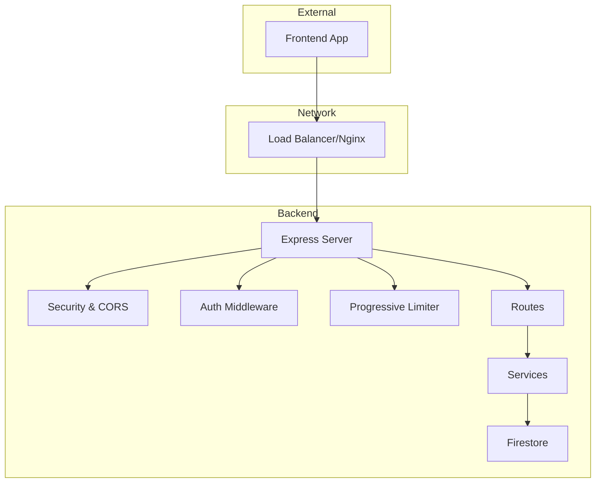

**Diagram sources**
- [app.js](file://backend/src/app.js#L1-L78)
- [auth.js](file://backend/src/middleware/auth.js#L1-L164)
- [progressiveLimiter.js](file://backend/src/middleware/progressiveLimiter.js#L1-L61)
- [firebase.js](file://backend/src/config/firebase.js)