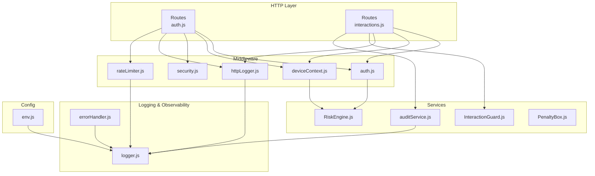
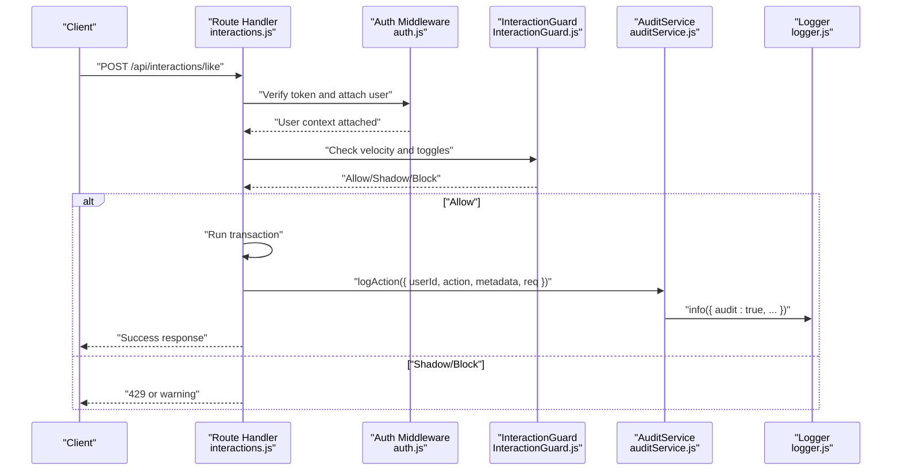
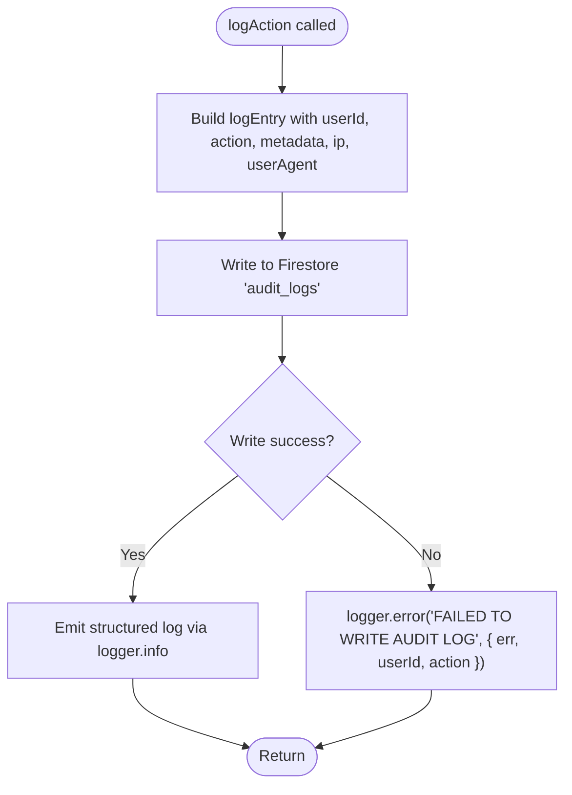
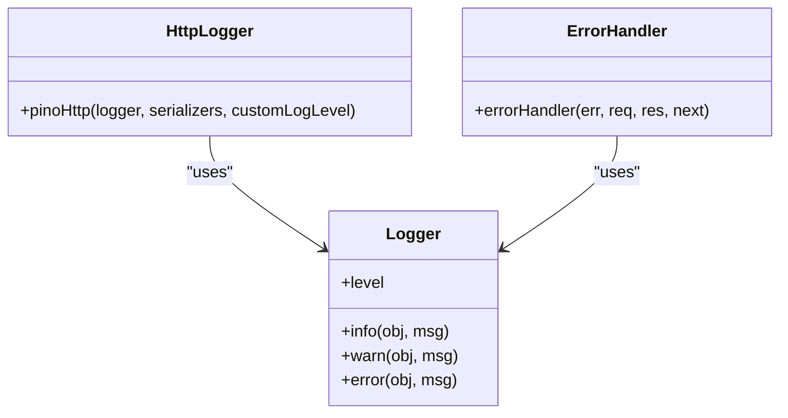
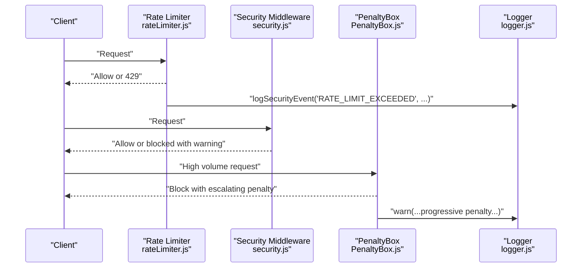
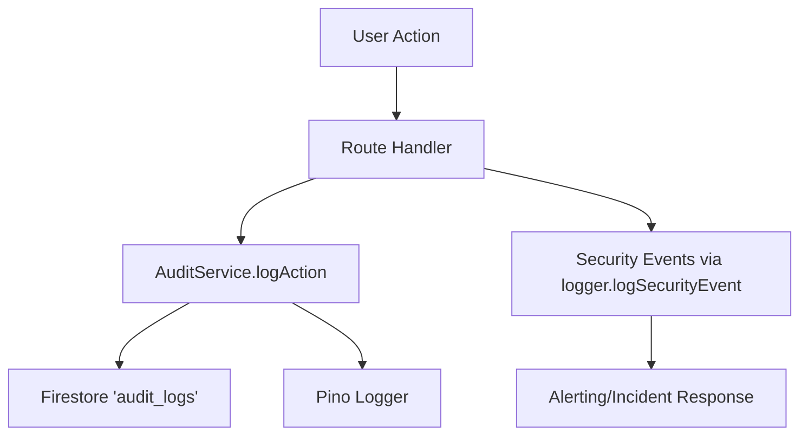
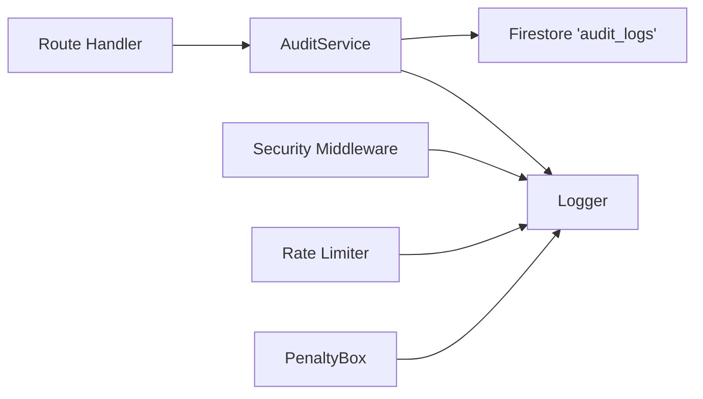

# Audit Service

<cite>
**Referenced Files in This Document**
- [auditService.js](file://backend/src/services/auditService.js)
- [logger.js](file://backend/src/utils/logger.js)
- [httpLogger.js](file://backend/src/middleware/httpLogger.js)
- [errorHandler.js](file://backend/src/middleware/errorHandler.js)
- [security.js](file://backend/src/middleware/security.js)
- [rateLimiter.js](file://backend/src/middleware/rateLimiter.js)
- [auth.js](file://backend/src/middleware/auth.js)
- [deviceContext.js](file://backend/src/middleware/deviceContext.js)
- [RiskEngine.js](file://backend/src/services/RiskEngine.js)
- [InteractionGuard.js](file://backend/src/services/InteractionGuard.js)
- [PenaltyBox.js](file://backend/src/services/PenaltyBox.js)
- [auth.js](file://backend/src/routes/auth.js)
- [interactions.js](file://backend/src/routes/interactions.js)
- [env.js](file://backend/src/config/env.js)
- [AWS_PRODUCTION_DEPLOYMENT.md](file://backend/AWS_PRODUCTION_DEPLOYMENT.md)
- [SECURITY.md](file://testpro-main/SECURITY.md)
</cite>

## Table of Contents
1. [Introduction](#introduction)
2. [Project Structure](#project-structure)
3. [Core Components](#core-components)
4. [Architecture Overview](#architecture-overview)
5. [Detailed Component Analysis](#detailed-component-analysis)
6. [Dependency Analysis](#dependency-analysis)
7. [Performance Considerations](#performance-considerations)
8. [Troubleshooting Guide](#troubleshooting-guide)
9. [Conclusion](#conclusion)
10. [Appendices](#appendices)

## Introduction
This document describes the audit service and its integration with logging, compliance tracking, and security monitoring systems. It explains how audit trails are generated, how event logging works, and how compliance reporting can be supported. It also covers integration with security monitoring systems, real-time alerting, audit log structure, retention considerations, data protection measures, and performance optimization for high-volume logging operations.

## Project Structure
The audit service is implemented as a dedicated service that writes immutable audit entries to a Firestore collection and emits structured logs for real-time observability. Supporting components include:
- Centralized logging via Pino
- HTTP request logging
- Security middleware (CORS, timeouts, headers)
- Rate limiting and progressive penalties
- Authentication and device context extraction
- Risk engine and guard services for behavioral anomaly detection
- Routes that trigger audit logging upon successful operations

**Diagram sources**
- [auth.js](file://backend/src/routes/auth.js#L1-L301)
- [interactions.js](file://backend/src/routes/interactions.js#L1-L522)
- [auth.js](file://backend/src/middleware/auth.js#L1-L164)
- [deviceContext.js](file://backend/src/middleware/deviceContext.js#L1-L24)
- [security.js](file://backend/src/middleware/security.js#L1-L75)
- [httpLogger.js](file://backend/src/middleware/httpLogger.js#L1-L21)
- [rateLimiter.js](file://backend/src/middleware/rateLimiter.js#L1-L76)
- [auditService.js](file://backend/src/services/auditService.js#L1-L33)
- [RiskEngine.js](file://backend/src/services/RiskEngine.js#L1-L170)
- [InteractionGuard.js](file://backend/src/services/InteractionGuard.js#L1-L124)
- [PenaltyBox.js](file://backend/src/services/PenaltyBox.js#L1-L108)
- [logger.js](file://backend/src/utils/logger.js#L1-L29)
- [errorHandler.js](file://backend/src/middleware/errorHandler.js#L1-L35)
- [env.js](file://backend/src/config/env.js#L1-L31)

**Section sources**
- [auditService.js](file://backend/src/services/auditService.js#L1-L33)
- [logger.js](file://backend/src/utils/logger.js#L1-L29)
- [httpLogger.js](file://backend/src/middleware/httpLogger.js#L1-L21)
- [errorHandler.js](file://backend/src/middleware/errorHandler.js#L1-L35)
- [security.js](file://backend/src/middleware/security.js#L1-L75)
- [rateLimiter.js](file://backend/src/middleware/rateLimiter.js#L1-L76)
- [auth.js](file://backend/src/middleware/auth.js#L1-L164)
- [deviceContext.js](file://backend/src/middleware/deviceContext.js#L1-L24)
- [RiskEngine.js](file://backend/src/services/RiskEngine.js#L1-L170)
- [InteractionGuard.js](file://backend/src/services/InteractionGuard.js#L1-L124)
- [PenaltyBox.js](file://backend/src/services/PenaltyBox.js#L1-L108)
- [auth.js](file://backend/src/routes/auth.js#L1-L301)
- [interactions.js](file://backend/src/routes/interactions.js#L1-L522)
- [env.js](file://backend/src/config/env.js#L1-L31)

## Core Components
- Audit Service: Writes immutable audit entries to Firestore and emits structured logs for real-time observability. It captures user identity, action, timestamp, IP, and user agent.
- Logger: Centralized Pino logger with configurable log level and pretty-printing in non-production environments.
- HTTP Logger: Structured HTTP request logging with dynamic log levels based on response status.
- Security Middleware: Applies secure headers, strict CORS, and request timeouts.
- Rate Limiters: Express-based rate limiting with progressive slowdown and security event logging.
- Authentication and Device Context: Verifies tokens, attaches user context, and extracts hashed device identifiers for privacy.
- Risk Engine: Evaluates refresh risk, session continuity, and executes containment actions.
- Interaction Guard: Prevents graph abuse via pair-toggle and velocity checks.
- Penalty Box: Progressive blocking with memory caps and decay.

**Section sources**
- [auditService.js](file://backend/src/services/auditService.js#L8-L30)
- [logger.js](file://backend/src/utils/logger.js#L3-L13)
- [httpLogger.js](file://backend/src/middleware/httpLogger.js#L4-L18)
- [security.js](file://backend/src/middleware/security.js#L10-L74)
- [rateLimiter.js](file://backend/src/middleware/rateLimiter.js#L6-L75)
- [auth.js](file://backend/src/middleware/auth.js#L20-L161)
- [deviceContext.js](file://backend/src/middleware/deviceContext.js#L7-L23)
- [RiskEngine.js](file://backend/src/services/RiskEngine.js#L11-L130)
- [InteractionGuard.js](file://backend/src/services/InteractionGuard.js#L22-L98)
- [PenaltyBox.js](file://backend/src/services/PenaltyBox.js#L22-L87)

## Architecture Overview
The audit service integrates with request lifecycle hooks to capture meaningful events. Successful operations trigger asynchronous audit logging, while security events are emitted through the centralized logger. Security middleware and guards provide layered protections and generate security events for alerting.

**Diagram sources**
- [interactions.js](file://backend/src/routes/interactions.js#L28-L102)
- [auth.js](file://backend/src/middleware/auth.js#L20-L161)
- [InteractionGuard.js](file://backend/src/services/InteractionGuard.js#L47-L80)
- [auditService.js](file://backend/src/services/auditService.js#L9-L29)
- [logger.js](file://backend/src/utils/logger.js#L20-L26)

**Section sources**
- [interactions.js](file://backend/src/routes/interactions.js#L28-L102)
- [auth.js](file://backend/src/middleware/auth.js#L20-L161)
- [InteractionGuard.js](file://backend/src/services/InteractionGuard.js#L47-L80)
- [auditService.js](file://backend/src/services/auditService.js#L9-L29)
- [logger.js](file://backend/src/utils/logger.js#L20-L26)

## Detailed Component Analysis

### Audit Service
- Purpose: Record sensitive actions to an immutable collection and emit structured logs for real-time observability.
- Data model: Includes user identifier, action type, server timestamp, metadata, IP, and user agent.
- Resilience: Failure to write audit logs does not abort the main request; failures are logged.

**Diagram sources**
- [auditService.js](file://backend/src/services/auditService.js#L9-L29)

**Section sources**
- [auditService.js](file://backend/src/services/auditService.js#L8-L30)

### Logging and Observability
- Centralized logger: Pino with configurable level and pretty printing in development.
- HTTP logging: Structured logs with dynamic levels based on response status and request context.
- Error handling: Comprehensive error logging with request context and optional stack traces.

**Diagram sources**
- [logger.js](file://backend/src/utils/logger.js#L3-L13)
- [httpLogger.js](file://backend/src/middleware/httpLogger.js#L4-L18)
- [errorHandler.js](file://backend/src/middleware/errorHandler.js#L3-L14)

**Section sources**
- [logger.js](file://backend/src/utils/logger.js#L1-L29)
- [httpLogger.js](file://backend/src/middleware/httpLogger.js#L1-L21)
- [errorHandler.js](file://backend/src/middleware/errorHandler.js#L1-L35)

### Security Monitoring and Alerting
- Security headers and CORS: Helmet and strict origin whitelisting with warnings for blocked origins.
- Request timeouts: Hard timeout for most JSON/REST requests, with exceptions for slow routes.
- Rate limiting: Multiple limiters with security event logging on limit exceeded.
- Device context: Hashed identifiers to avoid storing raw IPs and user agents.
- Risk engine: Evaluates refresh risk, session continuity, and executes full session burns when necessary.
- Penalty box: Progressive blocking with escalating penalties and memory leak prevention.

**Diagram sources**
- [rateLimiter.js](file://backend/src/middleware/rateLimiter.js#L6-L41)
- [security.js](file://backend/src/middleware/security.js#L25-L46)
- [PenaltyBox.js](file://backend/src/services/PenaltyBox.js#L22-L87)
- [logger.js](file://backend/src/utils/logger.js#L20-L26)

**Section sources**
- [security.js](file://backend/src/middleware/security.js#L10-L74)
- [rateLimiter.js](file://backend/src/middleware/rateLimiter.js#L6-L75)
- [deviceContext.js](file://backend/src/middleware/deviceContext.js#L7-L23)
- [RiskEngine.js](file://backend/src/services/RiskEngine.js#L136-L168)
- [PenaltyBox.js](file://backend/src/services/PenaltyBox.js#L3-L14)

### Compliance Reporting and Security Incident Documentation
- Audit trail: Immutable records in Firestore with timestamps and contextual metadata.
- Security events: Logged with severity and structured context for alerting and incident response.
- Authentication and refresh flow: Device and user agent hashing, token versioning, and containment actions.
- Operational security: Production deployment guidance includes Fail2Ban integration and memory bounds.

**Diagram sources**
- [interactions.js](file://backend/src/routes/interactions.js#L84-L91)
- [auditService.js](file://backend/src/services/auditService.js#L9-L29)
- [logger.js](file://backend/src/utils/logger.js#L20-L26)

**Section sources**
- [auditService.js](file://backend/src/services/auditService.js#L9-L29)
- [interactions.js](file://backend/src/routes/interactions.js#L84-L91)
- [auth.js](file://backend/src/routes/auth.js#L166-L280)
- [RiskEngine.js](file://backend/src/services/RiskEngine.js#L136-L168)
- [AWS_PRODUCTION_DEPLOYMENT.md](file://backend/AWS_PRODUCTION_DEPLOYMENT.md#L169-L196)

### Audit Scenarios and Examples
- Like toggle: On success, the service logs an audit entry for the like/unlike action with post identifier.
- Comment creation: On success, the service logs an audit entry for the comment creation with post and comment identifiers.
- Authentication token issuance: Logs security-relevant context for token exchange.
- Refresh token rotation: Evaluates risk and may trigger containment actions documented in audit logs.

**Section sources**
- [interactions.js](file://backend/src/routes/interactions.js#L28-L102)
- [interactions.js](file://backend/src/routes/interactions.js#L109-L171)
- [auth.js](file://backend/src/routes/auth.js#L20-L159)
- [auth.js](file://backend/src/routes/auth.js#L166-L280)

### Configuration Options for Logging Levels
- Log level: Controlled by environment variable with a default applied at initialization.
- Transport: Pretty printing in non-production; production uses default transport.
- HTTP logging levels: Dynamic based on response status and error presence.

**Section sources**
- [logger.js](file://backend/src/utils/logger.js#L3-L13)
- [httpLogger.js](file://backend/src/middleware/httpLogger.js#L13-L17)
- [env.js](file://backend/src/config/env.js#L7-L8)

### Integration Patterns with Security Infrastructure
- Rate limit exceeded: Emits security events for alerting and potential Fail2Ban enforcement.
- CORS blocked: Emits warnings for blocked origins.
- Progressive penalties: Enables integration with perimeter defense systems.
- Device context hashing: Reduces PII in logs and databases.

**Section sources**
- [rateLimiter.js](file://backend/src/middleware/rateLimiter.js#L12-L21)
- [security.js](file://backend/src/middleware/security.js#L38-L40)
- [PenaltyBox.js](file://backend/src/services/PenaltyBox.js#L70-L87)
- [deviceContext.js](file://backend/src/middleware/deviceContext.js#L16-L20)

## Dependency Analysis
The audit service depends on:
- Firestore client for writing immutable logs
- Centralized logger for structured logging and security event emission
- Request context (IP and user agent) passed from route handlers

**Diagram sources**
- [auditService.js](file://backend/src/services/auditService.js#L1-L33)
- [interactions.js](file://backend/src/routes/interactions.js#L84-L91)
- [auth.js](file://backend/src/routes/auth.js#L166-L280)
- [logger.js](file://backend/src/utils/logger.js#L20-L26)
- [rateLimiter.js](file://backend/src/middleware/rateLimiter.js#L12-L21)
- [PenaltyBox.js](file://backend/src/services/PenaltyBox.js#L83-L86)

**Section sources**
- [auditService.js](file://backend/src/services/auditService.js#L1-L3)
- [interactions.js](file://backend/src/routes/interactions.js#L84-L91)
- [auth.js](file://backend/src/routes/auth.js#L166-L280)
- [logger.js](file://backend/src/utils/logger.js#L20-L26)
- [rateLimiter.js](file://backend/src/middleware/rateLimiter.js#L12-L21)
- [PenaltyBox.js](file://backend/src/services/PenaltyBox.js#L83-L86)

## Performance Considerations
- Asynchronous audit logging: Ensures audit writes do not block primary request handling.
- Centralized logging: Minimizes duplication and leverages efficient transports.
- Memory-safe guards: In-memory stores with periodic cleanup to prevent leaks.
- Rate limiting and progressive penalties: Reduce load and deter abuse.
- Production deployment guidance: Includes memory bounds and Fail2Ban integration for resilience.

**Section sources**
- [auditService.js](file://backend/src/services/auditService.js#L23-L28)
- [InteractionGuard.js](file://backend/src/services/InteractionGuard.js#L7-L14)
- [PenaltyBox.js](file://backend/src/services/PenaltyBox.js#L13-L14)
- [AWS_PRODUCTION_DEPLOYMENT.md](file://backend/AWS_PRODUCTION_DEPLOYMENT.md#L157-L167)
- [AWS_PRODUCTION_DEPLOYMENT.md](file://backend/AWS_PRODUCTION_DEPLOYMENT.md#L169-L196)

## Troubleshooting Guide
- Audit log write failures: The system logs the failure and continues; investigate underlying Firestore connectivity or permissions.
- Excessive 429 responses: Review rate limiter configurations and consider adjusting limits or enabling progressive slowdown.
- CORS blocked requests: Inspect allowed origins and environment configuration; warnings are emitted for blocked origins.
- Authentication errors: Validate token configuration and user profile status; errors include structured codes for diagnosis.
- Security incidents: Use security events and audit logs to reconstruct timelines; consider containment actions executed by the risk engine.

**Section sources**
- [auditService.js](file://backend/src/services/auditService.js#L24-L28)
- [rateLimiter.js](file://backend/src/middleware/rateLimiter.js#L12-L21)
- [security.js](file://backend/src/middleware/security.js#L38-L40)
- [auth.js](file://backend/src/middleware/auth.js#L142-L157)
- [RiskEngine.js](file://backend/src/services/RiskEngine.js#L136-L168)

## Conclusion
The audit service provides a robust foundation for compliance tracking and security monitoring by capturing immutable audit entries and emitting structured logs. Integrated with security middleware, rate limiting, and risk engines, it supports real-time alerting and incident response. The design emphasizes resilience, performance, and operational safety, with clear pathways for compliance reporting and security incident documentation.

## Appendices

### Audit Log Structure
- Fields: user identifier, action type, server timestamp, metadata, IP hash, user agent hash
- Storage: Firestore collection for immutable audit trail
- Emission: Structured logs via centralized logger for observability

**Section sources**
- [auditService.js](file://backend/src/services/auditService.js#L11-L18)

### Retention Policies and Data Protection Measures
- Retention: Not defined in code; configure external archival or database retention policies as needed.
- Data protection: Device context hashing avoids storing raw PII; security headers and CORS mitigate exposure.

**Section sources**
- [deviceContext.js](file://backend/src/middleware/deviceContext.js#L16-L20)
- [security.js](file://backend/src/middleware/security.js#L10-L14)

### Compliance Reporting Features
- Audit trail generation: Immutable records with timestamps and context.
- Security event logging: Structured warnings and alerts for suspicious activities.
- Authentication and refresh flow: Device and user agent hashing, token versioning, and containment actions.

**Section sources**
- [auditService.js](file://backend/src/services/auditService.js#L9-L29)
- [auth.js](file://backend/src/routes/auth.js#L166-L280)
- [RiskEngine.js](file://backend/src/services/RiskEngine.js#L136-L168)

### Security Incident Documentation
- Containment actions: Full session burns and token version bumps executed by the risk engine.
- Operational security: Deployment guidance includes Fail2Ban integration and memory bounds.

**Section sources**
- [RiskEngine.js](file://backend/src/services/RiskEngine.js#L136-L168)
- [AWS_PRODUCTION_DEPLOYMENT.md](file://backend/AWS_PRODUCTION_DEPLOYMENT.md#L169-L196)
- [SECURITY.md](file://testpro-main/SECURITY.md#L134-L155)