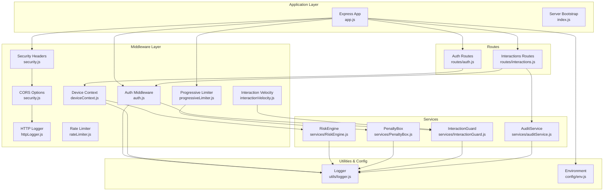
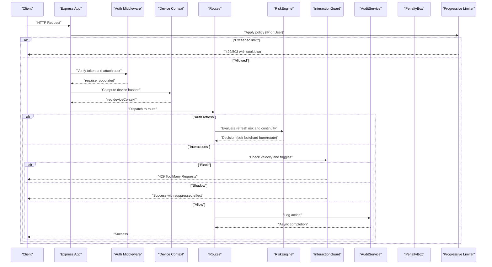
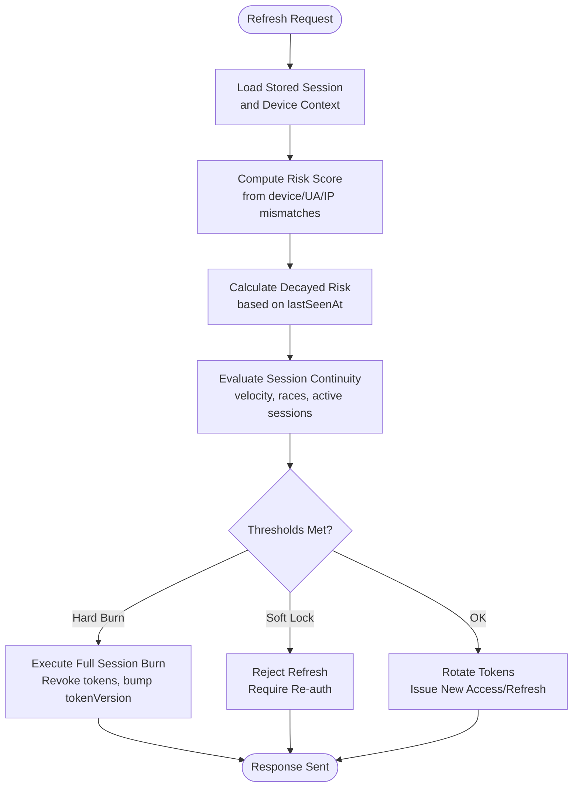
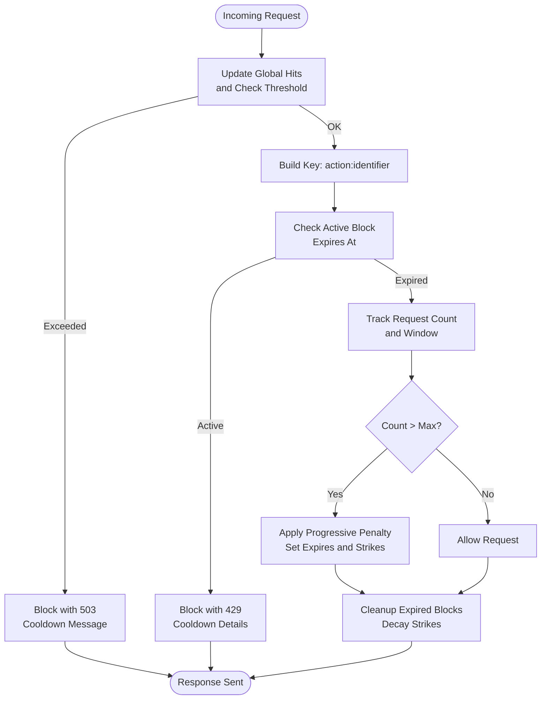
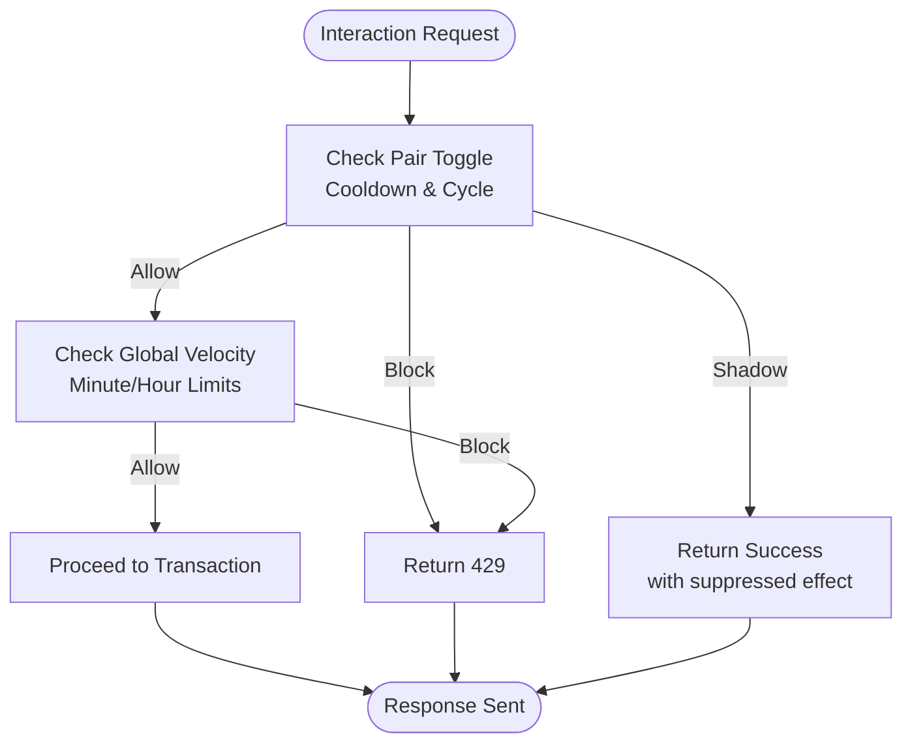
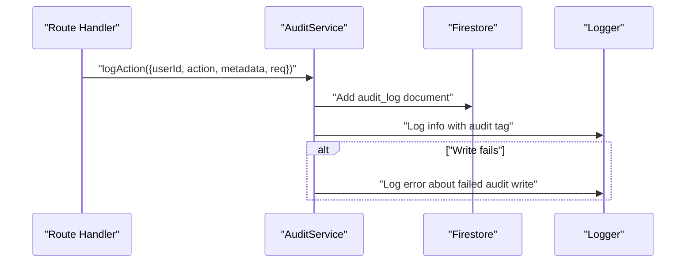
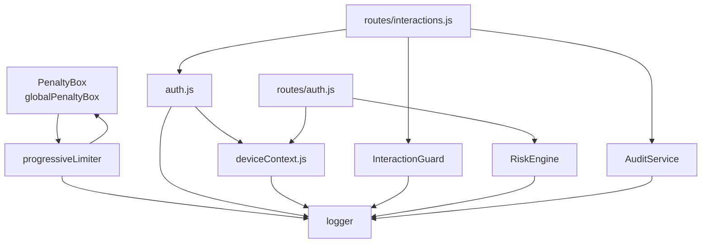

# Data Services

<cite>
**Referenced Files in This Document**
- [RiskEngine.js](file://backend/src/services/RiskEngine.js)
- [PenaltyBox.js](file://backend/src/services/PenaltyBox.js)
- [InteractionGuard.js](file://backend/src/services/InteractionGuard.js)
- [auditService.js](file://backend/src/services/auditService.js)
- [progressiveLimiter.js](file://backend/src/middleware/progressiveLimiter.js)
- [rateLimiter.js](file://backend/src/middleware/rateLimiter.js)
- [auth.js](file://backend/src/middleware/auth.js)
- [deviceContext.js](file://backend/src/middleware/deviceContext.js)
- [interactionVelocity.js](file://backend/src/middleware/interactionVelocity.js)
- [auth.js](file://backend/src/routes/auth.js)
- [interactions.js](file://backend/src/routes/interactions.js)
- [app.js](file://backend/src/app.js)
- [index.js](file://backend/src/index.js)
- [logger.js](file://backend/src/utils/logger.js)
- [env.js](file://backend/src/config/env.js)
</cite>

## Table of Contents
1. [Introduction](#introduction)
2. [Project Structure](#project-structure)
3. [Core Components](#core-components)
4. [Architecture Overview](#architecture-overview)
5. [Detailed Component Analysis](#detailed-component-analysis)
6. [Dependency Analysis](#dependency-analysis)
7. [Performance Considerations](#performance-considerations)
8. [Troubleshooting Guide](#troubleshooting-guide)
9. [Conclusion](#conclusion)
10. [Appendices](#appendices)

## Introduction
This document describes the backend service layer architecture with a focus on four core services:
- RiskEngine: Advanced security risk assessment, session continuity intelligence, and containment actions for suspicious refresh token usage.
- PenaltyBox: Progressive rate limiting and user punishment with global pressure monitoring and memory-safe eviction.
- InteractionGuard: Content moderation and abuse prevention for interactions (likes, follows) with hybrid behavioral controls (allow, shadow suppress, block).
- AuditService: Immutable audit logging for compliance and security monitoring.

It explains service initialization, dependency injection patterns, inter-service communication, configuration options, performance characteristics, and integration with middleware layers. It also provides usage examples and guidelines for developing custom services.

## Project Structure
The backend is organized around Express application orchestration, middleware layers, and modular services:
- Application bootstrap and routing are defined in the Express app and index files.
- Middleware layers handle authentication, device fingerprinting, rate limiting, and interaction velocity.
- Services encapsulate domain logic for risk, penalties, guards, and audit logging.
- Utilities and configuration provide logging and environment settings.

**Diagram sources**
- [app.js](file://backend/src/app.js#L1-L78)
- [index.js](file://backend/src/index.js#L1-L37)
- [auth.js](file://backend/src/middleware/auth.js#L1-L164)
- [deviceContext.js](file://backend/src/middleware/deviceContext.js#L1-L24)
- [interactionVelocity.js](file://backend/src/middleware/interactionVelocity.js#L1-L62)
- [progressiveLimiter.js](file://backend/src/middleware/progressiveLimiter.js#L1-L61)
- [rateLimiter.js](file://backend/src/middleware/rateLimiter.js#L1-L76)
- [auth.js](file://backend/src/routes/auth.js#L1-L301)
- [interactions.js](file://backend/src/routes/interactions.js#L1-L522)
- [RiskEngine.js](file://backend/src/services/RiskEngine.js#L1-L170)
- [PenaltyBox.js](file://backend/src/services/PenaltyBox.js#L1-L108)
- [InteractionGuard.js](file://backend/src/services/InteractionGuard.js#L1-L124)
- [auditService.js](file://backend/src/services/auditService.js#L1-L33)
- [logger.js](file://backend/src/utils/logger.js#L1-L29)
- [env.js](file://backend/src/config/env.js#L1-L31)

**Section sources**
- [app.js](file://backend/src/app.js#L1-L78)
- [index.js](file://backend/src/index.js#L1-L37)
- [env.js](file://backend/src/config/env.js#L1-L31)

## Core Components
This section introduces each service and its primary responsibilities.

- RiskEngine
  - Evaluates refresh token risk using device, user agent, and IP hash comparisons.
  - Computes decayed risk scores over time.
  - Enforces hard burn (full session containment) and soft lock thresholds.
  - Performs temporal and behavioral session continuity checks.
  - Executes global session burns and token version increments.

- PenaltyBox
  - Implements a high-speed in-memory progressive rate limiter with global pressure monitoring.
  - Applies escalating penalties (5 min, 30 min, 24 h) based on strike counts.
  - Includes periodic cleanup to prevent memory leaks.

- InteractionGuard
  - Enforces hybrid behavioral model for interactions (likes, follows).
  - Provides pair-toggle cooldown and cycle detection to prevent rapid toggling.
  - Enforces global velocity caps per user to prevent abuse.
  - Supports shadow suppression (allow but ignore) and strict blocking.

- AuditService
  - Logs sensitive actions to an immutable audit collection.
  - Captures user identity, action, metadata, IP, and user agent.
  - Emits structured logs for real-time observability and resilience against logging failures.

**Section sources**
- [RiskEngine.js](file://backend/src/services/RiskEngine.js#L1-L170)
- [PenaltyBox.js](file://backend/src/services/PenaltyBox.js#L1-L108)
- [InteractionGuard.js](file://backend/src/services/InteractionGuard.js#L1-L124)
- [auditService.js](file://backend/src/services/auditService.js#L1-L33)

## Architecture Overview
The system integrates services through middleware and routes. Authentication and device context are prerequisites for risk evaluation and interaction guard enforcement. Progressive rate limiting applies both IP-based and user-based policies. Audit logging is invoked after successful operations.

**Diagram sources**
- [app.js](file://backend/src/app.js#L1-L78)
- [progressiveLimiter.js](file://backend/src/middleware/progressiveLimiter.js#L1-L61)
- [auth.js](file://backend/src/middleware/auth.js#L1-L164)
- [deviceContext.js](file://backend/src/middleware/deviceContext.js#L1-L24)
- [auth.js](file://backend/src/routes/auth.js#L1-L301)
- [interactions.js](file://backend/src/routes/interactions.js#L1-L522)
- [RiskEngine.js](file://backend/src/services/RiskEngine.js#L1-L170)
- [InteractionGuard.js](file://backend/src/services/InteractionGuard.js#L1-L124)
- [auditService.js](file://backend/src/services/auditService.js#L1-L33)
- [PenaltyBox.js](file://backend/src/services/PenaltyBox.js#L1-L108)

## Detailed Component Analysis

### RiskEngine Service
RiskEngine centralizes security logic for refresh token lifecycle and session continuity.

- Risk Evaluation
  - Compares device, user agent, and IP hashes to detect anomalies.
  - Computes decayed risk based on elapsed time since last seen.
  - Aggregates risk with continuity and additional risk signals.

- Session Continuity Intelligence
  - Scans recent refresh tokens for concurrent refresh races, velocity spikes, and excessive active sessions.
  - Returns actions: ok, hard_burn, or additional risk adjustments.

- Containment Actions
  - Hard burn: full session invalidation and token version increment.
  - Soft lock: reject refresh with re-authentication requirement while preserving other sessions.

**Diagram sources**
- [RiskEngine.js](file://backend/src/services/RiskEngine.js#L1-L170)
- [auth.js](file://backend/src/routes/auth.js#L166-L280)

**Section sources**
- [RiskEngine.js](file://backend/src/services/RiskEngine.js#L1-L170)
- [auth.js](file://backend/src/routes/auth.js#L166-L280)

### PenaltyBox Service
PenaltyBox provides a high-performance, in-memory progressive rate limiter with global pressure awareness.

- Global Pressure Monitoring
  - Tracks requests per second across the entire process.
  - Immediately rejects traffic when thresholds are exceeded.

- Per-Key Rate Limiting
  - Maintains counters and first-request timestamps per key (action:identifier).
  - Enforces configurable max requests per window.

- Progressive Penalties
  - Escalates penalties on repeated violations: 5 min, 30 min, 24 h.
  - Uses decay to reduce strikes over time.

- Memory Safety
  - Periodic cleanup removes expired blocks.
  - Caps the number of tracked entries to prevent memory exhaustion.

**Diagram sources**
- [PenaltyBox.js](file://backend/src/services/PenaltyBox.js#L1-L108)
- [progressiveLimiter.js](file://backend/src/middleware/progressiveLimiter.js#L1-L61)

**Section sources**
- [PenaltyBox.js](file://backend/src/services/PenaltyBox.js#L1-L108)
- [progressiveLimiter.js](file://backend/src/middleware/progressiveLimiter.js#L1-L61)

### InteractionGuard Service
InteractionGuard enforces behavioral controls for interactions to prevent abuse and maintain graph integrity.

- Pair Toggle Controls
  - Enforces cooldown and cycle limits for toggles (e.g., like/unlike, follow/unfollow).
  - Supports shadow suppression to silently ignore rapid toggles without signaling throttling.

- Global Velocity Limits
  - Tracks per-user minute and hourly rates for likes and follows.
  - Blocks when limits are exceeded.

- Hybrid Behavioral Model
  - Returns allow, shadow, or block decisions based on thresholds.
  - Integrates with middleware wrappers to intercept requests before database writes.

**Diagram sources**
- [InteractionGuard.js](file://backend/src/services/InteractionGuard.js#L1-L124)
- [interactionVelocity.js](file://backend/src/middleware/interactionVelocity.js#L1-L62)
- [interactions.js](file://backend/src/routes/interactions.js#L28-L103)

**Section sources**
- [InteractionGuard.js](file://backend/src/services/InteractionGuard.js#L1-L124)
- [interactionVelocity.js](file://backend/src/middleware/interactionVelocity.js#L1-L62)
- [interactions.js](file://backend/src/routes/interactions.js#L28-L103)

### AuditService
AuditService ensures immutable logging of sensitive actions for compliance and security monitoring.

- Logging Behavior
  - Writes structured entries to a dedicated collection with server timestamps.
  - Captures user identity, action, metadata, IP, and user agent.
  - Emits a separate log entry for real-time observability.

- Resilience
  - Non-fatal logging failures are captured and logged to prevent cascading errors.

**Diagram sources**
- [auditService.js](file://backend/src/services/auditService.js#L1-L33)
- [interactions.js](file://backend/src/routes/interactions.js#L84-L91)

**Section sources**
- [auditService.js](file://backend/src/services/auditService.js#L1-L33)
- [interactions.js](file://backend/src/routes/interactions.js#L84-L91)

## Dependency Analysis
This section maps dependencies among services and middleware, highlighting coupling and cohesion.

**Diagram sources**
- [progressiveLimiter.js](file://backend/src/middleware/progressiveLimiter.js#L1-L61)
- [PenaltyBox.js](file://backend/src/services/PenaltyBox.js#L1-L108)
- [auth.js](file://backend/src/middleware/auth.js#L1-L164)
- [deviceContext.js](file://backend/src/middleware/deviceContext.js#L1-L24)
- [auth.js](file://backend/src/routes/auth.js#L1-L301)
- [interactions.js](file://backend/src/routes/interactions.js#L1-L522)
- [InteractionGuard.js](file://backend/src/services/InteractionGuard.js#L1-L124)
- [auditService.js](file://backend/src/services/auditService.js#L1-L33)
- [logger.js](file://backend/src/utils/logger.js#L1-L29)

**Section sources**
- [progressiveLimiter.js](file://backend/src/middleware/progressiveLimiter.js#L1-L61)
- [PenaltyBox.js](file://backend/src/services/PenaltyBox.js#L1-L108)
- [auth.js](file://backend/src/middleware/auth.js#L1-L164)
- [deviceContext.js](file://backend/src/middleware/deviceContext.js#L1-L24)
- [auth.js](file://backend/src/routes/auth.js#L1-L301)
- [interactions.js](file://backend/src/routes/interactions.js#L1-L522)
- [InteractionGuard.js](file://backend/src/services/InteractionGuard.js#L1-L124)
- [auditService.js](file://backend/src/services/auditService.js#L1-L33)
- [logger.js](file://backend/src/utils/logger.js#L1-L29)

## Performance Considerations
- In-Memory Data Structures
  - PenaltyBox and InteractionGuard rely on Map-based stores for O(1) average-time operations.
  - Periodic cleanup prevents memory growth; ensure cleanup intervals align with expected traffic patterns.

- Database Queries
  - RiskEngine’s continuity checks fetch recent tokens; keep the limit reasonable and consider indexing refresh_tokens by userId and createdAt.

- Logging Overhead
  - AuditService writes are asynchronous and non-blocking; still monitor throughput under high load.

- Middleware Ordering
  - Mount progressive limiter before authentication for user-based policies; mount deviceContext before routes requiring risk evaluation.

- Global Pressure
  - PenaltyBox’s global hits counter provides early saturation protection; tune thresholds according to infrastructure capacity.

[No sources needed since this section provides general guidance]

## Troubleshooting Guide
- Authentication Failures
  - Verify JWT secrets are configured; ensure token version alignment and account status checks are functioning.

- Rate Limiting Responses
  - Review progressive limiter policies and identifiers (IP vs. User ID). Investigate frequent 429 responses indicating aggressive penalties.

- InteractionGuard Behavior
  - Rapid toggles may trigger shadow suppression; confirm cooldown and cycle limits are appropriate for the UX.

- Audit Logging Issues
  - Check for failures during audit log writes; ensure the audit collection is reachable and properly indexed.

- RiskEngine Containment
  - Hard burns indicate strong risk signals; verify device context correctness and session continuity thresholds.

**Section sources**
- [auth.js](file://backend/src/middleware/auth.js#L1-L164)
- [progressiveLimiter.js](file://backend/src/middleware/progressiveLimiter.js#L1-L61)
- [interactionVelocity.js](file://backend/src/middleware/interactionVelocity.js#L1-L62)
- [auditService.js](file://backend/src/services/auditService.js#L1-L33)
- [RiskEngine.js](file://backend/src/services/RiskEngine.js#L1-L170)

## Conclusion
The backend employs a layered architecture where middleware orchestrates authentication, device context, and rate limiting, while specialized services encapsulate risk assessment, progressive penalties, interaction moderation, and audit logging. The design emphasizes resilience, performance, and scalability through in-memory structures, careful database access patterns, and non-blocking logging. Adhering to the documented patterns enables safe extension and customization of services.

[No sources needed since this section summarizes without analyzing specific files]

## Appendices

### Service Initialization and Dependency Injection Patterns
- Global Singletons
  - PenaltyBox exposes a global instance for centralized rate limiting across routes.
  - InteractionGuard and RiskEngine expose static methods for functional composition.

- Middleware Integration
  - progressiveLimiter injects PenaltyBox into the request pipeline.
  - deviceContext injects hashed device identifiers for downstream services.
  - auth attaches user context for user-based policies.

- Route-Level Orchestration
  - Auth routes call RiskEngine for refresh risk and continuity.
  - Interactions routes call InteractionGuard via middleware wrappers and AuditService after transactions.

**Section sources**
- [PenaltyBox.js](file://backend/src/services/PenaltyBox.js#L107-L108)
- [progressiveLimiter.js](file://backend/src/middleware/progressiveLimiter.js#L1-L61)
- [deviceContext.js](file://backend/src/middleware/deviceContext.js#L1-L24)
- [auth.js](file://backend/src/routes/auth.js#L166-L280)
- [interactions.js](file://backend/src/routes/interactions.js#L28-L103)

### Configuration Options
- Environment Variables
  - PORT, NODE_ENV, CORS_ALLOWED_ORIGINS, FIREBASE_PROJECT_ID, FIREBASE_PRIVATE_KEY, FIREBASE_CLIENT_EMAIL, R2_ACCOUNT_ID, R2_ACCESS_KEY_ID, R2_SECRET_ACCESS_KEY, R2_BUCKET_NAME, R2_PUBLIC_BASE_URL.
  - JWT_ACCESS_SECRET and JWT_REFRESH_SECRET for secure token issuance.

- Logging
  - LOG_LEVEL controls verbosity; production environments disable pretty printing.

- Rate Limit Policies
  - POLICIES define per-action limits and windows; adjust based on traffic patterns and abuse signals.

**Section sources**
- [env.js](file://backend/src/config/env.js#L1-L31)
- [logger.js](file://backend/src/utils/logger.js#L1-L29)
- [progressiveLimiter.js](file://backend/src/middleware/progressiveLimiter.js#L1-L61)

### Inter-Service Communication
- RiskEngine
  - Called by auth routes to evaluate refresh risk and continuity; triggers full session burns when necessary.

- PenaltyBox
  - Consumed by progressiveLimiter to enforce global and per-key limits; emits security events via logger.

- InteractionGuard
  - Consumed by interactionVelocity middleware to decide allow/shadow/block outcomes.

- AuditService
  - Invoked by interaction routes after successful transactions to record immutable logs.

**Section sources**
- [RiskEngine.js](file://backend/src/services/RiskEngine.js#L1-L170)
- [PenaltyBox.js](file://backend/src/services/PenaltyBox.js#L1-L108)
- [InteractionGuard.js](file://backend/src/services/InteractionGuard.js#L1-L124)
- [auditService.js](file://backend/src/services/auditService.js#L1-L33)
- [progressiveLimiter.js](file://backend/src/middleware/progressiveLimiter.js#L1-L61)
- [interactionVelocity.js](file://backend/src/middleware/interactionVelocity.js#L1-L62)
- [interactions.js](file://backend/src/routes/interactions.js#L84-L91)

### Examples of Service Usage
- Progressive Rate Limiting
  - Mount progressiveLimiter('auth') on authentication endpoints; mount progressiveLimiter('api', true) on protected routes using user IDs.

- Risk Evaluation on Refresh
  - After verifying refresh tokens, call RiskEngine.evaluateSessionContinuity and apply hard burn or soft lock decisions accordingly.

- Interaction Moderation
  - Wrap like and follow endpoints with enforceLikeVelocity and enforceFollowVelocity middleware to apply InteractionGuard logic.

- Audit Logging
  - Call AuditService.logAction with userId, action, metadata, and request context after successful operations.

**Section sources**
- [app.js](file://backend/src/app.js#L22-L60)
- [progressiveLimiter.js](file://backend/src/middleware/progressiveLimiter.js#L1-L61)
- [auth.js](file://backend/src/routes/auth.js#L166-L280)
- [interactions.js](file://backend/src/routes/interactions.js#L28-L103)
- [auditService.js](file://backend/src/services/auditService.js#L1-L33)

### Custom Service Development Guidelines
- Encapsulate Domain Logic
  - Keep services cohesive and focused on a single responsibility (risk, penalties, guard, audit).

- Favor Static Methods or Singletons
  - Use static methods for pure computations (RiskEngine, InteractionGuard) and a singleton for stateful rate limiting (PenaltyBox).

- Leverage Middleware
  - Inject services via middleware to keep routes thin and reusable.

- Respect Performance Boundaries
  - Prefer in-memory structures with periodic cleanup; minimize database reads in hot paths.

- Ensure Non-Blocking Operations
  - Make logging and external writes asynchronous to avoid impacting request latency.

- Document Security Events
  - Emit structured security events for observability and incident response.

[No sources needed since this section provides general guidance]