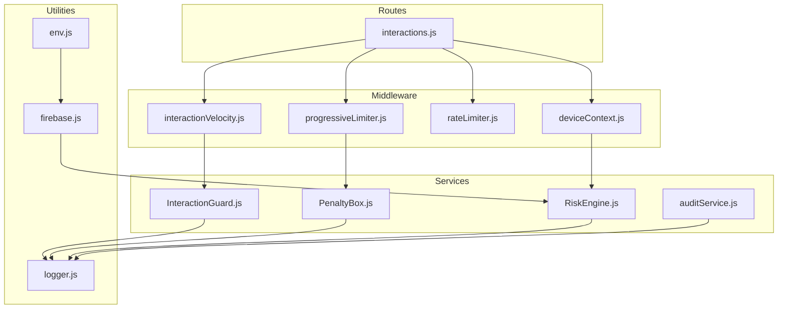
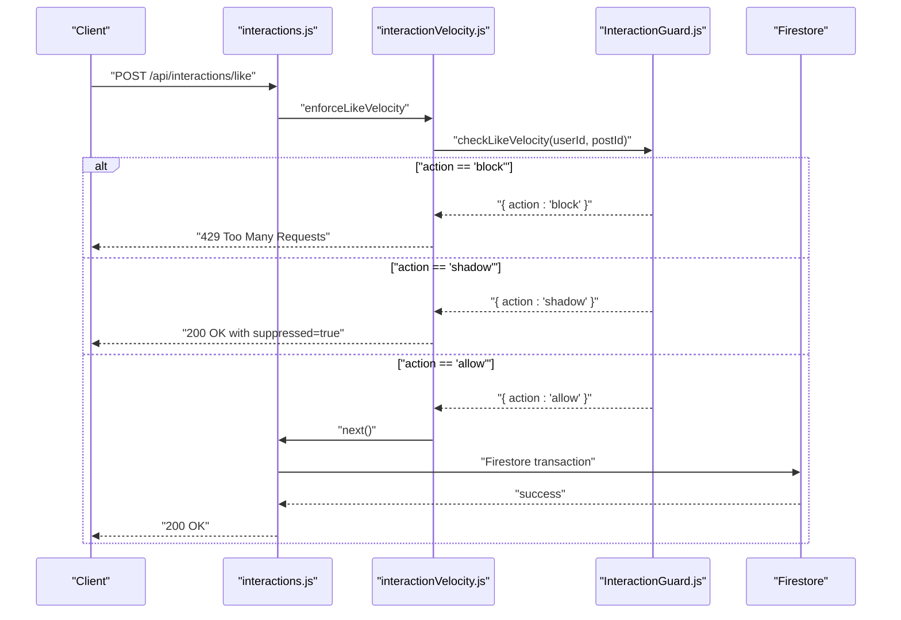
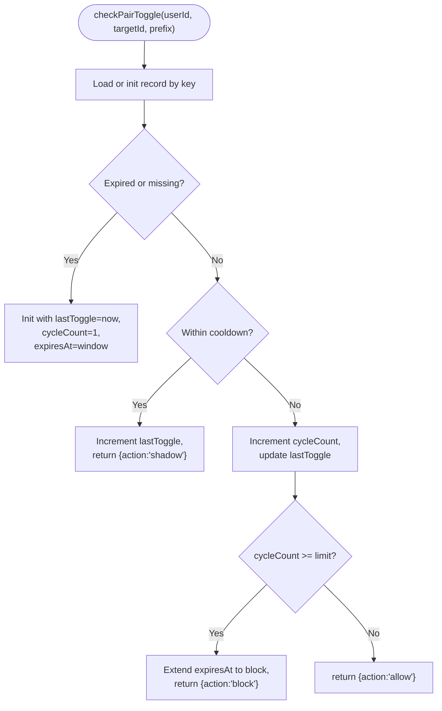
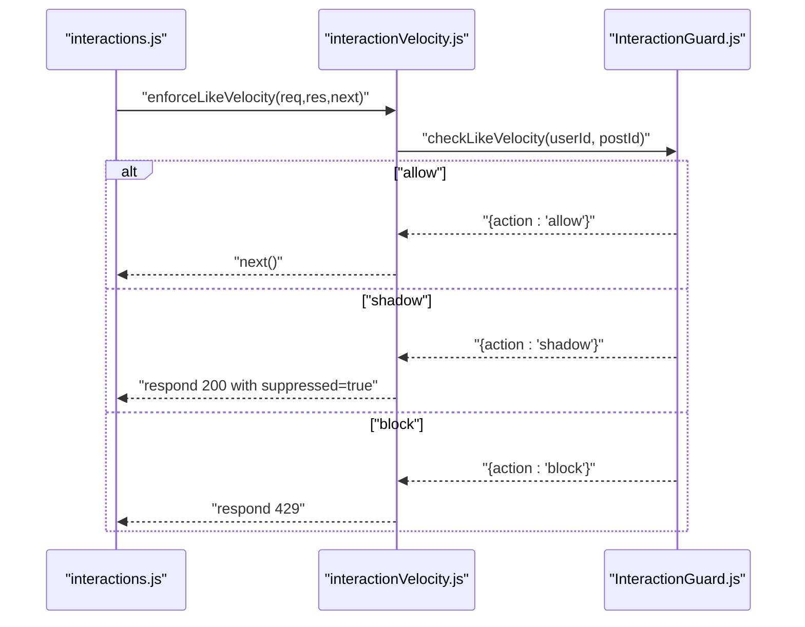
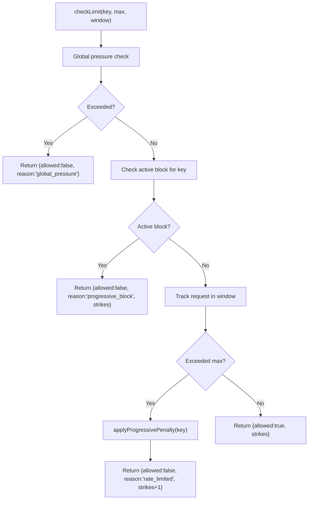
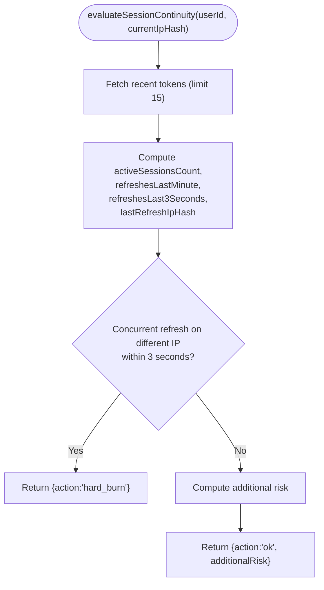
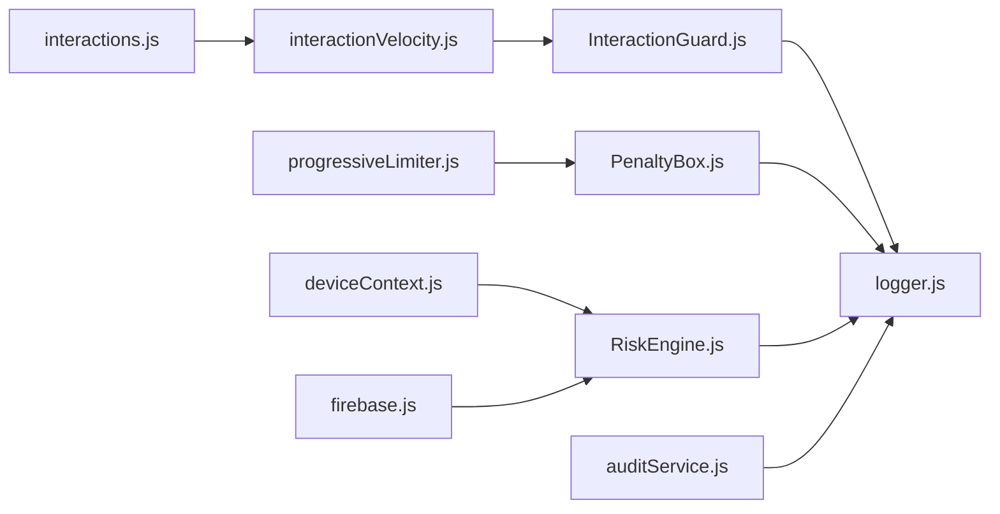

# Interaction Guard

<cite>
**Referenced Files in This Document**
- [InteractionGuard.js](file://backend/src/services/InteractionGuard.js)
- [interactionVelocity.js](file://backend/src/middleware/interactionVelocity.js)
- [interactions.js](file://backend/src/routes/interactions.js)
- [PenaltyBox.js](file://backend/src/services/PenaltyBox.js)
- [progressiveLimiter.js](file://backend/src/middleware/progressiveLimiter.js)
- [riskEngine.js](file://backend/src/services/RiskEngine.js)
- [deviceContext.js](file://backend/src/middleware/deviceContext.js)
- [auditService.js](file://backend/src/services/auditService.js)
- [logger.js](file://backend/src/utils/logger.js)
- [firebase.js](file://backend/src/config/firebase.js)
- [env.js](file://backend/src/config/env.js)
- [rateLimiter.js](file://backend/src/middleware/rateLimiter.js)
- [reconcileMetrics.js](file://backend/scripts/reconcileMetrics.js)
</cite>

## Table of Contents
1. [Introduction](#introduction)
2. [Project Structure](#project-structure)
3. [Core Components](#core-components)
4. [Architecture Overview](#architecture-overview)
5. [Detailed Component Analysis](#detailed-component-analysis)
6. [Dependency Analysis](#dependency-analysis)
7. [Performance Considerations](#performance-considerations)
8. [Troubleshooting Guide](#troubleshooting-guide)
9. [Conclusion](#conclusion)
10. [Appendices](#appendices)

## Introduction
This document describes the InteractionGuard service and related moderation infrastructure responsible for content moderation, shadow banning, and abuse prevention. It explains interaction monitoring mechanisms, suspicious behavior detection algorithms, and automated moderation workflows. It also documents the shadow banning system, integration with content filtering systems and real-time abuse detection, user reporting mechanisms, manual review workflows, automated decision-making, configuration options for moderation thresholds, integration patterns with content management systems, false positive mitigation, appeal processes, and performance considerations for real-time interaction monitoring.

## Project Structure
The moderation stack spans services, middleware, routes, and utilities:
- Services: InteractionGuard (real-time interaction throttling), PenaltyBox (progressive rate limiting), RiskEngine (session risk evaluation), AuditService (immutable audit logging).
- Middleware: interactionVelocity (wraps InteractionGuard for likes and follows), progressiveLimiter (centralized in-memory progressive limiter), rateLimiter (standard express-rate-limit), deviceContext (privacy-preserving device/IP/UA hashing).
- Routes: interactions.js exposes like/follow/comment endpoints with guards.
- Utilities: logger for security events, firebase and env configs for initialization and environment.

**Diagram sources**
- [interactions.js](file://backend/src/routes/interactions.js#L1-L522)
- [interactionVelocity.js](file://backend/src/middleware/interactionVelocity.js#L1-L62)
- [progressiveLimiter.js](file://backend/src/middleware/progressiveLimiter.js#L1-L61)
- [rateLimiter.js](file://backend/src/middleware/rateLimiter.js#L1-L76)
- [deviceContext.js](file://backend/src/middleware/deviceContext.js#L1-L24)
- [InteractionGuard.js](file://backend/src/services/InteractionGuard.js#L1-L124)
- [PenaltyBox.js](file://backend/src/services/PenaltyBox.js#L1-L108)
- [riskEngine.js](file://backend/src/services/RiskEngine.js#L1-L170)
- [auditService.js](file://backend/src/services/auditService.js#L1-L33)
- [logger.js](file://backend/src/utils/logger.js#L1-L29)
- [firebase.js](file://backend/src/config/firebase.js#L1-L46)
- [env.js](file://backend/src/config/env.js#L1-L31)

**Section sources**
- [InteractionGuard.js](file://backend/src/services/InteractionGuard.js#L1-L124)
- [interactionVelocity.js](file://backend/src/middleware/interactionVelocity.js#L1-L62)
- [interactions.js](file://backend/src/routes/interactions.js#L1-L522)
- [PenaltyBox.js](file://backend/src/services/PenaltyBox.js#L1-L108)
- [progressiveLimiter.js](file://backend/src/middleware/progressiveLimiter.js#L1-L61)
- [riskEngine.js](file://backend/src/services/RiskEngine.js#L1-L170)
- [deviceContext.js](file://backend/src/middleware/deviceContext.js#L1-L24)
- [auditService.js](file://backend/src/services/auditService.js#L1-L33)
- [logger.js](file://backend/src/utils/logger.js#L1-L29)
- [firebase.js](file://backend/src/config/firebase.js#L1-L46)
- [env.js](file://backend/src/config/env.js#L1-L31)
- [rateLimiter.js](file://backend/src/middleware/rateLimiter.js#L1-L76)

## Core Components
- InteractionGuard: Real-time behavioral guard for pair toggles (like/unlike, follow/unfollow) and global velocity. Implements hybrid model: shadow suppression for mild violations and 429 block for severe bursts.
- interactionVelocity middleware: Route-level wrappers around InteractionGuard for likes and follows.
- PenaltyBox: In-memory progressive rate limiter with escalating penalties and global pressure detection.
- progressiveLimiter middleware: Centralized policy-driven rate limiting keyed by action and identity (IP or user ID).
- RiskEngine: Session risk scoring and continuity checks for refresh flows; supports hard burn and soft lock decisions.
- deviceContext: Privacy-first device/IP/UA fingerprinting for session continuity and risk evaluation.
- AuditService: Immutable audit logging for sensitive actions.
- Logger: Security event logging abstraction.
- Firebase/Env: Initialization and environment configuration.

**Section sources**
- [InteractionGuard.js](file://backend/src/services/InteractionGuard.js#L16-L124)
- [interactionVelocity.js](file://backend/src/middleware/interactionVelocity.js#L4-L62)
- [PenaltyBox.js](file://backend/src/services/PenaltyBox.js#L3-L108)
- [progressiveLimiter.js](file://backend/src/middleware/progressiveLimiter.js#L5-L61)
- [riskEngine.js](file://backend/src/services/RiskEngine.js#L4-L170)
- [deviceContext.js](file://backend/src/middleware/deviceContext.js#L7-L24)
- [auditService.js](file://backend/src/services/auditService.js#L8-L33)
- [logger.js](file://backend/src/utils/logger.js#L20-L29)
- [firebase.js](file://backend/src/config/firebase.js#L27-L46)
- [env.js](file://backend/src/config/env.js#L6-L31)

## Architecture Overview
The moderation architecture layers:
- Route handlers enforce authentication and sanitization, then apply guards.
- InteractionGuard inspects per-user, per-target pair toggles and global velocity.
- progressiveLimiter applies centralized, policy-driven rate limits with progressive penalties.
- RiskEngine evaluates session continuity and risk for refresh flows.
- AuditService records sensitive actions for compliance and forensics.
- Logger captures security events for observability.

**Diagram sources**
- [interactions.js](file://backend/src/routes/interactions.js#L28-L103)
- [interactionVelocity.js](file://backend/src/middleware/interactionVelocity.js#L36-L61)
- [InteractionGuard.js](file://backend/src/services/InteractionGuard.js#L103-L122)

## Detailed Component Analysis

### InteractionGuard: Real-Time Interaction Monitoring and Shadow Banning
- Purpose: Prevent graph manipulation (spam, rapid toggling) and metric inflation.
- Mechanisms:
  - Pair toggle cooldown: Very fast toggles (< configured threshold) are shadow suppressed (return 200 but do not mutate DB).
  - Cycle detection: Rapid cycling within a window triggers a temporary block.
  - Global velocity: Per-minute and per-hour caps enforce sustainable interaction rates.
- Shadow Banning:
  - Mild violations: action = "shadow" returns success to the client while silently dropping the action.
  - Severe violations: action = "block" returns 429 with a clear message.
- Data structures:
  - In-memory Map acting as a time-bounded counter store with periodic cleanup.
  - Per-key records track counts, last toggle time, and cycle counts.

**Diagram sources**
- [InteractionGuard.js](file://backend/src/services/InteractionGuard.js#L47-L80)

**Section sources**
- [InteractionGuard.js](file://backend/src/services/InteractionGuard.js#L16-L124)

### interactionVelocity Middleware: Route-Level Enforcement
- Wrappers around InteractionGuard for likes and follows.
- On "shadow": Responds with success and suppressed flag to keep bots guessing.
- On "block": Returns 429 with a user-friendly message.

**Diagram sources**
- [interactionVelocity.js](file://backend/src/middleware/interactionVelocity.js#L36-L61)
- [InteractionGuard.js](file://backend/src/services/InteractionGuard.js#L115-L122)

**Section sources**
- [interactionVelocity.js](file://backend/src/middleware/interactionVelocity.js#L8-L61)
- [interactions.js](file://backend/src/routes/interactions.js#L28-L103)

### PenaltyBox: Progressive Rate Limiting and Global Pressure
- Tracks per-key request counts within a sliding window.
- Applies progressive penalties: 5 min, 30 min, 24 hours based on cumulative strikes.
- Detects global pressure (>2000 req/s) and returns 503 with cooldown hint.
- Includes periodic cleanup of expired blocks and gradual strike decay.

**Diagram sources**
- [PenaltyBox.js](file://backend/src/services/PenaltyBox.js#L22-L87)

**Section sources**
- [PenaltyBox.js](file://backend/src/services/PenaltyBox.js#L3-L108)
- [progressiveLimiter.js](file://backend/src/middleware/progressiveLimiter.js#L22-L61)

### RiskEngine: Session Risk Evaluation and Continuity
- Evaluates refresh risk by comparing stored session fingerprint with current context (device, UA, IP).
- Calculates decayed risk over time.
- Determines hard burn (full session containment) vs soft lock (require re-auth).
- Performs temporal/session continuity checks for concurrent refresh races and excessive rotation.

**Diagram sources**
- [riskEngine.js](file://backend/src/services/RiskEngine.js#L71-L130)

**Section sources**
- [riskEngine.js](file://backend/src/services/RiskEngine.js#L11-L170)
- [deviceContext.js](file://backend/src/middleware/deviceContext.js#L16-L20)

### AuditService: Immutable Audit Logging
- Writes immutable audit entries to Firestore with server timestamps and request metadata.
- Logs to console/logger for real-time observability.
- Designed to not fail the primary request if audit write fails.

**Section sources**
- [auditService.js](file://backend/src/services/auditService.js#L8-L33)

### Integration with Content Management Systems
- Like/Follow endpoints use Firestore transactions to maintain consistency and update counters atomically.
- Notifications are sent asynchronously after successful transactions.
- Batch endpoints optimize frontend interactions (e.g., batch likes check).

**Section sources**
- [interactions.js](file://backend/src/routes/interactions.js#L47-L102)
- [interactions.js](file://backend/src/routes/interactions.js#L197-L245)
- [interactions.js](file://backend/src/routes/interactions.js#L374-L419)

### Suspicious Behavior Detection Algorithms
- Pair toggle cooldown and cycle detection prevent rapid toggling abuse.
- Global velocity enforces sustainable rates per user.
- Progressive rate limiting escalates penalties for repeated infractions.
- Session continuity and risk scoring detect concurrent refresh anomalies and device/UA/IP mismatches.

**Section sources**
- [InteractionGuard.js](file://backend/src/services/InteractionGuard.js#L47-L98)
- [PenaltyBox.js](file://backend/src/services/PenaltyBox.js#L22-L87)
- [riskEngine.js](file://backend/src/services/RiskEngine.js#L71-L130)

### Automated Moderation Workflows
- Route handlers apply guards before mutating state.
- Shadow suppression keeps bots guessing while protecting the database.
- 429 responses for severe violations.
- Audit logs capture sensitive actions for downstream review.

**Section sources**
- [interactions.js](file://backend/src/routes/interactions.js#L28-L103)
- [interactionVelocity.js](file://backend/src/middleware/interactionVelocity.js#L16-L33)
- [auditService.js](file://backend/src/services/auditService.js#L8-L33)

### User Reporting Mechanisms and Manual Review
- The frontend includes a report post option, indicating a user-facing reporting surface.
- Manual review workflows are not implemented in the backend; however, audit logs and risk scoring provide evidence for human reviewers.

**Section sources**
- [interactions.js](file://backend/src/routes/interactions.js#L109-L171)

### False Positive Mitigation
- Shadow suppression reduces friction for legitimate users who toggle rapidly by accident.
- Clear messaging and progressive penalties allow users to self-correct.
- Batch endpoints reduce load and improve UX, lowering accidental spikes.

**Section sources**
- [interactionVelocity.js](file://backend/src/middleware/interactionVelocity.js#L23-L31)
- [progressiveLimiter.js](file://backend/src/middleware/progressiveLimiter.js#L49-L56)

### Appeal Processes
- No explicit appeal mechanism is present in the backend; however, the system’s transparency (audit logs, risk scores) supports manual review and potential reinstatements.

**Section sources**
- [auditService.js](file://backend/src/services/auditService.js#L8-L33)
- [riskEngine.js](file://backend/src/services/RiskEngine.js#L55-L65)

## Dependency Analysis
- Routes depend on middleware and services to enforce guards and handle transactions.
- InteractionGuard depends on in-memory storage and logging.
- PenaltyBox depends on in-memory maps and periodic cleanup.
- RiskEngine depends on Firestore for token continuity checks and updates.
- Logger is used across services and middleware for security events.

**Diagram sources**
- [InteractionGuard.js](file://backend/src/services/InteractionGuard.js#L1-L124)
- [interactionVelocity.js](file://backend/src/middleware/interactionVelocity.js#L1-L62)
- [interactions.js](file://backend/src/routes/interactions.js#L1-L522)
- [PenaltyBox.js](file://backend/src/services/PenaltyBox.js#L1-L108)
- [progressiveLimiter.js](file://backend/src/middleware/progressiveLimiter.js#L1-L61)
- [riskEngine.js](file://backend/src/services/RiskEngine.js#L1-L170)
- [deviceContext.js](file://backend/src/middleware/deviceContext.js#L1-L24)
- [auditService.js](file://backend/src/services/auditService.js#L1-L33)
- [logger.js](file://backend/src/utils/logger.js#L1-L29)
- [firebase.js](file://backend/src/config/firebase.js#L1-L46)

**Section sources**
- [InteractionGuard.js](file://backend/src/services/InteractionGuard.js#L1-L124)
- [PenaltyBox.js](file://backend/src/services/PenaltyBox.js#L1-L108)
- [riskEngine.js](file://backend/src/services/RiskEngine.js#L1-L170)
- [interactions.js](file://backend/src/routes/interactions.js#L1-L522)

## Performance Considerations
- In-memory stores: InteractionGuard and PenaltyBox use Map-backed stores; periodic cleanup prevents memory leaks.
- Sliding window counters: Efficient O(1) increments with optional pruning of histories.
- Firestore transactions: Ensures atomicity and consistency under load.
- Global pressure detection: Prevents cascading overload by returning 503 during extreme traffic.
- Logging overhead: Security events are logged with minimal payload to reduce I/O impact.

[No sources needed since this section provides general guidance]

## Troubleshooting Guide
- Symptom: Frequent 429 responses for likes/follows
  - Cause: Exceeded global velocity or cycle detection triggered block.
  - Resolution: Slow down requests; wait for expiration window to clear.
- Symptom: Silent acceptance with suppressed=true
  - Cause: Shadow suppression due to rapid toggling.
  - Resolution: Reduce toggle frequency; allow cooldown period.
- Symptom: Global pressure 503 responses
  - Cause: System-wide throughput exceeded.
  - Resolution: Retry after cooldown; investigate upstream traffic spikes.
- Symptom: Session refresh rejected
  - Cause: High-risk score or concurrent refresh anomaly.
  - Resolution: Re-authenticate; avoid rapid token rotation across devices.

**Section sources**
- [interactionVelocity.js](file://backend/src/middleware/interactionVelocity.js#L16-L33)
- [PenaltyBox.js](file://backend/src/services/PenaltyBox.js#L31-L34)
- [riskEngine.js](file://backend/src/services/RiskEngine.js#L109-L112)

## Conclusion
The InteractionGuard service and supporting components form a layered, real-time moderation system. It combines behavioral heuristics (pair toggles, cycling, global velocity), progressive rate limiting, session risk evaluation, and immutable audit logging to prevent abuse while minimizing friction for legitimate users. The hybrid model of shadow suppression and 429 blocking provides scalable, adaptive protection suitable for high-throughput social platforms.

[No sources needed since this section summarizes without analyzing specific files]

## Appendices

### Configuration Options for Moderation Thresholds
- Like velocity: per-minute and per-hour limits enforced by InteractionGuard.
- Follow velocity: stricter per-minute and per-hour limits.
- Pair toggle cooldown: very fast toggles are suppressed.
- Cycle limit: rapid cycling within a window triggers a temporary block.
- Progressive penalty: escalates from 5 min to 30 min to 24 hours based on cumulative strikes.
- Global pressure: system-wide cap triggers 503 responses.

**Section sources**
- [InteractionGuard.js](file://backend/src/services/InteractionGuard.js#L103-L122)
- [PenaltyBox.js](file://backend/src/services/PenaltyBox.js#L70-L87)
- [progressiveLimiter.js](file://backend/src/middleware/progressiveLimiter.js#L5-L15)

### Integration Patterns with Content Management Systems
- Use Firestore transactions for atomic updates to likes, follows, and counters.
- Asynchronous notifications decouple side effects from request completion.
- Batch endpoints reduce load and improve UX for feed interactions.

**Section sources**
- [interactions.js](file://backend/src/routes/interactions.js#L47-L102)
- [interactions.js](file://backend/src/routes/interactions.js#L197-L245)
- [interactions.js](file://backend/src/routes/interactions.js#L374-L419)

### Real-Time Abuse Detection Signals
- Rapid toggling and cycling patterns.
- Excessive global velocity within short windows.
- Concurrent refresh attempts from different IPs within brief intervals.
- High-frequency token refresh storms.
- Device/UA/IP mismatches with elevated risk scores.

**Section sources**
- [InteractionGuard.js](file://backend/src/services/InteractionGuard.js#L47-L98)
- [riskEngine.js](file://backend/src/services/RiskEngine.js#L109-L130)

### Example Scenarios
- Scenario A: User rapidly toggles like/unlike on the same post
  - Outcome: Shadow suppression; response indicates suppressed=true.
- Scenario B: User exceeds per-minute like cap
  - Outcome: 429 response with cooldown message.
- Scenario C: System-wide traffic spike
  - Outcome: 503 response with cooldown hint.
- Scenario D: Concurrent refresh from different IP within 3 seconds
  - Outcome: Hard burn; require re-authentication.

**Section sources**
- [interactionVelocity.js](file://backend/src/middleware/interactionVelocity.js#L23-L31)
- [PenaltyBox.js](file://backend/src/services/PenaltyBox.js#L31-L34)
- [riskEngine.js](file://backend/src/services/RiskEngine.js#L109-L112)

### Audit and Compliance
- AuditService writes immutable logs with server timestamps and request metadata.
- Security events are logged for rate limit exceedances and moderation actions.

**Section sources**
- [auditService.js](file://backend/src/services/auditService.js#L8-L33)
- [logger.js](file://backend/src/utils/logger.js#L20-L26)

### Environment and Initialization
- Firebase Admin is initialized from environment variables.
- Environment configuration supports production mode logging.

**Section sources**
- [firebase.js](file://backend/src/config/firebase.js#L27-L46)
- [env.js](file://backend/src/config/env.js#L25-L28)

### Data Reconciliation and Integrity
- Nightly reconciliation worker heals metric drift in subscribers/following and like/comment counts.

**Section sources**
- [reconcileMetrics.js](file://backend/scripts/reconcileMetrics.js#L36-L86)