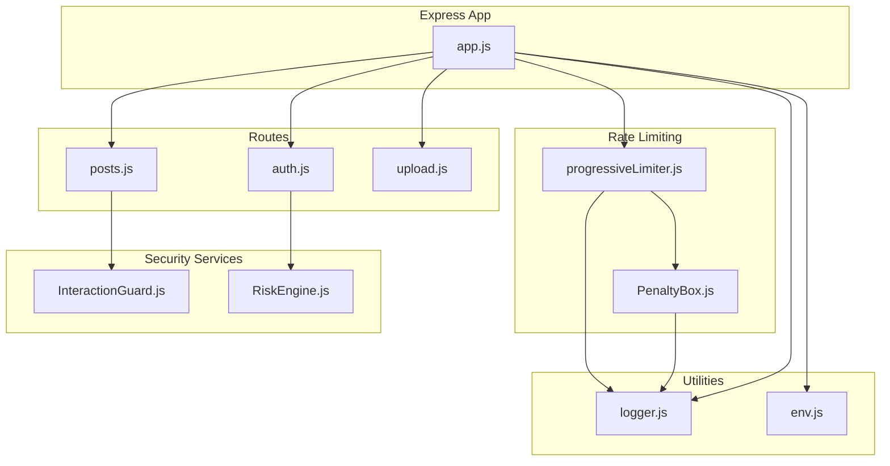
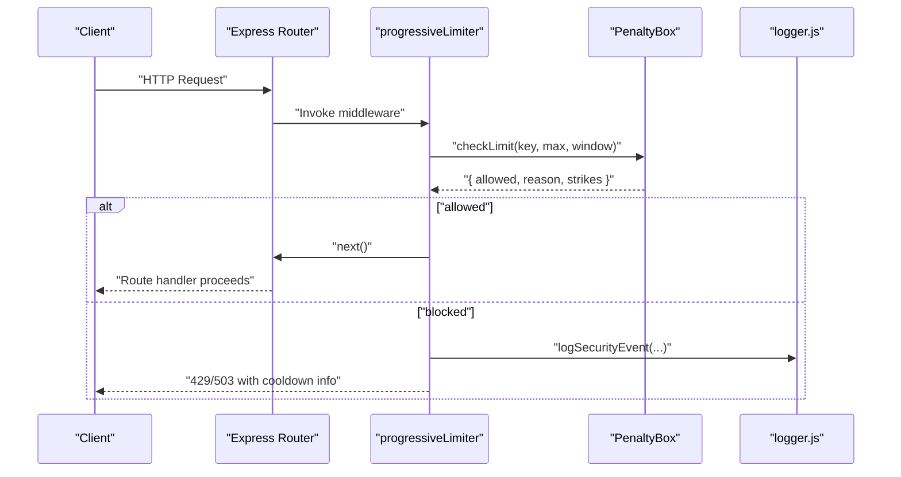
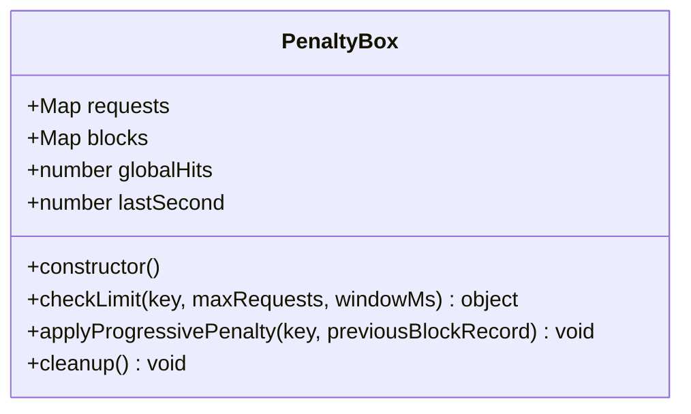
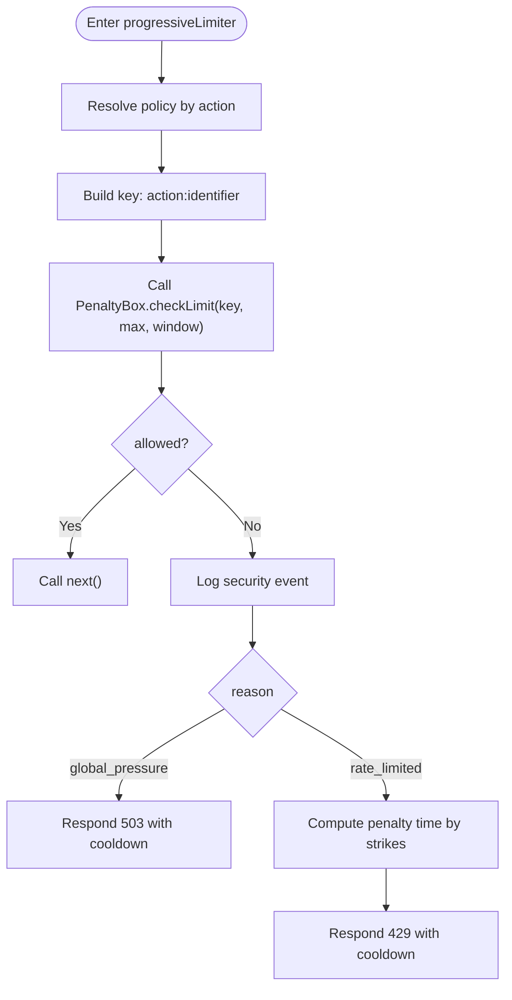
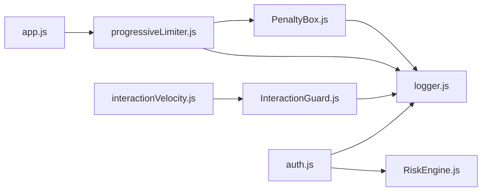

# Penalty Box

<cite>
**Referenced Files in This Document**
- [PenaltyBox.js](file://backend/src/services/PenaltyBox.js)
- [progressiveLimiter.js](file://backend/src/middleware/progressiveLimiter.js)
- [app.js](file://backend/src/app.js)
- [logger.js](file://backend/src/utils/logger.js)
- [RiskEngine.js](file://backend/src/services/RiskEngine.js)
- [InteractionGuard.js](file://backend/src/services/InteractionGuard.js)
- [interactionVelocity.js](file://backend/src/middleware/interactionVelocity.js)
- [auth.js](file://backend/src/routes/auth.js)
- [posts.js](file://backend/src/routes/posts.js)
- [upload.js](file://backend/src/routes/upload.js)
- [env.js](file://backend/src/config/env.js)
</cite>

## Table of Contents
1. [Introduction](#introduction)
2. [Project Structure](#project-structure)
3. [Core Components](#core-components)
4. [Architecture Overview](#architecture-overview)
5. [Detailed Component Analysis](#detailed-component-analysis)
6. [Dependency Analysis](#dependency-analysis)
7. [Performance Considerations](#performance-considerations)
8. [Troubleshooting Guide](#troubleshooting-guide)
9. [Conclusion](#conclusion)
10. [Appendices](#appendices)

## Introduction
This document describes the PenaltyBox service that implements progressive rate limiting and user punishment systems. It explains how penalties accumulate, how timeouts are calculated, and how automatic resolution occurs. It also covers integration with rate limiting middleware, how penalties affect API access permissions, penalty categories and escalation patterns, tracking of penalties and durations, notification mechanisms, configuration parameters, integration patterns with security middleware, appeal and administrative override considerations, and performance optimizations.

## Project Structure
PenaltyBox is implemented as a singleton service with a dedicated middleware that enforces policies per route/action. The middleware integrates with Express routing and logs security events. Supporting services include InteractionGuard for behavioral controls and RiskEngine for session risk evaluation.

**Diagram sources**
- [app.js](file://backend/src/app.js#L21-L60)
- [progressiveLimiter.js](file://backend/src/middleware/progressiveLimiter.js#L1-L60)
- [PenaltyBox.js](file://backend/src/services/PenaltyBox.js#L1-L107)
- [InteractionGuard.js](file://backend/src/services/InteractionGuard.js#L1-L124)
- [RiskEngine.js](file://backend/src/services/RiskEngine.js#L1-L170)
- [auth.js](file://backend/src/routes/auth.js#L1-L301)
- [posts.js](file://backend/src/routes/posts.js#L1-L728)
- [upload.js](file://backend/src/routes/upload.js#L1-L225)
- [logger.js](file://backend/src/utils/logger.js#L1-L29)
- [env.js](file://backend/src/config/env.js#L1-L31)

**Section sources**
- [app.js](file://backend/src/app.js#L21-L60)
- [progressiveLimiter.js](file://backend/src/middleware/progressiveLimiter.js#L1-L60)
- [PenaltyBox.js](file://backend/src/services/PenaltyBox.js#L1-L107)

## Core Components
- PenaltyBox: In-memory progressive rate limiter with global pressure guard, per-key counters, and progressive blocking with strike-based timeouts.
- progressiveLimiter: Route middleware that applies PenaltyBox checks per action and policy, returning appropriate HTTP responses and logging security events.
- InteractionGuard: Behavioral guard for interactions (likes, follows) with hybrid suppression/blocking and velocity checks.
- RiskEngine: Session risk evaluator and enforcement engine for refresh token flows.
- Logger: Centralized security event logging.

**Section sources**
- [PenaltyBox.js](file://backend/src/services/PenaltyBox.js#L3-L107)
- [progressiveLimiter.js](file://backend/src/middleware/progressiveLimiter.js#L17-L60)
- [InteractionGuard.js](file://backend/src/services/InteractionGuard.js#L16-L124)
- [RiskEngine.js](file://backend/src/services/RiskEngine.js#L1-L170)
- [logger.js](file://backend/src/utils/logger.js#L15-L26)

## Architecture Overview
PenaltyBox sits behind progressiveLimiter middleware. The middleware selects a policy by action, constructs a key from either user ID or IP, and delegates to PenaltyBox. PenaltyBox returns allowed/disallowed with reasons and current strikes. The middleware responds with 429/503 and logs security events. InteractionGuard complements this for interactions.

**Diagram sources**
- [progressiveLimiter.js](file://backend/src/middleware/progressiveLimiter.js#L22-L59)
- [PenaltyBox.js](file://backend/src/services/PenaltyBox.js#L22-L68)
- [logger.js](file://backend/src/utils/logger.js#L20-L26)

## Detailed Component Analysis

### PenaltyBox Service
PenaltyBox maintains two maps:
- requests: per-key request counters and firstRequest timestamps for sliding-window checks.
- blocks: per-key active blocks with expiration, strike counts, and lastDecay timestamps.

It enforces:
- Global pressure threshold to mitigate volumetric attacks.
- Per-key rate checks within a window.
- Progressive escalation: 5 minutes for 1st strike, 30 minutes for 2nd, 24 hours for 3rd+.
- Automatic cleanup of expired blocks with gradual strike decay (1 per 24 hours).
- Memory cap on requests to prevent exhaustion.

**Diagram sources**
- [PenaltyBox.js](file://backend/src/services/PenaltyBox.js#L3-L107)

**Section sources**
- [PenaltyBox.js](file://backend/src/services/PenaltyBox.js#L3-L107)

### Progressive Limiter Middleware
The middleware:
- Defines centralized policies per action (auth, otp, feed, create_post, like, follow, upload, api, health).
- Chooses identifier: user ID when enabled, otherwise IP.
- Constructs a key: "${action}:${identifier}".
- Calls PenaltyBox.checkLimit and handles results:
  - Logs security events.
  - Returns 503 for global pressure.
  - Returns 429 with cooldown message and duration hint based on strikes.
- Applies to public and protected routes differently (IP vs user-based).

**Diagram sources**
- [progressiveLimiter.js](file://backend/src/middleware/progressiveLimiter.js#L22-L59)
- [logger.js](file://backend/src/utils/logger.js#L20-L26)

**Section sources**
- [progressiveLimiter.js](file://backend/src/middleware/progressiveLimiter.js#L4-L15)
- [progressiveLimiter.js](file://backend/src/middleware/progressiveLimiter.js#L22-L59)

### Integration with Application and Routes
- Public routes (/api/otp, /api/proxy, /api/auth) use IP-based progressiveLimiter('otp'/'api'/'auth').
- Protected routes (/api/*) use [authenticate, progressiveLimiter('api', true)] to enable user-based limiting.
- Special-case health endpoint uses progressiveLimiter('health').

**Section sources**
- [app.js](file://backend/src/app.js#L21-L60)

### InteractionGuard and Behavioral Controls
InteractionGuard complements PenaltyBox for interactions:
- Pair toggles (like/follow) enforce cooldown and cycle limits.
- Hybrid model: mild violations result in shadow suppression (pretend success), severe violations lead to 429.
- Global velocity checks per user for likes and follows.

**Section sources**
- [InteractionGuard.js](file://backend/src/services/InteractionGuard.js#L16-L124)
- [interactionVelocity.js](file://backend/src/middleware/interactionVelocity.js#L8-L61)

### RiskEngine and Session Security
RiskEngine evaluates refresh token risks and session continuity:
- Device/user-agent/IP hash comparisons yield risk scores.
- Decaying risk over time and thresholds for soft lock or hard burn.
- Session continuity checks for concurrent refresh storms and excessive active sessions.
- Hard burn triggers full session invalidation and token version bump.

**Section sources**
- [RiskEngine.js](file://backend/src/services/RiskEngine.js#L11-L170)
- [auth.js](file://backend/src/routes/auth.js#L166-L280)

### Penalty Categories, Severity, and Escalation
- Categories:
  - Authentication attempts (auth, otp)
  - Feed and general API usage (feed, api)
  - Content interactions (like, follow)
  - Uploads (upload)
  - Health checks (health)
- Severity and escalation:
  - Strikes increase per rate limit violation.
  - Escalation curve: 5 minutes (1st), 30 minutes (2nd), 24 hours (3rd+).
  - Automatic decay of strikes after 24 hours without further violations.

**Section sources**
- [progressiveLimiter.js](file://backend/src/middleware/progressiveLimiter.js#L5-L15)
- [PenaltyBox.js](file://backend/src/services/PenaltyBox.js#L70-L87)

### Timeout Calculations and Automatic Resolution
- Timeout calculation:
  - 5 minutes for 1 strike, 30 minutes for 2 strikes, 24 hours for 3+ strikes.
- Automatic resolution:
  - Blocks expire and are cleaned up.
  - Strikes decay by 1 per calendar day if no new violations occur.
  - When strikes reach zero, the block is removed.

**Section sources**
- [PenaltyBox.js](file://backend/src/services/PenaltyBox.js#L70-L104)

### Penalty Tracking, Duration, and Notifications
- Tracking:
  - Active blocks tracked by key with expiration and strike counts.
  - Requests tracked per key with sliding window counters.
- Duration:
  - Determined by escalation curve and current strike count.
- Notifications:
  - Security events logged for rate limit exceeded and global pressure.
  - No in-app user notifications are implemented in the codebase; clients receive cooldown hints in HTTP responses.

**Section sources**
- [PenaltyBox.js](file://backend/src/services/PenaltyBox.js#L5-L6)
- [progressiveLimiter.js](file://backend/src/middleware/progressiveLimiter.js#L32-L55)
- [logger.js](file://backend/src/utils/logger.js#L20-L26)

### Examples of Penalty Scenarios
- Scenario 1: Rapid authentication attempts from a single IP exceed policy limits → 429 with 5-minute cooldown.
- Scenario 2: Second consecutive burst → 429 with 30-minute cooldown.
- Scenario 3: Third violation or higher → 429 with 24-hour cooldown.
- Scenario 4: Global request volume exceeds threshold → 503 with service overload message.
- Scenario 5: Interaction abuse (rapid like/follow toggles) → shadow suppression or 429 depending on severity.

**Section sources**
- [progressiveLimiter.js](file://backend/src/middleware/progressiveLimiter.js#L41-L55)
- [PenaltyBox.js](file://backend/src/services/PenaltyBox.js#L31-L34)
- [InteractionGuard.js](file://backend/src/services/InteractionGuard.js#L47-L80)

### Configuration Parameters for Penalty Thresholds
- Policies are defined centrally:
  - auth: max attempts and window.
  - otp: max attempts and window.
  - feed: max requests per window.
  - create_post: max requests per window.
  - like: max requests per window.
  - follow: max requests per window.
  - upload: max requests per window.
  - api: general API rate limit.
  - health: permissive health check limit.
- Global pressure threshold: 2000 requests per second across the service.

**Section sources**
- [progressiveLimiter.js](file://backend/src/middleware/progressiveLimiter.js#L5-L15)
- [PenaltyBox.js](file://backend/src/services/PenaltyBox.js#L31-L34)

### Integration Patterns with Security Middleware
- progressiveLimiter integrates with app routing to apply per-action policies.
- InteractionGuard integrates with interaction routes to prevent abuse patterns.
- RiskEngine integrates with auth refresh flow to detect and contain suspicious sessions.

**Section sources**
- [app.js](file://backend/src/app.js#L21-L60)
- [interactionVelocity.js](file://backend/src/middleware/interactionVelocity.js#L8-L61)
- [auth.js](file://backend/src/routes/auth.js#L166-L280)

### Appeal Processes and Administrative Overrides
- No built-in appeal or administrative override mechanisms were identified in the codebase.
- Administrators can potentially manage sessions via external tools or manual intervention outside the provided services.

**Section sources**
- [RiskEngine.js](file://backend/src/services/RiskEngine.js#L136-L168)

## Dependency Analysis

**Diagram sources**
- [PenaltyBox.js](file://backend/src/services/PenaltyBox.js#L1-L107)
- [progressiveLimiter.js](file://backend/src/middleware/progressiveLimiter.js#L1-L60)
- [InteractionGuard.js](file://backend/src/services/InteractionGuard.js#L1-L124)
- [interactionVelocity.js](file://backend/src/middleware/interactionVelocity.js#L1-L61)
- [RiskEngine.js](file://backend/src/services/RiskEngine.js#L1-L170)
- [auth.js](file://backend/src/routes/auth.js#L1-L301)
- [app.js](file://backend/src/app.js#L1-L78)
- [logger.js](file://backend/src/utils/logger.js#L1-L29)

**Section sources**
- [PenaltyBox.js](file://backend/src/services/PenaltyBox.js#L1-L107)
- [progressiveLimiter.js](file://backend/src/middleware/progressiveLimiter.js#L1-L60)
- [InteractionGuard.js](file://backend/src/services/InteractionGuard.js#L1-L124)
- [interactionVelocity.js](file://backend/src/middleware/interactionVelocity.js#L1-L61)
- [RiskEngine.js](file://backend/src/services/RiskEngine.js#L1-L170)
- [auth.js](file://backend/src/routes/auth.js#L1-L301)
- [app.js](file://backend/src/app.js#L1-L78)
- [logger.js](file://backend/src/utils/logger.js#L1-L29)

## Performance Considerations
- In-memory maps with periodic cleanup prevent memory leaks.
- Global pressure guard protects against overload conditions.
- Sliding window counters and memory caps reduce risk of exhaustion.
- Strike decay prevents indefinite escalation and reduces maintenance overhead.
- Consider horizontal scaling alternatives (e.g., Redis) for distributed deployments.

[No sources needed since this section provides general guidance]

## Troubleshooting Guide
- Symptom: Frequent 429 responses with cooldown hints.
  - Cause: Exceeded policy thresholds for the given action.
  - Action: Reduce request frequency or wait for cooldown.
- Symptom: 503 responses indicating service overload.
  - Cause: Global pressure threshold exceeded.
  - Action: Retry later; investigate upstream traffic spikes.
- Symptom: Interaction endpoints appear to succeed but silently suppress actions.
  - Cause: InteractionGuard hybrid suppression for mild violations.
  - Action: Slow down rapid toggles; respect cooldown and cycle limits.
- Symptom: Sessions locked out after refresh attempts.
  - Cause: RiskEngine soft lock or hard burn based on risk thresholds.
  - Action: Re-authenticate; avoid suspicious device/user-agent/IP changes.

**Section sources**
- [progressiveLimiter.js](file://backend/src/middleware/progressiveLimiter.js#L41-L55)
- [PenaltyBox.js](file://backend/src/services/PenaltyBox.js#L31-L34)
- [InteractionGuard.js](file://backend/src/services/InteractionGuard.js#L47-L80)
- [RiskEngine.js](file://backend/src/services/RiskEngine.js#L216-L230)

## Conclusion
PenaltyBox provides a robust, in-memory progressive rate limiting system with clear escalation and automatic resolution. Combined with behavioral guards and session risk evaluation, it forms a layered defense against abuse while maintaining operational performance. Administrators can tune policies centrally and rely on automatic decay to reduce long-term maintenance.

[No sources needed since this section summarizes without analyzing specific files]

## Appendices

### Appendix A: Policy Reference
- auth: authentication attempts
- otp: OTP generation/verification
- feed: feed consumption
- create_post: post creation
- like: like toggles
- follow: follow/unfollow toggles
- upload: media uploads
- api: general API usage
- health: health checks

**Section sources**
- [progressiveLimiter.js](file://backend/src/middleware/progressiveLimiter.js#L5-L15)

### Appendix B: Route Integration Summary
- Public routes: IP-based progressiveLimiter('otp' | 'api' | 'auth')
- Protected routes: user-based progressiveLimiter('api', true)
- Health: progressiveLimiter('health')

**Section sources**
- [app.js](file://backend/src/app.js#L37-L60)