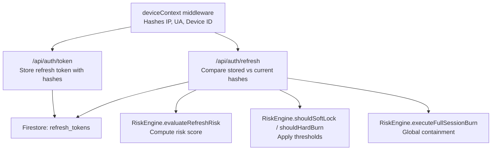
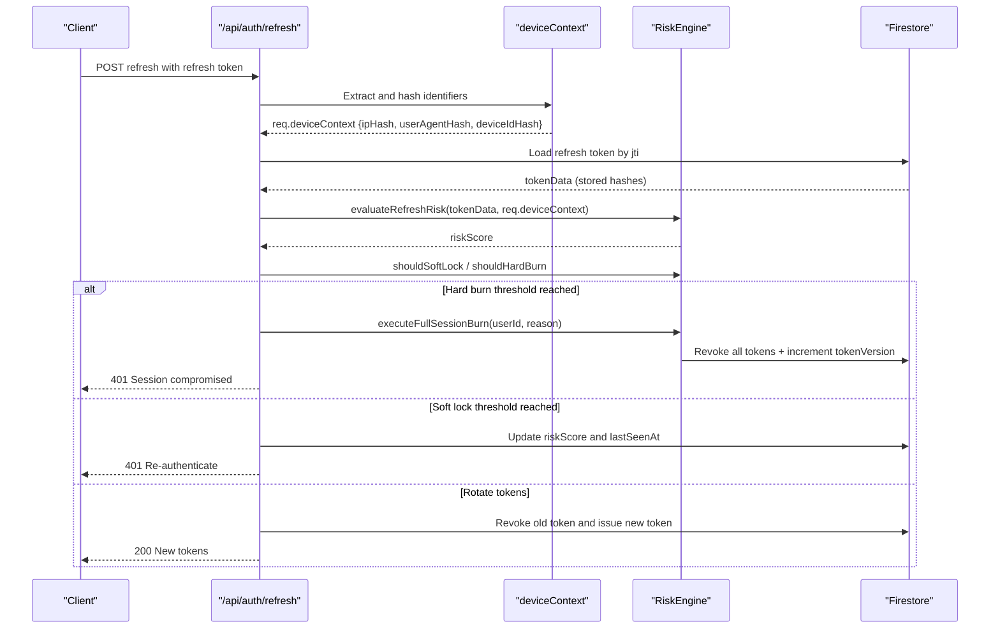
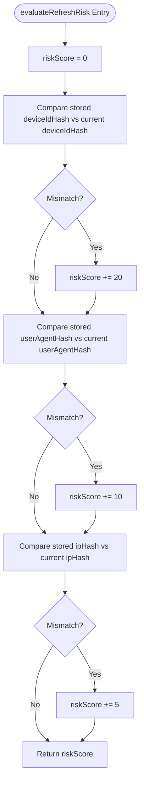
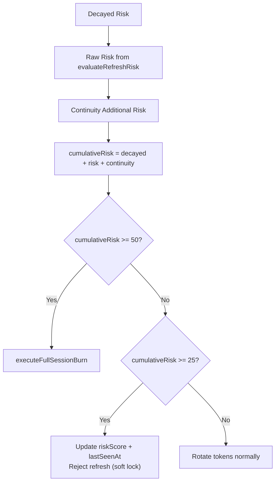
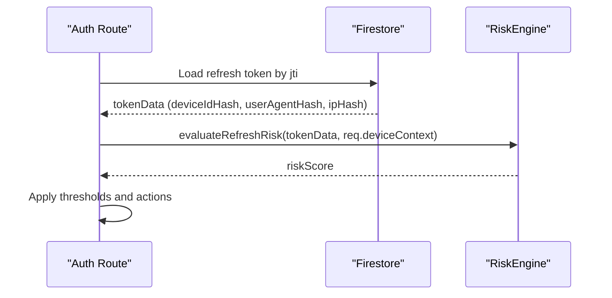
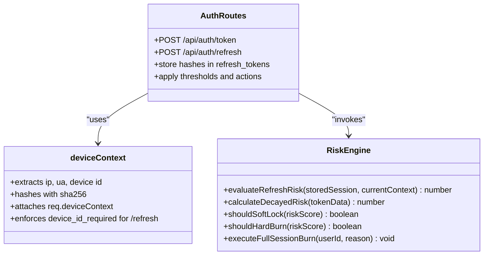
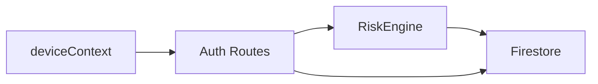

# Device Fingerprint Evaluation

<cite>
**Referenced Files in This Document**
- [RiskEngine.js](file://backend/src/services/RiskEngine.js)
- [deviceContext.js](file://backend/src/middleware/deviceContext.js)
- [auth.js](file://backend/src/routes/auth.js)
- [auth.js (middleware)](file://backend/src/middleware/auth.js)
- [logger.js](file://backend/src/utils/logger.js)
</cite>

## Table of Contents
1. [Introduction](#introduction)
2. [Project Structure](#project-structure)
3. [Core Components](#core-components)
4. [Architecture Overview](#architecture-overview)
5. [Detailed Component Analysis](#detailed-component-analysis)
6. [Dependency Analysis](#dependency-analysis)
7. [Performance Considerations](#performance-considerations)
8. [Troubleshooting Guide](#troubleshooting-guide)
9. [Conclusion](#conclusion)

## Introduction
This document explains the device fingerprint evaluation component of the RiskEngine, focusing on the three-tier fingerprint comparison system and its integration with authentication flows. It covers how deviceIdHash, userAgentHash, and ipHash are evaluated, the risk scoring algorithm, fallback verification, and how the evaluateRefreshRisk method processes stored session data against currentContext parameters. Practical examples, threshold comparisons, and the relationship with deviceContext middleware are included.

## Project Structure
The device fingerprint evaluation spans middleware, service logic, and authentication routes:
- deviceContext middleware extracts and hashes device identifiers for privacy.
- RiskEngine evaluates fingerprint differences and applies thresholds.
- Authentication routes orchestrate token issuance, refresh, and enforcement of security policies.

**Diagram sources**
- [deviceContext.js](file://backend/src/middleware/deviceContext.js#L7-L23)
- [auth.js](file://backend/src/routes/auth.js#L166-L280)
- [RiskEngine.js](file://backend/src/services/RiskEngine.js#L11-L65)

**Section sources**
- [deviceContext.js](file://backend/src/middleware/deviceContext.js#L1-L24)
- [auth.js](file://backend/src/routes/auth.js#L1-L301)
- [RiskEngine.js](file://backend/src/services/RiskEngine.js#L1-L170)

## Core Components
- deviceContext middleware: Computes SHA-256 hashes for IP, User-Agent, and Device ID, and attaches them to the request object for downstream use.
- RiskEngine: Provides risk scoring, temporal decay, continuity checks, and global session containment.
- Authentication routes: Issue and refresh tokens, enforce strict device checks, and apply RiskEngine decisions.

**Section sources**
- [deviceContext.js](file://backend/src/middleware/deviceContext.js#L7-L23)
- [RiskEngine.js](file://backend/src/services/RiskEngine.js#L11-L65)
- [auth.js](file://backend/src/routes/auth.js#L166-L280)

## Architecture Overview
The fingerprint evaluation pipeline:
1. deviceContext computes hashed identifiers and attaches them to req.deviceContext.
2. On token issuance, the refresh token document stores the hashes.
3. On refresh, the system compares stored hashes with currentContext and computes risk.
4. Thresholds decide whether to soft-lock, hard-burn, or rotate tokens.

**Diagram sources**
- [auth.js](file://backend/src/routes/auth.js#L166-L280)
- [deviceContext.js](file://backend/src/middleware/deviceContext.js#L7-L23)
- [RiskEngine.js](file://backend/src/services/RiskEngine.js#L11-L65)
- [RiskEngine.js](file://backend/src/services/RiskEngine.js#L136-L168)

## Detailed Component Analysis

### Three-Tier Fingerprint Comparison System
- deviceIdHash: Strict device identity check. If mismatched, the system immediately burns all sessions for the user.
- userAgentHash: Medium-risk change. Indicates browser updates or different client builds.
- ipHash: Low-risk change. Reflects typical network transitions (Wi-Fi to cellular).

**Diagram sources**
- [RiskEngine.js](file://backend/src/services/RiskEngine.js#L11-L30)

**Section sources**
- [RiskEngine.js](file://backend/src/services/RiskEngine.js#L11-L30)

### Risk Scoring Algorithm and Thresholds
- Device mismatch: +20 points.
- User agent change: +10 points.
- IP change: +5 points.
- Decay: 5 points deducted for every 6 hours since last seen.
- Hard burn threshold: ≥50 points triggers global session burn.
- Soft lock threshold: ≥25 points triggers re-authentication requirement.

**Diagram sources**
- [RiskEngine.js](file://backend/src/services/RiskEngine.js#L36-L49)
- [RiskEngine.js](file://backend/src/services/RiskEngine.js#L55-L65)
- [auth.js](file://backend/src/routes/auth.js#L216-L230)

**Section sources**
- [RiskEngine.js](file://backend/src/services/RiskEngine.js#L36-L65)
- [auth.js](file://backend/src/routes/auth.js#L216-L230)

### Fallback Verification and evaluateRefreshRisk
- Fallback verification: The RiskEngine’s evaluateRefreshRisk is used as a secondary check even though the route enforces a strict device ID mismatch earlier.
- Stored session data: The refresh token document contains the original hashes captured at issuance.
- Current context: The deviceContext middleware ensures the current request has the latest hashes.

**Diagram sources**
- [auth.js](file://backend/src/routes/auth.js#L181-L219)
- [RiskEngine.js](file://backend/src/services/RiskEngine.js#L11-L30)

**Section sources**
- [auth.js](file://backend/src/routes/auth.js#L181-L219)
- [RiskEngine.js](file://backend/src/services/RiskEngine.js#L11-L30)

### Practical Examples and Scenario Calculations
- Example 1: Device mismatch only
  - Stored: deviceIdHash differs from current
  - Risk contribution: +20
  - Cumulative risk: 20 (no decay yet)
  - Action: Hard burn (≥50 threshold not met, but device mismatch triggers immediate burn elsewhere)
- Example 2: User agent change
  - Stored: userAgentHash differs from current
  - Risk contribution: +10
  - Cumulative risk: 10 (no decay yet)
  - Action: Rotate tokens normally
- Example 3: IP change
  - Stored: ipHash differs from current
  - Risk contribution: +5
  - Cumulative risk: 5 (no decay yet)
  - Action: Rotate tokens normally
- Example 4: Mixed changes
  - Device mismatch (+20) + User agent change (+10) = +30
  - Cumulative risk: 30 (no decay yet)
  - Action: Rotate tokens normally
- Example 5: Accumulated risk with decay
  - Previous risk: 40
  - 6+ hours elapsed: decay removes 5 points
  - New risk: 35
  - Action: Rotate tokens normally

**Section sources**
- [RiskEngine.js](file://backend/src/services/RiskEngine.js#L11-L30)
- [RiskEngine.js](file://backend/src/services/RiskEngine.js#L36-L49)
- [auth.js](file://backend/src/routes/auth.js#L216-L230)

### Relationship with deviceContext Middleware and Authentication Flows
- deviceContext middleware:
  - Extracts IP, User-Agent, and Device ID.
  - Hashes them with SHA-256 and attaches to req.deviceContext.
  - Enforces device ID presence for refresh requests.
- Authentication routes:
  - On token issuance: Store refresh token with hashes and initial riskScore.
  - On refresh: Enforce strict device ID check; if mismatched, execute full session burn.
  - Evaluate continuity and risk; apply thresholds; rotate tokens or require re-auth.

**Diagram sources**
- [deviceContext.js](file://backend/src/middleware/deviceContext.js#L7-L23)
- [RiskEngine.js](file://backend/src/services/RiskEngine.js#L11-L65)
- [auth.js](file://backend/src/routes/auth.js#L166-L280)

**Section sources**
- [deviceContext.js](file://backend/src/middleware/deviceContext.js#L7-L23)
- [auth.js](file://backend/src/routes/auth.js#L166-L280)
- [RiskEngine.js](file://backend/src/services/RiskEngine.js#L11-L65)

## Dependency Analysis
- deviceContext depends on crypto for hashing and Express request parsing.
- RiskEngine depends on Firestore for continuity checks and session burns.
- Auth routes depend on both deviceContext and RiskEngine to enforce security policies.

**Diagram sources**
- [deviceContext.js](file://backend/src/middleware/deviceContext.js#L1-L24)
- [auth.js](file://backend/src/routes/auth.js#L1-L301)
- [RiskEngine.js](file://backend/src/services/RiskEngine.js#L1-L170)

**Section sources**
- [deviceContext.js](file://backend/src/middleware/deviceContext.js#L1-L24)
- [auth.js](file://backend/src/routes/auth.js#L1-L301)
- [RiskEngine.js](file://backend/src/services/RiskEngine.js#L1-L170)

## Performance Considerations
- Hashing cost: SHA-256 is lightweight and performed once per request in deviceContext.
- Firestore reads/writes: Continuity checks and token updates are bounded by small limits (e.g., last 15 tokens).
- Caching: User profile caching reduces repeated Firestore reads for authenticated endpoints.

[No sources needed since this section provides general guidance]

## Troubleshooting Guide
- Device ID missing on refresh: The middleware returns a 400 error indicating device_id_required.
- Strict device mismatch on refresh: Immediate full session burn is executed.
- Suspicious activity detected: Soft lock requires re-authentication; risk score is persisted.
- Replay attack detected: Global session burn revokes all tokens and increments tokenVersion.
- Logging: Security events are logged with timestamps and metadata for auditing.

**Section sources**
- [deviceContext.js](file://backend/src/middleware/deviceContext.js#L12-L14)
- [auth.js](file://backend/src/routes/auth.js#L202-L207)
- [auth.js](file://backend/src/routes/auth.js#L226-L230)
- [RiskEngine.js](file://backend/src/services/RiskEngine.js#L136-L168)
- [logger.js](file://backend/src/utils/logger.js#L20-L26)

## Conclusion
The device fingerprint evaluation system combines privacy-preserving hashed identifiers with a layered risk assessment. The three-tier comparison (device, user agent, IP) provides granular anomaly detection, while thresholds and decay mechanisms balance security and usability. The integration with deviceContext middleware and authentication routes ensures robust protection against token replay, device changes, and suspicious refresh patterns.