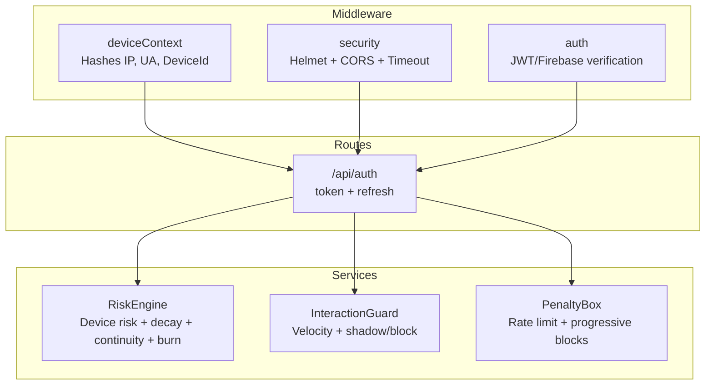
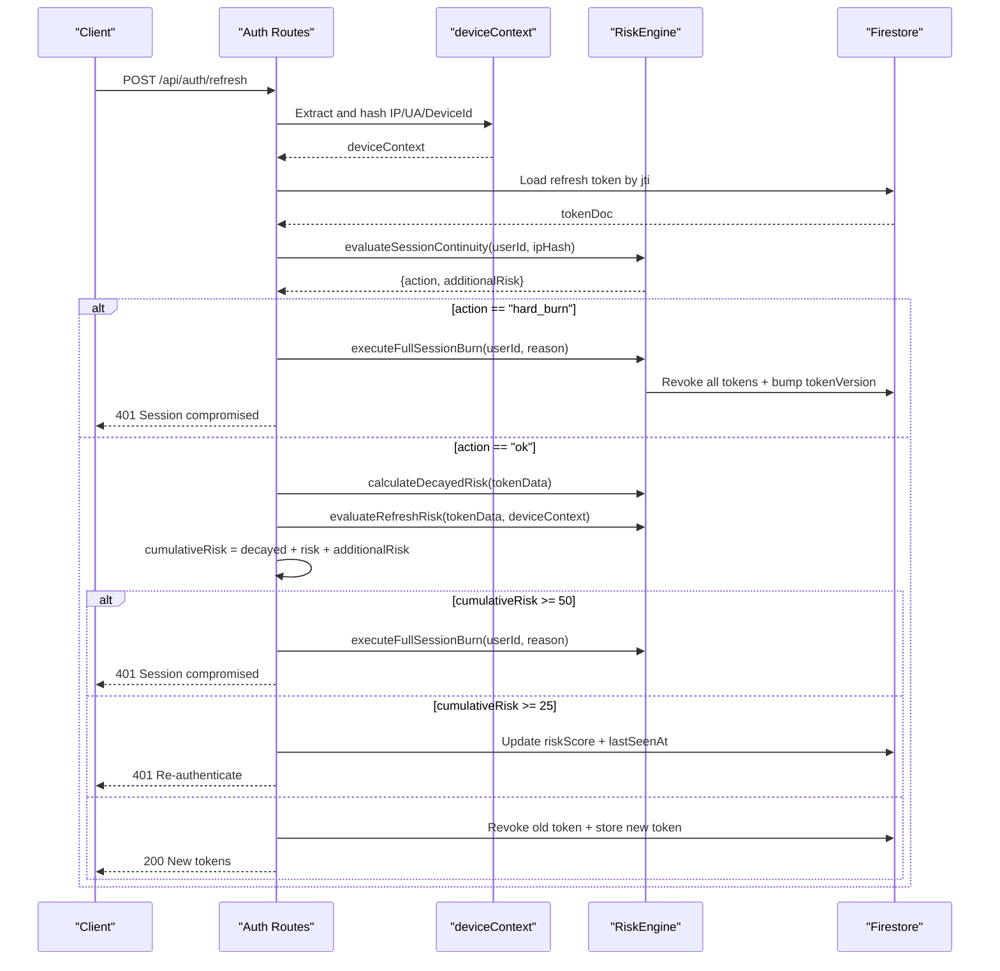
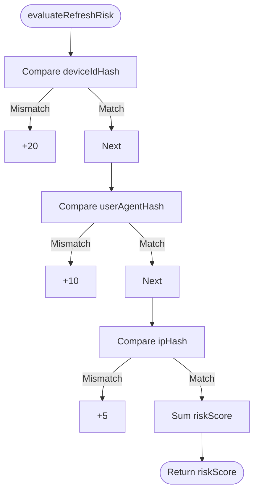
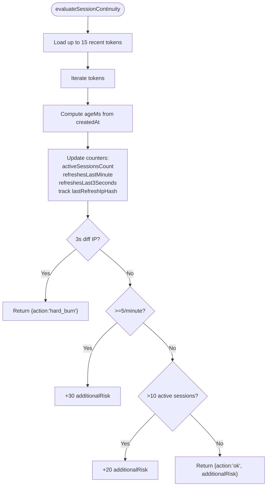
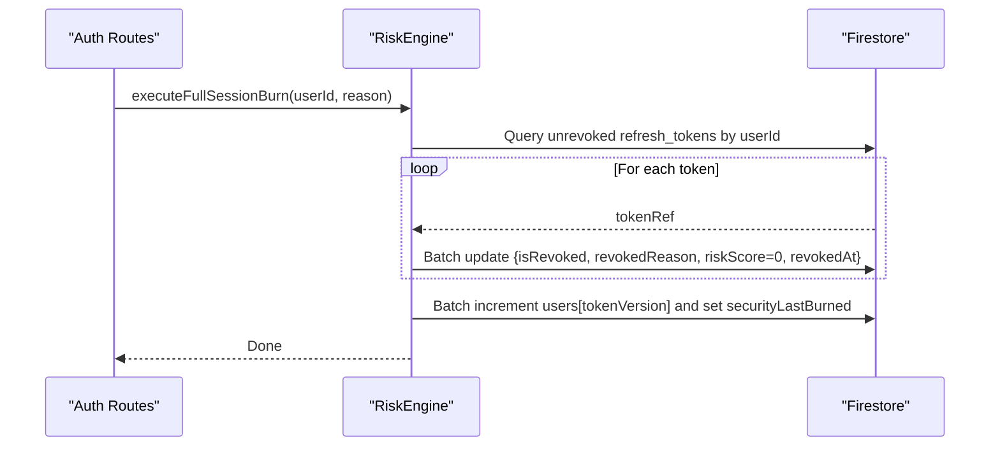
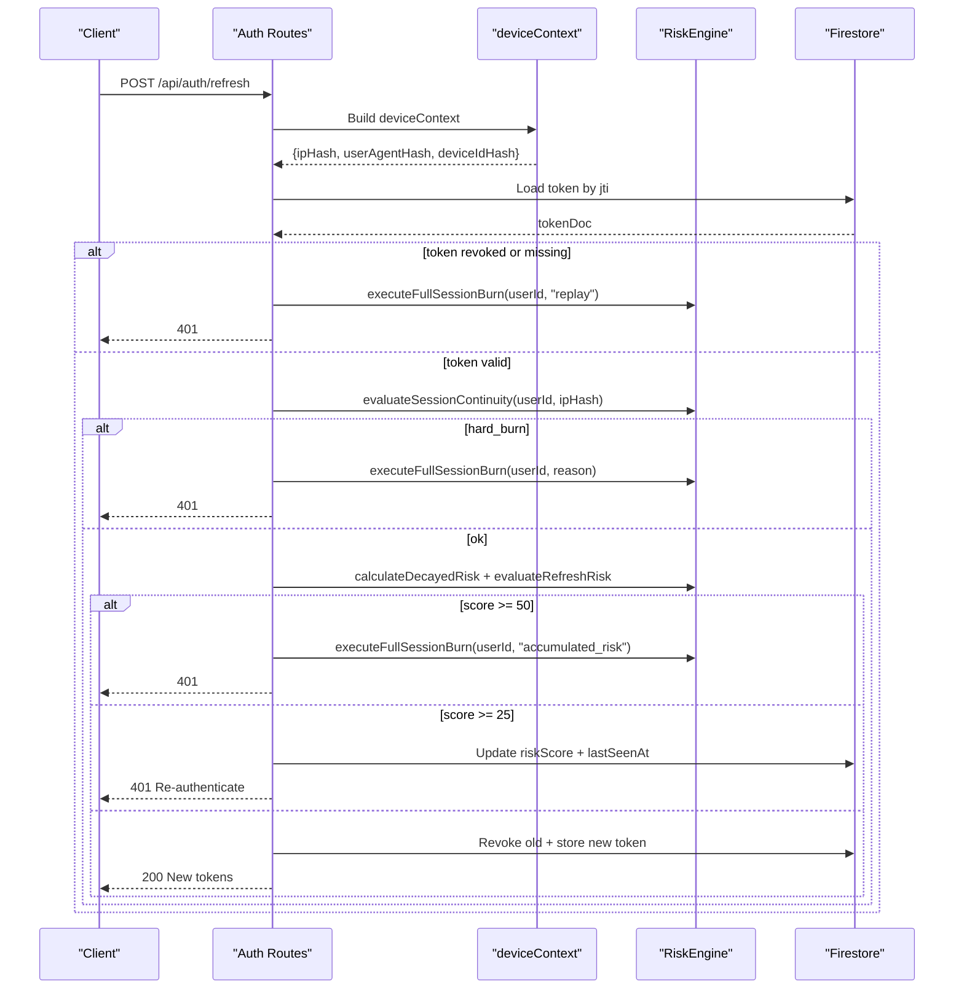
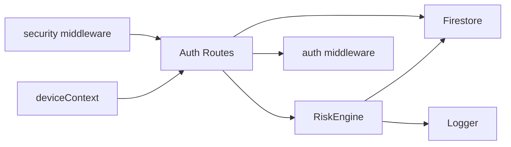

# Risk Engine

<cite>
**Referenced Files in This Document**
- [RiskEngine.js](file://backend/src/services/RiskEngine.js)
- [deviceContext.js](file://backend/src/middleware/deviceContext.js)
- [auth.js](file://backend/src/middleware/auth.js)
- [auth_routes.js](file://backend/src/routes/auth.js)
- [security.js](file://backend/src/middleware/security.js)
- [logger.js](file://backend/src/utils/logger.js)
- [.env.example](file://backend/.env.example)
- [env.js](file://backend/src/config/env.js)
- [InteractionGuard.js](file://backend/src/services/InteractionGuard.js)
- [interactionVelocity.js](file://backend/src/middleware/interactionVelocity.js)
- [PenaltyBox.js](file://backend/src/services/PenaltyBox.js)
</cite>

## Table of Contents
1. [Introduction](#introduction)
2. [Project Structure](#project-structure)
3. [Core Components](#core-components)
4. [Architecture Overview](#architecture-overview)
5. [Detailed Component Analysis](#detailed-component-analysis)
6. [Dependency Analysis](#dependency-analysis)
7. [Performance Considerations](#performance-considerations)
8. [Troubleshooting Guide](#troubleshooting-guide)
9. [Conclusion](#conclusion)
10. [Appendices](#appendices)

## Introduction
This document describes the RiskEngine service that implements advanced security risk assessment and threat detection for refresh token authentication. It focuses on:
- Device fingerprint evaluation using hashed identifiers
- Temporal risk calculation with decay based on time since last seen
- Session continuity intelligence for concurrent refresh races, velocity patterns, and active session limits
- Risk scoring thresholds for hard burns (score ≥ 50) and soft locks (score ≥ 25)
- Full session burn execution for global account containment
- Practical evaluation scenarios, configuration options, integration patterns with authentication middleware, performance considerations, and troubleshooting guidance

## Project Structure
The risk engine spans middleware, routes, and services:
- Authentication routes orchestrate refresh token lifecycle and integrate RiskEngine decisions
- deviceContext middleware produces hashed device fingerprints
- RiskEngine evaluates device/IP/UA mismatches, decays risk, and enforces session continuity
- Security middleware provides enterprise-grade headers and CORS configuration
- Logger centralizes security events and operational telemetry

**Diagram sources**
- [deviceContext.js](file://backend/src/middleware/deviceContext.js#L1-L24)
- [security.js](file://backend/src/middleware/security.js#L1-L75)
- [auth.js](file://backend/src/middleware/auth.js#L1-L164)
- [auth_routes.js](file://backend/src/routes/auth.js#L1-L301)
- [RiskEngine.js](file://backend/src/services/RiskEngine.js#L1-L170)
- [InteractionGuard.js](file://backend/src/services/InteractionGuard.js#L1-L124)
- [PenaltyBox.js](file://backend/src/services/PenaltyBox.js#L1-L108)

**Section sources**
- [auth_routes.js](file://backend/src/routes/auth.js#L1-L301)
- [deviceContext.js](file://backend/src/middleware/deviceContext.js#L1-L24)
- [RiskEngine.js](file://backend/src/services/RiskEngine.js#L1-L170)
- [security.js](file://backend/src/middleware/security.js#L1-L75)
- [auth.js](file://backend/src/middleware/auth.js#L1-L164)
- [InteractionGuard.js](file://backend/src/services/InteractionGuard.js#L1-L124)
- [PenaltyBox.js](file://backend/src/services/PenaltyBox.js#L1-L108)

## Core Components
- RiskEngine: Evaluates device/IP/UA risk, applies temporal decay, computes continuity signals, and executes full session burns
- deviceContext: Produces SHA-256 hashes for IP, User-Agent, and DeviceId to keep raw identifiers out of storage
- Authentication routes: Orchestrate token issuance, refresh, and RiskEngine-driven decisions
- Security middleware: Provides secure headers, CORS, and request timeouts
- Logger: Centralized logging for security events and operational diagnostics

**Section sources**
- [RiskEngine.js](file://backend/src/services/RiskEngine.js#L1-L170)
- [deviceContext.js](file://backend/src/middleware/deviceContext.js#L1-L24)
- [auth_routes.js](file://backend/src/routes/auth.js#L1-L301)
- [security.js](file://backend/src/middleware/security.js#L1-L75)
- [logger.js](file://backend/src/utils/logger.js#L1-L28)

## Architecture Overview
The refresh flow integrates RiskEngine at multiple checkpoints:
- Anti-replay and version checks
- Strict device ID validation
- Session continuity evaluation (concurrent refresh race, velocity, active sessions)
- Risk accumulation with temporal decay
- Hard burn (≥50) or soft lock (≥25) decisions
- Token rotation and issuance

**Diagram sources**
- [auth_routes.js](file://backend/src/routes/auth.js#L166-L280)
- [RiskEngine.js](file://backend/src/services/RiskEngine.js#L71-L130)
- [deviceContext.js](file://backend/src/middleware/deviceContext.js#L7-L23)

## Detailed Component Analysis

### RiskEngine: Device Fingerprint Evaluation and Temporal Risk
RiskEngine compares the incoming request’s hashed fingerprint against stored session data:
- DeviceIdHash mismatch: high risk (+20)
- UserAgentHash mismatch: medium risk (+10)
- IpHash mismatch: low risk (+5)

Temporal decay reduces stale risk:
- For every 6 hours since last seen, subtract 5 points (capped at zero)

Thresholds:
- Hard burn: score ≥ 50
- Soft lock: score ≥ 25

**Diagram sources**
- [RiskEngine.js](file://backend/src/services/RiskEngine.js#L11-L30)

**Section sources**
- [RiskEngine.js](file://backend/src/services/RiskEngine.js#L11-L49)

### RiskEngine: Session Continuity Intelligence
The continuity engine evaluates recent refresh activity:
- Concurrency: Detects different IPs within 3 seconds and triggers a hard burn
- Velocity: ≥5 refreshes in 1 minute adds suspicious rotation risk
- Active sessions: >10 active refresh tokens for the user is highly anomalous

**Diagram sources**
- [RiskEngine.js](file://backend/src/services/RiskEngine.js#L71-L130)

**Section sources**
- [RiskEngine.js](file://backend/src/services/RiskEngine.js#L71-L130)

### RiskEngine: Full Session Burn Execution
When a hard burn is triggered, the system:
- Revokes all refresh tokens for the user
- Clears risk scores and sets revoke metadata
- Increments the user’s token version to invalidate access tokens in the wild
- Logs the action for auditing

**Diagram sources**
- [RiskEngine.js](file://backend/src/services/RiskEngine.js#L136-L168)

**Section sources**
- [RiskEngine.js](file://backend/src/services/RiskEngine.js#L136-L168)

### deviceContext: Hashed Fingerprint Extraction
The middleware extracts raw identifiers and produces SHA-256 hashes:
- IP: x-forwarded-for or fallback remote address
- User-Agent: browser/SDK identifier
- DeviceId: required for refresh; otherwise 400

Hashes are attached to req.deviceContext for downstream use.

**Section sources**
- [deviceContext.js](file://backend/src/middleware/deviceContext.js#L7-L23)

### Authentication Routes: Integration and Decision Flow
The refresh endpoint integrates RiskEngine:
- Validates signature and payload, anti-replay and version checks
- Enforces strict device ID match; otherwise hard burn
- Runs continuity checks; hard burn if concurrency detected
- Computes decayed risk and device risk; applies thresholds
- Rotates tokens and issues new ones

**Diagram sources**
- [auth_routes.js](file://backend/src/routes/auth.js#L166-L280)
- [RiskEngine.js](file://backend/src/services/RiskEngine.js#L71-L130)

**Section sources**
- [auth_routes.js](file://backend/src/routes/auth.js#L166-L280)

### Security Middleware: Headers, CORS, and Timeouts
- Helmet: secure headers with API-only mode
- CORS: strict origin whitelisting; production defaults to restricted origins
- Request timeout: 15s for JSON/REST; relaxed for known slow routes

**Section sources**
- [security.js](file://backend/src/middleware/security.js#L1-L75)

### Logger: Security Event Logging
Centralized logging supports security event tagging and timestamps for auditability.

**Section sources**
- [logger.js](file://backend/src/utils/logger.js#L1-L28)

### Supporting Services: InteractionGuard and PenaltyBox
- InteractionGuard: Enforces behavioral velocity limits and hybrid suppression/blocking for interactions
- PenaltyBox: Progressive rate limiting with global pressure checks and memory caps

These services complement RiskEngine by preventing abuse in other areas and maintaining system stability.

**Section sources**
- [InteractionGuard.js](file://backend/src/services/InteractionGuard.js#L1-L124)
- [PenaltyBox.js](file://backend/src/services/PenaltyBox.js#L1-L108)

## Dependency Analysis
RiskEngine depends on:
- Firestore for token and user persistence
- Logger for security event telemetry
- deviceContext for hashed identifiers
- Authentication routes for orchestration

**Diagram sources**
- [deviceContext.js](file://backend/src/middleware/deviceContext.js#L1-L24)
- [auth_routes.js](file://backend/src/routes/auth.js#L1-L301)
- [RiskEngine.js](file://backend/src/services/RiskEngine.js#L1-L170)
- [security.js](file://backend/src/middleware/security.js#L1-L75)
- [auth.js](file://backend/src/middleware/auth.js#L1-L164)

**Section sources**
- [auth_routes.js](file://backend/src/routes/auth.js#L1-L301)
- [RiskEngine.js](file://backend/src/services/RiskEngine.js#L1-L170)

## Performance Considerations
- RiskEngine queries up to 15 recent tokens for continuity; ensure Firestore indexing on userId and createdAt for optimal performance
- Temporal decay is O(1) per token; negligible overhead
- Hashing is performed in middleware; keep hashing off hot paths of other flows
- Consider caching user tokenVersion in memory if refresh frequency is very high
- Monitor Firestore read/write costs for token rotation bursts during coordinated attacks

[No sources needed since this section provides general guidance]

## Troubleshooting Guide
Common issues and resolutions:
- Missing device_id header on refresh: Returns 400; ensure client sends x-device-id
- Replay attack or revoked token usage: Hard burn executed; user must re-authenticate
- Device ID mismatch on refresh: Immediate hard burn; indicates session takeover
- High refresh velocity or excessive active sessions: Additional risk applied; consider lowering thresholds or adding client-side backoff
- Soft lock (score ≥ 25): User prompted to re-authenticate; risk score persists until re-login
- Session continuity race (different IP within 3s): Hard burn to mitigate simultaneous compromise attempts
- Logging: Use security events and warnings emitted by RiskEngine and logger for diagnostics

**Section sources**
- [deviceContext.js](file://backend/src/middleware/deviceContext.js#L12-L14)
- [auth_routes.js](file://backend/src/routes/auth.js#L182-L214)
- [RiskEngine.js](file://backend/src/services/RiskEngine.js#L136-L168)
- [logger.js](file://backend/src/utils/logger.js#L20-L26)

## Conclusion
RiskEngine provides a layered defense for refresh token authentication:
- Device/IP/UA mismatch detection with weighted risk scores
- Temporal decay to prevent stale risk inflation
- Session continuity checks for concurrent races and abuse patterns
- Clear thresholds for hard burns and soft locks
- Global session containment to mitigate compromised accounts

Its integration with authentication routes and middleware ensures real-time, production-ready risk assessment with strong observability.

[No sources needed since this section summarizes without analyzing specific files]

## Appendices

### Configuration Options for Risk Parameters
- JWT secrets: Required for token issuance and refresh
- CORS allowed origins: Configure for production deployments
- Logging level: Controls verbosity of security events

**Section sources**
- [auth_routes.js](file://backend/src/routes/auth.js#L11-L13)
- [security.js](file://backend/src/middleware/security.js#L17-L23)
- [logger.js](file://backend/src/utils/logger.js#L3-L13)

### Practical Risk Evaluation Scenarios
- Scenario A: Fresh device with new IP and UA → device risk +5; decayed risk unchanged → cumulative risk low → rotate tokens
- Scenario B: Same device, new IP after 12h clean history → decay removes 5 pts; device risk +5 → cumulative risk neutral → rotate tokens
- Scenario C: Different device on refresh → device risk +20 → hard burn immediately
- Scenario D: Multiple refreshes from different IPs within 3s → continuity hard burn
- Scenario E: >10 active sessions and frequent refreshes → additional risk accumulates → hard burn or soft lock depending on total

**Section sources**
- [RiskEngine.js](file://backend/src/services/RiskEngine.js#L11-L30)
- [RiskEngine.js](file://backend/src/services/RiskEngine.js#L36-L49)
- [RiskEngine.js](file://backend/src/services/RiskEngine.js#L71-L130)
- [auth_routes.js](file://backend/src/routes/auth.js#L216-L230)