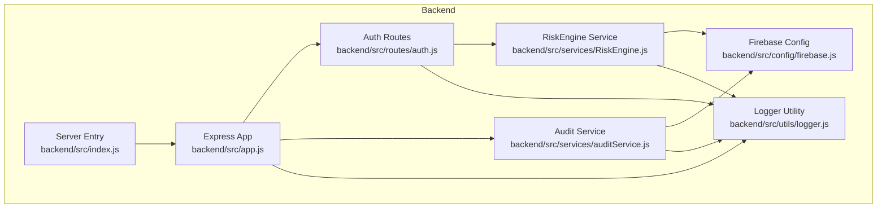
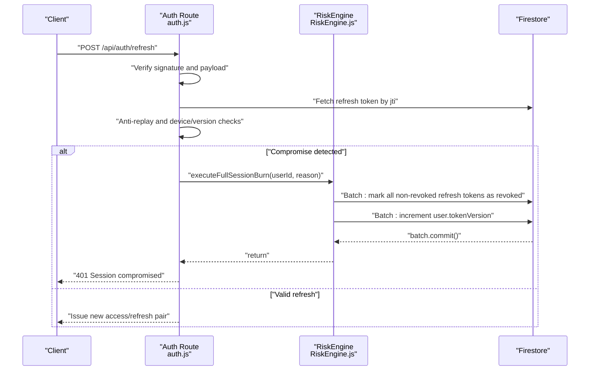
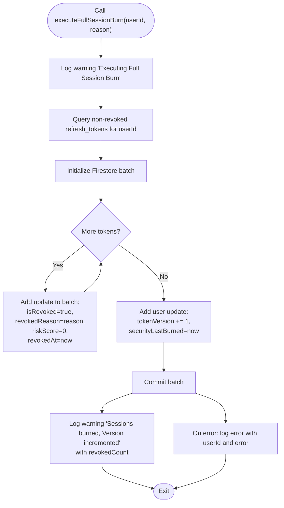
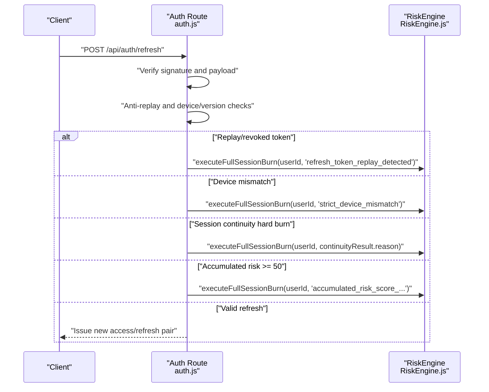
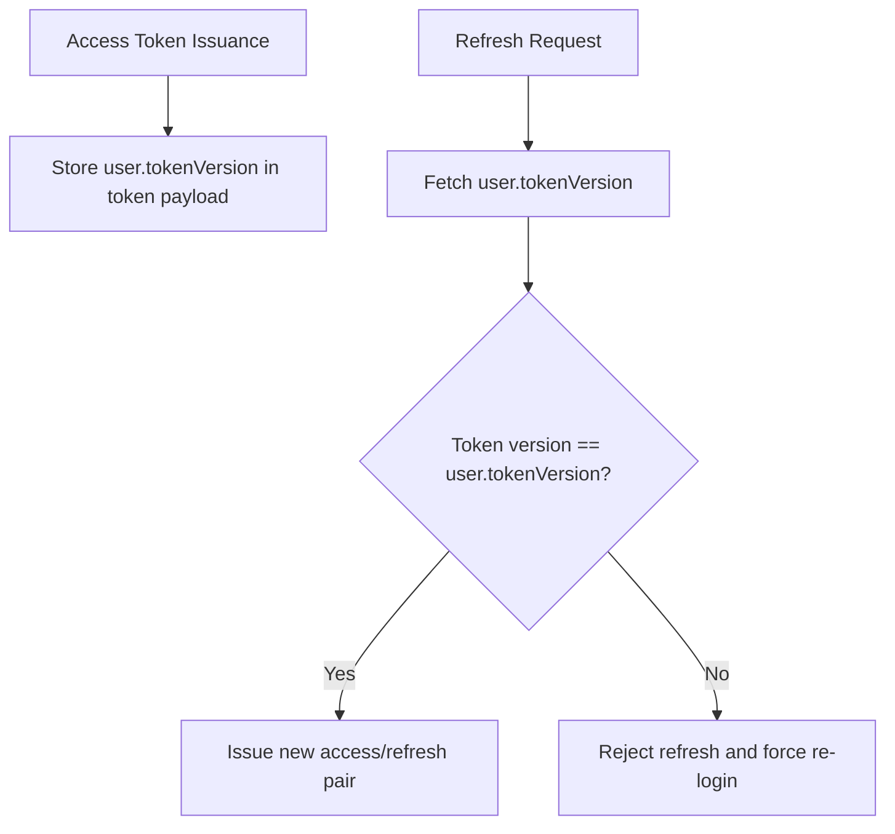
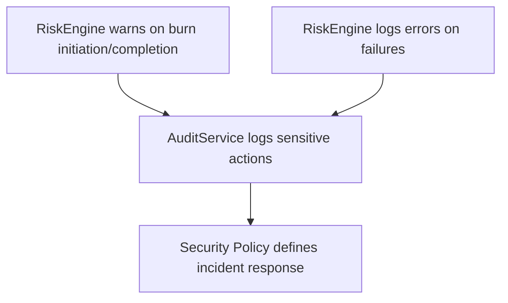
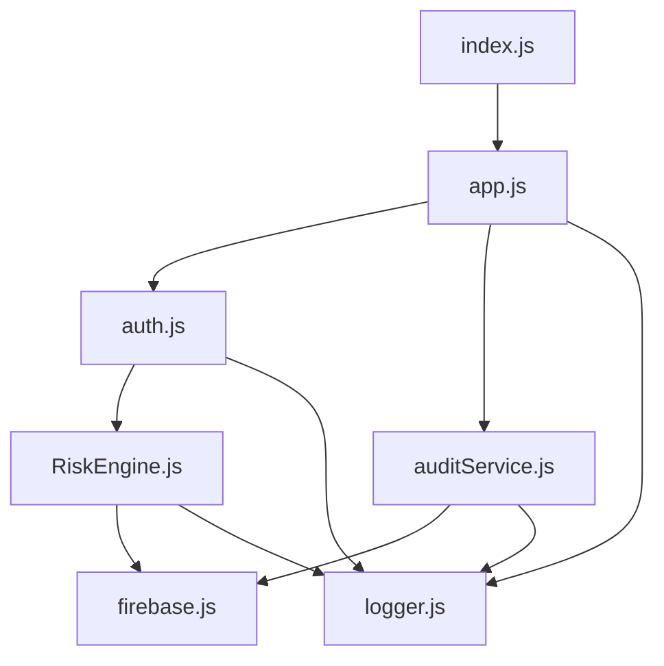

# Session Burn Execution

<cite>
**Referenced Files in This Document**
- [auth.js](file://backend/src/routes/auth.js)
- [RiskEngine.js](file://backend/src/services/RiskEngine.js)
- [auditService.js](file://backend/src/services/auditService.js)
- [logger.js](file://backend/src/utils/logger.js)
- [firebase.js](file://backend/src/config/firebase.js)
- [app.js](file://backend/src/app.js)
- [index.js](file://backend/src/index.js)
- [SECURITY.md](file://testpro-main/SECURITY.md)
</cite>

## Table of Contents
1. [Introduction](#introduction)
2. [Project Structure](#project-structure)
3. [Core Components](#core-components)
4. [Architecture Overview](#architecture-overview)
5. [Detailed Component Analysis](#detailed-component-analysis)
6. [Dependency Analysis](#dependency-analysis)
7. [Performance Considerations](#performance-considerations)
8. [Troubleshooting Guide](#troubleshooting-guide)
9. [Conclusion](#conclusion)
10. [Appendices](#appendices)

## Introduction
This document explains the full session burn execution system used for global account containment. It focuses on the executeFullSessionBurn method that invalidates all existing refresh tokens and bumps the global token version to immediately invalidate any live JWT access tokens in circulation. The document details the two-phase process, security implications, Firestore batch operation efficiency, error handling, and integration with security incident response workflows. It also covers warning logs and audit trail generation for security monitoring.

## Project Structure
The session burn system spans authentication routes, a risk engine service, and supporting infrastructure:
- Authentication routes handle token issuance and refresh, invoking the risk engine for safety checks and triggering full containment when necessary.
- The risk engine encapsulates the executeFullSessionBurn method and session continuity evaluation.
- Audit logging records sensitive actions for compliance and monitoring.
- Logging utilities emit warnings and errors for security events.
- Firebase configuration initializes the Firestore connection used by the risk engine.

**Diagram sources**
- [auth.js](file://backend/src/routes/auth.js#L166-L280)
- [RiskEngine.js](file://backend/src/services/RiskEngine.js#L136-L168)
- [auditService.js](file://backend/src/services/auditService.js#L8-L32)
- [logger.js](file://backend/src/utils/logger.js#L1-L28)
- [firebase.js](file://backend/src/config/firebase.js#L27-L44)
- [app.js](file://backend/src/app.js#L35-L60)
- [index.js](file://backend/src/index.js#L1-L37)

**Section sources**
- [auth.js](file://backend/src/routes/auth.js#L1-L301)
- [RiskEngine.js](file://backend/src/services/RiskEngine.js#L1-L170)
- [auditService.js](file://backend/src/services/auditService.js#L1-L33)
- [logger.js](file://backend/src/utils/logger.js#L1-L28)
- [firebase.js](file://backend/src/config/firebase.js#L1-L46)
- [app.js](file://backend/src/app.js#L1-L78)
- [index.js](file://backend/src/index.js#L1-L37)

## Core Components
- Auth Routes: Orchestrates token issuance and refresh, performs signature verification, anti-replay checks, device/version validation, and triggers full session burn under confirmed compromise scenarios.
- RiskEngine: Implements executeFullSessionBurn and session continuity intelligence. It evaluates risk thresholds and decides when to escalate to global containment.
- Audit Service: Logs sensitive actions to Firestore and console for monitoring and compliance.
- Logger Utility: Emits structured warnings and errors for security events.
- Firebase Config: Initializes Firestore connection used by the risk engine and audit service.

**Section sources**
- [auth.js](file://backend/src/routes/auth.js#L166-L280)
- [RiskEngine.js](file://backend/src/services/RiskEngine.js#L136-L168)
- [auditService.js](file://backend/src/services/auditService.js#L8-L32)
- [logger.js](file://backend/src/utils/logger.js#L15-L26)
- [firebase.js](file://backend/src/config/firebase.js#L27-L44)

## Architecture Overview
The session burn architecture enforces global account containment through two coordinated steps executed atomically via a Firestore batch:
1. Token invalidation: Marks all non-revoked refresh tokens for a user as revoked.
2. Global token version bump: Increments the user’s tokenVersion, which invalidates any live JWT access tokens signed with the previous version.

**Diagram sources**
- [auth.js](file://backend/src/routes/auth.js#L166-L280)
- [RiskEngine.js](file://backend/src/services/RiskEngine.js#L136-L168)

## Detailed Component Analysis

### executeFullSessionBurn Method
The executeFullSessionBurn method implements the global session burn:
- Phase 1: Token invalidation using Firestore batch operations
  - Queries all non-revoked refresh tokens for the user.
  - Builds a Firestore batch to update each token document: set isRevoked, record revokedReason, reset riskScore, and set revokedAt.
- Phase 2: Global token version increment
  - Updates the user document to increment tokenVersion and sets securityLastBurned.
- Atomicity and completion
  - Commits the batch to ensure both phases succeed or fail together.
  - Emits structured warnings and info logs for monitoring and auditing.

**Diagram sources**
- [RiskEngine.js](file://backend/src/services/RiskEngine.js#L136-L168)

**Section sources**
- [RiskEngine.js](file://backend/src/services/RiskEngine.js#L136-L168)

### Auth Route Integration and Containment Triggers
The auth refresh route integrates the session burn in multiple high-confidence compromise scenarios:
- Replay attack or revoked token usage: Anti-replay check detects replayed or revoked tokens and triggers burn.
- Strict device ID mismatch: Device hash mismatch on refresh triggers burn.
- Session continuity hard burn: Concurrency or frequency anomalies trigger burn.
- Accumulated risk threshold: Combined risk exceeding threshold triggers burn.

**Diagram sources**
- [auth.js](file://backend/src/routes/auth.js#L166-L280)
- [RiskEngine.js](file://backend/src/services/RiskEngine.js#L71-L130)

**Section sources**
- [auth.js](file://backend/src/routes/auth.js#L166-L280)
- [RiskEngine.js](file://backend/src/services/RiskEngine.js#L71-L130)

### Token Versioning and Access Token Invalidation
The global token version increment invalidates live JWT access tokens because:
- Access tokens carry the user’s tokenVersion at issuance time.
- On refresh, the route fetches the current user tokenVersion and compares it to the token’s version.
- If mismatched, the route rejects the refresh, forcing clients to re-authenticate and obtain a new access token bound to the updated version.

**Diagram sources**
- [auth.js](file://backend/src/routes/auth.js#L194-L200)
- [auth.js](file://backend/src/routes/auth.js#L114-L124)

**Section sources**
- [auth.js](file://backend/src/routes/auth.js#L114-L124)
- [auth.js](file://backend/src/routes/auth.js#L194-L200)

### Audit Trail and Security Monitoring
- Warning logs: The risk engine emits warnings when initiating and completing a session burn, including the number of revoked tokens.
- Error logs: Errors during batch commit are captured for triage.
- Audit logs: Sensitive actions can be recorded via the audit service for compliance and forensics.
- Security policy: The project’s security policy outlines incident response procedures that align with automated containment.

**Diagram sources**
- [RiskEngine.js](file://backend/src/services/RiskEngine.js#L138-L167)
- [auditService.js](file://backend/src/services/auditService.js#L8-L32)
- [SECURITY.md](file://testpro-main/SECURITY.md#L134-L142)

**Section sources**
- [RiskEngine.js](file://backend/src/services/RiskEngine.js#L138-L167)
- [auditService.js](file://backend/src/services/auditService.js#L8-L32)
- [SECURITY.md](file://testpro-main/SECURITY.md#L134-L142)

## Dependency Analysis
- Auth routes depend on the risk engine for containment decisions and on Firestore for token and user persistence.
- Risk engine depends on Firestore admin SDK for queries and batch writes.
- Audit service depends on Firestore and logger for immutable audit logs and observability.
- Logger utility provides centralized logging for security events.
- Express app mounts auth routes and audit service, while the server entry manages lifecycle and error handling.

**Diagram sources**
- [auth.js](file://backend/src/routes/auth.js#L1-L301)
- [RiskEngine.js](file://backend/src/services/RiskEngine.js#L1-L170)
- [auditService.js](file://backend/src/services/auditService.js#L1-L33)
- [logger.js](file://backend/src/utils/logger.js#L1-L28)
- [firebase.js](file://backend/src/config/firebase.js#L1-L46)
- [app.js](file://backend/src/app.js#L1-L78)
- [index.js](file://backend/src/index.js#L1-L37)

**Section sources**
- [auth.js](file://backend/src/routes/auth.js#L1-L301)
- [RiskEngine.js](file://backend/src/services/RiskEngine.js#L1-L170)
- [auditService.js](file://backend/src/services/auditService.js#L1-L33)
- [logger.js](file://backend/src/utils/logger.js#L1-L28)
- [firebase.js](file://backend/src/config/firebase.js#L1-L46)
- [app.js](file://backend/src/app.js#L1-L78)
- [index.js](file://backend/src/index.js#L1-L37)

## Performance Considerations
- Firestore batch efficiency: The session burn uses a single batch to update all non-revoked refresh tokens and the user document, minimizing round-trips and ensuring atomicity.
- Query scope: The query targets non-revoked tokens for the user, avoiding unnecessary updates and reducing batch size.
- Increment field: Using FieldValue.increment avoids read-modify-write conflicts and ensures monotonic versioning.
- Logging overhead: Structured logs are emitted around the burn for observability without blocking the main flow.

[No sources needed since this section provides general guidance]

## Troubleshooting Guide
Common issues and resolutions:
- Batch commit failures: The risk engine catches and logs errors during batch commit. Investigate Firestore quotas, permission issues, or transient errors.
- Missing environment variables: Ensure Firestore credentials are configured; initialization failure prevents the risk engine from accessing Firestore.
- Audit log write failures: The audit service logs failures internally but does not crash the request; investigate Firestore connectivity or permissions.
- Excessive token churn: If users frequently exceed session caps, consider adjusting thresholds or providing guidance to reduce refresh storms.

**Section sources**
- [RiskEngine.js](file://backend/src/services/RiskEngine.js#L165-L167)
- [firebase.js](file://backend/src/config/firebase.js#L13-L17)
- [auditService.js](file://backend/src/services/auditService.js#L24-L28)

## Conclusion
The session burn execution system provides a robust, atomic mechanism to contain global account compromise by invalidating all active refresh tokens and bumping the global token version. Its integration with the auth refresh flow, risk engine, and audit/logging infrastructure ensures strong security posture, operational visibility, and alignment with incident response procedures.

[No sources needed since this section summarizes without analyzing specific files]

## Appendices

### Example Scenarios
- Replay attack detected: A revoked or replayed refresh token triggers burn and returns an unauthorized response.
- Device mismatch: A refresh request from a different device hash triggers burn and forces re-authentication.
- Session continuity anomaly: Concurrency or excessive refresh frequency triggers burn.
- Accumulated risk threshold: Combined behavioral and temporal risk exceeds the hard-burn threshold, triggering burn.

**Section sources**
- [auth.js](file://backend/src/routes/auth.js#L183-L190)
- [auth.js](file://backend/src/routes/auth.js#L202-L207)
- [auth.js](file://backend/src/routes/auth.js#L210-L214)
- [auth.js](file://backend/src/routes/auth.js#L221-L224)