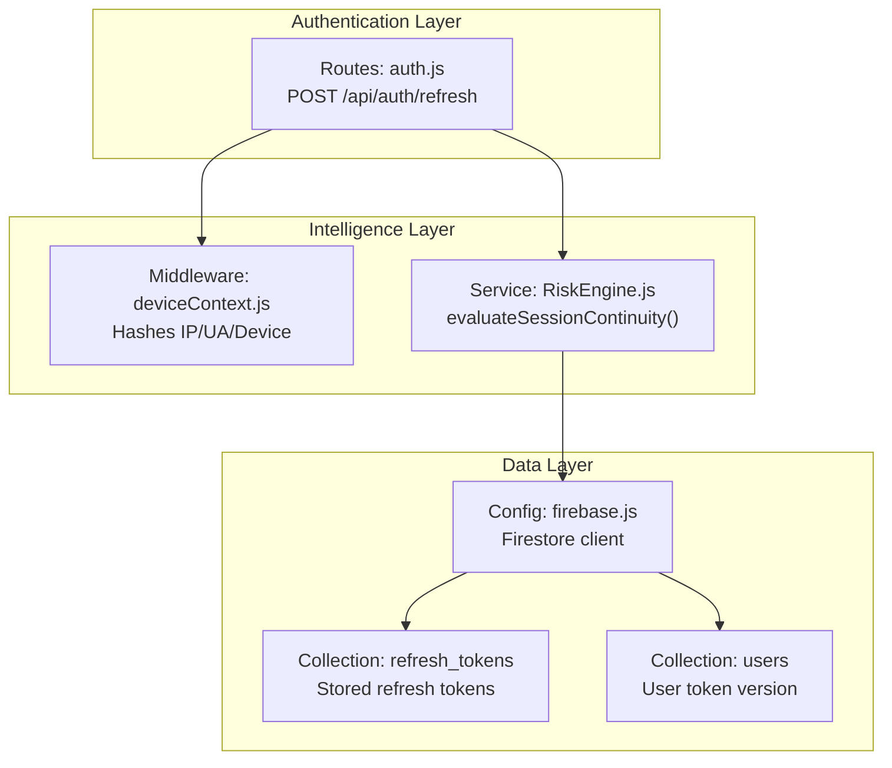
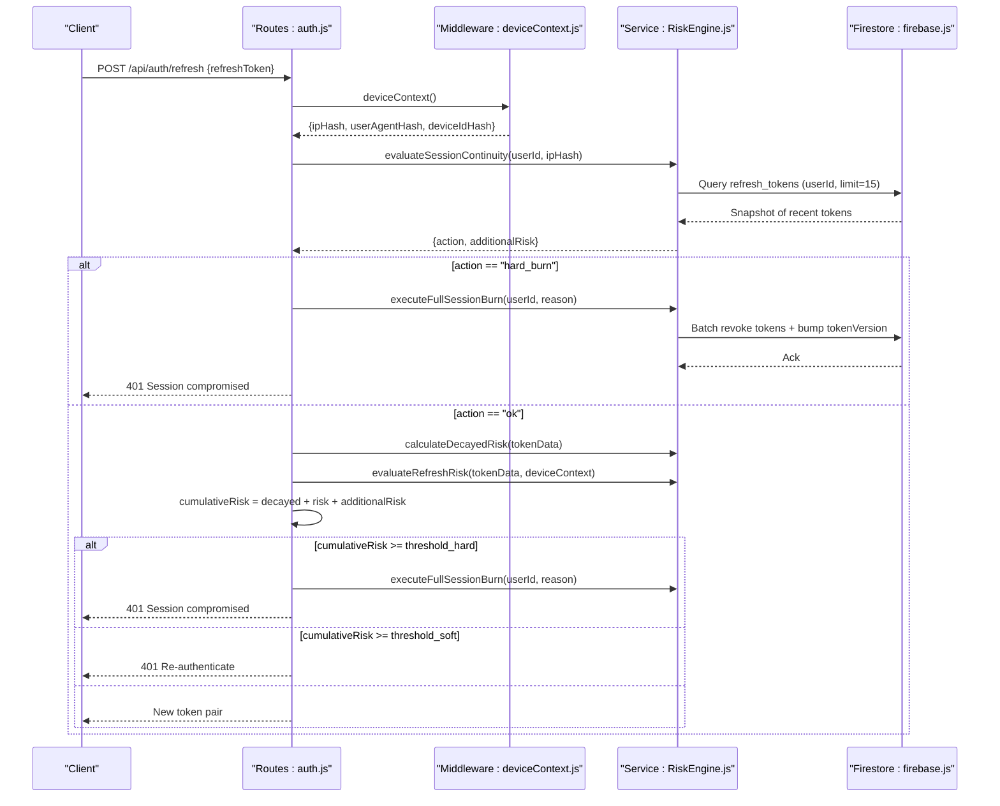
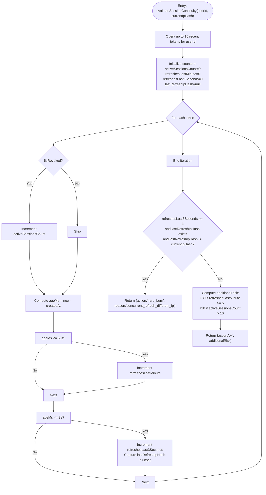
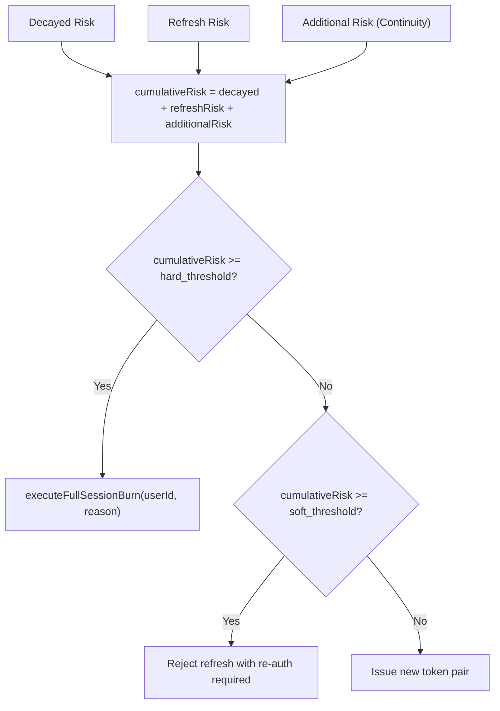
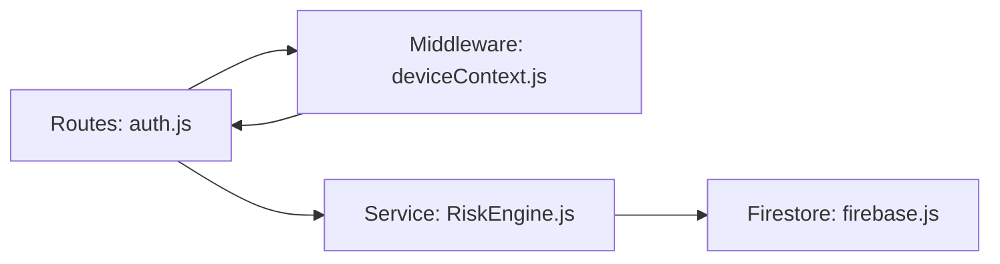

# Session Continuity Intelligence

<cite>
**Referenced Files in This Document**
- [RiskEngine.js](file://backend/src/services/RiskEngine.js)
- [auth.js](file://backend/src/routes/auth.js)
- [deviceContext.js](file://backend/src/middleware/deviceContext.js)
- [firebase.js](file://backend/src/config/firebase.js)
</cite>

## Table of Contents
1. [Introduction](#introduction)
2. [Project Structure](#project-structure)
3. [Core Components](#core-components)
4. [Architecture Overview](#architecture-overview)
5. [Detailed Component Analysis](#detailed-component-analysis)
6. [Dependency Analysis](#dependency-analysis)
7. [Performance Considerations](#performance-considerations)
8. [Troubleshooting Guide](#troubleshooting-guide)
9. [Conclusion](#conclusion)

## Introduction
This document describes the Session Continuity Intelligence system responsible for monitoring concurrent refresh races, velocity patterns, and active session limits during refresh token operations. It focuses on the evaluateSessionContinuity method that analyzes up to 15 recent tokens per user to detect suspicious activity patterns and integrates with the broader risk scoring system to make enforcement decisions.

## Project Structure
The session continuity intelligence spans three primary areas:
- Authentication route: Orchestrates refresh token validation and delegates session continuity checks.
- Risk engine: Implements temporal and behavioral session continuity logic and global session containment.
- Device context middleware: Normalizes and hashes client identifiers to preserve privacy while enabling correlation.

**Diagram sources**
- [auth.js](file://backend/src/routes/auth.js#L166-L280)
- [deviceContext.js](file://backend/src/middleware/deviceContext.js#L1-L24)
- [RiskEngine.js](file://backend/src/services/RiskEngine.js#L71-L130)
- [firebase.js](file://backend/src/config/firebase.js#L41-L46)

**Section sources**
- [auth.js](file://backend/src/routes/auth.js#L166-L280)
- [deviceContext.js](file://backend/src/middleware/deviceContext.js#L1-L24)
- [RiskEngine.js](file://backend/src/services/RiskEngine.js#L71-L130)
- [firebase.js](file://backend/src/config/firebase.js#L41-L46)

## Core Components
- evaluateSessionContinuity(userId, currentIpHash): Analyzes up to 15 recent refresh tokens for a user to compute:
  - Active session count (revocation filter)
  - Recent refresh frequency within 1 minute
  - Concurrent refresh race within 3 seconds with differing IP
  - Returns either a hard burn action or an additional risk contribution for broader scoring
- Integration points:
  - Called during refresh after strict device validation
  - Combined with refresh risk and decayed risk to decide soft lock or full burn
  - Triggers global session burn when a hard-burn condition is met

Key behaviors:
- Velocity calculations: Count refresh events within 60 seconds and 3 seconds windows.
- Session counting logic: Increment active sessions for non-revoked tokens.
- IP hash tracking: Capture the IP hash of the most recent prior refresh within the 3-second window to detect concurrent race conditions.

**Section sources**
- [RiskEngine.js](file://backend/src/services/RiskEngine.js#L71-L130)
- [auth.js](file://backend/src/routes/auth.js#L209-L214)

## Architecture Overview
The refresh flow integrates session continuity intelligence with broader risk scoring and enforcement.

**Diagram sources**
- [auth.js](file://backend/src/routes/auth.js#L166-L280)
- [deviceContext.js](file://backend/src/middleware/deviceContext.js#L1-L24)
- [RiskEngine.js](file://backend/src/services/RiskEngine.js#L71-L168)
- [firebase.js](file://backend/src/config/firebase.js#L41-L46)

## Detailed Component Analysis

### evaluateSessionContinuity Method
Purpose:
- Detect concurrent refresh race conditions (different IP within 3 seconds)
- Identify token refresh storms (frequency abuse with 5+ refreshes per minute)
- Enforce active session caps (>10 active sessions)

Processing logic:
- Fetches up to 15 most recent refresh tokens for the user ordered by creation time.
- Iterates tokens to:
  - Count active sessions (non-revoked)
  - Count refreshes within the last 60 seconds
  - Count refreshes within the last 3 seconds and capture the IP hash of the most recent prior refresh
- Decision flow:
  - If any 3-second refresh exists and the captured IP differs from the current IP, trigger a hard burn.
  - Otherwise, compute additional risk:
    - 30 points if 5+ refreshes occurred within the last minute
    - 20 points if active sessions exceed 10
  - Return action "ok" with additional risk for downstream scoring.

**Diagram sources**
- [RiskEngine.js](file://backend/src/services/RiskEngine.js#L71-L130)

**Section sources**
- [RiskEngine.js](file://backend/src/services/RiskEngine.js#L71-L130)

### Integration with Risk Scoring
The session continuity result is combined with other risk signals:
- Decayed risk: Reduces historical risk based on elapsed time since last seen.
- Refresh risk: Compares device, user agent, and IP hashes between stored and current contexts.
- Additional risk: From session continuity checks.

Decision thresholds:
- Hard burn: Immediate global session burn when accumulated risk meets or exceeds a high threshold.
- Soft lock: Reject refresh and require re-authentication without burning other sessions when a moderate threshold is met.

**Diagram sources**
- [auth.js](file://backend/src/routes/auth.js#L216-L230)
- [RiskEngine.js](file://backend/src/services/RiskEngine.js#L36-L49)
- [RiskEngine.js](file://backend/src/services/RiskEngine.js#L11-L30)
- [RiskEngine.js](file://backend/src/services/RiskEngine.js#L55-L65)

**Section sources**
- [auth.js](file://backend/src/routes/auth.js#L216-L230)
- [RiskEngine.js](file://backend/src/services/RiskEngine.js#L36-L49)
- [RiskEngine.js](file://backend/src/services/RiskEngine.js#L11-L30)
- [RiskEngine.js](file://backend/src/services/RiskEngine.js#L55-L65)

### Practical Examples and Risk Assessment Scenarios
- Concurrent refresh race condition:
  - Scenario: Two simultaneous refresh requests from different IPs within 3 seconds for the same user.
  - Outcome: Hard burn immediately to contain potential session takeover.
- Token refresh storm:
  - Scenario: A user rapidly rotates refresh tokens more than 5 times within a minute.
  - Outcome: Elevated additional risk contributes to higher cumulative risk, potentially triggering soft lock or hard burn depending on thresholds.
- Active session cap violation:
  - Scenario: A user maintains more than 10 active refresh tokens concurrently.
  - Outcome: Additional risk applied; combined with other factors determines enforcement action.
- Normal behavior:
  - Scenario: Standard refresh activity with typical intervals and reasonable active session counts.
  - Outcome: No additional risk; refresh proceeds normally.

[No sources needed since this section provides general guidance]

## Dependency Analysis
- Routes depend on middleware for device context hashing and on the risk engine for session continuity checks.
- Risk engine depends on Firestore for querying refresh tokens and on logging for diagnostics.
- Device context middleware depends on cryptographic hashing to anonymize identifiers.

**Diagram sources**
- [auth.js](file://backend/src/routes/auth.js#L166-L280)
- [deviceContext.js](file://backend/src/middleware/deviceContext.js#L1-L24)
- [RiskEngine.js](file://backend/src/services/RiskEngine.js#L71-L130)
- [firebase.js](file://backend/src/config/firebase.js#L41-L46)

**Section sources**
- [auth.js](file://backend/src/routes/auth.js#L166-L280)
- [deviceContext.js](file://backend/src/middleware/deviceContext.js#L1-L24)
- [RiskEngine.js](file://backend/src/services/RiskEngine.js#L71-L130)
- [firebase.js](file://backend/src/config/firebase.js#L41-L46)

## Performance Considerations
- Query scope: Limits recent token retrieval to 15 entries per user, reducing collection scan overhead.
- In-memory hashing: Device and IP identifiers are hashed in middleware to avoid storing sensitive data.
- Batch updates: Global session burns use Firestore batch operations to minimize write amplification.
- Logging: Structured logs include user identifiers and reasons to support incident response without exposing sensitive data.

[No sources needed since this section provides general guidance]

## Troubleshooting Guide
Common issues and resolutions:
- Missing device ID on refresh:
  - Symptom: 400 error indicating device ID requirement.
  - Cause: Missing x-device-id header.
  - Resolution: Ensure clients include the device identifier header.
- Session continuity hard burn:
  - Symptom: 401 Session compromised.
  - Cause: Concurrent refresh race detected across different IPs within 3 seconds.
  - Resolution: Advise user to authenticate again; investigate potential device compromise.
- Soft lock requiring re-authentication:
  - Symptom: 401 with instruction to re-authenticate.
  - Cause: Accumulated risk meets soft lock threshold after combining decayed risk, refresh risk, and additional risk.
  - Resolution: Prompt user to log in again; review behavior patterns.
- Database query failures:
  - Symptom: Error logs during session continuity evaluation.
  - Cause: Firestore read failure or timeout.
  - Resolution: Retry logic is implicit in the method returning safe defaults; verify Firestore connectivity and permissions.

**Section sources**
- [deviceContext.js](file://backend/src/middleware/deviceContext.js#L12-L14)
- [auth.js](file://backend/src/routes/auth.js#L211-L214)
- [auth.js](file://backend/src/routes/auth.js#L226-L230)
- [RiskEngine.js](file://backend/src/services/RiskEngine.js#L126-L129)

## Conclusion
The Session Continuity Intelligence system provides robust detection of concurrent refresh races, velocity abuse, and excessive active sessions. By integrating with broader risk scoring and enforcing immediate containment when necessary, it strengthens protection against session hijacking and token misuse while maintaining operational safety and user experience.