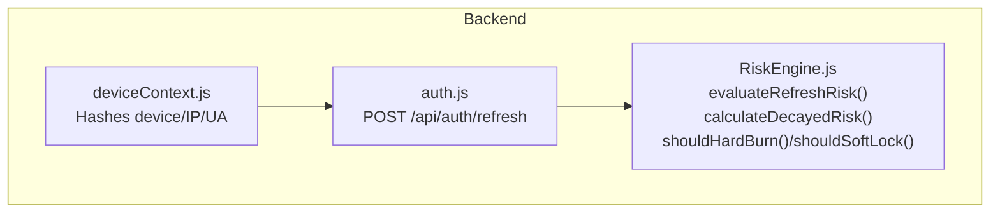
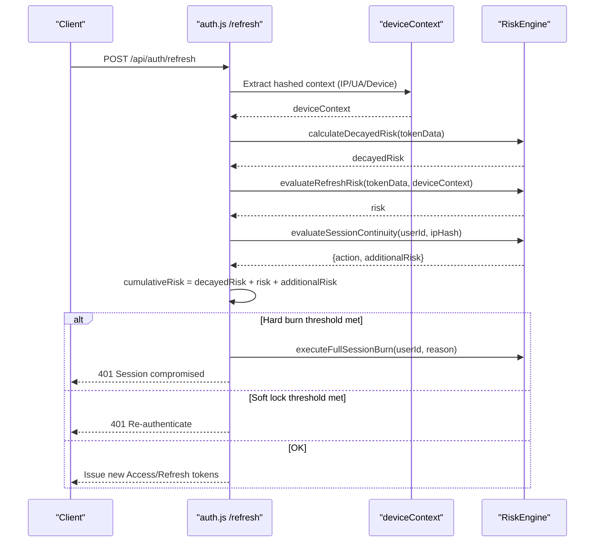
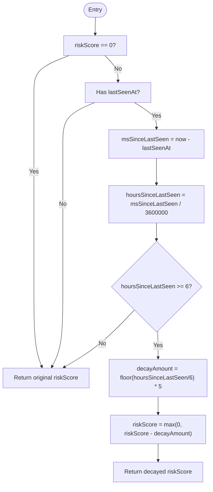
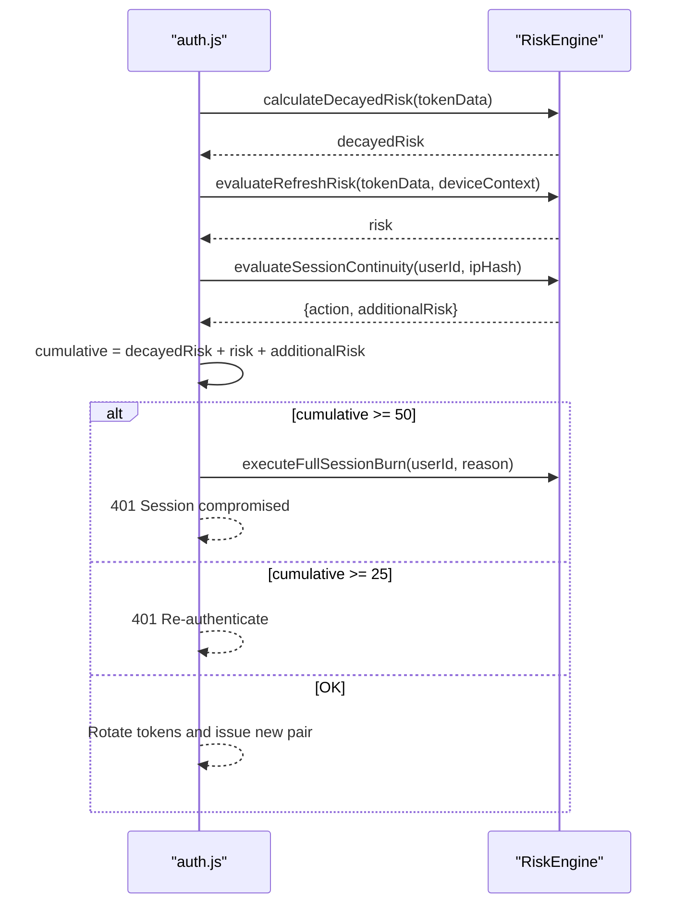
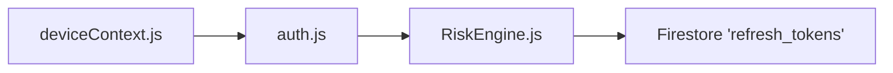

# Temporal Risk Decay

<cite>
**Referenced Files in This Document**
- [RiskEngine.js](file://backend/src/services/RiskEngine.js)
- [auth.js](file://backend/src/routes/auth.js)
- [deviceContext.js](file://backend/src/middleware/deviceContext.js)
</cite>

## Table of Contents
1. [Introduction](#introduction)
2. [Project Structure](#project-structure)
3. [Core Components](#core-components)
4. [Architecture Overview](#architecture-overview)
5. [Detailed Component Analysis](#detailed-component-analysis)
6. [Dependency Analysis](#dependency-analysis)
7. [Performance Considerations](#performance-considerations)
8. [Troubleshooting Guide](#troubleshooting-guide)
9. [Conclusion](#conclusion)

## Introduction
This document explains the temporal risk decay mechanism that reduces risk scores over time for refresh tokens. It focuses on:
- The decay algorithm that subtracts 5 points for every 6 hours of clean history
- How hoursSinceLastSeen is computed from timestamps
- The mathematical formula for decay amount
- Minimum risk score enforcement at zero
- Edge cases and integration with token refresh cycles
- Performance considerations for timestamp comparisons and memory efficiency

## Project Structure
The temporal risk decay lives in the backend service layer and is invoked during refresh token issuance. The relevant files are:
- RiskEngine.js: Implements risk evaluation, decay, thresholds, and session continuity checks
- auth.js: Orchestrates token issuance and refresh, invoking RiskEngine
- deviceContext.js: Provides hashed device/IP/UA context used for risk scoring

**Diagram sources**
- [auth.js](file://backend/src/routes/auth.js#L166-L280)
- [RiskEngine.js](file://backend/src/services/RiskEngine.js#L11-L49)
- [deviceContext.js](file://backend/src/middleware/deviceContext.js#L7-L23)

**Section sources**
- [RiskEngine.js](file://backend/src/services/RiskEngine.js#L1-L170)
- [auth.js](file://backend/src/routes/auth.js#L166-L280)
- [deviceContext.js](file://backend/src/middleware/deviceContext.js#L1-L24)

## Core Components
- RiskEngine.calculateDecayedRisk(tokenData): Computes time-based risk decay using lastSeenAt and current time
- RiskEngine.evaluateRefreshRisk(storedSession, currentContext): Scores deviations in device, UA, and IP
- auth refresh flow: Integrates decay and risk scoring into refresh token issuance

Key behaviors:
- Decay applies only when lastSeenAt exists and riskScore > 0
- Hours since last seen computed as milliseconds elapsed divided by milliseconds per hour
- Decay amount: floor(hoursSinceLastSeen / 6) multiplied by 5
- Final risk score clamped to a minimum of 0

**Section sources**
- [RiskEngine.js](file://backend/src/services/RiskEngine.js#L32-L49)
- [auth.js](file://backend/src/routes/auth.js#L216-L219)

## Architecture Overview
The refresh flow integrates temporal decay with behavioral risk and session continuity checks.

**Diagram sources**
- [auth.js](file://backend/src/routes/auth.js#L166-L280)
- [RiskEngine.js](file://backend/src/services/RiskEngine.js#L36-L49)
- [RiskEngine.js](file://backend/src/services/RiskEngine.js#L71-L130)

## Detailed Component Analysis

### Temporal Risk Decay Algorithm
The decay algorithm operates on the refresh token document and reduces risk over time when no suspicious activity occurs.

- Inputs:
  - tokenData.riskScore: accumulated risk score
  - tokenData.lastSeenAt: timestamp of the last clean observation
- Computation:
  - msSinceLastSeen = now - parseISO(lastSeenAt)
  - hoursSinceLastSeen = msSinceLastSeen / (1000 * 60 * 60)
  - If hoursSinceLastSeen >= 6:
    - decayAmount = floor(hoursSinceLastSeen / 6) * 5
    - riskScore = max(0, riskScore - decayAmount)
- Output:
  - Updated riskScore (never below 0)

Edge cases handled:
- No lastSeenAt present: no decay applied
- riskScore is 0: no decay applied
- Negative drift due to clock skew: hoursSinceLastSeen < 6 yields no decay

Integration points:
- Invoked during refresh after initial risk scoring and continuity checks
- Updated token document persists riskScore and lastSeenAt on soft lock or successful rotation

**Section sources**
- [RiskEngine.js](file://backend/src/services/RiskEngine.js#L32-L49)
- [auth.js](file://backend/src/routes/auth.js#L216-L229)

### Hours Since Last Seen Calculation
- The difference between current time and lastSeenAt is computed in milliseconds
- Converted to hours by dividing by the number of milliseconds per hour
- Floor division by 6 determines how many full 6-hour periods have elapsed
- Each full period deducts 5 points

**Diagram sources**
- [RiskEngine.js](file://backend/src/services/RiskEngine.js#L36-L49)

### Risk Score Evolution Examples
Below are example evolutions over time for a token with riskScore = 20 and lastSeenAt aligned to a reference moment. Values reflect the decay algorithm described above.

- Reference: riskScore = 20, lastSeenAt = T0
- After 6 hours: riskScore = 15 (20 - 5)
- After 12 hours: riskScore = 10 (15 - 5)
- After 18 hours: riskScore = 5 (10 - 5)
- After 24 hours: riskScore = 0 (5 - 5; clamped to 0)
- After 30 hours: riskScore = 0 (no further decay)

Note: These examples illustrate the decay progression and do not imply specific thresholds for hard/soft lock actions.

### Integration With Token Refresh Cycles
During refresh:
- calculateDecayedRisk reduces risk if sufficient time has passed
- evaluateRefreshRisk adds points for device/UA/IP mismatches
- evaluateSessionContinuity adds points for high-frequency refresh storms or excessive active sessions
- Cumulative risk decides whether to hard burn, soft lock, or rotate tokens

**Diagram sources**
- [auth.js](file://backend/src/routes/auth.js#L216-L230)
- [RiskEngine.js](file://backend/src/services/RiskEngine.js#L55-L65)
- [RiskEngine.js](file://backend/src/services/RiskEngine.js#L136-L168)

## Dependency Analysis
- auth.js depends on RiskEngine for risk scoring and decay
- RiskEngine depends on Firestore for session continuity checks and on deviceContext for behavioral signals
- deviceContext provides hashed identifiers to avoid storing sensitive data

**Diagram sources**
- [auth.js](file://backend/src/routes/auth.js#L166-L280)
- [RiskEngine.js](file://backend/src/services/RiskEngine.js#L71-L130)
- [deviceContext.js](file://backend/src/middleware/deviceContext.js#L7-L23)

**Section sources**
- [auth.js](file://backend/src/routes/auth.js#L166-L280)
- [RiskEngine.js](file://backend/src/services/RiskEngine.js#L1-L170)
- [deviceContext.js](file://backend/src/middleware/deviceContext.js#L1-L24)

## Performance Considerations
- Timestamp comparisons
  - All comparisons use numeric Date.now() and parsed timestamps, avoiding string parsing overhead
  - No timezone conversions are performed; comparisons rely on consistent epoch milliseconds
- Memory efficiency
  - calculateDecayedRisk performs constant-time arithmetic and returns immediately
  - No in-memory caches are used for decay computation, minimizing footprint
- Database reads for continuity checks
  - evaluateSessionContinuity queries up to 15 recent tokens and performs O(n) iteration
  - Consider indexing userId and createdAt for improved query performance at scale

[No sources needed since this section provides general guidance]

## Troubleshooting Guide
Common scenarios and resolutions:
- Unexpected lack of decay
  - Ensure lastSeenAt is present and riskScore > 0
  - Confirm that sufficient time has elapsed (>= 6 hours)
- Clock skew effects
  - If lastSeenAt is in the future relative to current time, hoursSinceLastSeen will be negative and no decay occurs
- Immediate hard burn
  - Review evaluateRefreshRisk and evaluateSessionContinuity contributions to cumulative risk
  - Hard burn triggers when cumulative risk reaches/exceeds 50
- Soft lock behavior
  - Occurs when cumulative risk reaches/exceeds 25; the system updates riskScore and lastSeenAt and requires re-authentication

Operational checks:
- Verify that auth refresh flow invokes calculateDecayedRisk and persists riskScore/lastSeenAt appropriately
- Confirm deviceContext hashing is enabled and device_id is provided on refresh requests

**Section sources**
- [RiskEngine.js](file://backend/src/services/RiskEngine.js#L32-L49)
- [auth.js](file://backend/src/routes/auth.js#L216-L229)

## Conclusion
The temporal risk decay mechanism provides a predictable, time-based reduction in risk scores for clean sessions. By subtracting 5 points for every 6 hours of uninterrupted history and enforcing a minimum score of 0, the system balances security responsiveness with user experience. Its integration into the refresh flow ensures that decay interacts with behavioral risk and session continuity checks to maintain robust protection against token misuse.