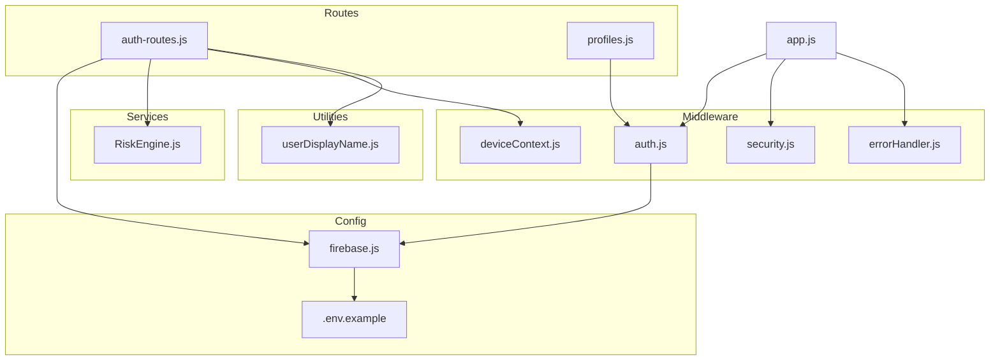
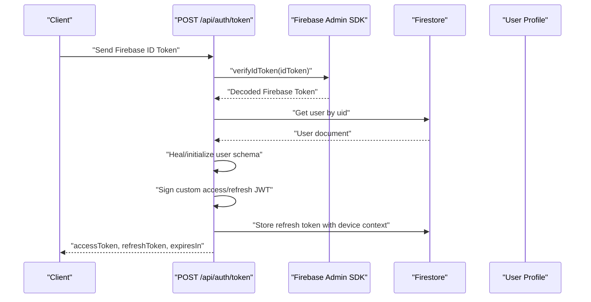
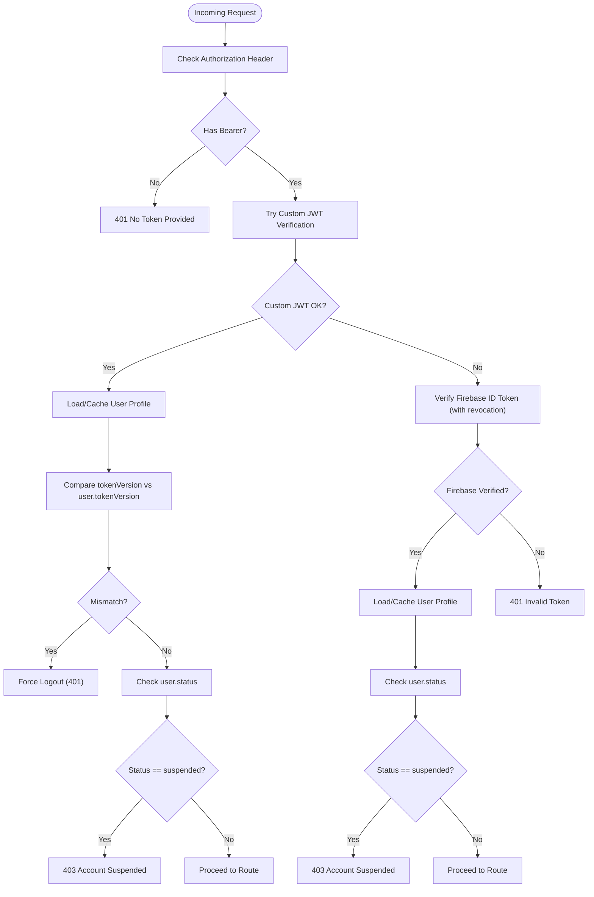
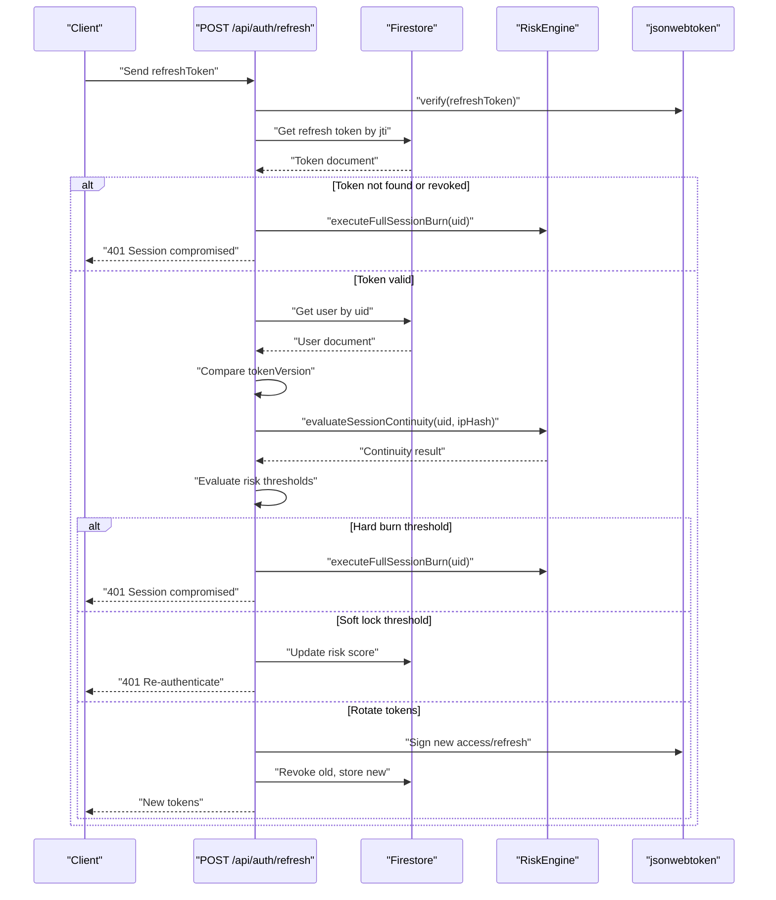
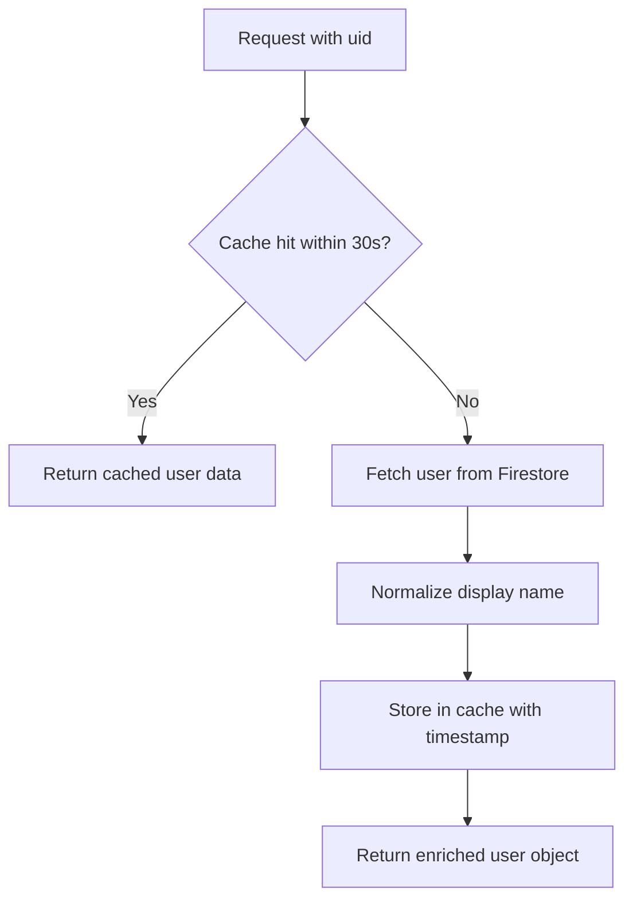
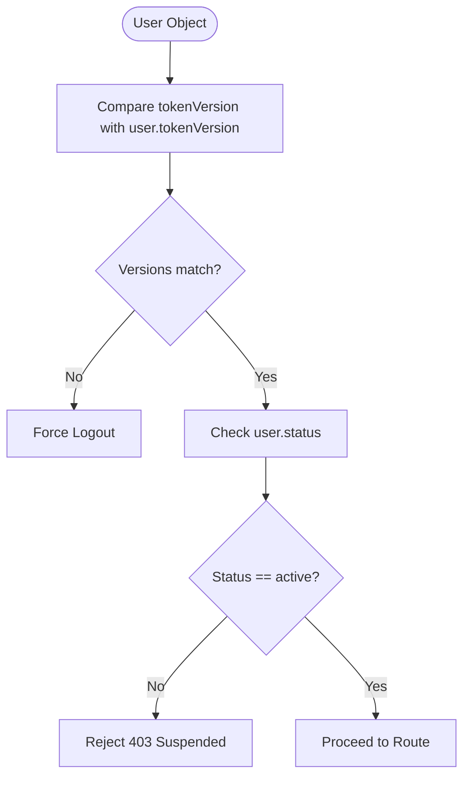
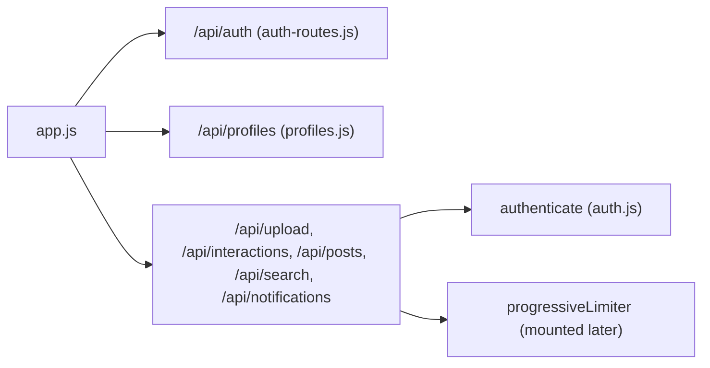
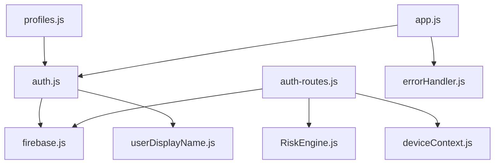

# Authentication Middleware

<cite>
**Referenced Files in This Document**
- [auth.js](file://backend/src/middleware/auth.js)
- [firebase.js](file://backend/src/config/firebase.js)
- [auth-routes.js](file://backend/src/routes/auth.js)
- [RiskEngine.js](file://backend/src/services/RiskEngine.js)
- [deviceContext.js](file://backend/src/middleware/deviceContext.js)
- [userDisplayName.js](file://backend/src/utils/userDisplayName.js)
- [app.js](file://backend/src/app.js)
- [errorHandler.js](file://backend/src/middleware/errorHandler.js)
- [profiles.js](file://backend/src/routes/profiles.js)
- [.env.example](file://backend/.env.example)
- [package.json](file://backend/package.json)
</cite>

## Table of Contents
1. [Introduction](#introduction)
2. [Project Structure](#project-structure)
3. [Core Components](#core-components)
4. [Architecture Overview](#architecture-overview)
5. [Detailed Component Analysis](#detailed-component-analysis)
6. [Dependency Analysis](#dependency-analysis)
7. [Performance Considerations](#performance-considerations)
8. [Troubleshooting Guide](#troubleshooting-guide)
9. [Conclusion](#conclusion)

## Introduction
This document describes the authentication middleware system that implements a dual-token authentication approach supporting both custom short-lived JWT access tokens and Firebase ID tokens. It covers token verification, user profile caching with 30-second TTL, user data enrichment, security version checking for instant kill switches, account suspension handling, and integration patterns with route handlers. It also includes error handling for expired and revoked tokens, troubleshooting guidance, and performance optimization tips for the caching system.

## Project Structure
The authentication system spans several modules:
- Middleware: authentication, device fingerprinting, security headers, error handling
- Routes: token issuance and refresh endpoints
- Services: risk engine for session continuity and anomaly detection
- Utilities: display name normalization
- Configuration: Firebase Admin initialization

**Diagram sources**
- [auth.js](file://backend/src/middleware/auth.js#L1-L164)
- [deviceContext.js](file://backend/src/middleware/deviceContext.js#L1-L24)
- [security.js](file://backend/src/middleware/security.js#L1-L75)
- [errorHandler.js](file://backend/src/middleware/errorHandler.js#L1-L35)
- [auth-routes.js](file://backend/src/routes/auth.js#L1-L301)
- [RiskEngine.js](file://backend/src/services/RiskEngine.js#L1-L170)
- [firebase.js](file://backend/src/config/firebase.js#L1-L46)
- [userDisplayName.js](file://backend/src/utils/userDisplayName.js#L1-L38)
- [app.js](file://backend/src/app.js#L1-L78)
- [.env.example](file://backend/.env.example#L1-L25)

**Section sources**
- [app.js](file://backend/src/app.js#L1-L78)
- [auth.js](file://backend/src/middleware/auth.js#L1-L164)
- [auth-routes.js](file://backend/src/routes/auth.js#L1-L301)
- [firebase.js](file://backend/src/config/firebase.js#L1-L46)

## Core Components
- Dual-token authentication: custom JWT access tokens (short-lived) and Firebase ID tokens (long-lived)
- User profile caching: in-memory cache with 30-second TTL to reduce Firestore reads
- Security version checking: instant kill switch via tokenVersion to force logout on policy changes
- Account suspension handling: rejects requests from suspended users
- Risk-aware refresh: device continuity checks, temporal velocity monitoring, and risk scoring
- Route integration: protected routes enforce authentication before applying rate limiting

Key implementation references:
- Authentication middleware and caching: [auth.js](file://backend/src/middleware/auth.js#L1-L164)
- Token issuance and refresh: [auth-routes.js](file://backend/src/routes/auth.js#L1-L301)
- Risk engine: [RiskEngine.js](file://backend/src/services/RiskEngine.js#L1-L170)
- Device context hashing: [deviceContext.js](file://backend/src/middleware/deviceContext.js#L1-L24)
- Display name normalization: [userDisplayName.js](file://backend/src/utils/userDisplayName.js#L1-L38)
- Firebase initialization: [firebase.js](file://backend/src/config/firebase.js#L1-L46)
- Route protection and error handling: [app.js](file://backend/src/app.js#L1-L78), [errorHandler.js](file://backend/src/middleware/errorHandler.js#L1-L35)

**Section sources**
- [auth.js](file://backend/src/middleware/auth.js#L1-L164)
- [auth-routes.js](file://backend/src/routes/auth.js#L1-L301)
- [RiskEngine.js](file://backend/src/services/RiskEngine.js#L1-L170)
- [deviceContext.js](file://backend/src/middleware/deviceContext.js#L1-L24)
- [userDisplayName.js](file://backend/src/utils/userDisplayName.js#L1-L38)
- [firebase.js](file://backend/src/config/firebase.js#L1-L46)
- [app.js](file://backend/src/app.js#L1-L78)
- [errorHandler.js](file://backend/src/middleware/errorHandler.js#L1-L35)

## Architecture Overview
The authentication flow supports two paths:
- Custom JWT access token path: preferred for performance and security maturity
- Firebase ID token path: fallback for legacy clients or direct Firebase usage

**Diagram sources**
- [auth-routes.js](file://backend/src/routes/auth.js#L1-L301)
- [firebase.js](file://backend/src/config/firebase.js#L1-L46)

## Detailed Component Analysis

### Authentication Middleware
The middleware performs dual verification:
- Try custom JWT first (short-lived access token)
- Fallback to Firebase ID token verification with revocation check enabled

It enriches the request with a user object containing:
- uid, email, display name, photo URL
- role, status, auth_type
- tokenVersion for security version checks

It enforces:
- Security version mismatch: instant logout
- Account suspension: reject with 403
- Caching: 30-second TTL for user profiles

**Diagram sources**
- [auth.js](file://backend/src/middleware/auth.js#L1-L164)

**Section sources**
- [auth.js](file://backend/src/middleware/auth.js#L1-L164)

### Token Issuance and Refresh
The token exchange endpoint:
- Verifies Firebase ID token
- Initializes or heals user profile schema
- Issues a custom access token (short-lived) and refresh token (longer-lived)
- Stores refresh token with device context for risk tracking

The refresh endpoint:
- Validates refresh token signature and payload
- Anti-replay check against stored refresh token
- Enforces security version match
- Strict device ID check on refresh
- Evaluates session continuity and risk scoring
- Rotates tokens and updates risk scores

**Diagram sources**
- [auth-routes.js](file://backend/src/routes/auth.js#L166-L280)
- [RiskEngine.js](file://backend/src/services/RiskEngine.js#L1-L170)

**Section sources**
- [auth-routes.js](file://backend/src/routes/auth.js#L1-L301)
- [RiskEngine.js](file://backend/src/services/RiskEngine.js#L1-L170)

### User Profile Caching and Enrichment
- In-memory cache with 30-second TTL keyed by profile_<uid>
- On cache miss, fetch user from Firestore and populate cache
- Enrich display name using multiple fields with normalization
- Invalidate cache on profile updates or self-healing

**Diagram sources**
- [auth.js](file://backend/src/middleware/auth.js#L6-L12)
- [auth.js](file://backend/src/middleware/auth.js#L37-L48)
- [auth.js](file://backend/src/middleware/auth.js#L97-L111)
- [userDisplayName.js](file://backend/src/utils/userDisplayName.js#L1-L38)

**Section sources**
- [auth.js](file://backend/src/middleware/auth.js#L6-L12)
- [auth.js](file://backend/src/middleware/auth.js#L37-L48)
- [auth.js](file://backend/src/middleware/auth.js#L97-L111)
- [userDisplayName.js](file://backend/src/utils/userDisplayName.js#L1-L38)

### Security Version Checking and Suspension Handling
- Security version mismatch triggers immediate logout
- Suspended users are rejected with 403
- Risk engine evaluates session continuity and risk thresholds to decide hard burn, soft lock, or rotation

**Diagram sources**
- [auth.js](file://backend/src/middleware/auth.js#L68-L76)
- [auth.js](file://backend/src/middleware/auth.js#L133-L139)

**Section sources**
- [auth.js](file://backend/src/middleware/auth.js#L68-L76)
- [auth.js](file://backend/src/middleware/auth.js#L133-L139)
- [RiskEngine.js](file://backend/src/services/RiskEngine.js#L136-L168)

### Route Integration Patterns
Protected routes mount the authentication middleware before rate limiting to enable user-based limits. Public routes (auth, OTP, proxy, profiles) are mounted separately.

**Diagram sources**
- [app.js](file://backend/src/app.js#L35-L60)
- [auth.js](file://backend/src/middleware/auth.js#L1-L164)

**Section sources**
- [app.js](file://backend/src/app.js#L35-L60)

## Dependency Analysis
- Authentication middleware depends on Firebase Admin SDK for ID token verification and Firestore for user data
- Token routes depend on jsonwebtoken for signing and Firestore for refresh token storage
- Risk engine depends on Firestore for refresh token and user documents
- Device context middleware provides hashed identifiers for privacy and security
- Error handler centralizes error responses and logging

**Diagram sources**
- [auth.js](file://backend/src/middleware/auth.js#L1-L164)
- [auth-routes.js](file://backend/src/routes/auth.js#L1-L301)
- [RiskEngine.js](file://backend/src/services/RiskEngine.js#L1-L170)
- [deviceContext.js](file://backend/src/middleware/deviceContext.js#L1-L24)
- [userDisplayName.js](file://backend/src/utils/userDisplayName.js#L1-L38)
- [firebase.js](file://backend/src/config/firebase.js#L1-L46)
- [app.js](file://backend/src/app.js#L1-L78)
- [errorHandler.js](file://backend/src/middleware/errorHandler.js#L1-L35)

**Section sources**
- [auth.js](file://backend/src/middleware/auth.js#L1-L164)
- [auth-routes.js](file://backend/src/routes/auth.js#L1-L301)
- [RiskEngine.js](file://backend/src/services/RiskEngine.js#L1-L170)
- [deviceContext.js](file://backend/src/middleware/deviceContext.js#L1-L24)
- [userDisplayName.js](file://backend/src/utils/userDisplayName.js#L1-L38)
- [firebase.js](file://backend/src/config/firebase.js#L1-L46)
- [app.js](file://backend/src/app.js#L1-L78)
- [errorHandler.js](file://backend/src/middleware/errorHandler.js#L1-L35)

## Performance Considerations
- Caching: 30-second TTL reduces Firestore reads for user profiles; consider increasing TTL for low-churn environments or adding cache warming for hot paths
- Batch operations: use Firestore batch writes for bulk updates (e.g., session burns)
- Indexing: ensure Firestore indexes exist for frequent queries (e.g., users by uid, refresh_tokens by userId)
- Rate limiting: apply user-based limits after authentication to prevent abuse while minimizing overhead
- Token lifecycle: short-lived access tokens reduce cache invalidation pressure; refresh tokens are long-lived but tracked for risk

[No sources needed since this section provides general guidance]

## Troubleshooting Guide
Common issues and resolutions:
- Missing authentication header: ensure Authorization header starts with "Bearer "
- Expired tokens:
  - Custom JWT: returns 401 with code "auth/token-expired"
  - Firebase ID token: returns 401 with code "auth/token-expired"
- Revoked tokens:
  - Firebase ID token revocation: returns 401 with code "auth/token-revoked"
  - Refresh token replay or anti-replay violation: triggers full session burn and returns 401
- Invalid authentication attempts:
  - Malformed or invalid token: returns 401 with code "auth/invalid-token"
- Suspended accounts:
  - Returns 403 with code "auth/account-suspended"
- Environment configuration:
  - Missing JWT secrets or Firebase credentials cause initialization failures; check .env.example for required keys

Operational checks:
- Verify Firebase Admin SDK initialization and required environment variables
- Confirm refresh token storage and risk scoring fields in Firestore
- Monitor error logs for repeated token expiration or revocation patterns

**Section sources**
- [auth.js](file://backend/src/middleware/auth.js#L20-L161)
- [auth-routes.js](file://backend/src/routes/auth.js#L166-L280)
- [firebase.js](file://backend/src/config/firebase.js#L7-L17)
- [.env.example](file://backend/.env.example#L9-L24)
- [errorHandler.js](file://backend/src/middleware/errorHandler.js#L1-L35)

## Conclusion
The authentication middleware implements a robust, security-mature system with dual-token support, user profile caching, and risk-aware refresh. It provides instant kill switches via security version checks, handles account suspension gracefully, and integrates cleanly with route handlers. Proper environment configuration, Firestore indexing, and cache tuning are essential for optimal performance and reliability.