# Middleware Layer

<cite>
**Referenced Files in This Document**
- [app.js](file://backend/src/app.js)
- [auth.js](file://backend/src/middleware/auth.js)
- [security.js](file://backend/src/middleware/security.js)
- [deviceContext.js](file://backend/src/middleware/deviceContext.js)
- [rateLimiter.js](file://backend/src/middleware/rateLimiter.js)
- [progressiveLimiter.js](file://backend/src/middleware/progressiveLimiter.js)
- [errorHandler.js](file://backend/src/middleware/errorHandler.js)
- [httpLogger.js](file://backend/src/middleware/httpLogger.js)
- [sanitize.js](file://backend/src/middleware/sanitize.js)
- [PenaltyBox.js](file://backend/src/services/PenaltyBox.js)
- [interactionVelocity.js](file://backend/src/middleware/interactionVelocity.js)
- [uploadLimits.js](file://backend/src/middleware/uploadLimits.js)
- [auth.js](file://backend/src/routes/auth.js)
- [interactions.js](file://backend/src/routes/interactions.js)
- [upload.js](file://backend/src/routes/upload.js)
</cite>

## Table of Contents
1. [Introduction](#introduction)
2. [Project Structure](#project-structure)
3. [Core Components](#core-components)
4. [Architecture Overview](#architecture-overview)
5. [Detailed Component Analysis](#detailed-component-analysis)
6. [Dependency Analysis](#dependency-analysis)
7. [Performance Considerations](#performance-considerations)
8. [Troubleshooting Guide](#troubleshooting-guide)
9. [Conclusion](#conclusion)
10. [Appendices](#appendices)

## Introduction
This document describes the middleware architecture and implementation in the backend. It covers authentication with JWT and Firebase token validation, security middleware integrating helmet.js, CORS, and request timeouts, device context middleware for fingerprinting and behavioral checks, rate limiting (including progressive and user-based limits), error handling, HTTP logging, and sanitization. It also explains middleware composition patterns, execution order, and provides guidelines for developing custom middleware and integrating it with route handlers.

## Project Structure
The middleware layer is organized under backend/src/middleware and integrated centrally in backend/src/app.js. Route handlers under backend/src/routes demonstrate middleware usage patterns for public and protected endpoints.

```mermaid
graph TB
subgraph "Application"
APP["Express App<br/>backend/src/app.js"]
end
subgraph "Security & Logging"
SEC["Security Middleware<br/>backend/src/middleware/security.js"]
LOG["HTTP Logger<br/>backend/src/middleware/httpLogger.js"]
end
subgraph "Core Middlewares"
AUTH["Auth Middleware<br/>backend/src/middleware/auth.js"]
DEV["Device Context<br/>backend/src/middleware/deviceContext.js"]
SAN["Sanitization & Validation<br/>backend/src/middleware/sanitize.js"]
ERR["Error Handler<br/>backend/src/middleware/errorHandler.js"]
end
subgraph "Rate Limiting"
RL["Generic Rate Limiter<br/>backend/src/middleware/rateLimiter.js"]
PL["Progressive Limiter<br/>backend/src/middleware/progressiveLimiter.js"]
PB["PenaltyBox Service<br/>backend/src/services/PenaltyBox.js"]
IV["Interaction Velocity<br/>backend/src/middleware/interactionVelocity.js"]
UL["Upload Limits<br/>backend/src/middleware/uploadLimits.js"]
end
subgraph "Routes"
ROUTE_AUTH["Auth Routes<br/>backend/src/routes/auth.js"]
ROUTE_INT["Interactions Routes<br/>backend/src/routes/interactions.js"]
ROUTE_UPLOAD["Upload Routes<br/>backend/src/routes/upload.js"]
end
APP --> SEC
APP --> LOG
APP --> AUTH
APP --> DEV
APP --> SAN
APP --> RL
APP --> PL
PL --> PB
APP --> ERR
ROUTE_AUTH --> DEV
ROUTE_INT --> AUTH
ROUTE_INT --> IV
ROUTE_UPLOAD --> AUTH
ROUTE_UPLOAD --> SAN
ROUTE_UPLOAD --> UL
```

**Diagram sources**
- [app.js](file://backend/src/app.js#L1-L78)
- [security.js](file://backend/src/middleware/security.js#L1-L75)
- [httpLogger.js](file://backend/src/middleware/httpLogger.js#L1-L21)
- [auth.js](file://backend/src/middleware/auth.js#L1-L164)
- [deviceContext.js](file://backend/src/middleware/deviceContext.js#L1-L24)
- [sanitize.js](file://backend/src/middleware/sanitize.js#L1-L154)
- [rateLimiter.js](file://backend/src/middleware/rateLimiter.js#L1-L76)
- [progressiveLimiter.js](file://backend/src/middleware/progressiveLimiter.js#L1-L61)
- [PenaltyBox.js](file://backend/src/services/PenaltyBox.js#L1-L108)
- [interactionVelocity.js](file://backend/src/middleware/interactionVelocity.js#L1-L62)
- [uploadLimits.js](file://backend/src/middleware/uploadLimits.js#L1-L55)
- [auth.js](file://backend/src/routes/auth.js#L1-L301)
- [interactions.js](file://backend/src/routes/interactions.js#L1-L522)
- [upload.js](file://backend/src/routes/upload.js#L1-L225)

**Section sources**
- [app.js](file://backend/src/app.js#L1-L78)

## Core Components
- Authentication middleware validates Firebase ID tokens and optional custom JWTs, attaches a sanitized user object, enforces token versioning, and handles account suspension.
- Security middleware applies helmet headers, strict CORS configuration, and a request timeout tailored for slow routes.
- Device context middleware computes hashed identifiers to protect sensitive data while enabling behavioral risk checks.
- Rate limiting combines generic IP-based limits, strict auth limits, and a progressive in-memory limiter with escalating penalties.
- Sanitization middleware performs input sanitization, validation error handling, file type validation via magic bytes, token age checks, and request size enforcement.
- HTTP logging integrates structured logging with pino-http and contextual user identification.
- Error handling centralizes error responses, logging, and guards against multiple writes.

**Section sources**
- [auth.js](file://backend/src/middleware/auth.js#L1-L164)
- [security.js](file://backend/src/middleware/security.js#L1-L75)
- [deviceContext.js](file://backend/src/middleware/deviceContext.js#L1-L24)
- [rateLimiter.js](file://backend/src/middleware/rateLimiter.js#L1-L76)
- [progressiveLimiter.js](file://backend/src/middleware/progressiveLimiter.js#L1-L61)
- [sanitize.js](file://backend/src/middleware/sanitize.js#L1-L154)
- [httpLogger.js](file://backend/src/middleware/httpLogger.js#L1-L21)
- [errorHandler.js](file://backend/src/middleware/errorHandler.js#L1-L35)

## Architecture Overview
The middleware stack is composed early in the Express app lifecycle to secure, log, shape, and constrain traffic. Public and protected routes mount progressively stricter middleware chains, ensuring authentication precedes user-based rate limiting.

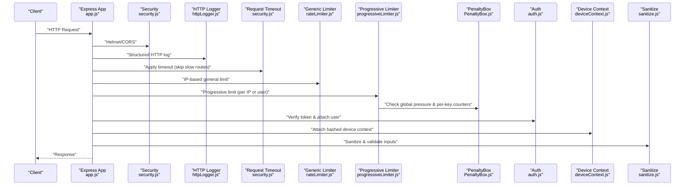

**Diagram sources**
- [app.js](file://backend/src/app.js#L1-L78)
- [security.js](file://backend/src/middleware/security.js#L1-L75)
- [httpLogger.js](file://backend/src/middleware/httpLogger.js#L1-L21)
- [rateLimiter.js](file://backend/src/middleware/rateLimiter.js#L1-L76)
- [progressiveLimiter.js](file://backend/src/middleware/progressiveLimiter.js#L1-L61)
- [PenaltyBox.js](file://backend/src/services/PenaltyBox.js#L1-L108)
- [auth.js](file://backend/src/middleware/auth.js#L1-L164)
- [deviceContext.js](file://backend/src/middleware/deviceContext.js#L1-L24)
- [sanitize.js](file://backend/src/middleware/sanitize.js#L1-L154)

## Detailed Component Analysis

### Authentication Middleware
- Validates Authorization header presence and format.
- Prefers custom JWT (short-lived access token) when configured; verifies signature and compares token version with user’s current token version.
- Falls back to Firebase ID token verification with revocation checks enabled.
- Builds a display-friendly user object and attaches it to the request.
- Enforces account status checks and returns appropriate errors.

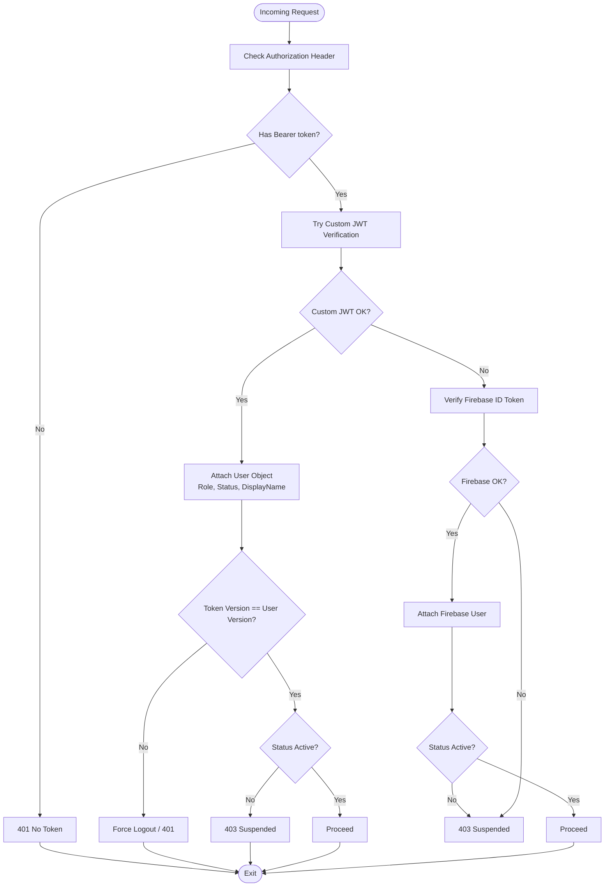

**Diagram sources**
- [auth.js](file://backend/src/middleware/auth.js#L20-L161)

**Section sources**
- [auth.js](file://backend/src/middleware/auth.js#L1-L164)

### Security Middleware (Helmet, CORS, Timeout)
- Helmet: Applies secure headers with API-focused CSP and cross-origin policies disabled to support Flutter Web image fetching.
- CORS: Origin whitelisting controlled by environment variables; allows local dev origins; logs blocked origins.
- Request Timeout: Applies a 15-second hard timeout for most JSON/REST requests, skipping it for multipart uploads, feed/post reads, interactions, and proxy requests.

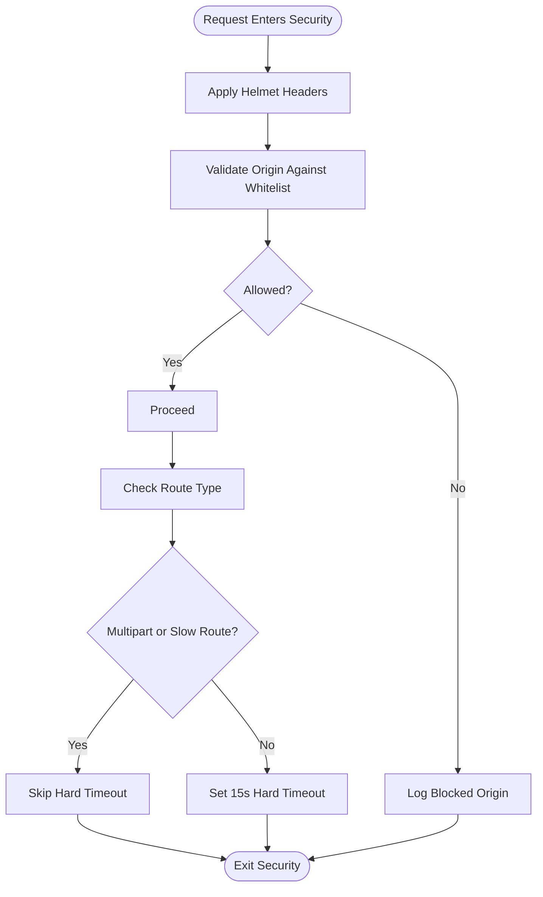

**Diagram sources**
- [security.js](file://backend/src/middleware/security.js#L9-L74)

**Section sources**
- [security.js](file://backend/src/middleware/security.js#L1-L75)

### Device Context Middleware
- Extracts IP, User-Agent, and optional device ID from headers.
- Hashes each value using SHA-256 to anonymize sensitive data.
- Enforces device ID requirement for the refresh endpoint.
- Attaches a deviceContext object to the request for downstream risk evaluation.

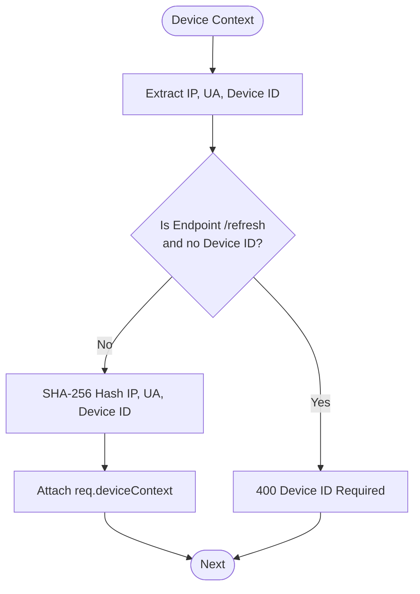

**Diagram sources**
- [deviceContext.js](file://backend/src/middleware/deviceContext.js#L7-L23)

**Section sources**
- [deviceContext.js](file://backend/src/middleware/deviceContext.js#L1-L24)

### Rate Limiting System
- Generic limiter: IP-based throttle for general API traffic.
- Auth limiter: Stricter per-IP throttling for authentication endpoints.
- Upload limiter: Throttles upload requests with user context awareness.
- Speed limiter: Gradually increases delay after exceeding a baseline.
- Progressive limiter: In-memory, user/IP-aware limiter with escalating penalties and global pressure detection.
- PenaltyBox: Tracks per-key counters, applies progressive blocks, and cleans up stale entries.

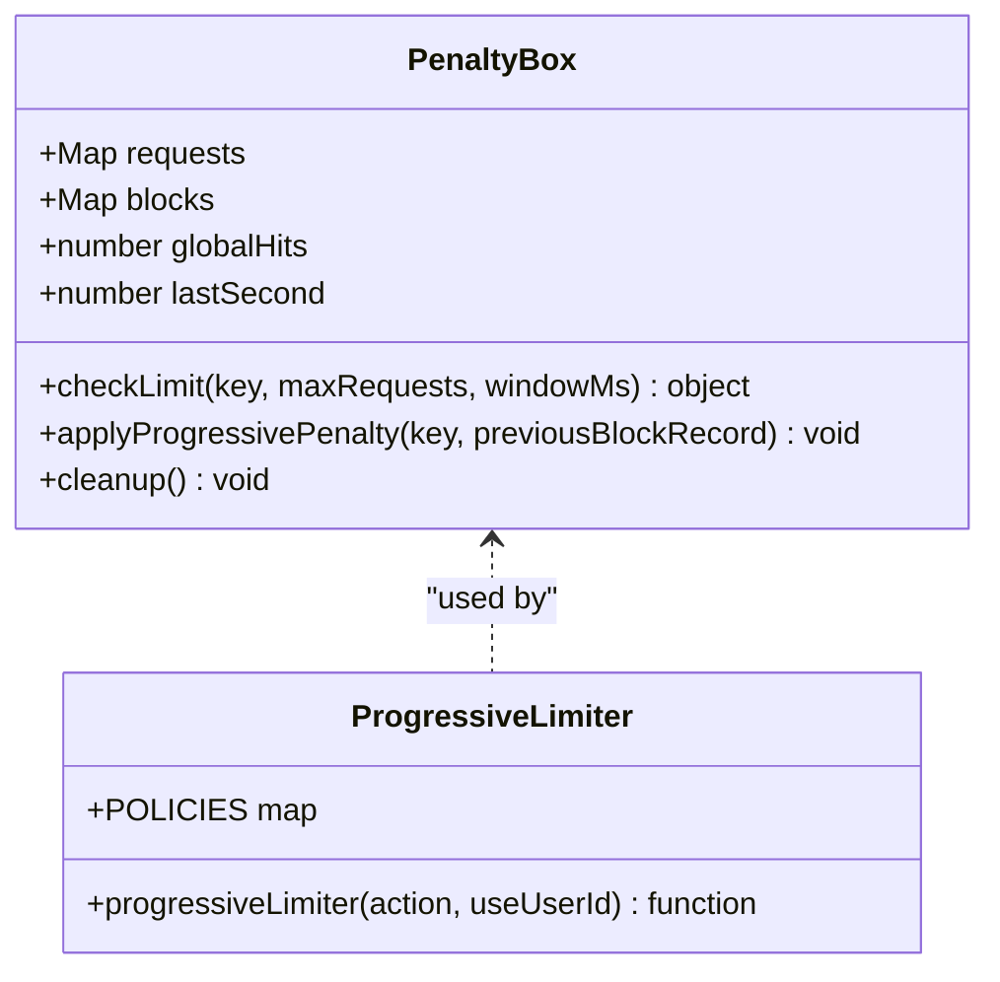

**Diagram sources**
- [PenaltyBox.js](file://backend/src/services/PenaltyBox.js#L3-L107)
- [progressiveLimiter.js](file://backend/src/middleware/progressiveLimiter.js#L1-L61)

**Section sources**
- [rateLimiter.js](file://backend/src/middleware/rateLimiter.js#L1-L76)
- [progressiveLimiter.js](file://backend/src/middleware/progressiveLimiter.js#L1-L61)
- [PenaltyBox.js](file://backend/src/services/PenaltyBox.js#L1-L108)

### Interaction Velocity Middleware
- Enforces rate limits on follow and like actions using a guard service.
- Supports three outcomes: allow, block (429), or shadow (silent suppression) to deter bots without explicit signaling.

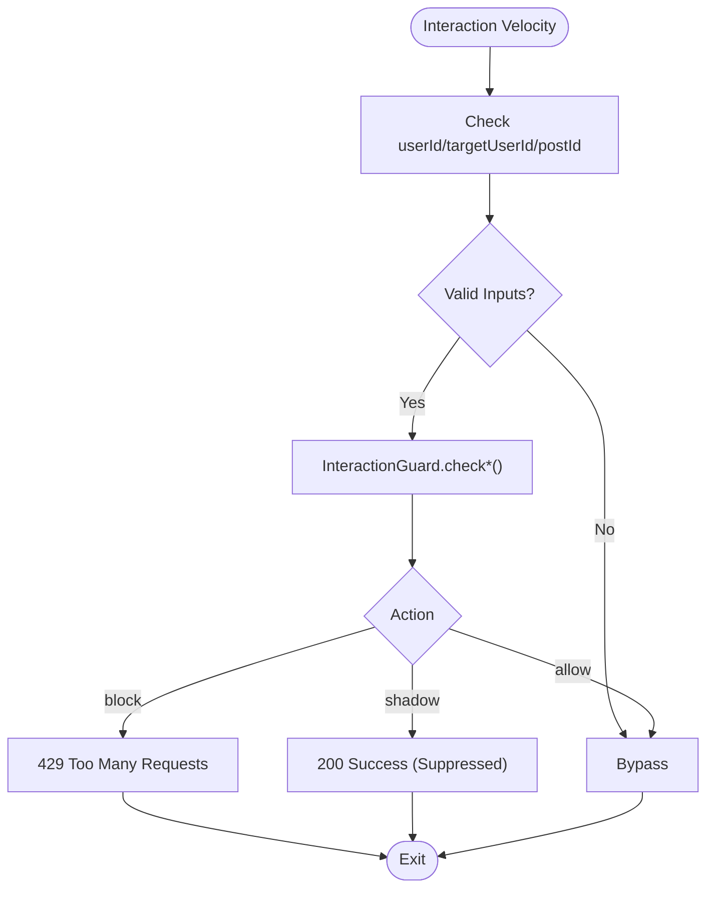

**Diagram sources**
- [interactionVelocity.js](file://backend/src/middleware/interactionVelocity.js#L8-L61)

**Section sources**
- [interactionVelocity.js](file://backend/src/middleware/interactionVelocity.js#L1-L62)

### Upload Limits Middleware
- Enforces a daily upload cap per user using Firestore.
- Increments counts after successful uploads and handles failures gracefully.

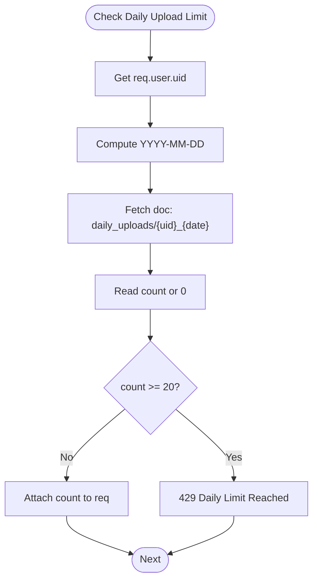

**Diagram sources**
- [uploadLimits.js](file://backend/src/middleware/uploadLimits.js#L10-L36)

**Section sources**
- [uploadLimits.js](file://backend/src/middleware/uploadLimits.js#L1-L55)

### Sanitization and Validation
- Request sanitization: MongoDB injection protection, XSS cleaning, HPP.
- Validation errors: Aggregates and returns structured 400 responses.
- File upload validation: Declared media type and file extension checks.
- Magic-byte validation: Determines MIME type and ensures alignment with declared type.
- Token expiration: Validates Firebase token age for relaxed UX while logging.
- Request size: Enforces maximum payload size with 413 responses.

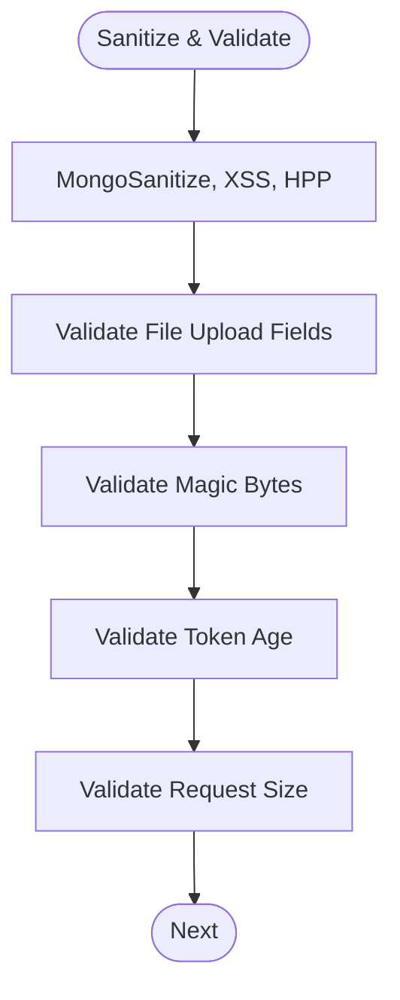

**Diagram sources**
- [sanitize.js](file://backend/src/middleware/sanitize.js#L8-L153)

**Section sources**
- [sanitize.js](file://backend/src/middleware/sanitize.js#L1-L154)

### HTTP Logging and Error Handling
- HTTP logging: Structured logs with method, URL, and attached userId when available; custom log level based on status.
- Error handling: Centralized handler logs full error context, prevents duplicate responses, and returns standardized JSON with optional stack traces in non-production.

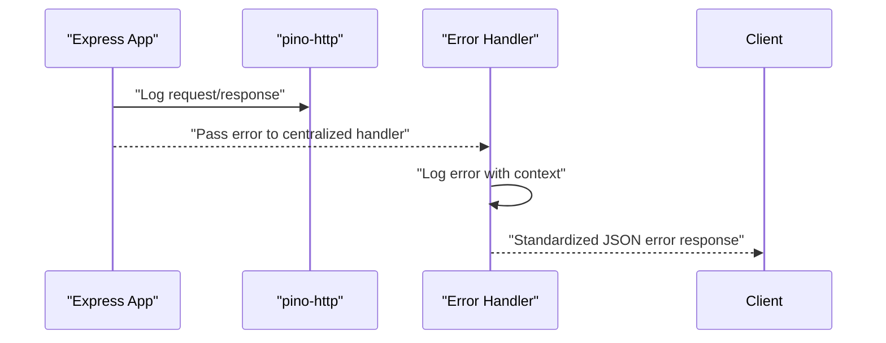

**Diagram sources**
- [httpLogger.js](file://backend/src/middleware/httpLogger.js#L4-L20)
- [errorHandler.js](file://backend/src/middleware/errorHandler.js#L3-L34)

**Section sources**
- [httpLogger.js](file://backend/src/middleware/httpLogger.js#L1-L21)
- [errorHandler.js](file://backend/src/middleware/errorHandler.js#L1-L35)

### Middleware Composition Patterns and Execution Order
- Trust proxy is set to ensure correct client IP detection behind Nginx.
- Security headers, CORS, and HTTP logging are applied globally first.
- Request shaping (JSON/URL-encoded bodies) and request timeout follow.
- Public routes mount progressive limiters keyed by action (e.g., auth, otp, api).
- Protected routes mount authentication first, then user-based progressive limiting.
- 404 and error handler are registered last.

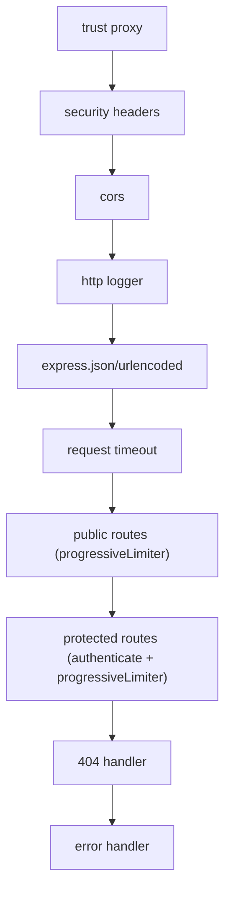

**Diagram sources**
- [app.js](file://backend/src/app.js#L8-L75)

**Section sources**
- [app.js](file://backend/src/app.js#L1-L78)

### Custom Middleware Development Guidelines
- Keep middleware single-purpose and composable.
- Always call next() unless sending a response.
- Attach only sanitized, hashed, or derived data to req (e.g., deviceContext).
- Use environment-controlled behavior (e.g., CORS origins, timeouts).
- Log security events for violations and misconfigurations.
- Prefer user-based limiting for authenticated endpoints; use IP-based for public routes.
- Wrap asynchronous operations and propagate errors to the centralized handler.

[No sources needed since this section provides general guidance]

## Dependency Analysis
- app.js orchestrates middleware registration and route mounting.
- progressiveLimiter depends on PenaltyBox for global and per-key tracking.
- auth middleware depends on Firebase Admin and Firestore for user data and token verification.
- upload routes depend on sanitize middleware for validation and uploadLimits for quota enforcement.
- interactions routes depend on auth and interactionVelocity middleware for safety.

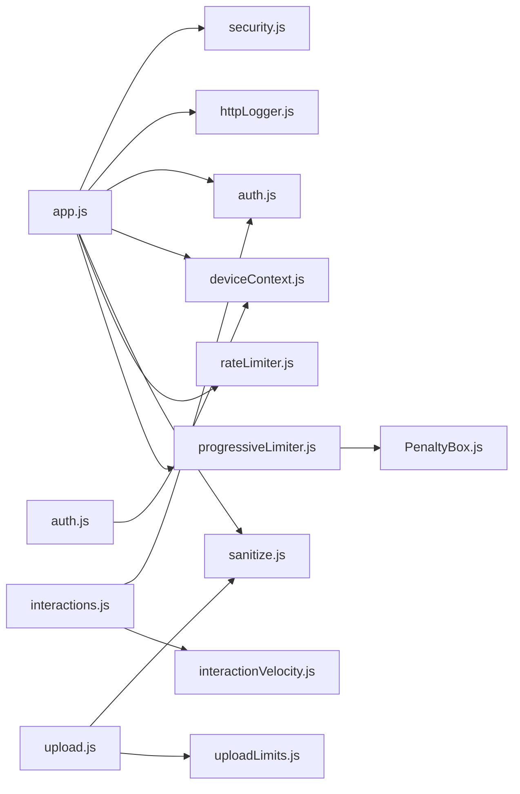

**Diagram sources**
- [app.js](file://backend/src/app.js#L1-L78)
- [progressiveLimiter.js](file://backend/src/middleware/progressiveLimiter.js#L1-L61)
- [PenaltyBox.js](file://backend/src/services/PenaltyBox.js#L1-L108)
- [auth.js](file://backend/src/middleware/auth.js#L1-L164)
- [deviceContext.js](file://backend/src/middleware/deviceContext.js#L1-L24)
- [sanitize.js](file://backend/src/middleware/sanitize.js#L1-L154)
- [uploadLimits.js](file://backend/src/middleware/uploadLimits.js#L1-L55)
- [interactionVelocity.js](file://backend/src/middleware/interactionVelocity.js#L1-L62)
- [upload.js](file://backend/src/routes/upload.js#L1-L225)
- [interactions.js](file://backend/src/routes/interactions.js#L1-L522)
- [auth.js](file://backend/src/routes/auth.js#L1-L301)

**Section sources**
- [app.js](file://backend/src/app.js#L1-L78)

## Performance Considerations
- Progressive limiter uses in-memory maps with periodic cleanup to prevent memory growth.
- Authentication caches user profiles with TTL to reduce Firestore reads.
- Request timeout skips slow routes to avoid unnecessary latency penalties.
- File upload uses memory storage with magic-byte validation to detect unsupported or mismatched types early.

[No sources needed since this section provides general guidance]

## Troubleshooting Guide
- Authentication failures:
  - Missing or invalid Authorization header yields 401 with specific codes.
  - Expired or revoked Firebase tokens produce 401 with token-expired or token-revoked codes.
  - Suspended accounts receive 403.
- Rate limiting:
  - 429 responses indicate throttling; progressive limiter may escalate to 503 under global pressure.
  - Check logs for RATE_LIMIT_EXCEEDED and AUTH_RATE_LIMIT_EXCEEDED events.
- Device context:
  - Missing device ID on refresh returns 400; ensure clients pass x-device-id.
- Upload issues:
  - 413 indicates oversized payload; 400 for invalid file type or mismatched media type.
  - Daily upload limit returns 429 with retry guidance.
- Logging and errors:
  - Centralized error handler logs stack traces in non-production and prevents duplicate responses.

**Section sources**
- [auth.js](file://backend/src/middleware/auth.js#L20-L161)
- [progressiveLimiter.js](file://backend/src/middleware/progressiveLimiter.js#L32-L56)
- [deviceContext.js](file://backend/src/middleware/deviceContext.js#L12-L14)
- [uploadLimits.js](file://backend/src/middleware/uploadLimits.js#L19-L25)
- [sanitize.js](file://backend/src/middleware/sanitize.js#L139-L149)
- [errorHandler.js](file://backend/src/middleware/errorHandler.js#L3-L34)

## Conclusion
The middleware layer establishes a robust, layered defense: secure headers and CORS, strict input sanitization, progressive rate limiting with global pressure detection, device fingerprinting for behavioral risk, and comprehensive logging and error handling. The composition pattern ensures authentication precedes user-based limiting, while public endpoints remain accessible with IP-based safeguards. This design balances security, performance, and developer ergonomics.

[No sources needed since this section summarizes without analyzing specific files]

## Appendices

### Example Integrations with Route Handlers
- Auth routes:
  - Mount deviceContext before token exchange and refresh to capture device fingerprints and enforce device ID on refresh.
- Interactions routes:
  - Apply authenticate globally, then enforce like/follow velocity middleware to prevent spam.
- Upload routes:
  - Chain progressiveLimiter, authenticate, validateTokenExpiration, multer, validateFileUpload, validateFileMagicBytes, and daily upload limit middleware.

**Section sources**
- [auth.js](file://backend/src/routes/auth.js#L20-L280)
- [interactions.js](file://backend/src/routes/interactions.js#L21-L22)
- [upload.js](file://backend/src/routes/upload.js#L80-L140)