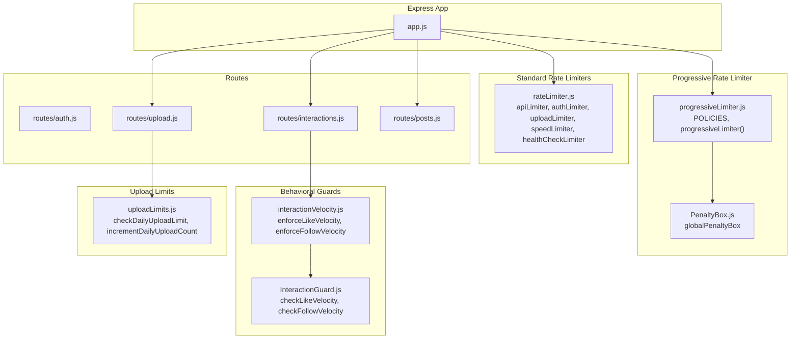
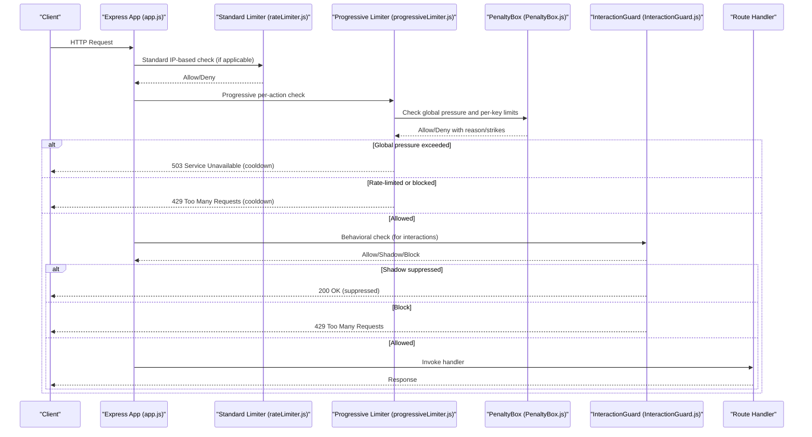
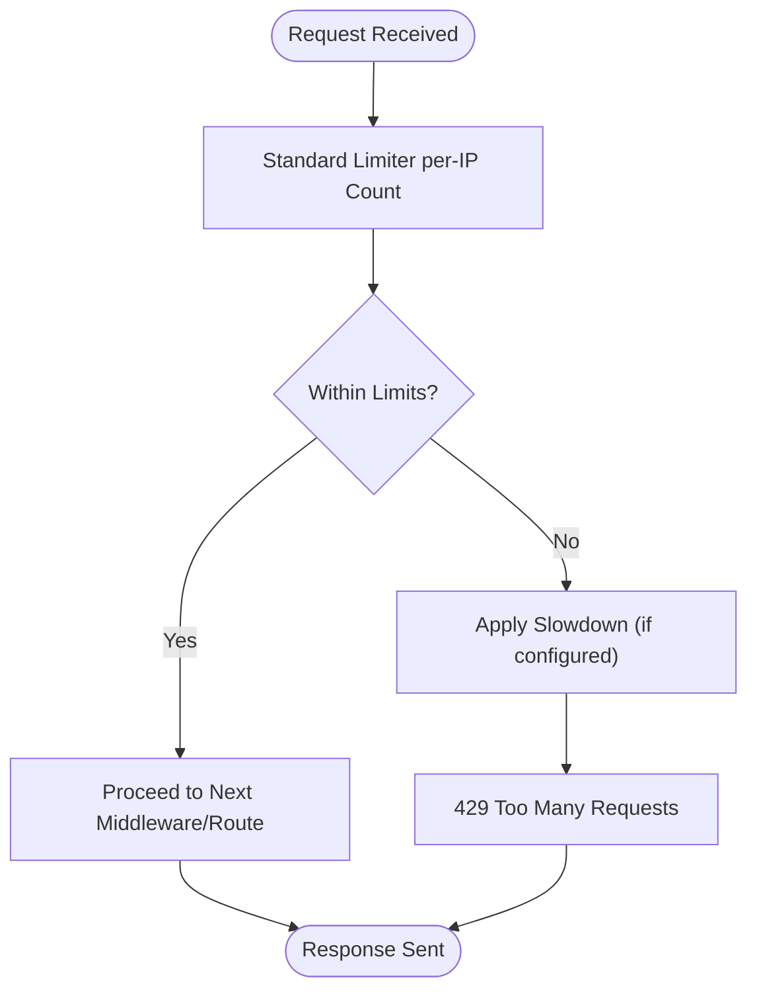
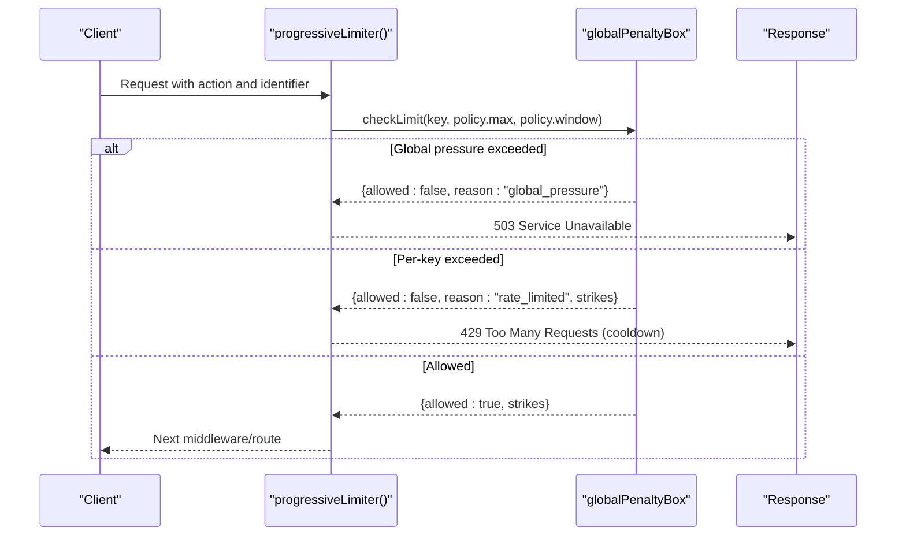
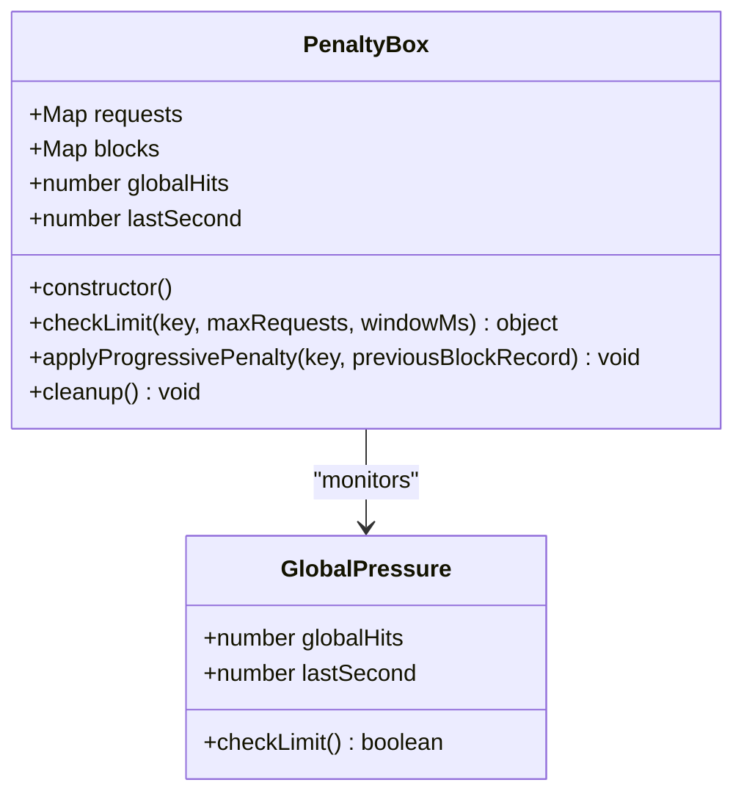
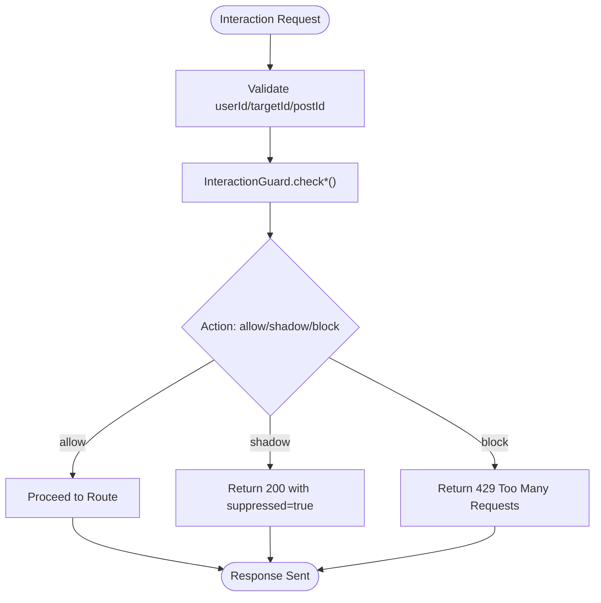
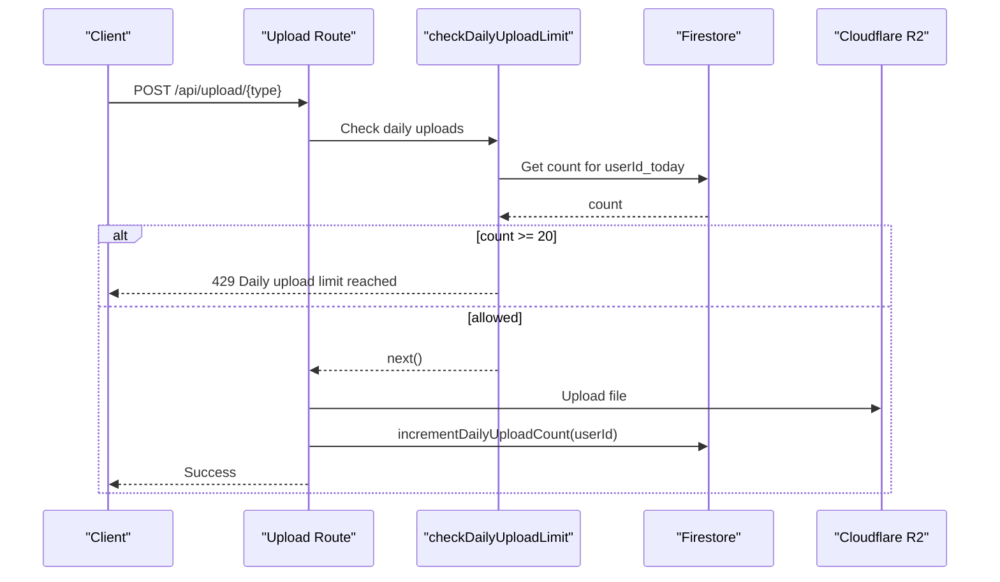
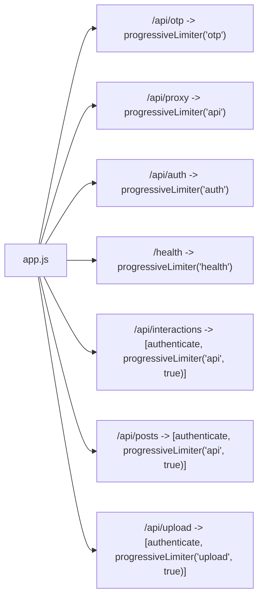
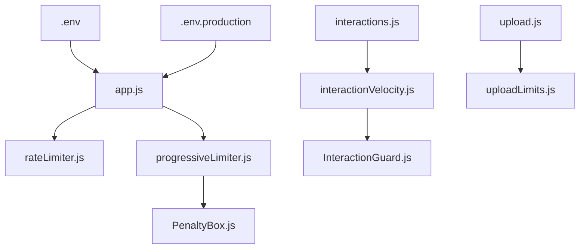

# Rate Limiting Middleware

<cite>
**Referenced Files in This Document**
- [app.js](file://backend/src/app.js)
- [rateLimiter.js](file://backend/src/middleware/rateLimiter.js)
- [progressiveLimiter.js](file://backend/src/middleware/progressiveLimiter.js)
- [PenaltyBox.js](file://backend/src/services/PenaltyBox.js)
- [RiskEngine.js](file://backend/src/services/RiskEngine.js)
- [InteractionGuard.js](file://backend/src/services/InteractionGuard.js)
- [interactionVelocity.js](file://backend/src/middleware/interactionVelocity.js)
- [uploadLimits.js](file://backend/src/middleware/uploadLimits.js)
- [upload.js](file://backend/src/routes/upload.js)
- [interactions.js](file://backend/src/routes/interactions.js)
- [posts.js](file://backend/src/routes/posts.js)
- [.env](file://backend/.env)
- [.env.production](file://backend/.env.production)
</cite>

## Table of Contents
1. [Introduction](#introduction)
2. [Project Structure](#project-structure)
3. [Core Components](#core-components)
4. [Architecture Overview](#architecture-overview)
5. [Detailed Component Analysis](#detailed-component-analysis)
6. [Dependency Analysis](#dependency-analysis)
7. [Performance Considerations](#performance-considerations)
8. [Troubleshooting Guide](#troubleshooting-guide)
9. [Conclusion](#conclusion)
10. [Appendices](#appendices)

## Introduction
This document explains the rate limiting system architecture used in the backend. It covers:
- Standard rate limiter with configurable limits, window-based tracking, and IP-based restrictions
- Progressive rate limiter that adapts limits based on user behavior and risk assessment
- Penalty box integration for temporary bans, user reputation scoring, and dynamic limit adjustments
- Configuration examples for different endpoint types, burst protection, and whitelist/blacklist guidance
- Tuning recommendations for different user roles and graceful degradation under high traffic

## Project Structure
The rate limiting system spans middleware, services, and routes:
- Express app mounts progressive rate limiting around public and protected routes
- Standard limiter provides per-IP enforcement for broad endpoints
- Progressive limiter enforces per-action policies with optional per-user enforcement
- Penalty box tracks global pressure and applies progressive penalties
- Interaction guard prevents abuse patterns for likes and follows
- Daily upload limits complement progressive and standard protections

**Diagram sources**
- [app.js](file://backend/src/app.js#L21-L61)
- [rateLimiter.js](file://backend/src/middleware/rateLimiter.js#L1-L76)
- [progressiveLimiter.js](file://backend/src/middleware/progressiveLimiter.js#L1-L61)
- [PenaltyBox.js](file://backend/src/services/PenaltyBox.js#L1-L108)
- [interactionVelocity.js](file://backend/src/middleware/interactionVelocity.js#L1-L62)
- [InteractionGuard.js](file://backend/src/services/InteractionGuard.js#L1-L124)
- [uploadLimits.js](file://backend/src/middleware/uploadLimits.js#L1-L55)
- [interactions.js](file://backend/src/routes/interactions.js#L1-L522)
- [upload.js](file://backend/src/routes/upload.js#L1-L225)
- [posts.js](file://backend/src/routes/posts.js#L1-L728)

**Section sources**
- [app.js](file://backend/src/app.js#L1-L78)

## Core Components
- Standard rate limiters:
  - General API limiter with per-IP windowed quotas
  - Authentication limiter with per-IP caps and success-skipping
  - Upload limiter with per-IP quotas
  - Speed limiter that gradually slows repeat requests
  - Health check limiter for lightweight monitoring endpoints
- Progressive rate limiter:
  - Centralized policy map per action type
  - Per-IP or per-user enforcement depending on route
  - Integration with penalty box for global pressure and progressive blocks
- Penalty box:
  - Tracks global request volume and triggers protective overload responses
  - Applies progressive penalties with escalating time windows
  - Cleans up stale entries to prevent memory growth
- Behavioral guards:
  - Interaction guard enforces pair-toggle and velocity constraints for likes/follows
  - Middleware wraps guards to return appropriate responses
- Daily upload limits:
  - Per-user daily cap enforced via Firestore
  - Incremented after successful uploads

**Section sources**
- [rateLimiter.js](file://backend/src/middleware/rateLimiter.js#L1-L76)
- [progressiveLimiter.js](file://backend/src/middleware/progressiveLimiter.js#L1-L61)
- [PenaltyBox.js](file://backend/src/services/PenaltyBox.js#L1-L108)
- [InteractionGuard.js](file://backend/src/services/InteractionGuard.js#L1-L124)
- [interactionVelocity.js](file://backend/src/middleware/interactionVelocity.js#L1-L62)
- [uploadLimits.js](file://backend/src/middleware/uploadLimits.js#L1-L55)

## Architecture Overview
The system layers rate limiting across three dimensions:
- Network-level standard limiter for broad IP-based quotas
- Application-level progressive limiter with per-action policies and optional per-user enforcement
- Behavioral guard for interaction-heavy endpoints to prevent abuse patterns
- Penalty box for global pressure and reputation-based penalties

**Diagram sources**
- [app.js](file://backend/src/app.js#L21-L61)
- [rateLimiter.js](file://backend/src/middleware/rateLimiter.js#L1-L76)
- [progressiveLimiter.js](file://backend/src/middleware/progressiveLimiter.js#L1-L61)
- [PenaltyBox.js](file://backend/src/services/PenaltyBox.js#L1-L108)
- [InteractionGuard.js](file://backend/src/services/InteractionGuard.js#L1-L124)

## Detailed Component Analysis

### Standard Rate Limiter (IP-based)
- Purpose: Broad protection against brute force and scanning
- Key behaviors:
  - Windowed counting per IP
  - Optional success-skipping for authentication limiter
  - Gradual slowdown for repeated requests
  - Lightweight health check limiter for monitoring
- Typical configuration:
  - General API: large window with high max
  - Auth: small window with low max and success-skipping
  - Upload: moderate window and max
  - Speed: delayAfter and maxDelayMs for gradual throttling
  - Health: permissive window for monitoring

**Diagram sources**
- [rateLimiter.js](file://backend/src/middleware/rateLimiter.js#L1-L76)

**Section sources**
- [rateLimiter.js](file://backend/src/middleware/rateLimiter.js#L1-L76)

### Progressive Rate Limiter (Per-action, IP/User-aware)
- Purpose: Fine-grained control per endpoint/action with adaptive behavior
- Key behaviors:
  - Central policy map defines max and window per action
  - Optional per-user enforcement using req.user.uid
  - Integration with penalty box for global pressure and progressive blocks
  - Logs security events with reason and strike counts
- Enforcement flow:
  - Build key from action and identifier (IP or UID)
  - Check penalty box for global pressure and per-key limits
  - Return 503 on global pressure, 429 with cooldown otherwise
  - Apply progressive penalties after exceeding thresholds

**Diagram sources**
- [progressiveLimiter.js](file://backend/src/middleware/progressiveLimiter.js#L1-L61)
- [PenaltyBox.js](file://backend/src/services/PenaltyBox.js#L1-L108)

**Section sources**
- [progressiveLimiter.js](file://backend/src/middleware/progressiveLimiter.js#L1-L61)
- [PenaltyBox.js](file://backend/src/services/PenaltyBox.js#L1-L108)

### Penalty Box (Global Pressure and Progressive Penalties)
- Purpose: Detect and mitigate volumetric attacks and abusive behavior
- Key behaviors:
  - Global hits counter resets per second; thresholds trigger protective overload responses
  - Per-key counters track request rates within windows
  - Progressive penalties escalate strike-based blocking durations
  - Cleanup routine periodically decays strikes and removes expired blocks
  - Memory cap prevents unbounded growth of counters

**Diagram sources**
- [PenaltyBox.js](file://backend/src/services/PenaltyBox.js#L1-L108)

**Section sources**
- [PenaltyBox.js](file://backend/src/services/PenaltyBox.js#L1-L108)

### Behavioral Guards (InteractionGuard) and Middleware (interactionVelocity)
- Purpose: Prevent abuse patterns for likes and follows (rapid toggles, bursts)
- Key behaviors:
  - Pair toggle cooldown and cycle detection for like/follow
  - Global velocity checks per user per minute/hour
  - Shadow suppression for mild violations (accept but suppress)
  - Strict 429 for severe violations
  - Middleware wrappers translate guard results into HTTP responses

**Diagram sources**
- [InteractionGuard.js](file://backend/src/services/InteractionGuard.js#L1-L124)
- [interactionVelocity.js](file://backend/src/middleware/interactionVelocity.js#L1-L62)

**Section sources**
- [InteractionGuard.js](file://backend/src/services/InteractionGuard.js#L1-L124)
- [interactionVelocity.js](file://backend/src/middleware/interactionVelocity.js#L1-L62)

### Daily Upload Limits
- Purpose: Complement progressive and standard protections for upload endpoints
- Key behaviors:
  - Per-user daily cap enforced via Firestore document keyed by userId and date
  - Middleware checks before upload processing and increments after success
  - Returns 429 with retry guidance when limit is reached

**Diagram sources**
- [upload.js](file://backend/src/routes/upload.js#L1-L225)
- [uploadLimits.js](file://backend/src/middleware/uploadLimits.js#L1-L55)

**Section sources**
- [upload.js](file://backend/src/routes/upload.js#L1-L225)
- [uploadLimits.js](file://backend/src/middleware/uploadLimits.js#L1-L55)

### Endpoint Mounting and Enforcement Points
- Public routes (IP-based):
  - OTP, proxy, auth endpoints use progressive limiter with IP identifiers
  - Health check uses a permissive limiter
- Protected routes (per-user):
  - Interactions, posts, upload, profiles, search, notifications mount authenticate then progressive limiter with useUserId enabled
- Standard limiter usage:
  - General API routes can also be wrapped with standard limiter where appropriate

**Diagram sources**
- [app.js](file://backend/src/app.js#L21-L61)

**Section sources**
- [app.js](file://backend/src/app.js#L1-L78)

## Dependency Analysis
- Express app orchestrates middleware and routes
- Progressive limiter depends on penalty box for global pressure and per-key enforcement
- Interaction guard is used by middleware wrappers for likes and follows
- Upload routes depend on daily upload limits middleware
- Environment variables configure secrets and external services

**Diagram sources**
- [app.js](file://backend/src/app.js#L1-L78)
- [rateLimiter.js](file://backend/src/middleware/rateLimiter.js#L1-L76)
- [progressiveLimiter.js](file://backend/src/middleware/progressiveLimiter.js#L1-L61)
- [PenaltyBox.js](file://backend/src/services/PenaltyBox.js#L1-L108)
- [interactionVelocity.js](file://backend/src/middleware/interactionVelocity.js#L1-L62)
- [InteractionGuard.js](file://backend/src/services/InteractionGuard.js#L1-L124)
- [upload.js](file://backend/src/routes/upload.js#L1-L225)
- [uploadLimits.js](file://backend/src/middleware/uploadLimits.js#L1-L55)
- [.env](file://backend/.env#L1-L22)
- [.env.production](file://backend/.env.production#L1-L21)

**Section sources**
- [app.js](file://backend/src/app.js#L1-L78)
- [progressiveLimiter.js](file://backend/src/middleware/progressiveLimiter.js#L1-L61)
- [PenaltyBox.js](file://backend/src/services/PenaltyBox.js#L1-L108)
- [interactionVelocity.js](file://backend/src/middleware/interactionVelocity.js#L1-L62)
- [InteractionGuard.js](file://backend/src/services/InteractionGuard.js#L1-L124)
- [upload.js](file://backend/src/routes/upload.js#L1-L225)
- [uploadLimits.js](file://backend/src/middleware/uploadLimits.js#L1-L55)
- [.env](file://backend/.env#L1-L22)
- [.env.production](file://backend/.env.production#L1-L21)

## Performance Considerations
- Progressive limiter uses in-memory maps for speed; penalty box cleans up stale entries to prevent memory growth
- Behavioral guards maintain compact histories and prune old timestamps
- Standard limiter reduces overhead by relying on IP-based counters
- Global pressure detection short-circuits expensive per-key checks during overload
- Graceful degradation:
  - On global pressure, progressive limiter returns 503 with cooldown hint
  - Speed limiter adds delays to reduce downstream load
  - Interaction guard may shadow suppress to confuse scrapers without signaling rate limits

[No sources needed since this section provides general guidance]

## Troubleshooting Guide
Common issues and resolutions:
- Excessive 429 responses:
  - Review progressive policy windows and max values for the affected action
  - Check penalty box strikes and cooldown periods
  - Verify whether per-user enforcement is unintentionally enabled
- Frequent 503 responses:
  - Inspect global pressure thresholds and recent request volume spikes
  - Confirm penalty box cleanup is functioning and memory cap is not triggering
- Authentication rate limit exceeded:
  - Ensure success-skipping is enabled for authentication limiter
  - Validate that legitimate users are not being grouped under the same IP
- Interaction abuse patterns:
  - Confirm interaction guards are attached to relevant routes
  - Adjust cooldown and cycle thresholds if legitimate users are affected
- Upload failures:
  - Check daily upload limit middleware and Firestore document updates
  - Verify R2 upload success and daily count increment

**Section sources**
- [progressiveLimiter.js](file://backend/src/middleware/progressiveLimiter.js#L1-L61)
- [PenaltyBox.js](file://backend/src/services/PenaltyBox.js#L1-L108)
- [interactionVelocity.js](file://backend/src/middleware/interactionVelocity.js#L1-L62)
- [InteractionGuard.js](file://backend/src/services/InteractionGuard.js#L1-L124)
- [upload.js](file://backend/src/routes/upload.js#L1-L225)
- [uploadLimits.js](file://backend/src/middleware/uploadLimits.js#L1-L55)

## Conclusion
The rate limiting system combines standard IP-based quotas, fine-grained progressive policies, behavioral guards, and a penalty box for global pressure and reputation-based penalties. Together, these layers provide robust protection against abuse while enabling graceful degradation and adaptive responses tailored to user behavior and risk.

[No sources needed since this section summarizes without analyzing specific files]

## Appendices

### Configuration Examples and Best Practices
- Endpoint-specific policies:
  - Authentication: small window and very low max with success-skipping
  - Upload: moderate window and max with daily cap
  - Feed/Posts: higher window and max for read-heavy endpoints
  - Interactions (likes/follows): per-action progressive limits plus behavioral guards
- Burst protection:
  - Use speed limiter to gradually throttle repeated requests
  - Behavioral guards for likes/follows prevent rapid toggling and bursts
- Per-user vs IP enforcement:
  - Enable per-user enforcement for protected routes to differentiate authenticated users
  - Keep IP-based enforcement for public endpoints to prevent scraping
- Whitelist/blacklist guidance:
  - Not implemented in code; consider integrating with a dedicated service or database-backed allow/block lists at the reverse proxy or application level
- Tuning for user roles:
  - Verified users: increase max and window for interactions and uploads
  - Premium users: further relax limits compared to standard users
  - Moderators/admins: minimal or disabled limits for operational tasks
- Graceful degradation:
  - Monitor global pressure thresholds and adjust windows/max values dynamically
  - Return 503 with cooldown hints during overload; progressively increase delays via speed limiter

[No sources needed since this section provides general guidance]