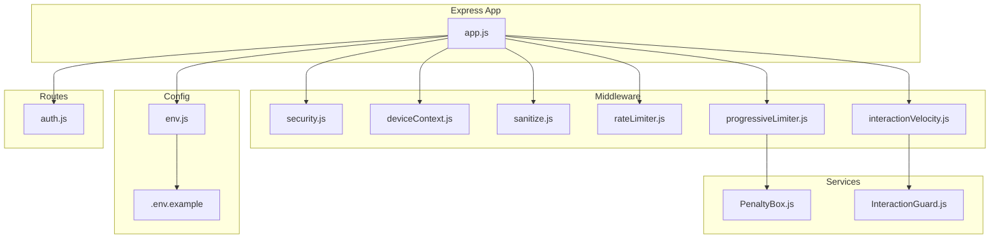
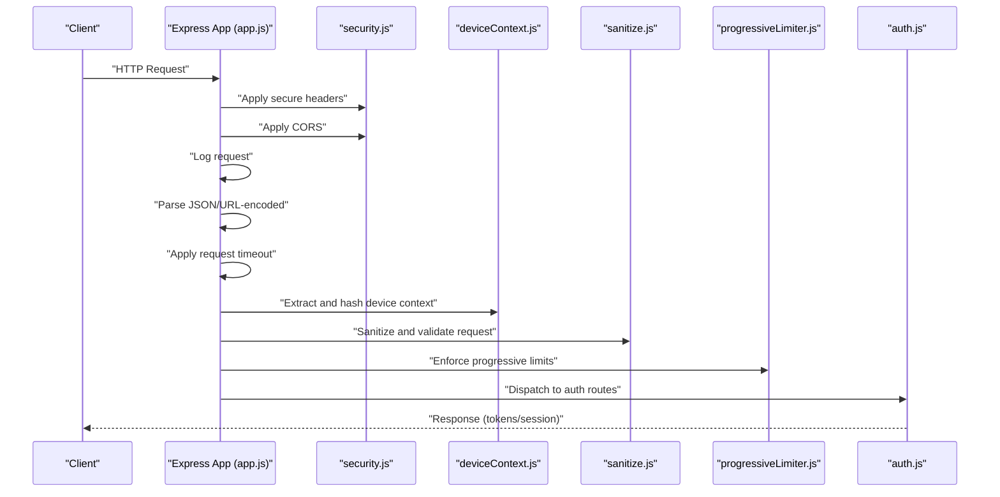
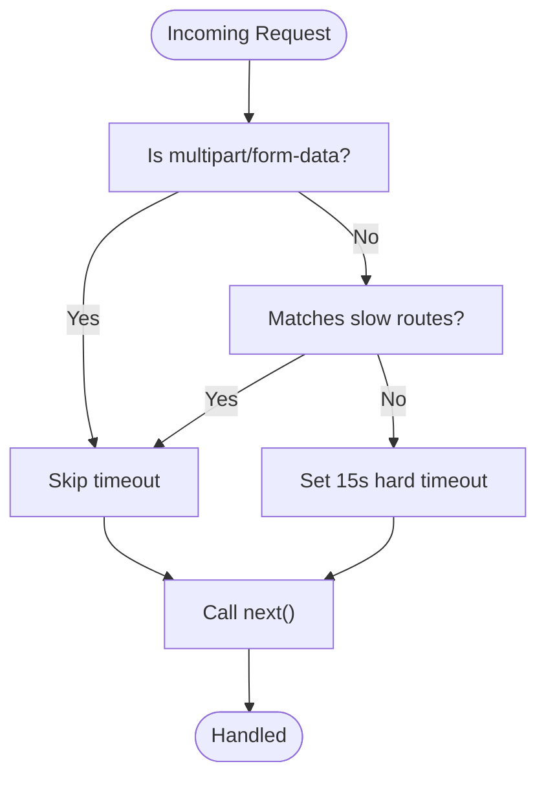
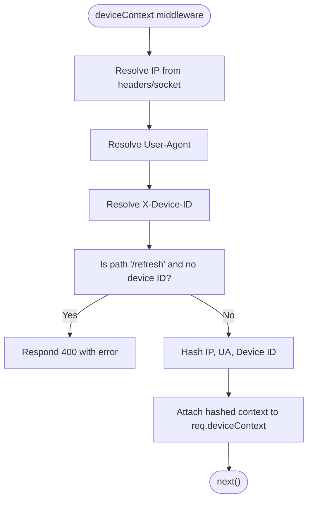
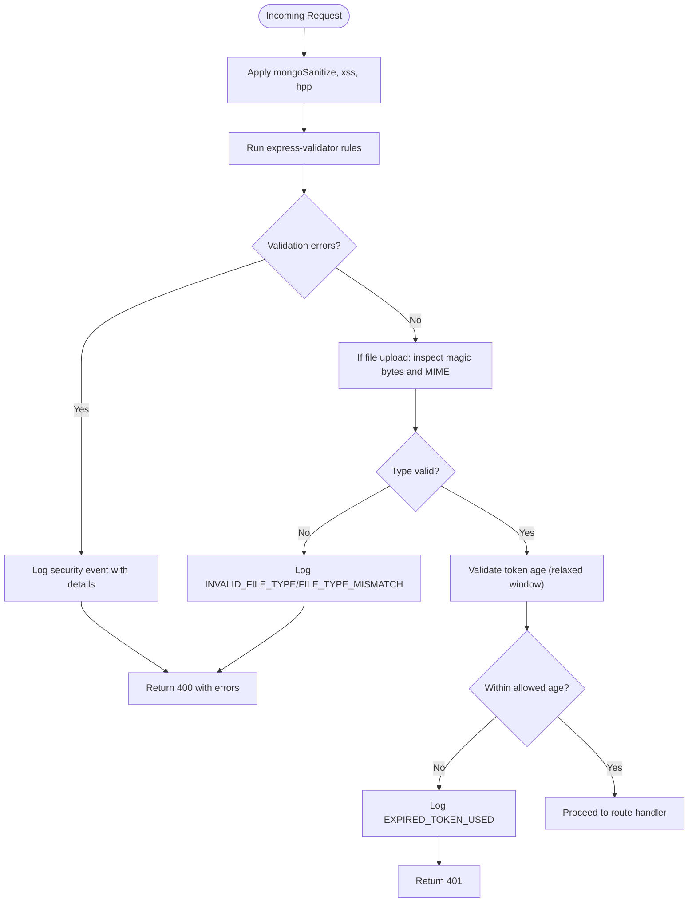
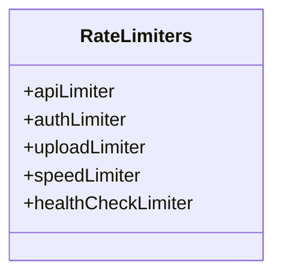
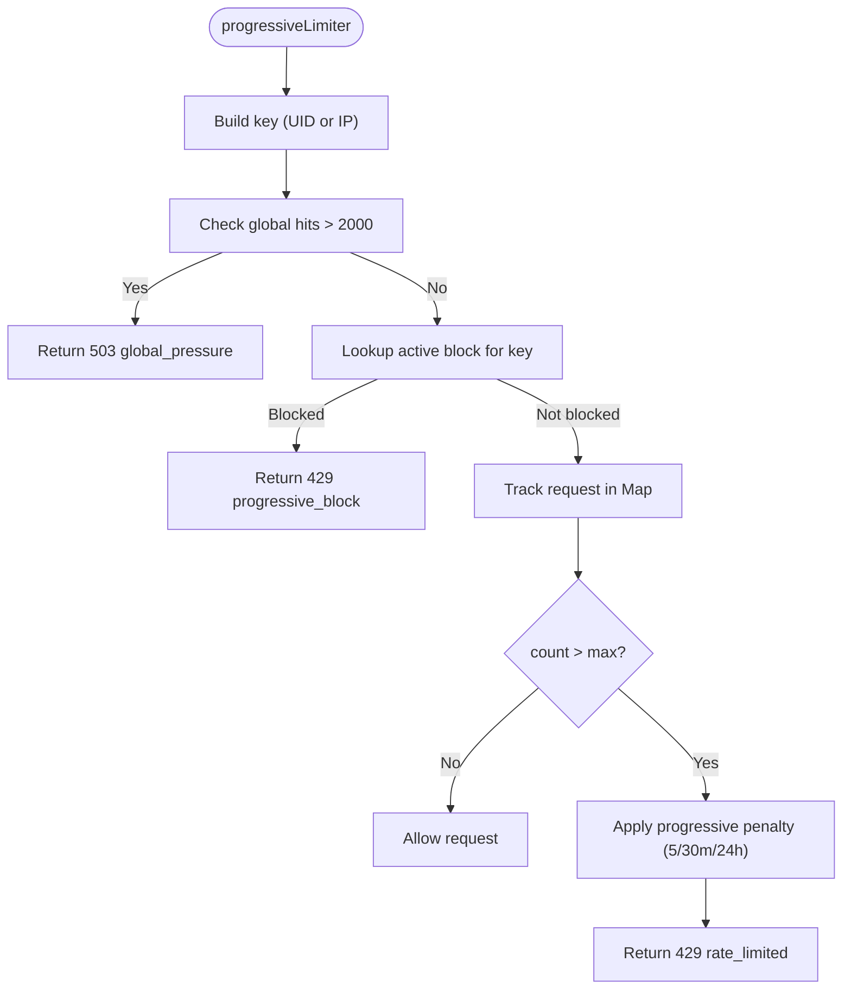
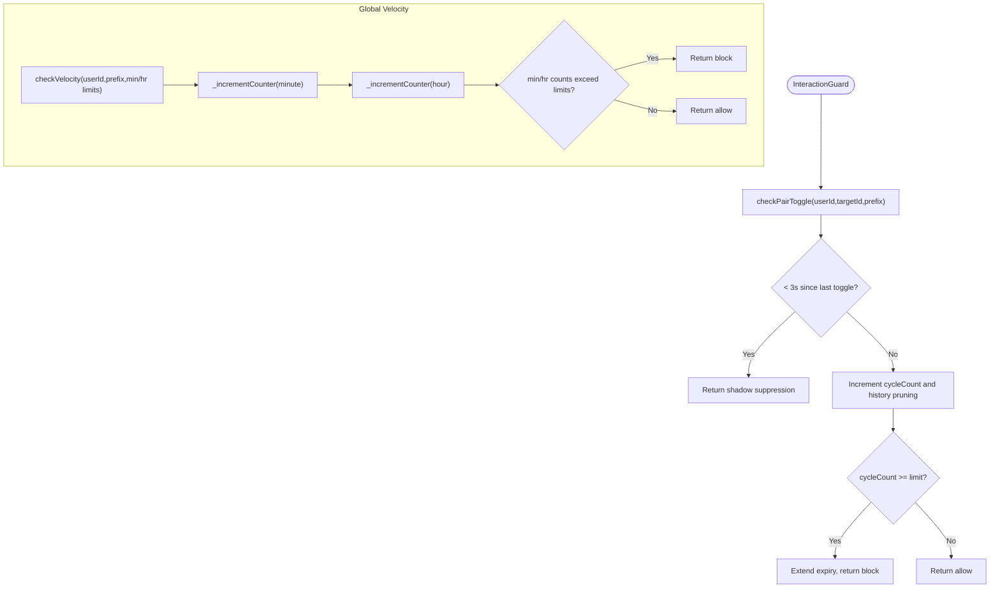
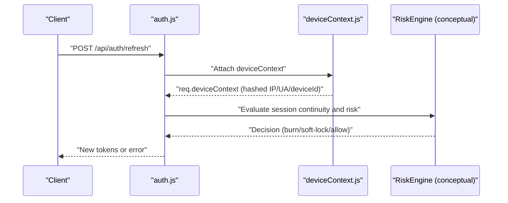
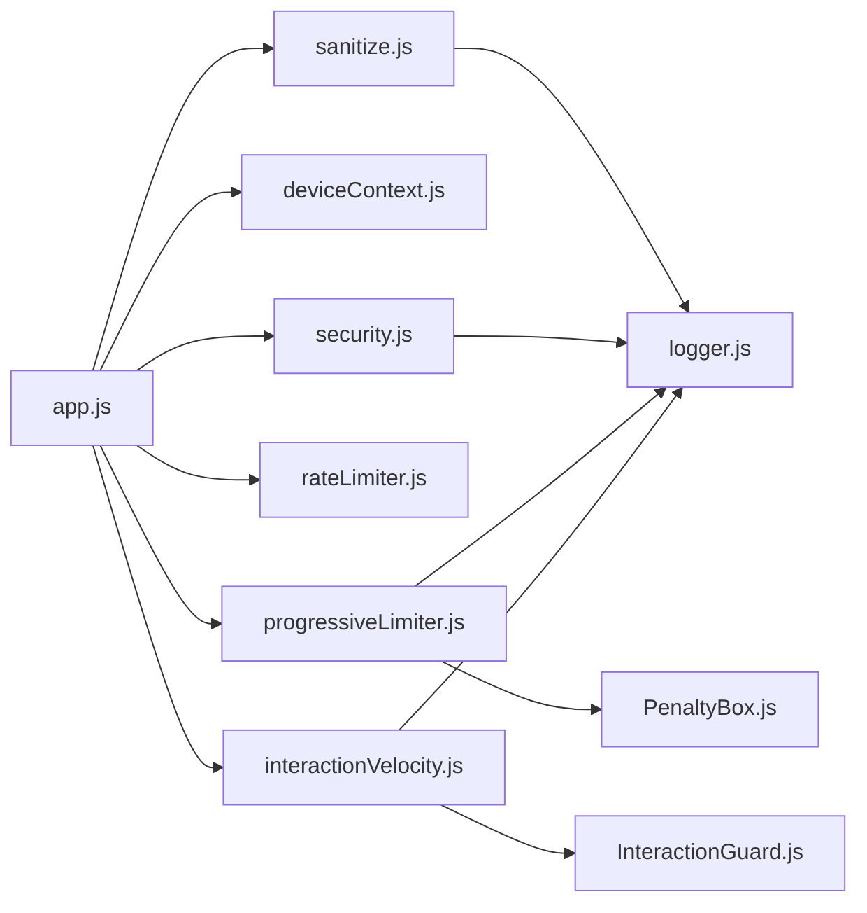

# Security Middleware

<cite>
**Referenced Files in This Document**
- [security.js](file://backend/src/middleware/security.js)
- [deviceContext.js](file://backend/src/middleware/deviceContext.js)
- [sanitize.js](file://backend/src/middleware/sanitize.js)
- [rateLimiter.js](file://backend/src/middleware/rateLimiter.js)
- [progressiveLimiter.js](file://backend/src/middleware/progressiveLimiter.js)
- [interactionVelocity.js](file://backend/src/middleware/interactionVelocity.js)
- [PenaltyBox.js](file://backend/src/services/PenaltyBox.js)
- [InteractionGuard.js](file://backend/src/services/InteractionGuard.js)
- [logger.js](file://backend/src/utils/logger.js)
- [env.js](file://backend/src/config/env.js)
- [.env.example](file://backend/.env.example)
- [package.json](file://backend/package.json)
- [auth.js](file://backend/src/routes/auth.js)
- [app.js](file://backend/src/app.js)
</cite>

## Table of Contents
1. [Introduction](#introduction)
2. [Project Structure](#project-structure)
3. [Core Components](#core-components)
4. [Architecture Overview](#architecture-overview)
5. [Detailed Component Analysis](#detailed-component-analysis)
6. [Dependency Analysis](#dependency-analysis)
7. [Performance Considerations](#performance-considerations)
8. [Troubleshooting Guide](#troubleshooting-guide)
9. [Conclusion](#conclusion)
10. [Appendices](#appendices)

## Introduction
This document describes the security middleware suite powering the backend. It covers secure headers via Helmet, CORS configuration, request timeouts, device context fingerprinting, sanitization and validation, rate limiting, behavioral velocity controls, and suspicious activity monitoring. It also provides guidance on configuring security headers, CORS, and device context data collection across environments, along with practical advice on balancing security and user experience/performance.

## Project Structure
The security middleware suite is organized under backend/src/middleware and backend/src/services, with configuration and environment variables under backend/src/config and backend/.env. Express app wiring is centralized in backend/src/app.js, and routes demonstrate integration with device context and security services.

**Diagram sources**
- [app.js](file://backend/src/app.js#L1-L78)
- [security.js](file://backend/src/middleware/security.js#L1-L75)
- [deviceContext.js](file://backend/src/middleware/deviceContext.js#L1-L24)
- [sanitize.js](file://backend/src/middleware/sanitize.js#L1-L154)
- [rateLimiter.js](file://backend/src/middleware/rateLimiter.js#L1-L76)
- [progressiveLimiter.js](file://backend/src/middleware/progressiveLimiter.js#L1-L61)
- [interactionVelocity.js](file://backend/src/middleware/interactionVelocity.js#L1-L62)
- [PenaltyBox.js](file://backend/src/services/PenaltyBox.js#L1-L108)
- [InteractionGuard.js](file://backend/src/services/InteractionGuard.js#L1-L124)
- [env.js](file://backend/src/config/env.js#L1-L31)
- [.env.example](file://backend/.env.example#L1-L25)
- [auth.js](file://backend/src/routes/auth.js#L1-L301)

**Section sources**
- [app.js](file://backend/src/app.js#L1-L78)
- [security.js](file://backend/src/middleware/security.js#L1-L75)
- [deviceContext.js](file://backend/src/middleware/deviceContext.js#L1-L24)
- [sanitize.js](file://backend/src/middleware/sanitize.js#L1-L154)
- [rateLimiter.js](file://backend/src/middleware/rateLimiter.js#L1-L76)
- [progressiveLimiter.js](file://backend/src/middleware/progressiveLimiter.js#L1-L61)
- [interactionVelocity.js](file://backend/src/middleware/interactionVelocity.js#L1-L62)
- [PenaltyBox.js](file://backend/src/services/PenaltyBox.js#L1-L108)
- [InteractionGuard.js](file://backend/src/services/InteractionGuard.js#L1-L124)
- [env.js](file://backend/src/config/env.js#L1-L31)
- [.env.example](file://backend/.env.example#L1-L25)
- [auth.js](file://backend/src/routes/auth.js#L1-L301)

## Core Components
- Helmet-based secure headers tailored for API-only usage with specific policies disabled to accommodate Flutter Web image fetching.
- CORS with strict origin whitelisting, method/methods, allowed headers, credentials support, and preflight caching.
- Request timeout middleware that exempts slow routes (uploads, feeds, interactions, proxy) while applying a 15-second hard timeout to other JSON/REST requests.
- Device context middleware that extracts and hashes IP, User-Agent, and optional device ID to keep raw identifiers out of persistent storage.
- Sanitization and validation pipeline using express-mongo-sanitize, xss-clean, hpp, and express-validator for robust input hygiene and file validation.
- Rate limiting: general, auth-heavy, upload-focused, and health-check variants; plus a progressive, in-memory limiter with escalating penalties.
- Behavioral velocity controls to prevent graph abuse (e.g., rapid follow/like toggles) via shadow suppression and strict blocking.
- Security logging and event tagging for diagnostics and incident response.

**Section sources**
- [security.js](file://backend/src/middleware/security.js#L1-L75)
- [deviceContext.js](file://backend/src/middleware/deviceContext.js#L1-L24)
- [sanitize.js](file://backend/src/middleware/sanitize.js#L1-L154)
- [rateLimiter.js](file://backend/src/middleware/rateLimiter.js#L1-L76)
- [progressiveLimiter.js](file://backend/src/middleware/progressiveLimiter.js#L1-L61)
- [interactionVelocity.js](file://backend/src/middleware/interactionVelocity.js#L1-L62)
- [logger.js](file://backend/src/utils/logger.js#L1-L29)

## Architecture Overview
The Express app wires security headers, CORS, logging, request shaping, and timeout middleware early. Route groups apply progressive and user-based rate limiting. Authentication routes consume device context for session continuity and risk evaluation.

**Diagram sources**
- [app.js](file://backend/src/app.js#L1-L78)
- [security.js](file://backend/src/middleware/security.js#L1-L75)
- [deviceContext.js](file://backend/src/middleware/deviceContext.js#L1-L24)
- [sanitize.js](file://backend/src/middleware/sanitize.js#L1-L154)
- [progressiveLimiter.js](file://backend/src/middleware/progressiveLimiter.js#L1-L61)
- [auth.js](file://backend/src/routes/auth.js#L1-L301)

## Detailed Component Analysis

### Helmet Secure Headers Integration
- Helmet is initialized with contentSecurityPolicy, crossOriginEmbedderPolicy, and crossOriginResourcePolicy disabled to align with Flutter Web image fetching needs.
- This configuration prioritizes compatibility for browser-side assets while maintaining other security headers.

**Section sources**
- [security.js](file://backend/src/middleware/security.js#L10-L14)

### CORS Configuration
- Origin validation is dynamic: in non-production, all origins are accepted; in production, origins are drawn from an environment variable list.
- Localhost/127.0.0.1 origins are implicitly allowed.
- Methods, allowed headers, credentials, and preflight cache are explicitly set.

**Section sources**
- [security.js](file://backend/src/middleware/security.js#L17-L46)
- [env.js](file://backend/src/config/env.js#L9-L9)
- [.env.example](file://backend/.env.example#L24-L24)

### Request Timeout Handling
- Exemptions: multipart uploads, slow routes (/api/posts, /api/proxy, /api/interactions), and proxy requests.
- For other JSON/REST requests, a 15-second hard timeout is enforced; on timeout, a structured error is passed to the centralized error handler.

**Diagram sources**
- [security.js](file://backend/src/middleware/security.js#L48-L74)

**Section sources**
- [security.js](file://backend/src/middleware/security.js#L48-L74)

### Device Context Middleware
- Extracts IP, User-Agent, and optional device ID from headers.
- Hashes sensitive attributes using SHA-256 and attaches them to req.deviceContext for downstream use.
- Enforces device_id requirement for refresh endpoint.

**Diagram sources**
- [deviceContext.js](file://backend/src/middleware/deviceContext.js#L7-L23)

**Section sources**
- [deviceContext.js](file://backend/src/middleware/deviceContext.js#L1-L24)
- [auth.js](file://backend/src/routes/auth.js#L166-L169)

### XSS Protection, CSRF Prevention, and Content Security Policies
- XSS protection: xss-clean and express-mongo-sanitize are applied to sanitize incoming requests and prevent NoSQL injection.
- CSRF prevention: CSRF protection is not enabled in the current middleware stack; CSRF mitigation relies on token-based auth and device/session continuity checks.
- Content Security Policy: Disabled in Helmet initialization to support Flutter Web image loading; CSP can be reintroduced selectively if asset delivery changes.

**Section sources**
- [sanitize.js](file://backend/src/middleware/sanitize.js#L8-L12)
- [security.js](file://backend/src/middleware/security.js#L10-L14)

### Sanitization and Validation Pipeline
- Input sanitizers: express-mongo-sanitize, xss-clean, and hpp.
- Validation errors are captured and logged with structured metadata; responses return 400 with details.
- File upload validation includes magic-byte inspection and MIME-type matching; token expiration checks relax the 1-hour window to 24 hours for UX balance.

**Diagram sources**
- [sanitize.js](file://backend/src/middleware/sanitize.js#L8-L154)

**Section sources**
- [sanitize.js](file://backend/src/middleware/sanitize.js#L1-L154)

### Rate Limiting Strategies
- General API limiter: per-IP sliding window with generous thresholds.
- Authentication limiter: very strict for brute-force resistance.
- Upload limiter: moderate caps for media-intensive endpoints.
- Speed limiter: gradual slowdown after a baseline to deter scraping.
- Health check limiter: permissive for monitoring systems.

**Diagram sources**
- [rateLimiter.js](file://backend/src/middleware/rateLimiter.js#L1-L76)

**Section sources**
- [rateLimiter.js](file://backend/src/middleware/rateLimiter.js#L1-L76)

### Progressive Rate Limiting with PenaltyBox
- Central policy map defines per-action limits and windows.
- Uses a global PenaltyBox for:
  - Global pressure detection (>2000 req/s).
  - Per-key counters with memory caps.
  - Progressive penalties: escalate from 5 minutes to 30 minutes to 24 hours after repeated infractions.
- Returns 429 with cooldown info or 503 during global overload.

**Diagram sources**
- [progressiveLimiter.js](file://backend/src/middleware/progressiveLimiter.js#L22-L60)
- [PenaltyBox.js](file://backend/src/services/PenaltyBox.js#L22-L87)

**Section sources**
- [progressiveLimiter.js](file://backend/src/middleware/progressiveLimiter.js#L1-L61)
- [PenaltyBox.js](file://backend/src/services/PenaltyBox.js#L1-L108)

### Behavioral Velocity Controls (InteractionGuard)
- Pair toggle cooldown: prevents rapid toggles (e.g., like/unlike) within a short interval by shadow-suppression (pretend success, no DB write).
- Cycle detection: flags excessive cycling within a window and blocks the action for a period.
- Global velocity: enforces per-minute and per-hour caps for actions like follows and likes.

**Diagram sources**
- [InteractionGuard.js](file://backend/src/services/InteractionGuard.js#L47-L98)

**Section sources**
- [interactionVelocity.js](file://backend/src/middleware/interactionVelocity.js#L1-L62)
- [InteractionGuard.js](file://backend/src/services/InteractionGuard.js#L1-L124)

### Device Fingerprinting, Browser Detection, and Suspicious Activity Monitoring
- Device fingerprinting: SHA-256 hashes of IP, User-Agent, and device ID are stored with refresh tokens and used for continuity checks and session burns.
- Browser detection: not explicitly implemented; fingerprinting relies on headers and device ID.
- Suspicious activity monitoring: refresh token rotation integrates with a risk engine evaluating device continuity, temporal behavior, and accumulated risk scores.

**Diagram sources**
- [auth.js](file://backend/src/routes/auth.js#L166-L280)
- [deviceContext.js](file://backend/src/middleware/deviceContext.js#L7-L23)

**Section sources**
- [auth.js](file://backend/src/routes/auth.js#L166-L280)
- [deviceContext.js](file://backend/src/middleware/deviceContext.js#L1-L24)

## Dependency Analysis
- Express app composes middleware in order: security headers, CORS, logging, request parsing, timeout, then routes grouped by public vs protected.
- Progressive limiter depends on a global PenaltyBox instance.
- Interaction velocity middleware depends on InteractionGuard service.
- Security logging leverages a shared logger with a dedicated security event helper.

**Diagram sources**
- [app.js](file://backend/src/app.js#L1-L78)
- [security.js](file://backend/src/middleware/security.js#L1-L75)
- [deviceContext.js](file://backend/src/middleware/deviceContext.js#L1-L24)
- [sanitize.js](file://backend/src/middleware/sanitize.js#L1-L154)
- [rateLimiter.js](file://backend/src/middleware/rateLimiter.js#L1-L76)
- [progressiveLimiter.js](file://backend/src/middleware/progressiveLimiter.js#L1-L61)
- [interactionVelocity.js](file://backend/src/middleware/interactionVelocity.js#L1-L62)
- [PenaltyBox.js](file://backend/src/services/PenaltyBox.js#L1-L108)
- [InteractionGuard.js](file://backend/src/services/InteractionGuard.js#L1-L124)
- [logger.js](file://backend/src/utils/logger.js#L1-L29)

**Section sources**
- [app.js](file://backend/src/app.js#L1-L78)
- [progressiveLimiter.js](file://backend/src/middleware/progressiveLimiter.js#L1-L61)
- [PenaltyBox.js](file://backend/src/services/PenaltyBox.js#L1-L108)
- [interactionVelocity.js](file://backend/src/middleware/interactionVelocity.js#L1-L62)
- [InteractionGuard.js](file://backend/src/services/InteractionGuard.js#L1-L124)
- [logger.js](file://backend/src/utils/logger.js#L1-L29)

## Performance Considerations
- Helmet disabled policies reduce overhead and improve compatibility for Flutter Web images.
- Progressive limiter avoids external dependencies and uses in-memory maps with periodic cleanup to prevent memory growth.
- InteractionGuard maintains lightweight in-memory counters with TTL-based eviction.
- Request timeout exemptions for slow routes prevent legitimate delays from causing false positives.
- Centralized logging uses a structured logger to minimize formatting overhead.

[No sources needed since this section provides general guidance]

## Troubleshooting Guide
- CORS blocked: verify production origins in environment variables and ensure preflight caching aligns with client expectations.
- Timeout errors: confirm route exemptions for uploads/feeds/interactions/proxy; adjust timeout for custom endpoints if needed.
- Validation failures: inspect security logs for validation error arrays and address malformed payloads.
- Rate limit exceeded: review logs for RATE_LIMIT_EXCEEDED events; consider tuning progressive policy windows or increasing allowances for trusted clients.
- Suspicious refresh attempts: device ID mismatches or continuity failures trigger full session burns; investigate device context propagation and risk scoring.

**Section sources**
- [security.js](file://backend/src/middleware/security.js#L25-L46)
- [logger.js](file://backend/src/utils/logger.js#L20-L26)
- [progressiveLimiter.js](file://backend/src/middleware/progressiveLimiter.js#L33-L55)
- [auth.js](file://backend/src/routes/auth.js#L202-L214)

## Conclusion
The security middleware suite combines defensive headers, strict CORS, layered rate limiting, behavioral velocity controls, and device-based session continuity to deliver robust protection. Its design balances strong security with operational pragmatism, particularly for media-heavy and Flutter Web-enabled deployments. Proper configuration of environment variables and careful tuning of limits ensures both safety and user experience.

[No sources needed since this section summarizes without analyzing specific files]

## Appendices

### Configuration Examples by Environment
- Development
  - CORS: allow all origins for simplicity.
  - Helmet: keep current policy settings for Flutter Web compatibility.
  - Timeouts: rely on defaults; consider shorter timeouts for local testing.
- Staging/Production
  - CORS: set explicit allowed origins via environment variable.
  - Helmet: maintain current policy settings; revisit CSP if asset delivery changes.
  - Timeouts: ensure exemptions for slow routes; monitor 503 responses during overload.

**Section sources**
- [security.js](file://backend/src/middleware/security.js#L17-L46)
- [env.js](file://backend/src/config/env.js#L9-L9)
- [.env.example](file://backend/.env.example#L24-L24)

### Security Header Customization Notes
- Helmet is configured to disable CSP, COEP, and CORP to support Flutter Web image fetching. Re-enable CSP selectively if CDN/static hosting changes.

**Section sources**
- [security.js](file://backend/src/middleware/security.js#L10-L14)

### Device Context Data Collection
- Device context includes hashed IP, User-Agent, and device ID. These values are persisted with refresh tokens to enable continuity checks and session containment decisions.

**Section sources**
- [deviceContext.js](file://backend/src/middleware/deviceContext.js#L16-L20)
- [auth.js](file://backend/src/routes/auth.js#L133-L135)
- [auth.js](file://backend/src/routes/auth.js#L259-L261)

### Balancing Security and User Experience
- Use progressive limits with escalating penalties to deter abuse without permanently blocking legitimate users.
- Apply shadow suppression for mild behavioral violations to avoid user friction.
- Relax token age windows moderately to reduce re-auth frequency while retaining security.
- Monitor logs for 503/global pressure events and scale capacity accordingly.

**Section sources**
- [PenaltyBox.js](file://backend/src/services/PenaltyBox.js#L31-L34)
- [InteractionGuard.js](file://backend/src/services/InteractionGuard.js#L58-L64)
- [sanitize.js](file://backend/src/middleware/sanitize.js#L115-L129)