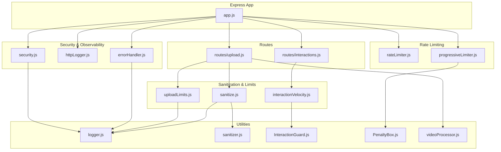
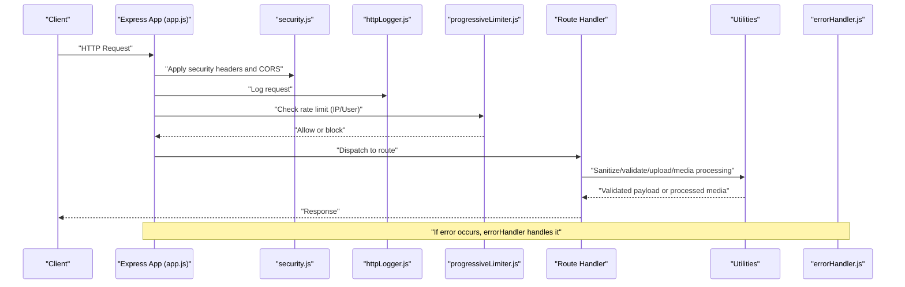
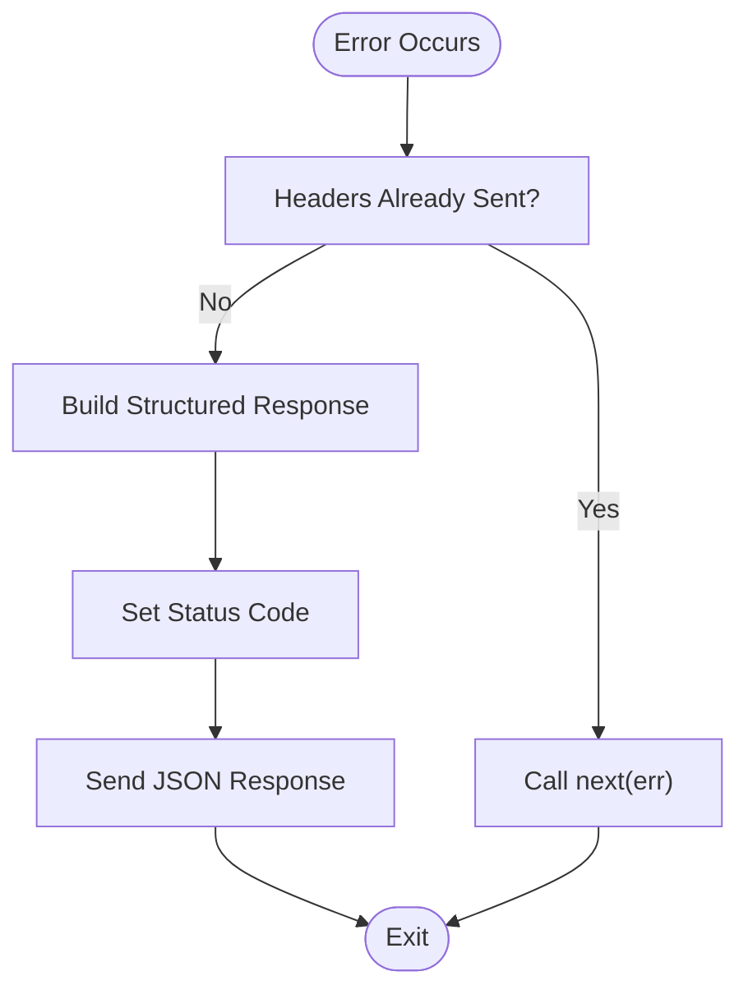
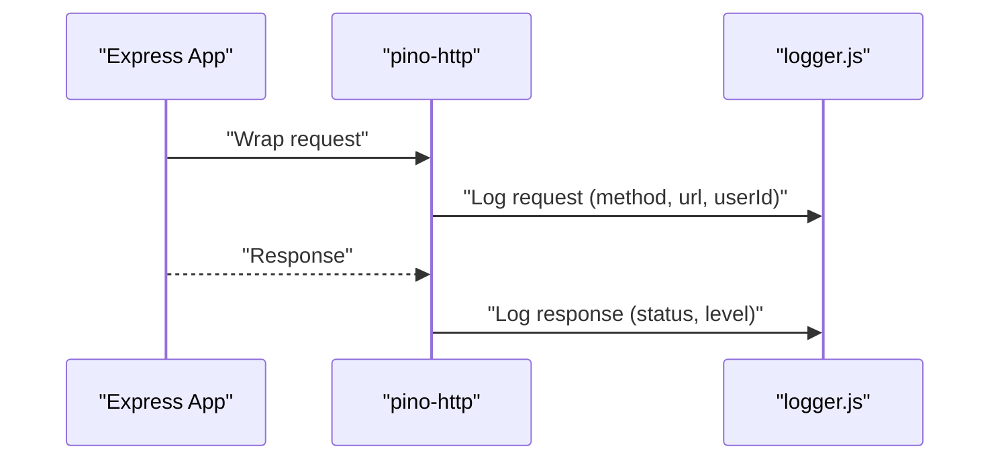
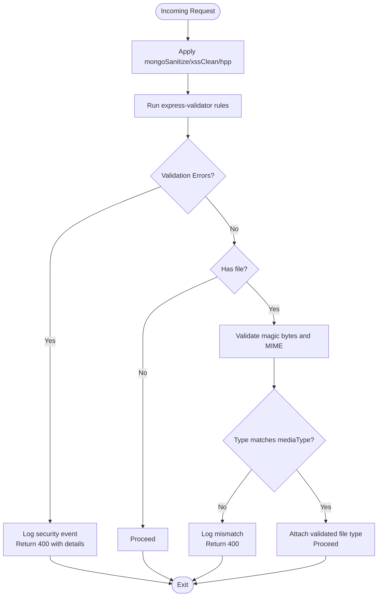
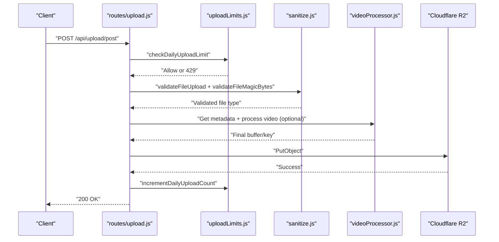
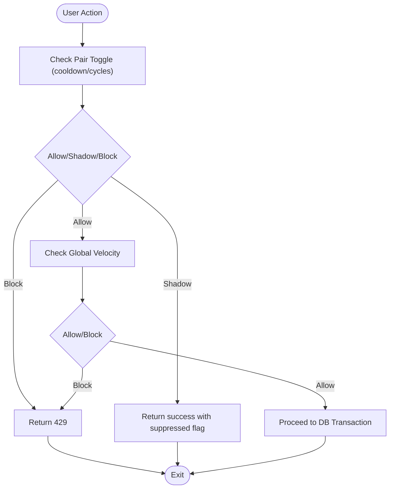
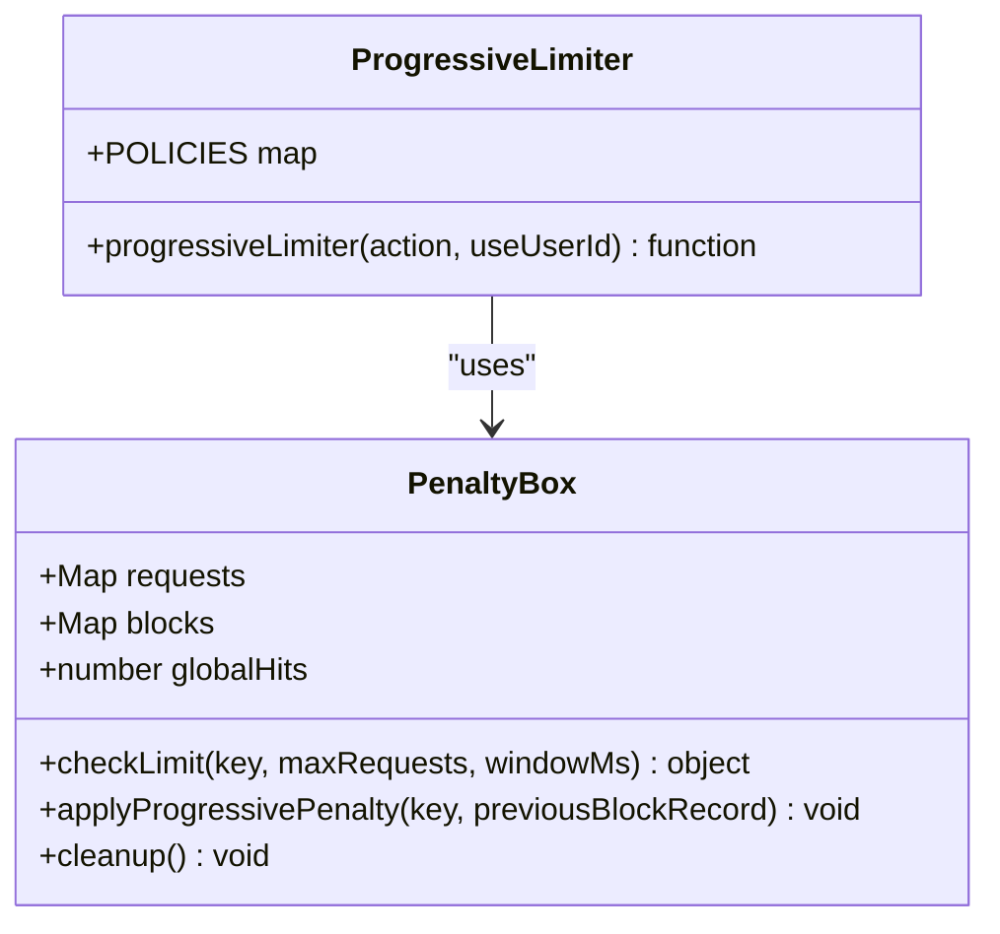
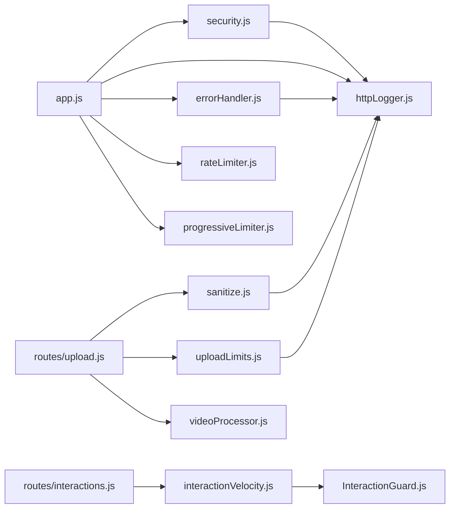

# Utility Middleware

<cite>
**Referenced Files in This Document**
- [app.js](file://backend/src/app.js)
- [errorHandler.js](file://backend/src/middleware/errorHandler.js)
- [httpLogger.js](file://backend/src/middleware/httpLogger.js)
- [sanitize.js](file://backend/src/middleware/sanitize.js)
- [uploadLimits.js](file://backend/src/middleware/uploadLimits.js)
- [interactionVelocity.js](file://backend/src/middleware/interactionVelocity.js)
- [security.js](file://backend/src/middleware/security.js)
- [rateLimiter.js](file://backend/src/middleware/rateLimiter.js)
- [progressiveLimiter.js](file://backend/src/middleware/progressiveLimiter.js)
- [logger.js](file://backend/src/utils/logger.js)
- [sanitizer.js](file://backend/src/utils/sanitizer.js)
- [InteractionGuard.js](file://backend/src/services/InteractionGuard.js)
- [PenaltyBox.js](file://backend/src/services/PenaltyBox.js)
- [videoProcessor.js](file://backend/src/utils/videoProcessor.js)
- [upload.js](file://backend/src/routes/upload.js)
- [interactions.js](file://backend/src/routes/interactions.js)
- [.env.example](file://backend/.env.example)
</cite>

## Table of Contents
1. [Introduction](#introduction)
2. [Project Structure](#project-structure)
3. [Core Components](#core-components)
4. [Architecture Overview](#architecture-overview)
5. [Detailed Component Analysis](#detailed-component-analysis)
6. [Dependency Analysis](#dependency-analysis)
7. [Performance Considerations](#performance-considerations)
8. [Troubleshooting Guide](#troubleshooting-guide)
9. [Conclusion](#conclusion)
10. [Appendices](#appendices)

## Introduction
This document describes the utility middleware collection that enforces robust error handling, HTTP logging, input sanitization, upload limits, and interaction velocity tracking. It explains how these components collaborate to provide structured error responses, comprehensive request/response auditing, protection against injection and abuse, and safeguards for media uploads. It also covers configuration patterns, logging formats, and integration points with monitoring systems.

## Project Structure
The middleware and supporting utilities live under backend/src/middleware and backend/src/utils, with route handlers under backend/src/routes. The central Express application mounts security headers, CORS, HTTP logging, request shaping, rate limiting, and the centralized error handler.

**Diagram sources**
- [app.js](file://backend/src/app.js#L1-L78)
- [security.js](file://backend/src/middleware/security.js#L1-L75)
- [httpLogger.js](file://backend/src/middleware/httpLogger.js#L1-L21)
- [errorHandler.js](file://backend/src/middleware/errorHandler.js#L1-L35)
- [sanitize.js](file://backend/src/middleware/sanitize.js#L1-L154)
- [uploadLimits.js](file://backend/src/middleware/uploadLimits.js#L1-L55)
- [interactionVelocity.js](file://backend/src/middleware/interactionVelocity.js#L1-L62)
- [rateLimiter.js](file://backend/src/middleware/rateLimiter.js#L1-L76)
- [progressiveLimiter.js](file://backend/src/middleware/progressiveLimiter.js#L1-L61)
- [logger.js](file://backend/src/utils/logger.js#L1-L29)
- [sanitizer.js](file://backend/src/utils/sanitizer.js#L1-L64)
- [InteractionGuard.js](file://backend/src/services/InteractionGuard.js#L1-L124)
- [PenaltyBox.js](file://backend/src/services/PenaltyBox.js#L1-L108)
- [videoProcessor.js](file://backend/src/utils/videoProcessor.js#L1-L61)
- [upload.js](file://backend/src/routes/upload.js#L1-L225)
- [interactions.js](file://backend/src/routes/interactions.js#L1-L522)

**Section sources**
- [app.js](file://backend/src/app.js#L1-L78)

## Core Components
- Centralized error handling with structured JSON responses, environment-aware error details, and request context logging.
- HTTP logging with severity-based levels, request/response tracking, and user identification.
- Input sanitization and validation to prevent injection and mass assignment, plus file upload validation and media processing safeguards.
- Upload size/type checks and daily upload caps with incrementing counters.
- Interaction velocity enforcement to detect and mitigate abusive behavior via a hybrid behavioral model.
- Progressive rate limiting with global pressure detection, progressive penalties, and user/IP-scoped limits.

**Section sources**
- [errorHandler.js](file://backend/src/middleware/errorHandler.js#L1-L35)
- [httpLogger.js](file://backend/src/middleware/httpLogger.js#L1-L21)
- [sanitize.js](file://backend/src/middleware/sanitize.js#L1-L154)
- [uploadLimits.js](file://backend/src/middleware/uploadLimits.js#L1-L55)
- [interactionVelocity.js](file://backend/src/middleware/interactionVelocity.js#L1-L62)
- [progressiveLimiter.js](file://backend/src/middleware/progressiveLimiter.js#L1-L61)

## Architecture Overview
The middleware stack is mounted in a specific order to ensure security, observability, and resilience. Security headers and CORS are applied first, followed by HTTP logging. Request shaping and timeouts normalize traffic, then progressive and classic rate limiters gate traffic. Route handlers apply specialized sanitization and validation. A centralized error handler finalizes uncaught errors and ensures consistent responses.

**Diagram sources**
- [app.js](file://backend/src/app.js#L1-L78)
- [security.js](file://backend/src/middleware/security.js#L1-L75)
- [httpLogger.js](file://backend/src/middleware/httpLogger.js#L1-L21)
- [progressiveLimiter.js](file://backend/src/middleware/progressiveLimiter.js#L1-L61)
- [errorHandler.js](file://backend/src/middleware/errorHandler.js#L1-L35)

## Detailed Component Analysis

### Centralized Error Handling
- Logs full error context (message, stack, path, method, body, user ID) for internal tracking.
- Prevents duplicate responses when headers are already sent.
- Returns structured JSON with success flag, null data, and an error object containing message, code, and optional stack in non-production environments.
- Integrates with the shared logger for audit trails.

**Diagram sources**
- [errorHandler.js](file://backend/src/middleware/errorHandler.js#L1-L35)

**Section sources**
- [errorHandler.js](file://backend/src/middleware/errorHandler.js#L1-L35)
- [logger.js](file://backend/src/utils/logger.js#L1-L29)

### HTTP Logging Middleware
- Uses pino-http to log requests and responses with severity levels derived from status codes and errors.
- Serializes request context including method, URL, and user ID when present.
- Provides a custom log level function to classify logs as info, warn, or error.

**Diagram sources**
- [httpLogger.js](file://backend/src/middleware/httpLogger.js#L1-L21)
- [logger.js](file://backend/src/utils/logger.js#L1-L29)

**Section sources**
- [httpLogger.js](file://backend/src/middleware/httpLogger.js#L1-L21)
- [logger.js](file://backend/src/utils/logger.js#L1-L29)

### Input Sanitization and Validation
- Request sanitization pipeline:
  - NoSQL injection prevention via mongo-sanitize.
  - XSS protection via xss-clean.
  - HTTP Parameter Pollution mitigation via hpp.
- Validation error handler returns structured 400 responses with details and logs security events.
- File upload validation:
  - Declared media type and file extension constraints.
  - Magic-byte validation to verify MIME type matches declared type.
  - Logging of mismatches and invalid types as security events.
- Token expiration validation:
  - Enforces relaxed token age checks and logs expired-token usage.
- Request size validation:
  - Checks Content-Length and returns 413 with details when exceeded.

**Diagram sources**
- [sanitize.js](file://backend/src/middleware/sanitize.js#L1-L154)
- [logger.js](file://backend/src/utils/logger.js#L1-L29)

**Section sources**
- [sanitize.js](file://backend/src/middleware/sanitize.js#L1-L154)
- [sanitizer.js](file://backend/src/utils/sanitizer.js#L1-L64)
- [logger.js](file://backend/src/utils/logger.js#L1-L29)

### Upload Size Limits and Media Safeguards
- Daily upload limit middleware:
  - Tracks per-user counts in Firestore per calendar day.
  - Blocks with 429 when limit reached and logs warnings.
  - Increment helper updates counters after successful uploads.
- Route-level safeguards:
  - Multer memory storage with increased file size limits for videos.
  - Magic-byte validation and MIME matching.
  - Optional video processing (metadata extraction, trimming, compression) to standardize format and reduce size.
  - Cleanup of temporary files in all cases.

**Diagram sources**
- [upload.js](file://backend/src/routes/upload.js#L1-L225)
- [uploadLimits.js](file://backend/src/middleware/uploadLimits.js#L1-L55)
- [sanitize.js](file://backend/src/middleware/sanitize.js#L1-L154)
- [videoProcessor.js](file://backend/src/utils/videoProcessor.js#L1-L61)

**Section sources**
- [uploadLimits.js](file://backend/src/middleware/uploadLimits.js#L1-L55)
- [upload.js](file://backend/src/routes/upload.js#L1-L225)
- [videoProcessor.js](file://backend/src/utils/videoProcessor.js#L1-L61)

### Interaction Velocity Tracking
- Enforces behavioral controls for follow and like actions to prevent spam and graph pollution.
- Hybrid model:
  - Shadow suppression: silently ignores rapid toggles to confuse bots without signaling throttling.
  - Strict blocking: rejects excessive bursts with 429.
- Uses an in-memory guard with periodic cleanup and sliding-window counters.
- Integrates with routes to wrap action endpoints.

**Diagram sources**
- [interactionVelocity.js](file://backend/src/middleware/interactionVelocity.js#L1-L62)
- [InteractionGuard.js](file://backend/src/services/InteractionGuard.js#L1-L124)

**Section sources**
- [interactionVelocity.js](file://backend/src/middleware/interactionVelocity.js#L1-L62)
- [InteractionGuard.js](file://backend/src/services/InteractionGuard.js#L1-L124)
- [interactions.js](file://backend/src/routes/interactions.js#L1-L522)

### Rate Limiting Strategies
- Classic rate limiters:
  - General API limiter with generous thresholds.
  - Authentication limiter for brute-force protection.
  - Upload limiter tailored for media.
  - Speed limiter to gradually slow repeat offenders.
  - Health check limiter for monitoring endpoints.
- Progressive limiter:
  - In-memory, user/IP-scoped with configurable policies.
  - Global pressure detection to preempt overload.
  - Progressive penalties escalate with repeated infractions.
  - Integrates with a shared PenaltyBox service for stateful tracking.

**Diagram sources**
- [progressiveLimiter.js](file://backend/src/middleware/progressiveLimiter.js#L1-L61)
- [PenaltyBox.js](file://backend/src/services/PenaltyBox.js#L1-L108)

**Section sources**
- [rateLimiter.js](file://backend/src/middleware/rateLimiter.js#L1-L76)
- [progressiveLimiter.js](file://backend/src/middleware/progressiveLimiter.js#L1-L61)
- [PenaltyBox.js](file://backend/src/services/PenaltyBox.js#L1-L108)

## Dependency Analysis
- Mount order in the application ensures security, logging, and rate limiting precede route handling.
- Route handlers import and compose middleware for specialized tasks (authentication, sanitization, velocity checks, upload limits).
- Utilities provide shared logging and sanitization helpers used across middleware and routes.
- Services encapsulate behavioral guards and stateful rate limiting logic.

**Diagram sources**
- [app.js](file://backend/src/app.js#L1-L78)
- [upload.js](file://backend/src/routes/upload.js#L1-L225)
- [interactions.js](file://backend/src/routes/interactions.js#L1-L522)
- [sanitize.js](file://backend/src/middleware/sanitize.js#L1-L154)
- [uploadLimits.js](file://backend/src/middleware/uploadLimits.js#L1-L55)
- [interactionVelocity.js](file://backend/src/middleware/interactionVelocity.js#L1-L62)
- [InteractionGuard.js](file://backend/src/services/InteractionGuard.js#L1-L124)
- [rateLimiter.js](file://backend/src/middleware/rateLimiter.js#L1-L76)
- [progressiveLimiter.js](file://backend/src/middleware/progressiveLimiter.js#L1-L61)
- [logger.js](file://backend/src/utils/logger.js#L1-L29)

**Section sources**
- [app.js](file://backend/src/app.js#L1-L78)
- [upload.js](file://backend/src/routes/upload.js#L1-L225)
- [interactions.js](file://backend/src/routes/interactions.js#L1-L522)

## Performance Considerations
- HTTP logging uses severity-based levels to reduce noise and improve log parsing performance.
- Progressive rate limiting avoids external dependencies for stateful tracking and applies global pressure detection to prevent overload cascades.
- Video processing trims and compresses media to reduce storage and bandwidth costs while ensuring consistent output formats.
- Request shaping with size limits prevents oversized payloads from consuming memory and CPU.

[No sources needed since this section provides general guidance]

## Troubleshooting Guide
- Error responses:
  - Inspect the structured error object returned by the centralized handler for message, code, and environment-specific stack traces.
  - Review server logs for detailed error entries with request context.
- HTTP logs:
  - Use log levels to filter noisy endpoints and focus on warnings and errors.
  - Correlate request IDs and user IDs to trace problematic flows.
- Sanitization failures:
  - Validation errors return 400 with details; confirm client payloads meet declared rules and file types.
  - Security events are logged for mismatches and invalid types; review logs for patterns.
- Upload issues:
  - Daily upload limits return 429; verify Firestore counters and retry timing.
  - Video processing errors are logged; check ffmpeg availability and disk space.
- Interaction velocity:
  - Rapid toggles may be shadow-suppressed; clients should throttle actions.
  - Excessive bursts receive 429; progressive penalties apply after repeated infractions.

**Section sources**
- [errorHandler.js](file://backend/src/middleware/errorHandler.js#L1-L35)
- [httpLogger.js](file://backend/src/middleware/httpLogger.js#L1-L21)
- [sanitize.js](file://backend/src/middleware/sanitize.js#L1-L154)
- [uploadLimits.js](file://backend/src/middleware/uploadLimits.js#L1-L55)
- [videoProcessor.js](file://backend/src/utils/videoProcessor.js#L1-L61)
- [interactionVelocity.js](file://backend/src/middleware/interactionVelocity.js#L1-L62)

## Conclusion
The utility middleware collection establishes a robust foundation for security, reliability, and observability. It centralizes error handling, standardizes logging, enforces input hygiene, protects uploads, and detects abusive behavior through velocity controls. Together with progressive rate limiting and global pressure detection, it provides a resilient defense-in-depth suitable for production workloads.

[No sources needed since this section summarizes without analyzing specific files]

## Appendices

### Configuration Examples
- Environment variables for Cloudflare R2 and CORS are defined in the example environment file.
- Logging level and transport are configured in the logger utility.

**Section sources**
- [.env.example](file://backend/.env.example#L1-L25)
- [logger.js](file://backend/src/utils/logger.js#L1-L29)

### Logging Formats and Security Events
- HTTP logs include method, URL, and user ID with severity classification.
- Security events are logged with a dedicated field and timestamp for auditability.
- Error handler logs full error context for internal diagnostics.

**Section sources**
- [httpLogger.js](file://backend/src/middleware/httpLogger.js#L1-L21)
- [logger.js](file://backend/src/utils/logger.js#L1-L29)
- [errorHandler.js](file://backend/src/middleware/errorHandler.js#L1-L35)

### Integration Patterns with Monitoring Systems
- HTTP logs integrate with pino-http and can be piped to external log collectors.
- Security events and warnings can be ingested by SIEM or analytics platforms for anomaly detection.
- Centralized error responses enable consistent alerting and metrics aggregation.

[No sources needed since this section provides general guidance]