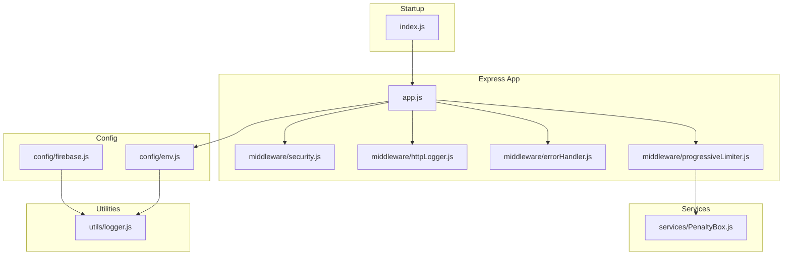
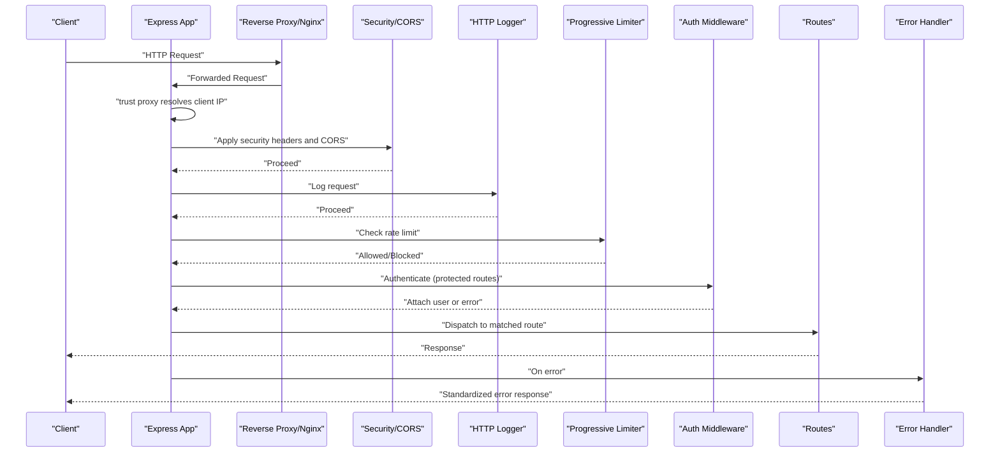
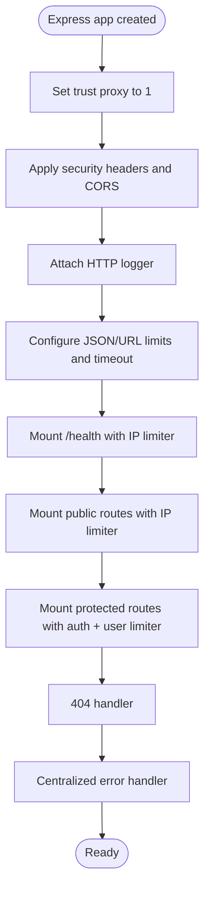
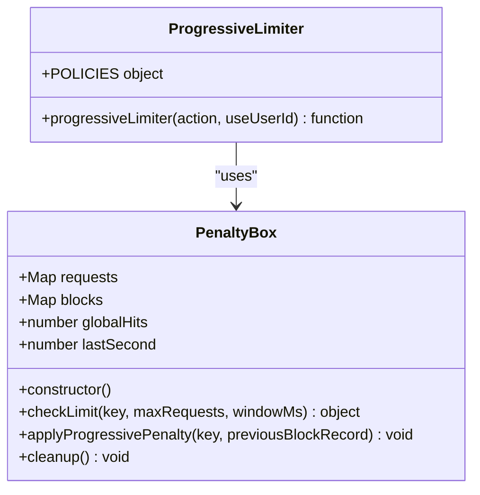
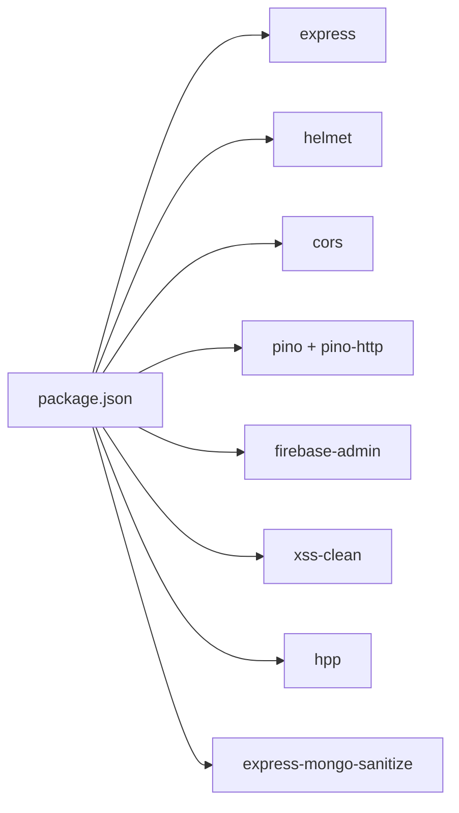

# Server Configuration

<cite>
**Referenced Files in This Document**
- [app.js](file://backend/src/app.js)
- [index.js](file://backend/src/index.js)
- [env.js](file://backend/src/config/env.js)
- [firebase.js](file://backend/src/config/firebase.js)
- [security.js](file://backend/src/middleware/security.js)
- [httpLogger.js](file://backend/src/middleware/httpLogger.js)
- [errorHandler.js](file://backend/src/middleware/errorHandler.js)
- [progressiveLimiter.js](file://backend/src/middleware/progressiveLimiter.js)
- [PenaltyBox.js](file://backend/src/services/PenaltyBox.js)
- [auth.js](file://backend/src/middleware/auth.js)
- [sanitize.js](file://backend/src/middleware/sanitize.js)
- [deviceContext.js](file://backend/src/middleware/deviceContext.js)
- [rateLimiter.js](file://backend/src/middleware/rateLimiter.js)
- [logger.js](file://backend/src/utils/logger.js)
- [package.json](file://backend/package.json)
- [.env.example](file://backend/.env.example)
</cite>

## Table of Contents
1. [Introduction](#introduction)
2. [Project Structure](#project-structure)
3. [Core Components](#core-components)
4. [Architecture Overview](#architecture-overview)
5. [Detailed Component Analysis](#detailed-component-analysis)
6. [Dependency Analysis](#dependency-analysis)
7. [Performance Considerations](#performance-considerations)
8. [Troubleshooting Guide](#troubleshooting-guide)
9. [Conclusion](#conclusion)
10. [Appendices](#appendices)

## Introduction
This document explains the Express.js server configuration and initialization for the backend. It covers trust proxy setup for accurate IP detection, security headers, CORS policy, request shaping middleware, Express application architecture, middleware ordering, initialization sequence, environment variable management, Firebase Admin SDK integration, server startup and graceful shutdown, environment-specific configurations, performance tuning, security hardening, and practical configuration patterns with troubleshooting guidance.

## Project Structure
The server is organized around an Express application module that composes middleware, routes, and centralized error handling. Configuration is split into environment variables and Firebase initialization. Logging and security utilities support robust observability and protection.

**Diagram sources**
- [app.js](file://backend/src/app.js#L1-L78)
- [index.js](file://backend/src/index.js#L1-L37)
- [env.js](file://backend/src/config/env.js#L1-L31)
- [firebase.js](file://backend/src/config/firebase.js#L1-L46)
- [security.js](file://backend/src/middleware/security.js#L1-L75)
- [httpLogger.js](file://backend/src/middleware/httpLogger.js#L1-L21)
- [errorHandler.js](file://backend/src/middleware/errorHandler.js#L1-L35)
- [progressiveLimiter.js](file://backend/src/middleware/progressiveLimiter.js#L1-L61)
- [PenaltyBox.js](file://backend/src/services/PenaltyBox.js#L1-L108)
- [logger.js](file://backend/src/utils/logger.js#L1-L29)

**Section sources**
- [app.js](file://backend/src/app.js#L1-L78)
- [index.js](file://backend/src/index.js#L1-L37)
- [env.js](file://backend/src/config/env.js#L1-L31)
- [firebase.js](file://backend/src/config/firebase.js#L1-L46)

## Core Components
- Express application initialization and middleware pipeline
- Trust proxy configuration for accurate client IP detection behind proxies/load balancers
- Security headers via Helmet (API-only mode) and strict CORS policy
- Request shaping middleware for JSON/URL-encoded bodies and timeouts
- Centralized logging with structured HTTP logging
- Progressive rate limiting with in-memory enforcement and global pressure guardrails
- Centralized error handling with production-safe responses
- Firebase Admin SDK initialization and environment validation
- Startup and graceful shutdown hooks

**Section sources**
- [app.js](file://backend/src/app.js#L1-L78)
- [security.js](file://backend/src/middleware/security.js#L1-L75)
- [httpLogger.js](file://backend/src/middleware/httpLogger.js#L1-L21)
- [progressiveLimiter.js](file://backend/src/middleware/progressiveLimiter.js#L1-L61)
- [PenaltyBox.js](file://backend/src/services/PenaltyBox.js#L1-L108)
- [errorHandler.js](file://backend/src/middleware/errorHandler.js#L1-L35)
- [firebase.js](file://backend/src/config/firebase.js#L1-L46)
- [index.js](file://backend/src/index.js#L1-L37)

## Architecture Overview
The Express server composes middleware in a specific order to ensure correct IP detection, security, logging, request shaping, routing, and error handling. Authentication and progressive rate limiting are integrated into protected routes. Firebase Admin SDK is initialized early to support auth and DB operations.

**Diagram sources**
- [app.js](file://backend/src/app.js#L1-L78)
- [security.js](file://backend/src/middleware/security.js#L1-L75)
- [httpLogger.js](file://backend/src/middleware/httpLogger.js#L1-L21)
- [progressiveLimiter.js](file://backend/src/middleware/progressiveLimiter.js#L1-L61)
- [auth.js](file://backend/src/middleware/auth.js#L1-L164)
- [errorHandler.js](file://backend/src/middleware/errorHandler.js#L1-L35)

## Detailed Component Analysis

### Express Application Initialization and Middleware Ordering
- Trust proxy is set to accept the first hop from a proxy/load balancer to ensure req.ip reflects the real client IP.
- Security headers and CORS are applied early to protect all routes uniformly.
- HTTP logging is attached next to capture request telemetry consistently.
- Request shaping sets JSON/URL-encoded limits and applies a selective timeout middleware.
- Health check endpoint is mounted publicly with a dedicated limiter.
- Public routes are mounted with IP-based progressive limiting.
- Protected routes mount authentication and user-based progressive limiting.
- A 404 handler ensures unknown routes are captured.
- Centralized error handler standardizes error responses and prevents header duplication.

**Diagram sources**
- [app.js](file://backend/src/app.js#L1-L78)

**Section sources**
- [app.js](file://backend/src/app.js#L1-L78)

### Trust Proxy Configuration for Accurate IP Detection
- The application sets trust proxy to 1, ensuring that Express reads the client IP from the appropriate forwarded header when behind a reverse proxy or load balancer.
- This enables correct identification of clients for rate limiting and security logging.

**Section sources**
- [app.js](file://backend/src/app.js#L8-L9)

### Security Headers Implementation
- Helmet is configured in API-only mode to apply essential security headers while disabling policies that interfere with Flutter Web image loading.
- This reduces risk from common browser-based attacks and enforces safe defaults.

**Section sources**
- [security.js](file://backend/src/middleware/security.js#L9-L14)

### CORS Policy Configuration
- Origins are loaded from environment variables; defaults vary by environment.
- Non-production environments allow all origins to simplify development.
- Production enforces strict origin whitelisting with preflight logging and explicit method/headers allowance.
- Credentials are supported with a defined preflight cache window.

**Section sources**
- [security.js](file://backend/src/middleware/security.js#L16-L46)

### Request Shaping Middleware
- JSON body parsing is limited to a conservative size to prevent abuse.
- URL-encoded bodies are enabled with extended support and size limits.
- A selective timeout middleware skips long-running operations (uploads, slow reads, external fetches) to avoid premature termination.

**Section sources**
- [app.js](file://backend/src/app.js#L16-L19)
- [security.js](file://backend/src/middleware/security.js#L48-L75)

### Progressive Rate Limiter and Global Pressure Guardrails
- A centralized policy map defines per-action limits and windows.
- The limiter identifies callers by user ID (when available) or IP address, leveraging trust proxy for accuracy.
- Global pressure detection caps service-wide throughput during sustained spikes.
- Progressive penalties escalate from short cooldowns to extended blocks after repeated violations.
- Cleanup routines maintain memory footprint and decay strikes over time.

**Diagram sources**
- [PenaltyBox.js](file://backend/src/services/PenaltyBox.js#L1-L108)
- [progressiveLimiter.js](file://backend/src/middleware/progressiveLimiter.js#L1-L61)

**Section sources**
- [progressiveLimiter.js](file://backend/src/middleware/progressiveLimiter.js#L1-L61)
- [PenaltyBox.js](file://backend/src/services/PenaltyBox.js#L1-L108)

### Authentication Middleware and User Context
- Supports custom short-lived JWT and Firebase ID tokens with revocation checks.
- Attaches a normalized user object to requests, including display name, role, and status.
- Enforces account suspension checks and token versioning for instant kill switches.
- Integrates with Firestore-backed user profiles and an in-memory cache to reduce DB load.

**Section sources**
- [auth.js](file://backend/src/middleware/auth.js#L1-L164)

### Centralized Error Handling
- Logs full error context including path, method, body, and user ID.
- Prevents duplicate headers and returns standardized JSON responses.
- Omits stack traces in production for safety.

**Section sources**
- [errorHandler.js](file://backend/src/middleware/errorHandler.js#L1-L35)

### HTTP Logging and Structured Telemetry
- Uses pino-http to emit structured logs with severity-based levels.
- Serializes request metadata including user ID when present.

**Section sources**
- [httpLogger.js](file://backend/src/middleware/httpLogger.js#L1-L21)

### Environment Variable Management
- Loads environment variables from dotenv.
- Defines server port, environment, CORS origins, Firebase credentials, and R2 storage configuration.
- Production mode triggers informational logging for awareness.

**Section sources**
- [env.js](file://backend/src/config/env.js#L1-L31)
- [.env.example](file://backend/.env.example#L1-L25)

### Firebase Admin SDK Integration
- Validates required environment variables before initializing.
- Cleans and normalizes private key formatting from .env.
- Initializes Admin SDK with service account credentials and logs success.
- Exposes Firestore and Auth clients for downstream services.

**Section sources**
- [firebase.js](file://backend/src/config/firebase.js#L1-L46)

### Server Startup and Graceful Shutdown
- Starts the Express server bound to all interfaces on the configured port.
- Logs environment and port information.
- Registers graceful shutdown handlers for SIGTERM/SIGINT with a timeout.
- Captures unhandled rejections and uncaught exceptions.

**Section sources**
- [index.js](file://backend/src/index.js#L1-L37)

### Additional Security and Sanitization Utilities
- Request sanitization stack (NoSQL injection, XSS, HPP).
- Validation error handling emits security events and structured 400 responses.
- File upload validation checks magic bytes and declared media type.
- Device context hashing for privacy-preserving identifiers.
- Legacy rate limiters and slow-down middleware for additional controls.

**Section sources**
- [sanitize.js](file://backend/src/middleware/sanitize.js#L1-L154)
- [deviceContext.js](file://backend/src/middleware/deviceContext.js#L1-L24)
- [rateLimiter.js](file://backend/src/middleware/rateLimiter.js#L1-L76)

## Dependency Analysis
The server’s runtime dependencies are declared in the package manifest. Key modules include Express, Helmet, CORS, Pino, Firebase Admin, and validation/sanitization libraries. The application module depends on configuration, middleware, and services to assemble the runtime pipeline.

**Diagram sources**
- [package.json](file://backend/package.json#L1-L56)

**Section sources**
- [package.json](file://backend/package.json#L1-L56)

## Performance Considerations
- Trust proxy improves IP accuracy for rate limiting and logging.
- Selective request timeouts avoid interrupting legitimate long-running operations.
- Progressive rate limiting adapts to traffic patterns and protects against sustained abuse.
- In-memory caching for user profiles reduces Firestore queries.
- Structured logging minimizes overhead and improves observability.
- Consider tuning rate limit windows and max values per environment and workload.

[No sources needed since this section provides general guidance]

## Troubleshooting Guide
Common setup issues and resolutions:
- Missing environment variables for Firebase cause immediate initialization failure. Ensure required keys are present and formatted correctly.
- CORS blocked messages indicate origin not whitelisted in production; verify allowed origins and NODE_ENV.
- 429 responses from progressive limiter imply hitting policy thresholds; review action-specific policies and caller identity (IP vs user ID).
- 503 responses under global pressure indicate high-volume traffic; scale horizontally or adjust policies.
- Uncaught exceptions and unhandled rejections are logged and terminate the process; add proper error boundaries and monitoring.
- Health check failures often relate to proxy misconfiguration; confirm trust proxy and forwarded headers.

**Section sources**
- [firebase.js](file://backend/src/config/firebase.js#L13-L17)
- [security.js](file://backend/src/middleware/security.js#L35-L41)
- [progressiveLimiter.js](file://backend/src/middleware/progressiveLimiter.js#L32-L56)
- [index.js](file://backend/src/index.js#L29-L36)

## Conclusion
The Express server is configured with strong defaults for security, logging, and resilience. Trust proxy, Helmet, CORS, and progressive rate limiting form a cohesive defense-in-depth strategy. Firebase Admin SDK integration and structured logging enable secure, observable operations. Environment-aware configuration and graceful shutdown ensure reliable deployments across development and production.

[No sources needed since this section summarizes without analyzing specific files]

## Appendices

### Configuration Options by Environment
- Development: Relaxes CORS and logging verbosity; allows wildcard origins; informative logs.
- Production: Enforces strict CORS; hides stack traces; logs at warn/error for sensitive contexts.

**Section sources**
- [env.js](file://backend/src/config/env.js#L24-L28)
- [security.js](file://backend/src/middleware/security.js#L27-L30)
- [logger.js](file://backend/src/utils/logger.js#L3-L13)
- [errorHandler.js](file://backend/src/middleware/errorHandler.js#L4)

### Practical Configuration Patterns
- Mount public endpoints with IP-based progressive limiter before protected routes.
- Attach authentication middleware before user-based progressive limiter to leverage user identity.
- Use selective timeouts for upload and slow routes to avoid false positives.
- Monitor security events for rate limit and validation failures.

**Section sources**
- [app.js](file://backend/src/app.js#L31-L60)
- [progressiveLimiter.js](file://backend/src/middleware/progressiveLimiter.js#L22-L28)
- [security.js](file://backend/src/middleware/security.js#L48-L75)