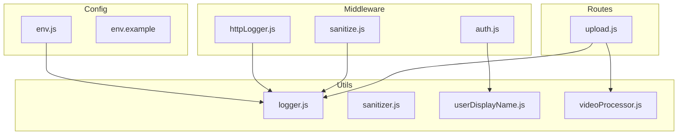
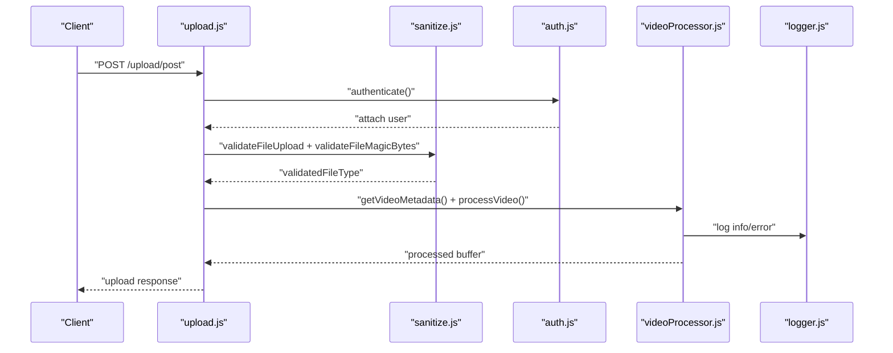
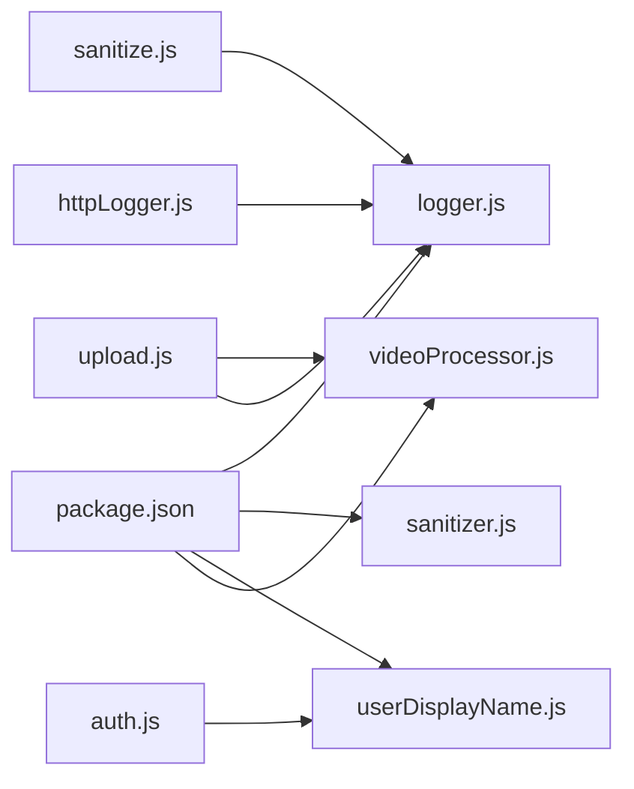

# Utility Modules

<cite>
**Referenced Files in This Document**
- [logger.js](file://backend/src/utils/logger.js)
- [sanitizer.js](file://backend/src/utils/sanitizer.js)
- [userDisplayName.js](file://backend/src/utils/userDisplayName.js)
- [videoProcessor.js](file://backend/src/utils/videoProcessor.js)
- [sanitize.js](file://backend/src/middleware/sanitize.js)
- [httpLogger.js](file://backend/src/middleware/httpLogger.js)
- [auth.js](file://backend/src/middleware/auth.js)
- [upload.js](file://backend/src/routes/upload.js)
- [env.js](file://backend/src/config/env.js)
- [env.example](file://backend/.env.example)
- [package.json](file://backend/package.json)
</cite>

## Table of Contents
1. [Introduction](#introduction)
2. [Project Structure](#project-structure)
3. [Core Components](#core-components)
4. [Architecture Overview](#architecture-overview)
5. [Detailed Component Analysis](#detailed-component-analysis)
6. [Dependency Analysis](#dependency-analysis)
7. [Performance Considerations](#performance-considerations)
8. [Troubleshooting Guide](#troubleshooting-guide)
9. [Conclusion](#conclusion)
10. [Appendices](#appendices)

## Introduction
This document provides comprehensive documentation for the utility modules and helper functions used across the backend. It covers:
- Logging utility for structured logging, log levels, and output formatting
- Input sanitization utility for data validation, XSS prevention, and content filtering
- User display name utility for username generation and formatting
- Video processing utility for media transcoding, thumbnail generation, and format conversion
It also includes usage examples, configuration options, integration patterns, error handling, performance optimization, testing strategies, and guidelines for extending and customizing these utilities.

## Project Structure
The utility modules reside under backend/src/utils and are consumed by middleware and routes. The logging utility integrates with HTTP middleware for request logging and with route handlers for operational events. The sanitization utility is used alongside Express validators and sanitizers. The video processing utility is used during media uploads to transcode and normalize video content.

**Diagram sources**
- [logger.js](file://backend/src/utils/logger.js#L1-L29)
- [sanitizer.js](file://backend/src/utils/sanitizer.js#L1-L64)
- [userDisplayName.js](file://backend/src/utils/userDisplayName.js#L1-L38)
- [videoProcessor.js](file://backend/src/utils/videoProcessor.js#L1-L61)
- [sanitize.js](file://backend/src/middleware/sanitize.js#L1-L154)
- [httpLogger.js](file://backend/src/middleware/httpLogger.js#L1-L21)
- [auth.js](file://backend/src/middleware/auth.js#L1-L164)
- [upload.js](file://backend/src/routes/upload.js#L1-L225)
- [env.js](file://backend/src/config/env.js#L1-L31)
- [env.example](file://backend/.env.example#L1-L25)

**Section sources**
- [logger.js](file://backend/src/utils/logger.js#L1-L29)
- [sanitizer.js](file://backend/src/utils/sanitizer.js#L1-L64)
- [userDisplayName.js](file://backend/src/utils/userDisplayName.js#L1-L38)
- [videoProcessor.js](file://backend/src/utils/videoProcessor.js#L1-L61)
- [sanitize.js](file://backend/src/middleware/sanitize.js#L1-L154)
- [httpLogger.js](file://backend/src/middleware/httpLogger.js#L1-L21)
- [auth.js](file://backend/src/middleware/auth.js#L1-L164)
- [upload.js](file://backend/src/routes/upload.js#L1-L225)
- [env.js](file://backend/src/config/env.js#L1-L31)
- [env.example](file://backend/.env.example#L1-L25)

## Core Components
- Logging utility: Provides structured logging with configurable levels and pretty-printed console output in development. Includes a dedicated function for security events.
- Input sanitization utility: Implements strict XSS filtering and mass assignment protection for request payloads.
- User display name utility: Generates a robust display name from available user attributes with normalization and fallback logic.
- Video processing utility: Handles video metadata extraction and transcoding to a standardized MP4 format with compression and trimming.

**Section sources**
- [logger.js](file://backend/src/utils/logger.js#L1-L29)
- [sanitizer.js](file://backend/src/utils/sanitizer.js#L1-L64)
- [userDisplayName.js](file://backend/src/utils/userDisplayName.js#L1-L38)
- [videoProcessor.js](file://backend/src/utils/videoProcessor.js#L1-L61)

## Architecture Overview
The utilities integrate with middleware and routes to enforce security, normalization, and operational visibility. The HTTP logger captures request telemetry, while the sanitization middleware validates and secures incoming requests. The upload route orchestrates video processing and secure storage.

**Diagram sources**
- [upload.js](file://backend/src/routes/upload.js#L124-L222)
- [sanitize.js](file://backend/src/middleware/sanitize.js#L31-L99)
- [auth.js](file://backend/src/middleware/auth.js#L20-L161)
- [videoProcessor.js](file://backend/src/utils/videoProcessor.js#L12-L60)
- [logger.js](file://backend/src/utils/logger.js#L15-L26)

## Detailed Component Analysis

### Logging Utility
Purpose:
- Structured logging with configurable log level
- Pretty-printed console output in non-production environments
- Dedicated function for security event logging with standardized metadata

Key behaviors:
- Log level is controlled via environment variable with a default
- Development mode enables pretty-printed console transport
- Security events are logged with a consistent shape and timestamp

Usage examples:
- Use the default logger for general application events
- Use the security event logger to record security-related activities with metadata

Configuration options:
- LOG_LEVEL: Controls minimum severity level
- NODE_ENV: Controls transport behavior (development vs. production)

Integration patterns:
- HTTP middleware wraps requests and logs outcomes
- Route handlers log upload and processing events
- Security middleware logs validation and file type checks

Error handling:
- Errors from video metadata retrieval are logged with context
- Errors from video processing are captured and logged

Performance considerations:
- Pino is optimized for speed and low overhead
- Pretty printing is disabled in production to avoid I/O overhead

Testing strategies:
- Verify log level configuration via environment
- Confirm security event shape and timestamp presence
- Ensure HTTP logger attaches user ID and request metadata

Extending and customizing:
- Add additional serializers for sensitive fields
- Introduce structured tags for correlation IDs
- Extend security event types with domain-specific metadata

**Section sources**
- [logger.js](file://backend/src/utils/logger.js#L1-L29)
- [httpLogger.js](file://backend/src/middleware/httpLogger.js#L1-L21)
- [upload.js](file://backend/src/routes/upload.js#L168-L176)
- [videoProcessor.js](file://backend/src/utils/videoProcessor.js#L14-L21)
- [sanitize.js](file://backend/src/middleware/sanitize.js#L18-L28)

### Input Sanitization Utility
Purpose:
- Prevent XSS by stripping HTML tags and malicious content
- Prevent mass assignment by allowing only explicitly permitted fields
- Provide a strict sanitization pipeline for untrusted input

Key behaviors:
- XSS filtering uses a strict whitelist configuration that disallows all tags
- Recursive sanitization preserves structure while cleaning strings
- Allowed field filtering ensures only known keys are accepted

Usage examples:
- Clean incoming request bodies using allowed field lists
- Sanitize individual values or entire nested structures

Configuration options:
- XSS filter configuration is embedded in the module
- Allowed fields list is provided per endpoint

Integration patterns:
- Used by middleware to validate and sanitize file uploads
- Applied to request bodies before downstream processing

Error handling:
- Malformed or malicious inputs are sanitized to safe strings
- Payloads missing allowed fields become empty objects

Performance considerations:
- Recursion depth depends on input structure; avoid deeply nested inputs
- String processing overhead scales linearly with content length

Testing strategies:
- Validate that all HTML tags are stripped from inputs
- Ensure only allowed keys remain after filtering
- Test recursive sanitization across arrays and objects

Extending and customizing:
- Adjust the XSS whitelist for specific use cases (use with caution)
- Expand allowed fields per endpoint as needed
- Add domain-specific sanitization rules

**Section sources**
- [sanitizer.js](file://backend/src/utils/sanitizer.js#L1-L64)
- [sanitize.js](file://backend/src/middleware/sanitize.js#L31-L99)

### User Display Name Utility
Purpose:
- Generate a consistent, normalized display name from user attributes
- Provide fallback behavior when no suitable name is available

Key behaviors:
- Normalizes whitespace and trims values
- Tries display name, then username, then composed full name, then email prefix
- Falls back to a default value if none are present

Usage examples:
- Build display names for authenticated users in middleware
- Generate display names for notifications and audit trails

Configuration options:
- Fallback value is configurable

Integration patterns:
- Called by authentication middleware to attach a display name to the user object
- Used wherever a human-readable user identity is needed

Error handling:
- Non-string values are treated as empty
- Missing or empty values fall back through the chain

Performance considerations:
- Simple string operations; negligible overhead
- Memoization of user profiles reduces repeated computation

Testing strategies:
- Verify precedence order: displayName > username > fullName > email prefix > fallback
- Ensure normalization removes extra spaces and handles missing fields

Extending and customizing:
- Add additional fallbacks (e.g., phone number)
- Introduce locale-aware name formatting
- Enforce minimum length or character restrictions

**Section sources**
- [userDisplayName.js](file://backend/src/utils/userDisplayName.js#L1-L38)
- [auth.js](file://backend/src/middleware/auth.js#L53-L60)

### Video Processing Utility
Purpose:
- Extract metadata from video files
- Transcode and normalize videos to a standardized format with compression and optional trimming

Key behaviors:
- Metadata extraction via ffprobe
- Transcoding to MP4 with H.264 video and AAC audio codecs
- Compression control via CRF and encoding preset
- Optional duration trimming to a maximum threshold
- Event logging for start, completion, and errors

Usage examples:
- Retrieve video duration and format details before processing
- Transcode uploaded videos to a consistent format and size

Configuration options:
- Default maximum duration for trimming
- Encoding parameters (codec, CRF, preset, faststart)

Integration patterns:
- Called by upload route to process videos prior to storage
- Uses temporary files for input and output during processing

Error handling:
- Errors during metadata extraction or processing are caught and logged
- Route-level error handling ensures consistent responses

Performance considerations:
- Transcoding is CPU-intensive; consider queueing and concurrency limits
- Temporary files are cleaned up in a finally block
- Faststart improves streaming readiness

Testing strategies:
- Verify metadata extraction for various formats
- Ensure transcoding produces valid MP4 files
- Validate that trimming respects the maximum duration

Extending and customizing:
- Add thumbnail generation after successful processing
- Support additional output formats or resolutions
- Introduce quality tiers based on bitrate or resolution

**Section sources**
- [videoProcessor.js](file://backend/src/utils/videoProcessor.js#L1-L61)
- [upload.js](file://backend/src/routes/upload.js#L168-L182)

## Dependency Analysis
The utilities depend on external libraries and are consumed by middleware and routes. The logging utility is foundational, used by HTTP middleware and route handlers. The sanitization utility is used by the sanitization middleware. The video processing utility is used by the upload route. The user display name utility is used by the authentication middleware.

**Diagram sources**
- [package.json](file://backend/package.json#L24-L55)
- [logger.js](file://backend/src/utils/logger.js#L1-L29)
- [sanitizer.js](file://backend/src/utils/sanitizer.js#L1-L64)
- [userDisplayName.js](file://backend/src/utils/userDisplayName.js#L1-L38)
- [videoProcessor.js](file://backend/src/utils/videoProcessor.js#L1-L61)
- [sanitize.js](file://backend/src/middleware/sanitize.js#L1-L154)
- [httpLogger.js](file://backend/src/middleware/httpLogger.js#L1-L21)
- [auth.js](file://backend/src/middleware/auth.js#L1-L164)
- [upload.js](file://backend/src/routes/upload.js#L1-L225)

**Section sources**
- [package.json](file://backend/package.json#L24-L55)
- [logger.js](file://backend/src/utils/logger.js#L1-L29)
- [sanitizer.js](file://backend/src/utils/sanitizer.js#L1-L64)
- [userDisplayName.js](file://backend/src/utils/userDisplayName.js#L1-L38)
- [videoProcessor.js](file://backend/src/utils/videoProcessor.js#L1-L61)
- [sanitize.js](file://backend/src/middleware/sanitize.js#L1-L154)
- [httpLogger.js](file://backend/src/middleware/httpLogger.js#L1-L21)
- [auth.js](file://backend/src/middleware/auth.js#L1-L164)
- [upload.js](file://backend/src/routes/upload.js#L1-L225)

## Performance Considerations
- Logging: Pino is optimized; disable pretty printing in production to reduce overhead. Consider batching or asynchronous transports for high-throughput scenarios.
- Sanitization: Keep allowed field lists minimal and targeted to reduce unnecessary processing. Avoid deep recursion on very large payloads.
- Video processing: Offload transcoding to background jobs or queues. Limit concurrent processing and monitor CPU usage. Use faststart and appropriate CRF values to balance quality and size.
- Authentication: Cache user profiles to minimize database queries. Tune cache TTL based on update frequency.

[No sources needed since this section provides general guidance]

## Troubleshooting Guide
Common issues and resolutions:
- Logging not visible in production: Ensure LOG_LEVEL is set appropriately and pretty transport is disabled.
- Unexpected XSS filtering: Review the strict whitelist configuration and adjust allowed fields lists.
- Video processing failures: Verify ffmpeg availability and permissions. Check temporary directory space and cleanup routines.
- Display name not appearing: Confirm user attributes are populated and normalization rules are met.

Error handling patterns:
- Security events are logged with metadata for investigation.
- HTTP middleware logs request outcomes with custom log levels.
- Route handlers centralize error logging and response formatting.

Testing strategies:
- Unit tests for sanitization should assert tag stripping and allowed field filtering.
- Integration tests for video processing should validate metadata and output format.
- Load tests for logging should measure throughput and latency.

**Section sources**
- [logger.js](file://backend/src/utils/logger.js#L15-L26)
- [sanitize.js](file://backend/src/middleware/sanitize.js#L18-L28)
- [httpLogger.js](file://backend/src/middleware/httpLogger.js#L13-L17)
- [upload.js](file://backend/src/routes/upload.js#L201-L211)

## Conclusion
These utility modules provide essential capabilities for security, normalization, identity, and media processing. They are designed for composability and are integrated throughout the middleware and routes. By following the configuration options, integration patterns, and testing strategies outlined here, teams can extend and customize these utilities safely and efficiently.

[No sources needed since this section summarizes without analyzing specific files]

## Appendices

### Configuration Options Reference
- Logging
  - LOG_LEVEL: Minimum severity level (e.g., debug, info, warn, error)
  - NODE_ENV: Environment mode affecting transport behavior
- Environment
  - PORT, NODE_ENV, CORS_ORIGIN, Firebase, R2, SendGrid

**Section sources**
- [logger.js](file://backend/src/utils/logger.js#L3-L12)
- [env.js](file://backend/src/config/env.js#L6-L22)
- [env.example](file://backend/.env.example#L1-L25)

### Integration Examples Index
- Logging
  - HTTP request logging via pino-http
  - Security event logging in sanitization middleware
  - Operational logging in upload route
- Sanitization
  - Request validation and sanitization in upload route
- User display name
  - Authentication middleware attaching display names
- Video processing
  - Upload route orchestrating metadata extraction and transcoding

**Section sources**
- [httpLogger.js](file://backend/src/middleware/httpLogger.js#L1-L21)
- [sanitize.js](file://backend/src/middleware/sanitize.js#L18-L28)
- [upload.js](file://backend/src/routes/upload.js#L168-L182)
- [auth.js](file://backend/src/middleware/auth.js#L53-L60)