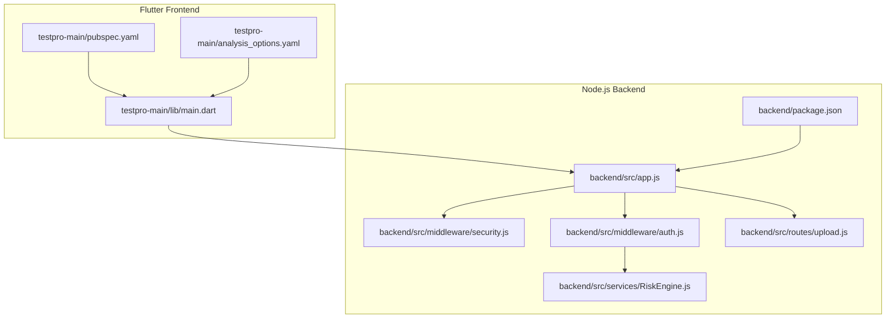
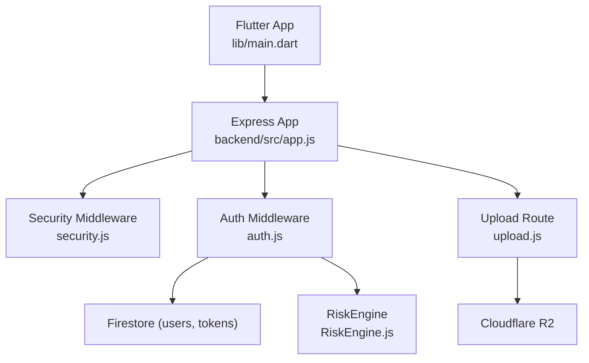

# Contributing Guidelines

<cite>
**Referenced Files in This Document**
- [PRD.md](file://PRD.md)
- [TESTING_GUIDE.md](file://TESTING_GUIDE.md)
- [DEPLOYMENT_GUIDE.md](file://DEPLOYMENT_GUIDE.md)
- [analysis_options.yaml](file://testpro-main/analysis_options.yaml)
- [pubspec.yaml](file://testpro-main/pubspec.yaml)
- [lib/main.dart](file://testpro-main/lib/main.dart)
- [backend/package.json](file://backend/package.json)
- [backend/src/app.js](file://backend/src/app.js)
- [backend/src/middleware/security.js](file://backend/src/middleware/security.js)
- [backend/src/middleware/auth.js](file://backend/src/middleware/auth.js)
- [backend/src/routes/upload.js](file://backend/src/routes/upload.js)
- [backend/src/services/RiskEngine.js](file://backend/src/services/RiskEngine.js)
</cite>

## Table of Contents
1. [Introduction](#introduction)
2. [Project Structure](#project-structure)
3. [Core Components](#core-components)
4. [Architecture Overview](#architecture-overview)
5. [Development Workflow](#development-workflow)
6. [Branching Strategy](#branching-strategy)
7. [Code Review Process](#code-review-process)
8. [Testing Requirements](#testing-requirements)
9. [Coding Standards](#coding-standards)
10. [Refactoring Plan](#refactoring-plan)
11. [Code Quality Requirements](#code-quality-requirements)
12. [Performance Expectations](#performance-expectations)
13. [Documentation Standards](#documentation-standards)
14. [Commit Message Conventions](#commit-message-conventions)
15. [Pull Request Procedures](#pull-request-procedures)
16. [Architectural Principles and Design Patterns](#architectural-principles-and-design-patterns)
17. [Security Considerations](#security-considerations)
18. [Contribution Evaluation Metrics](#contribution-evaluation-metrics)
19. [Onboarding and Mentorship](#onboarding-and-mentorship)
20. [Troubleshooting Guide](#troubleshooting-guide)
21. [Conclusion](#conclusion)

## Introduction
LocalMe (project name “ZenFlow” per the product requirement document) is a high-performance, community-centric social platform built with Flutter (mobile, web) and Node.js/Express backend. Contributors will collaborate on a modular backend architecture, secure media upload pipeline, and a responsive frontend. This document defines the development workflow, standards, testing, security, and contribution evaluation criteria for both internal and external contributors.

## Project Structure
The repository is organized into:
- Flutter application (frontend) under testpro-main/
- Node.js/Express backend under backend/
- Cross-cutting documents for product, testing, deployment, and security

**Diagram sources**
- [lib/main.dart](file://testpro-main/lib/main.dart#L1-L63)
- [pubspec.yaml](file://testpro-main/pubspec.yaml#L1-L61)
- [analysis_options.yaml](file://testpro-main/analysis_options.yaml#L1-L29)
- [backend/src/app.js](file://backend/src/app.js#L1-L78)
- [backend/src/middleware/security.js](file://backend/src/middleware/security.js#L1-L75)
- [backend/src/middleware/auth.js](file://backend/src/middleware/auth.js#L1-L164)
- [backend/src/routes/upload.js](file://backend/src/routes/upload.js#L1-L225)
- [backend/src/services/RiskEngine.js](file://backend/src/services/RiskEngine.js#L1-L170)
- [backend/package.json](file://backend/package.json#L1-L56)

**Section sources**
- [PRD.md](file://PRD.md#L1-L84)
- [lib/main.dart](file://testpro-main/lib/main.dart#L1-L63)
- [backend/src/app.js](file://backend/src/app.js#L1-L78)

## Core Components
- Flutter app bootstraps Firebase, initializes notifications, and routes based on auth state.
- Backend Express app configures security headers, CORS, logging, rate limiting, and mounts public and protected routes.
- Authentication middleware verifies Firebase ID tokens and supports optional short-lived custom JWTs with token versioning and caching.
- Upload route handles profile and post media uploads, validates file types, processes videos, and stores artifacts in Cloudflare R2.
- RiskEngine enforces session continuity and refresh risk thresholds to mitigate token theft and abuse.

**Section sources**
- [lib/main.dart](file://testpro-main/lib/main.dart#L12-L62)
- [backend/src/app.js](file://backend/src/app.js#L1-L78)
- [backend/src/middleware/auth.js](file://backend/src/middleware/auth.js#L20-L161)
- [backend/src/routes/upload.js](file://backend/src/routes/upload.js#L80-L222)
- [backend/src/services/RiskEngine.js](file://backend/src/services/RiskEngine.js#L11-L130)

## Architecture Overview
The system follows a thin-client Flutter frontend communicating with a modular Node.js/Express backend. Security is enforced via Helmet headers, strict CORS, progressive rate limiting, and JWT/Firebase token verification. Media ingestion is handled by a dedicated upload pipeline with client-side compression and server-side validation and processing.

**Diagram sources**
- [lib/main.dart](file://testpro-main/lib/main.dart#L12-L62)
- [backend/src/app.js](file://backend/src/app.js#L1-L78)
- [backend/src/middleware/security.js](file://backend/src/middleware/security.js#L1-L75)
- [backend/src/middleware/auth.js](file://backend/src/middleware/auth.js#L1-L164)
- [backend/src/routes/upload.js](file://backend/src/routes/upload.js#L1-L225)
- [backend/src/services/RiskEngine.js](file://backend/src/services/RiskEngine.js#L1-L170)

## Development Workflow
- Local setup: Start backend, run Flutter app, and connect via localhost.
- Backend health and security headers are validated during local tests.
- Integration tests cover authentication, uploads, and error handling.

Recommended steps:
- Backend: npm start (development) and health checks.
- Flutter: hot reload and verify connectivity to backend.
- Upload flow: profile image and post media with media proxy.

**Section sources**
- [TESTING_GUIDE.md](file://TESTING_GUIDE.md#L5-L104)

## Branching Strategy
- Use feature branches prefixed with feature/, fix/, chore/, or docs/.
- Keep branches focused and small; sync with main regularly.
- Merge via pull request with required reviews and passing checks.

[No sources needed since this section provides general guidance]

## Code Review Process
- Pull requests must include automated checks and approval from maintainers.
- Review focuses on correctness, security, performance, maintainability, and adherence to standards.
- Security-sensitive changes require explicit review and approval.

[No sources needed since this section provides general guidance]

## Testing Requirements
- Backend: health endpoint, security headers, rate limiting, authentication, file validation, and error handling.
- Flutter: connectivity, Google Sign-In, profile and post media uploads, error messaging, and loading states.
- Security tests: invalid file types, missing/expired tokens, large files, and rate limiting.
- Performance: target sub-50ms average response time under load.

**Section sources**
- [TESTING_GUIDE.md](file://TESTING_GUIDE.md#L190-L353)

## Coding Standards
- Flutter/Dart
  - Enforced via flutter_lints; customize rules in analysis_options.yaml.
  - Dependencies managed in pubspec.yaml; keep versions aligned with project SDK.
- Node.js/Express
  - Node version pinned in package.json engines.
  - Modular middleware and route separation; centralized error handling.
- General
  - Prefer explicit error handling and logging.
  - Avoid printing sensitive data; ensure logs do not expose secrets.

**Section sources**
- [analysis_options.yaml](file://testpro-main/analysis_options.yaml#L8-L29)
- [pubspec.yaml](file://testpro-main/pubspec.yaml#L7-L46)
- [backend/package.json](file://backend/package.json#L7-L9)
- [backend/src/app.js](file://backend/src/app.js#L74-L75)

## Refactoring Plan
- Consolidate repeated validation and sanitization logic into reusable middleware.
- Extract rate limiter configurations into a central config module.
- Introduce unit tests for middleware and services to improve coverage.
- Standardize error codes and messages across routes.

[No sources needed since this section provides general guidance]

## Code Quality Requirements
- Static analysis passes without warnings.
- No console logging of secrets; sanitize logs.
- Defensive programming: validate inputs, handle errors gracefully, and avoid panics.
- Consistent naming and modular structure.

[No sources needed since this section provides general guidance]

## Performance Expectations
- Backend: sub-50ms average response time under load; health endpoint responsive.
- Frontend: optimistic UI updates for actions; minimal perceived latency (<200ms for user actions).
- Media pipeline: client-side compression and server-side processing to optimize bandwidth and storage.

**Section sources**
- [PRD.md](file://PRD.md#L60-L66)
- [TESTING_GUIDE.md](file://TESTING_GUIDE.md#L260-L281)

## Documentation Standards
- Keep PRD and guides updated with changes.
- Inline comments for complex logic; avoid redundant comments.
- API endpoints and middleware behavior documented in code and tests.

[No sources needed since this section provides general guidance]

## Commit Message Conventions
- Use imperative mood: “Add feature”, “Fix bug”, “Refactor component”.
- Prefix with scope when appropriate: feat(auth): add token refresh.
- Keep subject concise; reference issue numbers if applicable.

[No sources needed since this section provides general guidance]

## Pull Request Procedures
- Fill out the PR template; link related issues.
- Ensure CI passes and all checks are green.
- Request reviews from maintainers; address feedback promptly.

[No sources needed since this section provides general guidance]

## Architectural Principles and Design Patterns
- Thin frontend with centralized backend services.
- Progressive rate limiting keyed by IP and user ID.
- JWT/Firebase dual-path authentication with token versioning.
- Risk-aware session continuity and refresh safeguards.
- Modular middleware for security, auth, logging, and sanitization.

**Section sources**
- [backend/src/app.js](file://backend/src/app.js#L1-L78)
- [backend/src/middleware/security.js](file://backend/src/middleware/security.js#L1-L75)
- [backend/src/middleware/auth.js](file://backend/src/middleware/auth.js#L32-L89)
- [backend/src/services/RiskEngine.js](file://backend/src/services/RiskEngine.js#L11-L130)

## Security Considerations
- Rotate Firebase service account keys and Cloudflare R2 credentials before deployment.
- Clean sensitive files from Git history if exposed.
- Enforce CORS whitelisting, helmet headers, and strict file validation.
- Monitor security events and rate-limit violations.

**Section sources**
- [DEPLOYMENT_GUIDE.md](file://DEPLOYMENT_GUIDE.md#L9-L87)
- [TESTING_GUIDE.md](file://TESTING_GUIDE.md#L153-L187)
- [backend/src/middleware/security.js](file://backend/src/middleware/security.js#L16-L46)
- [backend/src/middleware/auth.js](file://backend/src/middleware/auth.js#L68-L77)

## Contribution Evaluation Metrics
- Code quality: static analysis, test coverage, and adherence to standards.
- Security: no exposure of secrets, proper validation, and secure defaults.
- Performance: responsiveness and throughput under load.
- Documentation: updated guides and inline clarity.
- Collaboration: timely reviews, constructive feedback, and clear communication.

[No sources needed since this section provides general guidance]

## Onboarding and Mentorship
- New contributors should start with local setup, run the testing guide, and submit a small, scoped PR.
- Pair with a mentor for first contributions; focus on familiarizing with the backend routing and Flutter auth flow.

**Section sources**
- [TESTING_GUIDE.md](file://TESTING_GUIDE.md#L1-L104)
- [lib/main.dart](file://testpro-main/lib/main.dart#L12-L62)

## Troubleshooting Guide
- Backend startup: verify environment variables and Firebase credentials.
- Flutter connectivity: confirm backend is running and CORS is configured.
- Upload failures: check token validity, file type, and size limits.
- Production readiness: rotate credentials, clean Git history, and deploy with correct environment variables.

**Section sources**
- [TESTING_GUIDE.md](file://TESTING_GUIDE.md#L221-L257)
- [DEPLOYMENT_GUIDE.md](file://DEPLOYMENT_GUIDE.md#L90-L180)

## Conclusion
By following these guidelines, contributors can deliver secure, performant, and maintainable features across Flutter and Node.js components. Adherence to standards, rigorous testing, and collaborative review ensures a high-quality product aligned with the project’s goals.