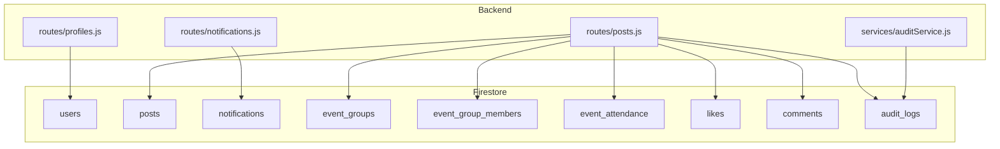
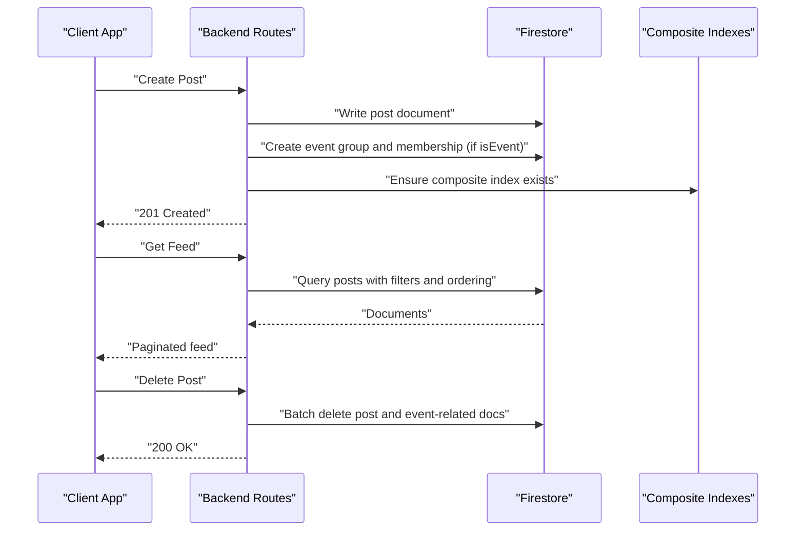
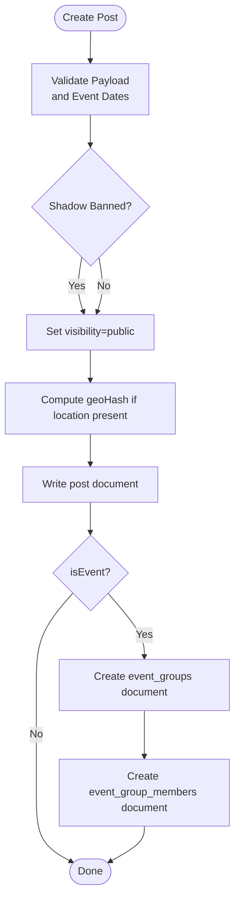
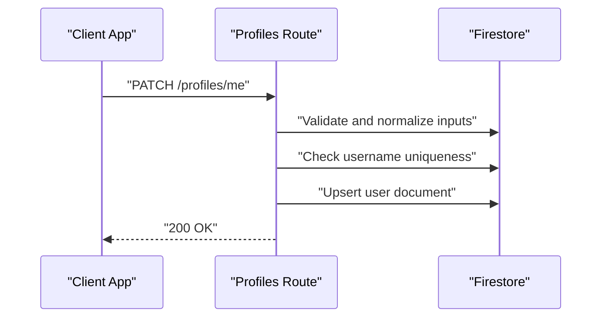
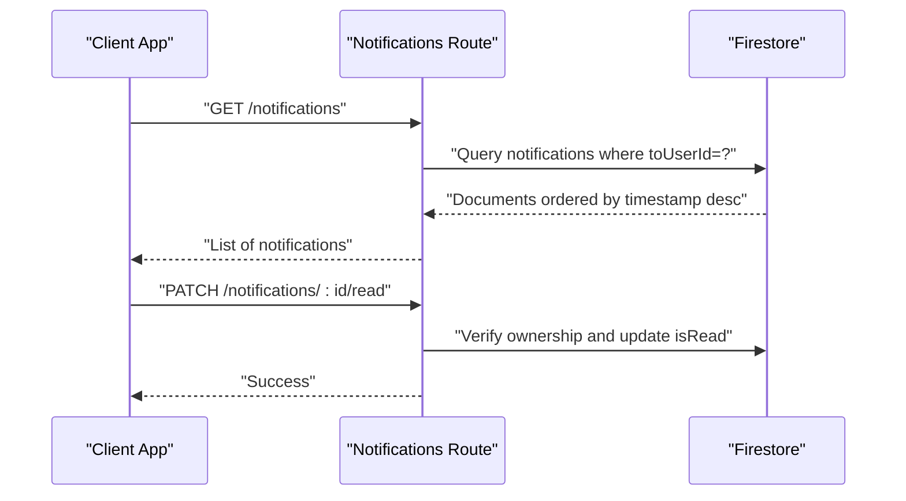
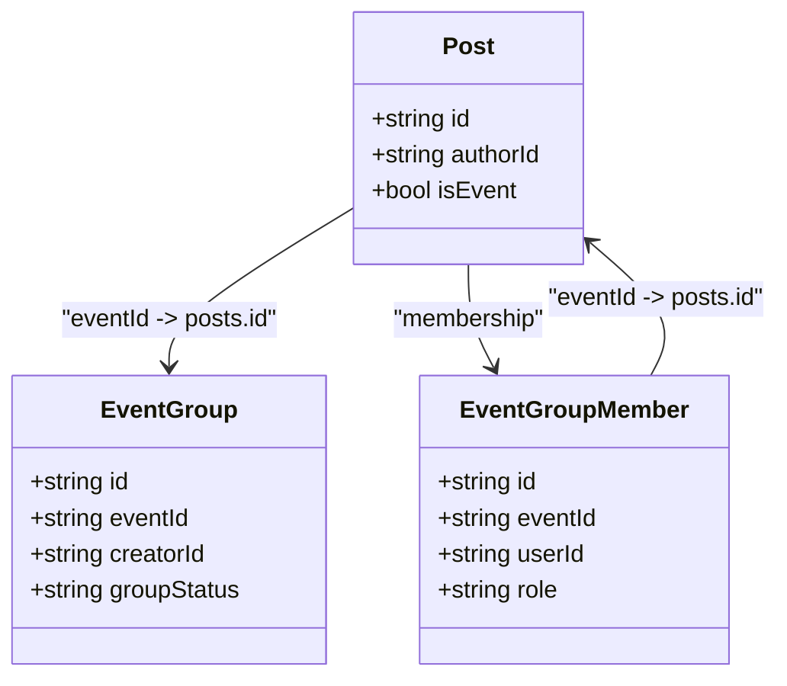
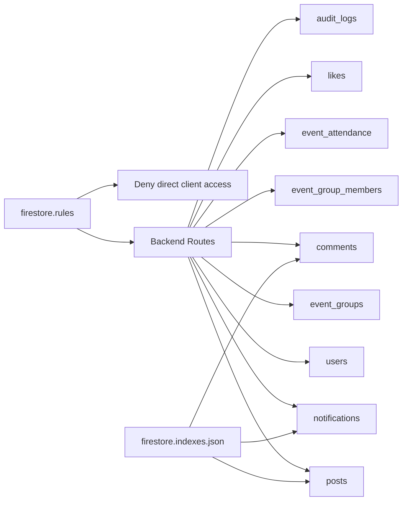

# Database Design

<cite>
**Referenced Files in This Document**
- [firestore.rules](file://firestore.rules)
- [firestore.indexes.json](file://firestore.indexes.json)
- [firebase.json](file://firebase.json)
- [post.dart](file://lib/models/post.dart)
- [user_profile.dart](file://lib/models/user_profile.dart)
- [notification.dart](file://lib/models/notification.dart)
- [event_group.dart](file://lib/models/event_group.dart)
- [posts.js](file://backend/src/routes/posts.js)
- [notifications.js](file://backend/src/routes/notifications.js)
- [profiles.js](file://backend/src/routes/profiles.js)
- [auditService.js](file://backend/src/services/auditService.js)
</cite>

## Table of Contents
1. [Introduction](#introduction)
2. [Project Structure](#project-structure)
3. [Core Components](#core-components)
4. [Architecture Overview](#architecture-overview)
5. [Detailed Component Analysis](#detailed-component-analysis)
6. [Dependency Analysis](#dependency-analysis)
7. [Performance Considerations](#performance-considerations)
8. [Troubleshooting Guide](#troubleshooting-guide)
9. [Conclusion](#conclusion)
10. [Appendices](#appendices)

## Introduction
This document provides comprehensive database design documentation for the Firestore schema used by the platform. It focuses on the Posts, Users, Notifications, and Events-related collections, detailing entity relationships, field definitions, data types, validation rules, indexing strategy, security rules, and query optimization techniques. It also outlines data lifecycle considerations and operational practices derived from the repository’s configuration and backend routes.

## Project Structure
The database schema is defined by:
- Security rules restricting direct client access to Firestore
- Composite indexes enabling efficient queries
- Backend routes implementing data creation, retrieval, updates, and cascading deletes
- Frontend models mapping to Firestore documents

**Diagram sources**
- [posts.js](file://backend/src/routes/posts.js#L154-L178)
- [notifications.js](file://backend/src/routes/notifications.js#L11-L29)
- [profiles.js](file://backend/src/routes/profiles.js#L29-L154)
- [auditService.js](file://backend/src/services/auditService.js#L9-L20)

**Section sources**
- [firestore.rules](file://firestore.rules#L1-L11)
- [firestore.indexes.json](file://firestore.indexes.json#L1-L181)
- [firebase.json](file://firebase.json#L1-L32)

## Core Components
This section defines the core collections and their fields, types, and constraints inferred from the backend routes and frontend models.

- Users (Collection)
  - Purpose: Stores user identity, profile metadata, and system state.
  - Key fields:
    - id: string (document id)
    - email: string
    - username: string
    - displayName: string
    - firstName: string
    - lastName: string
    - location: string
    - dob: string
    - phone: string
    - gender: string
    - about: string
    - profileImageUrl: string
    - subscribers: number
    - followingCount: number
    - contents: number
    - role: string (e.g., user, creator, admin, moderator)
    - status: string (e.g., active, shadow_banned)
    - createdAt: timestamp
    - updatedAt: timestamp
  - Notes:
    - Username uniqueness is enforced via a query on the users collection.
    - Role changes require administrative privileges.
    - Profile reads may self-heal missing records for the authenticated owner.

- Posts (Collection)
  - Purpose: Stores posts and events, including media, location, and engagement metrics.
  - Key fields:
    - id: string (document id)
    - authorId: string
    - authorName: string
    - authorProfileImage: string
    - title: string
    - body/text: string
    - mediaUrl: string
    - mediaType: string (image, video, none)
    - thumbnailUrl: string
    - createdAt: timestamp
    - likeCount: number
    - commentCount: number
    - latitude/longitude: number
    - city: string
    - country: string
    - category: string
    - isEvent: boolean
    - eventStartDate: timestamp
    - eventEndDate: timestamp
    - eventType: string
    - computedStatus: string (active/archived)
    - eventLocation: string
    - isFree: boolean
    - attendeeCount: number
    - visibility: string (public, shadow)
    - status: string (active)
    - geoHash: string
  - Notes:
    - Event posts are governed by event_groups and event_group_members.
    - Cascading delete applies to event-related collections when a post is deleted.
    - Feed queries filter by visibility and status and order by createdAt desc.

- Notifications (Collection)
  - Purpose: Stores activity notifications for users.
  - Key fields:
    - id: string (document id)
    - fromUserId: string
    - fromUserName: string
    - fromUserProfileImage: string
    - toUserId: string
    - type: string (like, comment, follow, mention)
    - postId: string
    - postThumbnail: string
    - commentText: string
    - timestamp: timestamp
    - isRead: boolean
  - Notes:
    - Queries target toUserId with descending timestamp ordering.

- Event Groups (Collection)
  - Purpose: Manages event governance groups and creators.
  - Key fields:
    - id: string (document id)
    - eventId: string
    - creatorId: string
    - groupStatus: string (active, archived)
    - createdAt: timestamp
  - Notes:
    - Created during post creation when isEvent is true.
    - Deterministic membership record created for the author.

- Event Group Members (Collection)
  - Purpose: Tracks members of event groups with roles.
  - Key fields:
    - id: string (document id)
    - eventId: string
    - userId: string
    - role: string (admin, member)
    - joinedAt: timestamp
  - Notes:
    - Deterministic document id pattern: "{eventId}_{userId}".

- Event Attendance (Collection)
  - Purpose: Tracks attendance for events.
  - Key fields:
    - id: string (document id)
    - eventId: string
    - userId: string
    - joinedAt: timestamp
  - Notes:
    - Managed alongside event lifecycle; cascaded deletion with posts.

- Likes (Collection)
  - Purpose: Tracks user likes per post.
  - Key fields:
    - id: string (document id)
    - userId: string
    - postId: string
  - Notes:
    - Used to enrich feed items with isLiked state.

- Comments (Collection)
  - Purpose: Stores comments under posts.
  - Key fields:
    - id: string (document id)
    - postId: string
    - createdAt: timestamp
  - Notes:
    - Indexed by postId and createdAt for efficient retrieval.

- Audit Logs (Collection)
  - Purpose: Immutable audit trail for sensitive actions.
  - Key fields:
    - id: string (document id)
    - userId: string
    - action: string
    - timestamp: timestamp
    - metadata: object
    - ip: string
    - userAgent: string
  - Notes:
    - Logged asynchronously to avoid impacting request latency.

**Section sources**
- [user_profile.dart](file://lib/models/user_profile.dart#L1-L79)
- [post.dart](file://lib/models/post.dart#L1-L143)
- [notification.dart](file://lib/models/notification.dart#L1-L88)
- [event_group.dart](file://lib/models/event_group.dart#L1-L35)
- [posts.js](file://backend/src/routes/posts.js#L31-L56)
- [posts.js](file://backend/src/routes/posts.js#L139-L178)
- [posts.js](file://backend/src/routes/posts.js#L444-L478)
- [notifications.js](file://backend/src/routes/notifications.js#L11-L29)
- [profiles.js](file://backend/src/routes/profiles.js#L12-L23)
- [auditService.js](file://backend/src/services/auditService.js#L9-L20)

## Architecture Overview
The system enforces a restrictive security model and relies on backend APIs for all Firestore operations. Backend routes construct optimized queries using composite indexes and apply cascading deletions for event-related entities.

**Diagram sources**
- [posts.js](file://backend/src/routes/posts.js#L62-L207)
- [posts.js](file://backend/src/routes/posts.js#L333-L527)
- [posts.js](file://backend/src/routes/posts.js#L607-L656)
- [firestore.indexes.json](file://firestore.indexes.json#L18-L178)

## Detailed Component Analysis

### Posts Collection
- Relationships:
  - Author: authorId references users.id.
  - Event governance: eventId references posts.id; governed by event_groups and event_group_members.
  - Engagement: likes and comments collections depend on postId.
  - Messages: subcollection under posts for event/chat contexts.
- Indexing strategy:
  - Composite indexes enable filtering by city/country/status/visibility and ordering by createdAt desc.
  - Composite indexes for authorId/status/visibility and geoHash-based proximity queries.
- Validation rules:
  - Backend enforces presence of event dates when isEvent is true and chronological validity.
  - Sanitization and allow-list payload processing.
- Query patterns:
  - Public feed with visibility and status filters.
  - Author-specific, category, city, and geoHash-based queries.
  - Cursor-based pagination with startAfter.

**Diagram sources**
- [posts.js](file://backend/src/routes/posts.js#L62-L207)
- [posts.js](file://backend/src/routes/posts.js#L154-L178)

**Section sources**
- [posts.js](file://backend/src/routes/posts.js#L31-L56)
- [posts.js](file://backend/src/routes/posts.js#L139-L178)
- [posts.js](file://backend/src/routes/posts.js#L444-L478)
- [posts.js](file://backend/src/routes/posts.js#L607-L656)

### Users Collection
- Relationships:
  - Profiles are stored under users; usernames are unique.
  - Role and status fields govern access and visibility.
- Validation rules:
  - Username uniqueness check against users.username.
  - Role changes restricted to admins.
  - Normalization of display names and usernames.
- Query patterns:
  - Username availability check.
  - Profile read with self-healing for authenticated owners.

**Diagram sources**
- [profiles.js](file://backend/src/routes/profiles.js#L29-L154)

**Section sources**
- [profiles.js](file://backend/src/routes/profiles.js#L12-L23)
- [profiles.js](file://backend/src/routes/profiles.js#L84-L97)
- [profiles.js](file://backend/src/routes/profiles.js#L184-L255)

### Notifications Collection
- Relationships:
  - toUserId references users.id.
- Query patterns:
  - Ordered by timestamp desc for a user.
- Security:
  - Read/update restricted to the owning user.

**Diagram sources**
- [notifications.js](file://backend/src/routes/notifications.js#L11-L29)
- [notifications.js](file://backend/src/routes/notifications.js#L35-L48)

**Section sources**
- [notifications.js](file://backend/src/routes/notifications.js#L11-L29)
- [notifications.js](file://backend/src/routes/notifications.js#L35-L48)

### Event Groups and Governance
- Relationships:
  - event_groups.eventId links to posts.id.
  - event_group_members.id uses deterministic pattern "{eventId}_{userId}".
- Lifecycle:
  - Created when a post is marked as an event.
  - Membership granted with admin role to the creator.

**Diagram sources**
- [posts.js](file://backend/src/routes/posts.js#L159-L177)
- [event_group.dart](file://lib/models/event_group.dart#L1-L35)

**Section sources**
- [posts.js](file://backend/src/routes/posts.js#L159-L177)
- [event_group.dart](file://lib/models/event_group.dart#L16-L24)

### Likes and Comments
- Likes:
  - userId + postId composite key for fast lookup.
- Comments:
  - postId + createdAt composite index for efficient retrieval.

**Section sources**
- [posts.js](file://backend/src/routes/posts.js#L310-L317)
- [firestore.indexes.json](file://firestore.indexes.json#L4-L16)

## Dependency Analysis
- Backend routes depend on Firestore collections and composite indexes.
- Security rules enforce that all access must go through backend APIs.
- Audit logs are written independently to preserve immutability.

**Diagram sources**
- [firestore.rules](file://firestore.rules#L6-L8)
- [firestore.indexes.json](file://firestore.indexes.json#L1-L181)
- [posts.js](file://backend/src/routes/posts.js#L444-L478)
- [notifications.js](file://backend/src/routes/notifications.js#L13-L17)

**Section sources**
- [firestore.rules](file://firestore.rules#L1-L11)
- [firebase.json](file://firebase.json#L2-L5)

## Performance Considerations
- Composite indexes:
  - posts: city + createdAt desc, country + createdAt desc, status + visibility + createdAt desc, category + visibility + status + createdAt desc, authorId + status + visibility + createdAt desc, city + status + visibility + createdAt desc, visibility + status + geoHash + createdAt desc.
  - notifications: toUserId + timestamp desc.
  - comments: postId + createdAt desc.
- Query optimization:
  - Filter by visibility and status for public feeds.
  - Use geoHash prefix ranges for proximity-based queries.
  - Cursor-based pagination with startAfter for scalable feeds.
  - Batch writes for cascading deletes to minimize round trips.
- Caching:
  - In-memory feed caching with TTL and promise locks to prevent dog-piling.
- Anti-scraping:
  - Random jitter on feed requests to deter high-velocity scraping.

**Section sources**
- [firestore.indexes.json](file://firestore.indexes.json#L18-L178)
- [posts.js](file://backend/src/routes/posts.js#L349-L527)
- [posts.js](file://backend/src/routes/posts.js#L619-L639)

## Troubleshooting Guide
- Missing composite index errors:
  - Symptom: Query execution fails with index-related error.
  - Resolution: Add the required composite index definition to firestore.indexes.json and deploy.
- Unauthorized access:
  - Symptom: 403 errors when accessing notifications or deleting posts.
  - Resolution: Ensure the request is authenticated and the user owns the resource (notifications) or has admin privileges (deletes).
- Username conflicts:
  - Symptom: 409 error indicating username taken.
  - Resolution: Choose another username; the route checks uniqueness against users.username.
- Shadow-banned visibility:
  - Symptom: Posts appear invisible to others.
  - Resolution: Posts by shadow-banned users are set to visibility=shadow and hidden to non-owners.

**Section sources**
- [posts.js](file://backend/src/routes/posts.js#L470-L477)
- [notifications.js](file://backend/src/routes/notifications.js#L40-L41)
- [profiles.js](file://backend/src/routes/profiles.js#L89-L96)
- [posts.js](file://backend/src/routes/posts.js#L147-L148)

## Conclusion
The Firestore schema leverages strict backend-only access, robust composite indexes, and cascading operations to maintain performance and integrity. The design supports scalable feeds, event governance, and activity notifications while enforcing strong validation and security constraints.

## Appendices

### Field Definitions and Types
- Users
  - id: string
  - email: string
  - username: string
  - displayName: string
  - firstName: string
  - lastName: string
  - location: string
  - dob: string
  - phone: string
  - gender: string
  - about: string
  - profileImageUrl: string
  - subscribers: number
  - followingCount: number
  - contents: number
  - role: string
  - status: string
  - createdAt: timestamp
  - updatedAt: timestamp
- Posts
  - id: string
  - authorId: string
  - authorName: string
  - authorProfileImage: string
  - title: string
  - body/text: string
  - mediaUrl: string
  - mediaType: string
  - thumbnailUrl: string
  - createdAt: timestamp
  - likeCount: number
  - commentCount: number
  - latitude/longitude: number
  - city: string
  - country: string
  - category: string
  - isEvent: boolean
  - eventStartDate: timestamp
  - eventEndDate: timestamp
  - eventType: string
  - computedStatus: string
  - eventLocation: string
  - isFree: boolean
  - attendeeCount: number
  - visibility: string
  - status: string
  - geoHash: string
- Notifications
  - id: string
  - fromUserId: string
  - fromUserName: string
  - fromUserProfileImage: string
  - toUserId: string
  - type: string
  - postId: string
  - postThumbnail: string
  - commentText: string
  - timestamp: timestamp
  - isRead: boolean
- Event Groups
  - id: string
  - eventId: string
  - creatorId: string
  - groupStatus: string
  - createdAt: timestamp
- Event Group Members
  - id: string
  - eventId: string
  - userId: string
  - role: string
  - joinedAt: timestamp
- Likes
  - id: string
  - userId: string
  - postId: string
- Comments
  - id: string
  - postId: string
  - createdAt: timestamp
- Audit Logs
  - id: string
  - userId: string
  - action: string
  - timestamp: timestamp
  - metadata: object
  - ip: string
  - userAgent: string

### Sample Data Examples
- User
  - id: "abc123"
  - email: "user@example.com"
  - username: "john_doe"
  - displayName: "John Doe"
  - role: "user"
  - status: "active"
  - createdAt: "2024-01-01T00:00:00Z"
- Post
  - id: "post456"
  - authorId: "abc123"
  - title: "Sample Post"
  - body: "Content here"
  - mediaType: "image"
  - visibility: "public"
  - status: "active"
  - geoHash: "u1x0z"
  - createdAt: "2024-01-02T00:00:00Z"
- Notification
  - id: "notif789"
  - fromUserId: "abc123"
  - toUserId: "target_user_id"
  - type: "like"
  - timestamp: "2024-01-02T00:05:00Z"
  - isRead: false
- Event Group
  - id: "eg101"
  - eventId: "post456"
  - creatorId: "abc123"
  - groupStatus: "active"
  - createdAt: "2024-01-02T00:10:00Z"
- Event Group Member
  - id: "egm102"
  - eventId: "post456"
  - userId: "abc123"
  - role: "admin"
  - joinedAt: "2024-01-02T00:10:00Z"

### Common Query Patterns
- Get public feed for a region:
  - Filter: visibility=public, status=active, geoHash within prefix range
  - Order: geoHash asc, createdAt desc
  - Limit: page size
- Get user’s posts:
  - Filter: authorId=userId
  - Order: createdAt desc
- Get notifications for a user:
  - Filter: toUserId=userId
  - Order: timestamp desc
  - Limit: 50
- Get comments for a post:
  - Filter: postId=post.id
  - Order: createdAt desc
- Get likes for a set of posts:
  - Filter: userId=currentUserId, postId in [ids...]
  - Use batching for lists > 30

### Data Lifecycle, Retention, and Backup
- Data lifecycle:
  - Posts: visibility and status control discoverability; event posts compute archival state based on end dates.
  - Users: self-heal on first authenticated read for missing profiles; username uniqueness enforced.
  - Notifications: owned and readable only by the recipient; marking as read updates isRead.
- Retention:
  - No explicit retention policies are defined in the repository; implement at application level if required.
- Backups:
  - Firestore snapshots and automated backups are recommended for production environments; configure via Firebase Console or CLI.

**Section sources**
- [posts.js](file://backend/src/routes/posts.js#L234-L283)
- [profiles.js](file://backend/src/routes/profiles.js#L189-L216)
- [notifications.js](file://backend/src/routes/notifications.js#L11-L29)