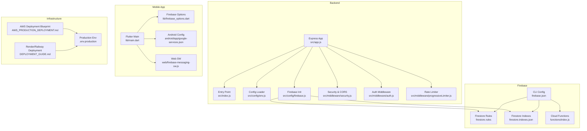
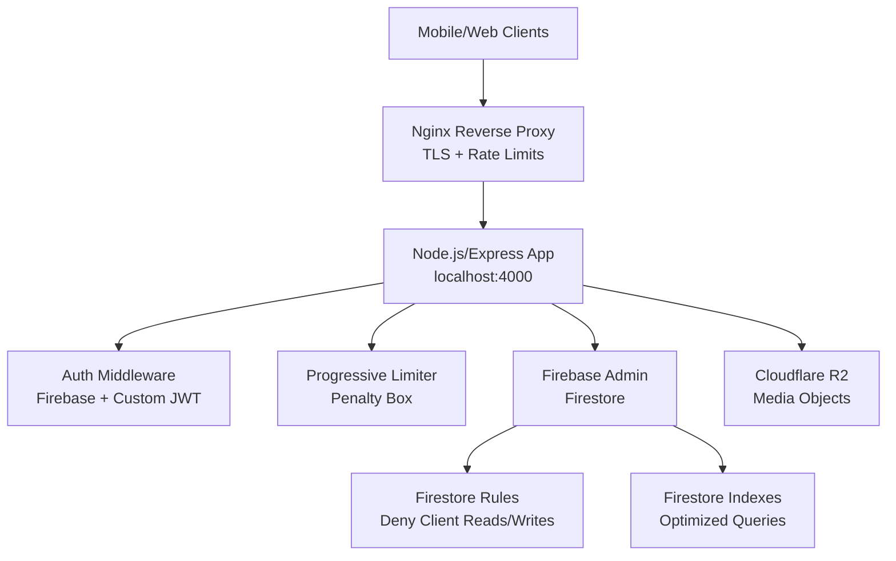
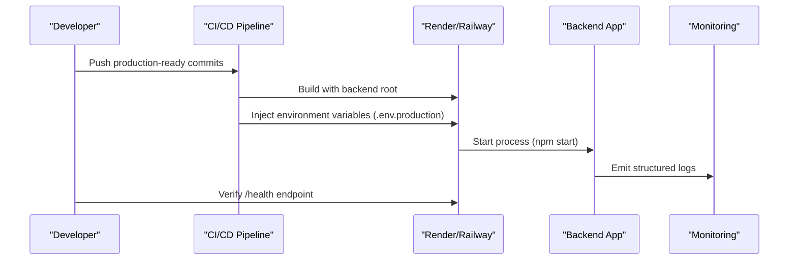
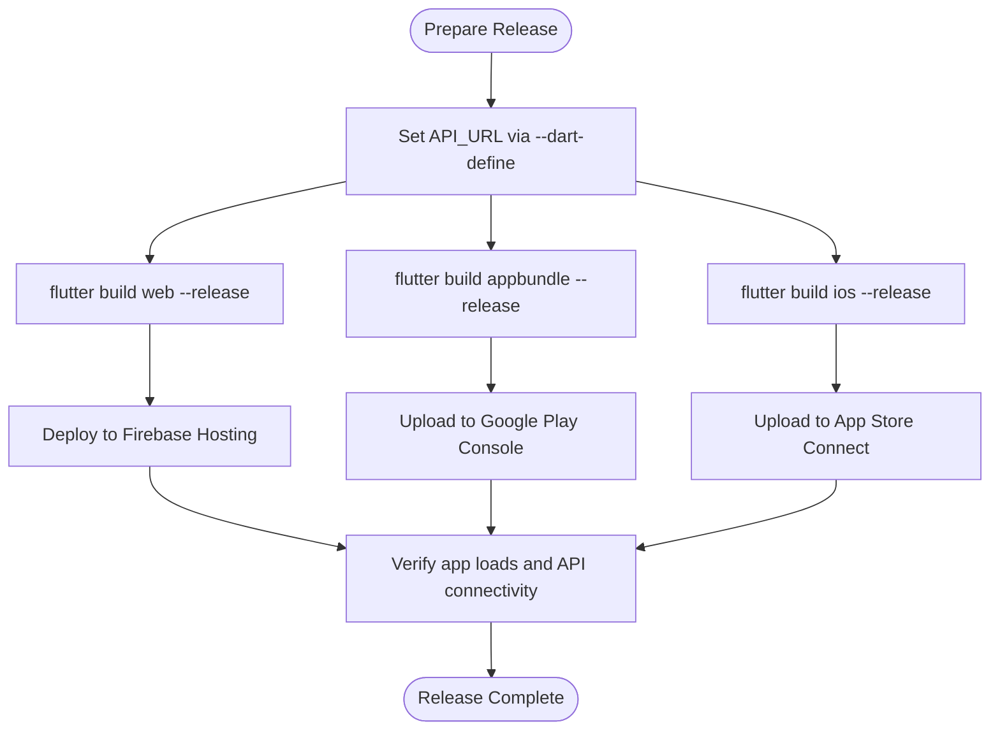
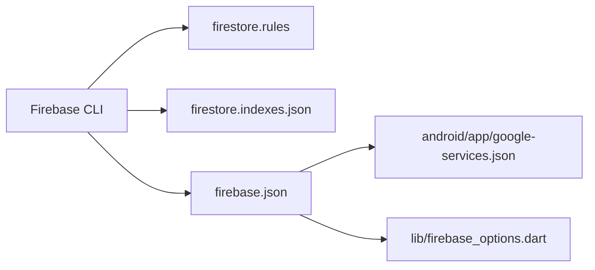
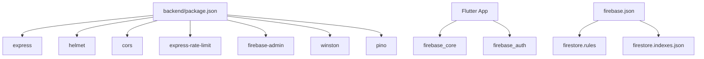
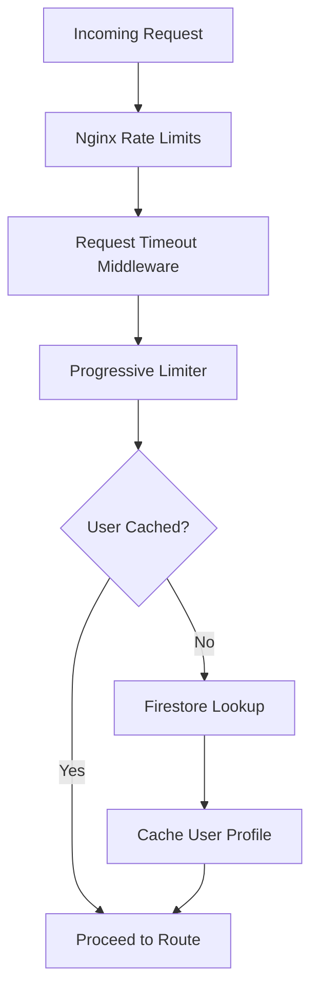

# Deployment & Operations

<cite>
**Referenced Files in This Document**
- [DEPLOYMENT_GUIDE.md](file://DEPLOYMENT_GUIDE.md)
- [PRODUCTION_READINESS_AUDIT_REPORT.md](file://PRODUCTION_READINESS_AUDIT_REPORT.md)
- [AWS_PRODUCTION_DEPLOYMENT.md](file://backend/AWS_PRODUCTION_DEPLOYMENT.md)
- [backend/.env.production](file://backend/.env.production)
- [backend/package.json](file://backend/package.json)
- [backend/src/config/env.js](file://backend/src/config/env.js)
- [backend/src/config/firebase.js](file://backend/src/config/firebase.js)
- [backend/src/app.js](file://backend/src/app.js)
- [backend/src/index.js](file://backend/src/index.js)
- [backend/src/middleware/security.js](file://backend/src/middleware/security.js)
- [backend/src/middleware/auth.js](file://backend/src/middleware/auth.js)
- [backend/src/middleware/progressiveLimiter.js](file://backend/src/middleware/progressiveLimiter.js)
- [testpro-main/firebase.json](file://testpro-main/firebase.json)
- [testpro-main/firestore.indexes.json](file://testpro-main/firestore.indexes.json)
- [testpro-main/firestore.rules](file://testpro-main/firestore.rules)
- [testpro-main/lib/main.dart](file://testpro-main/lib/main.dart)
- [testpro-main/lib/firebase_options.dart](file://testpro-main/lib/firebase_options.dart)
- [testpro-main/android/app/google-services.json](file://testpro-main/android/app/google-services.json)
- [testpro-main/web/firebase-messaging-sw.js](file://testpro-main/web/firebase-messaging-sw.js)
- [testpro-main/functions/index.js](file://testpro-main/functions/index.js)
</cite>

## Table of Contents
1. [Introduction](#introduction)
2. [Project Structure](#project-structure)
3. [Core Components](#core-components)
4. [Architecture Overview](#architecture-overview)
5. [Detailed Component Analysis](#detailed-component-analysis)
6. [Dependency Analysis](#dependency-analysis)
7. [Performance Considerations](#performance-considerations)
8. [Troubleshooting Guide](#troubleshooting-guide)
9. [Conclusion](#conclusion)
10. [Appendices](#appendices)

## Introduction
This document provides comprehensive deployment and operations guidance for the LocalMe production environment. It covers backend deployment procedures, CI/CD considerations, monitoring configuration, mobile app deployment for iOS and Android, Firebase configuration, infrastructure setup for Cloudflare R2 and domain/SSL, performance optimization, scaling, disaster recovery, operational monitoring, log analysis, and maintenance procedures. It consolidates and clarifies existing repository artifacts to ensure safe, secure, and reliable production operations.

## Project Structure
The repository comprises:
- A Node.js/Express backend with modular middleware, routing, and security layers
- A Flutter multi-platform frontend with Firebase integration
- Firebase configuration and Firestore indexes/rules
- Infrastructure and deployment blueprints for AWS and Render/Railway

**Diagram sources**
- [backend/src/app.js](file://backend/src/app.js#L1-L78)
- [backend/src/index.js](file://backend/src/index.js#L1-L37)
- [backend/src/config/env.js](file://backend/src/config/env.js#L1-L31)
- [backend/src/config/firebase.js](file://backend/src/config/firebase.js#L1-L46)
- [backend/src/middleware/security.js](file://backend/src/middleware/security.js#L1-L75)
- [backend/src/middleware/auth.js](file://backend/src/middleware/auth.js#L1-L164)
- [backend/src/middleware/progressiveLimiter.js](file://backend/src/middleware/progressiveLimiter.js#L1-L61)
- [testpro-main/lib/main.dart](file://testpro-main/lib/main.dart#L1-L63)
- [testpro-main/lib/firebase_options.dart](file://testpro-main/lib/firebase_options.dart#L1-L89)
- [testpro-main/android/app/google-services.json](file://testpro-main/android/app/google-services.json#L1-L38)
- [testpro-main/web/firebase-messaging-sw.js](file://testpro-main/web/firebase-messaging-sw.js#L1-L25)
- [testpro-main/firestore.rules](file://testpro-main/firestore.rules#L1-L11)
- [testpro-main/firestore.indexes.json](file://testpro-main/firestore.indexes.json#L1-L181)
- [testpro-main/firebase.json](file://testpro-main/firebase.json#L1-L32)
- [testpro-main/functions/index.js](file://testpro-main/functions/index.js#L1-L112)
- [AWS_PRODUCTION_DEPLOYMENT.md](file://AWS_PRODUCTION_DEPLOYMENT.md#L1-L216)
- [DEPLOYMENT_GUIDE.md](file://DEPLOYMENT_GUIDE.md#L1-L273)
- [backend/.env.production](file://backend/.env.production#L1-L21)

**Section sources**
- [DEPLOYMENT_GUIDE.md](file://DEPLOYMENT_GUIDE.md#L1-L273)
- [AWS_PRODUCTION_DEPLOYMENT.md](file://AWS_PRODUCTION_DEPLOYMENT.md#L1-L216)
- [backend/.env.production](file://backend/.env.production#L1-L21)
- [backend/package.json](file://backend/package.json#L1-L56)
- [backend/src/app.js](file://backend/src/app.js#L1-L78)
- [backend/src/index.js](file://backend/src/index.js#L1-L37)
- [backend/src/config/env.js](file://backend/src/config/env.js#L1-L31)
- [backend/src/config/firebase.js](file://backend/src/config/firebase.js#L1-L46)
- [backend/src/middleware/security.js](file://backend/src/middleware/security.js#L1-L75)
- [backend/src/middleware/auth.js](file://backend/src/middleware/auth.js#L1-L164)
- [backend/src/middleware/progressiveLimiter.js](file://backend/src/middleware/progressiveLimiter.js#L1-L61)
- [testpro-main/firebase.json](file://testpro-main/firebase.json#L1-L32)
- [testpro-main/firestore.indexes.json](file://testpro-main/firestore.indexes.json#L1-L181)
- [testpro-main/firestore.rules](file://testpro-main/firestore.rules#L1-L11)
- [testpro-main/lib/main.dart](file://testpro-main/lib/main.dart#L1-L63)
- [testpro-main/lib/firebase_options.dart](file://testpro-main/lib/firebase_options.dart#L1-L89)
- [testpro-main/android/app/google-services.json](file://testpro-main/android/app/google-services.json#L1-L38)
- [testpro-main/web/firebase-messaging-sw.js](file://testpro-main/web/firebase-messaging-sw.js#L1-L25)
- [testpro-main/functions/index.js](file://testpro-main/functions/index.js#L1-L112)

## Core Components
- Backend Express server with layered middleware for security, logging, rate limiting, and authentication
- Firebase Admin initialization and Firestore security rules enforcing backend-only access
- Flutter app initializing Firebase with platform-specific options and Android/Apple configurations
- Cloudflare R2 integration via environment variables for media storage
- AWS deployment blueprint for hardened reverse proxy, rate limiting, and process containment
- Render/Railway deployment guidance for containerized Node.js services

**Section sources**
- [backend/src/app.js](file://backend/src/app.js#L1-L78)
- [backend/src/config/env.js](file://backend/src/config/env.js#L1-L31)
- [backend/src/config/firebase.js](file://backend/src/config/firebase.js#L1-L46)
- [backend/src/middleware/security.js](file://backend/src/middleware/security.js#L1-L75)
- [backend/src/middleware/auth.js](file://backend/src/middleware/auth.js#L1-L164)
- [backend/src/middleware/progressiveLimiter.js](file://backend/src/middleware/progressiveLimiter.js#L1-L61)
- [testpro-main/lib/main.dart](file://testpro-main/lib/main.dart#L1-L63)
- [testpro-main/lib/firebase_options.dart](file://testpro-main/lib/firebase_options.dart#L1-L89)
- [testpro-main/android/app/google-services.json](file://testpro-main/android/app/google-services.json#L1-L38)
- [AWS_PRODUCTION_DEPLOYMENT.md](file://AWS_PRODUCTION_DEPLOYMENT.md#L1-L216)
- [DEPLOYMENT_GUIDE.md](file://DEPLOYMENT_GUIDE.md#L184-L211)

## Architecture Overview
The production architecture separates concerns across:
- Reverse proxy and TLS termination (Nginx) with rate limiting and payload caps
- Application server (Node.js/Express) bound to localhost and managed by PM2
- Authentication via Firebase ID tokens with optional custom JWT fallback and in-memory user caching
- Rate limiting with progressive penalties and centralized penalty box
- Storage via Cloudflare R2 using environment-driven configuration
- Mobile clients using Firebase SDKs with platform-specific configurations
- Firestore guarded by restrictive rules and optimized indexes

**Diagram sources**
- [AWS_PRODUCTION_DEPLOYMENT.md](file://AWS_PRODUCTION_DEPLOYMENT.md#L55-L147)
- [backend/src/app.js](file://backend/src/app.js#L1-L78)
- [backend/src/middleware/auth.js](file://backend/src/middleware/auth.js#L1-L164)
- [backend/src/middleware/progressiveLimiter.js](file://backend/src/middleware/progressiveLimiter.js#L1-L61)
- [backend/src/config/firebase.js](file://backend/src/config/firebase.js#L1-L46)
- [testpro-main/firestore.rules](file://testpro-main/firestore.rules#L1-L11)
- [testpro-main/firestore.indexes.json](file://testpro-main/firestore.indexes.json#L1-L181)

## Detailed Component Analysis

### Backend Deployment Procedures
- Environment configuration
  - Use .env.production for production variables including Firebase credentials, R2 keys, CORS origins, and logging level
  - Ensure sensitive keys are rotated and not committed to history
- CI/CD pipeline setup
  - Build and deploy backend to Render/Railway with root directory set to backend
  - Provide environment variables from .env.production during build/start
- Monitoring configuration
  - Use Winston/pino for structured logging
  - Expose /health endpoint with progressive limiter for uptime checks
  - Integrate with external monitoring (e.g., Sentry) via existing dependencies

**Diagram sources**
- [DEPLOYMENT_GUIDE.md](file://DEPLOYMENT_GUIDE.md#L184-L211)
- [backend/.env.production](file://backend/.env.production#L1-L21)
- [backend/package.json](file://backend/package.json#L10-L14)

**Section sources**
- [DEPLOYMENT_GUIDE.md](file://DEPLOYMENT_GUIDE.md#L138-L180)
- [DEPLOYMENT_GUIDE.md](file://DEPLOYMENT_GUIDE.md#L184-L211)
- [backend/.env.production](file://backend/.env.production#L1-L21)
- [backend/package.json](file://backend/package.json#L10-L14)

### Mobile App Deployment (iOS App Store and Google Play Store)
- Build configuration
  - Flutter app supports web, Android, and iOS platforms
  - Use --dart-define=API_URL for production builds
- Release management
  - Android: build APK or App Bundle and upload to Google Play Console
  - iOS: archive and upload via Xcode Organizer/App Store Connect
- Update distribution
  - Use Firebase App Distribution or platform-native stores for controlled rollout
  - Ensure API_URL points to production backend

**Diagram sources**
- [DEPLOYMENT_GUIDE.md](file://DEPLOYMENT_GUIDE.md#L214-L237)
- [testpro-main/lib/main.dart](file://testpro-main/lib/main.dart#L1-L63)

**Section sources**
- [DEPLOYMENT_GUIDE.md](file://DEPLOYMENT_GUIDE.md#L214-L237)
- [testpro-main/lib/main.dart](file://testpro-main/lib/main.dart#L1-L63)

### Firebase Configuration
- Project setup
  - Configure platforms in firebase.json with project IDs and output paths
  - Generate platform-specific config files (google-services.json for Android, firebase_options.dart for Flutter)
- Security rules deployment
  - Firestore rules deny client-side reads/writes; all access must go through backend
- Firestore indexing
  - Indexes defined for comments, posts, notifications, user interests, and visibility filters

**Diagram sources**
- [testpro-main/firebase.json](file://testpro-main/firebase.json#L1-L32)
- [testpro-main/firestore.rules](file://testpro-main/firestore.rules#L1-L11)
- [testpro-main/firestore.indexes.json](file://testpro-main/firestore.indexes.json#L1-L181)
- [testpro-main/lib/firebase_options.dart](file://testpro-main/lib/firebase_options.dart#L1-L89)
- [testpro-main/android/app/google-services.json](file://testpro-main/android/app/google-services.json#L1-L38)

**Section sources**
- [testpro-main/firebase.json](file://testpro-main/firebase.json#L1-L32)
- [testpro-main/firestore.rules](file://testpro-main/firestore.rules#L1-L11)
- [testpro-main/firestore.indexes.json](file://testpro-main/firestore.indexes.json#L1-L181)
- [testpro-main/lib/firebase_options.dart](file://testpro-main/lib/firebase_options.dart#L1-L89)
- [testpro-main/android/app/google-services.json](file://testpro-main/android/app/google-services.json#L1-L38)

### Infrastructure Setup (Cloudflare R2, Domain, SSL)
- Cloudflare R2 storage
  - Configure R2_ACCOUNT_ID, R2_ACCESS_KEY_ID, R2_SECRET_ACCESS_KEY, R2_BUCKET_NAME, R2_PUBLIC_BASE_URL in environment
  - Ensure API tokens are scoped to the bucket and rotated regularly
- Domain configuration
  - Point DNS to CDN/proxy provider and configure SSL certificates
- SSL certificate management
  - Use automated ACME providers or Cloudflare SSL/TLS termination as appropriate

**Section sources**
- [backend/.env.production](file://backend/.env.production#L9-L14)
- [DEPLOYMENT_GUIDE.md](file://DEPLOYMENT_GUIDE.md#L48-L87)

### Security and Operational Controls
- CORS configuration
  - Set CORS_ALLOWED_ORIGINS to specific production domains in production
- Proxy endpoint hardening
  - Enforce strict URL validation and rate limiting for /api/proxy
- OTP functions
  - Implement missing OTP functions or remove exports to prevent deployment failures
- Logging and monitoring
  - Use Winston/pino for structured logs; integrate with external monitoring and error tracking

**Section sources**
- [backend/src/middleware/security.js](file://backend/src/middleware/security.js#L16-L46)
- [PRODUCTION_READINESS_AUDIT_REPORT.md](file://PRODUCTION_READINESS_AUDIT_REPORT.md#L169-L197)
- [PRODUCTION_READINESS_AUDIT_REPORT.md](file://PRODUCTION_READINESS_AUDIT_REPORT.md#L142-L166)
- [testpro-main/functions/index.js](file://testpro-main/functions/index.js#L7-L9)

## Dependency Analysis
The backend depends on Express, Helmet, CORS, rate limiting, sanitization, and Firebase Admin. The Flutter app depends on Firebase SDKs and platform configs. Firebase CLI coordinates Firestore rules and indexes.

**Diagram sources**
- [backend/package.json](file://backend/package.json#L24-L55)
- [testpro-main/firebase.json](file://testpro-main/firebase.json#L1-L32)

**Section sources**
- [backend/package.json](file://backend/package.json#L24-L55)
- [testpro-main/firebase.json](file://testpro-main/firebase.json#L1-L32)

## Performance Considerations
- Reverse proxy tuning
  - Nginx payload caps, timeouts, and rate limiting zones protect the backend
- Application-level controls
  - Progressive rate limiter with penalty box and user/IP-based quotas
  - Request timeout middleware with exceptions for slow routes
  - In-memory user cache to reduce Firestore queries
- Media processing
  - Video processing with temp file cleanup; monitor disk usage and schedule cleanup jobs

**Diagram sources**
- [AWS_PRODUCTION_DEPLOYMENT.md](file://AWS_PRODUCTION_DEPLOYMENT.md#L55-L147)
- [backend/src/middleware/progressiveLimiter.js](file://backend/src/middleware/progressiveLimiter.js#L1-L61)
- [backend/src/middleware/security.js](file://backend/src/middleware/security.js#L48-L75)
- [backend/src/middleware/auth.js](file://backend/src/middleware/auth.js#L6-L12)

**Section sources**
- [AWS_PRODUCTION_DEPLOYMENT.md](file://AWS_PRODUCTION_DEPLOYMENT.md#L55-L147)
- [backend/src/middleware/progressiveLimiter.js](file://backend/src/middleware/progressiveLimiter.js#L1-L61)
- [backend/src/middleware/security.js](file://backend/src/middleware/security.js#L48-L75)
- [backend/src/middleware/auth.js](file://backend/src/middleware/auth.js#L6-L12)

## Troubleshooting Guide
- Post-deployment verification
  - Health check endpoint and security headers inspection
  - Functional smoke tests for uploads and authentication
- Credential rotation and history cleanup
  - Rotate Firebase and R2 credentials and remove from Git history
- OTP and Cloud Functions
  - Implement missing OTP functions or adjust backend-only OTP flow
- CORS and localhost defaults
  - Ensure production CORS origins are set and API_URL is defined for builds

**Section sources**
- [DEPLOYMENT_GUIDE.md](file://DEPLOYMENT_GUIDE.md#L240-L259)
- [PRODUCTION_READINESS_AUDIT_REPORT.md](file://PRODUCTION_READINESS_AUDIT_REPORT.md#L22-L51)
- [PRODUCTION_READINESS_AUDIT_REPORT.md](file://PRODUCTION_READINESS_AUDIT_REPORT.md#L142-L166)
- [PRODUCTION_READINESS_AUDIT_REPORT.md](file://PRODUCTION_READINESS_AUDIT_REPORT.md#L88-L110)

## Conclusion
This guide consolidates repository-provided deployment and operations materials into a practical, production-focused playbook. By following the outlined procedures—credential rotation, environment hardening, CORS scoping, proxy hardening, OTP implementation, reverse proxy tuning, and structured logging—you can achieve a secure, scalable, and observable LocalMe production environment.

## Appendices

### Appendix A: Backend Environment Variables
- Required for production:
  - FIREBASE_PROJECT_ID, FIREBASE_PRIVATE_KEY, FIREBASE_CLIENT_EMAIL
  - R2_ACCOUNT_ID, R2_ACCESS_KEY_ID, R2_SECRET_ACCESS_KEY, R2_BUCKET_NAME, R2_PUBLIC_BASE_URL
  - CORS_ALLOWED_ORIGINS
  - LOG_LEVEL

**Section sources**
- [backend/.env.production](file://backend/.env.production#L1-L21)
- [backend/src/config/env.js](file://backend/src/config/env.js#L6-L22)

### Appendix B: AWS Production Deployment Checklist
- Security groups: restrict inbound to SSH, HTTP redirect, HTTPS
- OS hardening: UFW, unattended upgrades
- Nginx: TLS termination, rate limits, payload caps
- Node/PM2: bind to localhost, memory bounds
- Fail2Ban: jail for rate-limit 429s

**Section sources**
- [AWS_PRODUCTION_DEPLOYMENT.md](file://AWS_PRODUCTION_DEPLOYMENT.md#L5-L216)

### Appendix C: Render/Railway Deployment Checklist
- Root directory: backend
- Build command: npm install
- Start command: npm start
- Environment variables: all from .env.production

**Section sources**
- [DEPLOYMENT_GUIDE.md](file://DEPLOYMENT_GUIDE.md#L184-L211)