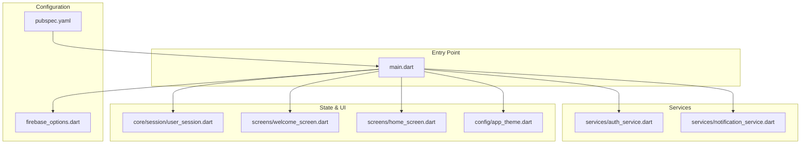
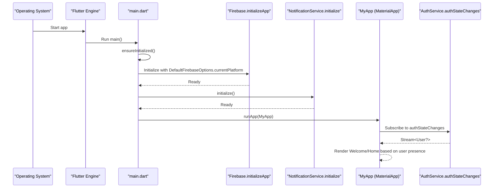
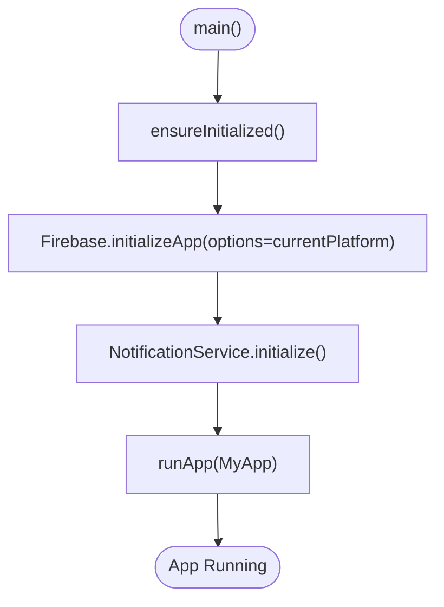
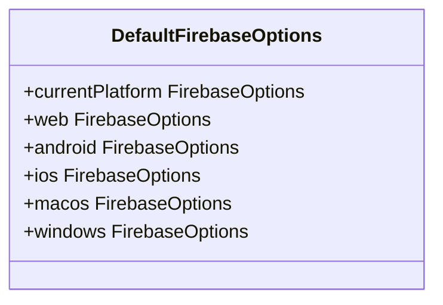
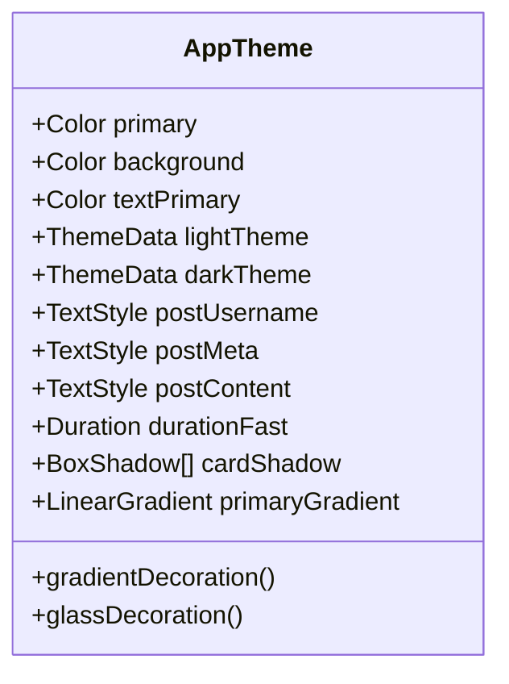
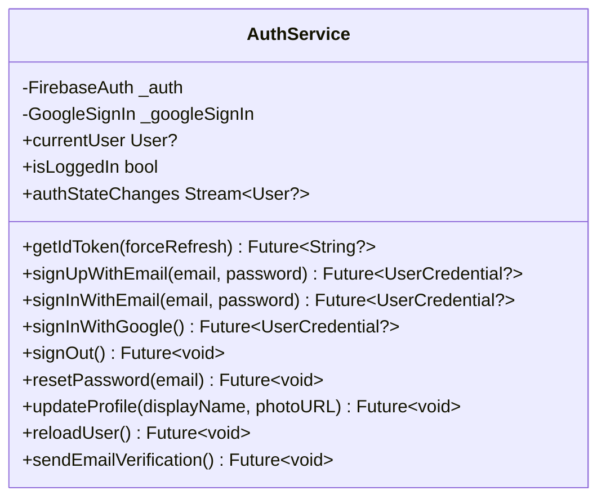
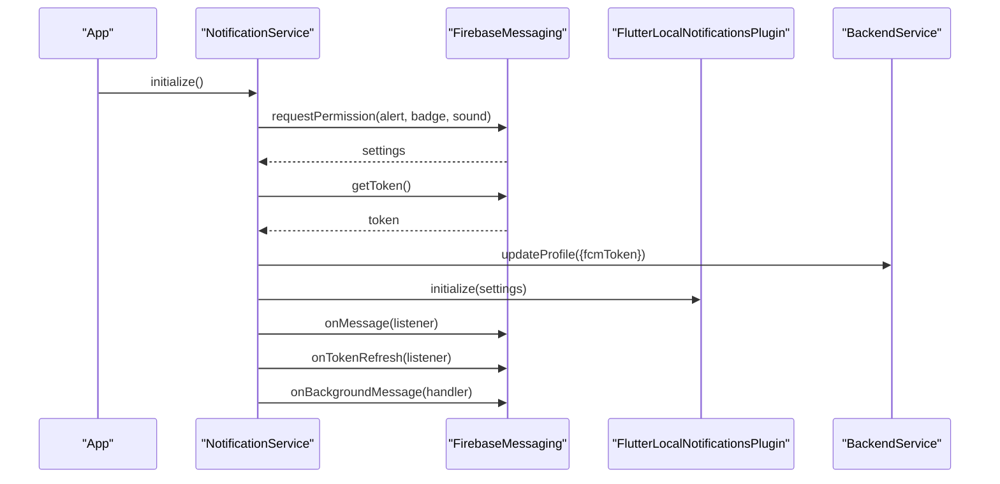
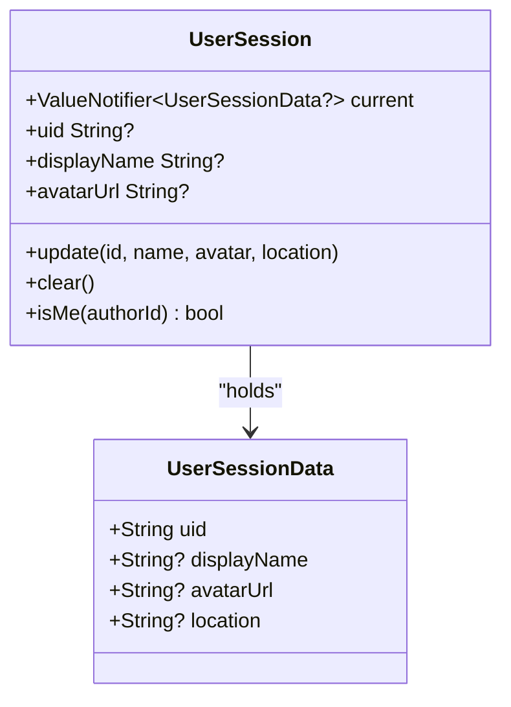
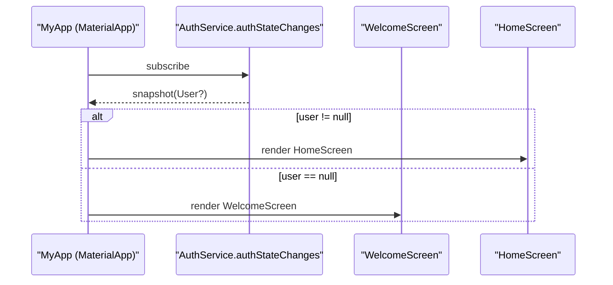
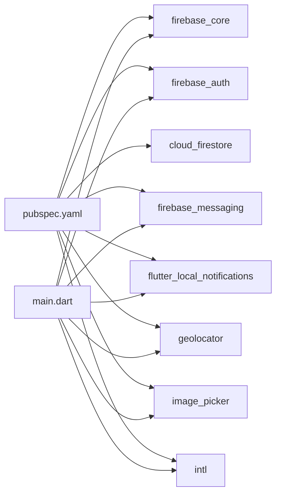

# Application Structure

<cite>
**Referenced Files in This Document**
- [main.dart](file://testpro-main/lib/main.dart)
- [firebase_options.dart](file://testpro-main/lib/firebase_options.dart)
- [app_theme.dart](file://testpro-main/lib/config/app_theme.dart)
- [auth_service.dart](file://testpro-main/lib/services/auth_service.dart)
- [notification_service.dart](file://testpro-main/lib/services/notification_service.dart)
- [user_session.dart](file://testpro-main/lib/core/session/user_session.dart)
- [welcome_screen.dart](file://testpro-main/lib/screens/welcome_screen.dart)
- [home_screen.dart](file://testpro-main/lib/screens/home_screen.dart)
- [pubspec.yaml](file://testpro-main/pubspec.yaml)
- [google-services.json](file://testpro-main/android/app/google-services.json)
- [firebase-messaging-sw.js](file://testpro-main/web/firebase-messaging-sw.js)
</cite>

## Table of Contents
1. [Introduction](#introduction)
2. [Project Structure](#project-structure)
3. [Core Components](#core-components)
4. [Architecture Overview](#architecture-overview)
5. [Detailed Component Analysis](#detailed-component-analysis)
6. [Dependency Analysis](#dependency-analysis)
7. [Performance Considerations](#performance-considerations)
8. [Troubleshooting Guide](#troubleshooting-guide)
9. [Conclusion](#conclusion)
10. [Appendices](#appendices)

## Introduction
This document explains the Flutter application’s structure and initialization, focusing on the main entry point, Firebase configuration and initialization, theming, and the overall runtime behavior. It also covers service initialization order, lifecycle management via a reactive session model, and cross-platform considerations for iOS, Android, macOS, Windows, and Web deployments.

## Project Structure
The application follows a feature-based structure under lib/, with clear separation of concerns:
- Entry point and app bootstrap in main.dart
- Firebase configuration via firebase_options.dart
- Theming in config/app_theme.dart
- Authentication and notifications in services/
- Reactive session state in core/session/user_session.dart
- Screens in screens/ (Welcome and Home)
- Dependencies declared in pubspec.yaml
- Platform-specific Firebase configs in android/ and web/

**Diagram sources**
- [main.dart](file://testpro-main/lib/main.dart#L1-L63)
- [firebase_options.dart](file://testpro-main/lib/firebase_options.dart#L1-L89)
- [app_theme.dart](file://testpro-main/lib/config/app_theme.dart#L1-L314)
- [auth_service.dart](file://testpro-main/lib/services/auth_service.dart#L1-L162)
- [notification_service.dart](file://testpro-main/lib/services/notification_service.dart#L1-L94)
- [user_session.dart](file://testpro-main/lib/core/session/user_session.dart#L1-L50)
- [welcome_screen.dart](file://testpro-main/lib/screens/welcome_screen.dart#L1-L1482)
- [home_screen.dart](file://testpro-main/lib/screens/home_screen.dart#L1-L403)
- [pubspec.yaml](file://testpro-main/pubspec.yaml#L1-L61)

**Section sources**
- [main.dart](file://testpro-main/lib/main.dart#L1-L63)
- [pubspec.yaml](file://testpro-main/pubspec.yaml#L1-L61)

## Core Components
- Entry point and initialization sequence:
  - Ensures Flutter binding is initialized
  - Initializes Firebase with platform-specific options
  - Initializes notifications
  - Runs the app tree
- Firebase configuration:
  - Platform detection and option selection
  - Web, Android, iOS/macOS, and Windows configurations
- Theming:
  - Material 3 light/dark themes with brand colors, typography, spacing, and component presets
- Authentication:
  - Streams auth state, Google sign-in support (web/mobile differences), and user actions
- Notifications:
  - Permission request, token retrieval/sync, local notification setup, foreground/background handlers
- Session state:
  - Reactive ValueNotifier-based session cache for user identity and metadata

**Section sources**
- [main.dart](file://testpro-main/lib/main.dart#L12-L22)
- [firebase_options.dart](file://testpro-main/lib/firebase_options.dart#L17-L41)
- [app_theme.dart](file://testpro-main/lib/config/app_theme.dart#L8-L314)
- [auth_service.dart](file://testpro-main/lib/services/auth_service.dart#L5-L162)
- [notification_service.dart](file://testpro-main/lib/services/notification_service.dart#L13-L94)
- [user_session.dart](file://testpro-main/lib/core/session/user_session.dart#L12-L50)

## Architecture Overview
The app initializes services before rendering the UI. The root widget configures Material 3 theming, sets the home screen based on auth state, and wires navigation between Welcome and Home screens. Services are injected at the module level via imports and static singletons.

**Diagram sources**
- [main.dart](file://testpro-main/lib/main.dart#L12-L22)
- [firebase_options.dart](file://testpro-main/lib/firebase_options.dart#L17-L41)
- [notification_service.dart](file://testpro-main/lib/services/notification_service.dart#L17-L57)
- [auth_service.dart](file://testpro-main/lib/services/auth_service.dart#L22-L23)

## Detailed Component Analysis

### Entry Point and Initialization Order
- Ensures Flutter binding is ready
- Initializes Firebase with platform-specific options
- Initializes notifications
- Runs the app tree

**Diagram sources**
- [main.dart](file://testpro-main/lib/main.dart#L12-L22)

**Section sources**
- [main.dart](file://testpro-main/lib/main.dart#L12-L22)

### Firebase Configuration Options
- Platform detection:
  - Web: returns web options
  - Android/iOS/macOS: returns platform-specific options
  - Windows: returns Windows options
  - Linux: unsupported
- Options include API keys, app IDs, messaging sender IDs, project IDs, auth domains, storage buckets, and measurement IDs
- Android configuration file present for Gradle integration

**Diagram sources**
- [firebase_options.dart](file://testpro-main/lib/firebase_options.dart#L17-L89)

**Section sources**
- [firebase_options.dart](file://testpro-main/lib/firebase_options.dart#L17-L89)
- [google-services.json](file://testpro-main/android/app/google-services.json#L1-L38)

### Theme System Setup
- Material 3 enabled with light and dark themes
- Brand colors, neutral palette, semantic colors
- Typography presets, spacing, radii, durations, shadows
- Component themes: AppBar, BottomNavigationBar, TextTheme, CardTheme, DividerTheme, ChipTheme, InputDecorationTheme, Button themes, FloatingActionButtonTheme
- AppTheme exposes helpers for gradients and glassmorphism

**Diagram sources**
- [app_theme.dart](file://testpro-main/lib/config/app_theme.dart#L8-L314)

**Section sources**
- [app_theme.dart](file://testpro-main/lib/config/app_theme.dart#L132-L294)

### Authentication Service
- Exposes streams for auth state changes
- Supports email/password and Google sign-in
- Handles web-specific Google sign-in flow differences
- Provides user actions: sign out, reset password, update profile, reload user, send email verification
- Uses GoogleSignIn and FirebaseAuth

**Diagram sources**
- [auth_service.dart](file://testpro-main/lib/services/auth_service.dart#L5-L162)

**Section sources**
- [auth_service.dart](file://testpro-main/lib/services/auth_service.dart#L5-L162)

### Notification Service
- Requests notification permission
- Retrieves and syncs FCM token to backend
- Initializes local notifications for Android/iOS
- Subscribes to foreground messages and token refresh
- Registers a background handler for FCM messages
- Web service worker present for background notifications

**Diagram sources**
- [notification_service.dart](file://testpro-main/lib/services/notification_service.dart#L17-L57)
- [firebase-messaging-sw.js](file://testpro-main/web/firebase-messaging-sw.js#L1-L25)

**Section sources**
- [notification_service.dart](file://testpro-main/lib/services/notification_service.dart#L13-L94)
- [firebase-messaging-sw.js](file://testpro-main/web/firebase-messaging-sw.js#L1-L25)

### Session Management
- Reactive session cache using ValueNotifier
- Supports updating with user metadata and clearing on sign-out
- Provides a simple isMe() check against author IDs

**Diagram sources**
- [user_session.dart](file://testpro-main/lib/core/session/user_session.dart#L3-L50)

**Section sources**
- [user_session.dart](file://testpro-main/lib/core/session/user_session.dart#L12-L50)

### Routing and Navigation Flow
- Root widget uses a StreamBuilder over auth state to decide between WelcomeScreen and HomeScreen
- WelcomeScreen handles login/sign-up flows and navigates to HomeScreen after successful auth
- HomeScreen manages bottom navigation, feed toggles, and location detection

**Diagram sources**
- [main.dart](file://testpro-main/lib/main.dart#L39-L59)
- [auth_service.dart](file://testpro-main/lib/services/auth_service.dart#L22-L23)

**Section sources**
- [main.dart](file://testpro-main/lib/main.dart#L24-L62)
- [welcome_screen.dart](file://testpro-main/lib/screens/welcome_screen.dart#L12-L30)
- [home_screen.dart](file://testpro-main/lib/screens/home_screen.dart#L18-L44)

### Cross-Platform Deployment Notes
- Platform-specific Firebase options:
  - Web, Android, iOS/macOS, Windows are supported
  - Linux is explicitly unsupported in defaults
- Android integration includes google-services.json for Gradle
- Web includes a service worker for background FCM messages
- Pub-declared dependencies include firebase_core, firebase_auth, cloud_firestore, firebase_messaging, flutter_local_notifications, and others

**Section sources**
- [firebase_options.dart](file://testpro-main/lib/firebase_options.dart#L17-L89)
- [google-services.json](file://testpro-main/android/app/google-services.json#L1-L38)
- [firebase-messaging-sw.js](file://testpro-main/web/firebase-messaging-sw.js#L1-L25)
- [pubspec.yaml](file://testpro-main/pubspec.yaml#L25-L36)

## Dependency Analysis
The app relies on a small set of core dependencies declared in pubspec.yaml, including Firebase SDKs, geolocation, image handling, and internationalization. The entry point imports and initializes Firebase and notification services before building the UI.

**Diagram sources**
- [pubspec.yaml](file://testpro-main/pubspec.yaml#L10-L45)
- [main.dart](file://testpro-main/lib/main.dart#L1-L11)

**Section sources**
- [pubspec.yaml](file://testpro-main/pubspec.yaml#L10-L45)
- [main.dart](file://testpro-main/lib/main.dart#L1-L11)

## Performance Considerations
- Initialization order:
  - Ensure Firebase and notifications are initialized before rendering the app tree to avoid race conditions
- Auth state stream:
  - StreamBuilder rebuilds only when auth state changes; keep rebuild scope minimal
- Notifications:
  - Request permission early and persist token to backend to enable reliable push delivery
- Theming:
  - Material 3 reduces custom theming overhead; avoid frequent theme switches
- Animations:
  - WelcomeScreen uses many AnimationControllers; dispose them in initState/dispose to prevent leaks

[No sources needed since this section provides general guidance]

## Troubleshooting Guide
- Firebase initialization failures:
  - Verify DefaultFirebaseOptions.currentPlatform resolves to the correct platform
  - Confirm platform-specific configuration files are present (e.g., google-services.json for Android)
- Notification permission denied:
  - Re-check permission request flow and ensure token retrieval occurs after authorization
- Auth state not updating:
  - Ensure StreamBuilder subscribes to AuthService.authStateChanges and that user session is updated/cleared appropriately
- Session not persisting:
  - Confirm UserSession.update is called on successful auth and UserSession.clear on sign out

**Section sources**
- [firebase_options.dart](file://testpro-main/lib/firebase_options.dart#L17-L41)
- [notification_service.dart](file://testpro-main/lib/services/notification_service.dart#L17-L57)
- [auth_service.dart](file://testpro-main/lib/services/auth_service.dart#L22-L23)
- [user_session.dart](file://testpro-main/lib/core/session/user_session.dart#L20-L43)

## Conclusion
The application follows a clean initialization pattern: ensure Flutter binding, initialize Firebase and notifications, then render the app. The theme system centralizes design tokens, while services encapsulate auth and notifications. The session model provides reactive state for user identity. Cross-platform support is handled via platform-specific Firebase options and platform-specific configs.

[No sources needed since this section summarizes without analyzing specific files]

## Appendices

### Initialization Sequence for Optimal Startup
- EnsureInitialized -> Firebase.initializeApp(currentPlatform) -> NotificationService.initialize() -> runApp(MyApp)

**Section sources**
- [main.dart](file://testpro-main/lib/main.dart#L12-L22)
- [firebase_options.dart](file://testpro-main/lib/firebase_options.dart#L17-L41)
- [notification_service.dart](file://testpro-main/lib/services/notification_service.dart#L17-L57)