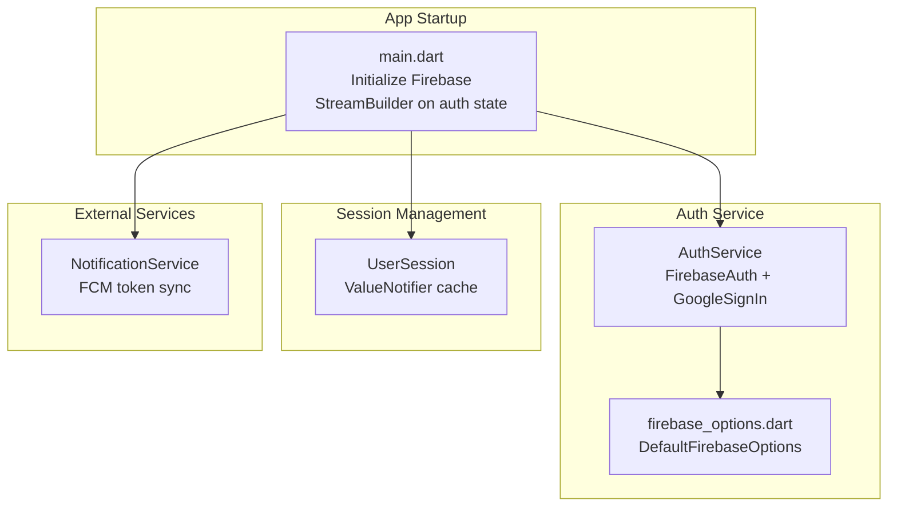
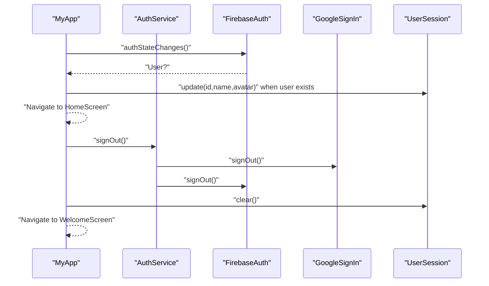
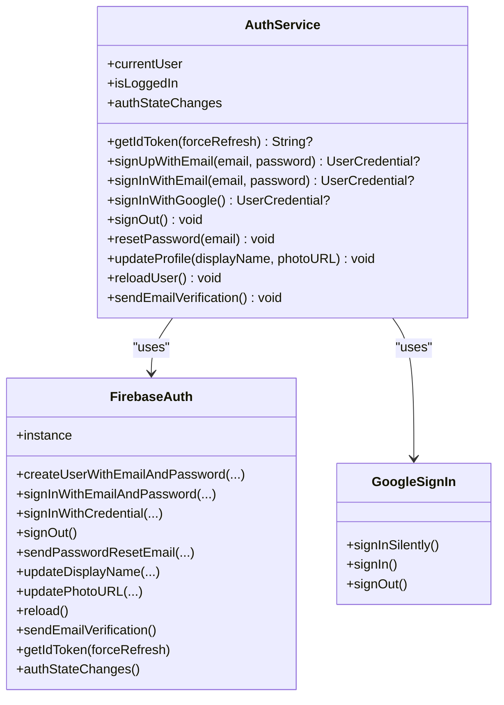
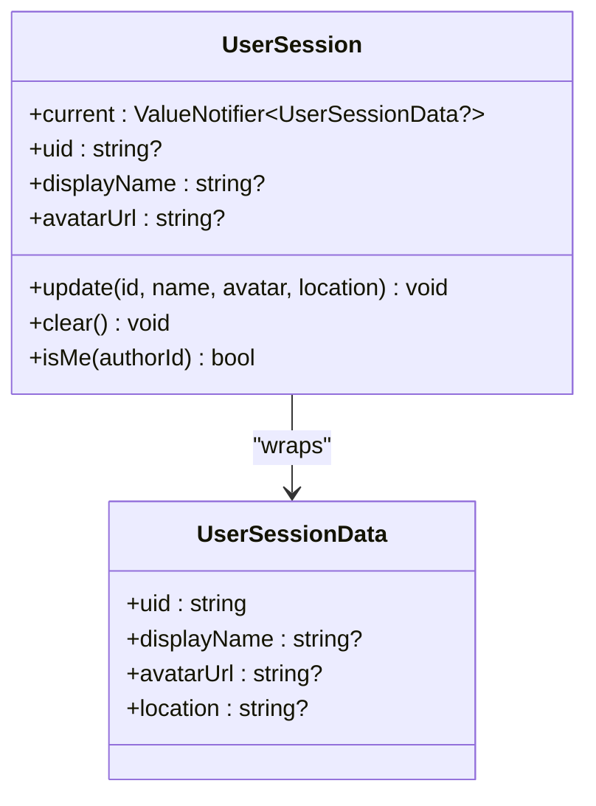
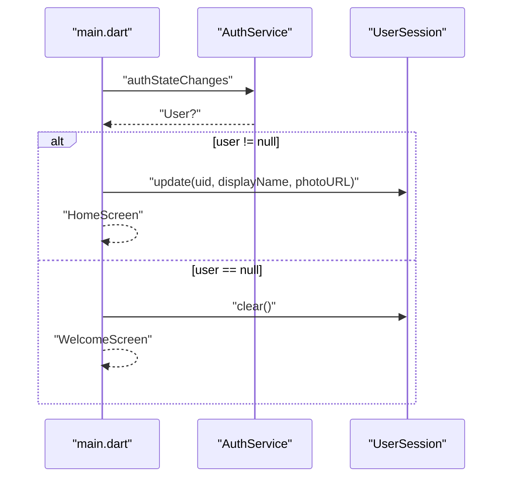
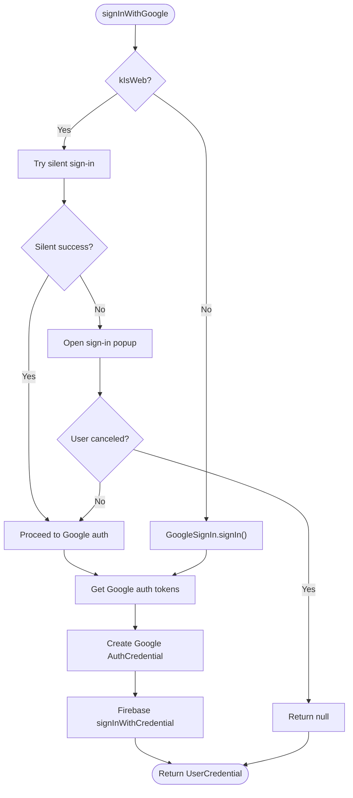
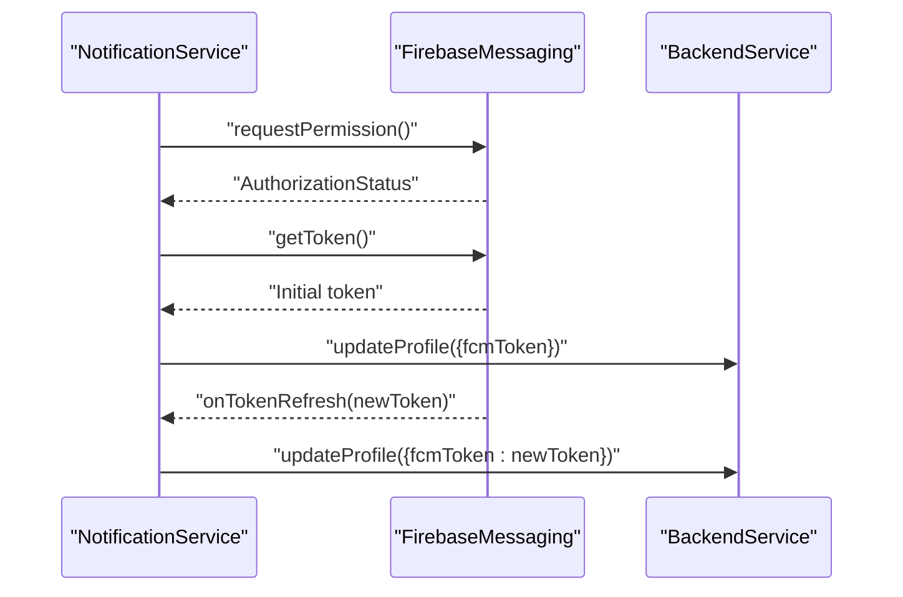
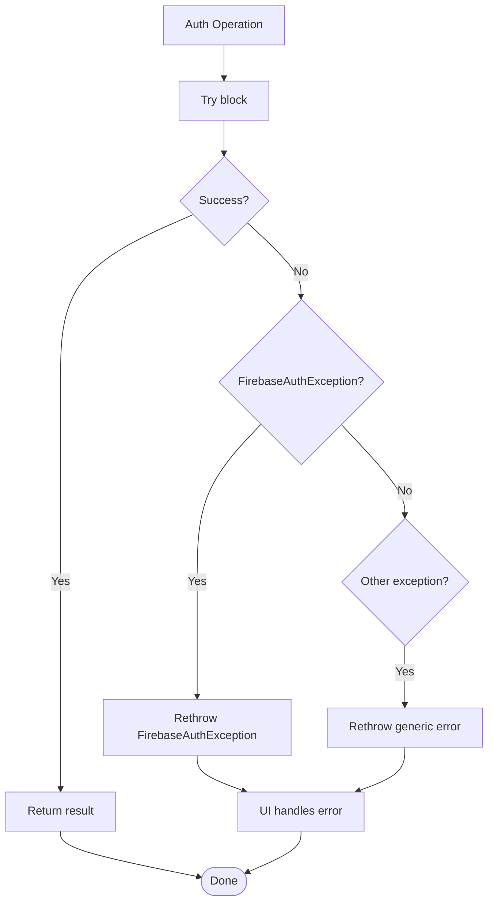
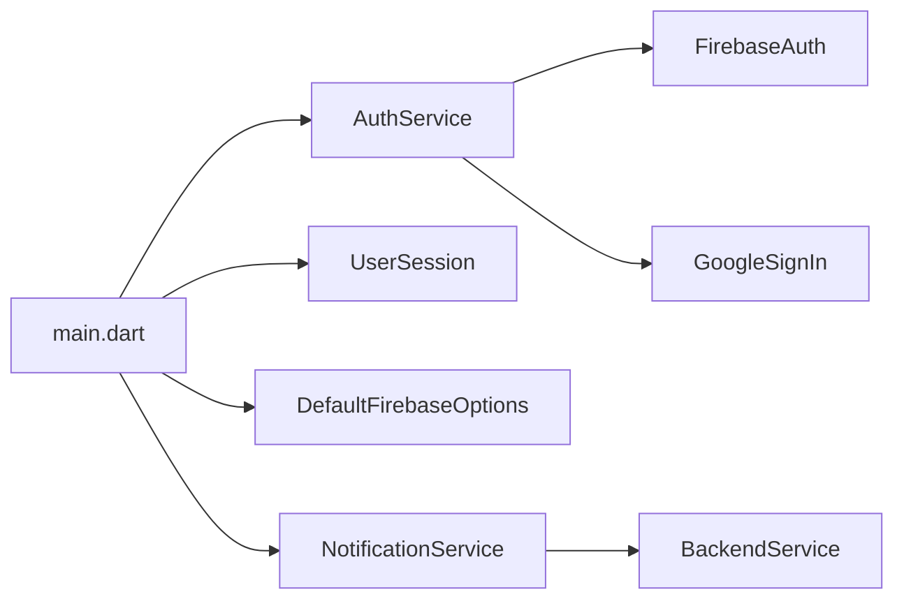

# Auth Service Layer

<cite>
**Referenced Files in This Document**
- [auth_service.dart](file://testpro-main/lib/services/auth_service.dart)
- [main.dart](file://testpro-main/lib/main.dart)
- [user_session.dart](file://testpro-main/lib/core/session/user_session.dart)
- [firebase_options.dart](file://testpro-main/lib/firebase_options.dart)
- [notification_service.dart](file://testpro-main/lib/services/notification_service.dart)
</cite>

## Table of Contents
1. [Introduction](#introduction)
2. [Project Structure](#project-structure)
3. [Core Components](#core-components)
4. [Architecture Overview](#architecture-overview)
5. [Detailed Component Analysis](#detailed-component-analysis)
6. [Dependency Analysis](#dependency-analysis)
7. [Performance Considerations](#performance-considerations)
8. [Troubleshooting Guide](#troubleshooting-guide)
9. [Conclusion](#conclusion)
10. [Appendices](#appendices)

## Introduction
This document describes the authentication service architecture and the AuthService implementation used in the Flutter application. It explains how authentication is orchestrated, how Firebase Authentication integrates with the app, and how user sessions are persisted and synchronized. It also covers login and logout flows, token management, error handling patterns, and session restoration on app restart. Security considerations, token refresh mechanisms, and offline authentication support are addressed.

## Project Structure
The authentication layer centers around a single service class that wraps Firebase Authentication and Google Sign-In, and a session manager that maintains local user state. The app initializes Firebase at startup and subscribes to authentication state changes to drive navigation and session updates.

**Diagram sources**
- [main.dart](file://testpro-main/lib/main.dart#L12-L22)
- [auth_service.dart](file://testpro-main/lib/services/auth_service.dart#L5-L10)
- [firebase_options.dart](file://testpro-main/lib/firebase_options.dart#L17-L41)
- [user_session.dart](file://testpro-main/lib/core/session/user_session.dart#L12-L13)
- [notification_service.dart](file://testpro-main/lib/services/notification_service.dart#L17-L33)

**Section sources**
- [main.dart](file://testpro-main/lib/main.dart#L12-L22)
- [auth_service.dart](file://testpro-main/lib/services/auth_service.dart#L5-L10)
- [firebase_options.dart](file://testpro-main/lib/firebase_options.dart#L17-L41)
- [user_session.dart](file://testpro-main/lib/core/session/user_session.dart#L12-L13)
- [notification_service.dart](file://testpro-main/lib/services/notification_service.dart#L17-L33)

## Core Components
- AuthService: Provides static methods for authentication operations backed by Firebase Authentication and Google Sign-In. It exposes streams for auth state changes, token retrieval, and supports sign-up, sign-in, Google sign-in, sign-out, password reset, profile updates, and email verification.
- UserSession: A lightweight session cache using a ValueNotifier to store the current user’s identity and profile metadata. It supports updating after login/signup/profile changes and clearing on sign-out.
- Firebase initialization: The app initializes Firebase at startup and selects platform-specific options via DefaultFirebaseOptions.
- NotificationService: Handles FCM token lifecycle and background message handling, including token refresh callbacks.

Key responsibilities:
- Authentication orchestration and error propagation
- Session caching and synchronization with auth state
- Token retrieval and optional refresh
- Cross-platform Google Sign-In handling (web vs. mobile)
- Integration with Firebase configuration

**Section sources**
- [auth_service.dart](file://testpro-main/lib/services/auth_service.dart#L5-L161)
- [user_session.dart](file://testpro-main/lib/core/session/user_session.dart#L12-L49)
- [main.dart](file://testpro-main/lib/main.dart#L12-L62)
- [firebase_options.dart](file://testpro-main/lib/firebase_options.dart#L17-L89)
- [notification_service.dart](file://testpro-main/lib/services/notification_service.dart#L13-L93)

## Architecture Overview
The app initializes Firebase and subscribes to FirebaseAuth’s authStateChanges stream. When the stream emits a user, the app updates the UserSession cache and navigates to the Home screen. On sign-out, the session cache is cleared. Google Sign-In is handled differently on web versus mobile, with explicit fallbacks and error handling. Password reset and profile updates are exposed through AuthService and propagate exceptions to the UI layer.

**Diagram sources**
- [main.dart](file://testpro-main/lib/main.dart#L39-L59)
- [auth_service.dart](file://testpro-main/lib/services/auth_service.dart#L105-L117)
- [user_session.dart](file://testpro-main/lib/core/session/user_session.dart#L20-L43)

## Detailed Component Analysis

### AuthService
AuthService encapsulates Firebase Authentication and Google Sign-In. It provides:
- Static accessors for current user, login state, and auth state change stream
- Token retrieval with optional refresh
- Email/password sign-up and sign-in
- Google Sign-In with platform-specific handling
- Sign-out, password reset, profile update, user reload, and email verification

Implementation highlights:
- Web vs. mobile Google Sign-In: On web, silent sign-in is attempted first, followed by interactive sign-in if needed. Errors such as user cancellation are handled gracefully.
- Exception handling: FirebaseAuthException is rethrown to allow UI to handle localized messages. General catch blocks rethrow unexpected errors.
- Profile updates: After display name/photo updates, the current user is reloaded to ensure local state reflects server-side changes.

**Diagram sources**
- [auth_service.dart](file://testpro-main/lib/services/auth_service.dart#L5-L161)

**Section sources**
- [auth_service.dart](file://testpro-main/lib/services/auth_service.dart#L5-L161)

### UserSession
UserSession maintains a ValueNotifier-based cache of the current user’s identity and profile metadata. It supports:
- Updating session data after login/signup/profile changes
- Clearing session on sign-out
- Legacy getters for backward compatibility
- Identity checks against author IDs

**Diagram sources**
- [user_session.dart](file://testpro-main/lib/core/session/user_session.dart#L3-L49)

**Section sources**
- [user_session.dart](file://testpro-main/lib/core/session/user_session.dart#L12-L49)

### App Initialization and Auth State Synchronization
The app initializes Firebase and subscribes to AuthService.authStateChanges. When a user is present, UserSession is updated with user metadata and the Home screen is shown. When the user is absent, UserSession is cleared and the Welcome screen is shown. This ensures session restoration on app restart and stream reconnection.

**Diagram sources**
- [main.dart](file://testpro-main/lib/main.dart#L39-L59)
- [user_session.dart](file://testpro-main/lib/core/session/user_session.dart#L20-L43)

**Section sources**
- [main.dart](file://testpro-main/lib/main.dart#L39-L59)
- [user_session.dart](file://testpro-main/lib/core/session/user_session.dart#L20-L43)

### Google Sign-In Flow (Web vs. Mobile)
The Google Sign-In flow differs by platform:
- Web: Attempt silent sign-in first; if unavailable or fails, prompt user. Handle user cancellation gracefully.
- Mobile: Use standard sign-in flow.

After obtaining Google credentials, the service exchanges them for Firebase Auth credentials and signs in.

**Diagram sources**
- [auth_service.dart](file://testpro-main/lib/services/auth_service.dart#L55-L103)

**Section sources**
- [auth_service.dart](file://testpro-main/lib/services/auth_service.dart#L55-L103)

### Token Management and Refresh
- Token retrieval: getIdToken(forceRefresh) delegates to FirebaseAuth to fetch the current ID token, optionally forcing a refresh.
- FCM token lifecycle: NotificationService requests permission, retrieves initial token, and registers a background handler. It listens for onTokenRefresh and syncs the new token to the backend.
- Offline support: AuthService methods operate locally with Firebase SDKs. Token refresh is handled by Firebase; the app listens for token refresh events to keep backend records updated.

**Diagram sources**
- [notification_service.dart](file://testpro-main/lib/services/notification_service.dart#L17-L56)
- [notification_service.dart](file://testpro-main/lib/services/notification_service.dart#L76-L92)

**Section sources**
- [auth_service.dart](file://testpro-main/lib/services/auth_service.dart#L17-L20)
- [notification_service.dart](file://testpro-main/lib/services/notification_service.dart#L17-L56)
- [notification_service.dart](file://testpro-main/lib/services/notification_service.dart#L76-L92)

### Error Handling Patterns
- FirebaseAuthException: Re-thrown from AuthService methods to allow UI to translate and display localized messages.
- General exceptions: Also re-thrown to surface unexpected errors to the UI.
- Sign-out cleanup: GoogleSignIn.signOut() and FirebaseAuth.signOut() are called together; any errors are logged in debug mode and re-thrown.

**Diagram sources**
- [auth_service.dart](file://testpro-main/lib/services/auth_service.dart#L26-L53)
- [auth_service.dart](file://testpro-main/lib/services/auth_service.dart#L105-L117)

**Section sources**
- [auth_service.dart](file://testpro-main/lib/services/auth_service.dart#L26-L53)
- [auth_service.dart](file://testpro-main/lib/services/auth_service.dart#L105-L117)

### Usage Scenarios and Examples
Below are scenario-based usage references. Replace placeholders with real values and follow the method signatures indicated by the source paths.

- Login with email and password
  - Call: [AuthService.signInWithEmail](file://testpro-main/lib/services/auth_service.dart#L40-L53)
  - Handle FirebaseAuthException in UI to show localized messages
  - On success, update session via: [UserSession.update](file://testpro-main/lib/core/session/user_session.dart#L22-L38)

- Sign-up with email and password
  - Call: [AuthService.signUpWithEmail](file://testpro-main/lib/services/auth_service.dart#L25-L38)
  - Handle FirebaseAuthException in UI
  - On success, update session via: [UserSession.update](file://testpro-main/lib/core/session/user_session.dart#L22-L38)

- Google Sign-In
  - Call: [AuthService.signInWithGoogle](file://testpro-main/lib/services/auth_service.dart#L55-L103)
  - On web, handle potential null return on user cancellation
  - On success, update session via: [UserSession.update](file://testpro-main/lib/core/session/user_session.dart#L22-L38)

- Logout
  - Call: [AuthService.signOut](file://testpro-main/lib/services/auth_service.dart#L105-L117)
  - UI should navigate to Welcome screen and clear session via: [UserSession.clear](file://testpro-main/lib/core/session/user_session.dart#L41-L43)

- Background authentication checks and session restoration
  - Subscribe to: [AuthService.authStateChanges](file://testpro-main/lib/services/auth_service.dart#L23)
  - In UI: [StreamBuilder in main.dart](file://testpro-main/lib/main.dart#L39-L59)
  - Update session on active connection: [UserSession.update](file://testpro-main/lib/core/session/user_session.dart#L22-L38)
  - Clear session on sign-out: [UserSession.clear](file://testpro-main/lib/core/session/user_session.dart#L41-L43)

- Token management
  - Retrieve current ID token: [AuthService.getIdToken](file://testpro-main/lib/services/auth_service.dart#L17-L20)
  - Listen for FCM token refresh: [NotificationService.onTokenRefresh](file://testpro-main/lib/services/notification_service.dart#L50-L53)
  - Sync token to backend: [NotificationService._saveTokenToBackend](file://testpro-main/lib/services/notification_service.dart#L76-L85)

## Dependency Analysis
- AuthService depends on:
  - FirebaseAuth for authentication operations
  - GoogleSignIn for OAuth-based sign-in
  - Platform detection (kIsWeb) to adapt behavior
- UserSession depends on:
  - ValueNotifier for reactive state updates
- App bootstrap depends on:
  - Firebase.initializeApp with DefaultFirebaseOptions
  - StreamBuilder subscribing to AuthService.authStateChanges
- NotificationService depends on:
  - FirebaseMessaging for permissions, tokens, and background handlers
  - BackendService to persist tokens

**Diagram sources**
- [main.dart](file://testpro-main/lib/main.dart#L12-L22)
- [auth_service.dart](file://testpro-main/lib/services/auth_service.dart#L5-L10)
- [firebase_options.dart](file://testpro-main/lib/firebase_options.dart#L17-L41)
- [notification_service.dart](file://testpro-main/lib/services/notification_service.dart#L17-L33)

**Section sources**
- [main.dart](file://testpro-main/lib/main.dart#L12-L22)
- [auth_service.dart](file://testpro-main/lib/services/auth_service.dart#L5-L10)
- [firebase_options.dart](file://testpro-main/lib/firebase_options.dart#L17-L41)
- [notification_service.dart](file://testpro-main/lib/services/notification_service.dart#L17-L33)

## Performance Considerations
- Avoid unnecessary reloads: Use AuthService.reloadUser only when needed; otherwise rely on authStateChanges for updates.
- Minimize UI rebuilds: Use ValueNotifier in UserSession to selectively update dependent widgets.
- Network efficiency: Use getIdToken(forceRefresh: false) by default; set forceRefresh when the token might be stale.
- Background handlers: Keep NotificationService background handler top-level for reliable operation in release builds.

## Troubleshooting Guide
Common issues and resolutions:
- Google Sign-In cancellation on web: signInWithGoogle returns null when the user cancels; handle this case in UI.
- FirebaseAuthException propagation: Catch and display localized messages in UI; rethrow to maintain separation of concerns.
- Sign-out failures: Errors during sign-out are logged in debug mode and rethrown; ensure UI handles rejections gracefully.
- Token refresh: Ensure NotificationService.onTokenRefresh is registered so backend token records stay current.

**Section sources**
- [auth_service.dart](file://testpro-main/lib/services/auth_service.dart#L55-L103)
- [auth_service.dart](file://testpro-main/lib/services/auth_service.dart#L105-L117)
- [notification_service.dart](file://testpro-main/lib/services/notification_service.dart#L50-L53)

## Conclusion
The AuthService provides a clean, centralized interface for Firebase Authentication and Google Sign-In, with robust error handling and cross-platform support. UserSession offers efficient, reactive session caching synchronized with auth state changes. Together with Firebase initialization and FCM token lifecycle management, the system delivers a secure, responsive authentication experience with predictable session restoration and token refresh behavior.

## Appendices
- Firebase initialization options: [DefaultFirebaseOptions.currentPlatform](file://testpro-main/lib/firebase_options.dart#L17-L41)
- Auth state subscription pattern: [StreamBuilder in main.dart](file://testpro-main/lib/main.dart#L39-L59)