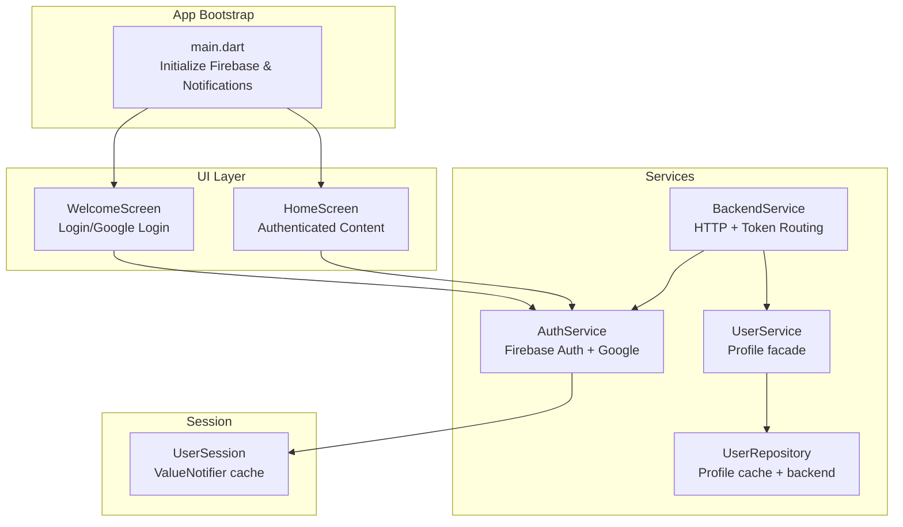
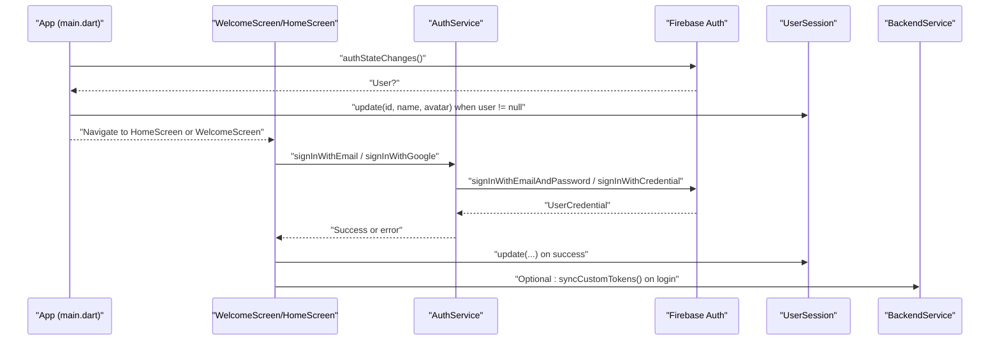
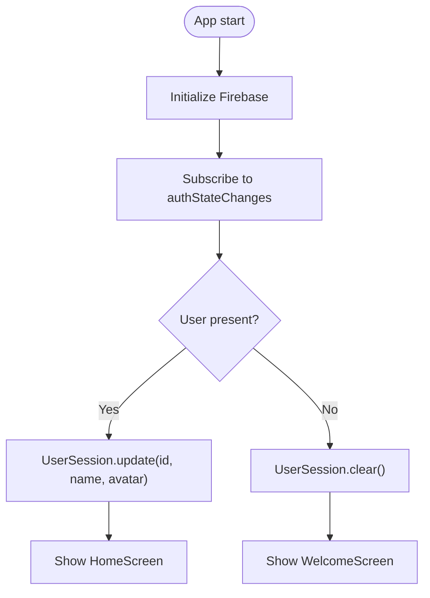
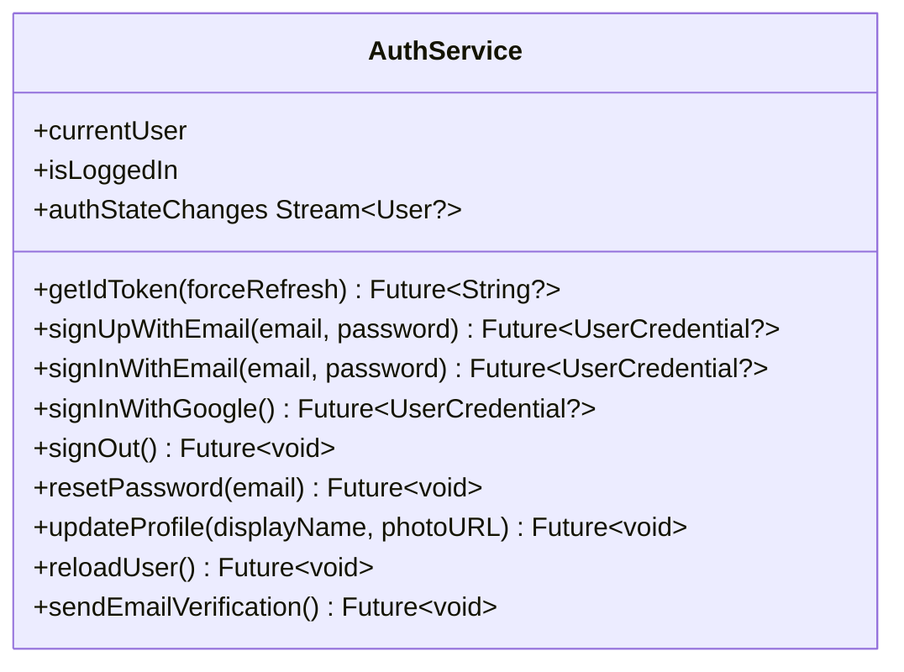
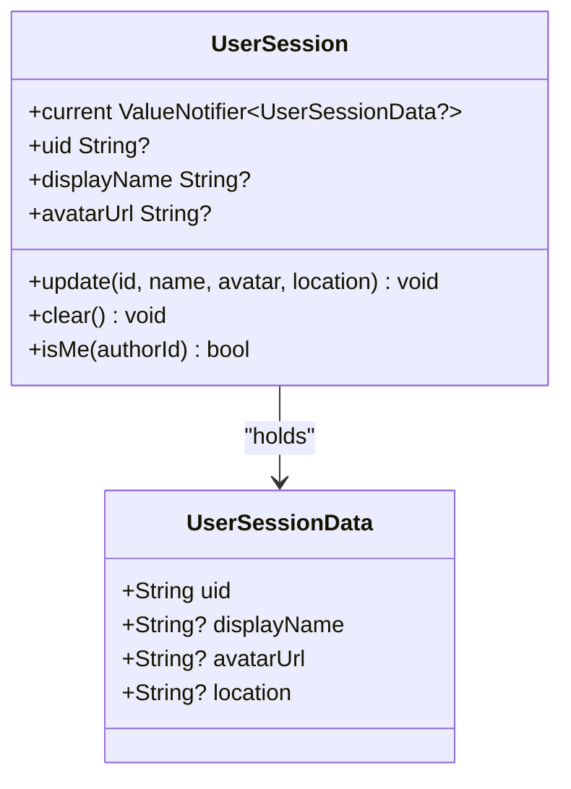
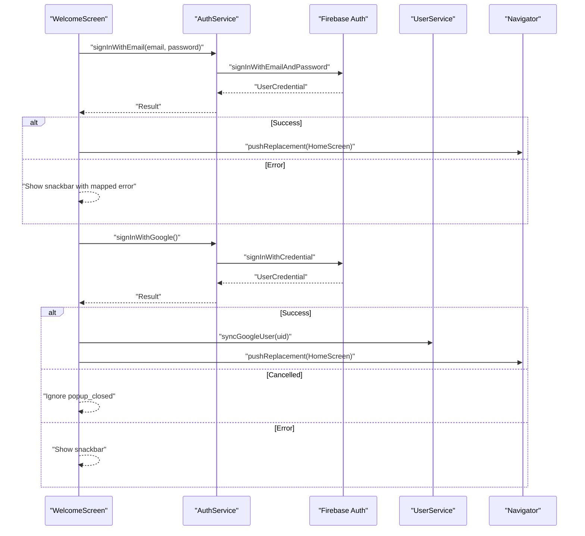
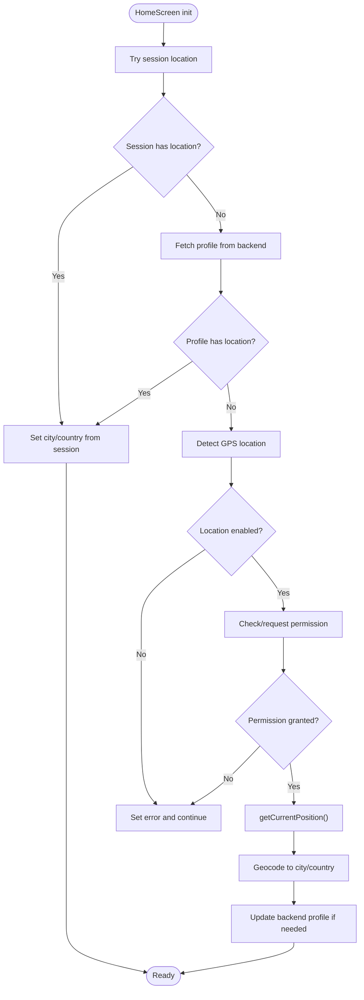
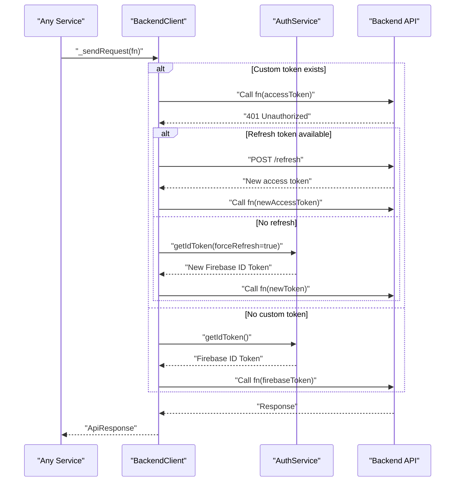
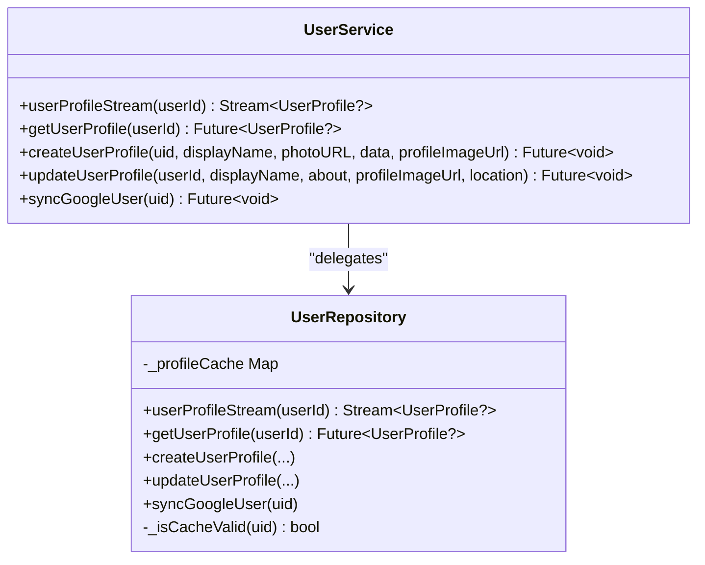
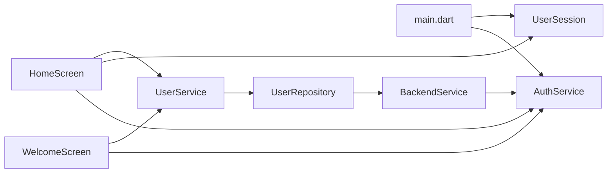

# Authentication System

<cite>
**Referenced Files in This Document**
- [main.dart](file://lib/main.dart)
- [auth_service.dart](file://lib/services/auth_service.dart)
- [user_session.dart](file://lib/core/session/user_session.dart)
- [welcome_screen.dart](file://lib/screens/welcome_screen.dart)
- [home_screen.dart](file://lib/screens/home_screen.dart)
- [user_service.dart](file://lib/services/user_service.dart)
- [user_repository.dart](file://lib/repositories/user_repository.dart)
- [backend_service.dart](file://lib/services/backend_service.dart)
</cite>

## Table of Contents
1. [Introduction](#introduction)
2. [Project Structure](#project-structure)
3. [Core Components](#core-components)
4. [Architecture Overview](#architecture-overview)
5. [Detailed Component Analysis](#detailed-component-analysis)
6. [Dependency Analysis](#dependency-analysis)
7. [Performance Considerations](#performance-considerations)
8. [Security Considerations](#security-considerations)
9. [Troubleshooting Guide](#troubleshooting-guide)
10. [Best Practices](#best-practices)
11. [Code Examples and Implementation Paths](#code-examples-and-implementation-paths)
12. [Conclusion](#conclusion)

## Introduction
This document explains the Flutter authentication system architecture, focusing on Firebase Authentication integration, custom session management, and authentication state monitoring. It documents the AuthService implementation (login/logout flows, token management), the UserSession class for local caching, and the seamless transition between authenticated and unauthenticated states using StreamBuilder. It also covers security considerations, error handling patterns, and best practices for robust authentication state management.

## Project Structure
The authentication system spans several layers:
- App bootstrap initializes Firebase and sets up global streams.
- Services encapsulate Firebase operations and token flows.
- Repositories manage backend profile caching and persistence.
- Screens react to authentication state via streams and navigate accordingly.
- Local session caching ensures fast UI updates and offline-friendly UX.

**Diagram sources**
- [main.dart](file://lib/main.dart#L12-L62)
- [auth_service.dart](file://lib/services/auth_service.dart#L5-L161)
- [user_session.dart](file://lib/core/session/user_session.dart#L12-L49)
- [welcome_screen.dart](file://lib/screens/welcome_screen.dart#L197-L279)
- [home_screen.dart](file://lib/screens/home_screen.dart#L46-L148)
- [user_service.dart](file://lib/services/user_service.dart#L7-L66)
- [user_repository.dart](file://lib/repositories/user_repository.dart#L6-L91)
- [backend_service.dart](file://lib/services/backend_service.dart#L70-L497)

**Section sources**
- [main.dart](file://lib/main.dart#L12-L62)
- [auth_service.dart](file://lib/services/auth_service.dart#L5-L161)
- [user_session.dart](file://lib/core/session/user_session.dart#L12-L49)
- [welcome_screen.dart](file://lib/screens/welcome_screen.dart#L197-L279)
- [home_screen.dart](file://lib/screens/home_screen.dart#L46-L148)
- [user_service.dart](file://lib/services/user_service.dart#L7-L66)
- [user_repository.dart](file://lib/repositories/user_repository.dart#L6-L91)
- [backend_service.dart](file://lib/services/backend_service.dart#L70-L497)

## Core Components
- Firebase initialization and global auth state stream in the app entrypoint.
- AuthService: centralizes Firebase Auth operations, Google Sign-In, token retrieval, and user reloads.
- UserSession: ValueNotifier-based cache for user identity and profile metadata.
- WelcomeScreen: login and Google login flows, error handling, and navigation.
- HomeScreen: authenticated UI, location detection, and profile integration.
- UserService and UserRepository: profile facade and caching with backend synchronization.
- BackendService: HTTP client with dual-token routing (custom JWT and Firebase ID Token).

**Section sources**
- [main.dart](file://lib/main.dart#L12-L62)
- [auth_service.dart](file://lib/services/auth_service.dart#L5-L161)
- [user_session.dart](file://lib/core/session/user_session.dart#L12-L49)
- [welcome_screen.dart](file://lib/screens/welcome_screen.dart#L197-L279)
- [home_screen.dart](file://lib/screens/home_screen.dart#L46-L148)
- [user_service.dart](file://lib/services/user_service.dart#L7-L66)
- [user_repository.dart](file://lib/repositories/user_repository.dart#L6-L91)
- [backend_service.dart](file://lib/services/backend_service.dart#L70-L497)

## Architecture Overview
The system uses Firebase Authentication for identity and a custom JWT session for backend authorization when available. The auth state stream drives UI transitions and session updates.

**Diagram sources**
- [main.dart](file://lib/main.dart#L39-L59)
- [auth_service.dart](file://lib/services/auth_service.dart#L26-L103)
- [user_session.dart](file://lib/core/session/user_session.dart#L22-L38)
- [welcome_screen.dart](file://lib/screens/welcome_screen.dart#L197-L279)
- [backend_service.dart](file://lib/services/backend_service.dart#L104-L172)

## Detailed Component Analysis

### Firebase Initialization and Auth State Monitoring
- Firebase is initialized at startup.
- The root widget uses StreamBuilder on AuthService.authStateChanges to decide whether to show WelcomeScreen or HomeScreen.
- On user presence, UserSession.update is called to populate local cache with user metadata.
- On absence, UserSession.clear ensures cache is reset.

**Diagram sources**
- [main.dart](file://lib/main.dart#L12-L62)
- [user_session.dart](file://lib/core/session/user_session.dart#L22-L43)

**Section sources**
- [main.dart](file://lib/main.dart#L12-L62)
- [user_session.dart](file://lib/core/session/user_session.dart#L22-L43)

### AuthService: Authentication Operations and Token Management
- Provides static accessors for current user and login state.
- Exposes getIdToken with optional forceRefresh.
- Implements sign-up, email/password sign-in, Google Sign-In (web/mobile), sign-out, password reset, profile updates, and user reload.
- Google Sign-In flow handles web-specific silent sign-in and popup cancellation handling.

**Diagram sources**
- [auth_service.dart](file://lib/services/auth_service.dart#L5-L161)

**Section sources**
- [auth_service.dart](file://lib/services/auth_service.dart#L5-L161)

### UserSession: Local Session Cache
- ValueNotifier-based cache holding UserSessionData (uid, displayName, avatarUrl, location).
- Provides update and clear methods.
- Legacy getters maintain compatibility.
- isMe helper compares authorId against current uid.

**Diagram sources**
- [user_session.dart](file://lib/core/session/user_session.dart#L3-L49)

**Section sources**
- [user_session.dart](file://lib/core/session/user_session.dart#L3-L49)

### WelcomeScreen: Login and Google Login Flows
- Handles email/password login with input validation and error mapping.
- Manages loading states and navigates to HomeScreen on success.
- Implements Google Sign-In with platform-specific handling and profile sync.
- Displays contextual snackbars for user feedback.

**Diagram sources**
- [welcome_screen.dart](file://lib/screens/welcome_screen.dart#L197-L279)
- [auth_service.dart](file://lib/services/auth_service.dart#L26-L103)
- [user_service.dart](file://lib/services/user_service.dart#L63-L65)

**Section sources**
- [welcome_screen.dart](file://lib/screens/welcome_screen.dart#L197-L279)
- [auth_service.dart](file://lib/services/auth_service.dart#L26-L103)
- [user_service.dart](file://lib/services/user_service.dart#L63-L65)

### HomeScreen: Authenticated Experience and Location Integration
- Detects and displays user location, using cached session or backend profile as fallback.
- Requests location permissions and handles denials gracefully.
- Syncs location to backend profile when changed.
- Integrates notification badges via NotificationDataService.

**Diagram sources**
- [home_screen.dart](file://lib/screens/home_screen.dart#L46-L148)

**Section sources**
- [home_screen.dart](file://lib/screens/home_screen.dart#L46-L148)

### BackendService: Token Routing and HTTP Layer
- Provides a facade over HTTP requests with automatic token selection.
- Supports custom JWT session tokens when available; falls back to Firebase ID Tokens.
- Includes deduplication and retry logic for token synchronization and refresh.
- Orchestrates session lifecycle (clear, unsupported configuration handling).

**Diagram sources**
- [backend_service.dart](file://lib/services/backend_service.dart#L174-L212)
- [backend_service.dart](file://lib/services/backend_service.dart#L104-L172)
- [auth_service.dart](file://lib/services/auth_service.dart#L18-L20)

**Section sources**
- [backend_service.dart](file://lib/services/backend_service.dart#L70-L497)
- [auth_service.dart](file://lib/services/auth_service.dart#L18-L20)

### UserService and UserRepository: Profile Management
- UserService exposes profile streams and CRUD operations, delegating to UserRepository.
- UserRepository caches profiles in-memory with expiration and invalidation.
- Synchronizes Google users and updates Firebase Auth profile on demand.

**Diagram sources**
- [user_service.dart](file://lib/services/user_service.dart#L7-L66)
- [user_repository.dart](file://lib/repositories/user_repository.dart#L6-L91)

**Section sources**
- [user_service.dart](file://lib/services/user_service.dart#L7-L66)
- [user_repository.dart](file://lib/repositories/user_repository.dart#L6-L91)

## Dependency Analysis
- main.dart depends on AuthService.authStateChanges and UserSession for UI routing.
- WelcomeScreen depends on AuthService and UserService for login and profile sync.
- HomeScreen depends on AuthService.currentUser, UserSession, and UserService for location and profile.
- BackendService depends on AuthService for tokens and on UserService for profile operations.
- UserRepository depends on BackendService for network calls and caches results.

**Diagram sources**
- [main.dart](file://lib/main.dart#L39-L59)
- [welcome_screen.dart](file://lib/screens/welcome_screen.dart#L197-L279)
- [home_screen.dart](file://lib/screens/home_screen.dart#L46-L148)
- [user_service.dart](file://lib/services/user_service.dart#L7-L66)
- [user_repository.dart](file://lib/repositories/user_repository.dart#L6-L91)
- [backend_service.dart](file://lib/services/backend_service.dart#L70-L497)
- [auth_service.dart](file://lib/services/auth_service.dart#L5-L161)

**Section sources**
- [main.dart](file://lib/main.dart#L39-L59)
- [welcome_screen.dart](file://lib/screens/welcome_screen.dart#L197-L279)
- [home_screen.dart](file://lib/screens/home_screen.dart#L46-L148)
- [user_service.dart](file://lib/services/user_service.dart#L7-L66)
- [user_repository.dart](file://lib/repositories/user_repository.dart#L6-L91)
- [backend_service.dart](file://lib/services/backend_service.dart#L70-L497)
- [auth_service.dart](file://lib/services/auth_service.dart#L5-L161)

## Performance Considerations
- Prefer ValueNotifier-based UserSession for efficient UI updates without rebuilding entire subtrees.
- Cache user profiles in UserRepository to reduce backend calls and improve perceived performance.
- Use StreamBuilder for auth state to minimize unnecessary rebuilds.
- Defer heavy UI animations until after auth state resolves to avoid jank.
- Avoid blocking the UI thread with synchronous network calls; use Futures and Streams.

## Security Considerations
- Always handle FirebaseAuthException and map user-friendly messages without leaking sensitive details.
- On sign-out, clear both Firebase and custom session tokens to prevent stale access.
- Validate and sanitize user inputs for login and profile updates.
- Use HTTPS endpoints and rely on Firebase Auth or custom JWT for authorization.
- Avoid storing sensitive tokens in plain text; rely on Firebase Auth SDK and secure backend token rotation.
- Respect user cancellations (e.g., Google popup closed) and do not treat as errors.

## Troubleshooting Guide
Common issues and resolutions:
- Auth state not updating: Ensure StreamBuilder subscribes to AuthService.authStateChanges and that Firebase is initialized before mounting.
- Google Sign-In failures on web: Handle popup closure gracefully; fallback to silent sign-in and then interactive sign-in.
- Token errors (401/403): Trigger AuthService.getIdToken(forceRefresh: true) and retry; BackendService will rotate or refresh tokens when possible.
- Profile sync issues: Use UserService.syncGoogleUser after Google login to ensure backend profile exists.
- Location permissions denied: Prompt users to enable permissions or guide them to settings; display helpful error messages.

**Section sources**
- [auth_service.dart](file://lib/services/auth_service.dart#L56-L103)
- [backend_service.dart](file://lib/services/backend_service.dart#L174-L212)
- [welcome_screen.dart](file://lib/screens/welcome_screen.dart#L230-L278)
- [home_screen.dart](file://lib/screens/home_screen.dart#L81-L148)

## Best Practices
- Centralize authentication logic in AuthService to keep UI components thin.
- Use ValueNotifier for small, frequent updates (e.g., user session) to avoid unnecessary widget rebuilds.
- Keep UI responsive by offloading work to Futures and Streams.
- Always clear session caches on sign-out and on token refresh failures.
- Provide user feedback via snackbars for authentication errors.
- Gracefully handle platform differences (web vs mobile) for Google Sign-In.

## Code Examples and Implementation Paths
Below are the implementation paths for key flows. Replace code snippets with these references in your documentation or examples.

- App bootstrap and auth state monitoring
  - [main.dart](file://lib/main.dart#L12-L62)

- AuthService login/logout and token management
  - [auth_service.dart](file://lib/services/auth_service.dart#L26-L117)

- Google Sign-In flow (web/mobile)
  - [auth_service.dart](file://lib/services/auth_service.dart#L56-L103)

- UserSession cache updates and clearing
  - [user_session.dart](file://lib/core/session/user_session.dart#L22-L43)

- WelcomeScreen login and Google login
  - [welcome_screen.dart](file://lib/screens/welcome_screen.dart#L197-L279)

- HomeScreen location detection and profile sync
  - [home_screen.dart](file://lib/screens/home_screen.dart#L46-L148)

- BackendService token routing and retries
  - [backend_service.dart](file://lib/services/backend_service.dart#L174-L212)

- Custom JWT session synchronization
  - [backend_service.dart](file://lib/services/backend_service.dart#L104-L172)

- UserService and UserRepository profile operations
  - [user_service.dart](file://lib/services/user_service.dart#L14-L66)
  - [user_repository.dart](file://lib/repositories/user_repository.dart#L21-L91)

## Conclusion
The authentication system integrates Firebase Authentication with a custom JWT session layer, ensuring robust, scalable, and user-friendly authentication flows. StreamBuilder-driven state monitoring enables seamless transitions between authenticated and unauthenticated views. Centralized services and local caching provide performance and reliability, while careful error handling and security practices protect user data and privacy.