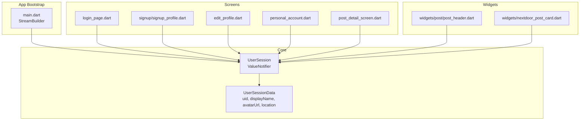
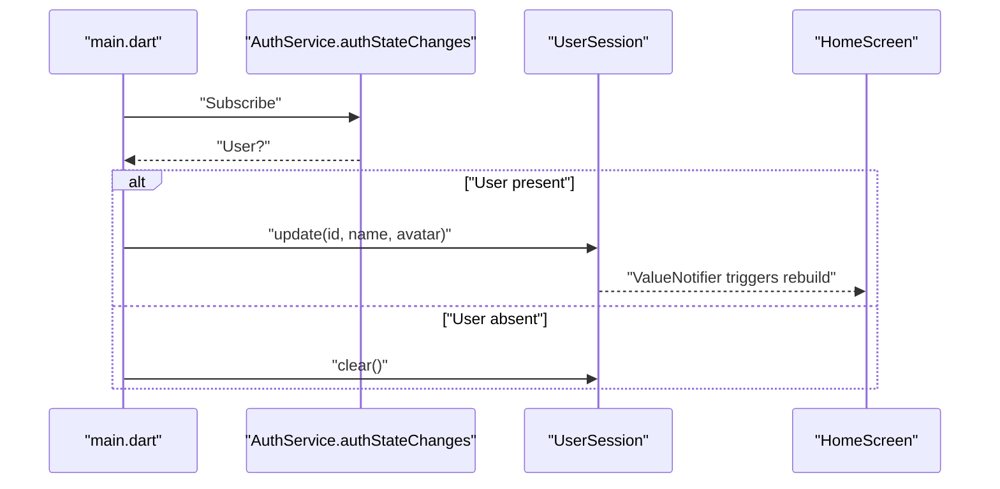
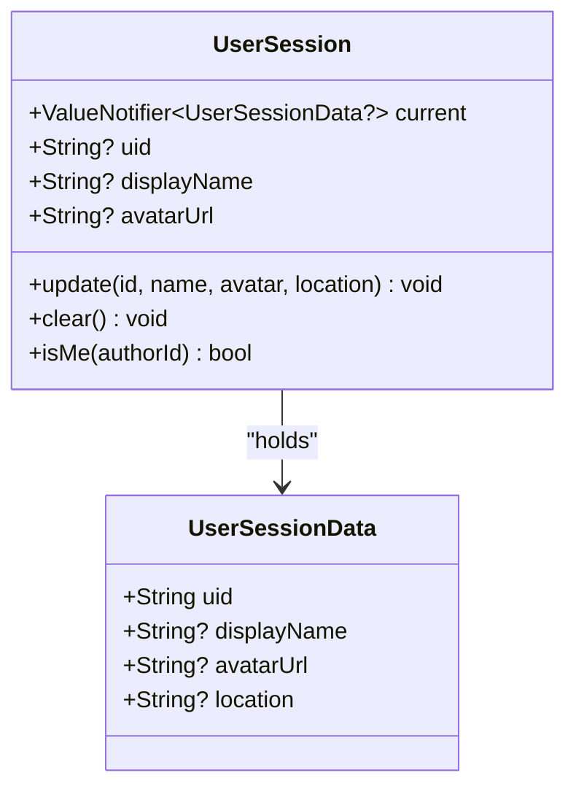
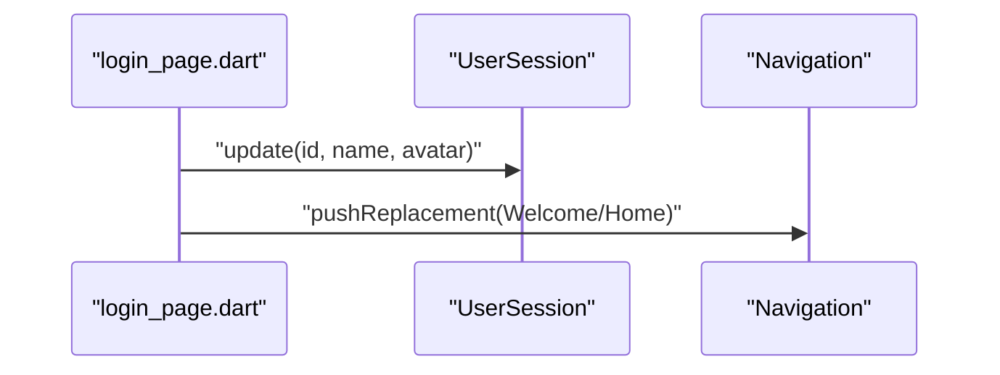
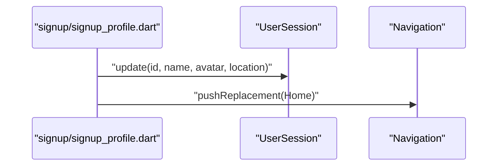
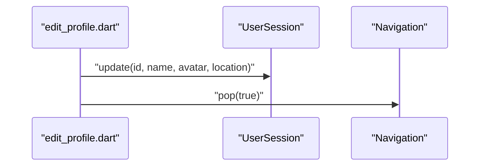
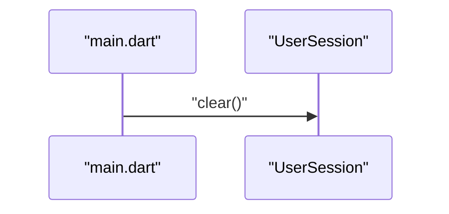
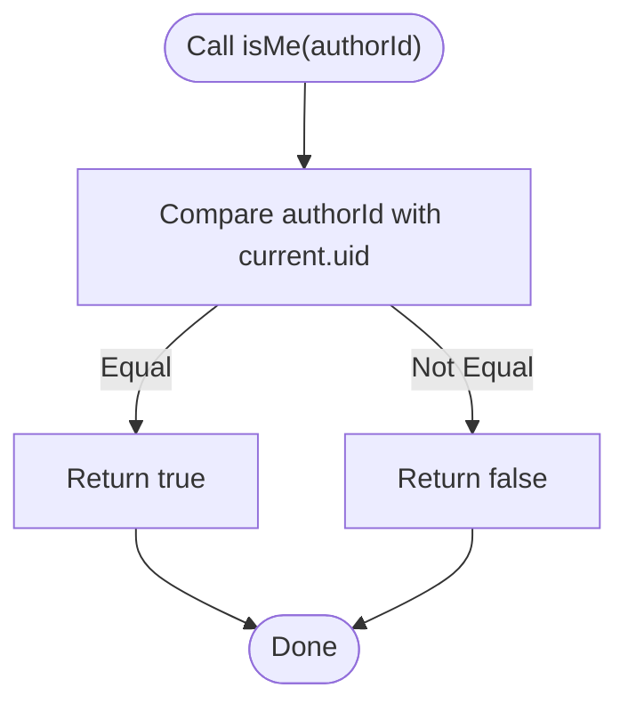
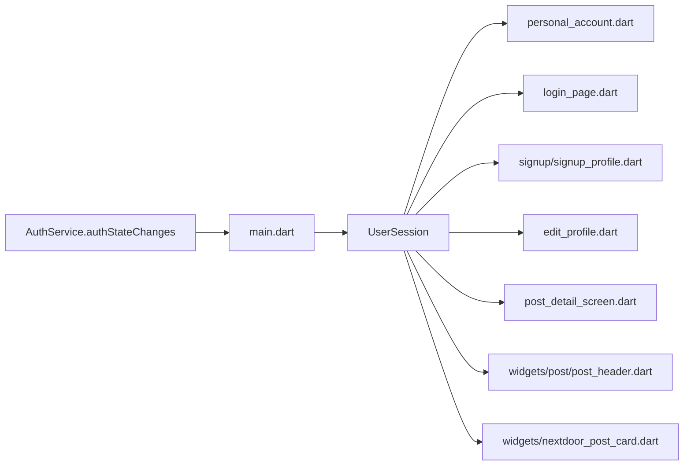

# Session Management

<cite>
**Referenced Files in This Document**
- [user_session.dart](file://testpro-main/lib/core/session/user_session.dart)
- [main.dart](file://testpro-main/lib/main.dart)
- [personal_account.dart](file://testpro-main/lib/screens/personal_account.dart)
- [edit_profile.dart](file://testpro-main/lib/screens/edit_profile.dart)
- [login_page.dart](file://testpro-main/lib/screens/login_page.dart)
- [signup_profile.dart](file://testpro-main/lib/screens/signup/signup_profile.dart)
- [post_detail_screen.dart](file://testpro-main/lib/screens/post_detail_screen.dart)
- [nextdoor_post_card.dart](file://testpro-main/lib/widgets/nextdoor_post_card.dart)
- [post_header.dart](file://testpro-main/lib/widgets/post/post_header.dart)
</cite>

## Table of Contents
1. [Introduction](#introduction)
2. [Project Structure](#project-structure)
3. [Core Components](#core-components)
4. [Architecture Overview](#architecture-overview)
5. [Detailed Component Analysis](#detailed-component-analysis)
6. [Dependency Analysis](#dependency-analysis)
7. [Performance Considerations](#performance-considerations)
8. [Troubleshooting Guide](#troubleshooting-guide)
9. [Conclusion](#conclusion)

## Introduction
This document explains the session management architecture centered around the UserSession class and its reactive state model. It covers the ValueNotifier-based reactive session state, the UserSessionData model, and the lifecycle operations for updating and clearing session data. It also documents the isMe utility for user identity verification and demonstrates practical patterns for login, signup, profile edits, and logout. Finally, it highlights the legacy getter methods that maintain backward compatibility and provides guidance for reactive UI updates.

## Project Structure
The session management logic resides in the core session module and is consumed across the application’s screens and widgets. The main application bootstraps authentication state and initializes/clears the session accordingly. Screens and widgets reactively render session data using ValueListenableBuilder.

**Diagram sources**
- [user_session.dart](file://testpro-main/lib/core/session/user_session.dart#L3-L49)
- [main.dart](file://testpro-main/lib/main.dart#L39-L61)
- [login_page.dart](file://testpro-main/lib/screens/login_page.dart#L57-L62)
- [signup_profile.dart](file://testpro-main/lib/screens/signup/signup_profile.dart#L120-L126)
- [edit_profile.dart](file://testpro-main/lib/screens/edit_profile.dart#L129-L135)
- [personal_account.dart](file://testpro-main/lib/screens/personal_account.dart#L203-L205)
- [post_detail_screen.dart](file://testpro-main/lib/screens/post_detail_screen.dart#L242-L242)
- [post_header.dart](file://testpro-main/lib/widgets/post/post_header.dart#L24-L24)
- [nextdoor_post_card.dart](file://testpro-main/lib/widgets/nextdoor_post_card.dart#L312-L312)

**Section sources**
- [user_session.dart](file://testpro-main/lib/core/session/user_session.dart#L3-L49)
- [main.dart](file://testpro-main/lib/main.dart#L39-L61)

## Core Components
- UserSessionData: Immutable data holder for the current user’s session attributes.
- UserSession: Central singleton managing reactive session state with ValueNotifier, plus convenience methods for update, clear, and identity checks.

Key responsibilities:
- Reactive state: ValueNotifier<UserSessionData?> current drives UI updates.
- Update: Merge new values with existing session while preserving non-null fields.
- Clear: Reset session to null on logout.
- Identity check: isMe(authorId) compares against current uid.
- Legacy getters: uid, displayName, avatarUrl provide direct access to current values for backward compatibility.

**Section sources**
- [user_session.dart](file://testpro-main/lib/core/session/user_session.dart#L3-L49)

## Architecture Overview
The session architecture is reactive and centralized:
- Authentication state is observed at the app root.
- On user presence, UserSession.update is called to populate session data.
- On user absence, UserSession.clear ensures cache is reset.
- Screens and widgets subscribe to UserSession.current via ValueListenableBuilder to rebuild UI reactively.

**Diagram sources**
- [main.dart](file://testpro-main/lib/main.dart#L39-L61)
- [user_session.dart](file://testpro-main/lib/core/session/user_session.dart#L12-L48)

## Detailed Component Analysis

### UserSessionData Model
- Fields: uid, displayName, avatarUrl, location.
- Purpose: Encapsulates the current session payload as a single immutable object.

Complexity:
- Construction is O(1).
- Equality semantics benefit from immutability for efficient listener comparisons.

**Section sources**
- [user_session.dart](file://testpro-main/lib/core/session/user_session.dart#L3-L10)

### UserSession Singleton
Responsibilities:
- Static ValueNotifier<UserSessionData?> current: central reactive state.
- Legacy getters: uid, displayName, avatarUrl for backward compatibility.
- update(): merges new values with existing session data.
- clear(): resets session to null.
- isMe(): lightweight identity check.

Implementation notes:
- update resolves missing id from current session if present.
- update ignores calls when id is null and no current session exists.
- clear sets ValueNotifier to null.

**Diagram sources**
- [user_session.dart](file://testpro-main/lib/core/session/user_session.dart#L3-L49)

**Section sources**
- [user_session.dart](file://testpro-main/lib/core/session/user_session.dart#L12-L49)

### Reactive UI Integration
- personal_account.dart demonstrates subscribing to UserSession.current to compute display title and avatar.
- Other screens and widgets use similar patterns to render session-aware UI.

Example pattern:
- Wrap UI with ValueListenableBuilder listening to UserSession.current.
- Compute derived values (e.g., display title) based on sessionData and fallbacks.

**Section sources**
- [personal_account.dart](file://testpro-main/lib/screens/personal_account.dart#L203-L205)

### Session Lifecycle Operations

#### Login Flow
- On successful login, update session with uid, displayName, and avatar.
- Navigate to HomeScreen after initialization.

**Diagram sources**
- [login_page.dart](file://testpro-main/lib/screens/login_page.dart#L57-L62)
- [user_session.dart](file://testpro-main/lib/core/session/user_session.dart#L22-L38)

**Section sources**
- [login_page.dart](file://testpro-main/lib/screens/login_page.dart#L57-L62)

#### Signup Flow
- After account creation and profile sync, update session with uid, name, avatar, and location.
- Navigate to HomeScreen.

**Diagram sources**
- [signup_profile.dart](file://testpro-main/lib/screens/signup/signup_profile.dart#L120-L126)
- [user_session.dart](file://testpro-main/lib/core/session/user_session.dart#L22-L38)

**Section sources**
- [signup_profile.dart](file://testpro-main/lib/screens/signup/signup_profile.dart#L120-L126)

#### Profile Edit Flow
- On successful edit, update session with merged values (including location).
- Trigger navigation pop to signal refresh.

**Diagram sources**
- [edit_profile.dart](file://testpro-main/lib/screens/edit_profile.dart#L129-L135)
- [user_session.dart](file://testpro-main/lib/core/session/user_session.dart#L22-L38)

**Section sources**
- [edit_profile.dart](file://testpro-main/lib/screens/edit_profile.dart#L129-L135)

#### Logout Flow
- Clear session on sign-out to remove cached data.

**Diagram sources**
- [main.dart](file://testpro-main/lib/main.dart#L53-L54)
- [user_session.dart](file://testpro-main/lib/core/session/user_session.dart#L40-L43)

**Section sources**
- [main.dart](file://testpro-main/lib/main.dart#L53-L54)

### Identity Verification with isMe
- Used to conditionally render author-only actions (e.g., edit/delete).
- Compares authorId against current uid.

Usage examples:
- Post detail screen checks post author.
- Comment context checks comment author.
- Post header and nextdoor card widgets check post author.

**Diagram sources**
- [user_session.dart](file://testpro-main/lib/core/session/user_session.dart#L45-L48)
- [post_detail_screen.dart](file://testpro-main/lib/screens/post_detail_screen.dart#L242-L242)
- [post_detail_screen.dart](file://testpro-main/lib/screens/post_detail_screen.dart#L562-L562)
- [post_header.dart](file://testpro-main/lib/widgets/post/post_header.dart#L24-L24)
- [nextdoor_post_card.dart](file://testpro-main/lib/widgets/nextdoor_post_card.dart#L312-L312)

**Section sources**
- [user_session.dart](file://testpro-main/lib/core/session/user_session.dart#L45-L48)
- [post_detail_screen.dart](file://testpro-main/lib/screens/post_detail_screen.dart#L242-L242)
- [post_detail_screen.dart](file://testpro-main/lib/screens/post_detail_screen.dart#L562-L562)
- [post_header.dart](file://testpro-main/lib/widgets/post/post_header.dart#L24-L24)
- [nextdoor_post_card.dart](file://testpro-main/lib/widgets/nextdoor_post_card.dart#L312-L312)

### Legacy Getters
- uid, displayName, avatarUrl provide direct access to current values.
- They delegate to current.value?.field, ensuring compatibility with existing code that reads these properties directly.

Best practice:
- Prefer direct reads from UserSession.current for reactive UI.
- Use legacy getters only where legacy code expects direct properties.

**Section sources**
- [user_session.dart](file://testpro-main/lib/core/session/user_session.dart#L15-L18)

## Dependency Analysis
- UserSession depends on Flutter’s ValueNotifier for reactive state.
- Screens and widgets depend on UserSession.current for rendering.
- main.dart orchestrates session initialization/clearing based on auth state.

**Diagram sources**
- [main.dart](file://testpro-main/lib/main.dart#L39-L61)
- [user_session.dart](file://testpro-main/lib/core/session/user_session.dart#L12-L49)
- [personal_account.dart](file://testpro-main/lib/screens/personal_account.dart#L203-L205)
- [login_page.dart](file://testpro-main/lib/screens/login_page.dart#L57-L62)
- [signup_profile.dart](file://testpro-main/lib/screens/signup/signup_profile.dart#L120-L126)
- [edit_profile.dart](file://testpro-main/lib/screens/edit_profile.dart#L129-L135)
- [post_detail_screen.dart](file://testpro-main/lib/screens/post_detail_screen.dart#L242-L242)
- [post_header.dart](file://testpro-main/lib/widgets/post/post_header.dart#L24-L24)
- [nextdoor_post_card.dart](file://testpro-main/lib/widgets/nextdoor_post_card.dart#L312-L312)

**Section sources**
- [user_session.dart](file://testpro-main/lib/core/session/user_session.dart#L12-L49)
- [main.dart](file://testpro-main/lib/main.dart#L39-L61)

## Performance Considerations
- ValueNotifier triggers rebuilds only when current.value changes. Keep UserSessionData immutable to maximize listener efficiency.
- update merges fields without unnecessary writes; avoid frequent small updates to reduce rebuild cycles.
- Use targeted ValueListenableBuilder scopes (e.g., per widget subtree) to minimize unnecessary UI rebuilds.

## Troubleshooting Guide
Common issues and resolutions:
- Stale UI after profile edit: Ensure update is called with the latest values and that the UI subscribes to UserSession.current.
- Identity checks failing: Confirm isMe is invoked with the correct authorId and that session is initialized before use.
- Logout not reflected: Verify clear is called on auth absence and that no stale references persist elsewhere.

**Section sources**
- [user_session.dart](file://testpro-main/lib/core/session/user_session.dart#L22-L48)
- [main.dart](file://testpro-main/lib/main.dart#L53-L54)

## Conclusion
The UserSession class provides a concise, reactive foundation for session state management. Its ValueNotifier-based design integrates cleanly with Flutter’s reactive framework, enabling consistent UI updates across the app. The update, clear, and isMe operations cover the primary lifecycle needs, while legacy getters preserve backward compatibility. Following the documented patterns ensures predictable behavior during login, signup, profile edits, and logout, and supports robust identity checks in UI logic.