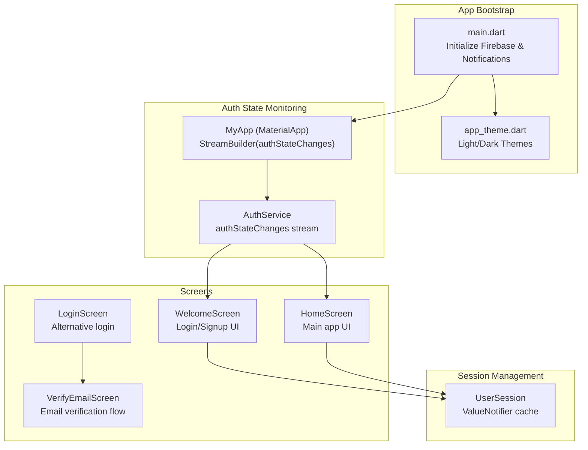
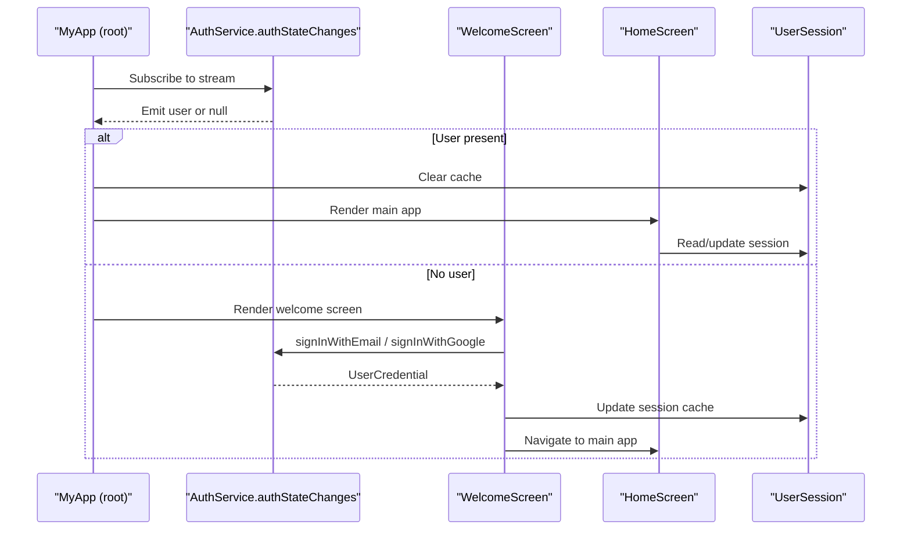
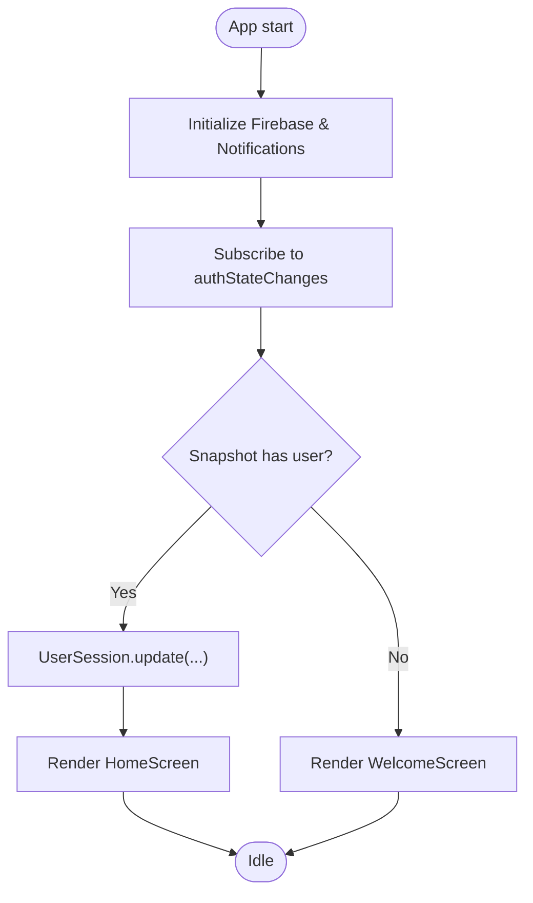
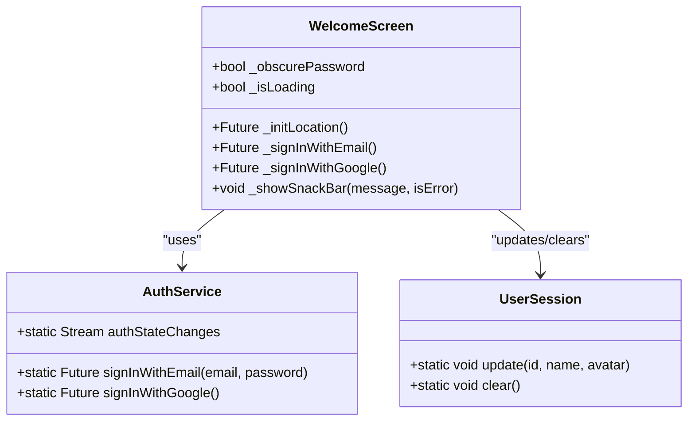
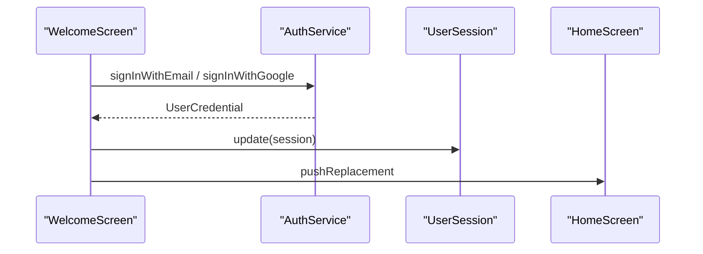
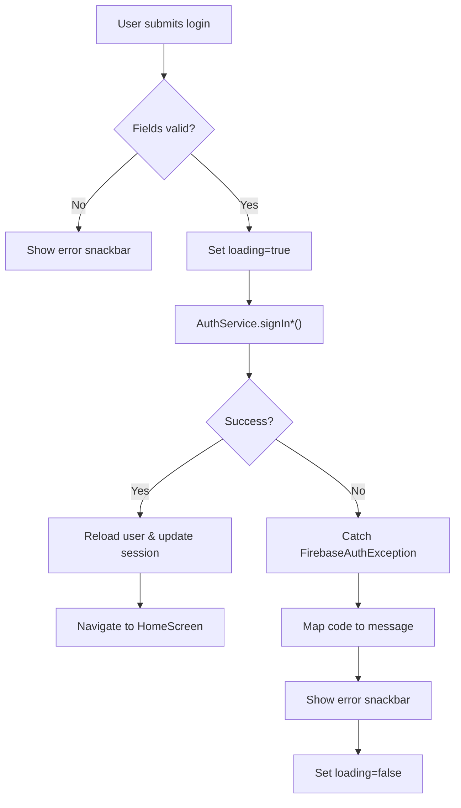
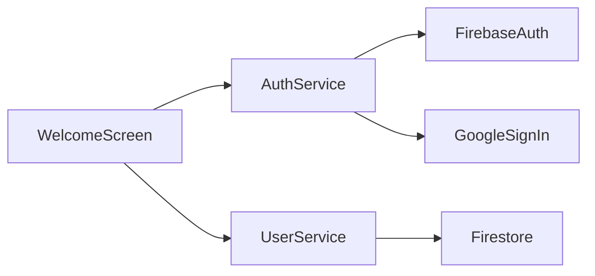

# Welcome Screen Flow

<cite>
**Referenced Files in This Document**
- [main.dart](file://testpro-main/lib/main.dart)
- [welcome_screen.dart](file://testpro-main/lib/screens/welcome_screen.dart)
- [auth_service.dart](file://testpro-main/lib/services/auth_service.dart)
- [user_session.dart](file://testpro-main/lib/core/session/user_session.dart)
- [home_screen.dart](file://testpro-main/lib/screens/home_screen.dart)
- [login_page.dart](file://testpro-main/lib/screens/login_page.dart)
- [verify_email_screen.dart](file://testpro-main/lib/screens/verify_email_screen.dart)
- [app_theme.dart](file://testpro-main/lib/config/app_theme.dart)
- [pubspec.yaml](file://testpro-main/pubspec.yaml)
</cite>

## Table of Contents
1. [Introduction](#introduction)
2. [Project Structure](#project-structure)
3. [Core Components](#core-components)
4. [Architecture Overview](#architecture-overview)
5. [Detailed Component Analysis](#detailed-component-analysis)
6. [Dependency Analysis](#dependency-analysis)
7. [Performance Considerations](#performance-considerations)
8. [Troubleshooting Guide](#troubleshooting-guide)
9. [Conclusion](#conclusion)

## Introduction
This document explains the welcome screen implementation and authentication state detection flow in the Flutter application. It focuses on how the app monitors authentication state using Firebase Authentication streams, conditionally renders the welcome screen versus the main app, and manages seamless navigation between screens. It also covers loading states, error handling, responsive design considerations, accessibility features, and cross-platform authentication consistency.

## Project Structure
The authentication and welcome flow spans several key areas:
- Application bootstrap initializes Firebase and sets up global theme.
- The root widget uses a StreamBuilder to monitor Firebase auth state and decide which screen to show.
- The welcome screen provides login and signup flows with animations and responsive UI.
- Supporting screens handle email verification and navigation to the main app.

**Diagram sources**
- [main.dart](file://testpro-main/lib/main.dart#L12-L62)
- [auth_service.dart](file://testpro-main/lib/services/auth_service.dart#L22-L23)
- [welcome_screen.dart](file://testpro-main/lib/screens/welcome_screen.dart#L12-L17)
- [home_screen.dart](file://testpro-main/lib/screens/home_screen.dart#L18-L23)
- [login_page.dart](file://testpro-main/lib/screens/login_page.dart#L9-L14)
- [verify_email_screen.dart](file://testpro-main/lib/screens/verify_email_screen.dart#L8-L13)
- [user_session.dart](file://testpro-main/lib/core/session/user_session.dart#L12-L43)

**Section sources**
- [main.dart](file://testpro-main/lib/main.dart#L12-L62)
- [pubspec.yaml](file://testpro-main/pubspec.yaml#L25-L36)

## Core Components
- Stream-based authentication state monitoring in the root widget.
- Welcome screen with animated UI, login/signin flows, and navigation.
- User session caching for quick access to user metadata.
- Verification flow for email-verified users.
- Theme and responsive design system.

**Section sources**
- [main.dart](file://testpro-main/lib/main.dart#L39-L59)
- [auth_service.dart](file://testpro-main/lib/services/auth_service.dart#L22-L23)
- [welcome_screen.dart](file://testpro-main/lib/screens/welcome_screen.dart#L19-L173)
- [user_session.dart](file://testpro-main/lib/core/session/user_session.dart#L12-L43)
- [verify_email_screen.dart](file://testpro-main/lib/screens/verify_email_screen.dart#L15-L64)
- [app_theme.dart](file://testpro-main/lib/config/app_theme.dart#L132-L269)

## Architecture Overview
The authentication state drives the entire navigation flow:
- On startup, the app initializes Firebase and notifications.
- The root widget subscribes to Firebase’s auth state stream.
- When a user is detected, the session cache is populated and the main app screen is shown.
- When no user is detected, the welcome screen is shown.
- The welcome screen supports email/password and Google sign-in, with navigation to either the main app or the email verification screen depending on the user’s verification status.

**Diagram sources**
- [main.dart](file://testpro-main/lib/main.dart#L39-L59)
- [auth_service.dart](file://testpro-main/lib/services/auth_service.dart#L22-L23)
- [welcome_screen.dart](file://testpro-main/lib/screens/welcome_screen.dart#L197-L238)
- [user_session.dart](file://testpro-main/lib/core/session/user_session.dart#L22-L43)
- [home_screen.dart](file://testpro-main/lib/screens/home_screen.dart#L18-L23)

## Detailed Component Analysis

### StreamBuilder-Based Authentication State Monitoring
- The root widget uses a StreamBuilder around AuthService.authStateChanges.
- During connection, if a user is present, the session cache is initialized and the main app screen is rendered.
- If no user is present, the welcome screen is shown.
- On sign-out, the session cache is cleared.

**Diagram sources**
- [main.dart](file://testpro-main/lib/main.dart#L12-L22)
- [main.dart](file://testpro-main/lib/main.dart#L39-L59)
- [user_session.dart](file://testpro-main/lib/core/session/user_session.dart#L22-L43)

**Section sources**
- [main.dart](file://testpro-main/lib/main.dart#L39-L59)
- [auth_service.dart](file://testpro-main/lib/services/auth_service.dart#L22-L23)

### Welcome Screen Implementation
- Provides animated UI with multiple controllers for fade, slide, pulse, rotate, floating, shimmer, wave, particle, glow, gradient, and rotate animations.
- Supports email/password login and Google sign-in.
- Handles loading states and displays contextual snack bars for errors.
- Navigates to the main app upon successful authentication.

**Diagram sources**
- [welcome_screen.dart](file://testpro-main/lib/screens/welcome_screen.dart#L19-L173)
- [auth_service.dart](file://testpro-main/lib/services/auth_service.dart#L22-L103)
- [user_session.dart](file://testpro-main/lib/core/session/user_session.dart#L22-L43)

**Section sources**
- [welcome_screen.dart](file://testpro-main/lib/screens/welcome_screen.dart#L59-L173)
- [welcome_screen.dart](file://testpro-main/lib/screens/welcome_screen.dart#L197-L279)

### Conditional UI Rendering Based on Authentication Status
- The root StreamBuilder checks ConnectionState and snapshot data to decide between HomeScreen and WelcomeScreen.
- Session cache is updated or cleared accordingly.

**Section sources**
- [main.dart](file://testpro-main/lib/main.dart#L39-L59)
- [user_session.dart](file://testpro-main/lib/core/session/user_session.dart#L22-L43)

### Seamless Navigation Between Welcome and Main App Screens
- Welcome screen navigates to HomeScreen after successful authentication.
- Login screen handles verification flow and redirects to HomeScreen when verified.

**Diagram sources**
- [welcome_screen.dart](file://testpro-main/lib/screens/welcome_screen.dart#L197-L238)
- [auth_service.dart](file://testpro-main/lib/services/auth_service.dart#L41-L103)
- [user_session.dart](file://testpro-main/lib/core/session/user_session.dart#L22-L43)

**Section sources**
- [welcome_screen.dart](file://testpro-main/lib/screens/welcome_screen.dart#L212-L229)
- [login_page.dart](file://testpro-main/lib/screens/login_page.dart#L51-L77)

### Authentication State Detection Logic, Loading States, and Error Handling
- Loading states are managed via boolean flags and animated indicators.
- Error handling catches FirebaseAuthException and displays user-friendly messages.
- Email verification flow periodically reloads user state and navigates to HomeScreen upon verification.

**Diagram sources**
- [welcome_screen.dart](file://testpro-main/lib/screens/welcome_screen.dart#L197-L238)
- [welcome_screen.dart](file://testpro-main/lib/screens/welcome_screen.dart#L240-L251)
- [login_page.dart](file://testpro-main/lib/screens/login_page.dart#L33-L115)

**Section sources**
- [welcome_screen.dart](file://testpro-main/lib/screens/welcome_screen.dart#L197-L251)
- [login_page.dart](file://testpro-main/lib/screens/login_page.dart#L33-L115)
- [verify_email_screen.dart](file://testpro-main/lib/screens/verify_email_screen.dart#L45-L64)

### Practical Examples and Best Practices
- Implementing similar authentication flows:
  - Use a StreamBuilder around authStateChanges in the root widget.
  - Keep a lightweight session cache (ValueNotifier) for quick access to user metadata.
  - Centralize authentication operations in a service class.
- Handling authentication state changes:
  - Update session cache on sign-in and clear on sign-out.
  - Use reload() to refresh user metadata when verification status changes.
- Managing user onboarding experiences:
  - Guide users through email verification with periodic checks and resend capability.
  - Provide clear messaging and retry mechanisms.

**Section sources**
- [auth_service.dart](file://testpro-main/lib/services/auth_service.dart#L22-L23)
- [user_session.dart](file://testpro-main/lib/core/session/user_session.dart#L22-L43)
- [verify_email_screen.dart](file://testpro-main/lib/screens/verify_email_screen.dart#L22-L64)

### Responsive Design Considerations and Accessibility Features
- The app uses Material 3 themes and a consistent design system for typography, spacing, and colors.
- Animations adapt to screen sizes and use safe areas for padding.
- Accessible controls include appropriate contrast, focus states, and readable text sizes.

**Section sources**
- [app_theme.dart](file://testpro-main/lib/config/app_theme.dart#L132-L269)
- [welcome_screen.dart](file://testpro-main/lib/screens/welcome_screen.dart#L537-L1216)

### Cross-Platform Authentication Flow Consistency
- Google Sign-In behavior differs slightly on web versus mobile; the service handles platform-specific flows.
- Firebase Auth exceptions are normalized and surfaced consistently across platforms.

**Section sources**
- [auth_service.dart](file://testpro-main/lib/services/auth_service.dart#L56-L103)
- [pubspec.yaml](file://testpro-main/pubspec.yaml#L25-L36)

## Dependency Analysis
The authentication flow depends on Firebase Authentication and Google Sign-In, with optional Firestore for user profile synchronization.

**Diagram sources**
- [auth_service.dart](file://testpro-main/lib/services/auth_service.dart#L5-L9)
- [welcome_screen.dart](file://testpro-main/lib/screens/welcome_screen.dart#L6-L10)
- [user_session.dart](file://testpro-main/lib/core/session/user_session.dart#L12-L43)

**Section sources**
- [auth_service.dart](file://testpro-main/lib/services/auth_service.dart#L5-L9)
- [welcome_screen.dart](file://testpro-main/lib/screens/welcome_screen.dart#L6-L10)

## Performance Considerations
- Prefer ValueNotifier for lightweight session caching to minimize unnecessary rebuilds.
- Use mounted checks before updating state to avoid errors after widget disposal.
- Defer heavy operations (e.g., geolocation) until after authentication state is confirmed.

## Troubleshooting Guide
- Authentication state does not update:
  - Ensure Firebase is initialized before building the root widget.
  - Verify authStateChanges subscription is active.
- Login fails silently:
  - Catch FirebaseAuthException and map codes to user-friendly messages.
  - Confirm network connectivity and correct credentials.
- Email verification not progressing:
  - Use reloadUser() to refresh user metadata.
  - Implement periodic checks and allow resending verification emails.

**Section sources**
- [main.dart](file://testpro-main/lib/main.dart#L12-L22)
- [welcome_screen.dart](file://testpro-main/lib/screens/welcome_screen.dart#L230-L238)
- [verify_email_screen.dart](file://testpro-main/lib/screens/verify_email_screen.dart#L45-L64)

## Conclusion
The welcome screen and authentication flow leverage Firebase Authentication streams to provide a seamless, responsive, and accessible user experience. By centralizing authentication logic, maintaining a lightweight session cache, and handling loading and error states gracefully, the app ensures smooth navigation between the welcome screen and the main app across platforms.