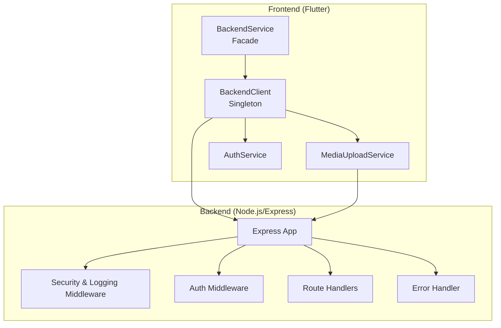
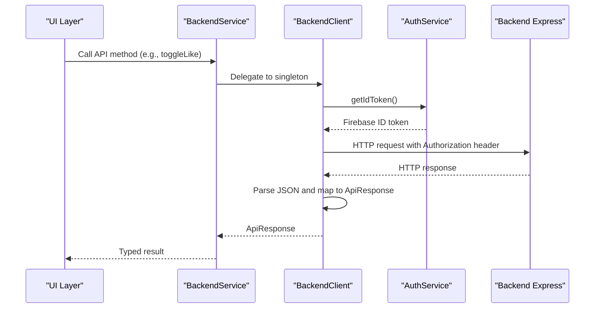
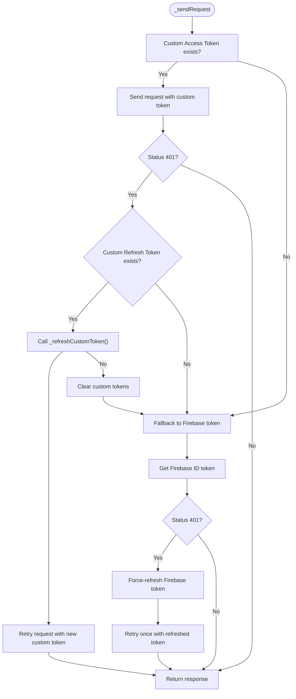
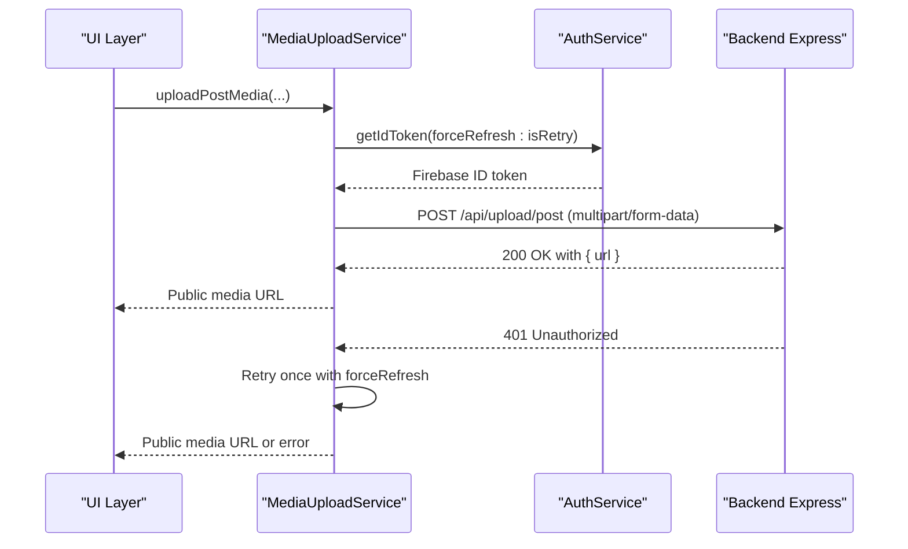
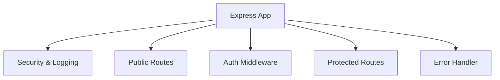
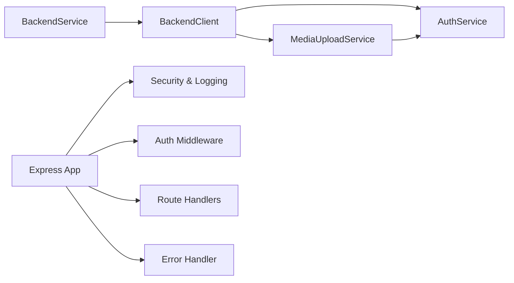

# Backend Service Layer

<cite>
**Referenced Files in This Document**
- [backend_service.dart](file://testpro-main/lib/services/backend_service.dart)
- [media_upload_service.dart](file://testpro-main/lib/services/media_upload_service.dart)
- [auth_service.dart](file://testpro-main/lib/services/auth_service.dart)
- [app.js](file://backend/src/app.js)
- [index.js](file://backend/src/index.js)
- [auth.js](file://backend/src/middleware/auth.js)
- [errorHandler.js](file://backend/src/middleware/errorHandler.js)
- [env.js](file://backend/src/config/env.js)
- [firebase.js](file://backend/src/config/firebase.js)
- [auth_routes.js](file://backend/src/routes/auth.js)
</cite>

## Table of Contents
1. [Introduction](#introduction)
2. [Project Structure](#project-structure)
3. [Core Components](#core-components)
4. [Architecture Overview](#architecture-overview)
5. [Detailed Component Analysis](#detailed-component-analysis)
6. [Dependency Analysis](#dependency-analysis)
7. [Performance Considerations](#performance-considerations)
8. [Troubleshooting Guide](#troubleshooting-guide)
9. [Conclusion](#conclusion)

## Introduction
This document explains the BackendService implementation and BackendClient architecture used by the Flutter frontend to communicate with the backend. It covers:
- The facade pattern used to expose a simplified API surface
- Singleton pattern implementation for the client
- Dual authentication token system (Firebase ID tokens + custom JWT tokens)
- Request/response processing pipeline, error handling, and retry logic
- Token synchronization and refresh workflow
- Clean architecture separation between authentication, request sending, and response processing

## Project Structure
The backend is a Node.js/Express application with layered middleware and route handlers. The frontend is a Flutter app that encapsulates all HTTP communication behind a facade and client layer.

**Diagram sources**
- [backend_service.dart](file://testpro-main/lib/services/backend_service.dart#L8-L67)
- [media_upload_service.dart](file://testpro-main/lib/services/media_upload_service.dart#L19-L44)
- [auth_service.dart](file://testpro-main/lib/services/auth_service.dart#L5-L20)
- [app.js](file://backend/src/app.js#L1-L78)

**Section sources**
- [backend_service.dart](file://testpro-main/lib/services/backend_service.dart#L8-L67)
- [media_upload_service.dart](file://testpro-main/lib/services/media_upload_service.dart#L19-L44)
- [auth_service.dart](file://testpro-main/lib/services/auth_service.dart#L5-L20)
- [app.js](file://backend/src/app.js#L1-L78)

## Core Components
- BackendService: A facade that exposes static proxies delegating to a singleton BackendClient. It centralizes API method signatures and session management helpers.
- BackendClient: The core HTTP client implementing the dual-token authentication flow, request routing, retry logic, and response processing.
- MediaUploadService: A specialized client for media uploads with built-in compression, multipart encoding, and retry-on-401 logic.
- AuthService: Provides Firebase ID tokens and auth state streams used by both clients.

Key responsibilities:
- Authentication: Obtain Firebase ID tokens and orchestrate custom JWT token exchange and refresh.
- Request Sending: Build headers, serialize payloads, and manage retries.
- Response Processing: Parse JSON responses and map to typed ApiResponse wrappers.
- Session Management: Synchronize and rotate custom tokens while handling fallback to Firebase auth.

**Section sources**
- [backend_service.dart](file://testpro-main/lib/services/backend_service.dart#L8-L67)
- [backend_service.dart](file://testpro-main/lib/services/backend_service.dart#L70-L497)
- [media_upload_service.dart](file://testpro-main/lib/services/media_upload_service.dart#L19-L184)
- [auth_service.dart](file://testpro-main/lib/services/auth_service.dart#L5-L20)

## Architecture Overview
The frontend follows a clean architecture approach:
- Frontend facade (BackendService) defines the API contract.
- Frontend client (BackendClient) handles authentication, request construction, retries, and response mapping.
- Backend Express app enforces security, logging, rate limiting, and routing.

**Diagram sources**
- [backend_service.dart](file://testpro-main/lib/services/backend_service.dart#L20-L67)
- [backend_service.dart](file://testpro-main/lib/services/backend_service.dart#L70-L256)
- [auth_service.dart](file://testpro-main/lib/services/auth_service.dart#L17-L20)
- [app.js](file://backend/src/app.js#L44-L60)

## Detailed Component Analysis

### BackendService (Facade)
- Purpose: Provide a centralized, testable facade with static proxies for all API methods.
- Pattern: Facade over a singleton BackendClient.
- Methods: Delegates to BackendClient for all operations including likes, comments, follows, posts, profiles, search, notifications, and event attendance checks.
- Session Management: Exposes syncCustomTokens and clearSession to control custom JWT lifecycle.

Benefits:
- Simplifies usage in UI layers.
- Enables mocking and testing via dependency injection hooks.

**Section sources**
- [backend_service.dart](file://testpro-main/lib/services/backend_service.dart#L8-L67)

### BackendClient (Singleton)
- Purpose: Encapsulate HTTP communication, dual-token auth, retry logic, and response mapping.
- Singleton: Maintains a single client instance with static fields for custom tokens and deduplication of sync operations.
- Dual Token Flow:
  - Prefer custom access token if present.
  - On 401, attempt custom refresh using refresh token.
  - Fallback to Firebase ID token with optional force-refresh retry.
- Request Pipeline:
  - Build headers with Content-Type and optional Authorization.
  - Execute request via a passed-in function to avoid duplicating HTTP logic.
  - Retry once with refreshed Firebase token on 401.
- Response Processing:
  - Parse JSON and wrap in ApiResponse using a mapper.
  - On parse errors, return structured error with NETWORK_ERROR code.
- Token Synchronization:
  - Exchange Firebase ID token for custom access/refresh pair.
  - Deduplicate concurrent sync attempts.
  - Detect backend unconfigured state and disable custom tokens.
  - Clear tokens on 401/403 to prevent loops.
- Token Refresh:
  - Rotate custom tokens via refresh endpoint.
  - Return success/failure to continue retry chain.

**Diagram sources**
- [backend_service.dart](file://testpro-main/lib/services/backend_service.dart#L174-L212)
- [backend_service.dart](file://testpro-main/lib/services/backend_service.dart#L222-L242)

**Section sources**
- [backend_service.dart](file://testpro-main/lib/services/backend_service.dart#L70-L256)
- [backend_service.dart](file://testpro-main/lib/services/backend_service.dart#L258-L497)

### MediaUploadService (Media Upload Client)
- Purpose: Specialized client for media uploads with compression and multipart encoding.
- Authentication: Uses Firebase ID tokens with optional force-refresh on 401 retry.
- Retry Logic: Automatically retries once with refreshed token on 401.
- Compression: Compresses images to reduce payload size; videos uploaded as-is.
- Timeout: Increased timeout for reliable video uploads.

**Diagram sources**
- [media_upload_service.dart](file://testpro-main/lib/services/media_upload_service.dart#L46-L123)
- [auth_service.dart](file://testpro-main/lib/services/auth_service.dart#L17-L20)

**Section sources**
- [media_upload_service.dart](file://testpro-main/lib/services/media_upload_service.dart#L19-L184)

### AuthService (Authentication Provider)
- Purpose: Provide Firebase ID tokens and auth state streams.
- Methods: getIdToken with optional forceRefresh, authStateChanges stream, sign-in/sign-out helpers.

**Section sources**
- [auth_service.dart](file://testpro-main/lib/services/auth_service.dart#L5-L20)

### Backend Express App (Server Side)
- Purpose: Enforce security, logging, rate limiting, and route protection.
- Security & Logging: Security headers, CORS, HTTP logging, and request timeouts.
- Routing:
  - Public routes: OTP, proxy, profiles, auth endpoints.
  - Protected routes: Interactions, posts, search, notifications, uploads, and profiles.
- Authentication: Middleware validates tokens and attaches user info to requests.
- Error Handling: Centralized error handler and 404 handling.

**Diagram sources**
- [app.js](file://backend/src/app.js#L1-L78)

**Section sources**
- [app.js](file://backend/src/app.js#L1-L78)
- [index.js](file://backend/src/index.js#L1-L37)

## Dependency Analysis
- Frontend dependencies:
  - BackendService depends on BackendClient.
  - BackendClient depends on AuthService and MediaUploadService.
  - MediaUploadService depends on AuthService.
- Backend dependencies:
  - Express app composes middleware and routes.
  - Auth middleware integrates with Firebase Admin SDK configuration.

**Diagram sources**
- [backend_service.dart](file://testpro-main/lib/services/backend_service.dart#L8-L67)
- [media_upload_service.dart](file://testpro-main/lib/services/media_upload_service.dart#L19-L44)
- [auth_service.dart](file://testpro-main/lib/services/auth_service.dart#L5-L20)
- [app.js](file://backend/src/app.js#L1-L78)

**Section sources**
- [backend_service.dart](file://testpro-main/lib/services/backend_service.dart#L8-L67)
- [media_upload_service.dart](file://testpro-main/lib/services/media_upload_service.dart#L19-L44)
- [auth_service.dart](file://testpro-main/lib/services/auth_service.dart#L5-L20)
- [app.js](file://backend/src/app.js#L1-L78)

## Performance Considerations
- Token Retrieval: BackendClient retries fetching Firebase ID tokens up to three times with small delays to mitigate transient auth state inconsistencies.
- Request Retries: Both BackendClient and MediaUploadService implement a single retry with force-refreshed tokens on 401 to minimize user-facing failures.
- Payload Optimization: MediaUploadService compresses images to reduce bandwidth and storage costs.
- Timeout Tuning: MediaUploadService increases request timeout to accommodate large video uploads.
- Rate Limiting: Backend applies progressive and user-based rate limiting to protect resources.

[No sources needed since this section provides general guidance]

## Troubleshooting Guide
Common scenarios and resolutions:
- Custom JWT backend not configured:
  - Symptom: 500 error mentioning configuration.
  - Behavior: BackendClient marks custom session unsupported and falls back to Firebase auth only.
  - Action: Ensure backend auth/token endpoints are deployed and configured.
- 401 Unauthorized:
  - BackendClient: Clears custom tokens and retries with refreshed Firebase token once.
  - MediaUploadService: Forces token refresh and retries once.
  - Action: Verify Firebase auth state and token validity.
- Parsing Errors:
  - BackendClient: Returns structured error with NETWORK_ERROR code when JSON parsing fails.
  - Action: Inspect server response format and network connectivity.
- Route Not Found:
  - Backend: Responds with 404 and standardized error envelope.
  - Action: Confirm endpoint paths and HTTP methods match client calls.

**Section sources**
- [backend_service.dart](file://testpro-main/lib/services/backend_service.dart#L153-L168)
- [backend_service.dart](file://testpro-main/lib/services/backend_service.dart#L244-L256)
- [media_upload_service.dart](file://testpro-main/lib/services/media_upload_service.dart#L98-L122)
- [app.js](file://backend/src/app.js#L62-L72)

## Conclusion
The BackendService and BackendClient architecture provides a robust, testable, and maintainable abstraction for backend communication. The dual authentication token system ensures resilience against token expiration and backend configuration changes, while the clean separation of concerns keeps authentication, request handling, and response processing modular and easy to evolve.