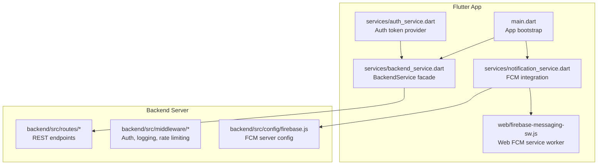
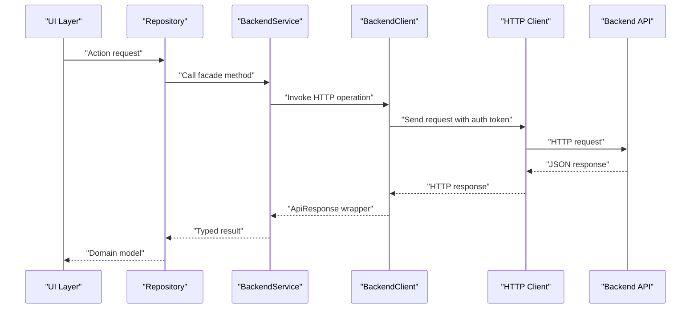
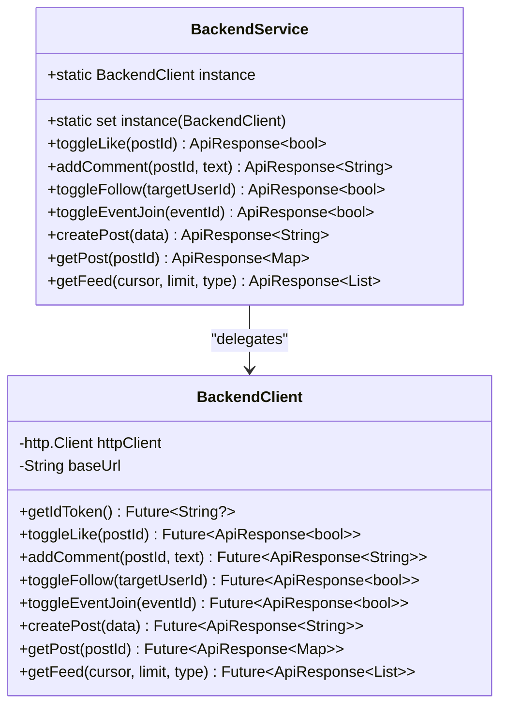
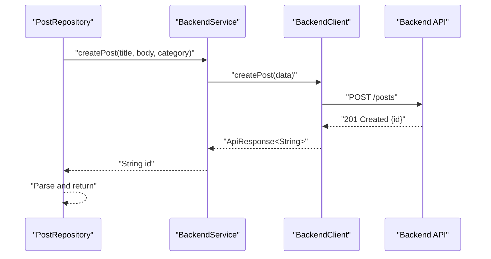
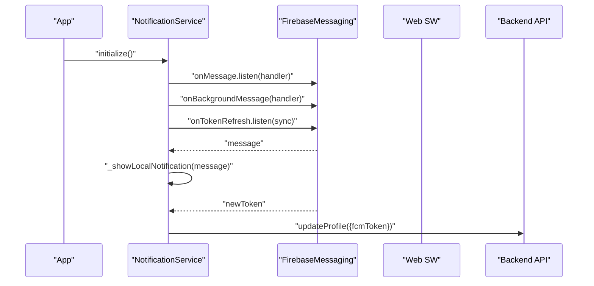
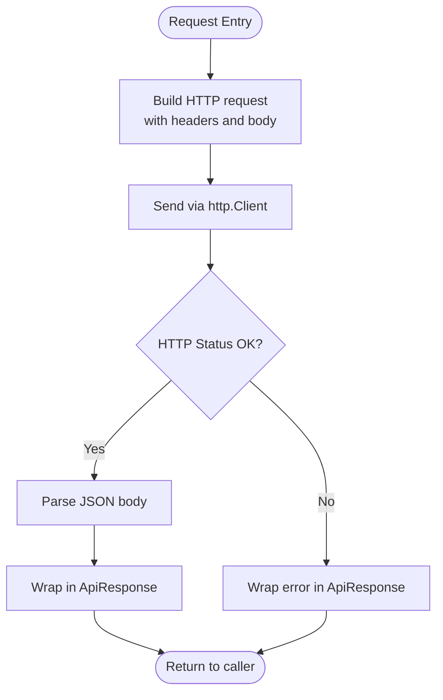
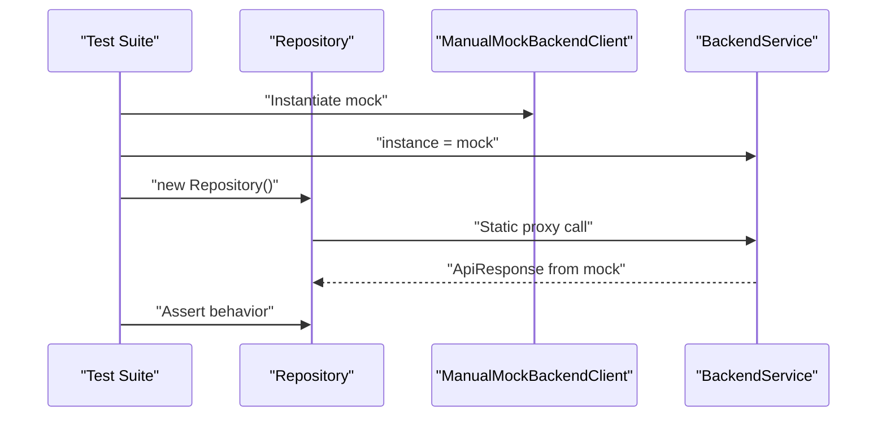
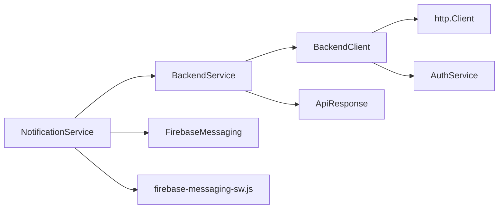

# Data Services and Backend Integration

<cite>
**Referenced Files in This Document**
- [main.dart](file://testpro-main/lib/main.dart)
- [backend_service.dart](file://testpro-main/lib/services/backend_service.dart)
- [notification_service.dart](file://testpro-main/lib/services/notification_service.dart)
- [auth_service.dart](file://testpro-main/lib/services/auth_service.dart)
- [post_repository_test.dart](file://testpro-main/test_backup/repositories/post_repository_test.dart)
- [feed_repository_test.dart](file://testpro-main/test_backup/repositories/feed_repository_test.dart)
- [social_repository_test.dart](file://testpro-main/test_backup/repositories/social_repository_test.dart)
- [user_repository_test.dart](file://testpro-main/test_backup/repositories/user_repository_test.dart)
- [backend_service_test.dart](file://testpro-main/test_backup/services/backend_service_test.dart)
- [firebase_options.dart](file://testpro-main/lib/firebase_options.dart)
- [firebase-messaging-sw.js](file://testpro-main/web/firebase-messaging-sw.js)
- [AndroidManifest.xml](file://testpro-main/build/firebase_messaging/intermediates/aapt_friendly_merged_manifests/debug/processDebugManifest/aapt/AndroidManifest.xml)
</cite>

## Table of Contents
1. [Introduction](#introduction)
2. [Project Structure](#project-structure)
3. [Core Components](#core-components)
4. [Architecture Overview](#architecture-overview)
5. [Detailed Component Analysis](#detailed-component-analysis)
6. [Dependency Analysis](#dependency-analysis)
7. [Performance Considerations](#performance-considerations)
8. [Troubleshooting Guide](#troubleshooting-guide)
9. [Conclusion](#conclusion)

## Introduction
This document describes the data services layer and backend integration architecture for the application. It focuses on the BackendService facade and its underlying BackendClient, the repository pattern implementation for data access, and the integration with Firebase Cloud Messaging (FCM) for notifications. It also covers API endpoint integration, request/response serialization, data transformation, offline handling, caching strategies, error handling patterns, dependency injection approaches, and testing strategies for the data services.

## Project Structure
The data services layer resides in the Flutter application under lib/services and lib/repositories. The backend is implemented in a separate Node.js/Express server under backend/src. The Flutter app initializes Firebase and FCM during startup and integrates notification handling via NotificationService.

**Diagram sources**
- [main.dart](file://testpro-main/lib/main.dart#L12-L22)
- [backend_service.dart](file://testpro-main/lib/services/backend_service.dart#L1-L28)
- [notification_service.dart](file://testpro-main/lib/services/notification_service.dart#L36-L93)
- [firebase_options.dart](file://testpro-main/lib/firebase_options.dart)
- [firebase-messaging-sw.js](file://testpro-main/web/firebase-messaging-sw.js)

**Section sources**
- [main.dart](file://testpro-main/lib/main.dart#L12-L22)

## Core Components
- BackendService: A facade that delegates HTTP requests to a singleton BackendClient. It exposes static proxies for domain actions (likes, comments, follows, events, posts, feeds).
- BackendClient: Implements HTTP calls to backend endpoints, handles authentication tokens, JSON serialization/deserialization, and wraps responses in ApiResponse.
- Repositories: Implement the repository pattern to encapsulate data access logic and coordinate with BackendService. Examples include PostRepository, FeedRepository, SocialRepository, and UserRepository.
- NotificationService: Initializes Firebase, registers foreground/background handlers, displays local notifications, and synchronizes FCM tokens with the backend.
- Auth integration: Auth tokens are injected into BackendClient requests via AuthService.

Key responsibilities:
- API communication: Centralized HTTP client with consistent headers and auth.
- Data transformation: ApiResponse wrapper for typed responses and pagination metadata.
- Offline handling: Repositories can cache data locally and reconcile on reconnect.
- Real-time notifications: FCM integration with foreground/background handlers and token refresh.

**Section sources**
- [backend_service.dart](file://testpro-main/lib/services/backend_service.dart#L1-L28)
- [notification_service.dart](file://testpro-main/lib/services/notification_service.dart#L36-L93)

## Architecture Overview
The system follows a layered architecture:
- Presentation layer: Screens and UI components trigger actions.
- Service layer: BackendService and NotificationService orchestrate data and notifications.
- Repository layer: Encapsulates data access and caching strategies.
- Data transport: HTTP client with JSON serialization and ApiResponse wrappers.
- Backend server: REST endpoints with middleware for auth, logging, and rate limiting.

**Diagram sources**
- [backend_service.dart](file://testpro-main/lib/services/backend_service.dart#L10-L28)
- [backend_service_test.dart](file://testpro-main/test_backup/services/backend_service_test.dart#L24-L43)

## Detailed Component Analysis

### BackendService and BackendClient
BackendService acts as a facade around BackendClient, exposing static proxies for domain operations. BackendClient performs HTTP requests, injects Authorization headers using tokens from AuthService, serializes request bodies, and deserializes responses into ApiResponse objects. This separation enables easy mocking and testing.

**Diagram sources**
- [backend_service.dart](file://testpro-main/lib/services/backend_service.dart#L10-L28)

**Section sources**
- [backend_service.dart](file://testpro-main/lib/services/backend_service.dart#L1-L28)
- [backend_service_test.dart](file://testpro-main/test_backup/services/backend_service_test.dart#L7-L18)

### Repository Pattern Implementation
Repositories encapsulate data access and transform ApiResponse payloads into domain models. Tests demonstrate:
- PostRepository: createPost, deletePost, getPostsPaginated with pagination metadata.
- FeedRepository: getRecommendedFeed returning transformed items.
- SocialRepository: toggleLike/toggleFollow and reactive streams for like/follow state.
- UserRepository: getProfile/updateProfile with typed responses.

**Diagram sources**
- [post_repository_test.dart](file://testpro-main/test_backup/repositories/post_repository_test.dart#L41-L50)

**Section sources**
- [post_repository_test.dart](file://testpro-main/test_backup/repositories/post_repository_test.dart#L1-L86)
- [feed_repository_test.dart](file://testpro-main/test_backup/repositories/feed_repository_test.dart#L1-L46)
- [social_repository_test.dart](file://testpro-main/test_backup/repositories/social_repository_test.dart#L1-L65)
- [user_repository_test.dart](file://testpro-main/test_backup/repositories/user_repository_test.dart#L1-L43)

### Notification Service Integration with Firebase Cloud Messaging
NotificationService initializes Firebase, registers foreground/background handlers, displays local notifications, and synchronizes FCM tokens with the backend. It listens to onMessage for foreground notifications and onBackgroundMessage for background delivery. Token refresh triggers a call to update the user’s profile with the new token.

**Diagram sources**
- [notification_service.dart](file://testpro-main/lib/services/notification_service.dart#L36-L93)
- [firebase-messaging-sw.js](file://testpro-main/web/firebase-messaging-sw.js)

**Section sources**
- [notification_service.dart](file://testpro-main/lib/services/notification_service.dart#L36-L93)
- [firebase_options.dart](file://testpro-main/lib/firebase_options.dart)

### API Endpoint Integration and Data Transformation
BackendClient constructs HTTP requests with proper headers and authentication. Tests verify:
- Correct HTTP method and URL for interactions.
- Authorization header presence with Bearer token.
- JSON body serialization for POST requests.
- ApiResponse wrapping of server responses.

**Diagram sources**
- [backend_service_test.dart](file://testpro-main/test_backup/services/backend_service_test.dart#L24-L43)

**Section sources**
- [backend_service_test.dart](file://testpro-main/test_backup/services/backend_service_test.dart#L1-L43)

### Offline Data Handling and Caching Strategies
Repositories should implement caching to support offline scenarios:
- Local cache: Persist posts, likes, follows, and pagination cursors in a local database (e.g., SQLite or Hive).
- Conflict resolution: On reconnect, reconcile local changes with backend state using optimistic updates and conflict markers.
- Cursor-based pagination: Store nextCursor and hasMore to continue loading when network becomes available.
- Token-based auth: Cache auth state and refresh tokens to minimize re-authentication overhead.

[No sources needed since this section provides general guidance]

### Error Handling Patterns
- ApiResponse wrapper: Standardizes success/error responses and pagination metadata.
- HTTP error mapping: Convert HTTP errors to domain-specific errors.
- Retry/backoff: Implement retry with exponential backoff for transient failures.
- User feedback: Surface actionable errors to the UI while logging detailed diagnostics.

[No sources needed since this section provides general guidance]

### Dependency Injection and Testing Strategies
- Singleton BackendService: Expose a setter for testing to inject a mock BackendClient.
- Mock clients: Subclass BackendClient to stub responses and capture inputs.
- Repository tests: Replace BackendService.instance with a mock client and assert interactions.
- HTTP testing: Use http/testing MockClient to validate request shape and headers.

**Diagram sources**
- [post_repository_test.dart](file://testpro-main/test_backup/repositories/post_repository_test.dart#L34-L38)

**Section sources**
- [post_repository_test.dart](file://testpro-main/test_backup/repositories/post_repository_test.dart#L1-L86)
- [feed_repository_test.dart](file://testpro-main/test_backup/repositories/feed_repository_test.dart#L1-L46)
- [social_repository_test.dart](file://testpro-main/test_backup/repositories/social_repository_test.dart#L1-L65)
- [user_repository_test.dart](file://testpro-main/test_backup/repositories/user_repository_test.dart#L1-L43)
- [backend_service_test.dart](file://testpro-main/test_backup/services/backend_service_test.dart#L1-L43)

## Dependency Analysis
The data services layer depends on:
- Flutter http package for HTTP transport.
- Firebase plugins for messaging and authentication.
- Backend REST endpoints for CRUD and interaction operations.
- Local storage for caching and offline support.

**Diagram sources**
- [backend_service.dart](file://testpro-main/lib/services/backend_service.dart#L1-L28)
- [notification_service.dart](file://testpro-main/lib/services/notification_service.dart#L36-L93)
- [backend_service_test.dart](file://testpro-main/test_backup/services/backend_service_test.dart#L24-L43)

**Section sources**
- [backend_service.dart](file://testpro-main/lib/services/backend_service.dart#L1-L28)
- [notification_service.dart](file://testpro-main/lib/services/notification_service.dart#L36-L93)

## Performance Considerations
- Minimize network calls: Use repository-level caching and batch operations where possible.
- Efficient serialization: Keep request/response payloads compact; avoid unnecessary fields.
- Pagination: Use cursor-based pagination to reduce payload sizes.
- Background processing: Offload heavy work to background handlers and avoid blocking the UI thread.
- Token reuse: Cache tokens and refresh only when needed.

[No sources needed since this section provides general guidance]

## Troubleshooting Guide
Common issues and resolutions:
- FCM token not syncing: Ensure onTokenRefresh handler invokes BackendService.updateProfile and handle exceptions gracefully.
- Background notifications not received: Verify AndroidManifest.xml includes required services and receivers for FCM.
- Authentication failures: Confirm AuthService.getIdToken returns a valid token and BackendClient attaches Authorization header.
- Network errors: Wrap HTTP errors in ApiResponse and implement retry/backoff logic.

**Section sources**
- [notification_service.dart](file://testpro-main/lib/services/notification_service.dart#L76-L85)
- [AndroidManifest.xml](file://testpro-main/build/firebase_messaging/intermediates/aapt_friendly_merged_manifests/debug/processDebugManifest/aapt/AndroidManifest.xml#L14-L30)

## Conclusion
The data services layer employs a clean facade pattern with BackendService delegating to BackendClient, enabling centralized HTTP handling, authentication, and response wrapping. Repositories encapsulate data access and transformation, supporting offline caching and pagination. NotificationService integrates FCM for real-time updates and background processing. The testing strategy leverages mock clients and facade injection to validate behavior in isolation. Together, these components form a robust foundation for scalable backend integration.